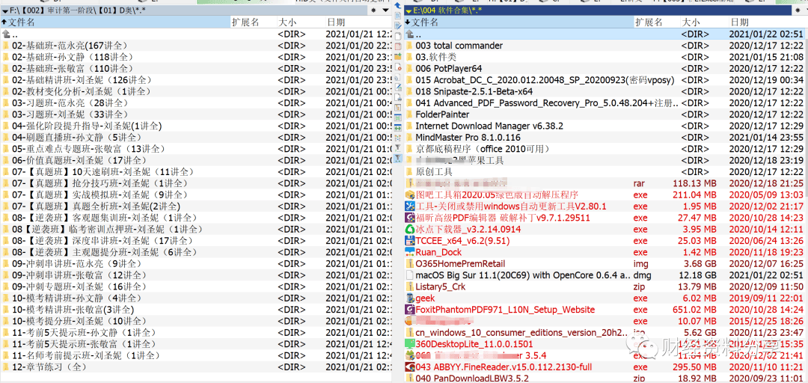
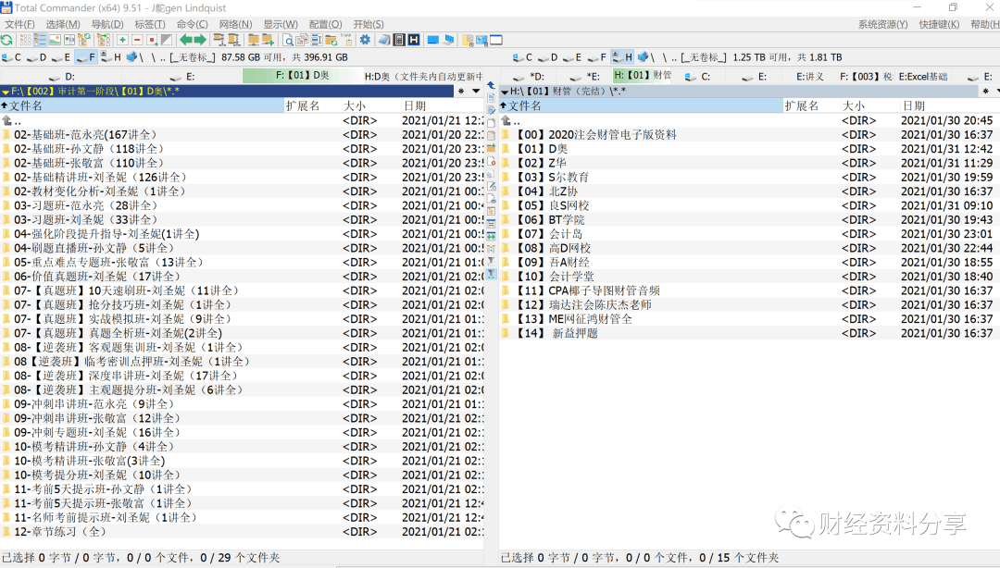

# TC(Total Commander) 文件管理神器

## Total Commander 是一个会显著提高文件操作效率的工具，它实际上并不是“一个”软件，而是一个“资源管理工具集”，里面集成了大量你在管理资源时要用到的工具/功能，并且提供了快捷键操作，让你在处理资源时可以相当方便快捷。而且因为是图形界面的，所以比命令行要方便，更容易使用。  

Total Commander 简称 TC

### TC 教程

英文官网：https://www.ghisler.com/

中文官网 (版本更新不及时)：http://xbeta.info/tc/

善用佳中文教程：http://xbeta.info/studytc/index.htm

飞扬时空增强版：http://blog.sina.com.cn/flyonzone

把善用佳的教程大致浏览一遍，日常使用已足够。

  

相对于资源管理器而言，个人感觉 Total Commander（以下简称 TC）的如下功能和特色具有很大优势：

  

一、**功能全面。**从复制、移动、删除、重命名等基本操作，到内容查看与比较、文件夹同步、搜索、批量重命名、压缩与解压缩、FTP 上传下载、分割与合并、编码与解码、校验和计算与验证等特色功能，一应俱全。

  

二、**双窗口和多标签设计。**这让用户在不同文件夹之间处理文件更加方便和高效。（另外一款软件 Q-Dir 也有此功能）

  

三、**插件系统**。插件的引入，极大地增强了软件功能，几乎可以满足你所有的需求。互联网上还有专门的插件网站（如：TOTALCMD.NET）。

  

四、**部分功能效果可媲美专业软件。**例如：查看器、批量重命名工具、文件夹同步与内容比较功能、FTP 传输工具等等。

  

五、**极强的可定制性。**支持几乎所有主流语言。大多数资源都可以进行个性化设置，例如：界面布局、菜单项、图标、字体、颜色、常用文件夹内容、快捷键、第三方软件集成和调用等等。可以说，每一个 TC 用户都可以拥有一个属于自己的 TC。

  

六、**持续更新并与时俱进**。例如：支持集成 Everything 搜索工具、更好支持高分辨率屏幕。

  

  

      虽说功能是第一位吧，我是真受不了 TC 那丑陋的界面，有些杂乱：  

  

一、图标过小。  

  

二、不同文件显示颜色不同。花里胡哨的，没**巨硬**的资源管理器的朴实。

  

  

当然这两点是可以自己配置的。

  

  

  

以下是网上经验总结：  

## 备份 TC 设置

备份：打开 tc 的安装目录，一般只需要备份 Wincmd.ini 和 User 文件夹

还原：打开 tc 的安装目录，覆盖 Wincmd.ini 和 User 文件夹

Wincmd.ini TC 的系统配置

User/ 用户的个性化设置

User/User.ini 中保存着用户的收藏夹。

## 定制属于你的 TC

### 在当前路径打开 CMD

1、在工具栏点击右键，选择 "更改" 弹出更改工具栏面板  
2、点击添加，在命令栏中输入 cm\_ExecuteDos，选择图标

#### 方法一

拖动应用程序.exe 到工具栏；

#### 方法二

工具栏右键/更改，设置相应的参数

  

## 常用快捷键

Ctrl+D：下拉列表打开常用目录，类似收藏夹功能

Ctrl+D +A 添加当前目录到常用目录\[可以设置二级菜单及快捷键\]

F10 比较文本内容

Alt+F11 弹出磁盘下拉列表

Alt+F12 更改工具栏

Ctrl+S 在当前目录内搜索文件

Tab 左右窗口切换，TC 默认分两栏样式

F3 查看文件

Alt+ F7 搜索文件

Ctrl+ L 神一般的速度查看目录统计信息

### 快捷键设置

http://xbeta.info/studytc/tc002.htm 

  

## **TC 强大的****排序**

### 组合排序

需求：先按文件类型排序，再按修改日期，再按文件名排序，

### 排序方法

先点“扩展名”标签，再按住 ctrl 点“日期”“文件名”。

## TC 强大的插件

插件地址：

更多插件 (非官方)：http://totalcmd.net/

### 插件安装方法

放到 TC 目录/Plugins/，双击\*.wlx 安装

  

  

公众号回复 TC，获取链接或点击阅读原文下载。