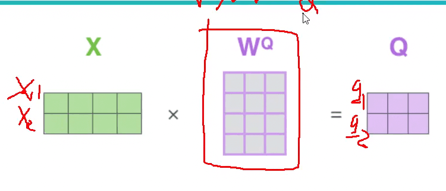

# Transformer 和 BERT 模型介绍

## 发展脉络

NLP 领域的模型发展脉络如下：

-   Word2Vec
    
-   Transformer (T)
    
-   BERT
    
-   GPT
    

## 词义随上下文变化的问题

在不同的语境下，同一个词可能有不同的含义。如何处理这个问题是 NLP 领域的一个重要课题。


例如，在下面两个句子中，“it” 指代的对象是不同的：

-   The animal didn’t cross the street because it was too tired.
    
-   The animal didn’t cross the street because it was too wide.
    

## Transformer 编码器

Transformer 中最主要的计算单元是 Attention（注意力机制），即从一个样本中提取最重要的信息部分。


与 RNN 不同，RNN 中一个 token 只和周围的 token 有关系，而在 Transformer 中，我们是放眼全局的。

### Self-Attention 的计算过程

以句子 “今天晚上吃河马” 为例，让 “今天” 这个词分别与 “今天”、“晚上”、“吃”、“河马” 计算权重，得到类似 0.5, 0.1, 0.3, 0.1 这样的权重值。

原来的词向量只考虑自己的特征，现在的词向量整合了其他词的特征，相当于有了上下文信息。整合前后的向量维度不变（假设均为 100 维），因为整合是加权求和的操作。这就是 Self-Attention：

-   输入：每个词的特征
    
-   输出：带有全局信息（其它词的影响）的每个词的特征
    

### 权重的计算方法


假设输入是两个词 `` $x_{1}$ `` 和 `` $x_{2}$ ``，它们都是 4 维向量。对于 `` $x_{1}$ ``，我们要查询它和其他词的关系。每个词都有两个向量：

1.  Query 向量 `` $q$ ``，用于查询
    
2.  Key 向量 `` $k$ ``，用于被查询
    

查询的结果向量称为：

1.  Value 向量 `` $v$ ``

两个向量的内积（点积）越大，说明它们的相似度越高。因此，我们可以用内积来计算权重：

1.  从 `` $x_{1}$ `` 出发，用 `` $q_{1}$ `` 询问 `` $k_{1}$ ``：`` $q_{1} \cdot k_{1}$ ``，这表示 `` $x_{1}$ `` 与自身的相似度，得到一个权重。
    
2.  再用 `` $q_{1}$ `` 询问 `` $k_{2}$ ``：`` $q_{1} \cdot k_{2}$ ``，这表示 `` $x_{1}$ `` 与 `` $x_{2}$ `` 的相似度，得到另一个权重。
    
3.  现在我们得到了两个标量权重值。
    

### Query、Key、Value 向量的来源

`` $x_{1}$ `` 和 `` $x_{2}$ `` 是已知的输入，但 `` $q_{1}$ ``, `` $q_{2}$ ``, `` $k_{1}$ ``, `` $k_{2}$ `` 等向量是如何得到的呢？



我们初始化权重矩阵 `` $W^{Q}$ ``, `` $W^{K}$ ``, `` $W^{V}$ ``，分别表示从输入 `` $X$ `` 到 `` $Q$ ``, `` $K$ ``, `` $V$ `` 的线性变换。

`` $q_{1}$ ``, `` $q_{2}$ `` 最初是随机初始化的，然后通过 `` $X$ `` 与 `` $W^{Q}$ `` 的乘积得到 `` $Q$ ``：

```plain

这实际上就是一个全连接层。同样地，我们可以得到和向量：这实际上就是一个全连接层。同样地，我们可以得到$K$和$V$向量：XW^K=KXW^V=VYou can't use 'macro parameter character #' in math modeYou can't use 'macro parameter character #' in math mode
```