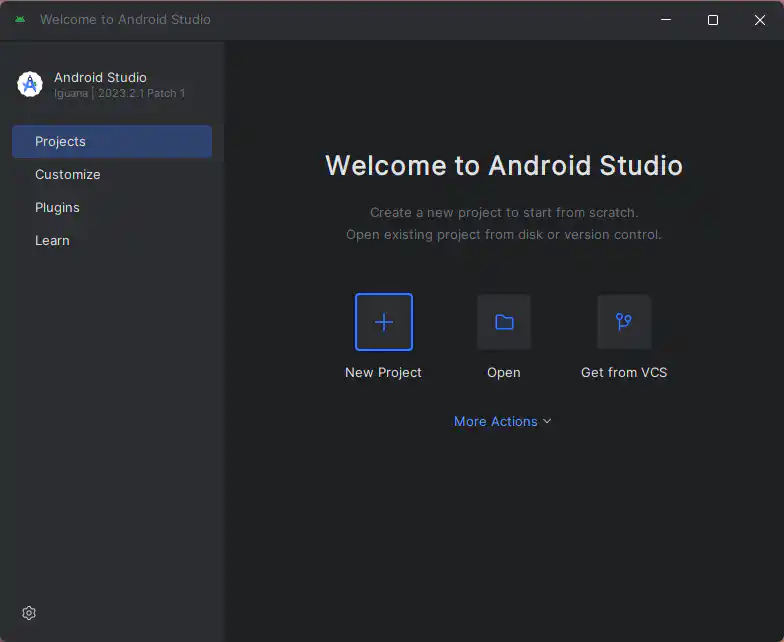
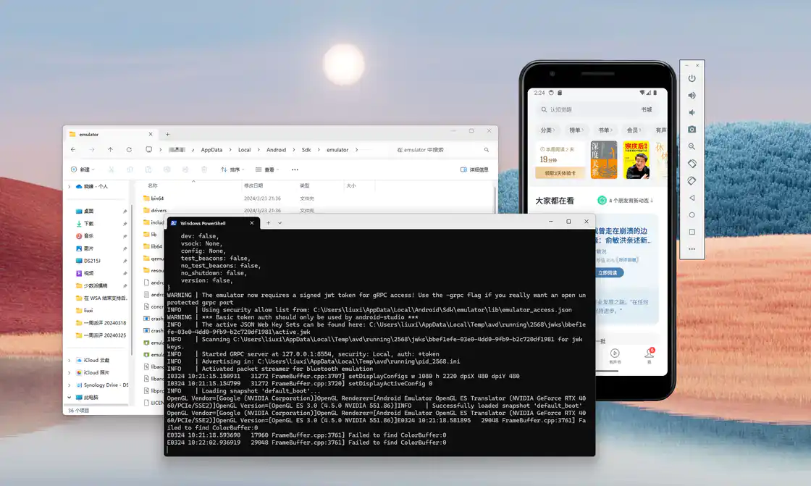
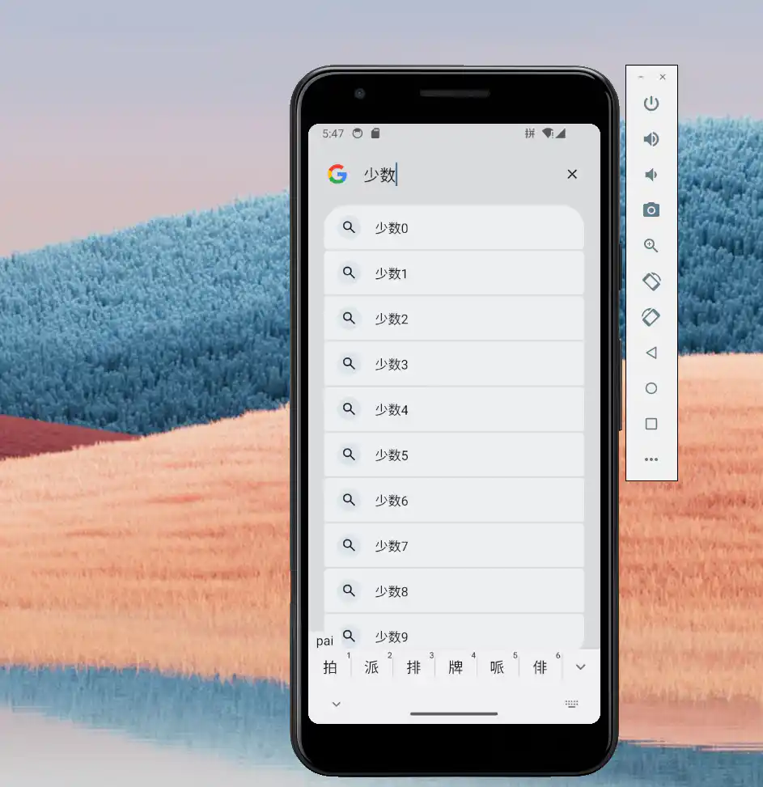
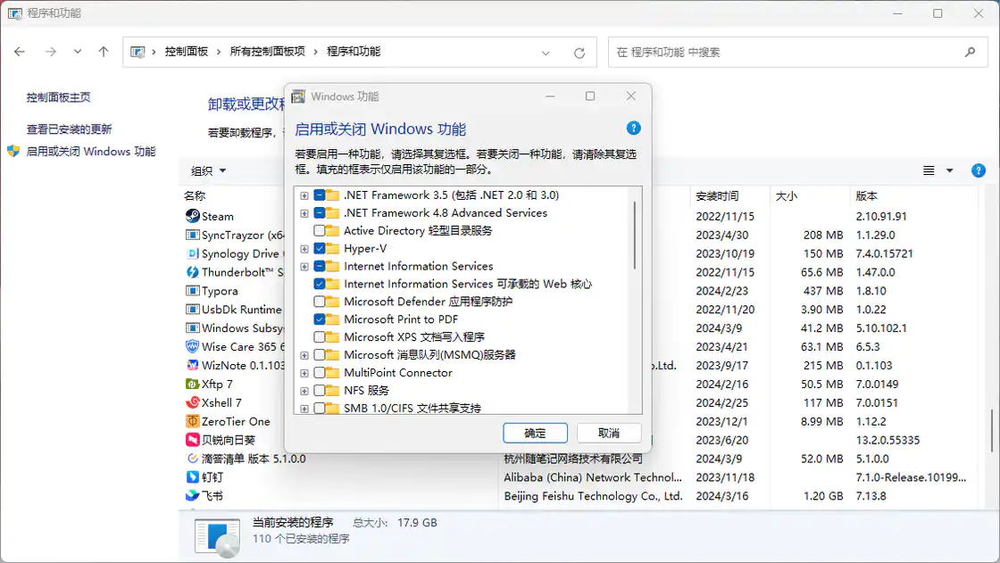
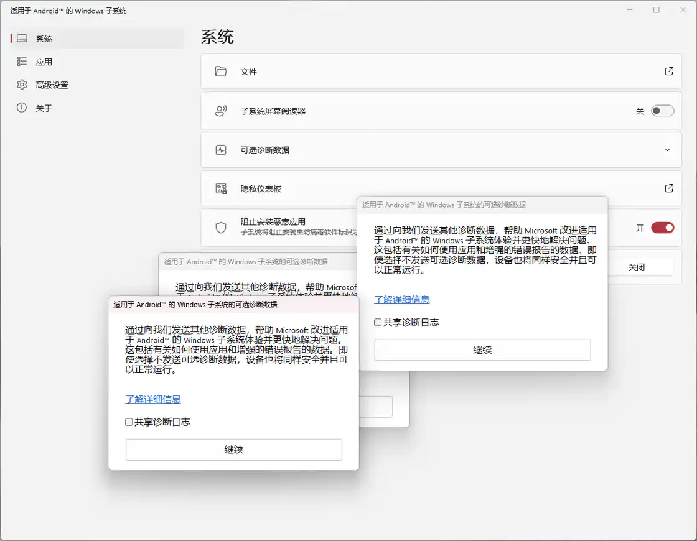

# WSA 谢幕之际，盘点 PC 运行 Android 应用解决方案

Windows Subsystem for Android (WSA) 曾经是 Windows 11 最受瞩目的新功能之一。可惜的是，这项备受好评的功能终究没有逃过微软的「砍刀」。今年 3 月 4 日，微软[宣布](https://sspai.com/link?target=https%3A%2F%2Flearn.microsoft.com%2Fen-gb%2Fwindows%2Fandroid%2Fwsa%2F%3FranMID%3D46128%26ranEAID%3DkXQk6*ivFEQ%26ranSiteID%3DkXQk6.ivFEQ-9mwLZCitPqKSBymqm_R3Eg%26epi%3DkXQk6.ivFEQ-9mwLZCitPqKSBymqm_R3Eg%26irgwc%3D1%26OCID%3DAIDcmm549zy227_aff_7794_1243925%26tduid%3D%2528ir__g6anjllybskfdx9lavlr2e1hsf2x9bjz2fg2mt0200%2529%25287794%2529%25281243925%2529%2528kXQk6.ivFEQ-9mwLZCitPqKSBymqm_R3Eg%2529%2528%2529)将从一年后的 2025 年 3 月 5 日起，停止对 WSA 提供支持。

微软选择砍掉 WSA 的原因可能是多方面的。从商业利益上考量，对 WSA 的投入几乎没有什么回报。从实用程度上，日常用户可能更需要的是 Windows 和 Android 之间更方便的跨设备的协同，而不是在 Windows 系统中直接运行 Android 应用。

回顾之下，WSA 是一个优点和缺点都很明显的功能。不可否认，WSA 在一定程度上可以算是普通用户在 Windows 上运行 Android 应用的最佳选择，支持应用窗口化运行，支持 GPU 加速，并允许实现跨架构的应用运行，设计上也和 Windows 11 使用体验充分融合。但这项技术也并非完美无缺：对于设备硬件性能要求较高，需要大内存支持（16GB 才能良好体验），完全不支持 GMS，也支持用户使用率最高的 Windows 10。

但既然 WSA 的命运已经终结，一个值得关心的问题是：还剩下哪些选择可以让我们继续在 Windows 上使用 Android 应用呢？

## **最「官方」的选择：Android Studio**

-   优点：可选多种 Android 版本；安装应用较为方便
-   缺点：需要安装整个 IDE；无中文操作界面；对主机系统硬件要求高

要说 Android 模拟器中最为官方的，自然还要数 Google 推出的 [Android Studio](https://sspai.com/link?target=https%3A%2F%2Fdeveloper.android.com%2Fstudio) 开发工具中的内置功能。

只是为了运行 Android 应用就动用官方的 IDE 工具，听上去倒是有点「杀鸡焉用牛刀」之感，但比起其他的解决方案，这个最官方的 Android 模拟器确实提供了其他方案难以比拟的优势：可以选择最新版本的 Android 模拟器，甚至目前还处于测试阶段的 Android 系统也可以提前体验。

不过 Google 并没有提供完整的单个模拟器运行环境，因此想要体验，唯一的办法就是安装 Android Studio 这个 IDE。Android Studio 是 Jetbrains 的 IDE 家族一员，通过 Jetbrains Toolbox 可以很方便的下载并完成 Android Studio 的安装。

安装完成后我们首先需要启动 Android Studio 并初始化，在这个阶段会询问你是否需要下载 Android 的 SDK，这里默认选择并等待其他子组件组件安装完成即可。



下面要做的是这里找到Android Studio 的模拟器安装目录，如果你和我一样使用 Jetbrains Toolbox 这个工具来管理和安装的话，那么模拟器对应的目录就在  `C:\Users\yourname\AppData\Local\Android\Sdk\emulator`

用文件资源管理器打开以上的目录，然后右键在当下目录打开终端，输入如下命令来检查可用的模拟器版本：

```shell
.\emulator.exe -list-avds
```

例如，我遵循默认选项，安装了对应 APT 34 的 Android 模拟器。因此，接下来在终端中输入如下命令启动模拟器：

```shell
.\emulator.exe -avd Pixel_3a_API_34_extension_level_7_x86_64
```

点击模拟器右侧的开机按钮就可以 Android 系统了。



遗憾的是，Android Studio 的模拟器不支持 WSA 那样的每个应用一个窗口，只能在一个手机的边框内操作。好在安装第三方应用倒是远比 WSA 方便，将 APK 安装包直接从拖到 Android 模拟器中即可。



或许是官方出品的缘故，无论应用是否 X86 架构，运行都是比较流畅的。如果要输入中文，需要先添加中文输入法，就可以直接用电脑键盘输入中文了。再结合模拟器中自带的快捷键，运行一般的 Android 应用体验还是很不错的。

但如果是运行游戏，Android Studio 的模拟器就显得力不从心了。这倒不是性能问题（模拟器的画面渲染基于 OpenGL），而是无法通过键盘映射的方式来模拟多点触控的游戏方式，相信在手机上玩 MOBA 类游戏的玩家应该对此深有体会。

## **民间版 WSA 增强补丁：WSABuilds**

-   优点：继承自 WSA 的定制化解决方案；体验上接近 WSA；支持 Google apps；不受限 Windows 系统版本。
-   缺点：受限于 WSA 停服， WSA 的 Android 版本不再更新；存在 Windows 更新导致完全不可用；应用安装不便。

虽然 WSA 停止支持了，但并不意味着立刻不能用，只是微软不再官方提供安装渠道，现有安装也不会再收到更新。如果不是特别介意这一点，至少短期内还是可以使用一些民间版本作为更好方案出现之前的过渡。

为此，我比较推荐的是 [WSABuilds](https://sspai.com/link?target=https%3A%2F%2Fgithub.com%2FMustardChef%2FWSABuilds)。它最大的优点在于傻瓜化，无论是你希望给 WSA 加上 GMS 服务、开启 Magisk 或是打开 root 权限，开发者都将需要的组件按需打包好了，你只需要按需下载对应的版本然后跟着步骤安装即可。它也打破了原来 WSA 仅支持 Windows 11 的限制，即便是 Windows 10 的设备，只要符合基本硬件要求就可以安装使用。



整体安装过程大致是：首先在 Windows 系统中的「控制面板」>「启动或关闭 Windows 功能」中，将「Hyper-V」以及「虚拟机平台」开启。接着在项目的 Github 的 releases 中根据自己的系统版本和需要下载相应的 7z 压缩包，将其解压缩到你的文档目录下面，并将文件夹名称重新命名成`WSA`。



最后双击运行 `Run.bat`等待所有的组件安装完成，安装后如果启动 WSA 的窗口和一个同意诊断信息的窗口就说明已经安装完成了。


这个改装过的 WSA 和原版实际上用起来差别并不大。由于官方的 Amazon 市场也将停服，如果需要安装应用，可以通过 WSA Tools 这样的工具。

## 第三方运行平台

其实早在 WSA 之前，市面上就有很多 Android 应用运行在 Windows 上的收费解决方案。这里比较几种还在活跃更新的，供读者参考。

### **BlueStacks**

-   优点：安装简单；丰富游戏选择；针对游戏场景适配；多种 Android 版本可选
-   缺点：暂无