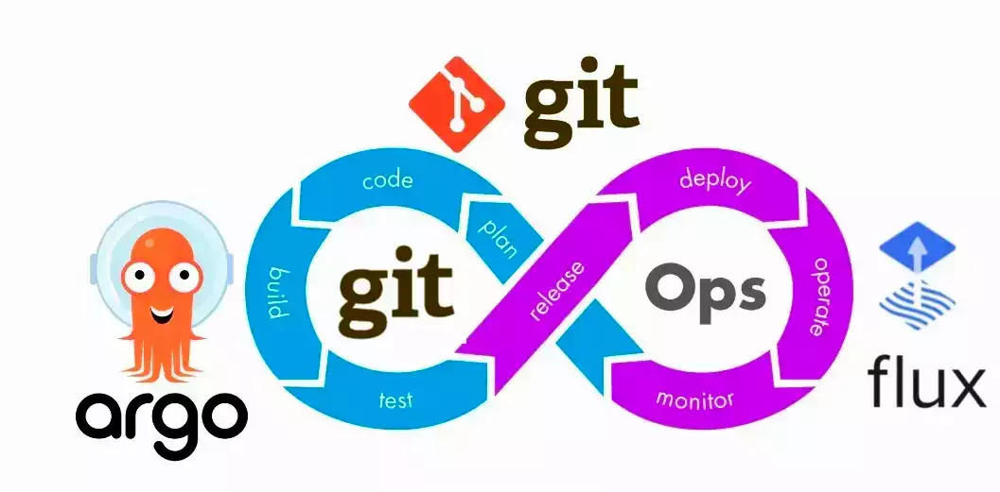
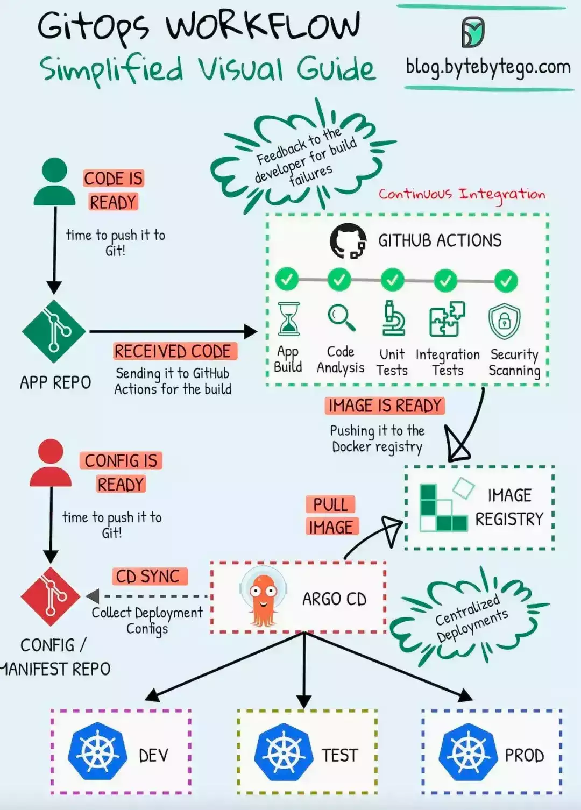

# Wait，GitOps 是什么？

`GitOps` 是一组使用 Git 作为唯一真实来源来管理基础设施和应用程序配置的实践方法，以代码形式交付基础设施。换句话说——基础设施的版本控制方式。

## 谁负责？

DevOps 团队应该负责实施 GitOps 实践，而常规开发人员应积极参与该过程。

**开发人员**通过提交代码和配置更改来贡献，从而直接影响其构建的应用的部署和运行。

## 让我们来看一个例子

假设你正在更新一个运行在 Kubernetes 上的应用。你可以直接在 `deployment.yaml` 中更改镜像地址来更新应用版本，如下所示：

```plain
-
image:
myapp:v2.0
```

然后提交和推送配置，Argo CD 观察到更改后，更新你的部署，这样你的应用就会运行新版本。轻松又快捷。


## 为什么在2024年选择GitOps？

-   **提交历史**：查看你的基础架构更改的完整历史记录。
    
-   **消除错误**：通过简单的还原回滚到先前状态。
    
-   **Auto-Pilot**：将更改推送到 Git 以自动应用更改。
    
-   **保持同步**：您的实时环境与Git存储库中的内容完全匹配。如果有人试图直接在云端偷偷改变，GitOps会说“不，不允许”，并将这些更改还原回来。
    

## GitOps的关键工具

GitOps 是关于使用 Git 作为基础架构即代码（IaC）的工具，以下是这种方法的重要工具：

1.  `Argo CD` - 将您的 Kubernetes 部署与您的 Git 存储库同步。它自动化部署过程以匹配定义在 Git 中的状态。
    
2.  `Flux` - 类似于 Argo CD，它监视您的 Git 存储库的更改并自动应用它们到您的 Kubernetes 集群中。
    
3.  `Terraform` - 不仅适用于 Kubernetes，还允许您将云基础架构作为代码进行管理。它可以很好地与 GitOps 协同工作，通过在 Git 中跟踪基础架构更改。
    

这些工具简化了基础架构管理，确保部署一致且自动化。



## GitOps与Argo CD的实际操作

1.  安装：准备好Kubernetes集群了吗？将 Argo CD 部署到其中。
    
2.  存储库：将您的应用程序的期望状态放入一个Git存储库中。
    
3.  连接关系：将Argo CD与您的存储库和集群连接起来。
    
4.  CI/CD集成：推送镜像更新或配置更改？Argo CD会捕捉到，并保持您的集群更新。
    


## 最佳实践

-   **可重复部署**：通过 Helm 实现跨环境的一致性。它可以为您的 Kubernetes 应用创建模板，使部署和更新变得简单明了。
    
-   **保护您的工作流程**：使用 Sealed Secrets 对 Git 中的数据进行加密，保护您的配置。在 Kubernetes 中实施基于角色的访问控制（RBAC）以控制谁能做什么。
    
-   **不可变基础架构**：绝不手动更改配置，只能通过 Git 进行更改，以确保所有内容都可审核，还原简单。
    

通过专注于这些实践方法和工具，您可以优化和保护您的GitOps工作流程，确保效率和稳定的基础架构。



谢谢阅读！下次在更改云配置或部署应用时，请考虑使用 GitOps。

> 原文地址：https://medium.com/nmc-techblog/wait-whats-gitops-a9c257162df8

[](http://mp.weixin.qq.com/s?__biz=MzU4MjQ0MTU4Ng==&mid=2247511356&idx=1&sn=5c12e4197b3274fdcd7132441957ee92&chksm=fdbaa221cacd2b3749745cae91c7feef1fb9c04775b8fd914e1f7f057b02ee9ebe1b11e9dfd5&scene=21#wechat_redirect)