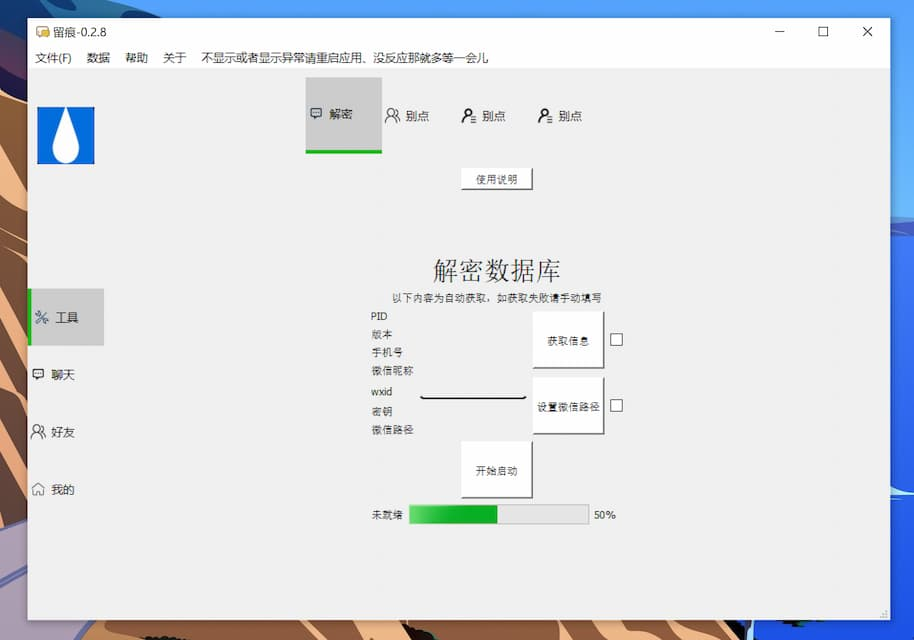
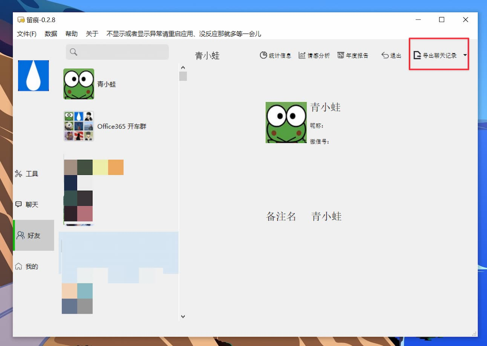
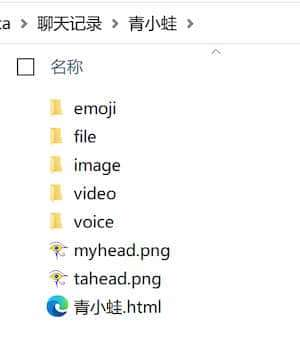
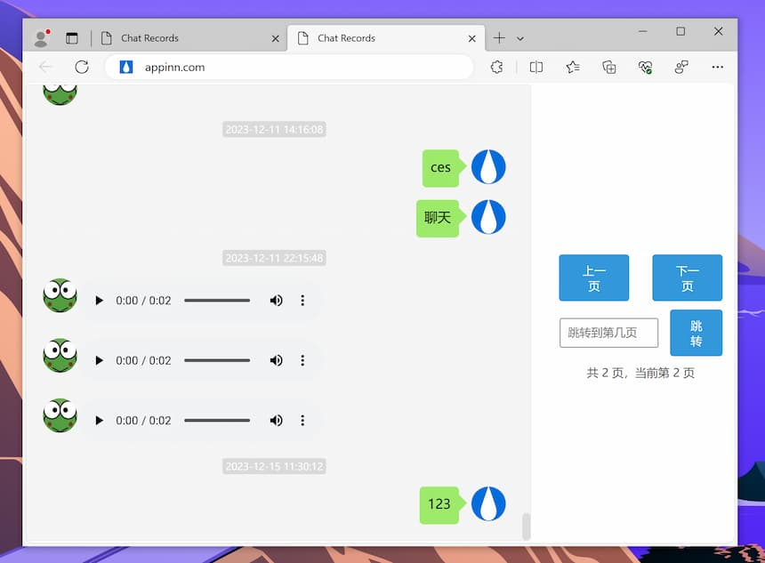

# WeChatMsg 留痕 - 支持语音聊天，微信聊天记录导出工具[Windows]

原始链接在： [WeChatMsg 留痕 - 支持语音聊天，微信聊天记录导出工具\[Windows\] - 小众软件 51](https://www.appinn.com/wechatmsg/)  
  

**WeChatMsg** 是一款适合于 Windows 的微信聊天记录导出工具，傻瓜式操作，目前已支持导出文本、图片、视频、表情包、**语音聊天**，并且可导出为 HTML、Docx、csv、TXT 文件，帮你保留与某人的微信记忆，包括语音。@[Appinn 51](https://www.appinn.com/wechatmsg/)

  

青小蛙折腾这款微信聊天记录导出工具有一段时间了，终于在最近两天成功了。

并且有一个好消息，就是最新版本支持导出语音聊天了。

## 使用方法

首先需要在 Windows 上安装最新版本的微信 PC 版，并将你的聊天记录从手机上备份过来（使用微信自带备份/恢复工具即可）

然后安装并运行 **WeChatMsg**，中文名叫留痕，目前最新 0.2.8。第一次运行较慢，见到这个页面：

点击获取信息，有内容显示后再点击开始启动就行了。需要等待一段时间，可能会假死。

然后就能去**好友**界面导出聊天记录了（其他界面没有什么用）

推荐导出为 .html 格式，这样的话，你所有的聊天内容都会在文件夹里：

但注意不要尝试导出过大的聊天，会…卡的很死的。比如上图那个开车群，完全导不出来（最后仅导出文本的情况下成功了）

然后这个 青小蛙.html 打开后是这个样子的：

就很完美。

## 获取

-   [GitHub 84](https://github.com/LC044/WeChatMsg/)
-   [搬运 38](https://d.appinn.com/wechatmsg/)

- - -

前几天青小蛙在公众号里提到这个工具的时候，就有同学在问：能不能备份语音聊天啊？我手机里的聊天记录已经放了很久了，想删除，又不想丢语音…

当然更多的同学，只是想备份一下聊天记录，这些回忆，并不只是属于微信，它属于对话的双方。

原文：https://www.appinn.com/wechatmsg/

就像开发者这样写的：

> 我深信有意义的不是微信，而是隐藏在对话框背后的一个个**深刻故事**。未来，每个人都能拥有AI的陪伴，而你的数据能够赋予它有关与你过去的珍贵记忆。我希望每个人都有将自己的生活痕迹👨‍👩‍👦👚🥗🏠️🚴🧋⛹️🛌🛀留存的权利，而不是将之遗忘💀。
> 
> AI的发展不仅仅是技术的提升，更是情感💞的延续。每一个对话、每一个互动都是生活中独一无二的片段，是真实而动人的情感交流。因此，我希望AI工作者们能够**善用这些自己的数据**，用于培训独特的、属于个体的人工智能。让**个人AI成为生活中的朋友**，能够理解、记录并分享我们的欢笑、泪水和成长。
> 
> 那天，AI不再是高不可攀的存在，而是融入寻常百姓家的一部分。因为**每个人能拥有自己的AI**，将科技的力量融入生活的方方面面。这是一场关于真情实感的革命，一场让技术变得更加人性化的探索，让我们共同见证未来的美好。
> 
> **所以《留痕》**