# Windows 定制 Terminal 实践


-   1\. 前言
    
-   2\. 安装 Windows Terminal
    
-   3\. 安装 nerd-fonts
    
-   4\. Microsoft store 安装 powershell
    
-   5\. 改变终端背景颜色
    
-   6\. 安装 scoop
    
-   7\. 安装 git
    
-   8\. 安装 Neovim
    
-   9\. 设置别名
    
-   10\. 安装 oh My Posh
    
-   11\. 自定义 prompt（path）
    
-   12\. 安装 nodejs
    
-   13\. 安装 Terminal Icons
    
-   14\. 安装 z Directory jumper
    
-   15\. 安装 PSReadLine
    
-   16\. 安装 Fzf - 模糊搜索
    
-   17\. 配置 which 命令
    
-   18\. 选择 oh-my-posh themes
    

## 1\. 前言

`windows terminal` 相比其他终端更加美观、简洁，而且它的开放性使你可以自由的配置定制终端的风格，其中还有充满现代化的界面、完整的字体字符渲染机制（包括 `Emoji`）、GPU 加速和 Fluent 设计风格等等，如果你尊崇`简约`、`唯美`却不失丰富的软件工具，`windows terminal` 值得你去关注它！

历经两天，我学习完成了来自日本的Takuya 🐾 devaslife\[1\]（独立开发者、油管博主）的视频内容：How to set up PowerShell prompt with Oh My Posh on Windows 11\[2\]，并对此记录了关于实践 `windows terminal` 的学习笔记，分享给大家。

，时长39:34

`Takuya`使用的是min\[3\] 浏览器，我也下载体验了一番，确实小巧、简洁。

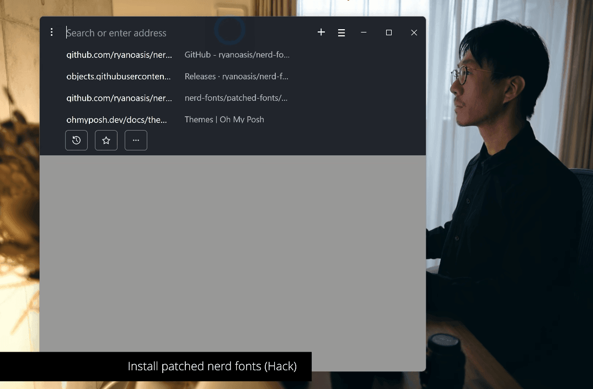

## 2\. 安装 Windows Terminal

直接从 `Microsoft Store` 安装Windows Terminal\[4\]即可。

如果你刚刚安装完成，想要快速对它有一个快速入门的了解，除了翻阅官网Windows Terminal Docs\[5\]，你还可以从我的博客浏览简单的Windows Terminal 界面设置\[6\]以及Windows Terminal 快捷键\[7\]。

## 3\. 安装 nerd-fonts

ryanoasis/nerd-fonts\[8\]是一个用大量字形（图标）修补开发人员目标字体的项目。特别是从流行的“标志性字体”（如Font Awesome、Devicons、Octicons等）添加大量额外字形\[9\]。

我们下载这个`Hack`版本

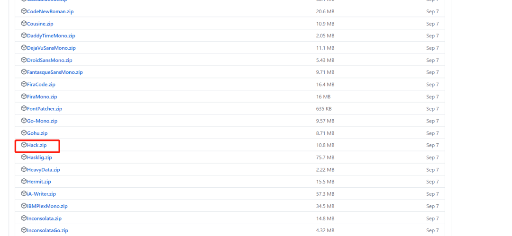

在这里插入图片描述

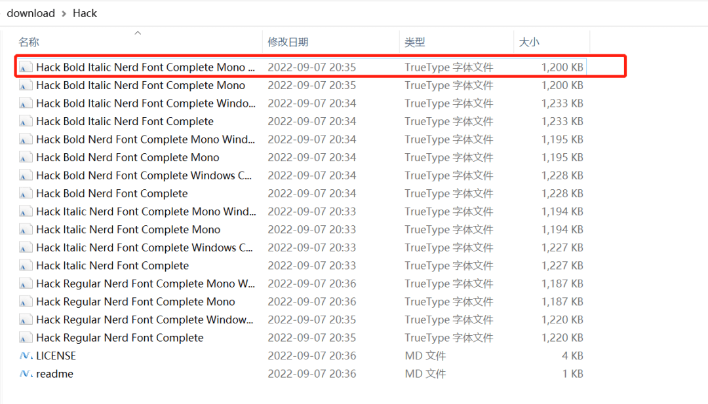

打开安装

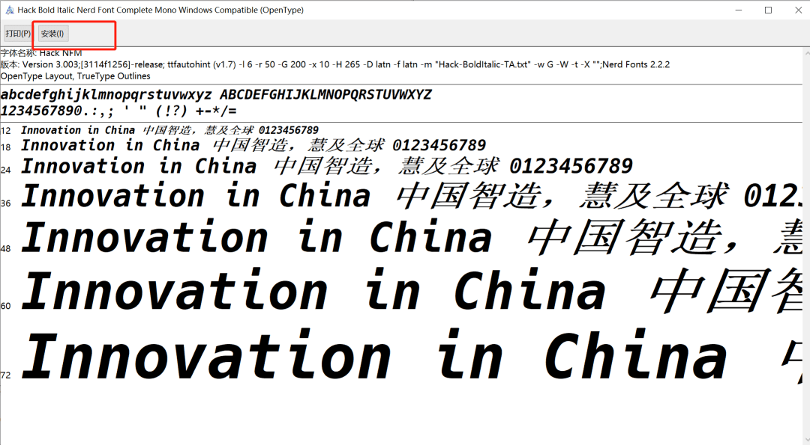

配置最新字体

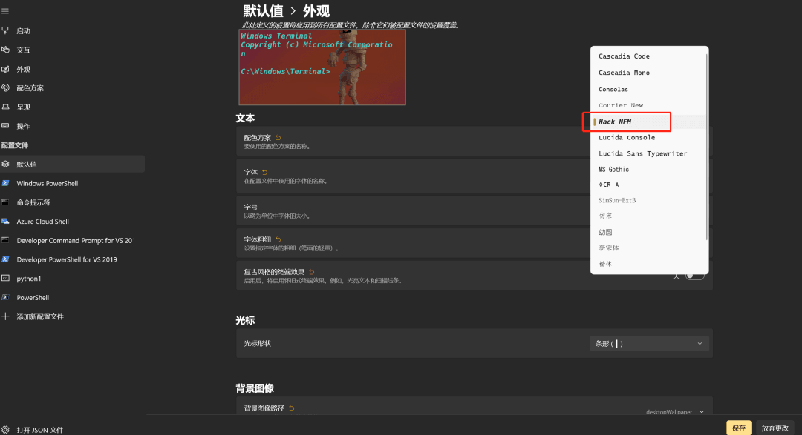

如不这样做，后面在安装`oh-my-posh`后，会出现乱码。

## 4\. Microsoft store 安装 powershell

`PowerShell` 并非 `Windows PowerShell`，它们存在一定的差别，详情请参考：

-   • Differences between Windows PowerShell 5.1 and PowerShell 7.x\[10\]
    

我们安装最新的 `Powershell`


查看已安装成功

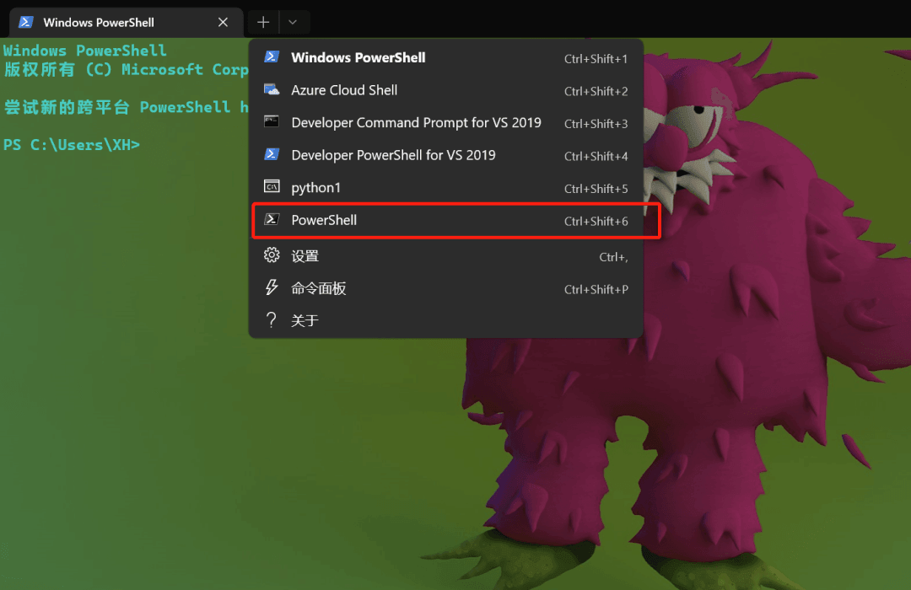

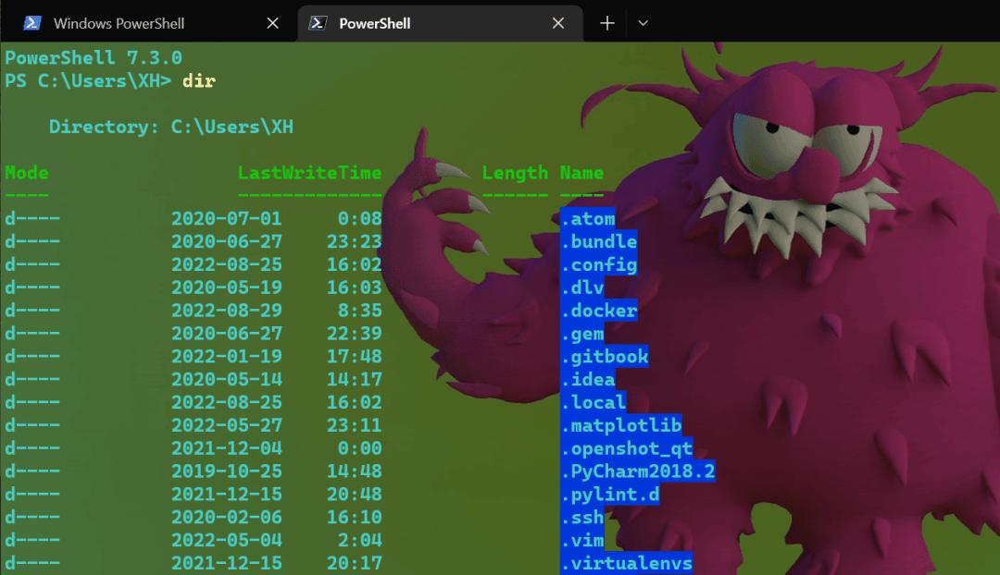

修改启动配置为`powershell`

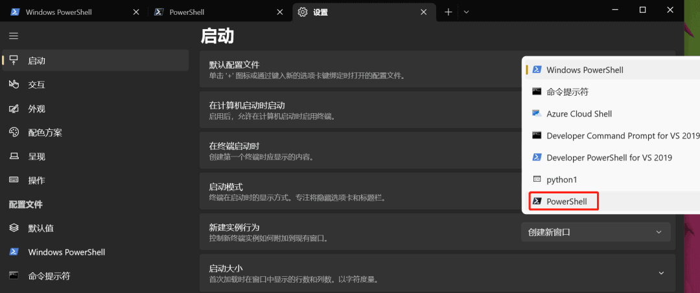

## 5\. 改变终端背景颜色

打开配置文件`setting.json` 绝对路径：`%LOCALAPPDATA%\Packages\Microsoft.WindowsTerminal_8wekyb3d8bbwe\LocalState\settings.json`


复制一份`One Half Dark` 的背景配置并修改

```plain
        {
            "background": "#001B26",  #修改
            "black": "#282C34",
            "blue": "#61AFEF",
            "brightBlack": "#5A6374",
            "brightBlue": "#61AFEF",
            "brightCyan": "#56B6C2",
            "brightGreen": "#98C379",
            "brightPurple": "#C678DD",
            "brightRed": "#E06C75",
            "brightWhite": "#DCDFE4",
            "brightYellow": "#E5C07B",
            "cursorColor": "#FFFFFF",
            "cyan": "#56B6C2",
            "foreground": "#DCDFE4",
            "green": "#98C379",
            "name": "One Half Dark (modded)", #修改
            "purple": "#C678DD",
            "red": "#E06C75",
            "selectionBackground": "#FFFFFF",
            "white": "#DCDFE4",
            "yellow": "#E5C07B"
        },
        {
            "background": "#282C34",
            "black": "#282C34",
            "blue": "#61AFEF",
            "brightBlack": "#5A6374",
            "brightBlue": "#61AFEF",
            "brightCyan": "#56B6C2",
            "brightGreen": "#98C379",
            "brightPurple": "#C678DD",
            "brightRed": "#E06C75",
            "brightWhite": "#DCDFE4",
            "brightYellow": "#E5C07B",
            "cursorColor": "#FFFFFF",
            "cyan": "#56B6C2",
            "foreground": "#DCDFE4",
            "green": "#98C379",
            "name": "One Half Dark",
            "purple": "#C678DD",
            "red": "#E06C75",
            "selectionBackground": "#FFFFFF",
            "white": "#DCDFE4",
            "yellow": "#E5C07B"
        },
```

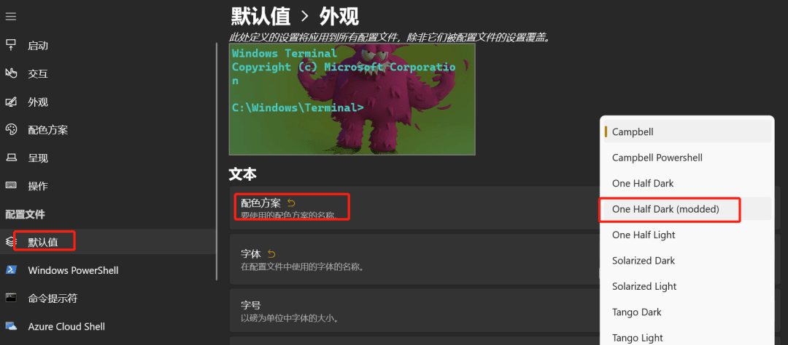

## 6\. 安装 scoop

官网：https://scoop.sh/ 一个为`windows`而生的命令行安装工具。

```plain
PS C:\Users\XH> iwr -useb get.scoop.sh | iex
Initializing...
Downloading...
Extracting...
Creating shim...
Adding ~\scoop\shims to your path.
Scoop was installed successfully!
Type 'scoop help' for instructions.
PS C:\Users\XH> scoop install curl sudo jq
Installing '7zip' (22.01) [64bit] from main bucket
7z2201-x64.msi (1.8 MB) [=====================================================================================] 100%
Checking hash of 7z2201-x64.msi ... ok.
Extracting 7z2201-x64.msi ... done.
Linking ~\scoop\apps\7zip\current => ~\scoop\apps\7zip\22.01
Creating shim for '7z'.
Creating shim for '7zFM'.
Creating shim for '7zG'.
Creating shortcut for 7-Zip (7zFM.exe)
Persisting Codecs
Persisting Formats
Running post_install script...
'7zip' (22.01) was installed successfully!
Notes
-----
Add 7-Zip as a context menu option by running: "C:\Users\XH\scoop\apps\7zip\current\install-context.reg"
Installing 'curl' (7.86.0_2) [64bit] from main bucket
curl-7.86.0_2-win64-mingw.tar.xz (6.0 MB) [===================================================================] 100%
Checking hash of curl-7.86.0_2-win64-mingw.tar.xz ... ok.
Extracting curl-7.86.0_2-win64-mingw.tar.xz ... done.
Linking ~\scoop\apps\curl\current => ~\scoop\apps\curl\7.86.0_2
Creating shim for 'curl'.
'curl' (7.86.0_2) was installed successfully!
Installing 'jq' (1.6) [64bit] from main bucket
jq-win64.exe (3.4 MB) [=======================================================================================] 100%
Checking hash of jq-win64.exe ... ok.
Linking ~\scoop\apps\jq\current => ~\scoop\apps\jq\1.6
Creating shim for 'jq'.
'jq' (1.6) was installed successfully!
Installing 'sudo' (0.2020.01.26) [64bit] from main bucket
sudo.ps1 (2.2 KB) [===========================================================================================] 100%
Checking hash of sudo.ps1 ... ok.
Linking ~\scoop\apps\sudo\current => ~\scoop\apps\sudo\0.2020.01.26
Creating shim for 'sudo'.
'sudo' (0.2020.01.26) was installed successfully!
'jq' suggests installing 'jid'.

#测试
PS C:\Users\XH> curl 'https://api.inkdrop.app/' | jq .
  % Total    % Received % Xferd  Average Speed   Time    Time     Time  Current
                                 Dload  Upload   Total   Spent    Left  Speed
100    11  100    11    0     0      6      0  0:00:01  0:00:01 --:--:--     6
{
  "ok": true
}
```

## 7\. 安装 git

即便你已经安装，它也会自动升级到最新版本

```plain
PS C:\Users\XH> git version
git version 2.25.0.windows.1
PS C:\Users\XH> winget install -e --id Git.Git
已找到 Git [Git.Git] 版本 2.38.1
此应用程序由其所有者授权给你。
Microsoft 对第三方程序包概不负责，也不向第三方程序包授予任何许可证。
Downloading https://github.com/git-for-windows/git/releases/download/v2.38.1.windows.1/Git-2.38.1-64-bit.exe
  ██████████████████████████████  50.8 MB / 50.8 MB
已成功验证安装程序哈希
正在启动程序包安装...
已成功安装

PS C:\Users\XH> git version
git version 2.38.1.windows.1
```

## 8\. 安装 Neovim

Neovim\[11\] 是一个旨在积极重构 Vim\[12\] 的现代化的编辑器。

```plain
PS C:\Users\XH> scoop install neovim gcc
Installing 'gcc' (11.2.0) [64bit] from main bucket
components-18.0.7z (96.4 MB) [================================================================================] 100%
Checking hash of components-18.0.7z ... ok.
Extracting components-18.0.7z ... done.
Running pre_install script...
Linking ~\scoop\apps\gcc\current => ~\scoop\apps\gcc\11.2.0
'gcc' (11.2.0) was installed successfully!
Installing 'neovim' (0.8.0) [64bit] from main bucket
nvim-win64.zip (42.3 MB) [====================================================================================] 100%
Checking hash of nvim-win64.zip ... ok.
Extracting nvim-win64.zip ... done.
Linking ~\scoop\apps\neovim\current => ~\scoop\apps\neovim\0.8.0
Creating shim for 'nvim'.
Creating shim for 'nvim-qt'.
Creating shortcut for Neovim (nvim-qt.exe)
'neovim' (0.8.0) was installed successfully!
'neovim' suggests installing 'extras/vcredist2022'.
```

```plain
PS C:\Users\XH> nvim
```

输出：

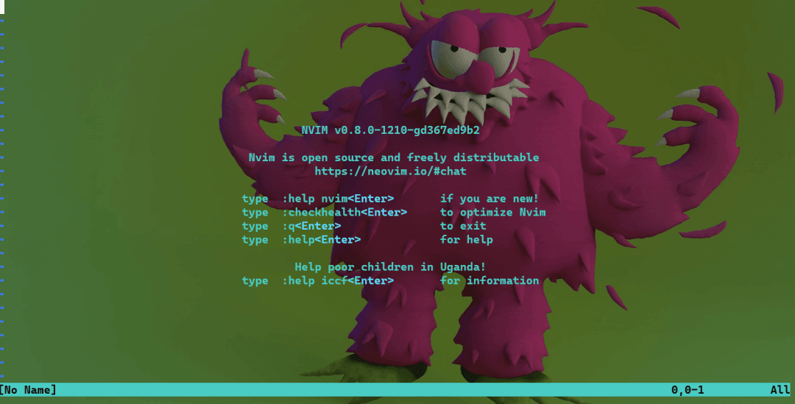

```plain
PS C:\Users\XH> mkdir .config/powershell

    Directory: C:\Users\XH\.config

Mode                 LastWriteTime         Length Name
----                 -------------         ------ ----
d----          2022-11-15    23:12                powershell
```

## 9\. 设置别名

```plain

PS C:\Users\XH> nvim .\.config\powershell\user_profile.ps1
# Alias
Set-Alias vim nvim
Set-Alias ll ls
Set-Alias g git
Set-Alias grep findstr
Set-Alias tig 'D:\install\\Git\usr\bin\tig.exe'
Set-Alias less 'D:\install\Git\usr\bin\less.exe'


#变量可回车
PS C:\Users\XH> nvim $PROFILE.CurrentUserCurrentHost
. $env:USERPROFILE\.config\powershell\user_profile.ps1
```

会在`C:\Users\XH\Documents\PowerShell`创建`Microsoft.PowerShell_profile.ps1`,如果没有`C:\Users\XH\Documents\PowerShell`手创即可。

测试别名

```plain
PS C:\Users\XH> ll

    Directory: C:\Users\XH

Mode                 LastWriteTime         Length Name
----                 -------------         ------ ----
d----          2020-07-01     0:08                .atom
d----          2020-06-27    23:23                .bundle
d----          2022-11-15    23:12                .config
d----          2020-05-19    16:03                .dlv
d----          2022-08-29     8:35                .docker
d----          2020-06-27    22:39                .gem
d----          2022-01-19    17:48                .gitbook
d----          2020-05-14    14:17                .idea
d----          2022-08-25    16:02                .local
d----          2022-05-27    23:11                .matplotlib
d----          2021-12-04     0:00                .openshot_qt
d----          2019-10-25    14:48                .PyCharm2018.2
d----          2021-12-15    20:48                .pylint.d
d----          2020-02-06    16:10                .ssh
d----          2022-05-04     2:04                .vim
d----          2021-12-15    20:17                .virtualenvs
d----          2022-05-03    19:48                .vscode
d-r--          2020-10-22    11:17                3D Objects
d-r--          2020-10-22    11:17                Contacts
d-r--          2022-11-15    18:52                Desktop
d-r--          2022-11-15    23:34                Documents
d-r--          2022-11-13    21:37                Downloads
d-r--          2020-10-22    11:17                Favorites
d-r--          2022-06-18     3:10                iCloudDrive
d-r--          2022-06-18     3:10                Links
d-r--          2020-10-22    11:17                Music
lar--          2022-08-25     8:17                OneDrive
d----          2019-10-24    17:02                OpenVPN
d-r--          2022-10-28    12:32                Pictures
d----          2020-05-11    15:49                PycharmProjects
d----          2019-08-21    13:21                Roaming
d-r--          2020-10-22    11:17                Saved Games
d----          2022-11-15    18:28                scoop
d-r--          2020-10-22    11:17                Searches
d----          2021-07-23    15:44                simple-todo
d-r--          2021-11-12    23:11                Videos
-a---          2022-08-25    17:05          12675 .bash_history
-a---          2020-06-27    22:54            155 .gemrc
-a---          2022-05-22     2:48            220 .git-credentials
-a---          2022-11-15     0:16            302 .gitconfig
-a---          2021-11-18    23:04             28 .node_repl_history
-a---          2022-05-09    17:10              2 .notion-enhancer
-a---          2022-05-22     2:47          16940 .viminfo
-a---          2020-01-08    15:56          32222 java_error_in_pycharm_17300.log


PS C:\Users\XH> ll | less
    Directory: C:\Users\XH

Mode                 LastWriteTime         Length Name
----                 -------------         ------ ----
d----          2020-07-01     0:08                .atom
d----          2020-06-27    23:23                .bundle
d----          2022-11-15    23:12                .config
d----          2020-05-19    16:03                .dlv
d----          2022-08-29     8:35                .docker
d----          2020-06-27    22:39                .gem
d----          2022-01-19    17:48                .gitbook
d----          2020-05-14    14:17                .idea
d----          2022-08-25    16:02                .local
d----          2022-05-27    23:11                .matplotlib
d----          2021-12-04     0:00                .openshot_qt
d----          2019-10-25    14:48                .PyCharm2018.2
d----          2021-12-15    20:48                .pylint.d
d----          2020-02-06    16:10                .ssh
d----          2022-05-04     2:04                .vim
d----          2021-12-15    20:17                .virtualenvs
d----          2022-05-03    19:48                .vscode
d-r--          2020-10-22    11:17                3D Objects
d-r--          2020-10-22    11:17                Contacts
d-r--          2022-11-15    18:52                Desktop
d-r--          2022-11-15    23:34                Docu
```

## 10\. 安装 oh My Posh

Oh my posh\[13\] 是一款终端 Prompt 个性化工具，虽然肇始于同类工具 Oh My Zsh\[14\]，但当更新到 5.0 版本时，重新设计的 Oh my posh 已经摆脱平台的桎梏，支持了 `Windows`、`GNU/Linux（WSL）`、`macOS` 三个系统上的 `PowerShell`、`bash`、`zsh` 等终端

方法1（Takuya）：

```plain
PS C:\Users\XH> Install-Module posh-git -Scope CurrentUser -Force
PS C:\Users\XH> Install-Module oh-my-posh -Scope CurrentUser -Force
PS C:\Users\XH> oh-my-posh
oh-my-posh is not recognized as a name of a cmdlet, function, script file, or executable program
```

感觉此方法已过时。

方法2（官方）：

-   • 最新官方 windows 安装方式你也可以看这里\[15\]
    

安装命令：

```plain
winget install JanDeDobbeleer.OhMyPosh -s winget
```

或者

```plain
scoop install https://github.com/JanDeDobbeleer/oh-my-posh/releases/latest/download/oh-my-posh.json
```

或者

```plain
Set-ExecutionPolicy Bypass -Scope Process -Force; Invoke-Expression ((New-Object System.Net.WebClient).DownloadString('https://ohmyposh.dev/install.ps1'))
```

安装完成后，重启 `windows terminal` 即可生效。

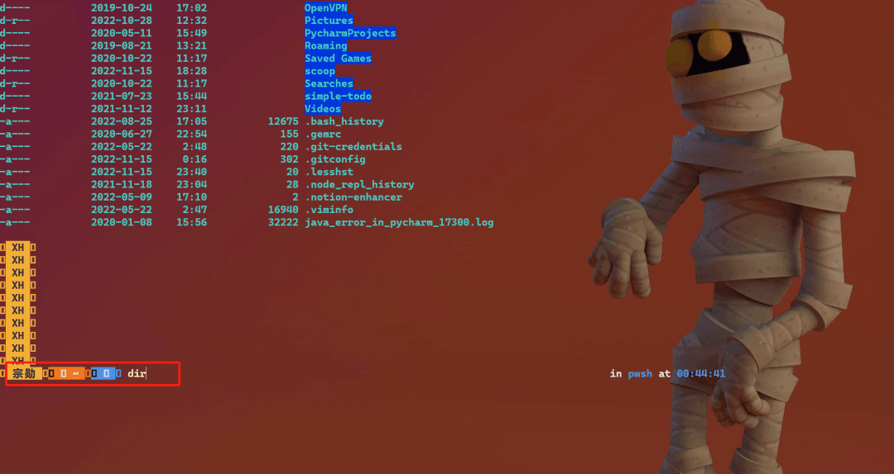

有一点乱码，在安装fonts时，忽略了字体配置导致，改成新安装的`Hack NFM`就好了。


## 11\. 自定义 prompt（path）

自定义 prompt方法\[16\]你可以看这里。初始命令格式：`oh-my-posh init pwsh --config "$env:POSH_THEMES_PATH\jandedobbeleer.omp.json"`

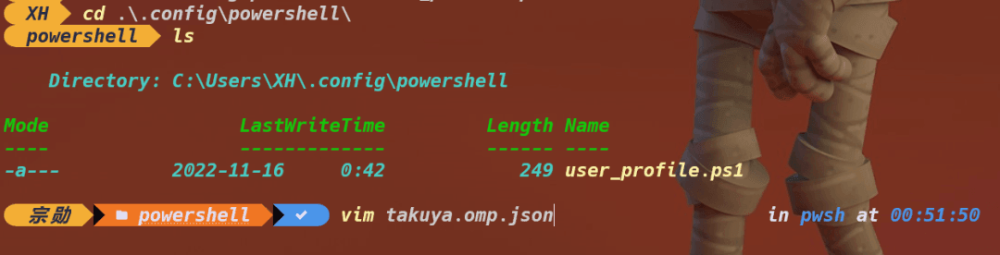

| Name | Type | Description |
| --- | --- | --- |
| final\_space | boolean | 当 true 时在提示末尾添加一个空格 |
| pwd | string | 通知当前工作目录的终端，值可以是osc99或osc7取决于您的终端 |
| terminal\_background | string | color\[17\] - 终端背景颜色，当您在 Windows 终端或 Visual Studio Code 集成终端中注意到黑色元素时，设置为终端的背景颜色 |
| accent\_color | string | color\[18\] - 强调色，当accent 颜色不受支持时用作回退 |

```plain
$ cat  takuya.omp.json
pwsh> cat .\takuya.omp.json
{
  "$schema": "https://raw.githubusercontent.com/JanDeDobbeleer/oh-my-posh/main/themes/schema.json",
  "version": 2,
  "find_space": true,
  "blocks": [
    {
      "type": "prompt",
      "alignment": "left",
      "segments": [
        {
          "type": "shell",
          "style": "diamond",
          "foreground": "#ffffff",
          "background": "#0077c2",
          "leading_diamond": "> ",
          "trailing_diamond": "",
          "properties": {},
          "template": " {{ .Name }} "
        },
        {
          "type": "root",
          "style": "diamond",
          "foreground": "#fffb38",
          "background": "#ef5350",
          "leading_diamond": "",
          "trailing_diamond": "",
          "properties": {
             "root_icon": "\uf292",
             "prefix": "<parentBackground>\ue0b0</> "
          }
        },
        {
          "type": "path",
          "style": "powerline",
          "powerline_symbol": "\ue0b0",
          "foreground": "#e4e4e4",
          "background": "#444444",
          "properties": {
             "style": "full",
             "enable_hyperlink": true
          }
        },
        {
          "type": "git",
          "style": "powerline",
          "powerline_symbol": "\ue0b0",
          "foreground": "#011627",
          "background": "#fffb38",
          "background_templates": [
             "{{ if or (.Working.Changed) (.Staging.Changed) }}#ffeb95{{ end }}",
             "{{ if and (gt .Ahead 0) (gt .Behind 0) }}#c53478{{ end }}",
             "{{ if gt .Ahead 0 }}#c792ea{{ end }}",
             "{{ if gt .Behind 0 }}#c792ea{{ end }}"
          ],
          "properties": {
             "branch_icon": "\ue725",
             "fetch_status": true,
             "fetch_upstream_icon": true,
             "template": "{{ .HEAD }} {{ if .Working.Changed }}{{ .Working.String }}{{ end }}{{ if and (.Working.Changed) (.Staging.Changed ) }}|{{ end }}{{ if .Staging.Changed }}<#ef5350> \uf046 {{ .Staging.String }}</>{{ end }}"
          }
        }
      ]
    },
    {
      "type": "prompt",
      "alignment": "right",
      "style": "diamond",
      "segments": [
        {
          "type": "node",
          "style": "diamond",
          "leading_diamond": " \ue0b6",
          "trailing_diamond": " \ue0b4",
          "foreground": "#4c873a",
          "background": "#303030",
          "properties": {
            "prefix": "\ue718",
            "postfix": "",
            "display_package_manager": true,
            "yarn_icon": " <#348cba>😼",
            "npm_icon": " <#cc3a3a>👄</>"
           }
         },
         {
           "type": "time",
           "style": "diamond",
           "invert_powerline": true,
           "leading_diamond": " \ue0b6",
           "trailing_diamond": " \ue0b4",
           "background": "#40c4ff",
           "foreground": "#ffffff",
           "properties": {
           "prefix": " \uf5ef",
           "postfix": " "
            }
          }
       ]
     },
     {
       "type": "prompt",
       "alignment": "left",
       "newline": true,
       "segments": [
        {
          "type": "text",
          "style": "plain",
          "foreground": "#21c7c7",
          "properties": {
             "prefix": "",
             "postfix": "",
             "text": "﹂"
          }
         },
         {
           "type": "exit",
           "style": "plain",
           "foreground": "#e0f8ff",
           "properties": {
              "prefix": "\u276f",
              "display_exit_code": false,
              "always_enabled": true,
              "error_color": "#ef5350"
           }
         }
       ]
     }
   ],
  "osc99": true
}
```

输出效果:

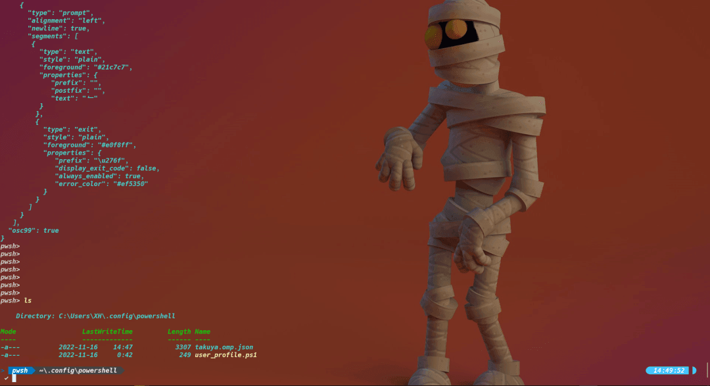

编写`user_profile.ps1` 添加`oh-my-posh`功能载入配置

```plain
$ nvim .\user_profile.ps1
....
# Load prompt config
oh-my-posh --init --shell pwsh --config C:\Users\XH\.config\powershell\takuya.omp.json | Invoke-Expression
....
```

这样，创建新的 选项卡就会直接载入自定义的`prompt`。

## 12\. 安装 nodejs

```plain
scoop install nvm
nvm version
nvm install 14.16.0
nvm use 14.16.0
node -v
```

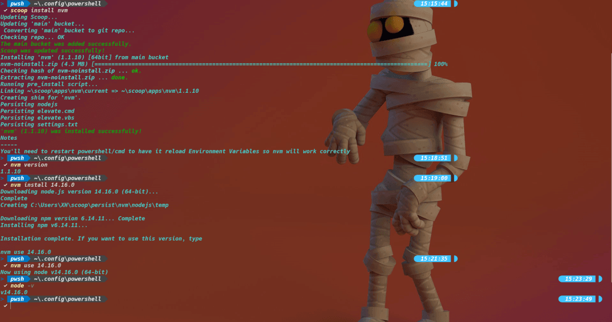

## 13\. 安装 Terminal Icons

```plain
Install-Module -Name Terminal-Icons -Repository PSGallery -Force
Import-Module Terminal-Icons
```

输出效果：

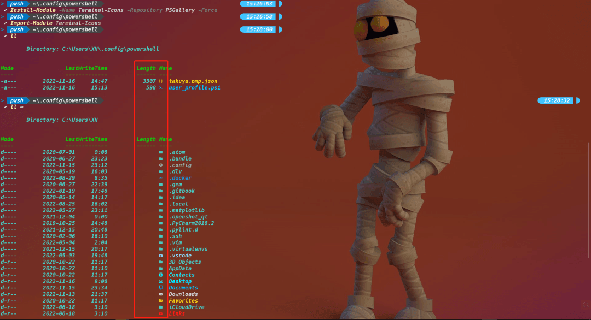

编写`user_profile.ps1` 添加`Icons`功能载入配置

```plain
# Icons
Import-Module -Name Terminal-Icons
```

## 14\. 安装 z Directory jumper

z模块是实现跳转目录的快捷方式。

```plain
Install-Module z -force
```

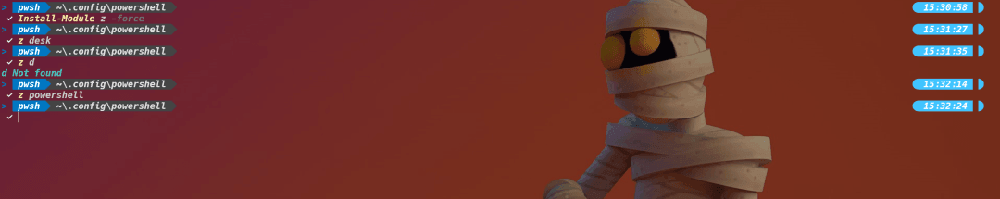

## 15\. 安装 PSReadLine

PSReadLine\[19\] 是微软创建的一个模块，用于自定义 `PowerShell` 中的命令行编辑环境。它提供了大量的定制，可以改变命令行编辑器以多种方式呈现数据的方式。这里我们实现它的命令自动补全功能。

```plain
Install-Module -Name PSReadLine -AllowPrerelease -Scope CurrentUser -Force -SkipPublisherCheck
Set-PSReadLineOption -PredictionSource History
Set-PSReadLineOption -PredictionViewStyle ListView
```

输出效果：


编写`user_profile.ps1` 添加`PSReadLine`功能载入配置

```plain
# PSReadLine
Set-PSReadLineOption -EditMode Emacs
Set-PSReadLineOption -BellStyle None
Set-PSReadLineKeyHandler -Chord 'Ctrl+d' -Function DeleteChar
Set-PSReadLineOption -PredictionSource History
```

## 16\. 安装 Fzf - 模糊搜索

模糊搜索历史命令。

```plain
scoop install fzf
Install-Module -Name PSFzf -Scope CurrentUser -Force
Set-PsFzfOption -PSReadlineChordProvider 'Ctrl+f' -PSReadlineChordReverseHistory 'Ctrl+r'
```


编写`user_profile.ps1` 添加`PSFzf`功能载入配置

```plain
# Fzf
Set-PsFzfOption -PSReadLineChordProvider 'Ctrl+f' -PSReadlineChordReverseHistory 'Ctrl+r'
```

## 17\. 配置 which 命令

```plain
# Utilities
function which ($command) {
   Get-Command -Name $command -ErrorAction SilentlyContinue |
      Select-Object -ExpandProperty Path -ErrorAction SilentlyContinue
}
```

## 18\. 选择 oh-my-posh themes

-   • oh-my-posh themes\[20\]
    

我可以选择一个自己喜欢的主题，在`Windows Terminal` 中愉快惬意的完成工作。

```plain
 Set-PoshPrompt aliens
 Set-PoshPrompt bubbles
 Set-PoshPrompt cloud-native-azure
 Set-PoshPrompt rudolfs-dark
```

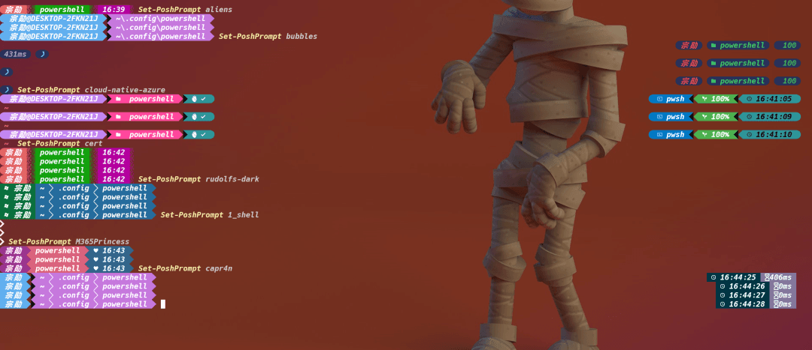

如果 `Set-PoshPrompt aliens`主题没变，说明`oh-my-posh`没找到`themes`库 

错误：

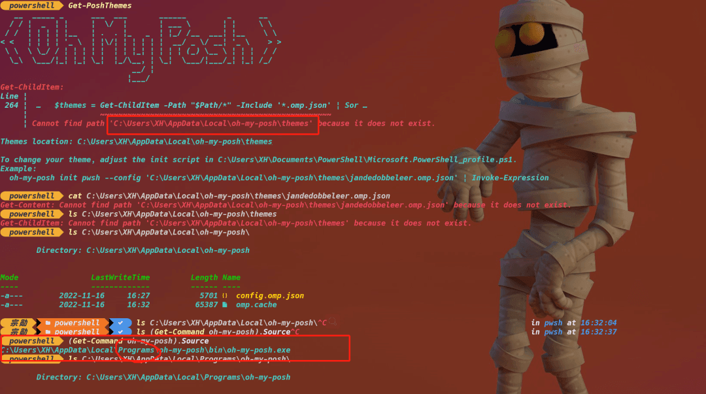

所有的 themes 在这

```plain
$ ls C:\Users\XH\AppData\Local\Programs\oh-my-posh\themes\

        Directory: C:\Users\XH\AppData\Local\Programs\oh-my-posh\themes


Mode                LastWriteTime         Length Name
----                -------------         ------ ----
-a---        2022-11-14      5:33           3743   1_shell.omp.json
-a---        2022-11-14      5:33           1970   agnoster.minimal.omp.json
-a---        2022-11-14      5:33           1915   agnoster.omp.json
-a---        2022-11-14      5:33           1458   agnosterplus.omp.json
-a---        2022-11-14      5:33           1432   aliens.omp.json
-a---        2022-11-14      5:33           1430   amro.omp.json
-a---        2022-11-14      5:33           9250   atomic.omp.json
-a---        2022-11-14      5:33           6416   atomicBit.omp.json
-a---        2022-11-14      5:33           1161   avit.omp.json
-a---        2022-11-14      5:33           3884   blue-owl.omp.json
-a---        2022-11-14      5:33           3661   blueish.omp.json
-a---        2022-11-14      5:33           5052   bubbles.omp.json
-a---        2022-11-14      5:33           5543   bubblesextra.omp.json
-a---        2022-11-14      5:33           4382   bubblesline.omp.json
-a---        2022-11-14      5:33           1926   capr4n.omp.json
-a---        2022-11-14      5:33           1794   catppuccin_frappe.omp.json
-a---        2022-11-14      5:33           1794   catppuccin_latte.omp.json
-a---        2022-11-14      5:33           1792   catppuccin_macchiato.omp.json
-a---        2022-11-14      5:33           1792   catppuccin_mocha.omp.json
-a---        2022-11-14      5:33           2032   catppuccin.omp.json
-a---        2022-11-14      5:33           1544   cert.omp.json
-a---        2022-11-14      5:33          15690   chips.omp.json
-a---        2022-11-14      5:33           1914   cinnamon.omp.json
-a---        2022-11-14      5:33           4218   clean-detailed.omp.json
-a---        2022-11-14      5:33           6276   cloud-context.omp.json
-a---        2022-11-14      5:33           4937   cloud-native-azure.omp.json
-a---        2022-11-14      5:33           1547   cobalt2.omp.json
-a---        2022-11-14      5:33           3291   craver.omp.json
-a---        2022-11-14      5:33           1310   darkblood.omp.json
-a---        2022-11-14      5:33           7960   devious-diamonds.omp.yaml
-a---        2022-11-14      5:33           2362   di4am0nd.omp.json
-a---        2022-11-14      5:33           2330   dracula.omp.json
-a---        2022-11-14      5:33           4914   easy-term.omp.json
-a---        2022-11-14      5:33           3499   emodipt-extend.omp.json
-a---        2022-11-14      5:33           1406   emodipt.omp.json
-a---        2022-11-14      5:33           1392   fish.omp.json
-a---        2022-11-14      5:33           6696   free-ukraine.omp.json
-a---        2022-11-14      5:33           5988   froczh.omp.json
-a---        2022-11-14      5:33           6902   glowsticks.omp.yaml
-a---        2022-11-14      5:33           3004   gmay.omp.json
-a---        2022-11-14      5:33           4033   grandpa-style.omp.json
-a---        2022-11-14      5:33           4540   gruvbox.omp.json
-a---        2022-11-14      5:33           1625   half-life.omp.json
-a---        2022-11-14      5:33           1988   honukai.omp.json
-a---        2022-11-14      5:33           1851   hotstick.minimal.omp.json
-a---        2022-11-14      5:33           3358   hul10.omp.json
-a---        2022-11-14      5:33           4011   hunk.omp.json
-a---        2022-11-14      5:33           2366   huvix.omp.json
-a---        2022-11-14      5:33           5331   if_tea.omp.json
-a---        2022-11-14      5:33           2607   illusi0n.omp.json
-a---        2022-11-14      5:33           4389   iterm2.omp.json
-a---        2022-11-14      5:33           7600   jandedobbeleer.omp.json
-a---        2022-11-14      5:33           3462   jblab_2021.omp.json
-a---        2022-11-14      5:33           4437   jonnychipz.omp.json
-a---        2022-11-14      5:33           1145   json.omp.json
-a---        2022-11-14      5:33           2043   jtracey93.omp.json
-a---        2022-11-14      5:33           4679   jv_sitecorian.omp.json
-a---        2022-11-14      5:33           2884   kali.omp.json
-a---        2022-11-14      5:33           5587   kushal.omp.json
-a---        2022-11-14      5:33            752   lambda.omp.json
-a---        2022-11-14      5:33           3853   lambdageneration.omp.json
-a---        2022-11-14      5:33           3602   larserikfinholt.omp.json
-a---        2022-11-14      5:33           5126   lightgreen.omp.json
-a---        2022-11-14      5:33           2787   M365Princess.omp.json
-a---        2022-11-14      5:33           2090   marcduiker.omp.json
-a---        2022-11-14      5:33           4039   markbull.omp.json
-a---        2022-11-14      5:33           1281   material.omp.json
-a---        2022-11-14      5:33           2610   microverse-power.omp.json
-a---        2022-11-14      5:33           4717   mojada.omp.json
-a---        2022-11-14      5:33           3338   montys.omp.json
-a---        2022-11-14      5:33           1899   mt.omp.json
-a---        2022-11-14      5:33           3520   multiverse-neon.omp.json
-a---        2022-11-14      5:33           3192   negligible.omp.json
-a---        2022-11-14      5:33           1656   neko.omp.json
-a---        2022-11-14      5:33          14854   night-owl.omp.json
-a---        2022-11-14      5:33           2305   nordtron.omp.json
-a---        2022-11-14      5:33           2670   nu4a.omp.json
-a---        2022-11-14      5:33           2116   onehalf.minimal.omp.json
-a---        2022-11-14      5:33           2101   paradox.omp.json
-a---        2022-11-14      5:33           1646   pararussel.omp.json
-a---        2022-11-14      5:33           2448   patriksvensson.omp.json
-a---        2022-11-14      5:33           3484   peru.omp.json
-a---        2022-11-14      5:33           4557   pixelrobots.omp.json
-a---        2022-11-14      5:33           2728   plague.omp.json
-a---        2022-11-14      5:33           4121   poshmon.omp.json
-a---        2022-11-14      5:33           2326   powerlevel10k_classic.omp.json
-a---        2022-11-14      5:33           1042   powerlevel10k_lean.omp.json
-a---        2022-11-14      5:33           2829   powerlevel10k_modern.omp.json
-a---        2022-11-14      5:33           6834   powerlevel10k_rainbow.omp.json
-a---        2022-11-14      5:33           1624   powerline.omp.json
-a---        2022-11-14      5:33           1499   probua.minimal.omp.json
-a---        2022-11-14      5:33           2465   pure.omp.json
-a---        2022-11-14      5:33           4053   quick-term.omp.json
-a---        2022-11-14      5:33           1324   remk.omp.json
-a---        2022-11-14      5:33            995   robbyrussel.omp.json
-a---        2022-11-14      5:33           1981   rudolfs-dark.omp.json
-a---        2022-11-14      5:33           1981   rudolfs-light.omp.json
-a---        2022-11-14      5:33          98787   schema.json
-a---        2022-11-14      5:33           2105   sim-web.omp.json
-a---        2022-11-14      5:33           5906   slim.omp.json
-a---        2022-11-14      5:33           5803   slimfat.omp.json
-a---        2022-11-14      5:33           2876   smoothie.omp.json
-a---        2022-11-14      5:33           3682   sonicboom_dark.omp.json
-a---        2022-11-14      5:33           3682   sonicboom_light.omp.json
-a---        2022-11-14      5:33           1496   sorin.omp.json
-a---        2022-11-14      5:33           2562   space.omp.json
-a---        2022-11-14      5:33           1250   spaceship.omp.json
-a---        2022-11-14      5:33           1768   star.omp.json
-a---        2022-11-14      5:33           3652   stelbent-compact.minimal.omp.json
-a---        2022-11-14      5:33           3628   stelbent.minimal.omp.json
-a---        2022-11-14      5:33           3423   takuya.omp.json
-a---        2022-11-14      5:33           1779   the-unnamed.omp.json
-a---        2022-11-14      5:33           3240   thecyberden.omp.json
-a---        2022-11-14      5:33           3840   tiwahu.omp.json
-a---        2022-11-14      5:33           3491   tokyo.omp.json
-a---        2022-11-14      5:33           3961   tokyonight_storm.omp.json
-a---        2022-11-14      5:33           1552   tonybaloney.omp.json
-a---        2022-11-14      5:33           3540   uew.omp.json
-a---        2022-11-14      5:33           2970   unicorn.omp.json
-a---        2022-11-14      5:33           5291   velvet.omp.json
-a---        2022-11-14      5:33           4411   wholespace.omp.json
-a---        2022-11-14      5:33           2817   wopian.omp.json
-a---        2022-11-14      5:33           1371   xtoys.omp.json
-a---        2022-11-14      5:33           2206   ys.omp.json
-a---        2022-11-14      5:33           1149   zash.omp.json
```

只需复制`themes`目录即可：

```plain
cp -r  C:\Users\XH\AppData\Local\Programs\oh-my-posh\themes C:\Users\XH\AppData\Local\oh-my-posh\
```

参考:

-   • oh my posh\[21\]
    
-   • windows terminal\[22\]
    
-   • Windows Terminal Docs\[23\]
    
-   • How to set up PowerShell prompt with Oh My Posh on Windows 11\[24\]
    

#### 引用链接

`[1]` Takuya 🐾 devaslife: *https://blog.inkdrop.app/*  
`[2]` How to set up PowerShell prompt with Oh My Posh on Windows 11: *https://www.youtube.com/watch?v=5-aK2\_WwrmM&t=1152s*  
`[3]` min: *https://minbrowser.org/*  
`[4]` Windows Terminal: *https://github.com/microsoft/terminal*  
`[5]` Windows Terminal Docs: *https://learn.microsoft.com/en-us/windows/terminal/*  
`[6]` Windows Terminal 界面设置: *https://blog.csdn.net/xixihahalelehehe/article/details/127839905*  
`[7]` Windows Terminal 快捷键: *https://blog.csdn.net/xixihahalelehehe/article/details/127839881*  
`[8]` ryanoasis/nerd-fonts: *https://github.com/ryanoasis/nerd-fonts*  
`[9]` 字形: *https://github.com/ryanoasis/nerd-fonts#glyph-sets*  
`[10]` Differences between Windows PowerShell 5.1 and PowerShell 7.x: *https://learn.microsoft.com/en-us/powershell/scripting/whats-new/differences-from-windows-powershell?view=powershell-7.3*  
`[11]` Neovim: *https://neovim.io/*  
`[12]` Vim: *https://www.vim.org/*  
`[13]` Oh my posh: *https://ohmyposh.dev/*  
`[14]` Oh My Zsh: *https://ohmyz.sh/*  
`[15]` 最新官方 windows 安装方式你也可以看这里: *https://ohmyposh.dev/docs/installation/windows*  
`[16]` 自定义 prompt方法: *https://ohmyposh.dev/docs/installation/customize*  
`[17]` color: *https://ohmyposh.dev/docs/configuration/colors*  
`[18]` color: *https://ohmyposh.dev/docs/configuration/colors*  
`[19]` PSReadLine: *https://github.com/PowerShell/PSReadLine*  
`[20]` oh-my-posh themes: *https://ohmyposh.dev/docs/themes*  
`[21]` oh my posh: *https://ohmyposh.dev/*  
`[22]` windows terminal: *https://github.com/microsoft/terminal*  
`[23]` Windows Terminal Docs: *https://learn.microsoft.com/en-us/windows/terminal/*  
`[24]` How to set up PowerShell prompt with Oh My Posh on Windows 11: *https://www.youtube.com/watch?v=5-aK2\_WwrmM&t=1152s*