# asm 项目 v0.0.2 版本总结

# 背景

今天 asm 项目 v0.0.2 版本 \[1\] 发布了，新增了一些功能：

-   支持 "用户浏览器设置代理后访问网站，利用代理扫描发现站点漏洞"
    
-   新增工作流，支持 "探测指定资产是否存在后台对外暴露，站点截图辅助告警运营"、"对任意端口 poc 扫描"
    
-   集成 xray 反连平台，支持基于 http/dnslog 的检测
    
-   集成 elasticsearch 和 kibana，爬虫和代理的数据会存储到 es 中
    

本文介绍用户可以怎么用这些功能和背后的事 (为什么要做这些、怎么做的、中间遇到了什么问题以及如何解决、技术选型)。

# 支持 "用户浏览器设置代理后访问网站，利用代理扫描发现站点漏洞"

xray 代理以 nodeport service 的方式对集群外提供服务，用户在安装实例时可以指定对外服务的端口值，如下

`helm template ./ --set xray_proxy_nodeport=30088`

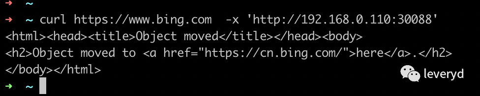

> xray 代理使用参考官网文档 https://docs.xray.cool/#/tutorial/webscan\_proxy

本来打算以 ingress 方式对集群外提供服务，但测试后发现以 ingress 方式对外提供服务时，只能代理 http 请求、无法代理 https，如下

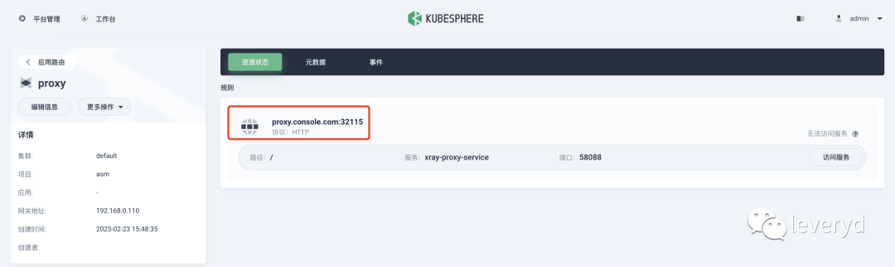

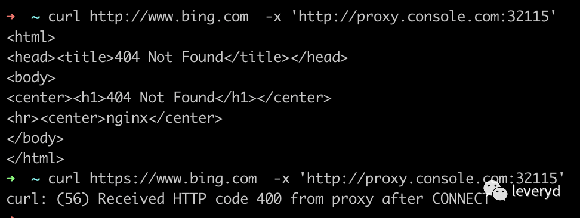

# 支持 "对任意端口做 poc 扫描"

多个工作流中支持端口扫描，如下

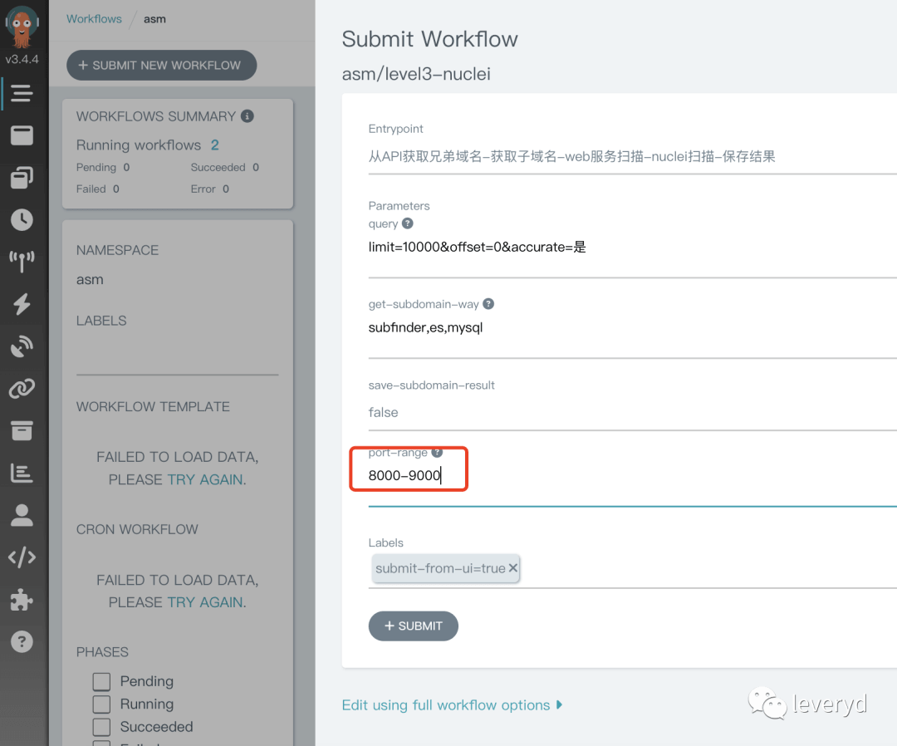

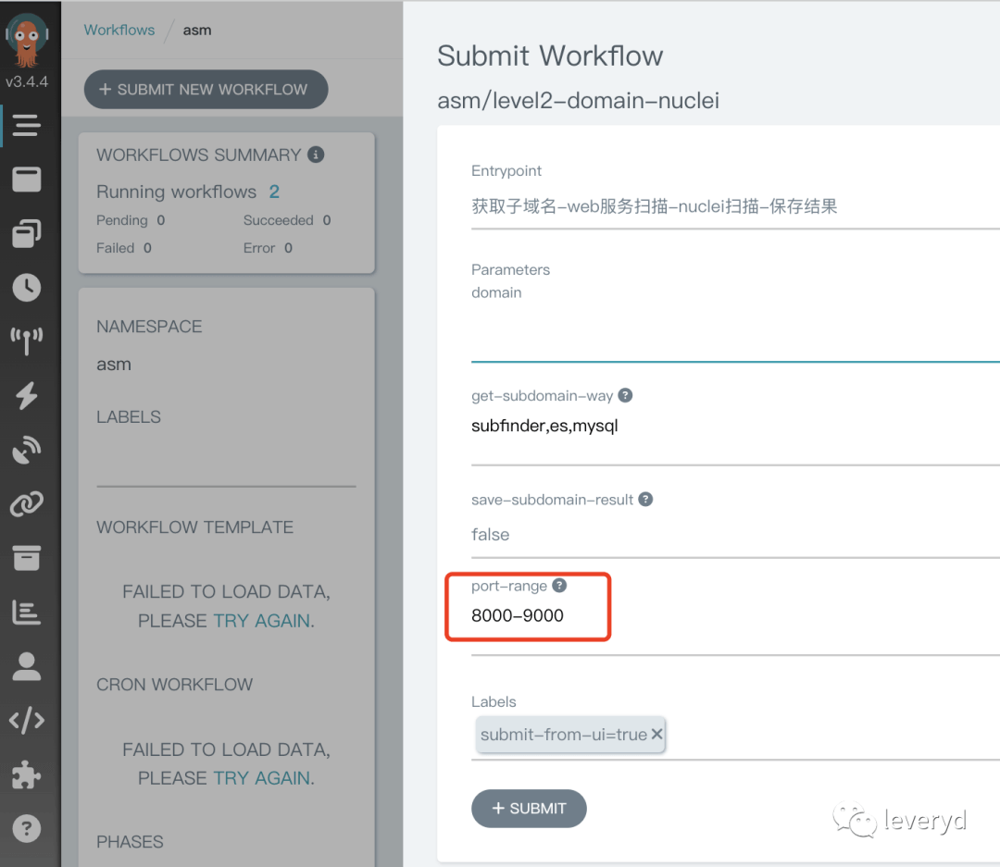

这一块实现上是先用 naabu\[2\] 的 syn 扫描获得开放端口信息，然后用 httpx\[3\] 获取开放的 web 服务。

目前端口扫描的速度不是很快，比如 apple.com 的 16k 个子域名 8000-9000 端口需要 20 个小时，平均下来每秒识别 222 个端口。或许可以调整 naabu 的 `-rate` 试试。

# 支持 "探测指定资产是否存在后台对外暴露，站点截图辅助告警运营"

用户创建任务后，可以在控制台运营后台报警，如下

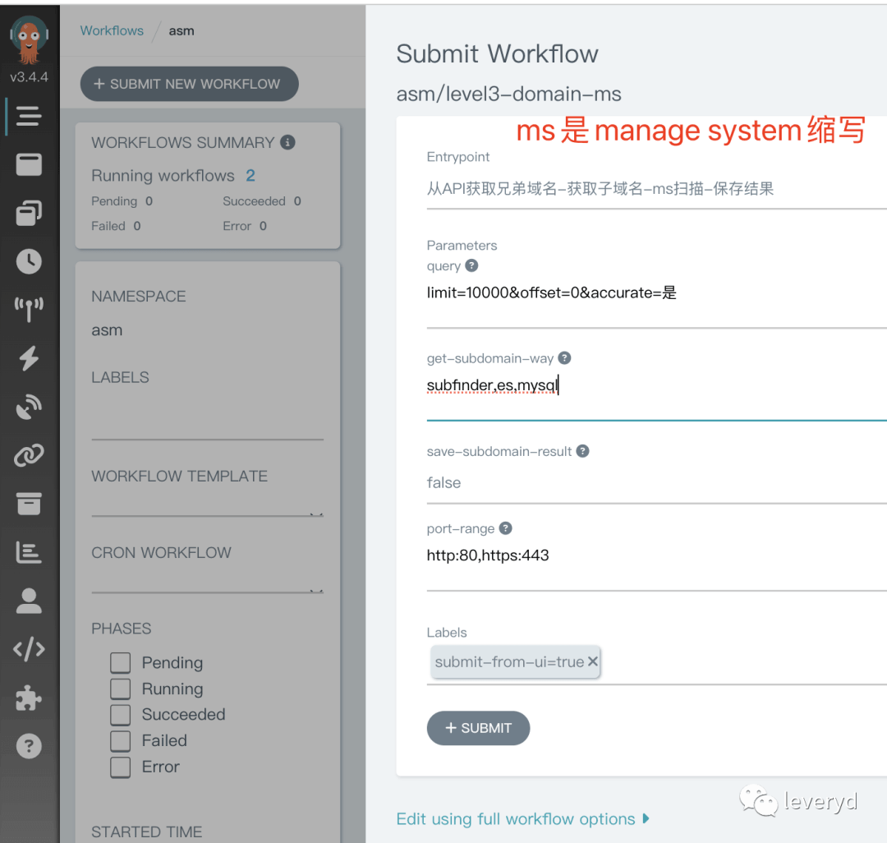

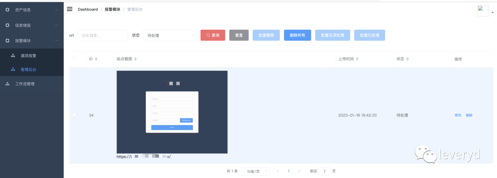

为什么要做这类告警呢？源于之前的实践经验，见 [安全建设 - 攻防思路与实践（一）](https://mp.weixin.qq.com/s?__biz=MzkyMDIxMjE5MA==&mid=2247484212&idx=1&sn=0533cfb1e2b85e75f94eeab12a62db64&scene=21#wechat_redirect)

识别策略代码见 https://github.com/leveryd-asm/tools/blob/main/x/fms.go，有三类：

-   域名中包含关键词，直接当作后台管理系统
    
-   使用 vue、react、angular 等框架的网站
    
-   存在 `<table>` 标签，认为它可能需要渲染数据
    

因为现在误报很多，为了运营效率，所以告警信息中会包含站点截图。

站点截图并没有通过集成 gowitness\[4\] 实现，因为我觉得 gowitness 不适用于告警这个场景，它没有对同一个 url 的去重，也不能标记告警状态。而是通过 browserless\[5\] 实现，印象中他们在生产环境中有过大规模的实践。实际上无头浏览器类型的爬虫也可以用 browserless 服务。

# 集成 dnslog 平台

因为 asm 项目用到了 xray、nuclei\[6\]，而很多漏洞的检测需要依赖 dnslog，所以需要集成 xray 反连平台 \[7\]，nuclei 的 interactsh\[8\]。

虽然 interactsh 内置了几个可用的 dns/http oob 服务，但是默认的几个域名可能会被安全设备检测到，影响扫描效果。所以有必要用自己的域名部署。

用户通过设置以下参数，就可以独立部署 xray 反连服务，并且 xray 扫描时会使用反连平台。

```bash
helm template ./ --set reverse_http_base_url="leveryd.xxxx.org" --set reverse_dns_domain="yyyyy.top" --set reverse_http_enable=true --set reverse_dns_enable=true  --set reverse_client_enable=true
```

xray 反连容器通过 host 网络模式对外在 53、80 端口提供服务，所以需要容器宿主机上这两个端口没有被占用。

有关 dnslog 模块遇到了两个问题，还没有解决。一个问题是误报，某些目标不知道出于什么原因确实会产生 dns 请求，但实际不存在漏洞。

另一个问题是漏报，某些漏洞可能要等一小时后异步触发，这种漏洞会被 nuclei 和 xray 漏掉。我以前的解决办法是在 dns 请求中加入目标和 poc 信息，然后定时任务去筛选 dnslog。但目前无法通过 api 或者直接操作 db 来读取 xray 反连平台和 interactsh 的 dnslog 记录。

> 异步触发的漏洞可以参考 https://portswigger.net/research/hunting-asynchronous-vulnerabilities

# 集成 elasticsearch 和 kibana

kibana 以 ingress 方式可以被集群外服务访问，用户可以通过访问 `kibana.{{.Values.console_domain}}` 访问 kibana，如下

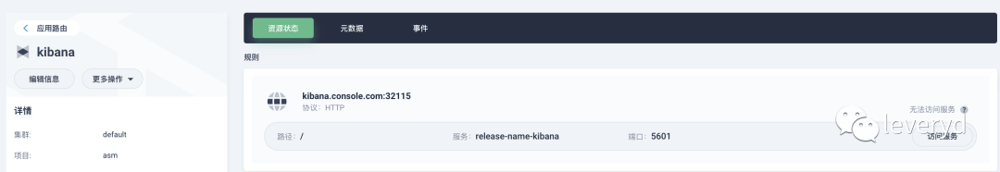

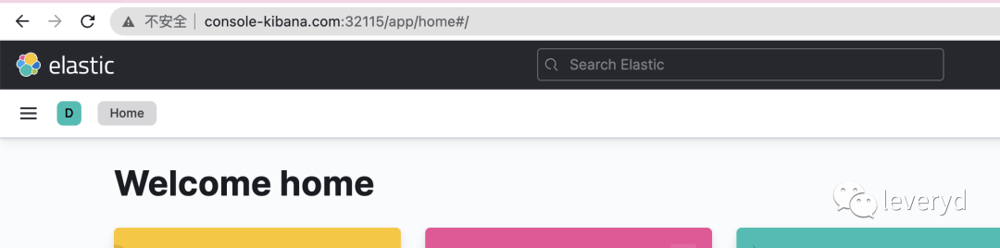

elasticsearch 用来做什么呢？人工浏览网站的数据会经过 xray 代理，因为人工浏览一次不容易，所以想着最好能把这些数据存下来。后面可以干很多事情，比如从网站请求中找子域名信息。

以下是 apple.com 的子域名信息，elasticsearch 中可以找到 3 个 subfinder 没找到的子域名。subfinder 找到 17834 个子域名，通过 elasticsearch 数据找到 65 个子域名，去重后有 17837 个子域名。

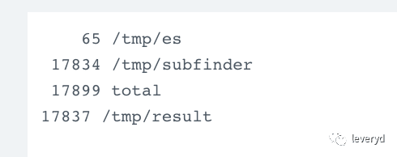

目前架构上是 xray->proxify\[9\]\->elasticsearch。proxify 是 go 实现的一个代理服务，支持导入原始请求和响应到 elasticsearch 中。

proxify 目前最新的 v0.0.8 版本主要存在两个问题，一个是有的请求响应过大，导致 es 查询时会报错，另一个是只有原始信息，而没有 url、host、body 等信息。同时它目前还有一些低级的 bug 会导致程序不可用，详情可以见我提的 issues\[10\]。

这两个问题，在咨询 Evilran\[11\] 师傅后，最终用 elasticsearch 的 ingest pipeline\[12\] 方式解决。

因为 xray 会将 proxify 服务设置成代理，所以如果 proxify 服务挂掉，xray 也不能工作了。

这个可用性我觉得目前也能接受，本次更新也做了其他关于系统可用性和性能相关的优化。

# 可用性和性能优化

可用性方面主要做了以下事情：

-   mysql 数据持久化，不用担心重启 pod 数据就没了
    
-   每隔两小时更新 nuclei 模板，而不是每次扫描前更新
    
-   设置默认 pod gc 时间，避免 pod 数量过多时节点不可用，详情见 issue\[13\]
    

asm 实例的某个服务挂了导致任务失败不可怕，但是如果域名、报警等数据丢了，自己之前录入数据、运营告警标记告警状态的时间就白投入了。所以 mysql 库的数据肯定是需要持久化存储和备份的。目前通过 k8s 的 pv 机制和卷挂载到 `/var/lib/mysql` 做到持久化存储，自动备份 0.0.3 版本再做。

默认情况下每次 nuclei 容器运行时都会拉取扫描规则，它会有两个不好的影响：

-   请求 api.github.com 拉取规则时因为频率限制和网络原因很有可能失败，进而导致扫描失败
    
-   会造成带宽浪费，扫描速度也会慢一点
    

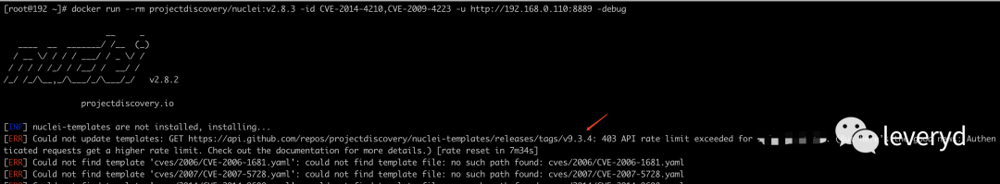

性能优化主要是扫描前对子域名、url 等去重，见 pr\[14\]

# PS

目前对外的服务全部都没有认证，包括 xray 代理、kibana、console、argo 等，所以最好仅在内网使用，不要开放到公网。

### 参考资料

\[1\]

asm 项目 v0.0.2 版本：*https://github.com/leveryd-asm/asm/releases/tag/v0.0.2*

\[2\]

naabu: *https://github.com/projectdiscovery/naabu*

\[3\]

httpx: *https://github.com/projectdiscovery/httpx*

\[4\]

gowitness: *https://github.com/sensepost/gowitness*

\[5\]

browserless: *https://github.com/browserless/chrome*

\[6\]

nuclei: *https://github.com/projectdiscovery/nuclei*

\[7\]

xray 反连平台：*https://docs.xray.cool/#/configration/reverse*

\[8\]

nuclei 的 interactsh: *https://github.com/projectdiscovery/interactsh*

\[9\]

proxify: *https://github.com/projectdiscovery/proxify*

\[10\]

issues: *https://github.com/projectdiscovery/proxify/issues?q=author%3Aleveryd*

\[11\]

Evilran: *https://github.com/Evilran*

\[12\]

ingest pipeline: *https://www.elastic.co/guide/en/elasticsearch/reference/master/ingest.html#ingest*

\[13\]

issue: *https://github.com/leveryd-asm/asm/issues/20*

\[14\]

pr: *https://github.com/leveryd-asm/asm/pull/16*
