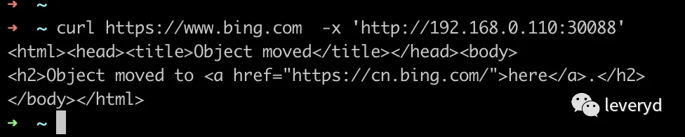
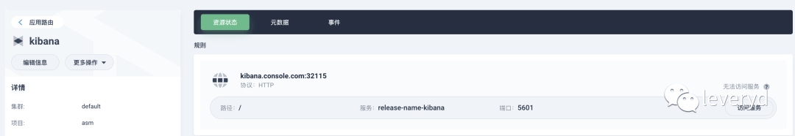

# asm项目v0.0.2版本总结

# 背景

今天asm项目v0.0.2版本\[1\]发布了，新增了一些功能：

-   支持"用户浏览器设置代理后访问网站，利用代理扫描发现站点漏洞"
    
-   新增工作流，支持"探测指定资产是否存在后台对外暴露，站点截图辅助告警运营"、"对任意端口poc扫描"
    
-   集成xray反连平台，支持基于http/dnslog的检测
    
-   集成elasticsearch和kibana，爬虫和代理的数据会存储到es中
    

本文介绍用户可以怎么用这些功能和背后的事(为什么要做这些、怎么做的、中间遇到了什么问题以及如何解决、技术选型)。

# 支持"用户浏览器设置代理后访问网站，利用代理扫描发现站点漏洞"

`helm template ./ --set xray_proxy_nodeport=30088`



> xray代理使用参考官网文档 https://docs.xray.cool/#/tutorial/webscan\_proxy

本来打算以ingress方式对集群外提供服务，但测试后发现以ingress方式对外提供服务时，只能代理http请求、无法代理https，如下


# 支持"对任意端口做poc扫描"

多个工作流中支持端口扫描，如下


这一块实现上是先用naabu\[2\]的syn扫描获得开放端口信息，然后用httpx\[3\]获取开放的web服务。

目前端口扫描的速度不是很快，比如apple.com的16k个子域名8000-9000端口需要20个小时，平均下来每秒识别222个端口。或许可以调整naabu的`-rate`试试。

# 支持"探测指定资产是否存在后台对外暴露，站点截图辅助告警运营"

用户创建任务后，可以在控制台运营后台报警，如下


为什么要做这类告警呢？源于之前的实践经验，见 [安全建设-攻防思路与实践（一）](https://mp.weixin.qq.com/s?__biz=MzkyMDIxMjE5MA==&mid=2247484212&idx=1&sn=0533cfb1e2b85e75f94eeab12a62db64&scene=21#wechat_redirect)

识别策略代码见 https://github.com/leveryd-asm/tools/blob/main/x/fms.go ，有三类：

-   域名中包含关键词，直接当作后台管理系统
    
-   使用vue、react、angular等框架的网站
    
-   存在`<table>`标签，认为它可能需要渲染数据
    

因为现在误报很多，为了运营效率，所以告警信息中会包含站点截图。

站点截图并没有通过集成 gowitness\[4\] 实现，因为我觉得gowitness不适用于告警这个场景，它没有对同一个url的去重，也不能标记告警状态。而是通过 browserless\[5\] 实现, 印象中他们在生产环境中有过大规模的实践。实际上无头浏览器类型的爬虫也可以用browserless服务。

# 集成dnslog平台

因为asm项目用到了xray、nuclei\[6\]，而很多漏洞的检测需要依赖dnslog，所以需要集成xray反连平台\[7\]，nuclei的interactsh\[8\]。

虽然interactsh内置了几个可用的dns/http oob服务，但是默认的几个域名可能会被安全设备检测到，影响扫描效果。所以有必要用自己的域名部署。

用户通过设置以下参数，就可以独立部署xray反连服务，并且xray扫描时会使用反连平台。

```plain
helm template ./ --set reverse_http_base_url="leveryd.xxxx.org" --set reverse_dns_domain="yyyyy.top" --set reverse_http_enable=true --set reverse_dns_enable=true  --set reverse_client_enable=true
```

xray反连容器通过host网络模式对外在53、80端口提供服务，所以需要容器宿主机上这两个端口没有被占用。

有关dnslog模块遇到了两个问题，还没有解决。一个问题是误报，某些目标不知道出于什么原因确实会产生dns请求，但实际不存在漏洞。

另一个问题是漏报，某些漏洞可能要等一小时后异步触发，这种漏洞会被nuclei和xray漏掉。我以前的解决办法是在dns请求中加入目标和poc信息，然后定时任务去筛选dnslog。但目前无法通过api或者直接操作db来读取xray反连平台和interactsh的dnslog记录。

> 异步触发的漏洞可以参考 https://portswigger.net/research/hunting-asynchronous-vulnerabilities

# 集成elasticsearch和kibana

kibana以ingress方式可以被集群外服务访问，用户可以通过访问`kibana.{{.Values.console_domain}}`访问kibana，如下




elasticsearch用来做什么呢？人工浏览网站的数据会经过xray代理，因为人工浏览一次不容易，所以想着最好能把这些数据存下来。后面可以干很多事情，比如从网站请求中找子域名信息。

以下是apple.com的子域名信息，elasticsearch中可以找到3个subfinder没找到的子域名。subfinder找到17834个子域名，通过elasticsearch数据找到65个子域名，去重后有17837个子域名。


目前架构上是 xray->proxify\[9\]\->elasticsearch。proxify是go实现的一个代理服务，支持导入原始请求和响应到elasticsearch中。

proxify目前最新的v0.0.8版本主要存在两个问题，一个是有的请求响应过大，导致es查询时会报错，另一个是只有原始信息，而没有url、host、body等信息。同时它目前还有一些低级的bug会导致程序不可用，详情可以见我提的issues\[10\]。

这两个问题，在咨询Evilran\[11\]师傅后，最终用elasticsearch的ingest pipeline\[12\]方式解决。

因为xray会将proxify服务设置成代理，所以如果proxify服务挂掉，xray也不能工作了。

这个可用性我觉得目前也能接受，本次更新也做了其他关于系统可用性和性能相关的优化。

# 可用性和性能优化

可用性方面主要做了以下事情：

-   mysql数据持久化，不用担心重启pod数据就没了
    
-   每隔两小时更新nuclei模板，而不是每次扫描前更新
    
-   设置默认pod gc时间，避免pod数量过多时节点不可用，详情见 issue\[13\]
    

asm实例的某个服务挂了导致任务失败不可怕，但是如果域名、报警等数据丢了，自己之前录入数据、运营告警标记告警状态的时间就白投入了。所以mysql库的数据肯定是需要持久化存储和备份的。目前通过k8s的pv机制和卷挂载到`/var/lib/mysql`做到持久化存储，自动备份0.0.3版本再做。

默认情况下每次nuclei容器运行时都会拉取扫描规则，它会有两个不好的影响：

-   请求api.github.com拉取规则时因为频率限制和网络原因很有可能失败，进而导致扫描失败
    
-   会造成带宽浪费，扫描速度也会慢一点
    


性能优化主要是扫描前对子域名、url等去重，见 pr\[14\]

# PS

目前对外的服务全部都没有认证，包括 xray代理、kibana、console、argo 等，所以最好仅在内网使用，不要开放到公网。

### 参考资料

\[1\]

asm项目v0.0.2版本: *https://github.com/leveryd-asm/asm/releases/tag/v0.0.2*

\[2\]

naabu: *https://github.com/projectdiscovery/naabu*

\[3\]

httpx: *https://github.com/projectdiscovery/httpx*

\[4\]

gowitness: *https://github.com/sensepost/gowitness*

\[5\]

browserless: *https://github.com/browserless/chrome*

\[6\]

nuclei: *https://github.com/projectdiscovery/nuclei*

\[7\]

xray反连平台: *https://docs.xray.cool/#/configration/reverse*

\[8\]

nuclei的interactsh: *https://github.com/projectdiscovery/interactsh*

\[9\]

proxify: *https://github.com/projectdiscovery/proxify*

\[10\]

issues: *https://github.com/projectdiscovery/proxify/issues?q=author%3Aleveryd*

\[11\]

Evilran: *https://github.com/Evilran*

\[12\]

ingest pipeline: *https://www.elastic.co/guide/en/elasticsearch/reference/master/ingest.html#ingest*

\[13\]

issue: *https://github.com/leveryd-asm/asm/issues/20*

\[14\]

pr: *https://github.com/leveryd-asm/asm/pull/16*