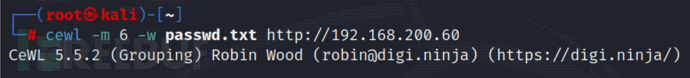

# driftingbules:5 靶场解析及复现 - FreeBuf 网络安全行业门户

**kali 的 IP 地址：192.168.200.14**

**靶机 IP 地址：192.168.200.60**

# 一、信息收集

## 1\. 对利用 nmap 目标靶机进行扫描

由于 arp-scan 属于轻量级扫描，在此直接使用 nmap 进行对目标靶机扫描开放端口

```bash
nmap -A -p 1-65535 192.168.200.60
```

使用 nmap 扫描 开放的端口是 22（ssh）、80（http）端口


## 2\. 访问网站

发现框架是 wordpress 框架，或者也可以使用 wappalyzer、whatweb


既然是 wordpress 系统，那么后台登录页面就是 wp-login.php


# 二、漏洞探测

## 3.wpsan 爆用户名

使用专门扫描 wordpress 得 wpsan

使用 wpscan 扫描下账户信息，发现 gadd、gill、collins、satanic、abuzerkomurcu 账户。

```bash
wpscan --url "http://192.168.200.60/" -e u #对目标网页进行扫描
```


此时，已经拥有了**用户名**将之保存到 username.txt 下，在寻找登陆密码

```bash
gobuster dir -u http://192.168.200.60  -w /usr/share/dirbuster/wordlists/directory-list-2.3-medium.txt  -x php,jpg,txt,html
```


对网站进行扫描之后，没有发现密码本类似得信息

## 4\. 用 cewl 爬取网站密码：

```bash
cewl -m 6 -w passwd.txt http://192.168.200.60 # 爬取网页信息，保存到 passwd.txt 中
```



## 5.wpscan 爆破后台登录账户密码

对刚才发现的几个账户进行密码爆破，

```bash
wpscan --url http://192.168.200.60 -U username.txt -P passwd.txt
```


有一组符合条件

```bash
账户名：gill
密码:interchangeable
```

成功进入后台


这个图片在 index.php 页面没有显示被隐藏，那么首先进行图片隐写的研究


右键复制链接下载到 kali 当中。

```bash
wget 192.168.200.60/wp-content/uploads/2021/02/dblogo.png # 下载
```

## 6\. 识别图片隐藏信息

> Exiftool dblogo.png  
> 这个工具可以识别出一些我们在一般情况下无法识别的图片中的信息

  

**有 ssh 的密码，用户名用之前的那五个用户名试试**


