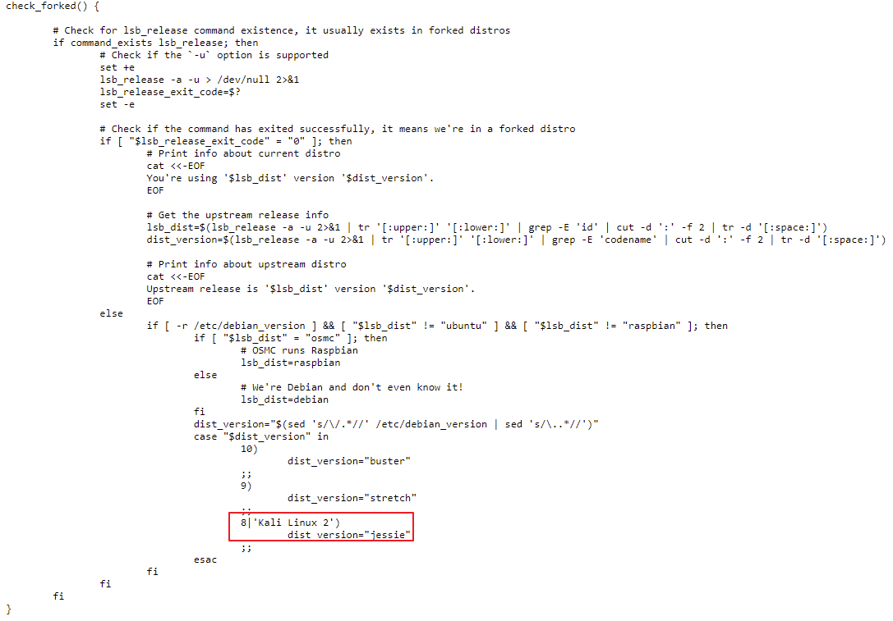
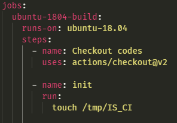
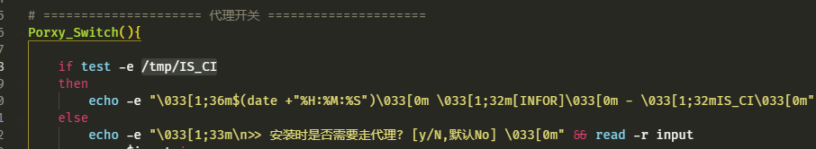

# f8x 开发记录

记录开发 f8x 工具过程中的一些思路和问题，想到哪里写哪里，长期更新

- - -

# [](#%E7%B3%BB%E7%BB%9F%E5%85%BC%E5%AE%B9)系统兼容

系统兼容是个非常重要的问题，如果只能在 centos 上跑，而不能在 ubuntu 上跑，这个部署工具一定是失败的

那么问题来了，shell 脚本本来就是由 linux 命令组成，怎么会换一个发行版就不能跑

原因比较复杂，例如：不同的包管理器，不同的防火墙，不同的网络配置文件，等

其中最麻烦的就是不同的包管理工具，牵扯到不同的安装命令，不同的镜像源配置方式，甚至同发行版下不同版本的源地址，包管理器进程的锁处理，贼烦

|     |     |     |
| --- | --- | --- |
| ```bash<br>1<br>2<br>3<br>4<br>5<br>6<br>7<br>8<br>9<br>``` | ```bash<br>case $Linux_Version in<br>    *"CentOS"*\|*"RedHat"*\|*"Fedora"*)<br>        yum install -y gdb 1> /dev/null 2>> /tmp/f8x_error.log && echo -e "\033[1;36m$(date +"%H:%M:%S")\033[0m \033[1;32m[INFOR]\033[0m - \033[1;32m已安装 gdb 工具\033[0m" \| echo -e "\033[1;36m$(date +"%H:%M:%S")\033[0m \033[1;31m[ERROR]\033[0m - \033[1;31m安装 gdb 工具失败,请查看日志 /tmp/f8x_error.log \n\033[0m"<br>        ;;<br>    *"Kali"*\|*"Ubuntu"*\|*"Debian"*)<br>        apt-get install -y gdb 1> /dev/null 2>> /tmp/f8x_error.log && echo -e "\033[1;36m$(date +"%H:%M:%S")\033[0m \033[1;32m[INFOR]\033[0m - \033[1;32m已安装 gdb 工具\033[0m" \| echo -e "\033[1;36m$(date +"%H:%M:%S")\033[0m \033[1;31m[ERROR]\033[0m - \033[1;31m安装 gdb 工具失败,请查看日志 /tmp/f8x_error.log \n\033[0m"<br>        ;;<br>    *) ;;<br>esac<br>``` |

|     |     |     |
| --- | --- | --- |
| ```bash<br> 1<br> 2<br> 3<br> 4<br> 5<br> 6<br> 7<br> 8<br> 9<br>10<br>11<br>12<br>13<br>14<br>15<br>16<br>17<br>18<br>19<br>20<br>21<br>22<br>23<br>24<br>25<br>``` | ```bash<br># ===================== Modify CentOS YUM sources =====================<br>Update_CentOS_Mirror(){<br><br>    case $Linux_Version_Num in<br>        "8 Stream")<br>            Echo_INFOR "pass"<br>            ;;<br>        8)<br>            rm -f /etc/yum.repos.d/CentOS-Base.repo.bak > /dev/null 2>&1 && cp /etc/yum.repos.d/CentOS-Base.repo /etc/yum.repos.d/CentOS-Base.repo.bak > /dev/null 2>&1 && Echo_INFOR "Backed up Yum sources"<br>            curl -o /etc/yum.repos.d/CentOS-Base.repo https://mirrors.aliyun.com/repo/Centos-8.repo > /dev/null 2>&1 && Echo_INFOR "Downloaded aliyun Yum sources" \| Echo_ERROR "aliyun Yum sources download failed,"<br>            ;;<br>        7)<br>            rm -f /etc/yum.repos.d/CentOS-Base.repo.bak > /dev/null 2>&1 && cp /etc/yum.repos.d/CentOS-Base.repo /etc/yum.repos.d/CentOS-Base.repo.bak > /dev/null 2>&1 && Echo_INFOR "Backed up Yum sources"<br>            curl -o /etc/yum.repos.d/CentOS-Base.repo http://mirrors.aliyun.com/repo/Centos-7.repo > /dev/null 2>&1 && Echo_INFOR "Downloaded aliyun Yum sources" \| Echo_ERROR "aliyun Yum sources download failed,"<br>            ;;<br>        6)<br>            rm -f /etc/yum.repos.d/CentOS-Base.repo.bak > /dev/null 2>&1 && cp /etc/yum.repos.d/CentOS-Base.repo /etc/yum.repos.d/CentOS-Base.repo.bak > /dev/null 2>&1 && Echo_INFOR "Backed up Yum sources"<br>            curl -o /etc/yum.repos.d/CentOS-Base.repo https://mirrors.aliyun.com/repo/Centos-6.repo > /dev/null 2>&1 && Echo_INFOR "Downloaded aliyun Yum sources" \| Echo_ERROR "aliyun Yum sources download failed,"<br>            ;;<br>        *)<br>            Echo_ERROR "Version error"<br>            ;;<br>    esac<br><br>}<br>``` |

f8x 工具中使用 `cat /etc/*-release | head -n 1` 来匹配发行版和具体版本，期间也使用过 `lsb_release -c` 命令，但是在 docker 环境中无法兼容，所以使用上述命令来提高兼容性

|     |     |     |
| --- | --- | --- |
| ```bash<br> 1<br> 2<br> 3<br> 4<br> 5<br> 6<br> 7<br> 8<br> 9<br>10<br>11<br>12<br>13<br>14<br>15<br>16<br>17<br>18<br>19<br>20<br>21<br>22<br>23<br>24<br>25<br>26<br>27<br>28<br>29<br>30<br>31<br>32<br>33<br>34<br>35<br>36<br>37<br>38<br>39<br>40<br>41<br>42<br>43<br>44<br>``` | ```bash<br>    case $(cat /etc/*-release \| head -n 1) in<br>        *"Kali"*\|*"kali"*)<br>            Linux_Version="Kali"<br>            case $(cat /etc/*-release \| head -n 4) in<br>                *"2021"*)<br>                    Linux_Version_Num="kali-rolling"<br>                    Linux_Version_Name="buster"<br>                    ;;<br>                *"2020"*)<br>                    Linux_Version_Num="kali-rolling"<br>                    Linux_Version_Name="buster"<br>                    ;;<br>                *)<br>                    Linux_Version_Num="kali-rolling"<br>                    Linux_Version_Name="stretch"<br>                    ;;<br>            esac<br>            ;;<br>        *"Ubuntu"*\|*"ubuntu"*)<br>            Linux_Version="Ubuntu"<br>            case $(cat /etc/*-release \| head -n 4) in<br>                *"impish"*)<br>                    Linux_Version_Num="21.10"<br>                    Linux_Version_Name="impish"<br>                    ;;<br>                *"hirsute"*)<br>                    Linux_Version_Num="21.04"<br>                    Linux_Version_Name="hirsute"<br>                    ;;<br>                *"groovy"*)<br>                    Linux_Version_Num="20.10"<br>                    Linux_Version_Name="groovy"<br>                    ;;<br>                *"focal"*)<br>                    Linux_Version_Num="20.04"<br>                    Linux_Version_Name="focal"<br>                    ;;<br>                ...<br>                *)<br>                    Echo_ERROR "Unknown Ubuntu Codename"<br>                    exit 1<br>                    ;;<br>            esac<br>            ;;<br>``` |

然并卵，在部分云平台的机器中，甚至连 `/etc/*-release` 文件都没有！要么就是直接把 `/etc/*-release` 文件改的妈都不认识，说的就是你，Azure

所以在后来的版本中加上了手动输入发行版的功能

|     |     |     |
| --- | --- | --- |
| ```bash<br> 1<br> 2<br> 3<br> 4<br> 5<br> 6<br> 7<br> 8<br> 9<br>10<br>11<br>12<br>13<br>14<br>15<br>16<br>17<br>18<br>19<br>20<br>21<br>22<br>23<br>24<br>25<br>26<br>27<br>28<br>29<br>30<br>31<br>32<br>33<br>34<br>35<br>36<br>37<br>38<br>39<br>40<br>41<br>42<br>43<br>``` | ```bash<br>            Echo_ERROR "Unknown version"<br>            echo -e "\033[1;33m\nPlease enter distribution Kali[k] Ubuntu[u] Debian[d] Centos[c] RedHat[r] Fedora[f] AlmaLinux[a] VzLinux[v] Rocky[r]\033[0m" && read -r input<br>            case $input in<br>                [kK])<br>                    Linux_Version="Kali"<br>                    ;;<br>                [uU])<br>                    Linux_Version="Ubuntu"<br>                    echo -e "\033[1;33m\nPlease enter the system version number [21.10] [21.04] [20.10] [20.04] [19.10] [18.04] [16.04] [15.04] [14.04] [12.04]\033[0m" && read -r input<br>                    Linux_Version_Name=$input<br>                    ;;<br>                [dD])<br>                    Linux_Version="Debian"<br>                    echo -e "\033[1;33m\nPlease enter the system version number [11] [10] [9] [8] [7]\033[0m" && read -r input<br>                    Linux_Version_Name=$input<br>                    ;;<br>                [cC])<br>                    Linux_Version="CentOS"<br>                    echo -e "\033[1;33m\nPlease enter the system version number [8] [7] [6]\033[0m" && read -r input<br>                    Linux_Version_Name=$input<br>                    ;;<br>                [rR])<br>                    Linux_Version="RedHat"<br>                    ;;<br>                [aA])<br>                    Linux_Version="AlmaLinux"<br>                    ;;<br>                [fF])<br>                    Linux_Version="Fedora"<br>                    echo -e "\033[1;33m\nPlease enter the system version number [34] [33] [32]\033[0m" && read -r input<br>                    Linux_Version_Name=$input<br>                    ;;<br>                [vV])<br>                    Linux_Version="VzLinux"<br>                    ;;<br>                [rR])<br>                    Linux_Version="Rocky"<br>                    ;;<br>                *)<br>                    Echo_ERROR "Unknown version"<br>                    exit 1<br>                    ;;<br>            esac<br>``` |

目前我也没没有找到较好的解决方案，以 docker 官方的安装脚本 [https://get.docker.com](https://get.docker.com/) 为例，在部分 kali 是无法运行的，因为 kali 不分具体版本号，直接不兼容了🤣

[](https://r0fus0d.blog.ffffffff0x.com/img/f8x/1.png)

- - -

# [](#%E7%8E%AF%E5%A2%83%E5%8F%98%E9%87%8F)环境变量

环境变量的问题是在装 go 时初次发现的，后来在装 CobaltStrike 时愈发严重，CobaltStrike 运行需要用 keytool 工具生成 cobaltstrike.store , 而这个 keytool 工具需要 java 设置 bin 目录的环境变量，在 f8x 自动装完 oraclejdk 后，有时也无法使用 keytool 因为在 shell 脚本中环境变量使用 export, 只在脚本中有效，退出这个脚本，设置的变量就没有了，所以我采用直接写入 bashrc 长期修改环境变量这种方法，但实际场景还是需要使用者手动再开一个 shell 窗口加载环境变量运行 cs

当然使用 source 命令也可以解决问题，因为执行一个脚本文件是在一个子 shell 中运行的，而 source 则是在当前 shell 环境中运行的，这么多环境变量设置我怕影响运行，还是不推荐

- - -

# [](#sast)SAST

搞安全的怎么可以不扫扫自己开发的东西，shell 脚本的 dast 是不存在的，sast 倒是有一两个，

-   [koalaman/shellcheck](https://github.com/koalaman/shellcheck)

不过扫出来的很多是语法上的错误，也是挺有学习价值的。

- - -

# [](#%E6%9B%B4%E6%96%B0)更新

无意中发现 shell 脚本可以自己删除自己，这么一说更新功能岂不是挺容易实现的，直接 curl -o f8x [https://cdn.jsdelivr.net/gh/ffffffff0x/f8x@main/f8x](https://cdn.jsdelivr.net/gh/ffffffff0x/f8x@main/f8x) 覆盖自身即可🤣

|     |     |     |
| --- | --- | --- |
| ```bash<br>1<br>``` | ```bash<br>f8x -update<br>``` |

- - -

# [](#%E4%BB%A3%E7%90%86)代理

代理功能是 f8x 的精髓，就像我在 readme 中缩写的 -p 会执行以下操作

1.  替换你的 DNS (默认为 223.5.5.5), 如果判断是 debian 系还会帮你安装 resolvconf, 长期修改 DNS
2.  检查基础的编译环境是否安装，并通过默认的包管理器安装 gcc,make,unzip 这些基本软件
3.  可选的从 [https://github.com/rofl0r/proxychains-ng](https://github.com/rofl0r/proxychains-ng) 或 ffffffff0x.com 下载 Proxychains-ng 的源码，编译安装
4.  要求你修改 /etc/proxychains.conf 文件
5.  修改 pip 代理为 [https://mirrors.aliyun.com/pypi/simple/](https://mirrors.aliyun.com/pypi/simple/)
6.  修改 docker 代理为 [https://docker.mirrors.ustc.edu.cn](https://docker.mirrors.ustc.edu.cn/) , 并重启 docker 服务

事实上，在大部分选项运行时都会询问是否要走代理，这里就有一个开关的 Tricks

|     |     |     |
| --- | --- | --- |
| ```bash<br> 1<br> 2<br> 3<br> 4<br> 5<br> 6<br> 7<br> 8<br> 9<br>10<br>11<br>12<br>13<br>14<br>15<br>16<br>17<br>18<br>19<br>20<br>21<br>22<br>23<br>24<br>25<br>26<br>27<br>28<br>``` | ```bash<br># ===================== 代理开关 =====================<br>Proxy_Switch(){<br><br>    if test -e /tmp/IS_CI<br>    then<br>        echo -e "\033[1;36m$(date +"%H:%M:%S")\033[0m \033[1;32m[INFOR]\033[0m - \033[1;32mIS_CI\033[0m"<br>    else<br>        echo -e "\033[1;33m\n>> 安装时是否需要走代理? [y/N,默认No] \033[0m" && read -r input<br>        case $input in<br>            [yY][eE][sS]\|[Yy])<br>                export GOPROXY=https://goproxy.io,direct<br>                if test -e /etc/proxychains.conf<br>                then<br>                    echo -e "\033[1;36m$(date +"%H:%M:%S")\033[0m \033[1;32m[INFOR]\033[0m - \033[1;32m正在调用 Proxychains-ng\033[0m"<br>                    Proxy_OK=proxychains4<br>                else<br>                    echo -e "\033[1;36m$(date +"%H:%M:%S")\033[0m \033[1;33m[ALERT]\033[0m - \033[1;33m未检测到 Proxychains-ng,正在执行自动安装脚本\033[0m"<br>                    Proxychains_Install<br>                    Proxy_OK=proxychains4<br>                fi<br>                ;;<br>            *)<br>                echo -e "\033[1;36m$(date +"%H:%M:%S")\033[0m \033[1;32m[INFOR]\033[0m - \033[1;32mPass~\033[0m"<br>                ;;<br>        esac<br>    fi<br><br>}<br>``` |

如果选择那么所有带 Proxy\_OK 变量的命令都会自动走 proxychains4, 同时该子 shell 中 go 的代理也被配置为 goproxy.io, 同时如果并没有安装 proxychains4, 那么会自动进行安装

- - -

# [](#ci)CI

github 提供 action 的 CI 服务，挺好用的，我也不用每次都开 vultr 的机器跑试试了，不过只支持 ubuntu 18 和 20 比较遗憾

每次 f8x 的更新，action 都会自动运行，对 f8x 实际效果感兴趣的话，但手头没有机器的，不妨去看一下运行结果

-   [https://github.com/ffffffff0x/f8x/actions](https://github.com/ffffffff0x/f8x/actions)

在 github action 中一些需要输入的情况会被忽略或报错，这与之前的代理请求造成了冲突，于是添加了一个 /tmp/IS\_CI 的判断，在 action 运行开始就创建这个文件，f8x 检测到这个文件存在就默认忽略代理

[](https://r0fus0d.blog.ffffffff0x.com/img/f8x/7.png)

[](https://r0fus0d.blog.ffffffff0x.com/img/f8x/8.png)

这里要说明一下，action 里面部分工具安装失败有以下几种原因：

1.  机器内存不够
2.  无法进行交互，比如按 Y/N
3.  python 库找不到 (这个是大坑)

- - -

# [](#%E9%94%81)锁

想必你一定见过以下这种报错

|     |     |     |
| --- | --- | --- |
| ```bash<br>1<br>2<br>3<br>4<br>5<br>6<br>7<br>8<br>``` | ```fallback<br>无法获得锁 /var/lib/apt/lists/lock - open (11: 资源暂时不可用)<br><br>E: Unable to correct problems, you have held broken packages.<br><br>dpkg: error: parsing file '/var/lib/dpkg/updates/0023' near line 0<br><br>/var/run/yum.pid 已被锁定，PID 为 1610 的另一个程序正在运行。<br>另外一个程序锁定了 yum；等待它退出……<br>``` |

这里的锁指的是在使用包管理工具进行安装时，中断造成的问题，由于 f8x 基本不会输出任何报错信息在前台，所以有时候出现假死的状态只有手动以 bash -xv f8x 的方式运行排错，还是挺麻烦的，所以我做了个除锁模块

|     |     |     |
| --- | --- | --- |
| ```bash<br> 1<br> 2<br> 3<br> 4<br> 5<br> 6<br> 7<br> 8<br> 9<br>10<br>11<br>12<br>13<br>14<br>15<br>16<br>17<br>18<br>19<br>20<br>21<br>22<br>23<br>``` | ```bash<br># ===================== 除锁模块 =====================<br>Rm_Lock(){<br><br>    case $Linux_Version in<br>        *"CentOS"*\|*"RedHat"*\|*"Fedora"*)<br>            rm -f /var/run/yum.pid 1> /dev/null 2>> /tmp/f8x_error.log<br>            rm -f /var/cache/dnf/metadata_lock.pid 1> /dev/null 2>> /tmp/f8x_error.log<br>            ;;<br>        *"Kali"*\|*"Ubuntu"*\|*"Debian"*)<br>            rm -rf /var/cache/apt/archives/lock 1> /dev/null 2>> /tmp/f8x_error.log<br>            rm -rf /var/lib/dpkg/lock-frontend 1> /dev/null 2>> /tmp/f8x_error.log<br>            rm -rf /var/lib/dpkg/lock 1> /dev/null 2>> /tmp/f8x_error.log<br>            rm -rf /var/lib/apt/lists/lock 1> /dev/null 2>> /tmp/f8x_error.log<br>            apt-get --fix-broken install 1> /dev/null 2>> /tmp/f8x_error.log<br>            rm -rf /var/cache/apt/archives/lock 1> /dev/null 2>> /tmp/f8x_error.log<br>            rm -rf /var/lib/dpkg/lock-frontend 1> /dev/null 2>> /tmp/f8x_error.log<br>            rm -rf /var/lib/dpkg/lock 1> /dev/null 2>> /tmp/f8x_error.log<br>            rm -rf /var/lib/apt/lists/lock 1> /dev/null 2>> /tmp/f8x_error.log<br>            ;;<br>        *) ;;<br>    esac<br><br>}<br>``` |

这里由于不同发行版锁文件都不同，依旧做了版本判断，当运行时，会自动除锁

当然，你也可以手动运行进行除锁

|     |     |     |
| --- | --- | --- |
| ```bash<br>1<br>``` | ```fallback<br>f8x -rmlock<br>``` |

- - -

# [](#%E5%8D%95%E6%96%87%E4%BB%B6%E8%BF%98%E6%98%AF%E5%A4%9A%E6%96%87%E4%BB%B6)单文件还是多文件？

在开发过程中也考虑过采用多文件的方式进行编写，拆分一下结构，后来想一想，本来就是个脚本，在搞 5、6 个文件夹，没有意义，脚本就是要快，一条命令安装，一条命令使用✌

- - -

# [](#%E6%B7%B7%E6%B7%86)混淆

之前接触混淆还是在搞免杀的时候，顺手一搜，没想到 shell 也有混淆的项目，https://github.com/Bashfuscator/Bashfuscator

还原是比较困难了，但是用在项目上没啥意义，也许以后渗透中 bypass 命令执行时可以用到🤔

- - -

# [](#%E4%BE%9B%E5%BA%94%E9%93%BE%E5%AE%89%E5%85%A8)供应链安全

2021-4-22 : 最近正好护网，某红队人员公开了 weblogic\_cmd\_plus , 没想到带后门，看到 DeadEye 安全团队发的文章才意识到被黑吃黑了🤣

总结经验教训

-   以后要少用直接打包，不公开源码的工具
-   “开源软件 " 做混淆，必有蹊跷
-   用之前，传 vt 扫一下把
-   只在 vps 跑工具

- - -

## [](#%E9%97%AE%E9%A2%98%E8%A7%A3%E7%AD%94)问题解答

### [](#%E6%88%91%E9%9C%80%E8%A6%81%E7%9A%84%E5%B7%A5%E5%85%B7%E4%B8%8D%E5%9C%A8%E9%87%8C%E9%9D%A2%E6%80%8E%E4%B9%88%E5%8A%9E)我需要的工具不在里面怎么办？

直接提 issue , 说明工具名称和项目地址

### [](#%E4%B8%BA%E5%95%A5%E4%B8%8D%E7%9B%B4%E6%8E%A5%E8%A3%85-kali)为啥不直接装 kali?

kali 是非常优秀的发行版，f8x 配合 kali 可以让你的工具库更加全面。并且支持各种 ctf 工具的安装。

所以不是为了代替什么，更多的是辅助

### [](#f8x-%E6%9C%AA%E6%9D%A5%E7%9A%84%E6%96%B9%E5%90%91)f8x 未来的方向？

目前 f8x 已经可以做到兼容大部分 linux 发行版，并且支持部署 120+ 款安全工具，所以后续将不断优化兼容性，更新软件版本号等

而 f8x-ctf 还有大量的工作要完成，例如 web、iot、pwn 等方向工具的添加，所以后续重头会放在 f8x-ctf 上

### [](#%E5%A6%82%E4%BD%95%E4%BF%9D%E8%AF%81%E5%AE%89%E8%A3%85%E7%9A%84%E5%B7%A5%E5%85%B7%E7%9A%84%E5%AE%89%E5%85%A8%E6%80%A7)如何保证安装的工具的安全性

工具大部分都是从 github 官方仓库下载，少部分如 anew、marshalsec 为我自己 fork 并编译 release

剩下一些无法直接官方下载的，比如 cs、jdk 等，我就传到 github 仓库中做存档

对安全性存疑，可以手动删除这些下载的工具

### [](#%E7%9B%AE%E5%89%8D%E5%85%BC%E5%AE%B9%E9%82%A3%E4%BA%9B-linux)目前兼容那些 linux

测试过的

-   Ubuntu (12.04/14.04/15.04/16.04/18.04/19.10/20.04/20.10/21.04/21.10)
-   CentOS (6/7/8/8 Stream)
-   Debian (7/8/9/10/11)
-   Fedora (32/33/34/35)
-   Kali (2020/2021)
-   AlmaLinux
-   VzLinux
-   Rocky

### [](#%E5%90%8E%E7%BB%AD%E4%BC%9A%E4%B8%8D%E4%BC%9A%E5%81%9A%E5%87%BA-winmac-%E7%89%88%E6%9C%AC%E7%9A%84-f8x)后续会不会做出 win、mac 版本的 f8x

win 版本不太可能，mac 版有想法，明年可以试下

### [](#%E7%BB%93%E5%B0%BE%E5%9C%A8%E6%8E%A8%E8%8D%90%E5%87%A0%E4%B8%AA%E6%88%91%E4%BB%AC%E7%9A%84%E9%A1%B9%E7%9B%AE)结尾在推荐几个我们的项目

-   1earn - ffffffff0x 团队维护的安全知识框架 - [https://github.com/ffffffff0x/1earn](https://github.com/ffffffff0x/1earn)
-   AboutSecurity - 用于渗透测试的 payload 和 bypass 字典 - [https://github.com/ffffffff0x/AboutSecurity](https://github.com/ffffffff0x/AboutSecurity)
-   Digital-Privacy - 关于数字隐私搜集、保护、清理集一体的方案，外加开源信息收集 (OSINT) 对抗 - [https://github.com/ffffffff0x/Digital-Privacy](https://github.com/ffffffff0x/Digital-Privacy)
-   BerylEnigma - 为渗透测试与 CTF 而制作的工具集 - [https://github.com/ffffffff0x/BerylEnigma](https://github.com/ffffffff0x/BerylEnigma)

整个使用过程中遇到的任何问题，欢迎在项目 issue 提出，我会及时解答并处理
