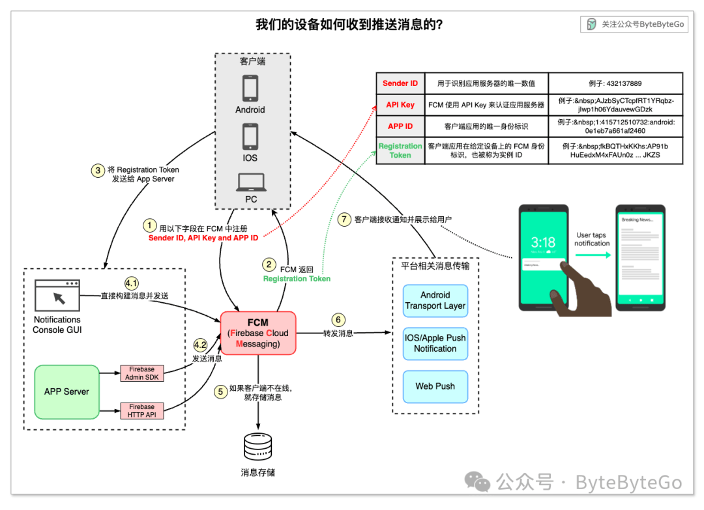

# iPhone, Android 手机是如何收到推送通知的？

我们的手机或电脑是如何收到推送通知的？

通常我们可以使用消息解决方案 Firebase 来支持通知推送。下图显示了 Firebase Cloud Messaging（FCM）的工作原理。

FCM 是一种跨平台消息解决方案，可以可靠地编写、发送、排队和路由推送通知。它在消息发送方（应用程序服务器，App Server）和接收方（客户端应用程序，Client Apps）之间提供了统一的 API。应用程序开发人员可以使用该解决方案来**提高用户留存率**。

## 第 1 - 2 步

当客户端应用程序首次启动时，客户端应用程序会向 FCM 发送凭证，包括 Sender ID、API Key 和 App ID。FCM 会为客户端应用程序实例生成注册令牌（Registration Token，因此注册令牌也称为实例 ID）。该令牌必须包含在通知中。

## 第 3 步

客户端应用程序将注册令牌发送到应用程序服务器。应用程序服务器会缓存令牌，以便后续通信使用。随着时间的推移，应用服务器会有太多的令牌需要维护，因此建议的做法是存储带有时间戳的令牌，并不时删除过期令牌。

## 第 4 步

发送消息有两种方法。一种是直接在控制台图形用户界面中编写消息（第 4.1 步），另一种是从应用程序服务器发送消息（第 4.2 步）。

## 第 5 步

FCM 接收信息，如果设备不在线，则将信息放入存储队列。

## 第 6 步

FCM 将信息转发到平台级传输层。该传输层处理特定于平台的配置。

## 第 7 步

将信息路由到目标设备。可根据应用程序服务器发送的配置显示通知。
