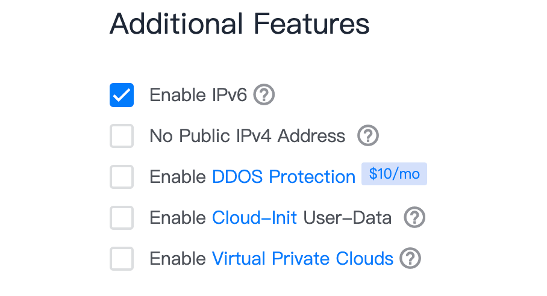
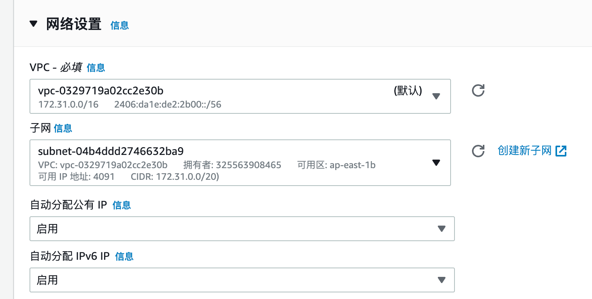
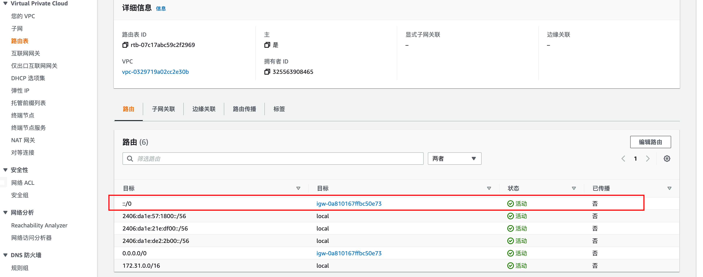
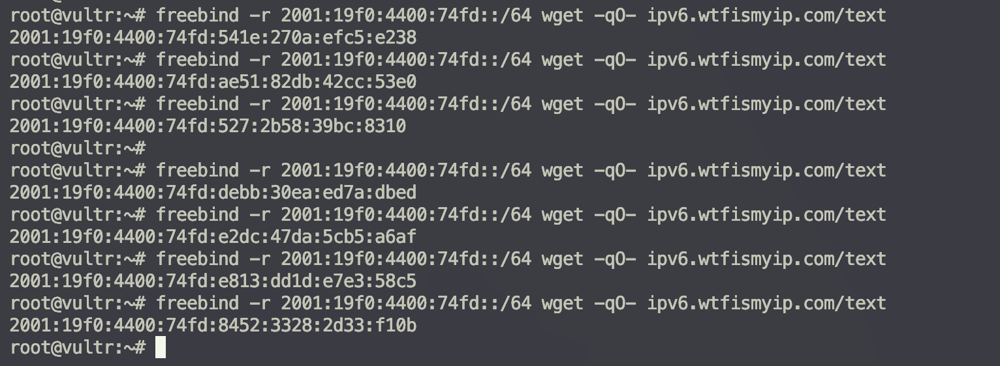
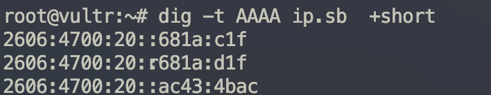
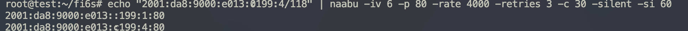

# ipv6 攻击视角

前段时间，突然对 ipv6 这块的资产收集感兴趣，分享下实践出的技巧和方案。

info

本文首发 先知社区 [https://xz.aliyun.com/t/11986](https://xz.aliyun.com/t/11986)

- - -

# [](#%E5%A6%82%E6%9E%9C%E7%9B%AE%E6%A0%87%E6%9C%89-ipv6-%E8%B5%84%E4%BA%A7%E4%BD%A0%E5%A6%82%E4%BD%95%E8%AE%BF%E9%97%AE)如果目标有 ipv6 资产，你如何访问

## [](#%E8%8E%B7%E5%BE%97ipv6%E5%9C%B0%E5%9D%80)获得 ipv6 地址

最简单的方法购买提供 ipv6 地址的 vps

### [](#vultr)vultr

比如 vultr, 购买时选择启用 ipv6 地址即可

[](https://r0fus0d.blog.ffffffff0x.com/img/ipv6/Untitled.png)

### [](#aws)aws

aws 的机器默认没有 ipv6 地址分配，要按如下步骤来开启

1.  vpc 添加 ipv6 CIDR
    
    [](https://r0fus0d.blog.ffffffff0x.com/img/ipv6/Untitled%201.png)
    
2.  vpc 子网分配 ipv6 CIDR 块
    
    [](https://r0fus0d.blog.ffffffff0x.com/img/ipv6/Untitled%202.png)
    
3.  创建 ec2 机器时选择自动分配 ipv6 ip
    
    [](https://r0fus0d.blog.ffffffff0x.com/img/ipv6/Untitled%203.png)
    

这个时候 ip a 就可以看到 ipv6 地址了

[](https://r0fus0d.blog.ffffffff0x.com/img/ipv6/Untitled%204.png)

但是到这一步你会发现获取到了 ipv6 地址，但无法访问任何 ipv6 站点，这是因为这个 vpc 的路由表默认没有 ipv6 出口路由，手动配置如下

[](https://r0fus0d.blog.ffffffff0x.com/img/ipv6/Untitled%205.png)

[](https://r0fus0d.blog.ffffffff0x.com/img/ipv6/Untitled%206.png)

### [](#%E5%8D%8E%E4%B8%BA%E4%BA%91)华为云

华为云和 aws 的步骤类似，现在 vpc 的 subnet 中开启 ipv6 功能，然后在创建 ecs 时选择分配 ipv6 地址

[](https://r0fus0d.blog.ffffffff0x.com/img/ipv6/Untitled%207.png)

[](https://r0fus0d.blog.ffffffff0x.com/img/ipv6/Untitled%208.png)

### [](#%E9%98%BF%E9%87%8C%E4%BA%91)阿里云

类似，vpc 配置开启 ipv6, 创建 ecs 时选择 ipv6 的子网，创建完毕需要开通 ipv6 公网带宽

[](https://r0fus0d.blog.ffffffff0x.com/img/ipv6/9.png)

[](https://r0fus0d.blog.ffffffff0x.com/img/ipv6/Untitled%2010.png)

然后在开启的机器上运行以下命令，获取 ipv6 地址

|     |     |     |
| --- | --- | --- |
| ```bash<br>1<br>2<br>3<br>``` | ```bash<br>wget https://ecs-image-utils.oss-cn-hangzhou.aliyuncs.com/ipv6/rhel/ecs-utils-ipv6<br>chmod +x ./ecs-utils-ipv6<br>./ecs-utils-ipv6<br>``` |

开启 ipv6 公网带宽

[](https://r0fus0d.blog.ffffffff0x.com/img/ipv6/11.png)

[](https://r0fus0d.blog.ffffffff0x.com/img/ipv6/Untitled%2012.png)

[](https://r0fus0d.blog.ffffffff0x.com/img/ipv6/Untitled%2013.png)

## [](#%E5%A6%82%E4%BD%95%E8%AE%A9%E5%AE%A2%E6%88%B7%E7%AB%AF%E8%AE%BF%E9%97%AEipv6%E7%AB%99%E7%82%B9)如何让客户端访问 ipv6 站点

临近饭点，老吴问我如何让自己机器访问 ipv6 地址，因为如果只能通过 vps 进行访问，那一些图形化操作无法实现。

想了想，确实有道理，简单分析下，如果要让客户端访问到 ipv6 机器，那么要么客户端获取公网 ipv6 地址，要么走一些 ipv6 代理服务，比如 [https://proxyline.net/zh-hant/ipv6/](https://proxyline.net/zh-hant/ipv6/)。

获取公网 ipv6 地址不太可行，ipv6 代理服务没必要，能自建干嘛要买。看网上文章里讲 socks5，不用管客户端是 ipv4 还是 ipv6 协议，只要服务端是 ipv6 协议就可以让客户端畅通无阻的在 ipv6 环境下进行通讯。

那么我可以复用之前的 clash 代理池设计，只要节点端可以通 ipv6，应该就可以了。

先看能不能访问

-   ipv6.ip.sb
-   ip.sb

[](https://r0fus0d.blog.ffffffff0x.com/img/ipv6/Untitled%2014.png)

[](https://r0fus0d.blog.ffffffff0x.com/img/ipv6/Untitled%2015.png)

正常来讲，无法访问。

下面配置一个 aws 服务器起 ssr

先按照开始的教程为 aws 配置 ipv6 子网，确保机器可以通 ipv6

|     |     |     |
| --- | --- | --- |
| ```bash<br>1<br>2<br>``` | ```bash<br>curl ipv6.ip.sb<br># 能够正确获取到ipv6地址,这个机子就可以用<br>``` |

起 ssr 服务

|     |     |     |
| --- | --- | --- |
| ```bash<br> 1<br> 2<br> 3<br> 4<br> 5<br> 6<br> 7<br> 8<br> 9<br>10<br>11<br>12<br>13<br>14<br>15<br>16<br>17<br>18<br>19<br>20<br>21<br>``` | ```bash<br>apt-get update<br>apt-get install -y shadowsocks-libev<br>systemctl status shadowsocks-libev<br><br>vim /etc/shadowsocks-libev/config.json<br>{<br>        "server":["::0","0.0.0.0"],<br>        "server_port":60001,<br>        "method":"chacha20-ietf-poly1305",<br>        "password":"1234567890",<br>        "mode":"tcp_and_udp",<br>        "fast_open":false<br>}<br><br>service shadowsocks-libev restart<br># service shadowsocks-libev start<br>service shadowsocks-libev status<br><br>ps ax \| grep ss-server<br><br>ss -tnlp<br>``` |

这里密码我随便设置了，如果生产环境不要用弱口令

启动 ssr 后，写一下 clash 配置

|     |     |     |
| --- | --- | --- |
| ```bash<br> 1<br> 2<br> 3<br> 4<br> 5<br> 6<br> 7<br> 8<br> 9<br>10<br>11<br>12<br>13<br>14<br>15<br>16<br>17<br>18<br>19<br>20<br>21<br>22<br>23<br>24<br>25<br>26<br>27<br>28<br>29<br>30<br>31<br>32<br>33<br>34<br>35<br>36<br>37<br>38<br>39<br>40<br>41<br>42<br>43<br>44<br>45<br>46<br>47<br>48<br>49<br>50<br>51<br>52<br>53<br>54<br>55<br>56<br>57<br>``` | ```yaml<br>mixed-port: 64277<br>allow-lan: true<br>bind-address: '*'<br>mode: rule<br>log-level: info<br>ipv6: true<br>external-controller: 127.0.0.1:9090<br>routing-mark: 6666<br>hosts:<br><br>profile:<br>  store-selected: false<br>  store-fake-ip: true<br><br>dns:<br>  enable: false<br>  listen: 0.0.0.0:53<br>  ipv6: true<br>  default-nameserver:<br>    - 223.5.5.5<br>    - 8.8.8.8<br>  enhanced-mode: fake-ip # or redir-host (not recommended)<br>  fake-ip-range: 198.18.0.1/16 # Fake IP addresses pool CIDR<br>  nameserver:<br>    - 223.5.5.5 # default value<br>    - 8.8.8.8 # default value<br>    - tls://dns.rubyfish.cn:853 # DNS over TLS<br>    - https://1.1.1.1/dns-query # DNS over HTTPS<br>    - dhcp://en0 # dns from dhcp<br>    # - '8.8.8.8#en0'<br><br>proxies:<br>  - name: "1.14.5.14"<br>    type: ss<br>    server: 1.14.5.14<br>    port: 60001<br>    cipher: chacha20-ietf-poly1305<br>    password: "1234567890"<br><br>proxy-groups:<br>  - name: "test"<br>    type: load-balance<br>    proxies:<br>      - 1.14.5.14<br>    url: 'http://www.gstatic.com/generate_204'<br>    interval: 2400<br>    strategy: round-robin<br><br>rules:<br>  - DOMAIN-SUFFIX,google.com,test<br>  - DOMAIN-KEYWORD,google,test<br>  - DOMAIN,google.com,test<br>  - GEOIP,CN,test<br>  - MATCH,test<br>  - SRC-IP-CIDR,192.168.1.201/32,DIRECT<br>  - IP-CIDR,127.0.0.0/8,DIRECT<br>  - DOMAIN-SUFFIX,ad.com,REJECT<br>``` |

1.14.5.14 是我这台 aws 的地址，60001 是监听端口。这不是重点，重点在于 2 行 `ipv6: true`

|     |     |     |
| --- | --- | --- |
| ```bash<br>1<br>2<br>3<br>4<br>5<br>6<br>``` | ```yaml<br>ipv6: true<br><br>dns:<br>  enable: false<br>  listen: 0.0.0.0:53<br>  ipv6: true<br>``` |

必须要配置为 true

导入 clash 配置，再次测试访问

[](https://r0fus0d.blog.ffffffff0x.com/img/ipv6/Untitled%2016.png)

[](https://r0fus0d.blog.ffffffff0x.com/img/ipv6/Untitled%2017.png)

到了这一步，还是不够，因为目前是基于域名的 ipv6 访问，如果要直接访问 ipv6 地址，你会发现还是访问不了，那么该如何做呢

1.  首先，在浏览器中访问 ipv6 地址，需要在前后加括号，例如 `http://[2409:8c0c:310:314:💯38]/#/login`
2.  在 burp 中的代理配置，需要改成 socks5 代理，不能是 upstream proxy servers

[](https://r0fus0d.blog.ffffffff0x.com/img/ipv6/Untitled%2018.png)

现在在浏览器中访问 ipv6 地址，就可以了

[](https://r0fus0d.blog.ffffffff0x.com/img/ipv6/Untitled%2019.png)

- - -

# [](#%E5%A6%82%E6%9E%9C%E4%BD%A0ipv6%E5%9C%B0%E5%9D%80%E8%A2%AB%E5%B0%81%E4%BA%86%E5%A6%82%E4%BD%95%E6%9B%B4%E6%94%B9)如果你 ipv6 地址被封了，如何更改

## [](#%E4%BA%91%E6%9C%8D%E5%8A%A1%E5%99%A8ipv6%E5%9C%B0%E5%9D%80%E7%BB%91%E5%AE%9Avultr%E5%8F%AF%E8%A1%8Caws%E4%B8%8D%E5%8F%AF%E8%A1%8C)云服务器 ipv6 地址绑定 (vultr 可行，aws 不可行)

运营商一般会分配 /64 甚至 /60 的地址，有相当多的 ipv6 可以用

我们可以访问完一次，用命令直接改一下本机对应的 ipv6 地址就好了，譬如只改地址后 64 bits

ip a 查看，vultr 给了如下的 ipv6 地址

|     |     |     |
| --- | --- | --- |
| ```bash<br>1<br>2<br>``` | ```html<br>2401:c080:1400:6787:5400:4ff:fe3b:622b/64<br>2401:c080:1400:6787::/64<br>``` |

|     |     |     |
| --- | --- | --- |
| ```bash<br> 1<br> 2<br> 3<br> 4<br> 5<br> 6<br> 7<br> 8<br> 9<br>10<br>11<br>12<br>13<br>14<br>15<br>16<br>17<br>18<br>19<br>20<br>21<br>22<br>23<br>24<br>25<br>26<br>27<br>28<br>29<br>30<br>31<br>``` | ```bash<br># 添加路由<br>ip route add local 2401:c080:1400:6787::/64 dev enp1s0<br><br># 为了能够绑定任意 IP，我们需要开启内核的 ip_nonlocal_bind 特性：<br>sysctl net.ipv6.ip_nonlocal_bind=1<br><br># NDP<br># 类似于 IPv4 中 ARP 协议的作用，IPv6 中需要使用 ND 协议来发现邻居并确定可用路径。我们需要开启一个 ND 代理：<br># 安装 ndppd<br>apt install ndppd<br><br># 编辑 /etc/ndppd.conf 文件:<br>vim /etc/ndppd.conf<br><br>route-ttl 30000<br>proxy enp1s0 {<br>router no<br>timeout 500<br>ttl 30000<br>rule 2401:c080:1400:6787::/64 {<br>static<br>}<br>}<br><br># 启动 ndppd<br>systemctl start ndppd<br><br># 接下来你可以验证一下了，用 curl --interface 指定出口 IP：<br>curl --interface 2401:c080:1400:6787::1 ipv6.ip.sb<br>curl --interface 2401:c080:1400:6787::2 ipv6.ip.sb<br>curl --interface 2401:c080:1400:6787::3 http://icanhazip.com/<br>``` |

[](https://r0fus0d.blog.ffffffff0x.com/img/ipv6/Untitled%2020.png)

后来在看 massdns 项目的时候发现作者在 freebind 项目里实现了类似的需求

[https://github.com/blechschmidt/freebind](https://github.com/blechschmidt/freebind)

测试下，先在机器上安装

|     |     |     |
| --- | --- | --- |
| ```bash<br>1<br>2<br>3<br>4<br>``` | ```bash<br>git clone https://github.com/blechschmidt/freebind.git<br>cd freebind<br>apt install libnetfilter-queue-dev<br>make install<br>``` |

|     |     |     |
| --- | --- | --- |
| ```bash<br>1<br>2<br>3<br>4<br>5<br>``` | ```bash<br># 添加路由<br>ip -6 route add local 2a00:1450:4001:81b::/64 dev enp1s0<br><br># 访问测试<br>freebind -r 2a00:1450:4001:81b::/64 wget -qO- ipv6.wtfismyip.com/text<br>``` |

[](https://r0fus0d.blog.ffffffff0x.com/img/ipv6/Untitled%2021.png)

**那么网站方如何防御呢？**

一种应对方式是直接 ban /64,/56 乃至 /48

现在我们有了 ipv6 条件，那么接下来要找目标

如何获得目标的 ipv6 地址呢

- - -

# [](#%E5%A6%82%E4%BD%95%E6%94%B6%E9%9B%86%E7%9B%AE%E6%A0%87ipv6%E8%B5%84%E4%BA%A7)如何收集目标 ipv6 资产

## [](#%E5%9F%9F%E5%90%8Daaaa%E6%9F%A5%E8%AF%A2)域名 AAAA 查询

经过进一步查询，得知 AAAA 类型的解析记录，可以实现 IPv6 的解析

使用 dig 进行查询

|     |     |     |
| --- | --- | --- |
| ```bash<br>1<br>2<br>``` | ```bash<br>dig -t AAAA [域名]<br>dig -t AAAA +short [域名]<br>``` |

[](https://r0fus0d.blog.ffffffff0x.com/img/ipv6/Untitled%2022.png)

[](https://r0fus0d.blog.ffffffff0x.com/img/ipv6/Untitled%2023.png)

使用 dnsx 进行查询

|     |     |     |
| --- | --- | --- |
| ```bash<br>1<br>2<br>3<br>``` | ```bash<br>echo ip.sb \| dnsx -silent -aaaa<br>echo ip.sb \| dnsx -silent -aaaa -resp-only<br>dnsx -aaaa -o output.txt -l input.txt<br>``` |

[](https://r0fus0d.blog.ffffffff0x.com/img/ipv6/Untitled%2024.png)

[](https://r0fus0d.blog.ffffffff0x.com/img/ipv6/Untitled%2025.png)

## [](#%E9%80%9A%E8%BF%87%E6%90%9C%E7%B4%A2%E5%BC%95%E6%93%8E%E6%9F%A5%E6%89%BE)通过搜索引擎查找

目前各大搜索引擎基本都是支持 ipv6 的语法的，hunter 好像不支持，可惜

**fofa**

-   [https://fofa.info/](https://fofa.info/)

|     |     |     |
| --- | --- | --- |
| ```bash<br>1<br>``` | ```yaml<br>is_ipv6=true && country="CN" && port="80" && protocol="http"<br>``` |

**quake**

-   [https://quake.360.net/](https://quake.360.net/)

|     |     |     |
| --- | --- | --- |
| ```bash<br>1<br>``` | ```yaml<br>is_ipv6:"true" && body:"登录"<br>``` |

**zoomeye**

-   [https://www.zoomeye.org/](https://www.zoomeye.org/)

|     |     |     |
| --- | --- | --- |
| ```bash<br>1<br>``` | ```yaml<br>ip:"2600:3c00::f03c:91ff:fefc:574a"<br>``` |

## [](#asn%E6%9F%A5%E6%89%BE)ASN 查找

**asnmap**

[https://github.com/projectdiscovery/asnmap](https://github.com/projectdiscovery/asnmap)

|     |     |     |
| --- | --- | --- |
| ```bash<br>1<br>``` | ```bash<br>echo hackerone.com \| ./asnmap -json -silent \| jq<br>``` |

有些 asn 信息会有 ipv6 地址范围

[](https://r0fus0d.blog.ffffffff0x.com/img/ipv6/Untitled%2026.png)

## [](#ipv6%E5%9C%B0%E5%9D%80%E6%89%AB%E6%8F%8F)ipv6 地址扫描

ipv6 掩码计算器

-   [https://jennieji.github.io/subipv6/](https://jennieji.github.io/subipv6/)

**fi6s**

[https://github.com/sfan5/fi6s](https://github.com/sfan5/fi6s)

|     |     |     |
| --- | --- | --- |
| ```bash<br>1<br>2<br>3<br>4<br>``` | ```bash<br>apt install gcc make git libpcap-dev<br>git clone https://github.com/sfan5/fi6s.git<br>cd fi6s<br>make BUILD_TYPE=release<br>``` |

|     |     |     |
| --- | --- | --- |
| ```bash<br>1<br>2<br>3<br>``` | ```bash<br>./fi6s -p 80 2001:da8:9000:e013::199:4/115 --randomize-hosts 0<br><br>/fi6s -p 80,8000-8100 2001:db8::/120<br>``` |

[](https://r0fus0d.blog.ffffffff0x.com/img/ipv6/Untitled%2027.png)

实际测试速度很快，但是掩码小于 / 112 的情况下，扫描结果数会直线下降，就很难扫出结果

**naabu**

[https://github.com/projectdiscovery/naabu](https://github.com/projectdiscovery/naabu)

|     |     |     |
| --- | --- | --- |
| ```bash<br>1<br>``` | ```bash<br>echo "2001:da8:9000:e013::199:4/118" \| naabu -iv 6 -p 80 -rate 4000 -retries 3 -c 30 -silent -si 60<br>``` |

[](https://r0fus0d.blog.ffffffff0x.com/img/ipv6/Untitled%2028.png)

扫描速度比 fi6s 慢很多，但是漏报率低，精准度高。

- - -

# [](#source--reference)Source & Reference

-   [https://zu1k.com/posts/tutorials/http-proxy-ipv6-pool/](https://zu1k.com/posts/tutorials/http-proxy-ipv6-pool/)
-   [https://v2ex.com/t/833075](https://v2ex.com/t/833075)
-   [https://blog.yllhwa.com/2022/09/05 / 利用 IPV6 绕过 B 站的反爬 /](https://blog.yllhwa.com/2022/09/05/%E5%88%A9%E7%94%A8IPV6%E7%BB%95%E8%BF%87B%E7%AB%99%E7%9A%84%E5%8F%8D%E7%88%AC/)
