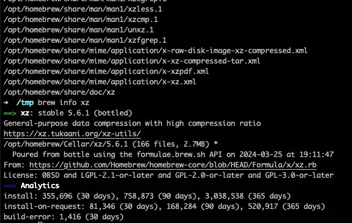
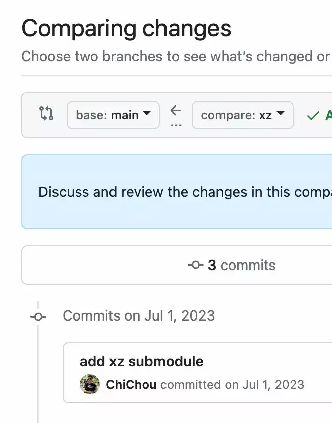
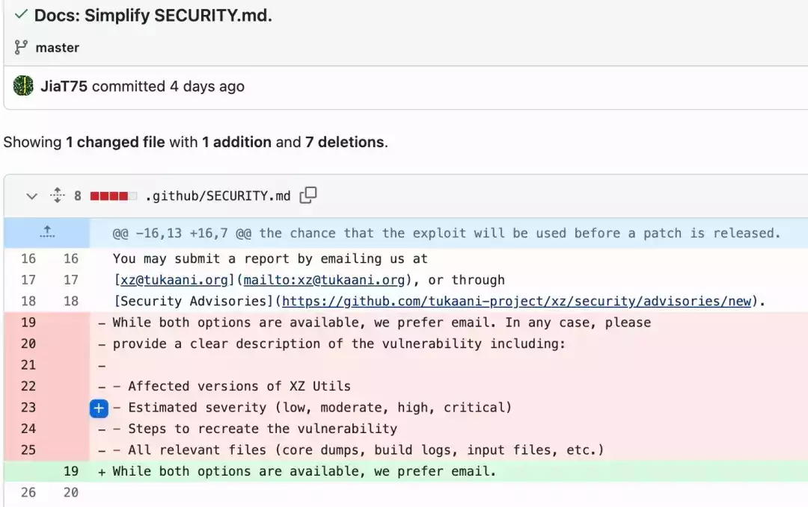

# liblzma / xz 被植入后门，Jia Tan 是何方神圣

复活节小长假前最后一个周五，快下班了，网上突然扔出一记重磅炸弹，xz 被植入了后门：

https://www.openwall.com/lists/oss-security/2024/03/29/4


起先有人发现服务器上 sshd 出现异常资源占用的现象，一番排查发现竟然是从 xz 软件包里感染的后门程序。目前已知的后门存在于 v5.6.0 和 v5.6.1 版本。

但是这个代码的提交人两年前就加入了项目维护，暂时不能确定之前的版本有没有问题。

这个后门会篡改 Makefile 注入恶意脚本到 configure 里执行，从而在生成的代码里链接恶意的 .o。当满足一定条件，即当前进程是 /usr/sbin/sshd，不存在调试环境变量，配置了 LANG，就会触发后门逻辑。

OpenWall 的帖子还给出了一段快速检测后门是否存在的脚本：

```plain
#! /bin/bash

set -eu

# find path to liblzma used by sshd
path="$(ldd $(which sshd) | grep liblzma | grep -o '/[^ ]*')"

# does it even exist?
if [ "$path" == "" ]
then
  echo probably not vulnerable
  exit
fi

# check for function signature
if hexdump -ve '1/1 "%.2x"' "$path" | grep -q f30f1efa554889f54c89ce5389fb81e7000000804883ec28488954241848894c2410
then
  echo probably vulnerable
else
  echo probably not vulnerable
fi
```

这个恶意后门被分配了编号 CVE-2024-3094。  

目前迹象表明，后门作者有选择地针对 linux 发行版下手。但这个 liblzma 可不只 Linux 上用。

比如目前流行的 iOS 越狱环境，大部分 tweak 包还是以 .deb 格式发行，比较新的版本就用到了 lzma 作为压缩。

除此之外近期有在 macOS 上使用 brew 安装过 xz 这个包应该也受影响，暂时不能证明有恶意行为：



要命的是很多 brew 包都依赖了 xz，你可能不知不觉就装上了…… 你问我为什么会有这张图？？？我也中奖了啊亲。还好目前没有证据表明这个后门会感染 macOS。

下面来扒一下这位提交代码的作者。


我前几个月就对这个 GitHub 账号有点印象。不是我马后炮，而是我当时正好在维护一个一键部署 frida-server 的脚本，有人反馈他们的发行版上没有自带 xz 命令；而 nodejs 的 lzma 包又有兼容性问题，我就考虑要不要把 lzma 用 wasm 编译到项目里去。



我当时去 lzma 库的主页逛了一圈，就觉得有点奇怪，这个两个维护人，其中一个的名字看着像中文又好像不太对……

那么这个作者有没有可能是因为被盗号？大家觉得不太像，看他的提交记录和疯狂 push 相关发行版合并上游变更的发言，很难洗地。

4 天前刚改 SECURITY.md，让大家发现有什么问题请**偷偷**发邮件联系。



观察此人的提交记录，已经在项目里潜伏了两年了。

https://github.com/tukaani-project/xz/commits?author=JiaT75

最早的提交是在 2022 年 2 月 6 日，一直都是 merge request，终于到 2022 年 12 月有了直接向仓库提交代码的权限。


除了 xz，还尝试给 libarchive 加料，这个库 iOS 也用到了：


东窗事发之前，昨天还在催促 Ubuntu 邮件组合并 debian 的修改：

https://bugs.launchpad.net/ubuntu/+source/xz-utils/+bug/2059417


截至目前事件还在持续发酵，我先去操心自己电脑到底有没有被搞了。
