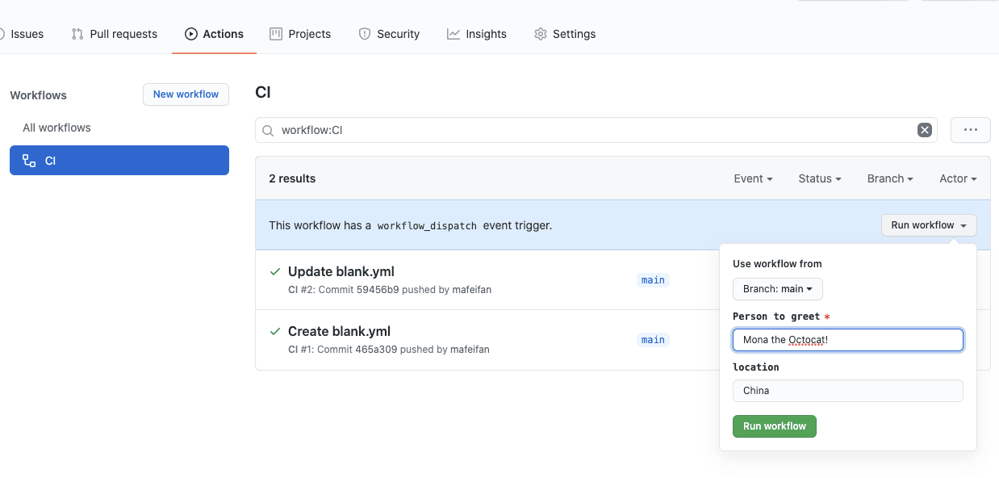

# mafeifan 的编程技术分享 | mafeifan 的编程技术分享

默认情况只有`push`和`pull request`动作才会触发构建

yaml

```plain
on:
  push:
    branches: [ main ]
  pull_request:
    branches: [ main ]
```

最简单的做法，添加`workflow_dispatch`动作

yaml

```plain
on:
  workflow_dispatch:
  push:
    branches: [ main ]
  pull_request:
    branches: [ main ]
```

这样在 actions 页面可以看到执行构建的按钮，选择分支后可以执行手动构建。 

yaml

```plain
on:
  workflow_dispatch:
    inputs:
      name:
        description: 'Person to greet'
        required: true
        default: 'Mona the Octocat'
      home:
        description: 'location'
        required: false

jobs:
  say_hello:
    runs-on: ubuntu-latest
    steps:
    - run: |
        echo "Hello ${{ github.event.inputs.name }}!"
        echo "- in ${{ github.event.inputs.home }}!"
```

关于手动触发还支持自定义输入文本，也就是输入文本当成传入的参数，用在后续的构建命令中 

### 参考 [​](#%E5%8F%82%E8%80%83)

[https://p3terx.com/archives/github-actions-manual-trigger.html](https://p3terx.com/archives/github-actions-manual-trigger.html)

[https://docs.github.com/en/free-pro-team@latest/actions/reference/events-that-trigger-workflows#manual-events](https://docs.github.com/en/free-pro-team@latest/actions/reference/events-that-trigger-workflows#manual-events)