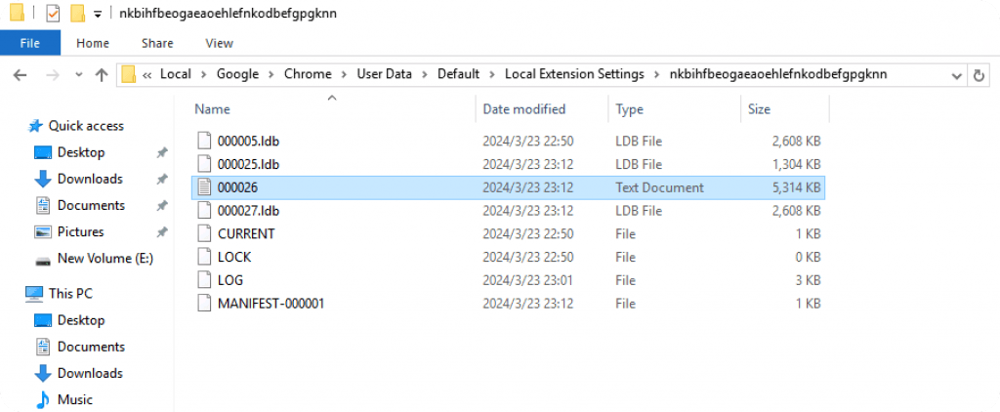

# metamask 从插件文件中恢复助记词 – Zgao's blog


上周研究了一下如何从小狐狸的插件文件中恢复助记词。结合官方描述是在知道密码的前提下，可以从插件文件中提取 vault 字段在官方提供的解密页面进行恢复。

[https://metamask.github.io/vault-decryptor/](https://metamask.github.io/vault-decryptor/)

## 插件目录

以 Chrome 为例，小狐狸插件配置文件目录为：

```plain
C:\Users\Administrator\AppData\Local\Google\Chrome\User Data\Default\Local Extension Settings\
```

注意：插件源码和配置文件并不在同一个目录下。插件的 ID 可以在 chrome://extensions 中看到。




## 获取 vault

这里的 ldb 文件是 Google 的 leveldb 数据库文件，需要用特定的方式打开。而在 log 文件中也能找到加密后的 vault，直接用记事本打开搜索 KeyringController。


复制 vault 对应完整的 json。

## 解密助记词


## 代码解密

Post Views: 15
