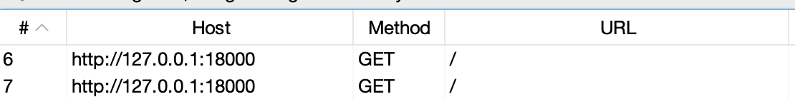
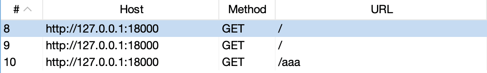
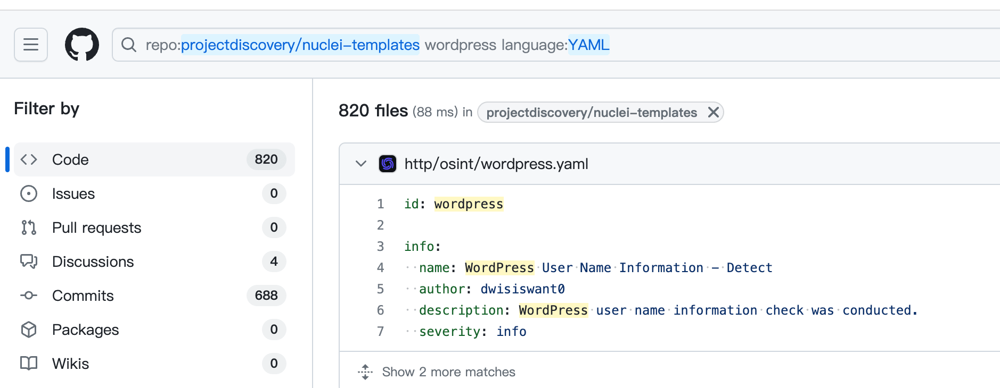

# nuclei 模板编写踩坑

一点吐槽

- - -

## [](#yaml%E6%A0%BC%E5%BC%8F)yaml 格式

多一个空格都不行，真的很严格

[](https://r0fus0d.blog.ffffffff0x.com/img/nuclei/Untitled.png)

## [](#%E8%AF%B7%E6%B1%82%E5%90%88%E5%B9%B6)请求合并

请求合并是非常优秀的功能，但是在部分场景下会无法合并，例如

|     |     |     |
| --- | --- | --- |
| ```bash<br>1<br>2<br>3<br>4<br>``` | ```jsx<br>http:<br>  - method: GET<br>    path:<br>      - "{{BaseURL}}"<br>``` |

|     |     |     |
| --- | --- | --- |
| ```bash<br>1<br>2<br>3<br>4<br>5<br>6<br>7<br>``` | ```jsx<br>http:<br>  - method: GET<br>    path:<br>      - "{{BaseURL}}"<br><br>    host-redirects: true<br>    max-redirects: 2<br>``` |

[](https://r0fus0d.blog.ffffffff0x.com/img/nuclei/Untitled%201.png)

又例如

|     |     |     |
| --- | --- | --- |
| ```bash<br>1<br>2<br>3<br>4<br>5<br>6<br>7<br>``` | ```fallback<br>http:<br>  - method: GET<br>    path:<br>      - "{{BaseURL}}"<br><br>    host-redirects: true<br>    max-redirects: 2<br>``` |

|     |     |     |
| --- | --- | --- |
| ```bash<br>1<br>2<br>3<br>4<br>5<br>6<br>7<br>8<br>``` | ```fallback<br>http:<br>  - method: GET<br>    path:<br>      - "{{BaseURL}}"<br>      - "{{BaseURL}}/aaa"<br><br>    host-redirects: true<br>    max-redirects: 2<br>``` |

[](https://r0fus0d.blog.ffffffff0x.com/img/nuclei/Untitled%202.png)

## [](#workflow%E7%9A%84%E8%AF%B7%E6%B1%82%E5%90%88%E5%B9%B6)workflow 的请求合并

在 workflow 的扫描流程中

即使 finger 的扫描请求完全一致，请求也是拆分出来的，无法自动合并，估计是实现逻辑上的问题。

|                                                                             |                                                                                                                                                                                                                   |     |
| --------------------------------------------------------------------------- | ----------------------------------------------------------------------------------------------------------------------------------------------------------------------------------------------------------------- | --- |
| ```bash<br> 1<br> 2<br> 3<br> 4<br> 5<br> 6<br> 7<br> 8<br> 9<br>10<br>``` | ```fallback<br>id: test1-workflow<br><br>info:<br>  name: test1 workflow<br>  author: aaaa<br><br>workflows:<br>  - template: /tmp/test1-detect.yaml<br>    subtemplates:<br>      - template: /tmp/test1/<br>``` |     |

|     |     |     |
| --- | --- | --- |
| ```bash<br> 1<br> 2<br> 3<br> 4<br> 5<br> 6<br> 7<br> 8<br> 9<br>10<br>``` | ```fallback<br>id: test2-workflow<br><br>info:<br>  name: test2 workflow<br>  author: aaaa<br><br>workflows:<br>  - template: /tmp/test2-detect.yaml<br>    subtemplates:<br>      - template: /tmp/test2/<br>``` |

|     |     |     |
| --- | --- | --- |
| ```bash<br> 1<br> 2<br> 3<br> 4<br> 5<br> 6<br> 7<br> 8<br> 9<br>10<br>11<br>12<br>13<br>14<br>15<br>``` | ```fallback<br>id: test1-detect<br><br>info:<br>  name: test1-detect<br>  author: aaa<br>  severity: info<br>  tags: tech<br><br>http:<br>  - method: GET<br>    path:<br>      - "{{BaseURL}}"<br><br>    host-redirects: true<br>    max-redirects: 2<br>``` |

|     |     |     |
| --- | --- | --- |
| ```bash<br> 1<br> 2<br> 3<br> 4<br> 5<br> 6<br> 7<br> 8<br> 9<br>10<br>11<br>12<br>13<br>14<br>15<br>``` | ```fallback<br>id: test2-detect<br><br>info:<br>  name: test2-detect<br>  author: aaa<br>  severity: info<br>  tags: tech<br><br>http:<br>  - method: GET<br>    path:<br>      - "{{BaseURL}}"<br><br>    host-redirects: true<br>    max-redirects: 2<br>``` |

[](https://r0fus0d.blog.ffffffff0x.com/img/nuclei/Untitled%203.png)

## [](#%E5%8F%98%E9%87%8F%E8%A7%A3%E6%9E%90)变量解析

之前遇到的问题了

提的 issue

|     |     |     |
| --- | --- | --- |
| ```bash<br>1<br>2<br>3<br>4<br>5<br>6<br>7<br>``` | ```fallback<br>requests:<br>  - method: GET<br>    path:<br>      - "{{BaseURL}}/{{123123}}"<br>      - "{{BaseURL}}/{{aaabbb}}"<br>      - "{{BaseURL}}/{{123*123}}"<br>      - "{{BaseURL}}/{{123!123}}"<br>``` |

主要在于解析的情况不一致

[https://github.com/projectdiscovery/nuclei/issues/1497](https://github.com/projectdiscovery/nuclei/issues/1497)

后面在版本更新中得以解决

## [](#%E4%BD%8E%E8%B4%A8%E9%87%8F-wordpress-cve-poc)低质量 wordpress cve poc

怎么这么多人喜欢刷这种低质量的 cve 编号

关键是怎么还就有人喜欢写这种低质量漏洞的 poc, 闲的蛋疼吗。。。

[](https://r0fus0d.blog.ffffffff0x.com/img/nuclei/Untitled%204.png)

[](https://r0fus0d.blog.ffffffff0x.com/img/nuclei/Untitled%205.png)

[](https://r0fus0d.blog.ffffffff0x.com/img/nuclei/Untitled%206.png)

[](https://r0fus0d.blog.ffffffff0x.com/img/nuclei/Untitled%207.png)

- - -

## [](#%E6%80%BB%E7%BB%93)总结

nuclei 无疑是近年来安全行业最火热的工具之一，这也和其开发团队的努力脱不开联系，就以外网打点，漏洞扫描来看，不说自己二开、集成，就能把模板自己写写，优化好误报漏报，其实就能发挥很大的威力了。

最后推荐下官方的和我的 burp 插件，用来辅助编写模板

**nuclei-burp-plugin**

[https://github.com/projectdiscovery/nuclei-burp-plugin](https://github.com/projectdiscovery/nuclei-burp-plugin)

**nu\_te\_gen**

[https://github.com/ffffffff0x/burp\_nu\_te\_gen](https://github.com/ffffffff0x/burp_nu_te_gen)
