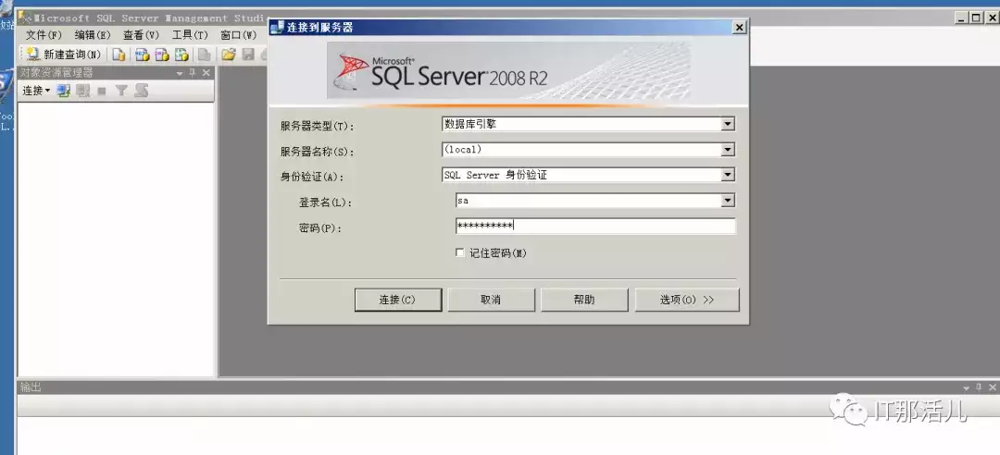
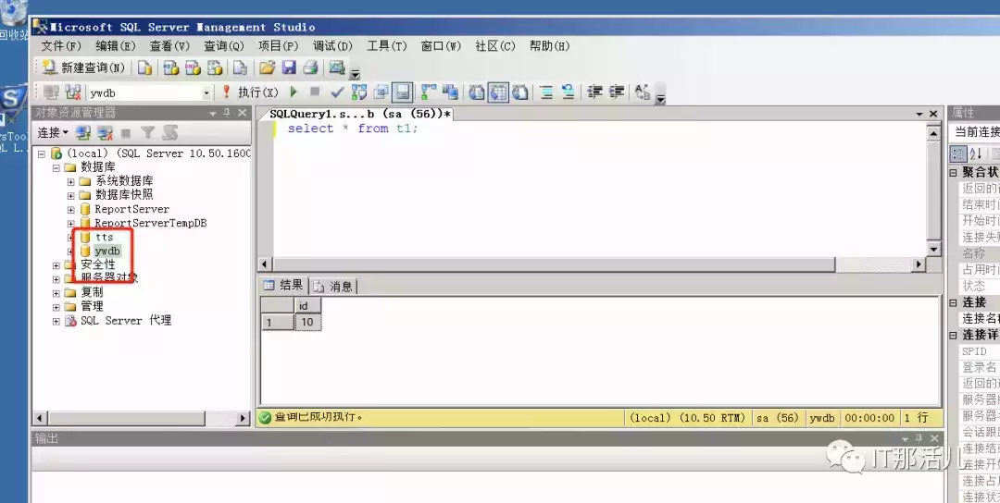
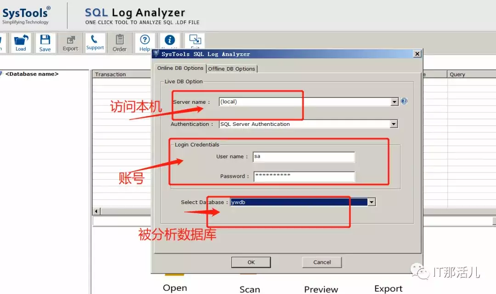
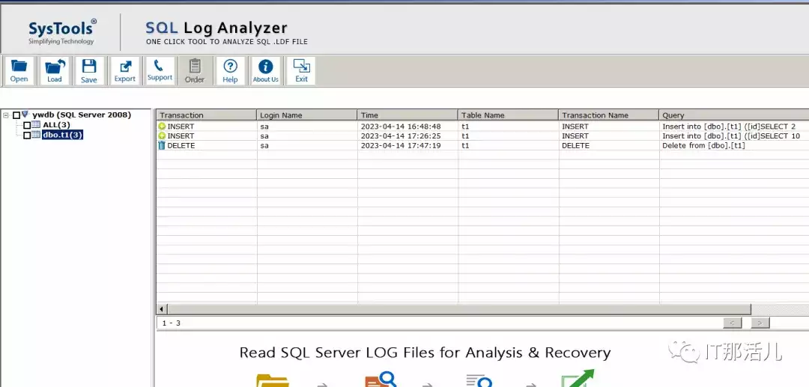
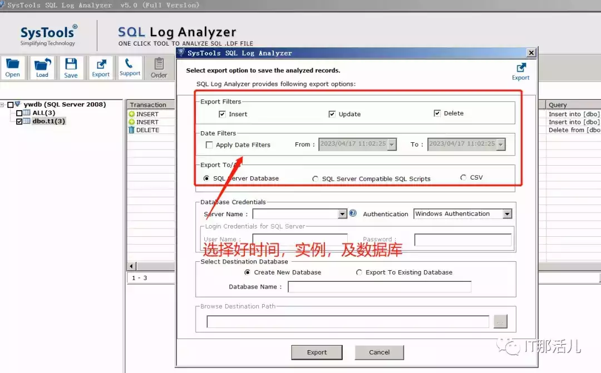
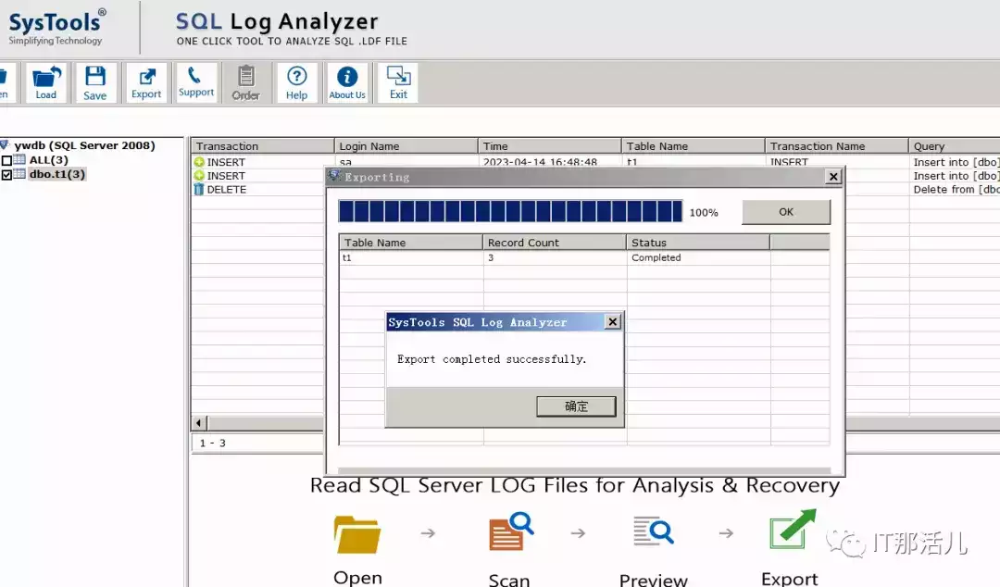

# sqlserver数据库日志分析工具SQL Log Analyzer使用实践

  

背 景

某公司某账号突然间被删除，客户紧急召开会议，需我侧协助分析并查明sqlserver中的数据是何时被谁删除。  

由于sqlserver本身未开审计，无法从字典进行溯源，只能分析当时的事务日志，但是微软自带的分析软件收费也无法使用,于是从第三方sqlserver分析软件着手，在整个过程试了log explorer,但由于客户版本是sqlserver2012,log explorer低版本不支持sqlserver2012的解析，log explorer高版本支持同时不能在线分析，后面发现工具SysToolsSQLLogAnalyzer支持2008及2012等数据库版本，可以做在线查看，并且可以恢复被删除的数据。

**本案主要就是**使用sql-log-analyzer工具对sqlserver2008的实践，至于客户sqlserver2012的分析，涉密，但分析雷同，下面就是对该工具的使用介绍。

  

SQL Log Analyzer工具使用

  

**2.1 环境准备**  

安装windows server 2008并同时安装好sqlserver 2008数据库。  

# **2.2 创建SqlServer数据库**

创建sqlserver数据库ywdb，并创建表t1,模拟插入二条记录和删除一条记录：

# **2.3 SQLLogAnalyzer分析工具安装及使用**

## **1）**下载SysTools SQL Log Analyzer并安装，安装完后，在桌面点击

## **2）**以sa账号连接被分析数据库

-   连接数据库实例
    

-   选择好将要分析的数据库DB
    

-   生成分析的结果数据
    

## **3）**分析后的结果数据可以进行导出

## **4）**结果数据会以指定的需求生成

# **总 结：**

在日常工作，若遇见sqlserver有误操作或溯源问题时，可通过工具SysTools SQL Log Analyzer进行分析，以便能找到引发问题的根因，最终解决问题，本案分析比较简单，希望能给大家提供一个分析思路。