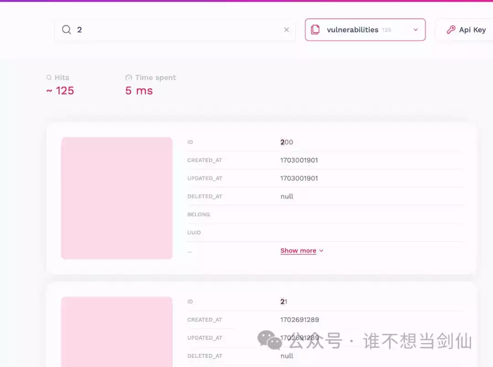

# ​资产绘测增加 Meilisearch 搜索引擎实践

🔎 为资产绘测增加一个搜索引擎

## 1.安装 meilisearch

https://www.meilisearch.com/docs/learn/getting\_started/installation\[1\]

这里使用 docker compose 的方式启动

```plain
version: '3'
services:
  meilisearch:
    image: getmeili/meilisearch:latest
    restart: always
    volumes:
      - ./data.ms:/data.ms  # 防止 docker compose down 后数据丢失
      - ./meilisearch.toml:/etc/meilisearch.toml
    # 不知道为什么不能用 --config-file-path 指定的形式，会报找不到文件的错误，明明存在
    environment:
      - MEILI_CONFIG_FILE_PATH=/etc/meilisearch.toml
    ports:
      - "7700:7700"
```

`meilisearch.toml` 文件内容

https://raw.githubusercontent.com/meilisearch/meilisearch/latest/config.toml\[2\]

```plain
# 指定创建和检索数据库文件的位置
db_path = "./data.ms"

# 配置实例的环境 开发环境下会启动一个 web 界面 development | production
env = "development"

# 设置秘钥 ，最少 16 字节，开发模式也建议设置一个，生产模式下如果不指定会报错，无法启动
master_key = "YOUR_MASTER_KEY_VALUE"

# 监听地址
http_addr = "localhost:7700"

# 不给 meilisearch 提供分析
no_analytics = true

# 设置可接受的有效负载的最大大小。
http_payload_size_limit = "100 MB"

# 日志级别  `OFF`, `ERROR`, `WARN`, `INFO`, `DEBUG`, `TRACE`
log_level = "INFO"

# 设置Meilisearch在索引时可以使用的最大RAM大小。
# max_indexing_memory = "2 GiB"

# 设置Meilisearch在索引期间可以使用的最大线程数。
# max_indexing_threads = 4

# 设置Meilisearch创建转储文件的目录
dump_dir = "dumps/"

# Pevents Meilisearch from throwing an error when `import_dump` does not point to a valid dump file.
ignore_missing_dump = false

# Prevents a Meilisearch instance with an existing database from throwing an error when using `import_dump`.
ignore_dump_if_db_exists = false

# 是否创建快照
schedule_snapshot = false

# Sets the directory where Meilisearch will store snapshots.
snapshot_dir = "snapshots/"

# Launches Meilisearch after importing a previously-generated snapshot at the given filepath.
# https://www.meilisearch.com/docs/learn/configuration/instance_options#import-snapshot
# import_snapshot = "./path/to/my/snapshot"

# Prevents a Meilisearch instance from throwing an error when `import_snapshot` does not point to a valid snapshot file.
# https://www.meilisearch.com/docs/learn/configuration/instance_options#ignore-missing-snapshot
ignore_missing_snapshot = false

# Prevents a Meilisearch instance with an existing database from throwing an error when using `import_snapshot`.
# https://www.meilisearch.com/docs/learn/configuration/instance_options#ignore-snapshot-if-db-exists
ignore_snapshot_if_db_exists = false

###########
### SSL ###
###########

# Enables client authentication in the specified path.
# https://www.meilisearch.com/docs/learn/configuration/instance_options#ssl-authentication-path
# ssl_auth_path = "./path/to/root"

# Sets the server's SSL certificates.
# https://www.meilisearch.com/docs/learn/configuration/instance_options#ssl-certificates-path
# ssl_cert_path = "./path/to/certfile"

# Sets the server's SSL key files.
# https://www.meilisearch.com/docs/learn/configuration/instance_options#ssl-key-path
# ssl_key_path = "./path/to/private-key"

# Sets the server's OCSP file.
# https://www.meilisearch.com/docs/learn/configuration/instance_options#ssl-ocsp-path
# ssl_ocsp_path = "./path/to/ocsp-file"

# Makes SSL authentication mandatory.
# https://www.meilisearch.com/docs/learn/configuration/instance_options#ssl-require-auth
ssl_require_auth = false

# Activates SSL session resumption.
# https://www.meilisearch.com/docs/learn/configuration/instance_options#ssl-resumption
ssl_resumption = false

# Activates SSL tickets.
# https://www.meilisearch.com/docs/learn/configuration/instance_options#ssl-tickets
ssl_tickets = false

#############################
### Experimental features ###
#############################

# Experimental metrics feature.
# Enables the Prometheus metrics on the `GET /metrics` endpoint.
experimental_enable_metrics = false

# Experimental RAM reduction during indexing, do not use in production, see: <https://github.com/meilisearch/product/discussions/652>
experimental_reduce_indexing_memory_usage = false
```

启动

```plain
docker compose up -d
```

## 2.Mysql 数据同步

### 1.安装 meilisync

`docker-compose.yml`

```plain
version: "3"
services:
  meilisync:
    image: long2ice/meilisync:dev
    volumes:
      - ./config.yml:/meilisync/config.yml
    restart: always
```

`config.yml` 配置文件

```plain
debug: false
progress:
  type: file  # 设置为文件
  path: progress.json  # 存放进度的文件路径
source: # 数据库相关的
  type: mysql
  host: 127.0.0.1
  port: 3306
  user: root
  password: "123456"
  database: sscan
meilisearch: # meilisearch url 和 key
  api_url: http://127.0.0.1:7700/
  api_key: 'MEILISEARCH_API_KEY'
  # 考虑性能的话，可以设置这两个
  #insert_size: 1000     # 收集多少后插入
  #insert_interval: 10   # 插入时间间隔
sync:
  - table: MYSQL_TABLE_NAME_1  # 数据库表
    index: MEILISEARCH_INDEX_NAME_1 # Meilisearch 索引名，不设置则使用表名
    full: true  # 是否全量同步，为 true 时会将数据库中已有数据进行同步到Meilisearch
  - table: MYSQL_TABLE_NAME_2  # 数据库表2
    #index: MEILISEARCH_INDEX_NAME_2 # Meilisearch 索引名，不设置则使用表名
    full: true  # 是否全量同步
```

其它可以参考原项目

https://github.com/long2ice/meilisync\[3\]

### 2.设置 Mysql 的 binary log 格式

根据启动方式，通过以下三种选一即可

1.  启动时指定
    

```plain
mysql --binlog-format=ROW
```

1.  sql 中执行
    

```plain
SET GLOBAL binlog_format = 'ROW';
```

1.  docker-compose 启动
    

```plain
command: --binlog-format=row # 新增一条
```

### 3.启动 meilisync

```plain
docker compose up -d
```

访问 http://127.0.0.1:7700/\[4\] 可以看到已经有数据了，再说一遍

**使用 web 时一定要设置 key 进行授权认证**

感觉有了这个 Meilisearch web 页面，资产绘测的前端都不需要了，api 接口加任务，Meilisearch web 查看任务结果(⊙o⊙)…



## 3.meilisearch SDK 使用

官方几乎支持了所有流行的 Web 开发语言、框架

https://www.meilisearch.com/docs/learn/what\_is\_meilisearch/sdks#sdks\[5\]

系统使用 golang 重写的，这里以 golang 为例

https://github.com/meilisearch/meilisearch-go\[6\]

```plain
package test

import (
    "fmt"
    "github.com/meilisearch/meilisearch-go"
    "os"
    "testing"
    "time"
)

/**
  @author: yhy
  @since: 2024/1/7
  @desc: //TODO
**/

func TestMeilisearch(t *testing.T) {
    client := meilisearch.NewClient(meilisearch.ClientConfig{
        Host:   "http://127.0.0.1:7700/",
        APIKey: "xxxxxxx",
    })
    // 哪个表
    index := client.Index("scan_infos")

    // 可筛选字段，更新 filterableAttributes 需要 Meilisearch 重新配置索引，这将花费与数据集大小和复杂度成正比的时间。
    // 初始化时候调用一次就好了
    _, err := index.UpdateFilterableAttributes(&[]string{
        "status",
        "port",
    })

    if err != nil {
        fmt.Println(err)
        os.Exit(1)
    }
    // 可排序字段
    _, err = index.UpdateSortableAttributes(&[]string{"id", "status", "port"})

    index.UpdatePagination(&meilisearch.Pagination{MaxTotalHits: int64(1)})

    if err != nil {
        fmt.Println(err)
        os.Exit(1)
    }

    searchRes, err := index.Search("账号", &meilisearch.SearchRequest{
        Limit:                10,
        AttributesToRetrieve: []string{"id", "domain", "ip", "port", "status"},
        // =, !=, >, >=, <, <=, TO, EXISTS, IN, NOT, AND, OR
        Filter: "port=443 AND status IN [200, 403]",
        Sort:   []string{"id:desc", "status:asc"},
    })

    if err != nil {
        fmt.Println(err)
        os.Exit(1)
    }

    fmt.Println(searchRes.Hits)
}
```

## 4.参考

https://www.meilisearch.com/docs\[7\]

https://github.com/long2ice/meilisync\[8\]