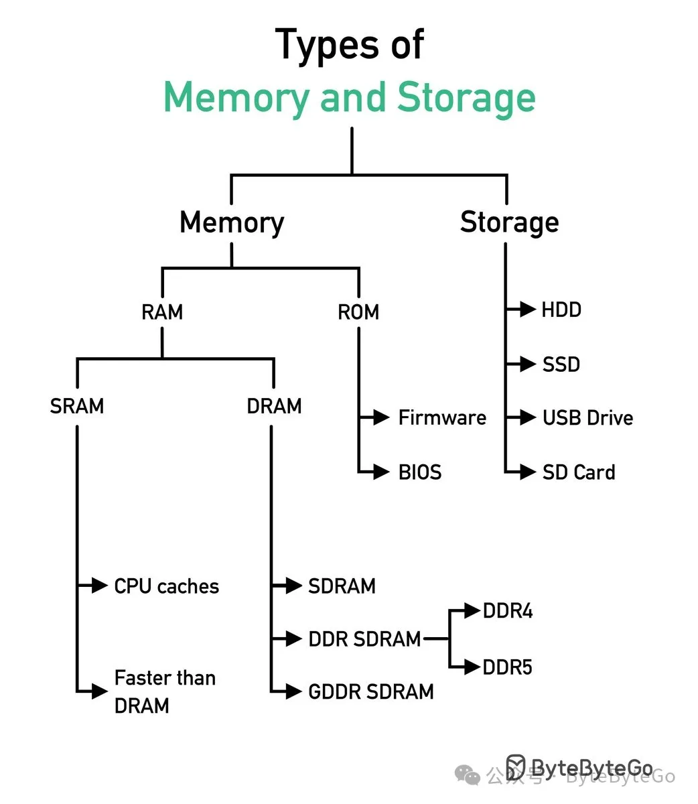
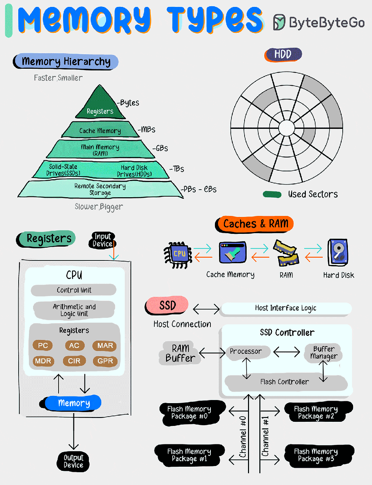

# 一图看完计算机内存和存储设备类型

今天来聊聊各种计算机内存和存储设备。

内存和存储设备是影响计算机性能、效率和能力的基本组成部分。

## RAM 和 ROM

随机访问存储器（RAM）和只读存储器（ROM）是计算机中的两种主要内存类型，每种都有其独特的用途。

-   RAM 是一种易失性内存类型，意味着一旦断电，它就会丢失其数据。CPU 使用 RAM 临时存储正在处理的数据，允许快速访问。这使得RAM对于计算机的整体速度和性能至关重要。
    
-   相比之下，ROM 是非易失性的，即使断电也能保留其数据。ROM 主要用于存储固件，固件是为计算机启动提供基本指令的底层软件。与 RAM 不同，ROM 中的数据不是频繁更改的，使其适合存储永久或半永久信息。
    

## DDR4 和 DDR5

-   DDR4 和 DDR5 是 RAM 技术的版本，每个版本都是前一个版本的后续产品。相比其前身  DDR3，DDR4 在速度、数据传输率和功耗效率方面都有所改进。DDR4 在较低的电压下运行，减少了功耗，并且具有更高的数据率，这提高了整体系统性能。
    
-   DDR5 是最新的标准，相比 DDR4，它承诺进一步提高数据传输率、更大的密度和更好的功耗效率。这些改进意味着 DDR5 可以支持更多要求苛刻的应用和工作负载，特别是对于高性能计算、游戏和数据密集型应用来说，是非常有益的。
    

## 固件和 BIOS

固件是一种特定类型的软件，为设备的特定硬件提供低级控制。从计算机和智能手机到嵌入式系统，固件可以在广泛的设备中找到。它充当设备硬件和使用它的软件应用之间的接口。

基本输入/输出系统（BIOS）是启动计算机过程中使用的一种固件类型。它初始化并测试系统的硬件组件，如键盘、鼠标和磁盘驱动器，并将操作系统加载到计算机的内存中。虽然 BIOS 这个术语传统上与 PC 相关联，但在初始化硬件和管理计算机操作系统与附加设备之间的数据流方面，它经常与固件一词互换使用。

## SRAM 和 DRAM

静态 RAM（SRAM）和动态 RAM（DRAM）是两种 RAM 类型，它们在技术和应用上有所不同。

只要供电，SRAM 就能在其内存中保持数据位，无需刷新。这使得 SRAM 比 DRAM 更快、更可靠，但也更昂贵。SRAM 通常用于缓存内存，其中速度至关重要。

另一方面，DRAM 在一个集成电路内的每个数据位存储在一个单独的电容器中。由于这些电容器会泄露电荷，如果不定期刷新电容器电荷，信息最终会消失。DRAM 比 SRAM 慢，但成本更低，可以实现更大的存储密度。它通常用于计算设备的主内存。

## HDD、SSD、USB 驱动器、SD卡

HDD、SSD、USB 驱动器和 SD 卡是流行的存储设备，每种都有其特点。

-   HDD 是使用磁存储技术通过一个或多个硬质快速旋转的盘片（磁盘）存储和检索数字信息的传统存储设备。它们以较大的存储容量和每千字节成本低于 SSD 而闻名，但其速度较慢，对物理冲击更敏感。
    
-   SSD 在闪存芯片上存储数据，没有移动部件，使其比 HDD 更快、更耐用且对物理冲击更有抵抗力。对于需要高速数据访问和可靠性的应用而言，它们是理想的选择。
    
-   USB 驱动器，也称为闪存驱动器或拇指驱动器，是使用闪存的便携式存储设备，通过 USB 端口连接到计算机。由于它们的便携性、易用性和与许多设备的兼容性，它们被广泛用于数据备份、传输和存储。
    
-   SD 卡是一种主要用于便携设备如数码相机、智能手机和平板电脑的闪存卡。它们具有不同的存储容量和速度等级，使它们适用于从存储照片和视频到扩展设备存储容量的不同应用。
    

我们用下面这张图来总结一下各个内存和存储设备在计算机中的架构。一般来说，存储量大的设备存取速度会慢，快速的设备离 CPU 更近，慢速的设备离 CPU 更远。

