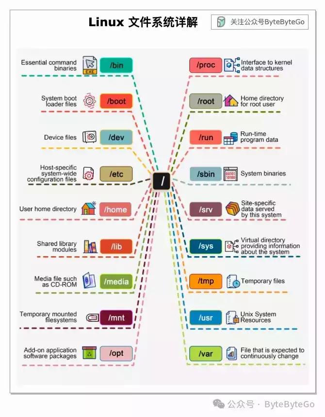

# 一图看懂 Linux 文件系统的组成

今天来聊聊 Linux 文件系统。

过去，Linux 文件系统就像一个无序的小镇，人们随心所欲地建造自己的房屋。然而，1994 年，**文件系统层次标准（FHS，Filesystem Hierarchy Standard）**的引入为 Linux 文件系统带来了秩序。

要熟练掌握这一标准，可以从探索开始。使用 "cd "等命令进行导航，使用 "ls "命令列出目录内容。将文件系统想象成一棵树，从根目录 (/) 开始。

-   **/（根目录）**：根目录是 Linux 文件系统中的顶级目录。所有其他目录都是根目录的子目录，使其成为整个文件系统的父目录。
    
-   **/bin**：包含启动系统和执行基本操作所需的基本二进制可执行文件。这些对所有用户都可用。
    
-   **/boot**：保存启动系统所需的文件，包括 Linux 内核、初始 RAM 磁盘映像（用于启动时需要的驱动程序）和引导加载程序配置文件（如 GRUB）。
    
-   **/dev**：包含代表硬件组件或其他系统设备的设备文件。例如，/dev/sda 代表第一个 SATA 驱动器，/dev/tty 代表终端。
    
-   **/etc**：存储系统和应用程序的配置文件。这些文件通常是可以编辑的文本文件，用于更改系统或应用程序的行为。
    
-   **/home**：包含系统上所有有账户的用户的个人目录，根用户除外。用户特定的设置和文件存储在此处。
    
-   **/lib**：包括系统和应用程序运行所需的基本共享库和内核模块。
    
-   **/media 和 /mnt**：用于挂载可移动媒体（如 USB 驱动器）和临时挂载的文件系统的目录。
    
-   **/opt**：用于安装附加的应用软件包。它是安装第三方应用程序的地方，将它们与 /usr 中的系统默认应用程序分开。
    
-   **/proc**：一个虚拟文件系统，为内核向进程发送信息提供了一种机制。它不包含真实文件，而是运行时系统信息（例如，系统内存、挂载的设备、硬件配置等）。
    
-   **/sbin**：包含基本的系统二进制文件，类似于 /bin，但用于系统管理任务，通常对非特权用户不可访问。
    
-   **/tmp**：一个临时目录，应用程序可以在其中存储临时文件。它通常在重启或间隔一段时间后被清空。
    
-   **/usr**：承载用户应用程序和大量系统内容。它包含程序、库、文档等的子目录，这些不是启动或修复系统所必需的。
    
-   **/var**：包含变量数据文件。这个目录包括系统在操作过程中写入数据的文件，如日志（ /var/log）、邮件（ /var/mail）和打印队列（ /var/spool）。