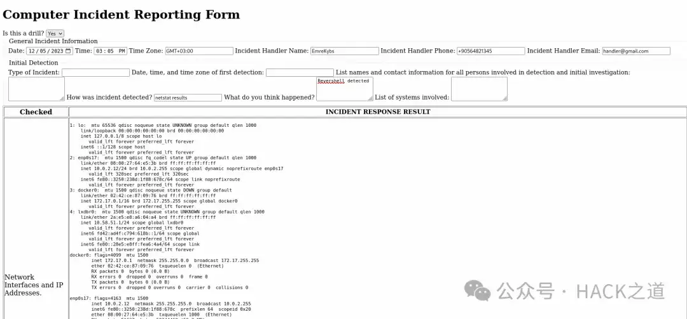

# 一款国外大牛的 Linux 应急响应工具

MR.Handler 是一款专门为响应 Linux 系统上的安全事件而设计的工具。它通过 SSH 连接到目标系统以执行一系列诊断命令，收集关键信息，例如网络配置、系统日志、用户帐户和正在运行的进程。在操作结束时，该工具会将所有收集到的数据编译成综合的 HTML 报告。该报告详细介绍了事件响应过程的细节和系统的当前状态，使安全分析师能够更有效地评估和响应事件。

**安装**  

```plain
  pip3 install colorama
  pip3 install paramiko
  git clone https://github.com/emrekybs/BlueFish.git
  cd MrHandler
  chmod +x MrHandler.py
  python3 MrHandler.py
```

# 报告



  

下载地址：  

https://github.com/emrekybs/MrHandler