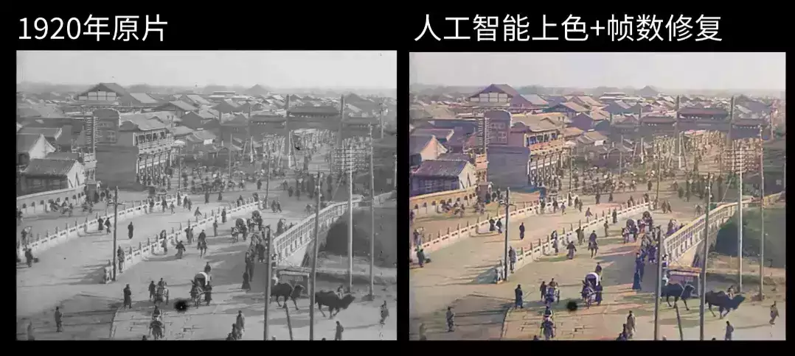

# 三个开源工具搞定 100 年前的老视频复原！就是这么强大！

作者 | OSC神秘老司机  

来源 | https://www.oschina.net/news/115801/use-ai-to-recover-images



据大谷介绍，这部拍摄于百年前的黑白视频由于年代久远，视频画质有很多噪点，帧数、分辨率都很低。于是他使用了三款开源的 AI 工具来对视频进行处理，分别是：

-   DAIN，对视频进行补帧处理，提高视频流畅度
    
-   ESRGAN，对视频进行超分辨率处理，提高视频清晰度
    
-   DeOldify，对视频进行上色处理
    

下面就让我们来了解一下这三款视频修复常用的 AI 工具，感兴趣的朋友也可以学着用起来，自己处理老旧视频哦。 

## 视频补帧工具 DAIN

帧数 （FPS）对于一部视频的流畅度来说影响很大，在正常播放速度下，低于 30 FPS 的视频会让人觉得卡顿，高于 60 FPS 的话肉眼则分辨不出区别。帧数越高的视频带来的流畅度一定是更高的，尤其是在慢镜头下，差别尤为明显：


上图来自另一 AI 补帧工具 SUPER SLOMO 的示例，将原片 30 FPS 的汽车甩尾镜头放慢 8 倍后，实际 FPS 不足 4 FPS，肉眼可见的卡顿。而通过 AI 补帧技术，能够将慢放后的视频维持在 240 FPS，流畅程度可见一斑。

通常来说，补帧的核心述求是在两个连续帧之间插入中间帧，从而提高视频的 FPS，而补帧工具需要解决的问题就是如何通过 AI 算法自动生成中间帧。DAIN 全称 Depth-Aware Video Frame Interpolation，即基于深度感知的视频帧插值工具。DAIN 团队提出了深度感知帧内插模型，开发了一个深度感知流投影层来生成中间帧。

测试环境

-   Ubuntu（Ubuntu =16.04.5 LTS ）
    
-   Python：Anaconda3 = 4.1.1 & Python= 3.6.8
    
-   Cuda 和 Cudnn：Cuda = 9.0 & Cudnn = 7.0 
    
-   Pythorch：定制的深度感知流投影和其他层需要 Pythorch 中的 ATen API =1.0.0
    
-   GCC：编译 PyTorch 1.0.0 扩展文件（.c/.cu）需要 GCC=4.9.1 和 nvcc=9.0 编译器
    
-   GPU：NVIDIA GPU（作者使用的是 Titan X（Pascal）计算=6.1，支持 compute\_50/52/60/61 设备）
    

安装使用

下载资料库：

```plain
$ git clone https://github.com/baowenbo/DAIN.git
```

在构建Pytorch扩展之前，请确保您具有`pytorch >= 1.0.0`：

```plain
$ python -c "import torch; print(torch.__version__)"
```

生成 PyTorch 扩展：

```plain
$ cd DAIN
$ cd my_package
$ ./build.sh
```

生成 PWCNet 所需的 Correlation 包：

```plain
$ cd ../PWCNet/correlation_package_pytorch1_0
$ ./build.sh
```

测试预训练模型：

制作模型权重目录和 Middlebury 数据集目录：

```plain
$ cd DAIN
$ mkdir model_weights
$ mkdir MiddleBurySet
```

下载预训练的模型，

```plain
$ cd model_weights
$ wget http://vllab1.ucmerced.edu/~wenbobao/DAIN/best.pth
```

和 Middlebury 数据集：

```plain
$ cd ../MiddleBurySet
$ wget http://vision.middlebury.edu/flow/data/comp/zip/other-color-allframes.zip
$ unzip other-color-allframes.zip
$ wget http://vision.middlebury.edu/flow/data/comp/zip/other-gt-interp.zip
$ unzip other-gt-interp.zip
$ cd ..
```

预安装：

```plain
$ cd PWCNet/correlation_package_pytorch1_0
$ sh build.sh
$ cd ../my_package
$ sh build.sh
$ cd ..
```

下载结果

用以下方法下载插值结果：

```plain
$ wget http://vllab1.ucmerced.edu/~wenbobao/DAIN/UCF101_DAIN.zip
$ wget http://vllab1.ucmerced.edu/~wenbobao/DAIN/Vimeo90K_interp_DAIN.zip
$ wget http://vllab1.ucmerced.edu/~wenbobao/DAIN/Middlebury_eval_DAIN.zip
$ wget http://vllab1.ucmerced.edu/~wenbobao/DAIN/Middlebury_other_DAIN.zip
```

慢动作生成：

此模型完全有能力在对网络体系结构进行少量修改的情况下产生慢动作效果。通过指定`time_step = 0.25`以生成 x4 慢动作效果来运行以下代码：

```plain
$ CUDA_VISIBLE_DEVICES=0 python demo_MiddleBury_slowmotion.py --netName DAIN_slowmotion --time_step 0.25
```

或设置`time_step`为`0.125`或`0.1`如下

```plain
$ CUDA_VISIBLE_DEVICES=0 python demo_MiddleBury_slowmotion.py --netName DAIN_slowmotion --time_step 0.125
$ CUDA_VISIBLE_DEVICES=0 python demo_MiddleBury_slowmotion.py --netName DAIN_slowmotion --time_step 0.1
```

分别生成 x8 和 x10 慢动作。或者你想用 x100 慢动作拍些好玩的东西也没问题。

```plain
$ CUDA_VISIBLE_DEVICES=0 python demo_MiddleBury_slowmotion.py --netName DAIN_slowmotion --time_step 0.01
```

可通过以下方法创建gif动画：

```plain
$ cd MiddleBurySet/other-result-author/[random number]/Beanbags
$ convert -delay 1 *.png -loop 0 Beanbags.gif //1*10ms delay
```

祝玩得开心！

  

## 分辨率提升工具 ESRGAN

我们知道，分辨率对于图像的清晰度将产生直接的影响。一张低分辨率的小图片，如果我们直接放大的话很多细节将变成“马赛克”，这点相信大家都很有经验。因此，直接采用普通的插值算法进行图片放大的话，图中物体的边缘就会变得模糊，而超分辨率算法就是为了解决这种问题。

ESRGAN 是一种增强型超分辨率生成对抗网络，能通过 AI 在图像超分辨率期间生成真实纹理，实现图像分辨率的提升，效果如下图所示： 


测试环境

-   Python 3
    
-   PyTorch> = 1.0（如果与 CUDA 一起安装，CUDA 版本> = 7.5。更多详细信息）
    
-   Python套件： `pip install numpy opencv-python`
    

安装使用

1.克隆此 github 存储库。

```plain
git clone https://github.com/xinntao/ESRGAN
cd ESRGAN
```

2.将低分辨率图像放置在`./LR`文件夹中。（有两个示例图像-狒狒和漫画）。

3.从 Google 云端硬盘或百度云端硬盘下载经过预训练的模型。将模型放在`./models`。

4.作者提供了两种具有高感知质量和高 PSNR 性能的模型。运行测试：提供 ESRGAN模型和 RRDB\_PSNR 模型，可以配置`test.py`。

```plain
python test.py
```

5.结果在`./results`文件夹中。

  

## 黑白图像着色工具 DeOldify

DeOldify 是用于着色和恢复旧图像及视频的深度学习项目。它采用了 NoGAN 这样一种新型的、高效的图像到图像的 GAN 训练方法，细节处理效果更好，渲染也更逼真：

  

NoGAN 是作者开发的一种新型 GAN 训练模型，用于解决之前 DeOldify 模型中的一些关键问题。NoGAN 训练结合了 GAN 训练的优点（好看的色彩），同时消除了令人讨厌的副作用（如视频中的闪烁物体）。视频由孤立的图像生成，而不添加任何时间建模。该过程执行 30-60 分钟 “NoGAN” 训练的 GAN 部分，每次使用 1% 至 3% 的图像网络（imagenet）数据。然后，与静止图像着色一样，在重建视频之前对各个帧进行“去旧化”（DeOldify），即使在移动场景中的渲染也非常一致：


目前，DeOldify 有三种型号可供选择，每一种都有关键优势和劣势，因此具有不同的用例。三种型号分别为：Artistic（艺术型）、Stable（稳定型）、Video（视频专用）。

测试环境

-   Linux
    
-   Fast.AI = 1.0.51（及其依赖项）。如果使用任何更高版本，你会在渲染中看到网格工件，而tensorboard 会出现故障。
    
-   PyTorch = 1.0.1
    
-   Jupyter Lab conda 安装
    

```plain
-c conda forge jupyterlab
```

-   Tensorboard（即安装 Tensorflow）和 TensorboardX。非必要，但 FastAI 现在提供了对 TF的原生支持，很好用。
    

```plain
prereqs:conda install-c anaconda tensorflow gpu
pip install tensorboardX
```

-   ImageNet，是一个很好的数据集，用于训练。
    
-   GPU：要求不高。（单独着色用普通集显都行，大规模训练的话还是建议上好一点的显卡）
    

安装使用

打开命令行并导航到要安装的根文件夹，输入以下命令：

```plain
git clone https://github.com/jantic/DeOldify.git DeOldify
cd DeOldify
conda env create -f environment.yml
```

然后开始使用这些命令运行：

```plain
source activate deoldify
jupyter lab
```

通过控制台中提供的 URL 开始在 Jupyter Lab 中运行。

想要自己动手把黑白老视频变成彩色高清视频的朋友，现在就可以行动起来啦。