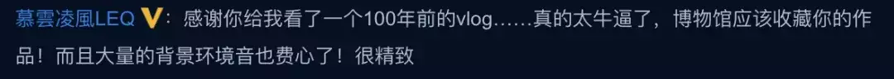
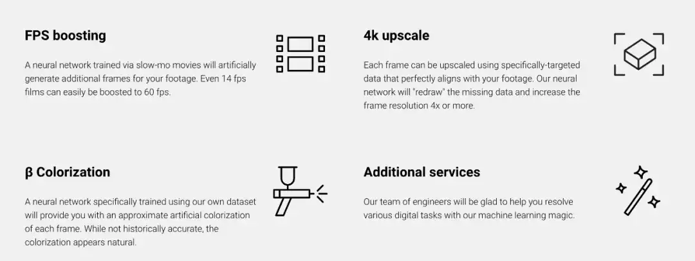
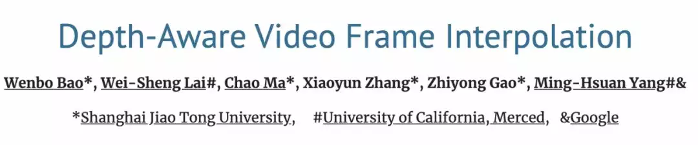
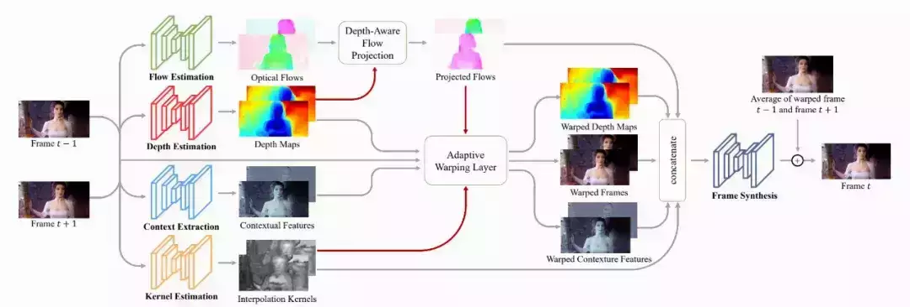
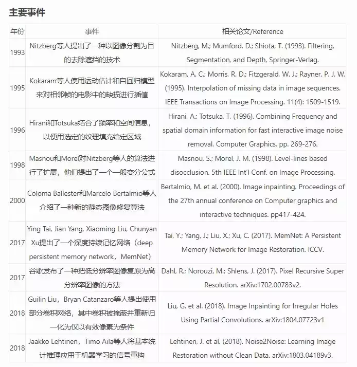

# 不用穿越，也能体验百年前的老北京，这个AI修复视频火爆全网

> 一段 AI 修复的视频，让我们体验了一把 100 年前的老北京。

  

*小贩叫卖、马车过街，修复后的视频可以清楚地展现熙熙攘攘的市井生活。*

  

*作揖问候的场景也清晰可见。*

  

你能想象，这些生动展现百年前国民生活的彩色影像，是使用人工智能技术修复的吗？

  

近日，**这段使用人工智能修复老北京影像的视频在 B 站和微博上火了，引起了极大的关注**。仅在 B 站上，阿婆主「大谷的游戏创作小屋」上传的这个旧影像修复视频已经获得 61.9 万的播放量、4.9 万点赞。

网友们纷纷感叹「厉害」，视频「清晰连贯」，「让我们看到了 100 年前的 vlog」。

  

  

视频中，**阿婆主使用人工智能技术，对民国初年的一段影像进行了上色、修复帧率和扩大分辨率的改动，从而彻底改变了这段 100 年前老旧影片，让我们能够更为细致地观看 100 年前人们的生**活。

  

与旧影像对比之后，我们能够对修复效果有更为直观的感受。

  

  

*视频修复前后在色彩、清晰度方面都有了很大的提升，修复前灰蒙蒙，修复后色彩鲜艳。*

  

那么从技术层面上看，究竟是如何做到这么惊艳的效果的呢？阿婆主表示，他也是参考了海外 YouTube 博主 Denis Shiryae 的影像修复教程。

  

**影像修复三大步骤**

  

今年年初，Denis 修复 1896 年经典电影的视频也在海外火了一把。

  

电影界最著名的短片之一是 1896 年的一部无声电影《L’Arrivée d’un train en gare de La Ciotat》，画面很简单，只有 50 秒，描述的是一列火车驶入车站的场景。Denis 正式对这个经典的短片进行了 AI 修复，效果非常不错。下图可以看出修复前后画面的强烈对比：

  

  

链接：https://www.youtube.com/watch?v=3RYNThid23g

  

从 Denis 的网页介绍，我们可以看到整个修复过程主要针对三个核心点：4K 分辨率以及 60fps 的帧数，除此之外还增加了背景颜色和声音的效果。

  

  

**DAIN 插帧技术**

  

在增加 FPS 方面，Denis 表示他主要应用了由上海交大 Bao Wenbo 等人提出的 DAIN 插帧技术（参见论文《Depth-Aware Video Frame Interpolation》）。

  

  

项目地址：https://sites.google.com/view/wenbobao/dain

  

这项研究提出通过探索插帧中的 depth cue，来显式地检测遮挡。

  

研究者开发了一个深度感知的光流投影层来合成中间流（中间流倾向于对距离较近的对象进行采样），并学习层级特征作为语境信息。然后，该模型基于光流和局部插值 kernel 将输入帧、深度图和语境特征进行变形处理，最后合成输出帧。

  

DAIN 模型的架构如下图所示：

  

*DAIN 架构图。给出两个输入帧，DAIN 首先估计其光流和深度图，并使用深度感知光流投影层来生成中间流；然后采用自适应变形层（adaptive warping layer），基于光流和空间变化的插值 kernel 对输入帧、深度图和语境特征进行变形处理；最后，使用帧合成网络生成输出帧。*

  

**4K 分辨率**

  

自从 1998 年第一台高清电视投入市场以来，“高清”一直是技术追逐的方向之一。简单罗列几个数字，老式标清电视的分辨率仅为 720x480，也就是说一次可显示的内容为 345,600 像素。高清电视的分辨率为 1920x1080，总像素为 2,073,600，是标清的 6 倍，而 4K 的 3840×2160 分辨率则需要 8294,400 像素。

  

简单而言，视频修复过程至少需要额外填充 600 万像素来适应 4K 高清分辨率，而这种 “插值” 过程正是 AI 技术的用武之地，所补充显示的内容皆是**基于相邻周边像素****所呈现的内容**。“插值”过程本质上是一种猜谜游戏，如果让卷积神经网络这类 AI 技术去发号施令的话会有更优质的反馈效果。

  

在此展示中，Denis 通过 Gigapixel AI 软件将分辨率提升至 4K，该产品由 Topaz Labs 开发，目前已进入到成熟的商业阶段。研发之初是为了帮助摄影师在不丢失任何细节的情况下将照片质量提升 6 倍，将该技术产品化的过程中发现将其应用至视频是完全可行的。不过值得一提是，渲染几秒钟的视频可能需要几个小时的处理时间，感兴趣的朋友可以一试。

  

**DeOldify 着色模型**

  

而在着色上，相信社区的大部分读者都知道一个基于 GAN 的图像着色模型 [DeOldify](http://mp.weixin.qq.com/s?__biz=MzA3MzI4MjgzMw==&mid=2650751177&idx=2&sn=fd87149766b844509dcf71cfccf0aec4&chksm=871a84b7b06d0da19aca9f975fc843fa0d4c17bb7ed7afd4417fd73267e69c43c815ce0c76b9&scene=21#wechat_redirect)。通过下面的对比图，我们可以看到该模型的效果。

  

  

DeOldify 基于生成对抗网络，由深度学习研究员 Jason Antic 开发并维护。自从 2018 年项目开启以来，DeOldify 已经进行了多次迭代。

  

如果读者们想要尝试，通过以下链接可直接安装使用。

  

-   项目地址：https://github.com/jantic/DeOldify
    
-   Colab：https://colab.research.google.com/github/jantic/DeOldify/blob/master/ImageColorizerColab.ipynb
    

  

**数字修复中的 AI 技术应用要比想像的多  
**

  

上述图像分辨率补充、FPS 提升、色彩填充是数字修复大方向下的三个子环节，而整个影像修复技术处处可见人工智能的身影。

  

以图像修复为例，一般步骤为：输入图像，检测画面信息及获得画面所有像素并识别受损区域，计算受损区域的像素点优先项，确定优先项最高的为待修复像素块，计算源区域中的匹配块与待修复区域的误差，确定误差值最小的为最佳匹配，进行填充和修复，检测损伤区域是否全部修复，若已修复则输出图像。

  

*来自机器之心 pro*

  

而对视频修复而言，**它是基于图像修复演变而来的**，也同样是逐帧修复，所以其流程与图像修复类似。

  

至于图像分辨率提升环节，Denis 通过 Gigapixel AI 软件进行处理。而实际情况中图像分辨率提升以及图像超分辨率的解决涉及到许多技术细节，如图像配准、图像分割、图像压缩、图像特征提取、图像质量评估等等。而这些子方向的研究在各大 AI 学术顶会上频频可见。类似地，通过机器学习方法从训练样本集中提取视频中的高频信息模型，从而对填充所需信息进行合理预测，达到提升视频图像分辨率的目的，这样相似的思路层出不穷。

  

从应用方面来看，高清设备的普及使得对早期的游戏及电影进行重制成为一大需求，图像修复，图像超分辨率等众多修复技术的发展也为该市场提供了一个可持续的解决思路。

  

最后，在了解完修复旧影像背后的技术后，感兴趣的读者也可以尝试下。说不定，你也能在 B 站、抖音上火一把。