# 【云安全攻防 1】对象存储安全图文 + 实战案例详解

不同的厂商对对象存储的叫法有些不同，但从功能使用者角度来看，其实都是一回事。

阿里云：OSS 腾讯云：COS 华为云：OBS

因为阿里云可免费试用 3 个月的 OSS 存储，以下讲解均以阿里云 OSS 存储为例。

# **一、环境搭建**

在阿里云上开通 OSS 存储，阿里云可以免费试用一段时间的 OSS 存储

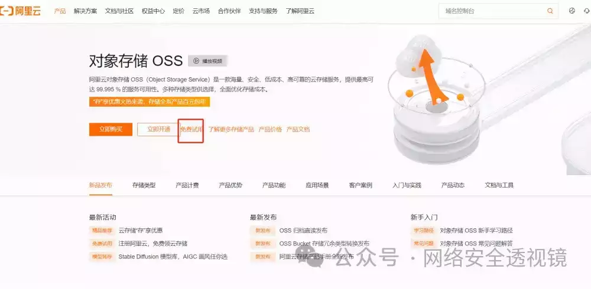


开通后，OSS 存储控制台在左上方菜单栏中


然后就可以创建 Bucket

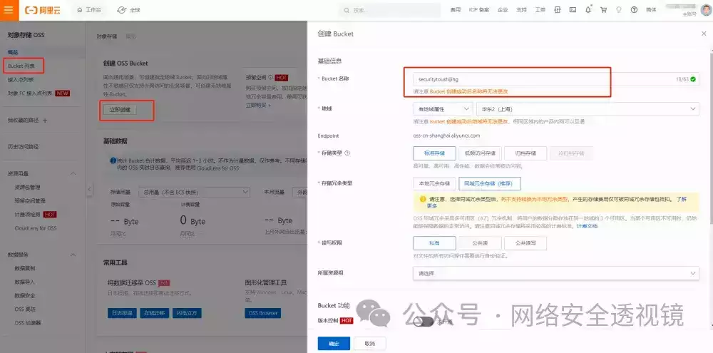

  

# **二、基本概念**

  

在此之前，简单介绍一下 OSS 存储的几个概念

## **存储空间 Bucket**

首先给大家介绍一下 Bucket，Bucket 是用户用来管理所存储 Object 的储物空间。每个用户可以拥有多个 Bucket。Bucket 的名称在 OSS 的范围内必须是全局唯一的，一旦创建之后无法修改名称。Bucket 内部的 Object 数目是没有限制的。**用户可以简单的把 Bucket 理解为本地电脑的一个文件夹。**

## **对象 Object**

  

对象是 OSS 存储数据的基本单元，也被称为 OSS 的文件。和传统的文件系统不同，对象没有文件目录层级结构的关系。对象由元信息（Object Meta），用户数据（Data）和文件名（Key）组成，并且由存储空间内部唯一的 Key 来标识。对象元信息是一组键值对，表示了对象的一些属性，比如最后修改时间、大小等信息，同时用户也可以在元信息中存储一些自定义的信息。对象的生命周期是从上传成功到被删除为止。在整个生命周期内，除通过追加方式上传的 Object 可以通过继续追加上传写入数据外，其他方式上传的 Object 内容无法编辑。**用户可以把 Object 简单理解为文件夹中的文件。**

## **Region（地域）**

  

Region 表示 OSS 的数据中心所在物理位置。用户可以根据费用、请求来源等选择合适的地域创建 Bucket。一般来说，距离用户更近的 Region 访问速度更快。Region 是在创建 Bucket 的时候指定的，一旦指定之后就不允许更改。该 Bucket 下所有的 Object 都存储在对应的数据中心，目前不支持 Object 级别的 Region 设置。

  

## **Endpoint（访问域名）**

  

Endpoint 表示 OSS 对外服务的访问域名。OSS 以 HTTP RESTful API 的形式对外提供服务，当访问不同的 Region 的时候，需要不同的域名。通过内网和外网访问同一个 Region 所需要的 Endpoint 也是不同的。例如杭州 Region 的外网 Endpoint 是 http://oss-cn-hangzhou.aliyuncs.com，内网 Endpoint 是 http://oss-cn-hangzhou-internal.aliyuncs.com。

  

## **AccessKey（访问密钥）**

  

AccessKey 简称 AK，指的是访问身份验证中用到的 AccessKey ID 和 AccessKey Secret。OSS 通过使用 AccessKey ID 和 AccessKey Secret 对称加密的方法来验证某个请求的发送者身份。AccessKey ID 用于标识用户；AccessKey Secret 是用户用于加密签名字符串和 OSS 用来验证签名字符串的密钥，必须保密。

  

AccessKey 包含以下三种：

  

-   Bucket 的拥有者申请的 AccessKey。
    

  

-   被 Bucket 的拥有者通过 RAM 授权给第三方请求者的 AccessKey。
    

  

-   被 Bucket 的拥有者通过 STS 授权给第三方请求者的 AccessKey。
    

  

# **三、常见风险点**

  

## **3.1 访问权限设置不当**

  

存储空间（Bucket）是存储对象（Object）的容器。对象都隶属于存储空间，存储空间的访问权限（ACL）有以下三类：

  

|     |     |     |
| --- | --- | --- |
| **访问权限** | **描述** | **访问权限值** |
| 私有  | 存储空间的拥有者和授权用户有该存储空间内的文件的读写权限，其他用户没有权限操作该存储空间内的文件。 | Aliyun::OSS::ACL::PRIVATE |
| 公共读 | 存储空间的拥有者和授权用户有该存储空间内的文件的读写权限，其他用户只有该存储空间内的文件的读权限。请谨慎使用该权限。 | Aliyun::OSS::ACL::PUBLIC\_READ |
| 公共读写 | 所有用户都有该存储空间内的文件的读写权限。请谨慎使用该权限。 | Aliyun::OSS::ACL::PUBLIC\_READ\_WRITE |

  

**在上传文件（Object）时未指定文件的 ACL，则文件的 ACL 均默认继承 Bucket ACL**。故申请 OSS Bucket 一般禁止申请公共读写。公共读写意味着互联网上任何用户都可以对该 Object 进行访问，并且向该 Object 写入数据。这有可能造成数据的外泄以及费用激增，若被人恶意写入违法信息还可能会影响公司商誉。

  

如果想加速文件访问，可以配置 OSS 私有 Bucket 回源。但需要注意，**开启 OSS 私有 Bucket 回源授权后，即授权 CDN 对你所有 Bucket 的只读权限，不只是对当前 Bucket 授权**。

  

实例演示：

创建一个私有的 Bucket

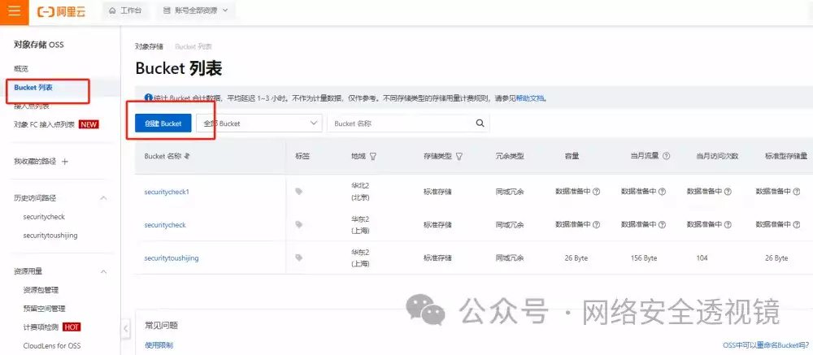

  


  

点击刚刚创建的 Bucket，上传一个文件测试

  

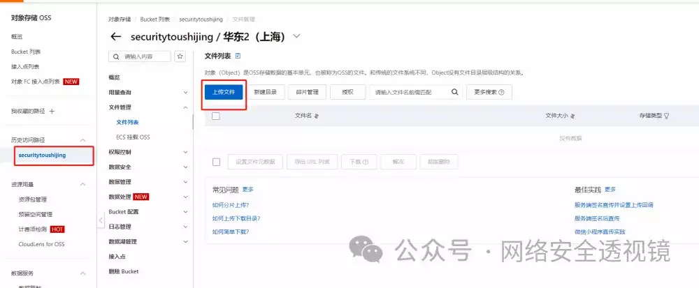

  

选择扫描文件，进行文件上传

  

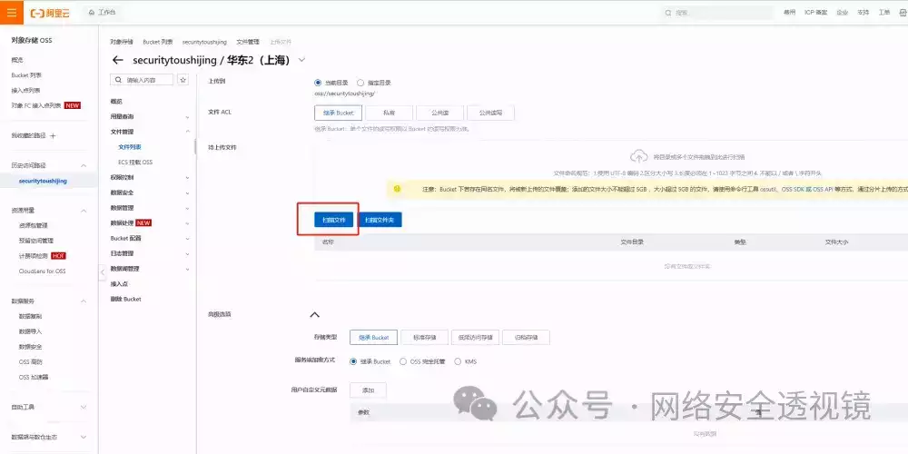

  


  

设置文件元数据

  

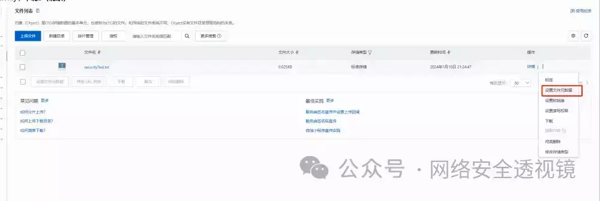

  

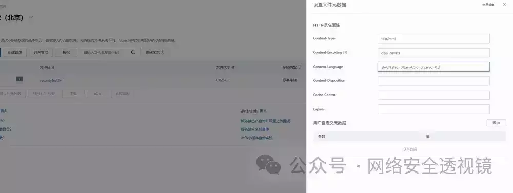

  

上传成功后，可在文件列表中进行查看。点击详情即可查看文件访问链接地址

  


  

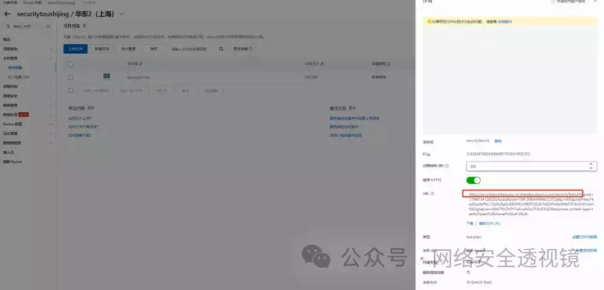

当我们访问文件地址的时候，此时就会出现拒绝访问

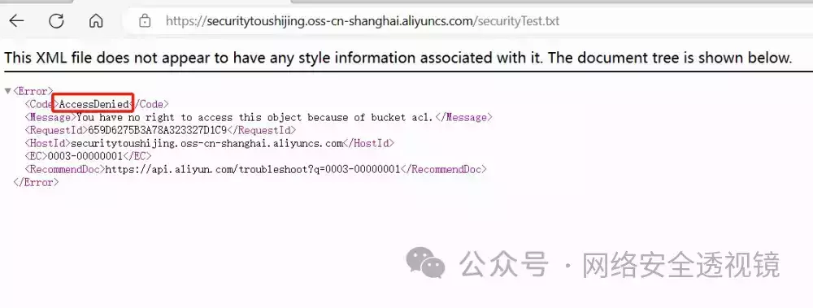

  

**公共读 Bucket**

当我们将 Bucket 设置成公共读的时候，即浏览器就可以直接读取文件内容

  

设置路径如下图所示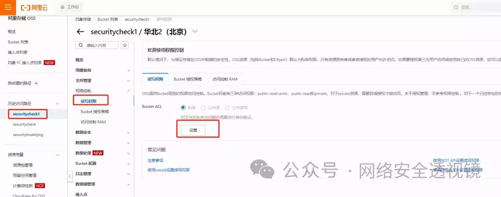

  

文件设置为公共读

  


  


  

在这里有个问题，我看网上的访问文件地址，都是在浏览器上直接显示，而我设置后，就直接能下载文件，目前还不知道原因是什么。

  

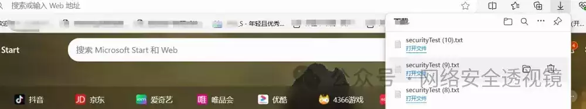

  

**公共读写 Bucket**

  

当权限设置为公共读写时候，此时可通过 PUT 方法上传任意文件。

正常访问读取文件如下：

  


  

将请求方法改成 PUT，然后上传文件

  


  

返回 200 说明上传成功，此时我们可以从 OSS 控制台看到上传的文件。

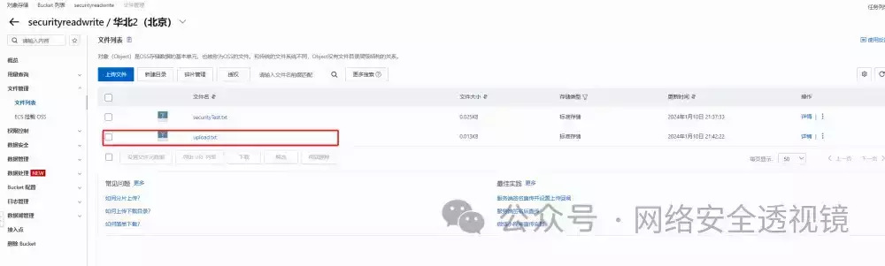

  

**文件遍历**

OSS 存储里面有种类似列目录的漏洞，会显示当前存储下所有的文件存储路径。

实例演示：

首先点击权限控制，Bucket 策略授权 新增授权

  


  

选择 授权所有账号，只读包含（ListObject 操作）

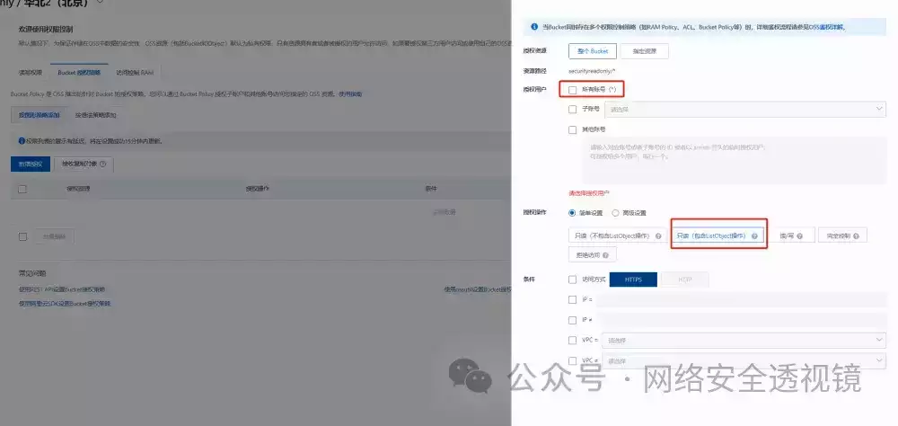

然后我们在文件列表这边，新建两个文件夹，并上传一些文件上去

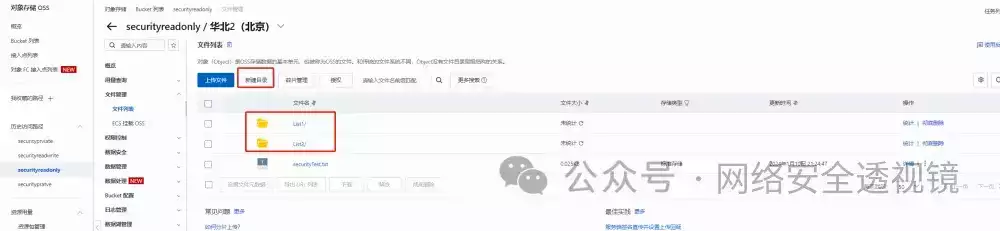

  

然后访问域名，就会发现所有文件列表。

注：OSS 存储域名命令规则一般是 \[Bucket 名称\].oss-cn-\[地域\].aliyuncs.com


  

然后我们就可以拼接路径，访问 Bucket 下的目录及文件。

### **小结：**

从上面的实例演示可以看出，权限配置错误一般有以下三种风险：

-   公共读或公共读写：可完整访问但不显示完整结构
    
-   权限 Bucket 授权策略：设置 ListObject 显示完整结构
    
-   权限 Bucket 读写权限：公共读写直接 PUT 文件任意上传
    

  

## **3.2 域名解析 Bucket 接管**

  

正常情况下 OSS 存储是不解析存储的文件的，比如上传一个 html 文件，访问是直接下载，而非展示出 html 文件解析后的页面。当 Bucket 配置域名绑定后，直接访问域名，即可解析 html 文件。

域名绑定：


  

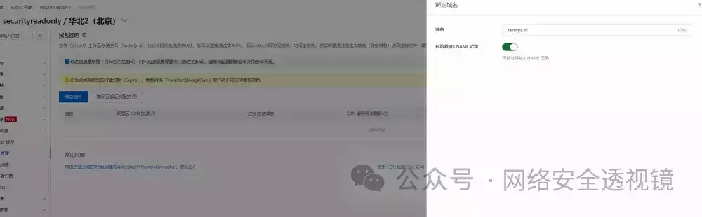

由于域名备案要买服务器或者花钱买备案码，后面的就演示不下去了。

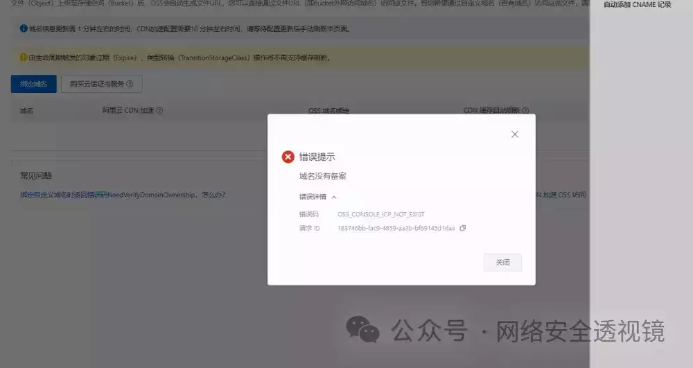

直接文字说说吧。

如果域名绑定成功后，直接访问绑定的域名，就相当于直接访问 OSS 存储。比如你 Bucket 下存在一个 xxx.html，直接访问绑定的 域名/xxx.html，就可以直接解析 html 文件。

这样设置本身是没有漏洞的，但如果用户设置了域名绑定，但后来由于某种原因将 OSS 存储中的 Bucket 删除了，域名绑定没有删除，此时就会出现网站接管漏洞。

攻击者可以选择在原来的区域，新建一个一样的 Bucket。这样原来绑定的域名就会解析到攻击者创建的 Bucket 上。

### **域名接管实战案例：**

  

去网上搜一个访问显示 NoSuchBucket 的网站

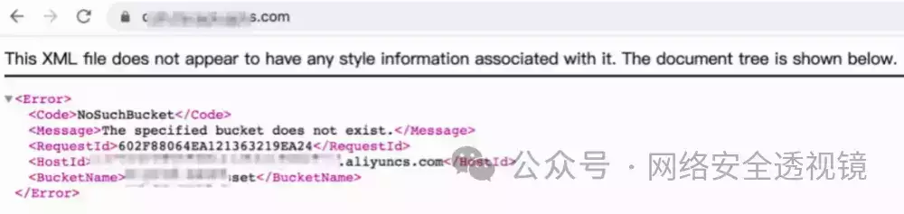

然后去阿里云存储桶重新创建一个与 HostID 一样的存储桶名称

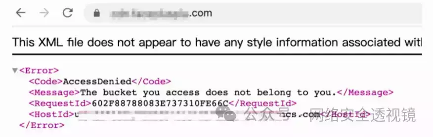

之后随便上传一个文件，就可以让该域名显示我们上传的任意文件


  

## **3.3 Bucket 爆破**

  

如果不知道 Bucket 怎么办？走投无路的情况下，可以尝试进行爆破。获得 Bucket 名称，这有些类似于目录爆破，只不过目录爆破一般通过状态码判断，而这个通过页面的内容判断。

当 Bucket 不存在时有两种返回情况，分别是 InvalidBucketName 和 NoSuchBucket


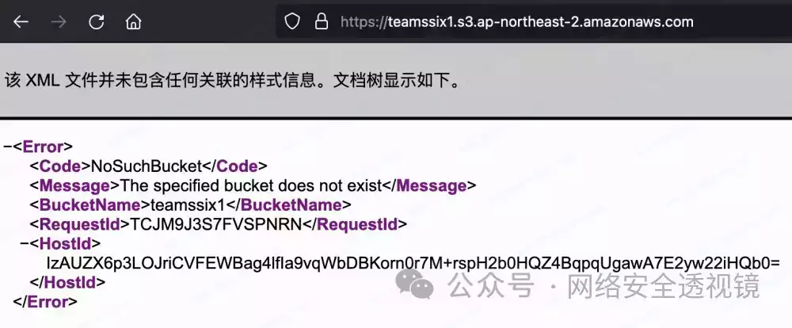

当 Bucket 存在时也会有两种情况，一种是列出 Object


另一种是返回 AccessDenied

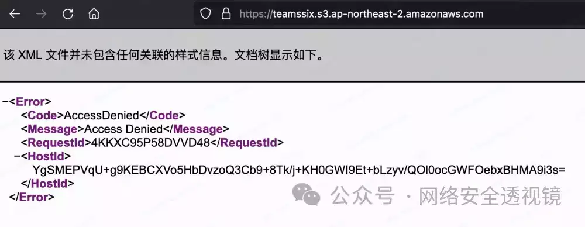

这样通过返回内容的不同，就可以进行 Bucket 名称爆破了，知道 Bucket 名称后，Key 的爆破也就很容易了。

## **3.4 AccessKey，SecretAccessKey 泄漏**

  

### AccessKey 有什么作用？

访问密钥 AccessKey（简称 AK）是阿里云提供给阿里云用户的永久访问密钥，用于通过开发工具（API、CLI、SDK、Cloud Shell、Terraform 等）访问阿里云时的身份验证，不用于控制台登录。

其他厂商也有，可能叫法不一样。获取到这些信息后，是可以用官方工具或者网上别人开发的利用工具接管 OSS 存储的。


  

下一篇文章再详细讲一下控制台接管。

下面介绍一下，其他厂商的 AccessKey 如何查找。

### Amazon Web Services

亚马逊云计算服务 (Amazon Web Services, AWS) 的 Access Key 开头标识一般是 "AKIA"。

```plain
^AKIA[A-Za-z0-9]{16}$
```

  

-   Access Key ID: 20 个随机的大写字母和数字组成的字符，例如 AKHDNAPO86BSHKDIRYTE
    

  

-   Secret Access Key ID: 40 个随机的大小写字母组成的字符，例如 S836fh/J73yHSb64Ag3Rkdi/jaD6sPl6/antFtU（无法找回丢失的 Secret Access Key ID）。
    

  

### Google Cloud Platform

  

Google Cloud Platform (GCP) 的 Access Key 开头标识一般是 "GOOG"。

```plain
^GOOG[\w\W]{10,30}$
```

  

-   服务账号的 JSON 文件中包含了 Access Key 和密钥的信息，其中 Access Key 为 client\_email，其长度不固定，由字母、数字和特殊字符组成。
    

  

-   密钥（Key）的长度为 256 个字符，由字母、数字和特殊字符组成。
    

  

### Microsoft Azure

  

Microsoft Azure 的 Access Key 开头标识一般是 "AZ"。

```plain
^AZ[A-Za-z0-9]{34,40}$
```

  

-   Azure AD Application 的 Client ID 通常用作 Access Key，长度为 36 个字符，由字母和数字组成。
    

  

-   对于 Azure AD Application 的密钥（Secret），长度为 44 个字符，由字母、数字和特殊字符组成。
    

  

### IBM Cloud

  

IBM 云 (IBM Cloud) 的 Access Key 开头标识一般是 "IBM"。

```plain
^IBM[A-Za-z0-9]{10,40}$
```

  

### Oracle Cloud

  

Oracle 云 (Oracle Cloud) 的 Access Key 开头标识一般是 "OCID"。

```plain
^OCID[A-Za-z0-9]{10,40}$
```

### 阿里云

  

阿里云 (Alibaba Cloud) 的 Access Key 开头标识一般是 "LTAI"。

```plain
^LTAI[A-Za-z0-9]{12,20}$
```

  

-   Access Key ID 长度为 16-24 个字符，由大写字母和数字组成。
    

  

-   Access Key Secret 长度为 30 个字符，由大写字母、小写字母和数字组成。
    

  

### 腾讯云

  

腾讯云 (Tencent Cloud) 的 Access Key 开头标识一般是 "AKID"。

```plain
^AKID[A-Za-z0-9]{13,20}$
```

  

-   SecretId 长度为 17 个字符，由字母和数字组成。
    

  

-   SecretKey 长度为 40 个字符，由字母和数字组成。
    

  

### 华为云

  

华为云 (Huawei Cloud) 的 Access Key 开头标识一般是 "AK"。

```plain
^AK[\w\W]{10,62}$
```

  

-   Access Key ID 长度为 64 个字符，由字母、数字和特殊字符组成。
    

  

-   Secret Access Key 长度为 44 个字符，由字母、数字和特殊字符组成。
    

  

### 百度云

  

百度云 (Baidu Cloud) 的 Access Key 开头标识一般是 "AK"。

```plain
^AK[A-Za-z0-9]{10,40}$
```

  

### 京东云

  

京东云 (JD Cloud) 的 Access Key 开头标识一般是 "AK"。

```plain
^AK[A-Za-z0-9]{10,40}$
```

  

### UCloud

  

UCloud (UCloud) 的 Access Key 开头标识一般是 "UC"

```plain
^UC[A-Za-z0-9]{10,40}$
```

### 青云

  

青云 (QingCloud) 的 Access Key 开头标识一般是 "QY"。

```plain
^QY[A-Za-z0-9]{10,40}$
```

  

### 金山云

  

金山云 (Kingsoft Cloud) 的 Access Key 开头标识一般是 "KS3"。

```plain
^KS3[A-Za-z0-9]{10,40}$
```

  

### 联通云

  

联通云 (China Unicom Cloud) 的 Access Key 开头标识一般是 "LTC"。

```plain
^LTC[A-Za-z0-9]{10,60}$
```

  

### 移动云

  

移动云 (China Mobile Cloud) 的 Access Key 开头标识一般是 "YD"。

```plain
^YD[A-Za-z0-9]{10,60}$
```

  

### 电信云

  

中国电信云 (China Telecom Cloud) 的 Access Key 开头标识一般是 "CTC"。

```plain
^CTC[A-Za-z0-9]{10,60}$
```

  

AccessKey 泄露，一般都是 APP，小程序，JS 中泄漏导致。实战案例可参考我之前发的文章

[【微信小程序渗透测试】小程序抓包及反编译通杀方法，附漏洞挖掘案例](http://mp.weixin.qq.com/s?__biz=MzIxMTg1ODAwNw==&mid=2247499059&idx=1&sn=4d6191eeda912914fbb70ef294f31e33&chksm=974c5a0ba03bd31d3a9699159766643ef97ff31ed9eb48b8ea8892d51e6d92ae9e1f7160ad1a&scene=21#wechat_redirect)

  

参考：

https://wiki.teamssix.com/CloudSecurityResources/

https://zhuanlan.zhihu.com/p/566350805