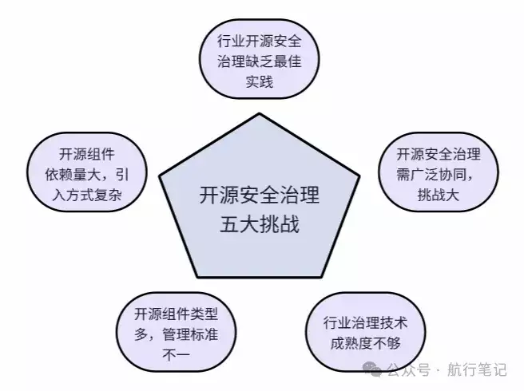
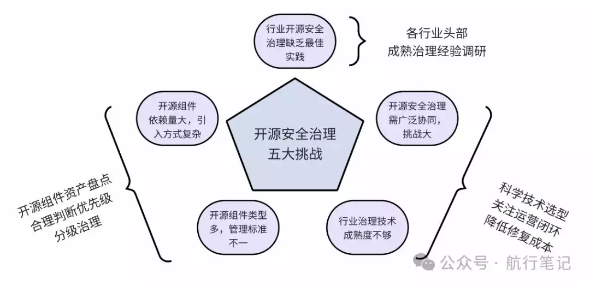

# 企业开展开源安全治理必要性及可行性详细分析

  

**背景**

开源软件安全威胁是近几年企业安全面临的主要威胁，也是企业应用安全方向讨论的热门话题，但是由于是新的需求新的方向，很多企业在观望，当前开展这项工作是否已经成熟，项目成功率如何？

  

当新鲜事物产生时，首先我们应该积极的态度去拥抱它，但是它是不是真的值得我们投入（包括当下工作和未来个人技术成长），就需要客观的分析其必要性，同时结合自身情况了解它的可行性。

  

  

但是面对这样一个热门的方向，行业头部企业都在积极投入和规划，我们应该如何客观看待，开源安全治理到底是昙花一现的伪需求？还是企业真正值得长期投入的新方向？我觉得我们需要冷静客观的深入分析一下它的必要性及当下开展这项工作的可行性，这篇文章我会结合我自己过去在企业甲方的实践经历和墨菲安全创业过程中做开源安全治理产品工具的经验心得，对这两个关键问题进行深入剖析，文末也欢迎大家参加有奖调研和我讨论。

  

从我沟通和调研过的各行业数百家企业中，其中开源安全治理的必要性大家已经有基本的共识了，关于可行性是目前大家讨论和担忧比较多的，所以本文也会重点分析可行性，**如果你只关注可行性的分析，请直接跳到第二部分。**

  

**必要性分析**

  

回答一件事情的必要性，我们可以从长期和短期两个视角来分析，**长期我们主要看趋势及其必然性，短期我们看需求的刚性程度。**

**长期来看**

  

随着全球及中国数字化程度越来越高，企业对于软件的制造和生产的需求越来越大，软件制造的供应链会越来越成熟，就像过去几十年汽车制造的发展过程一样，随着人们生活水平的提升，出行需求的快速增长，复杂的企业工业到今天拥有非常成熟的供应链体系。而一个成熟的供应链体系就需要不同的供应商将一个个具体的需求转化成标准件，最后由企业根据它的需求将这些数百个甚至数千个不同的标准件组装起来，完成一个成品软件的生产制造。

而开源软件就是软件制造工业的供应链体系中，数量最庞大的标准件。随着未来数字化需求的不断增长，开源软件的数量及其应用量只会越来越高。由于开源软件的开放性及软件开发过程的复杂性，必然导致这些开源软件会存在大量的安全漏洞缺陷，而这些漏洞缺陷会传导到最终企业加工出来的成品软件中。从而使得企业应用软件中大量的安全漏洞缺陷来自它的开源软件供应链。在这种情况下，黑灰产为了寻找漏洞来攻击企业以牟利，必然会有越来越多的开源组件漏洞被发现和利用。

  

所以，长期来看随着企业应用的开源软件越来越多，这些开源软件的安全漏洞在黑灰产攻击者的利益驱使下会以更快的速度和更高的频率被曝出，进而使得开源软件的安全威胁成为企业面临的主要威胁。

  

**短期来看**

  

开源安全治理的紧迫性主要来自企业需求，而企业的安全需求通常来自两方面，一方面是安全事件驱动，另外一方面是政策合规要求。

LockBit 勒索团伙相信大家都听说过，去年底工行美国子公司被勒索事件就是出自 LockBit，据海外多家网络安全公司（包括 Dragos、Malwarebytes 等）统计分析，全球有超过 1/3～1/2 的勒索攻击事件来自 LockBit，而 LockBit 最惯用的攻击手法之一就是利用各种开源软件的 0day/1day 漏洞进行攻击，之后实施勒索行为。而在 2024 年 2 月，美国、法国、英国等国执法机构联手对头号勒索软件组织 LockBit 展开了大规模清剿，这个代号“克罗诺斯行动”的行动，对 LockBit 团伙用来做勒索的相关系统后台进行了渗透攻击，而此后披露的信息来看，执法机构用来渗透攻击 LockBit 的漏洞也是开源软件 PHP 的一个 0day 漏洞。由此可见在主流的网络安全攻防战场，最高效和主流的攻击方式都是围绕开源软件的漏洞展开的。

  

而且值得关注的是，勒索团队的攻击往往是**全球化无差别的攻击**，任何一个企业，只要有软件服务暴露在公网都有可能被攻击，他们通常对全球的互联网进行开源软件的 0day/1day 进行扫描，一旦发现哪个企业暴露在互联网上的软件存在漏洞，马上启动自动化的数据加密勒索攻击。而往往任何一个企业通常在这三个时间点容易遭受勒索攻击：

  

-   在进行软件/应用的更新和新发布时（此时往往意味着引入了新的组件漏洞）
    
-   一个新的开源软件漏洞被曝出时
    
-   一个老的开源组件漏洞被第一次曝出 poc/exp 时
    

  

而每年国家及各地区的大型攻防演练中，开源软件及商业软件中依赖的开源软件的漏洞也一直都是近几年红队用来攻击目标单位的主要手段，由此可见，从红队的视角来看，国内各行业企业主要的安全缺陷也是来自软件供应链，包括商业软件供应链及开源软件供应链。

  

不管是勒索攻击还是大型攻防演练，当前针对开源软件的攻击事件已经严重影响到了国家一些重要的基础设施单位及企业，所以不管是从欧美还是中国来看，政府近几年都密集出台了大量法律法规来要求企业和政府事业单位加强开源软件安全治理。

  

所以，从短期来看，企业开展开源安全治理目前也是各行业企业和政府监管的共识，因为各方也都面临这同样的威胁。

  

**可行性分析**

可行性分析的目的是全方面调研分析该项目是否具备在企业成功落地，达成预期效果的可行性，分析思路上我们可以从行业最佳实践效果、技术方案成熟度、关键难点及挑战应对方案等多方面进行分析。  

  

我自己因为创业的原因，过去三年一直专注在软件供应链安全领域，所以跟各个行业企业做安全的朋友们交流最多的当然也就是这个方向，在软件供应链安全领域，相对来说大家今天关注最多的其实就是开源安全治理。其中有一部分企业的安全负责人在真正开展开源安全治理工作时多少有些顾虑，主要顾虑的点还是这项工作建设的可行性。

  

**主要挑战（坑在哪？）**

  

从跟大家交流来看，首先大家认为开源安全治理时一项非常复杂且具有挑战的工作，它的挑战主要来自五个方面：

  

**企业引入开源软件的方式非常多，管控复杂**

  

包括自研的软件中自主引入，也包括采购的商业软件中引入的开源组件，同时还包括大量免费的办公软件中也会引入大量的开源组件。这里面包括直接引入和间接引入，所谓间接引入就是直接引入的这些开源组件本身又依赖了大量开源组件，而商业软件和免费的闭源软件中引入的大量开源组件对于企业来说是黑盒不透明的，管理起来难度更大。

**开源软件的类型非常多，管理标准不一，治理难度大**

  

企业自研及外部引入的软件中，涉及的开发语言主流的有 5～6 种，还有 10～20 种不是很主流的开发语言。这些不同语言的开源组件在治理时会给识别和治理的难度大大增加，因为这些不同语言的开源组件的包管理工具生态不一样，包管理生态的成熟度也不一样，甚至一种开发语言有多种包管理工具的生态，比如 Java 的 Maven 和 Gradle 等，而 c/c++ 干脆没有什么特别成熟和覆盖度高的包管理工具生态，甚至很多研发人员在使用开源组件时会魔改这些开源组件以及不使用规范的包管理工具来管理其代码项目的开源组件的引入。

**开源软件的治理涉及的相关方较多，内部推动难度大**  

  

因为开源软件在企业内使用广泛，且几乎涉及到软件开发的所有流程，所以开源安全治理几乎与所有的技术部门都相关。当然最主要的挑战还是来自软件研发人员和安全管理部门之间的协同。软件开发人员在开源软件方面更关注软件工程问题，而安全管理部门更关注安全及合规性问题，而两者之间往往存在一些冲突。此外，就是软件研发人员更懂工程但是缺乏安全知识，而安全工程师更懂安全风险但是缺乏工程知识。而开源安全治理工作是同时需要具备这两方面知识的，这就使得双方必须协同。

**行业缺乏成熟的技术工具来支撑开源安全治理工作，无法闭环落地**  

  

因为开源软件在企业的应用模式和自研代码有很大的区别，导致过去应用安全相关的工具在开源安全治理时并不适用，过去市面上大多数应用安全类的工具（SAST/IAST/DAST/SCA 等）大多数都是针对企业自研代码产生的漏洞进行治理的，多数都是侧重代码安全漏洞的检测，而非常轻修复的能力。实际上研发自研的代码部分自己发现漏洞进行修复相对简单，毕竟自己写的代码。但是开源组件的很多漏洞企业开发者没办法自己改代码去修复（而且从工程管理的角度上也不建议自己去改人家开源组件的代码来修复安全问题），这就导致过去的工具失效了。当前的局面是，企业检测出来大量的开源组件安全漏洞，修复成本极高，这就导致研发很抵触这项工作，从而难以运营落地。

**行业缺乏成熟的治理体系和成功的最佳实践，缺乏参照**

  

根据我的观察，国内企业在开源安全治理方面，3-5 年前开始有一波金融&互联网行业先行试点过，从效果来看，只有极少数一波企业（蚂蚁似乎做的还不错）效果相对还不错，其他的大多数基本上都踩到坑里了。这就导致这两年大家再开展治理的时候一方面并没有很多成熟的最佳实践参考，另外一方面也多少没有太多信心。

**应对方案（抓主要矛盾）**

  

面对以上五个严重的挑战，从企业解决的角度来说，可以聚焦为三个主要应对举措：

-   多做行业头部最佳实践调研：其实近两年，互联网、金融、运营商、智能制造等多个行业的头部企业，还是有不少企业在开源安全治理方面已经有自己的一些最佳实践和成功经验了。虽然说不是 100% 成熟，但是还是很具参考意义的
    
-   资产盘点，分级治理：虽然问题很多很复杂，千头万绪，通常这种情况下我们的解法也很简单，那就是先对企业使用的开源组件进行一轮摸底，然后根据相关业务的重要程度及组件本身安全风险程度进行分级治理，确定阶段性的治理目标
    
-   科学的技术选型，关注运营闭环及降低修复成本：内部协同挑战大的主要原因还是各方在治理这件事上需要投入的成本太大，与各方取得的收益不成正比，从而导致大家不愿意干，所以核心解法在于降低如何降低治理过程中的成本投入，那么其实关键问题在于降低开源安全问题的修复成本
    

  

接下来，对于以上三个问题，我对其中核心的难点和落地实践稍微展开做一些分享。

  

**关于行业的现状和调研**  

  

大概从 2021 年起，log4j2 事件及一些国内重要企业（不好直说啊）的重大数据泄露事件背后都暴露出来软件供应链安全威胁，再之后就是 2021 年底金融行业四部委发文，后来证监会及银保监又陆续发布了一些行业要求，公安部及地方公安也陆续开展了行业的检查和发文要求一些重要企业自查整改，陆续金融和运营商行业就开始有不少企业开始积极的开展开源安全治理工作。当然，对于互联网公司冲击比较大的还是 log4j2 和长期以来类似 fastjson 的 0day 漏洞。

所以从 2021 年开始，明显感觉到最起码互联网、金融、运营商这几个行业开始积极调研和探索企业的开源组件安全治理的工作及其可行性，后来到 2022 年开始，以国网为代表的能源行业也开始启动深入调研。在这样的大背景下，实际上互联网第一批开展治理的企业 2022 年就已经有一些落地积累了，再到 2023 年，可以说就已经积累了比较丰富的经验了，这里面我看到的蚂蚁集团一直走在比较前面，内部的软件供应链安全治理从最早的 1.0 阶段，到 2024 年已经开始 3.0 阶段的治理工作，这里面肯定踩了很多坑，但是也积累了相当多的经验，最起码是看的比较清楚了。此外，美团、阿里、快手、小红书等也都有非常不错的积累。

  

金融行业来看，其实从 2019 年/2020 年开始有过一波治理的尝试，但是到 2021 年来看，效果并不是很好，主要是一开始也没有当着重点任务去看，也是抱着试试看的心态，后来踩的坑多了，才发现其实挑战非常的大，所以从 2021 年开始几个头部大行开始组织深入的调研，包括我了解的工行、农行等都从 2021 年开始又花了 1-2 年的时间，重新审视开源安全治理工作的重要性，同时总结过去的经验，开始全面体系化的规划如何落地，而 2023 年开始一些银行和证券行业就开始规模化的落地开源组件安全治理工作，目前来看也都有一些不错的积累。

  

而在运营商行业，移动、电信、联通等从 2021 年开始也陆续探索软件供应链安全治理方向，运营商行业在开源安全治理这个方面近 3 年发展速度是非常快的，这从根本上来说，国家层面的大型攻防演练暴露出来大量的软件供应链安全问题是一方面，另外一方面，信通院在软件供应链安全方向的大力投入和引导也起到了很关键的作用。目前来看，移动体系是跑的最快的，从集团到省公司都有深入的落地，而电信体系也非常的积极，都积累了不少经验。

  

所以，总体来说，从 2021 年开始各行业开始调研，2022 年有一批试着开始落地，到目前为止，各行业已经有一批先行者积累了丰富的经验，2024 年开始我相信会有越来越多的企业开始对外分享他们的治理经验和最佳实践，这对于整个行业开展开源安全治理的工作将会带来很大的帮助。

  

**分级治理及目标设定**

  

因为企业使用的开源软件/组件的数量非常的多，引入方式也非常的复杂，加上不同语言的开源组件的包管理生态成熟度也不一样，这就导致企业无法在短时间内对所有的开源软件的安全风险开展治理工作。这个时候通常我们需要做的事情是盘点企业使用的开源软件资产，并对这些开源软件进行分类分级，进而对存在高风险的开源软件进行高优先级治理。

在企业内部，一旦一项工作涉及到了分阶段治理，那么首要的任务是说清楚总体的目标是什么？分级的逻辑是什么？预计每个阶段解决哪些问题？通常这项工作有哪些挑战呢：

  

-   **如何识别足够全的开源软件资产：**这关系到这些治理工作是否能说清楚分母（总体目标），如果没有这个分母，那么后续阶段性的治理成果也就无法衡量。这一步我们通常建议企业从代码仓、容器镜像仓库、服务器主机等维度对公司正在使用的所有开源组件进行识别，这一步会用到一个成熟的 SCA（软件成分分析）工具，这个工具应该支持很强的源代码和二进制检测能力，因为不用的形态（源码、二进制等）的不同语言的软件识别其依赖的开源组件的技术原理不尽相同，甚至同一个开发语言的同一个包管理工具的不同版本，在对开源组件的依赖管理是都不尽相同，所以需要考虑各种语言及版本特性来识别。这是一项非常具挑战的工作，不容忽视它的重要性。
    
-   **开源软件资产与业务的关联：**如果不能将开源软件资产与业务进行关联，那么我们就没办法说清楚开源组件的安全风险对业务会有什么影响，而通常公司管理层关注的是业务的风险而不是单纯的技术问题。所以通常我们可以结合企业的 CMDB 及代码提交人的记录来识别不同的代码仓库及代码应用在业务部门的归属是什么？当然，更好的一个方案是从一个软件应用的代码仓库开始，就对其代码库进行配置标识身份。这样后续这个代码在打包、测试、上线发布过程就像有了身份证，随时可以读取它的关联责任人信息，方便在它出了安全问题时及时找到对应的负责人。
    
-   **分级策略：**分级的策略通常需要考虑三个方面的因素，一方面是首先考虑业务的重要程度，该开源软件影响的业务的重要程度；另外一个方面是考虑该开源软件存在的安全风险危害程度，包括其影响范围、影响程度、攻击条件及门槛；最后一方面是该开源软件的安全缺陷在该业务场景中的实际影响，包括是否会被触发，触发的条件及几率如何。最后我们需要根据企业在不同阶段对安全风险的容忍度、投入成本、关联基础设施的成熟度（这个主要是考虑定的目标是否能落地，因为建设过程依赖和基础设施的集成）几个方面来确定我们具体的分级策略和治理规划。
    
-   **目标设定：**很多企业非常关心阶段性目标怎么设定，指标如何定的问题。我个人建议设定两方面的目标，一方面是 A 面目标（主要是业务效果），另外一方面是 B 面目标（主要是能力积累）；A 面目标通常有 3 个，一个是存量的风险收敛率，比如我们圈定一期的治理范围是 5 个业务，涉及 20 个应用系统。那么我们可以定这 20 个应用系统的 xx 级别漏洞风险收敛率 100%；此外一个目标是这 5 个业务的新增风险，上线前高危及严重风险整改率指标，第三个目标是这 5 个业务线上一旦发现新的安全风险的处置时效性目标；而 B 面目标我们通常建议以开源安全管控流程的覆盖率及成熟度来定，比如这 5 个业务线的研发、测试及发布流程，开源安全管控流程覆盖 100%。
    

  

**科学的技术选型，关注治理成本**  

  

当前，国内大多数的开源安全治理相关产品及技术，相对来说都非常不成熟，这个不成熟主要体现在三个方面：

  

过去我们创始团队在百度、贝壳、华为工作的时候，开展此项工作时往往也都会遇到这三个问题，这些问题其实很多企业和安全厂商其实也知道，但是为什么当下行业大多数的解决方案仍然并不成熟呢。我们仔细分析就会发现，在数千万的开源组件及数亿的开源软件中，我们想要把这个安全产品工具做好，实际需要三个方面的综合能力：

-   漏洞研究技术积累：数十万的存量漏洞及数百个/周的新增漏洞，还有投毒的分析，如何准确的判断漏洞的真实影响和实际触发情况，NVD 和 CNVD 都很难解决的问题（官方漏洞库也只能做到基础的分析），可想而知多么复杂，这不仅需要大量专业的漏洞研究人才，同时还需要大量的经验积累；
    
-   工程技术积累：包括各种语言特性、各种包管理工具生态、各种软件运行环境、开发环境的适配，而且这几块都是有很强的相关性的，这加在一起就是一个非常复杂的工程技术问题；
    
-   对企业软件管理及安全管理场景的深入理解：每一个行业，每一个企业都有自己的管理风格，自己的软件开发流程及对安全不同的管理理念，而这项工作又需要各个团队在全软件管理流程中协作起来，实际难度是非常大的。
    

  

过去三年，墨菲安全的团队 90% 的人员都主要围绕在解决以上三个问题，我们的实验室团队过去在百度、乌云一直都在专注漏洞的研究和攻防，而我们的工程技术团队在华为、贝壳都应对过非常复杂的技术架构场景，同时我们过去公司一直专注在不断打磨各类的应用场景的适配，这是一项非常需要耐心的工作。而我们的产品团队有超过十年的企业安全建设的经验，都是第一份工作就从发漏洞工单干起的。

  

今天我们深刻的感受到，这项工作的难度，过去非常有幸，墨菲安全能够服务互联网 top20 中的 80% 企业、金融行业的国有行、股份行、头部城商行、证券及保险客户，运营商里的移动和电信的多家企业客户，能源的国家电网这样的大型企业，这些客户在开源安全治理过程中的经验和问题反馈让我们能够快速成长和更加深入的理解客户需求。也很开心能够帮助这些企业一起完成阶段性的开源安全治理目标。未来沿着这条路，我们还有很多工作要做，当然，我们坚信这个方向的对于企业的业务价值，所以我们会持续专注的大量投入把这件事情做好。