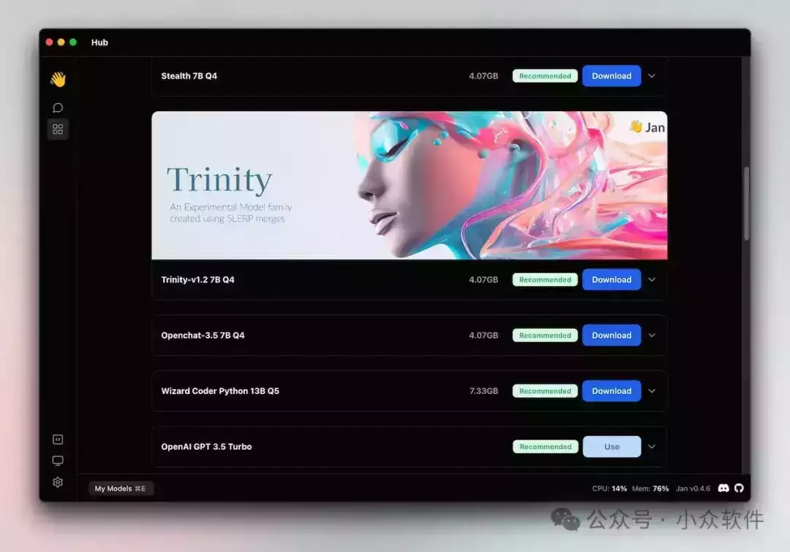
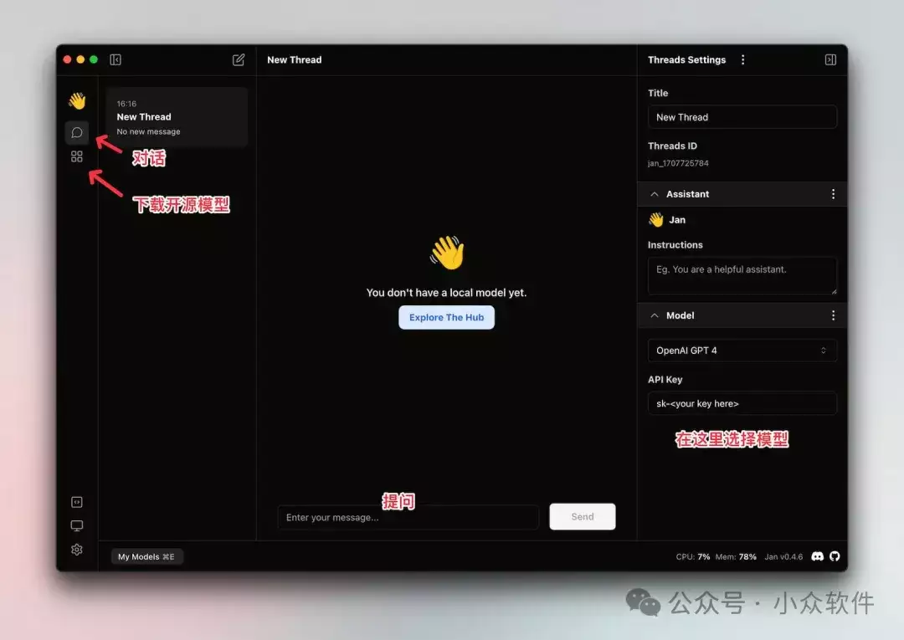

# 你们要的又离线、又免费的 ChatGPT，它来了。但代价是...

代价是：自己出硬件...

是的，只是可以非常方便的把大语言模型搭建在了自己的电脑上而已 

- - -

很多同学一直在找可以运行在自己电脑上的大语言模型，这不它来了。

## Jan – 免费的 ChatGPT 开源替代

原理就是使用自己的硬件来提供算力，支持：

-   Nvidia GPUs (fast)
    
-    Apple M-series (fast)
    
-    Apple Intel
    
-    Linux Debian
    
-    Windows x64
    

也支持多 GPU 集群，反正你有什么设备尽管上，越多算力越大，速度越快。

### 兼容 OpenAI API

Jan 提供了 OpenAI 等效 API，可以在本地 1337 端口直接调用。

### 截图

Jan 的使用界面很简单，从边栏选择并下载模型后，就可以直接用了：

选择并下载模型

主界面

用起来，就像和 ChatGPT 一样聊天，只不过这次，算力由你自己的电脑提供。

下面的动画是在 Mac M1、 16GB 设备，Sonoma 14 系统上的实时（回答速度）视频：

，时长00:13

除了从 Jan 提供的 Hub 选择模型，也支持手动导入模型、使用在线模型（远程服务器）。

青小蛙实在是没有硬件可以测试这个，测试了 OpenAI 的，的确没啥问题，推荐给各位 4090 用户玩玩。

## 获取

-   https://jan.ai/  
    

原文：https://www.appinn.com/jan-ai/