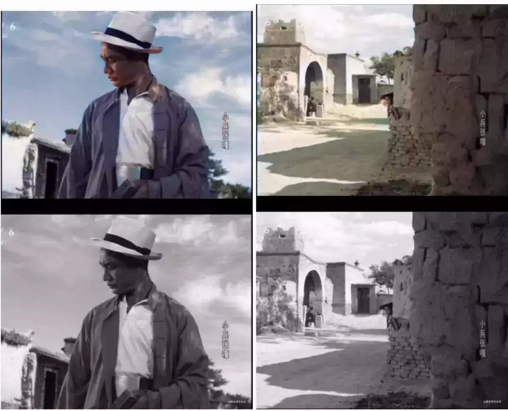

# 使用PaddleGAN修复老电影

  

  

本文带大家使用基于百度PaddlePaddle框架的GAN套件PaddleGAN，实现老电影修复。

首先我们先看看修复效果吧。



怎么样？效果还不错吧。下面我将带领大家一步一步实现老电影修复。

  

  

1

安装PaddleGAN套件

  

源码可以直接从github上下载。

```plain
git clone https://github.com/PaddlePaddle/PaddleGAN.git
```

也可以通过本文末尾的地址打包下载。

然后确定一下本机的python版本以及CUDA版本，这里注意需要使用显卡运行PaddleGAN套件，否则速度会非常慢。

进入以下页面，搜索2.0.0-rc0版本，然后根据系统环境实际情况选取合适版本的paddlepaddle框架下载。

```plain
https://paddlepaddle.org.cn/whl/stable.html
```

下载对应版本的paddlepaddle框架后，使用以下命令安装。  

```plain
pip install https://paddle-wheel.bj.bcebos.com/2.0.0-rc0-gpu-cuda10.1-cudnn7-mkl_gcc8.2%2Fpaddlepaddle_gpu-2.0.0rc0.post101-cp37-cp37m-linux_x86_64.whl
```

然后安装PaddleGAN套件。

```plain
cd PaddleGAN/
pip install -v -e .
```

安装依赖包

```plain
pip install -r requirments.txt -i https://pypi.douban.com/simple
```

  

  

2

修复老电影

  

首先需要自己准备一段几分钟的黑白视频片段，如果没有也可以通过本文末尾的地址下载本程序中的例子。  
进入applications目录执行脚本。

```plain
cd applications
python tools/video-enhance.py --input xiaobing1.mp4 --process_order  DeOldify  --output /home/aistudio/output_dir
```

\--input 指定输入的视频文件的路径。

\--output 指定输出修复视频保存的路径。

\--process\_order 指定算法，算法会按顺序执行。

目前修复工具支持以下算法：

-   DAIN:插帧算法，会对原始视频进行2倍帧率的插帧。
    
-   DeepRemaster:视频修复，一般当原始视频存在模糊的情况下使用
    
-   DeOldify:上色修复，对黑白视频进行上色，例如本文开头的效果图
    
-   RealSR:超分辨率，可以增大视频的分辨率，同时保证清晰度，适合分辨率比较低的视频
    
-   EDVR:超分辨率，可以增大视频的分辨率，同时保证清晰度，适合分辨率比较低的视频
    

以上算法可根据实际情况适当组合。例子中的原始视频的分辨率足够高，所以没有使用超分辨率算法。

执行代码后，控制台输出以下内容：

```plain
You are using Paddle compiled with TensorRT, but TensorRT dynamic library is not found. Ignore this if TensorRT is not needed.Model DeOldify proccess start..
W0108 18:59:55.299445  5019 device_context.cc:338] Please NOTE: device: 0, CUDA Capability: 70, Driver API Version: 11.0, Runtime API Version: 10.1
W0108 18:59:55.304046  5019 device_context.cc:346] device: 0, cuDNN Version: 7.6.
[01/08 18:59:59] ppgan INFO: Found /home/aistudio/.cache/ppgan/DeOldify_stable.pdparams
  1%|▍                                                                                  | 10/1806 [00:09<29:50,  1.00it/s]
```

程序运行的时间可能会比较长。程序的运行时间受输入视频的长度、分辨率以及采用的算法组合影响。运行结束后会在--output指定的路径生成修复好的视频。

源码及样例视频下载地址:  

链接: 

https://pan.baidu.com/s/1x3GTF5iLSwvw7NBhO2XP3w

密码: ww2g