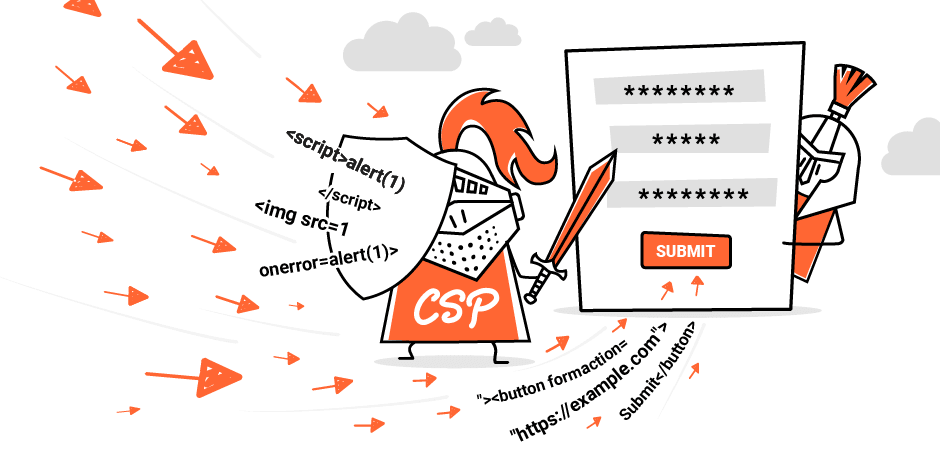

# 使用表单劫持绕过 CSP| PortSwigger 研究 --- Using form hijacking to bypass CSP | PortSwigger Research

# Using form hijacking to bypass CSP  
使用表单劫持绕过 CSP

-   [↓↓↓](https://twitter.com/share?url=https%3A%2F%2Fportswigger.net%2Fresearch%2Fusing-form-hijacking-to-bypass-csp&text=Using+form+hijacking+to+bypass+CSP%20-%20%40PortSwiggerRes%0A)  
      
      
      
    [↑↑↑](https://twitter.com/share?url=https%3A%2F%2Fportswigger.net%2Fresearch%2Fusing-form-hijacking-to-bypass-csp&text=Using+form+hijacking+to+bypass+CSP%20-%20%40PortSwiggerRes%0A)
    
-   [↓↓↓](https://api.whatsapp.com/send?text=https%3A%2F%2Fportswigger.net%2Fresearch%2Fusing-form-hijacking-to-bypass-csp)  
      
      
      
    [↑↑↑](https://api.whatsapp.com/send?text=https%3A%2F%2Fportswigger.net%2Fresearch%2Fusing-form-hijacking-to-bypass-csp)
    
-   [↓↓↓](https://reddit.com/submit?url=https%3A%2F%2Fportswigger.net%2Fresearch%2Fusing-form-hijacking-to-bypass-csp)  
      
      
      
    [↑↑↑](https://reddit.com/submit?url=https%3A%2F%2Fportswigger.net%2Fresearch%2Fusing-form-hijacking-to-bypass-csp)
    
-   [↓↓↓](https://www.linkedin.com/sharing/share-offsite?url=https%3A%2F%2Fportswigger.net%2Fresearch%2Fusing-form-hijacking-to-bypass-csp)  
      
      
      
    [↑↑↑](https://www.linkedin.com/sharing/share-offsite?url=https%3A%2F%2Fportswigger.net%2Fresearch%2Fusing-form-hijacking-to-bypass-csp)
    
-   [↓↓↓](mailto:?subject=Using+form+hijacking+to+bypass+CSP&body=Using+form+hijacking+to+bypass+CSP%0A%0AIn+this+post+we%27ll+show+you+how+to+bypass+CSP+by+using+an+often+overlooked+technique+that+can+enable+password+theft+in+a+seemingly+secure+configuration.+What+is+form+hijacking%3F+Form+hijacking+isn%27t+re%0A%0Ahttps://portswigger.net/research/using-form-hijacking-to-bypass-csp)  
      
      
      
    [↑↑↑](mailto:?subject=Using+form+hijacking+to+bypass+CSP&body=Using+form+hijacking+to+bypass+CSP%0A%0AIn+this+post+we%27ll+show+you+how+to+bypass+CSP+by+using+an+often+overlooked+technique+that+can+enable+password+theft+in+a+seemingly+secure+configuration.+What+is+form+hijacking%3F+Form+hijacking+isn%27t+re%0A%0Ahttps://portswigger.net/research/using-form-hijacking-to-bypass-csp)
    
-   [↓↓↓](https://portswigger.net/research/rss)  
      
      
      
    [↑↑↑](https://portswigger.net/research/rss)
    

### 

[↓↓↓](https://portswigger.net/research/gareth-heyes)  
  
Gareth Heyes  加雷思・海斯  
  
[↑↑↑](https://portswigger.net/research/gareth-heyes)

Researcher 研究员

[@garethheyes](https://twitter.com/garethheyes)

-   **Published:** 05 March 2024 at 14:55 UTC  
    发布时间：05 三月 2024 在 14:55 UTC
    
-   **Updated:** 05 March 2024 at 14:55 UTC  
    更新：05 三月 2024 在 14:55 UTC
    

**In this post we'll show you how to bypass [CSP](https://portswigger.net/web-security/cross-site-scripting/content-security-policy) by using an often overlooked technique that can enable password theft in a seemingly secure configuration.  
在这篇文章中，我们将向您展示如何通过使用一种经常被忽视的技术来绕过 CSP，这种技术可以在看似安全的配置中实现密码窃取。**

## What is form hijacking?  
什么是表单劫持？

Form hijacking isn't really a widely known technique; the idea is you have a HTML injection vulnerability that is protected by CSP. Then you use the HTML injection to inject your own form action by using the `formaction` attribute or injecting your own form to send data to the attackers server. Over eager password managers will also help fill in credentials with injected input elements making the attack pretty serious.  
表单劫持并不是一种广为人知的技术；其原理是您有一个受 CSP 保护的 HTML 注入漏洞。然后，您使用 HTML 注入来注入您自己的表单操作，方法是使用 `formaction` 属性或注入您自己的表单来向攻击者服务器发送数据。过于急切的密码管理器也会帮助填充带有注入输入元素的凭据，这使得攻击非常严重。

## Real world examples  真实的世界例子

We found a

[↓↓↓](https://portswigger.net/research/stealing-passwords-from-infosec-mastodon-without-bypassing-csp)  
  
real world example of this on Infosec Mastodon  
  
[↑↑↑](https://portswigger.net/research/stealing-passwords-from-infosec-mastodon-without-bypassing-csp)

where they used a fork of Mastodon that didn't filter HTML correctly. An attacker could then use form hijacking to send credentials to their server after Chrome's password manager had automatically filled them in. The end result was a user would see a post in Infosec Mastodon, click what looked like part of the interface but actually would send the user's credentials to an attacker's server.  
我们在 Infosec Mastodon 上发现了一个真实的例子，他们使用了一个不能正确过滤 HTML 的 Mastodon 分支。然后，攻击者可以使用表单劫持在 Chrome 的密码管理器自动填写凭据后将其发送到服务器。最终的结果是用户会看到 Infosec Mastodon 中的帖子，点击看起来像界面的一部分，但实际上会将用户的凭据发送到攻击者的服务器。

That was over a year ago and then...we got an excellent report submitted by

[↓↓↓](https://twitter.com/joaxcar)  
  
Johan Carlsson  
  
[↑↑↑](https://twitter.com/joaxcar)

to our very own bug bounty program. [In the report](https://hackerone.com/reports/2279346) he showed how we allowlisted some Google script resources and he could use that to bypass CSP by injecting [AngularJS](https://portswigger.net/web-security/cross-site-scripting/contexts/client-side-template-injection). After we fixed that he also pointed out that we didn't protect against form hijacking! Thankfully, this was just a bypass of our CSP as we didn't have a HTML injection vulnerability but it was good to receive a report that hardened our security so we gave him a $1,500 bounty.  
那是一年多前的事了然后... 我们收到了 Johan Carlsson 向我们自己的 bug 赏金计划提交的一份出色的报告。在报告中，他展示了我们如何允许列出一些 Google 脚本资源，他可以通过注入 AngularJS 来绕过 CSP。在我们修复后，他还指出，我们没有保护形式劫持！值得庆幸的是，这只是我们 CSP 的一个旁路，因为我们没有 HTML 注入漏洞，但很高兴收到一份报告，加强了我们的安全性，所以我们给了他 1,500 美元的赏金。

## Why does it happen? 为什么会这样？

The form-action directive was specified in version 2 of CSP. Unfortunately, default-src does not cover form actions. This means if you overlook this directive then your CSP will be vulnerable to form hijacking and this is exactly what happened in the case of the Infosec Mastodon and even our own site. Therefore this post was meant to spread awareness of this issue and hopefully harden many CSP's out there.  
表单操作指令在 CSP 版本 2 中指定。不幸的是，default-src 不包括表单操作。这意味着，如果你忽略了这个指令，那么你的 CSP 将很容易受到形式劫持，这正是发生在 Infosec Mastodon 甚至我们自己的网站的情况。因此，这篇文章旨在传播对这个问题的认识，并希望加强许多 CSP 的存在。

## Scanning your CSP  扫描 CSP

We've recently released some new passive scan checks for CSP issues in Burp. These checks will find issues like form hijacking, allowlisted resources, untrusted script execution, untrusted style execution, malformed syntax, [clickjacking](https://portswigger.net/web-security/clickjacking) and non-enforced CSP. I'll go through each one so you can understand how to fix these issues if you encounter them.  
我们最近在 Burp 中发布了一些新的 CSP 问题被动扫描检查。这些检查将发现表单劫持、允许列出的资源、不可信的脚本执行、不可信的样式执行、格式错误的语法、点击劫持和非强制 CSP 等问题。我将逐一介绍，以便您了解在遇到这些问题时如何解决它们。

## Form hijacking  表单劫持

If you don't use form actions on your site (which is pretty common these days in modern apps) you can specify the directive with the 'none' keyword, this is the safest configuration since an attacker won't be able to post forms to an external location. If your site requires "same site" form actions then you can use the 'self' keyword.  Lastly if you want to allow an external location you can specify a URL but bear in mind that an attacker will be able to post to that location too if they find a HTML injection vulnerability. Examples of each configuration are given below:  
如果你在网站上不使用表单操作（这在现代应用程序中很常见），你可以用“none”关键字指定指令，这是最安全的配置，因为攻击者将无法将表单发布到外部位置。如果你的网站需要“相同的网站”表单操作，那么你可以使用“self”关键字。最后，如果你想允许一个外部位置，你可以指定一个 URL，但请记住，如果攻击者发现一个 HTML 注入漏洞，他们也可以发布到该位置。每种配置的示例如下：

`Content-Security-Policy: form-action 'none'   Content-Security-Policy: form-action 'self'   Content-Security-Policy: form-action https://portswigger.net`

## Allowlisted resources  允许列出的资源

It's bad practice to use allowlisted URLs because they can be used to for

[↓↓↓](https://www.blackhat.com/docs/us-17/thursday/us-17-Lekies-Dont-Trust-The-DOM-Bypassing-XSS-Mitigations-Via-Script-Gadgets.pdf)  
  
script gadgets  
  
[↑↑↑](https://www.blackhat.com/docs/us-17/thursday/us-17-Lekies-Dont-Trust-The-DOM-Bypassing-XSS-Mitigations-Via-Script-Gadgets.pdf)

. This scan check will look at the script directives and see if any domains are allowlisted. To fix this you are advised to use a secure random nonce to protect your scripts:  
这是不好的做法，使用允许列出的网址，因为他们可以用于脚本小工具。此扫描检查将查看脚本指令并查看是否允许列出任何域。要解决这个问题，建议您使用安全的随机数来保护您的脚本：`Content-Security-Policy: script-src 'nonce-RANDOM';`

## Untrusted script execution  
不受信任的脚本执行

This issue points out when you use 'unsafe-inline' in your script directives. As the name suggests this opens your policy up to cross site scripting attacks because you can inject an inline script tag. It also covers when the policy allows wildcard domains, data: URLs, unsafe-eval and weak nonce randomisation. Secure random nonces are the best way to resolve this issue:  
当你在脚本指令中使用 'unsafe-inline' 时，这个问题会出现。顾名思义，这会使您的策略受到跨站点脚本攻击，因为您可以注入内联脚本标记。它还涵盖了当策略允许随机域，数据：URL，不安全评估和弱随机数时。安全随机数是解决此问题的最佳方法：

`Content-Security-Policy: script-src 'nonce-RANDOM';`

## Untrusted style execution  
不受信任的样式执行

Style based injections can often have a significant impact if there is sensitive information or tokens on the page. This issue points out if you use 'unsafe-inline' in conjunction with style based directives. Any wildcard domains, data: URLs and weak nonce randomisation will also be reported. To fix this again use nonces in your style directives:  
如果页面上有敏感信息或标记，基于样式的注入通常会产生重大影响。这个问题指出，如果你使用 'unsafe-inline' 与基于样式的指令。还将报告任何非随机域、数据：URL 和弱随机数。要再次解决这个问题，请在样式指令中使用 nonces：

`Content-Security-Policy: style-src 'nonce-RANDOM';`

## Malformed syntax 语法错误

When CSP encounters some malformed syntax it will ignore the value or maybe even the directive. This scan check looks for malformed CSP syntax and reports any directives or values that do not conform to the specification. We ran a scan on a large number of sites and found lots of common mistakes that this scan check will help iron out. When some invalid syntax is found the directive or value will be displayed in the issue detail. To fix this you should consult the CSP specification and ensure the syntax is correct.  
当 CSP 遇到一些格式错误的语法时，它会忽略该值，甚至可能忽略该指令。此扫描检查将查找格式错误的 CSP 语法，并报告任何不符合规范的指令或值。我们对大量网站进行了扫描，发现了许多常见的错误，这种扫描检查将有助于消除这些错误。当发现一些无效的语法时，指令或值将显示在问题详细信息中。要解决这个问题，您应该查阅 CSP 规范并确保语法正确。

## Clickjacking  点击劫持

This check will check X-Frame-Options and the frame-ancesters directive in CSP and inform you if your application allows it to be framed. X-Frame-Options is now deprecated so we recommend you use the frame-ancestors directive to mitigate clickjacking attacks like this:  
此检查将检查 CSP 中的 X-Frame-Options 和 frame-ancesters 指令，并通知您应用程序是否允许其框架。X-Frame-Options 现在已弃用，因此我们建议您使用 frame-ancestors 指令来减轻点击劫持攻击，如下所示：

`Content-Security-Policy: frame-ancestors 'none';`

## Non-enforced CSP  非强制 CSP

Burp will also inform you if your policy is in report only mode, this means the policy won't be enforced but will log the results. This is often used to transition to an enforced policy but can often be overlooked by mistake. It will also report an issue on a per site basis if CSP does not exist to encourage developers to deploy one.  
如果您的策略处于仅报告模式，Burp 也会通知您，这意味着策略不会被强制执行，但会记录结果。这通常用于过渡到强制执行的策略，但经常会被错误地忽略。如果 CSP 不存在，它还将报告每个站点的问题，以鼓励开发人员部署 CSP。

## In the wild 在野外

Whilst testing Burp we scanned our bug bounty pipeline and found lots of common mistakes that developers make when deploying CSP. We are going to highlight some of them below to help you avoid them.  
在测试 Burp 时，我们扫描了我们的 bug 赏金管道，发现了开发人员在部署 CSP 时经常犯的许多错误。我们将在下面列出其中一些，以帮助您避免它们。

### Incorrect protocol  方案不正确

Some web sites forget the colon quite a lot when deploying.  
一些网站在部署时经常忘记冒号。

`Content-Security-Policy: script-src 'self' https`

It should be: 它应该是：

`Content-Security-Policy: script-src 'self' https:`

You should avoid doing this of course because an attacker would be able to inject a script resource from any domain with TLS provided the target site is vulnerable to [XSS](https://portswigger.net/web-security/cross-site-scripting).  
当然，您应该避免这样做，因为攻击者可以从任何具有 TLS 的域注入脚本资源，前提是目标站点易受 XSS 攻击。

### Missing semicolon  失踪的小女孩

It's quite common to forget to include a semicolon. This can result in the directive name being used as a value which would mean the policy wouldn't enforce this directive!  
很容易忘了加上一个小盒子。这可能导致指令名称被用作值，这意味着策略不会强制执行此指令！

This is incorrect:  这是不正确的：

`frame-ancestors 'self' https://example.com default-src 'none'`

It should be: 它应该是：

`frame-ancestors 'self' https://example.com; default-src 'none'`

### Incorrect value 值不正确

In CSP all special directive values are quoted. It's quite common to see values not quoted and also illegal values like the following:  
在 CSP 中，所有特殊的指令值都被引用。很常见的情况是，值没有引号，也有像下面这样的非法值：

`Content-Security-Policy: frame-ancestors DENY`

There is no DENY value in the frame-ancestors directive value. It should be:  
在 frame-ancestors 指令值中没有 DENY 值。它应该是：

`Content-Security-Policy: frame-ancestors 'none'`

### None quoted hashes or nonces  
没有引用的哈希或随机数

This is incorrect:  这是不正确的：

`Content-Security-Policy: script-src sha512-BASE64HASH`

It should be: 它应该是：

`Content-Security-Policy: script-src 'sha512-BASE64HASH'`

## Burp release 打嗝缓解

We hope that this post spreads awareness of form hijacking and common CSP mistakes. If you want to scan your own site for these issues you can get [Burp on the early adopter channel](https://portswigger.net/burp/releases/professional-community-2024-2-1). Happy hunting!  
我们希望这篇文章传播表单劫持和常见 CSP 错误的意识。如果你想扫描你自己的网站上的这些问题，你可以得到打嗝的早期采用者频道。狩猎愉快！

[↓↓↓](https://portswigger.net/research/articles)  
  
Back to all articles  
返回所有文章  
  
[↑↑↑](https://portswigger.net/research/articles)
