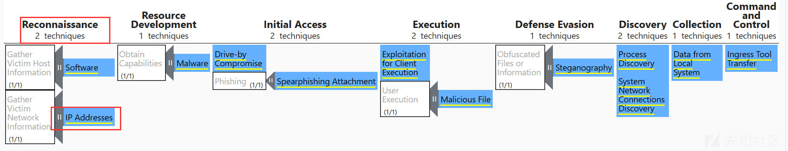

# [ATT&CK 系列 - 学习理解类]ATT&CK 威胁框架各战术、技术详解 (一) <侦察战术> - 先知社区

> **写在最前面**：本篇文章是`ATT&CK威胁框架-各战术、技术详解系列`的第一篇，接续`一文说清楚ATT&CK威胁框架`，属于后续 ATT&CK 系列的三个类别中的学习理解类。文章主要**介绍 ATT&CK 框架中第一个战术**：`侦察（Reconnaissance）`，包括该战术的来源、涉及的`10个技术`和`34个子技术`的详细信息。
> 
> **为什么要开这个系列？**`ATT&CK威胁框架-各战术、技术详解系列`
> 
> **目的有三**：
> 
> 1.  加深对各个战术和技术的理解，不会的就学、模糊的就实践，通过该框架**整合已有知识**、**构建体系**。后续会以该框架为主干，分支出**关于具体技术**学习实践的文章；也会学习使用该框架进行具体项目实践。
> 2.  **分析需求**：在进行**恶意样本分析**时，样本处置一节需要 ATT&CK 进行映射，以规范化分析结果。
> 3.  **兴趣分享**：关于该框架的学习、翻译、实践都是在业余时间进行，内容很多、有些地方也比较枯燥，但是确实乐在其中，也分享出来与大家共勉。
> 
> **说明**：
> 
> 1.  主要针对`Enterprise即企业领域`的相关技术、战术
> 2.  以`战术-技术-子技术`的顺序构建三级目录
> 3.  本文参考的**框架版本**：`V14`
> 
> **还有一句话**：本篇文章较长，大概 4 万字，师傅们可以点个收藏，需要时食用。

# Tactics1：侦察

> **名称**：`Reconnaissance`
> 
> **编号**：`TA0043`
> 
> **创建时间**：`2020-10-18`
> 
> **框架位置**：`1`
> 
> **技术数量**：`10`
> 
> **官方链接**：[https://attack.mitre.org/tactics/TA0043/](https://attack.mitre.org/tactics/TA0043/)

## 战术宏观

### 前因

> 下面主要介绍下战术在 ATT&CK 的不同版本下的变化，帮助更好的理解。

之前的文章有详细介绍过 ATT&CK 战术的相关概念，简单来说，`战术即攻击者的技术目标`。与不断在增删查改的技术不同，战术一般不会发生太大的改变，从 ATT&CK 的版本更新来看，最新的 v14 与较旧的 v4 在基本战术布局基本类似，仅仅是 V14 版本增加了`侦察`、`资源`开发这两个**攻击前阶段**。

**问：为什么要新增侦察和资源开发这两个战术呢？**

**答**：因为用户的需求。在之前的版本中，ATT&CK**仅涵盖了入侵后的行为**，这限制了框架的使用；后来 ATT&CK 框架**将 PRE ATT&CK 整合到了现有框架**之中，并引入了**两个新的战术**`：侦察（Reconnaissance）`和`资源开发（Resource Development）`。如下战术整合中，这两个战术的**编号排在很后面**。

- - -

**战术梳理：**截止到`2024-3-15，v14版本、Enterprise领域下`的战术整合如下

| 战术编号 | 战术名称（英） | 战术名称（译） | 技术数量（不含子技术） |
| --- | --- | --- | --- |
| **TA0043** | **Reconnaissance** | **侦察** | **10** |
| TA0042 | Resource Development | 资源开发 | 8   |
| TA0001 | Initial Access | 初始访问 | 10  |
| TA0002 | Execution | 攻击执行 | 14  |
| TA0003 | Persistence | 持久化 | 20  |
| TA0004 | Privilege Escalation | 权限提升 | 14  |
| TA0005 | Defense Evasion | 防御规避 | 43  |
| TA0006 | Credential Access | 凭证访问 | 17  |
| TA0007 | Discovery | 环境发现 | 32  |
| TA0008 | Lateral Movement | 横向移动 | 9   |
| TA0009 | Collection | 数据收集 | 17  |
| TA0011 | Command and Control | 指令与控制 | 17  |
| TA0010 | Exfiltration | 数据窃取 | 9   |
| TA0040 | Impact | 危害影响 | 14  |

### 侦察战术介绍

> 如上文所述，ATT&CK 在 v8 版本增加了`侦察`与`资源开发`两个新的战术，虽然是新增的，但是战术排序却排在了第一和第二位。所以依据该顺序（即上表），本文先**对侦察战术进行介绍**。

不论是 APT 组织进行攻击，还是红队进行安全演练、渗透测试，都会在正式攻击之前**收集相关的有用信息**，以规划后续具体行动。这些信息可能包括受害**组织、设备、受害人的基本信息**，例如`组织网络架构、员工身份信息`等；采取的**技术措施也很多**，如`钓鱼攻击`、`公开数据库搜索`（如 WHOIS、CDNs 等）、`公开网站搜索`（如搜索引擎、社交媒体等）等等。

需要注意的是，`侦察`这个攻击前战术是**很难缓解和防御**的，因为相关的技术与正常行为很类似，而且也超出了企业的防御和控制范围。为了保证框架结构的完整性，ATT&CK 专门创建了一个名为`Pre-compromise`的缓解措施，如下：

> **方法**：`Pre-compromise`
> 
> **编号**：`M1056`
> 
> **可缓解技术**：攻击者获得初始访问权限之前发生的技术，如侦`察和资源开发阶段`
> 
> **官方链接**：[https://attack.mitre.org/mitigations/M1056/](https://attack.mitre.org/mitigations/M1056/)

**问**：既然相关技术的缓解与检测方法很少，为什么还要介绍这些技术呢？

**答**：因为通过学习侦察战术下的相关技术，可以更加清晰的知晓攻击者需要搜集哪些信息、通过哪些途径搜集，进而可以**帮助企业自检，减少暴露面**。

### 后续布局

> 下面主要介绍以下后续文章的布局，即对于每一个技术采取什么样的固定格式进行介绍。

`侦察战术`共有**10 个技术**，依次对应**下文的 10 个小节**，每一节一个；

技术可能包含**子技术**，依次对应下文每一个**小节下的更低一级目录**；

对于**技术**或者**子技术**，采取**如下架构**进行语言组织：

-   基本信息介绍：包括名称、编号、创建时间、框架位置、所属战术、子技术数量、链接、具体描述
-   在野使用：介绍该技术关联的 APT 组织，包括组织信息、关联行为、信息来源、Navigation 矩阵
-   缓解措施：介绍针对该技术的缓解措施，包括方法、编号、链接、具体介绍
-   检测方法：介绍检测该技术的方法，包括方法名称、编号、链接、具体介绍

## Techniques-1：主动扫描\[T1595\]

> **名称**：`Active Scanning`
> 
> **编号**：`T1595`
> 
> **创建时间**：`2020-10-02`
> 
> **框架位置**：`1-1`
> 
> **所属战术**：`1-侦察`
> 
> **子技术数量**：`3`
> 
> **官方链接**：[https://attack.mitre.org/techniques/T1595/](https://attack.mitre.org/techniques/T1595/)

**具体描述**

`主动扫描`是指攻击者**通过网络流量探测受害者基础设施的扫描**，而不是不涉及直接交互的其他形式的侦察方法。

攻击者可能会根据他们想要收集的信息进行**不同形式的主动扫描**。这些扫描也可以以各种方式执行，包括**使用网络协议**（如 ICMP）的本地功能。来自这些扫描的信息可能关联其他形式的**侦察技术**（例如`：T1593、T1596`）、**资源开发**（例如：`T1587、T588`）和**初始访问**（例如：`T1133、T1190`）。

- - -

**缓解措施-Mitigations**

> **方法**：`Pre-compromise`
> 
> **编号**：`M1056`
> 
> **可缓解技术**：攻击者获得初始访问权限之前发生的技术，如侦`察和资源开发阶段`
> 
> **官方链接**：[https://attack.mitre.org/mitigations/M1056/](https://attack.mitre.org/mitigations/M1056/)

这种技术不能轻易地通过预防性控制来缓解，因为它是基于在企业防御和控制范围之外执行的行为。工作重点是**尽量减少外部各方可获得的数据数量和敏感性**。

> **DG**：该缓解方法比较笼统，没有具体的实施措施。

- - -

**检测方法-Detection**

> **方法**：`Network Traffic`
> 
> **编号**：`DS0029`
> 
> **官方链接**：[https://attack.mitre.org/datasources/DS0029/](https://attack.mitre.org/datasources/DS0029/)

通过**分析网络传输的数据**（例如：`Web、DNS、邮件、文件`等），这些数据要么被汇总为可分析格式。

**具化到本技术：**

1.  **网络流量内容**：监控和分析**不遵循预期协议标准和流量**的流量模式和数据包检测（例如，不属于已建立流的无关数据包、无端或异常流量模式、异常语法或结构）。考虑**与进程监控和命令行的关联**，以检测与流量模式相关的异常进程执行和命令行参数）。
2.  **数据流**：监视网络数据中是否存在不常见的数据流。使用网络的进程通常**没有网络通信或以前从未见过**，这是可疑的。

### Sub1：IP 段扫描\[T1595.001\]

> **名称**：`Scanning IP Blocks`
> 
> **编号**：`T1595.001`
> 
> **位置**：`1-1-1`
> 
> **所属平台**：`PRE`
> 
> **官方链接**：[https://attack.mitre.org/techniques/T1595/001/](https://attack.mitre.org/techniques/T1595/001/)

**基本描述**

**概述**：攻击者可能会**扫描受害者的 IP 段**，以收集攻击期间使用的信息。

**目标**：攻击者可能会扫描 IP 段以`收集受害者网络信息[T1590]`，例如**哪些 IP 地址正在使用**中，以及有关分配了这些地址的主机的**更多详细信息**。扫描的范围可能从简单的 ping（ICMP 请求和响应）到更细微的扫描，这些扫描可能显示**主机软件/版本**。

**关联**：来自这些扫描的信息可能会关联其他形式的**侦察技术**（例如：`搜索公开网站/域[T1593]`或`搜索开放技术数据库[T1596]`）、**资源开发**（例如：`能力开发[T1587]`或`能力获取[T1588]`）和**初始访问**（例如：`利用外部远程服务[T1133]`）。

- - -

**在野利用-Procedure**

> **名称**：`TeamTNT`
> 
> **编号**：`G1039`
> 
> **官方链接**：[https://attack.mitre.org/groups/G0139/](https://attack.mitre.org/groups/G0139/)

**组织介绍**：关联到威胁组织-`TeamTNT`，该组织是一个主要针对**云和容器化环境**的威胁组织。自 2019 年 10 月以来一直很活跃，主要致力于利用云和容器资源在受害者环境中部署加密货币矿工。

**关联行为**：T1595.001 技术是该组织使用的众多技术的一种，具体为：[TeamTNT](https://attack.mitre.org/groups/G0139)扫描了**目标 IP 地址的特定列表**，信息来源为[一份分析报告](https://documents.trendmicro.com/assets/white_papers/wp-tracking-the-activities-of-teamTNT.pdf)。

**威胁拓扑**：该组织的**威胁拓扑如下**，对应的[Nagivcation JSON](https://mitre-attack.github.io/attack-navigator//#layerURL=https%3A%2F%2Fattack.mitre.org%2Fgroups%2FG0139%2FG0139-enterprise-layer.json)：

- - -

**缓解措施-Mitigations**

> **方法**：`Pre-compromise`
> 
> **编号**：`M1056`
> 
> **可缓解技术**：攻击者获得初始访问权限之前发生的技术，如`侦察和资源开发阶段`
> 
> **官方链接**：[https://attack.mitre.org/mitigations/M1056/](https://attack.mitre.org/mitigations/M1056/)

这种技术不能轻易地通过**预防性控制**来缓解，因为它基于在企业防御和控制范围之外执行的行为。工作重点应是**尽量减少外部各方可获得的数据数量和敏感性**。

- - -

**检测方法-Dectetion**

> **方法**：`Network Traffic`
> 
> **编号**：`DS0029`
> 
> **官方链接**：[https://attack.mitre.org/datasources/DS0029/](https://attack.mitre.org/datasources/DS0029/)

监视网络数据中是否存在**不常见的数据流**，如使用网络的**进程通常没有网络通信或以前从未见过**，这是可疑的。

### Sub2：漏洞扫描\[T1595.002\]

> **名称**：`Vulnerability Scanning`
> 
> **编号**：`T1595.002`
> 
> **位置**：`1-1-2`
> 
> **所属平台**：`PRE`
> 
> **官方链接**：[https://attack.mitre.org/techniques/T1595/002/](https://attack.mitre.org/techniques/T1595/002/)

**基本描述**

**概述**：攻击者可能会扫描受害者以查找使用的漏洞。漏洞扫描通常会**检查目标主机/应用程序的配置**（例如：软件和版本）是否可能与攻击者可能寻求使用的特定漏洞的**目标一致**。

**目标**：这些扫描还可能包括广泛地`收集受害者主机信息[T1592]`，这些信息可用于**识别更常见的可利用漏洞**。漏洞扫描通常通过`服务器响应信息`、`侦听端口`或`其他网络项目`收集正在运行的软件和版本号

**关联**：来自这些扫描的信息可能会关联其他形式的**侦察技术**（例如：`搜索公开网站/域[T1593]`或`搜索开放技术数据库[T1596]`）、**资源开发**（例如：`能力开发[T1587]`或`能力获取[T1588]`）和**初始访问**（例如：`利用面向公众的应用程序[T1190]`）。

- - -

**在野利用-Procedure**

> **名称**：`Aquatic Panda`
> 
> **编号**：`G0143`
> 
> **官方链接**：[https://attack.mitre.org/groups/G0143](https://attack.mitre.org/groups/G0143)

**组织介绍**：Aquatic Panda 是一个疑似中国威胁组织，肩负着情报收集和工业间谍活动的双重使命。自 2020 年 5 月以来，Aquatic Panda 一直活跃，主要针对电信、技术和政府部门的实体。

**关联行为**：`Aquatic Panda` 使用可公开访问的 DNS 日志记录服务来**识别易受 Log4j 攻击的服务器** （CVE 2021-44228）

**威胁拓扑**：对应`Nagivation JSON`\-[https://attack.mitre.org/groups/G0143/G0143-enterprise-layer.json](https://attack.mitre.org/groups/G0143/G0143-enterprise-layer.json)

**注意**：与该技术关联的**其他组织**包括[APT28](https://attack.mitre.org/groups/G0007)、[APT29](https://attack.mitre.org/groups/G0016)、[Dragonfly](https://attack.mitre.org/groups/G0035)、[Earth Lusca](https://attack.mitre.org/groups/G1006)、[Magic Hound](https://attack.mitre.org/groups/G0059)、[Sandworm Team](https://attack.mitre.org/groups/G0034)、[TeamTNT](https://attack.mitre.org/groups/G0139)、[Volatile Cedar](https://attack.mitre.org/groups/G0123)

- - -

**缓解措施-Mitigations**

> **方法**：`Pre-compromise`
> 
> **编号**：`M1056`
> 
> **可缓解技术**：攻击者获得初始访问权限之前发生的技术，如`侦察和资源开发阶段`
> 
> **官方链接**：[https://attack.mitre.org/mitigations/M1056/](https://attack.mitre.org/mitigations/M1056/)

这种技术不能轻易地通过**预防性控制**来缓解，因为它基于在企业防御和控制范围之外执行的行为。工作重点应是**尽量减少外部各方可获得的数据数量和敏感性**。

- - -

**检测方法-Dectetion**

> **方法**：`Network Traffic`
> 
> **编号**：`DS0029`
> 
> **官方链接**：[https://attack.mitre.org/datasources/DS0029/](https://attack.mitre.org/datasources/DS0029/)

1.  **网络流量内容**：监控和分析**不遵循预期协议标准和流量**的流量模式和数据包检测（例如，不属于已建立流的无关数据包、无端或异常流量模式、异常语法或结构）。考虑**与进程监控和命令行的关联**，以检测与流量模式相关的异常进程执行和命令行参数）。
2.  **数据流**：监视网络数据中是否存在不常见的数据流。使用网络的进程通常**没有网络通信或以前从未见过**，这是可疑的。

### Sub3：目录扫描\[T1595.003\]

> **名称**：`Wordlist Scanning`
> 
> **编号**：`T1595.003`
> 
> **位置**：`1-1-3`
> 
> **所属平台**：`PRE`
> 
> **官方链接**：[https://attack.mitre.org/techniques/T1595/003/](https://attack.mitre.org/techniques/T1595/003/)

**基本描述**

**概述**：攻击者可能会**使用暴力破解等技术迭代探测基础设施**。虽然此技术采用与`暴力破解[T1110]`类似的方法，但其目标是**识别内容和基础结构**，而不是发现有效凭据。这些扫描中使用的目录列表可能包含通用的、常用的名称和文件扩展名或特定于特定软件的术语。攻击者还可以使用从其他**侦察技术**（例如：[收集受害者组织信息](https://attack.mitre.org/techniques/T1591)或[搜索受害者拥有的网站](https://attack.mitre.org/techniques/T1594)）收集的数据**创建自定义的、特定于目标的目录表**。

**目标**：攻击者可能会使用 Web 内容发现工具（如 Dirb、DirBuster 和 GoBuster）以及通用或自定义词表来枚举网站的页面和目录。这可以帮助他们**发现旧的、易受攻击的页面或隐藏的管理门户**，这些页面或门户可能成为进一步操作的目标。

- - -

**在野利用-Procedure**

> **名称**：`Volatile Cedar`
> 
> **编号**：`G0123`
> 
> **官方链接**：[https://attack.mitre.org/groups/G0123](https://attack.mitre.org/groups/G0123)

**组织介绍**：Volatile Cedar 是一个黎巴嫩威胁组织，以世界各地的个人、公司和机构为目标。Volatile Cedar 自 2012 年开始运营，其动机是政治和意识形态利益。

**关联行为**：Volatile Cedar 使用 DirBuster 和 GoBuster 来暴力破解 Web 目录和 DNS 子域。

**使用软件**：[Caterpillar WebShell](https://attack.mitre.org/software/S0572)、[Explosive](https://attack.mitre.org/software/S0569)

**信息来源**：[分析报告](https://www.clearskysec.com/wp-content/uploads/2021/01/Lebanese-Cedar-APT.pdf)

**威胁拓扑**：对应`Nagivation JSON`\-[https://attack.mitre.org/groups/G0123/G0123-enterprise-layer.json](https://attack.mitre.org/groups/G0123/G0123-enterprise-layer.json)

- - -

**缓解措施-Mitigations**

> **方法 1**：`Pre-compromise`
> 
> **编号**：`M1056`
> 
> **可缓解技术**：攻击者获得初始访问权限之前发生的技术，如`侦察和资源开发阶段`
> 
> **官方链接**：[https://attack.mitre.org/mitigations/M1056/](https://attack.mitre.org/mitigations/M1056/)

这种技术不能轻易地通过**预防性控制**来缓解，因为它基于在企业防御和控制范围之外执行的行为。工作重点应是**尽量减少外部各方可获得的数据数量和敏感性**。

> **方法 2**：`Disable or Remove Feature or Program`
> 
> **编号**：`M1042`
> 
> **官方链接**：[https://attack.mitre.org/mitigations/M1042/](https://attack.mitre.org/mitigations/M1042/)

删除或拒绝访问不必要且可能易受攻击的软件，以防止对手滥用。

**具体到该技术**：**删除或禁用**对未明确要求在外部可用的任何系统、资源和基础结构的**访问**。

- - -

**检测方法-Dectetion**

> **方法**：`Network Traffic`
> 
> **编号**：`DS0029`
> 
> **官方链接**：[https://attack.mitre.org/datasources/DS0029/](https://attack.mitre.org/datasources/DS0029/)

1.  **网络流量内容**：监控和分析**不遵循预期协议标准和流量**的流量模式和数据包检测（例如，不属于已建立流的无关数据包、无端或异常流量模式、异常语法或结构）。考虑**与进程监控和命令行的关联**，以检测与流量模式相关的异常进程执行和命令行参数）。
2.  **数据流**：监视网络数据中是否存在不常见的数据流。使用网络的进程通常**没有网络通信或以前从未见过**，这是可疑的。

## Techniques-2：搜集受害者主机信息\[T1592\]

> **名称**：`Gather Victim Host Information`
> 
> **编号**：`T1592`
> 
> **创建时间**：`2020-10-02`
> 
> **框架位置**：`1-2`
> 
> **所属战术**：`1-侦察`
> 
> **子技术数量**：`4`
> 
> **官方链接**：[https://attack.mitre.org/techniques/T1592/](https://attack.mitre.org/techniques/T1592/)

**具体描述**

**概述**：攻击者可能收集受害者主机的可用于目标定位的信息。

**目标**：这些关于主机的信息可能包括各种详细内容，例如**管理数据**（如`名称、IP地址`等）以及**与其配置相关的具体信息**（如`操作系统、语言`等）

**实现**：攻击者可能通过**多种方式收集**这些信息，比如直接采取`主动扫描T1595`或通过`网络钓鱼T1598`获取信息的方式进行收集。攻击者还可能先破坏网站，然后**植入恶意内容**，以此从访客那里收集主机信息。主机的相关信息也可能通过**在线或其他可访问的数据集**暴露给攻击者（例如`社交媒体T1593.001`或`搜索受害者的自有网站T1594`）。

**关联**：收集此类信息可能会关联其他**侦察技术**（例如`搜索公开网站/域名T1593`或`搜索开放技术数据库T1596`），**用于资源开发**（例如`能力开发T1587`或`能力获取T1588`），和**用于初始访问**（例如`供应链攻击T1195`或`利用外部远程服务T1133`）

- - -

**缓解措施-Mitigations**

> **方法**：`Pre-compromise`
> 
> **编号**：`M1056`
> 
> **可缓解技术**：攻击者获得初始访问权限之前发生的技术，如侦`察和资源开发阶段`
> 
> **官方链接**：[https://attack.mitre.org/mitigations/M1056/](https://attack.mitre.org/mitigations/M1056/)

这种技术不能轻易地通过预防性控制来缓解，因为它基于在企业防御和控制范围之外执行的行为。工作重点应是尽量减少外部各方可获得的数据数量和敏感性。

> **DG**：该缓解方法比较笼统，没有具体的实施措施。

- - -

**检测方法-Detection**

> 关于该技术的检测并没有好的方法，因为其中大部分活动可能具有**非常高的发生率和误报率**，并且可能发生在目标组织的可见性之外，使防御者难以检测。
> 
> 检测工作可能侧重于**攻击者生命周期的相关阶段**，例如在初始访问期间，而该技术**属于攻击前阶段**。

### Sub1：搜集主机硬件信息\[T1592.001\]

> **名称**：`Gather Victim Host Information: Hardware`
> 
> **编号**：`T1592.001`
> 
> **位置**：`1-2-1`
> 
> **所属平台**：`PRE`
> 
> **官方链接**：[https://attack.mitre.org/techniques/T1592/001/](https://attack.mitre.org/techniques/T1592/001/)

**基本描述**

**概述**：攻击者可能收集**关于受害主机硬件**的信息，这些信息可在**目标定位阶段**加以利用。

**目标**：关于硬件设施的信息可能涉及多种细节，包括`特定主机上的设备类型与版本信息`，以及可能表明存在增强防御保护措施的`额外组件情况`（例如：`智能卡/生物识别读卡器、专用加密硬件`等）。

**实现**：攻击者可能通过**多种途径收集**此类信息，包括但不限于通过`主动扫描T1595`方式进行直接采集行动（例如：主机名、服务器标识、用户代理字符串等）或`通过信息钓鱼手段T1598`获取。此外，攻击者还可能先攻陷网站，然后植入旨在从访客处收集主机信息的恶意内容。硬件基础设施的信息也可能通过`在线或其他可访问的数据集`暴露给攻击者，例如招聘信息、网络拓扑图、评估报告、简历或采购发票等。

**关联**：收集这类信息有助于关联其他形式的**侦察技术**（例如：`搜索公开网站/域名T1593`或`搜索开放技术数据库T1596`），**用于资源开发**（例如：`能力开发T1587`或`能力获取T1588`），和**用于初始访问**（例如：`入侵硬件供应链T1195.003`或`添加硬件T1200`）。

- - -

**在野利用-Procedure**

> 暂无相关资料

- - -

**缓解措施-Mitigations**

> **方法**：`Pre-compromise`
> 
> **编号**：`M1056`
> 
> **可缓解技术**：攻击者获得初始访问权限之前发生的技术，如`侦察和资源开发阶段`
> 
> **官方链接**：[https://attack.mitre.org/mitigations/M1056/](https://attack.mitre.org/mitigations/M1056/)

这种技术不能轻易地通过**预防性控制**来缓解，因为它基于在企业防御和控制范围之外执行的行为。工作重点应是**尽量减少外部各方可获得的数据数量和敏感性**。

- - -

**检测方法-Dectetion**

> 关于该技术的检测并没有好的方法，因为其中大部分活动可能具有**非常高的发生率和误报率**，并且可能发生在目标组织的可见性之外，使防御者难以检测。
> 
> 检测工作可能侧重于**攻击者生命周期的相关阶段**，例如在初始访问期间，而该技术**属于攻击前阶段**。

### Sub2：搜集主机软件信息\[T1592.002\]

> **名称**：`Gather Victim Host Information: Software`
> 
> **编号**：`T1592.002`
> 
> **位置**：`1-2-2`
> 
> **所属平台**：`PRE`
> 
> **官方链接**：[https://attack.mitre.org/techniques/T1592/002/](https://attack.mitre.org/techniques/T1592/002/)

**基本描述**

**概述**：攻击者可能收集受害者主机上可服务于目标定位阶段的软件信息。

**目标**：关于已安装软件的信息可能包括各类详尽内容，例如`特定主机上的软件类型与版本`，以及可能表明存在增强防御保护措施的`附加组件`（例如：`防病毒软件、安全信息和事件管理系统SIEMs`等）。

**实现**：攻击者可通过多**种途径获取**此类信息，包括但不限于采用`主动扫描`方式进行直接情报收集（例如：监听端口、服务器标识、用户代理字符串等）或通过`信息钓鱼`手段获取。同时，攻击者还可能侵入网站并植入旨在从访客处收集主机软件信息的恶意内容。已安装软件的相关信息也有可能通过**在线或其他可访问数据集**暴露给攻击者，例如招聘信息、网络拓扑图、评估报告、简历或采购发票等。

**关联**：收集这类信息有助于关联其他形式的**侦察技术**（例如：`搜索公开网站/域名T1593`或`搜索开放技术数据库T1596`），**用于资源开发**（例如：`能力开发T1587`或`能力获取T1588`），和**用于初始访问**（例如：`供应链攻击T1195`或`利用外部远程服务T1133`）。

- - -

**在野利用-Procedure**

> **名称**：`Andariel`
> 
> **编号**：`G0138`
> 
> **官方链接**：[https://attack.mitre.org/groups/G0138/](https://attack.mitre.org/groups/G0138/)

**组织介绍**：Andariel 是一个由朝鲜国家支持的威胁组织，至少自 2009 年以来一直活跃。Andariel 主要将其行动（包括破坏性攻击）集中在韩国政府机构、军事组织和各种国内公司；他们还对自动取款机、银行和加密货币交易所进行了网络金融行动。

**关联行为**：Andariel 在受感染的**网站中插入了恶意脚本**，以收集潜在的受害者信息，例如`浏览器类型、系统语言、Flash Player 版本和其他数据`。

**使用软件**：xx

**信息来源**：[分析报告](https://www.trendmicro.com/en_us/research/18/g/new-andariel-reconnaissance-tactics-hint-at-next-targets.html)

**威胁拓扑**：对应`Nagivation JSON`\-[https://attack.mitre.org/groups/G0138/G0138-enterprise-layer.json](https://attack.mitre.org/groups/G0138/G0138-enterprise-layer.json)

注：还有其他使用该技术的威胁组织，如[Magic Hound](https://attack.mitre.org/groups/G0059)、[Sandworm Team](https://attack.mitre.org/groups/G0034)等

- - -

**缓解措施-Mitigations**

> **方法**：`Pre-compromise`
> 
> **编号**：`M1056`
> 
> **可缓解技术**：攻击者获得初始访问权限之前发生的技术，如`侦察和资源开发阶段`
> 
> **官方链接**：[https://attack.mitre.org/mitigations/M1056/](https://attack.mitre.org/mitigations/M1056/)

这种技术不能轻易地通过**预防性控制**来缓解，因为它基于在企业防御和控制范围之外执行的行为。工作重点应是**尽量减少外部各方可获得的数据数量和敏感性**。

- - -

**检测方法-Dectetion**

> 搜集软件信息的相关技术中，大部分活动可能具有**非常高的发生率和相关的误报率**，并且可能发生在目标组织的可见性之外，使防御者难以检测。
> 
> 检测工作可能侧重于**攻击者生命周期的相关阶段**，例如在初始访问期间。

### Sub3：搜集主机固件信息\[T1592.003\]

> **名称**：`Gather Victim Host Information: Firmware`
> 
> **编号**：`T1592.003`
> 
> **位置**：`1-2-3`
> 
> **所属平台**：`PRE`
> 
> **官方链接**：[https://attack.mitre.org/techniques/T1592/003/](https://attack.mitre.org/techniques/T1592/003/)

**基本描述**

**概述**：攻击者可能收集受害者**主机固件层面的信息**以供定位攻击之用。

**目标**：主机固件信息可能包含多种详细内容，例如`特定主机上的固件类型与版本信息`，这些信息可用于推断环境中主机的更多情况（例如：`配置、用途、年龄/补丁级别`等）。

**实现**：攻击者可通过多**种途径获取**此类信息，包括但不限于采用`主动扫描`方式进行直接情报收集（例如：监听端口、服务器标识、用户代理字符串等）或通过`信息钓鱼`手段获取。同时，攻击者还可能侵入网站并植入旨在从访客处收集主机软件信息的恶意内容。已安装软件的相关信息也有可能通过**在线或其他可访问数据集**暴露给攻击者，例如招聘信息、网络拓扑图、评估报告、简历或采购发票等。

**关联**：收集这类信息有助于关联其他形式的**侦察技术**（例如：`搜索公开网站/域名T1593`或`搜索开放技术数据库T1596`），**有利于资源开发**（例如：`能力开发T1587`或`能力获取T1588`），和**用于初始访问**（例如：`供应链攻击T1195`或`利用公开可访问的应用程序漏洞T1190`）。

- - -

**在野利用-Procedure**

> 暂无相关组织信息

- - -

**缓解措施-Mitigations**

> **方法**：`Pre-compromise`
> 
> **编号**：`M1056`
> 
> **可缓解技术**：攻击者获得初始访问权限之前发生的技术，如`侦察和资源开发阶段`
> 
> **官方链接**：[https://attack.mitre.org/mitigations/M1056/](https://attack.mitre.org/mitigations/M1056/)

这种技术不能轻易地通过**预防性控制**来缓解，因为它基于在企业防御和控制范围之外执行的行为。工作重点应是**尽量减少外部各方可获得的数据数量和敏感性**。

- - -

**检测方法-Dectetion**

> 搜集固件信息的相关技术中，大部分活动可能具有**非常高的发生率和相关的误报率**，并且可能发生在目标组织的可见性之外，使防御者难以检测。
> 
> 检测工作可能侧重于**攻击者生命周期的相关阶段**，例如在初始访问期间。

### Sub4：搜集主机客户端配置信息\[T1592.004\]

> **名称**：`Gather Victim Host Information: Client Configurations`
> 
> **编号**：`T1592.004`
> 
> **位置**：`1-2-4`
> 
> **所属平台**：`PRE`
> 
> **官方链接**：[https://attack.mitre.org/techniques/T1592/004/](https://attack.mitre.org/techniques/T1592/004/)

**基本描述**

**概述**：攻击者可能收集针对**受害者客户端配置**的可用于定位攻击的信息。

**目标**：客户端配置信息可能涵盖多种详细设置，包括但不限于`操作系统及其版本`、`是否虚拟化、架构`（例如 32 位或 64 位）、`使用的语言和时区`等。

**实现**：攻击者可通过多**种途径获取**此类信息，包括但不限于采用`主动扫描`方式进行直接情报收集（例如：监听端口、服务器标识、用户代理字符串等）或通过`信息钓鱼`手段获取。同时，攻击者还可能侵入网站并植入旨在从访客处收集主机软件信息的恶意内容。已安装软件的相关信息也有可能通过**在线或其他可访问数据集**暴露给攻击者，例如招聘信息、网络拓扑图、评估报告、简历或采购发票等。

**关联**：收集这类信息有助于关联其他形式的**侦察技术**（例如：`搜索公开网站/域名T1593`或`搜索开放技术数据库T1596`），**有利于资源开发**（例如：`能力开发T1587`或`能力获取T1588`），和**用于初始访问**（例如：`供应链攻击T1195`或`利用外部远程服务T1133`）。

- - -

**在野利用-Procedure**

> **名称**：`HAFNIUM`
> 
> **编号**：`G0125`
> 
> **官方链接**：[https://attack.mitre.org/groups/G0125/](https://attack.mitre.org/groups/G0125/)

**组织介绍**：HAFNIUM 是一个可能由国家资助的网络间谍组织，至少自 2021 年 1 月以来一直活跃在中国境外。铪主要针对美国多个行业的实体，包括传染病研究人员、律师事务所、高等教育机构、国防承包商、政策智囊团和非政府组织

**关联行为**：HAFNIUM **已与 Office 365 租户进行交互**，以收集有关**目标环境的详细信息**。

**使用软件**：xx

**信息来源**：[分析报告](https://www.microsoft.com/en-us/security/blog/2021/03/02/hafnium-targeting-exchange-servers/)

**威胁拓扑**：对应`Nagivation JSON`\-[https://attack.mitre.org/groups/G0125/G0125-enterprise-layer.json](https://attack.mitre.org/groups/G0125/G0125-enterprise-layer.json)

- - -

**缓解措施-Mitigations**

> **方法**：`Pre-compromise`
> 
> **编号**：`M1056`
> 
> **可缓解技术**：攻击者获得初始访问权限之前发生的技术，如`侦察和资源开发阶段`
> 
> **官方链接**：[https://attack.mitre.org/mitigations/M1056/](https://attack.mitre.org/mitigations/M1056/)

这种技术不能轻易地通过**预防性控制**来缓解，因为它基于在企业防御和控制范围之外执行的行为。工作重点应是**尽量减少外部各方可获得的数据数量和敏感性**。

- - -

**检测方法-Dectetion**

> 搜集固件信息的相关技术中，大部分活动可能具有**非常高的发生率和相关的误报率**，并且可能发生在目标组织的可见性之外，使防御者难以检测。
> 
> 检测工作可能侧重于**攻击者生命周期的相关阶段**，例如在初始访问期间。

### 补充知识：软件、固件和硬件

上文介绍了三种子技术，分别获取`主机软件、硬件和固件信息`，那么这**三种组件的区别**在哪里呢？

`软件、硬件、固件`是计算机系统中的三个不同组成部分，它们在**功能**、**作用位置**及**更新方式**上有明显区别：

1.  **软件 (Software)**:
    -   软件通常指的是运行在硬件上的**程序和数据集合**，它包含了`操作系统、应用程序、库文件等`各种形式。例如，Windows 10 操作系统就是一个软件实例，它可以管理和控制计算机硬件资源，并为用户提供图形界面和其他应用程序运行的基础环境。另外，像 Microsoft Office 套件、Adobe Photoshop 这样的应用软件则提供了特定的功能和服务。
2.  **硬件 (Hardware)**:
    -   硬件是**构成计算机系统的物理部件**，包括但不限于`中央处理器(CPU)、内存(RAM)、硬盘(HDD/SSD)、主板、显卡、声卡、显示器、键盘鼠标等输入输出设备`。例如，Intel i7 系列 CPU 是硬件的一个实例，它是计算机的核心计算单元，负责执行软件指令。
3.  **固件 (Firmware)**:
    -   固件位于**硬件和软件之间**，是一种**特殊的软件**，其主要**存储于非易失性存储器中**（如 ROM、EEPROM 或闪存），并且通常**控制着硬件设备的基本功能和操作**。例如，`计算机的BIOS`（基本输入输出系统）就是一种固件，它在开机自检阶段引导操作系统启动，并控制硬件的底层交互；又如路由器中的固件，它控制着网络通信、路由规则等功能，且需要通过专门的更新过程进行升级。

举例说明三者关系：当你在一台装有 Windows 10 操作系统的个人电脑上打开一个网页浏览器时，你正在使用的是软件。这台电脑内部的 Intel CPU、RAM、硬盘等硬件为软件的运行提供了基础支持。而电脑启动时加载的 BIOS 固件，则确保了硬件能够正确识别和初始化各个组件，并引导操作系统加载执行。

## Techniques-3：搜集受害者身份信息\[T1589\]

> **名称**：`Gather Victim Identity Information`
> 
> **编号**：`T1589`
> 
> **创建时间**：`2020-10-02`
> 
> **框架位置**：`1-3`
> 
> **所属战术**：`1-侦察`
> 
> **子技术数量**：`3`
> 
> **官方链接**：[https://attack.mitre.org/techniques/T1589/](https://attack.mitre.org/techniques/T1589/)

**具体描述**

**概述**：攻击者可能收集**受害者的身份信息**以供定位攻击之用。

**目标**：这些身份信息可能包括多种详情，既有`个人信息`（例如员工姓名、电子邮件地址等），也可能包括`敏感凭据`等关键细节。

**实现**：攻击者可能通过**多种途径**获取此类信息，例如通过`信息钓鱼T1598`直接诱取。此外，还可以通过其他积极手段（如`主动扫描T1595`）列举用户信息，例如探测并分析**来自认证服务的响应**，这些响应可能暴露出系统内的有效用户名。受害者的信息也可能通过**在线或其他可访问数据集**暴露给攻击者，例如`社交媒体T1593.001`或`搜索受害者拥有的网站T1594`。

**关联**：收集这些身份信息有助于推进其他形式的**侦察技术**（例如：`搜索公开网站/域名T1593`或通过`信息钓鱼获取信息T1598`），有助于资源开发（例如：`入侵账户T1586`），以及为**初始访问**提供条件（例如：通过`钓鱼攻击T1566`或`利用有效账户进行渗透T1078`）。

- - -

**在野利用-Procedure**

> **名称**：`APT32`
> 
> **编号**：`G0050`
> 
> **官方链接**：[https://attack.mitre.org/groups/G0050/](https://attack.mitre.org/groups/G0050/)

**组织介绍**：APT32 是一个疑似越南的威胁组织，至少自 2014 年以来一直活跃。该组织针对多个私营部门行业以及外国政府、持不同政见者和记者，重点关注越南、菲律宾、老挝和柬埔寨等东南亚国家。他们广泛使用战略性网络妥协来破坏受害者。

**关联行为**：[APT32](https://attack.mitre.org/groups/G0050) 对活动家和博主进行了有针对性的监视

**使用软件**：xx

**信息来源**：[分析报告](https://www.amnestyusa.org/wp-content/uploads/2021/02/Click-and-Bait_Vietnamese-Human-Rights-Defenders-Targeted-with-Spyware-Attacks.pdf)

**威胁拓扑**：对应`Nagivation JSON`\-[https://attack.mitre.org/groups/G0050/G0050-enterprise-layer.json](https://attack.mitre.org/groups/G0050/G0050-enterprise-layer.json)

**其他组织**：[FIN13](https://attack.mitre.org/groups/G1016)、[HEXANE](https://attack.mitre.org/groups/G1001)、[LAPSUS$](https://attack.mitre.org/groups/G1004)、[Magic Hound](https://attack.mitre.org/groups/G0059)、[Operation Dream Job](https://attack.mitre.org/campaigns/C0022)、[Operation Wocao](https://attack.mitre.org/campaigns/C0014)

- - -

**缓解措施-Mitigations**

> **方法**：`Pre-compromise`
> 
> **编号**：`M1056`
> 
> **可缓解技术**：攻击者获得初始访问权限之前发生的技术，如侦`察和资源开发阶段`
> 
> **官方链接**：[https://attack.mitre.org/mitigations/M1056/](https://attack.mitre.org/mitigations/M1056/)

这种技术不能轻易地通过预防性控制来缓解，因为它基于在企业防御和控制范围之外执行的行为。工作重点应是尽量减少外部各方可获得的数据数量和敏感性。

> **DG**：该缓解方法比较笼统，没有具体的实施措施。

- - -

**检测方法-Detection**

> **方法**：`Network Traffic`
> 
> **编号**：`DS0029`
> 
> **官方链接**：[https://attack.mitre.org/datasources/DS0029/](https://attack.mitre.org/datasources/DS0029/)

监视可能探测用户信息的**可疑网络流量**，例如源自`单个源的大量/迭代身份验证请求`（特别是如果已知源与对手/僵尸网络相关联）。**分析网络元数据**也可能揭示可归因于潜在恶意活动的痕迹，例如 HTTP/S 头部中的`referer（引用页）或user-agent（用户代理）`字符串字段。

### Sub1：搜集凭证\[T1589.001\]

> **名称**：`Gather Victim Identity Information: Credentials`
> 
> **编号**：`T1589.001`
> 
> **位置**：`1-3-1`
> 
> **所属平台**：`PRE`
> 
> **官方链接**：[https://attack.mitre.org/techniques/T1589/001/](https://attack.mitre.org/techniques/T1589/001/)

**基本描述**

**概述**：攻击者可能会收集在定位攻击阶段可能用到的凭证。他们所获取的**账号凭证**可能是直接关联到目标受害组织的，也可能试图利用用户在个人和业务账户中**重复使用相同密码**的习惯。

**实现**：攻击者可能通过**多种方式**从潜在受害者那里收集凭证，例如：

-   通过`信息钓鱼T1598`直接诱取；
-   先破坏网站，然后添加恶意内容，以收集访客在网站上的身份验证 Cookie
-   凭证信息也可能**在线上或其他可访问数据集中**暴露给攻击者，例如`搜索引擎索引T1593.002、数据泄露资料库、代码仓库等`。
-   攻击者还可能在**暗网或其他黑市上购买**凭证。
-   最后，当多因素身份验证（MFA）基于离线通讯方式使用时，攻击者可能通过**入侵服务提供商**来获取 MFA 验证码和一次性密码（OTP）。

**关联**：收集这些身份信息有助于推进其他形式的**侦察技术**（例如：`搜索公开网站/域名T1593`或通过`信息钓鱼获取信息T1598`），有助于资源开发（例如：`入侵账户T1586`），以及为**初始访问**提供条件（例如：通过`钓鱼攻击T1566`或`利用有效账户进行渗透T1078`）

- - -

**在野利用-Procedure**

> **名称**：`APT28`
> 
> **编号**：`G0007`
> 
> **官方链接**：[https://attack.mitre.org/groups/G0007](https://attack.mitre.org/groups/G0007)

**组织介绍**：APT28 是一个威胁组织，归因于俄罗斯总参谋部主要情报局（GRU）第 85 主要特种服务中心（GTsSS）军事单位，这个团体至少从 2004 年开始就很活跃。

**关联行为**：APT28 已获取用户的登录凭据

**使用软件**：xx

**信息来源**：[分析报告](https://blogs.microsoft.com/on-the-issues/2020/09/10/cyberattacks-us-elections-trump-biden/)

**威胁拓扑**：对应`Nagivation JSON`\-[https://attack.mitre.org/groups/G0007/G0007-enterprise-layer.json](https://attack.mitre.org/groups/G0007/G0007-enterprise-layer.json)

**其他组织**：[C0027](https://attack.mitre.org/campaigns/C0027)、[Chimera](https://attack.mitre.org/groups/G0114)、 [LAPSUS$](https://attack.mitre.org/groups/G1004)、[Leviathan](https://attack.mitre.org/groups/G0065)、[Magic Hound](https://attack.mitre.org/groups/G0059)、[SolarWinds Compromise](https://attack.mitre.org/campaigns/C0024)

- - -

**缓解措施-Mitigations**

> **方法**：`Pre-compromise`
> 
> **编号**：`M1056`
> 
> **可缓解技术**：攻击者获得初始访问权限之前发生的技术，如`侦察和资源开发阶段`
> 
> **官方链接**：[https://attack.mitre.org/mitigations/M1056/](https://attack.mitre.org/mitigations/M1056/)

这种技术不能轻易地通过**预防性控制**来缓解，因为它基于在企业防御和控制范围之外执行的行为。工作重点应是**尽量减少外部各方可获得的数据数量和敏感性**。

- - -

**检测方法-Dectetion**

> 关于该技术的检测并没有好的方法，因为其中大部分活动可能具有**非常高的发生率和误报率**，并且可能发生在目标组织的可见性之外，使防御者难以检测。
> 
> 检测工作可能侧重于**攻击者生命周期的相关阶段**，例如在初始访问期间，而该技术**属于攻击前阶段**。

### Sub2：搜集电子邮件地址信息\[T1589.002\]

> **名称**：`Gather Victim Identity Information: Email Addresses`
> 
> **编号**：`T1589.002`
> 
> **位置**：`1-3-2`
> 
> **所属平台**：`PRE`
> 
> **官方链接**：[https://attack.mitre.org/techniques/T1589/002/](https://attack.mitre.org/techniques/T1589/002/)

**基本描述**

**概述**：攻击者可能收集可用于定位攻击的**电子邮件地址**。即使组织内部拥有**电子邮件系统和员工邮箱**，但对外仍可能存在**面向公众的电子邮件基础设施和邮箱地址**。

**实现**：攻击者可以**轻易地收集电子邮件地址**

-   通过**线上或其他可访问数据集**（例如：`社交媒体`或`搜索受害者拥有的网站`）获得。
-   通过更为积极的方法（即`主动扫描`）进行枚举，例如通过**探测和分析来自认证服务的响应**，这些响应可能揭示系统内的有效用户名。

**关联**：收集这类信息有助于关联其他形式的**侦察技术**（例如：`搜索公开网站/域名T1593`或通过`信息钓鱼获取信息T1598`），**用于资源开发**（例如：`电子邮件账户T1586.002`），和**用于初始访问**（例如：通过`钓鱼攻击T1566`或`暴力破解T1110`）。

- - -

**在野利用-Procedure**

**在野利用-Procedure**

> **名称**：`APT32`
> 
> **编号**：`G0050`
> 
> **官方链接**：[https://attack.mitre.org/groups/G0050/](https://attack.mitre.org/groups/G0050/)

**组织介绍**：APT32 是一个疑似越南的威胁组织，至少自 2014 年以来一直活跃。该组织针对多个私营部门行业以及外国政府、持不同政见者和记者，重点关注越南、菲律宾、老挝和柬埔寨等东南亚国家。他们广泛使用战略性网络妥协来破坏受害者。

**关联行为**：APT32 收集了活动家和博主的电子邮件地址，以便以间谍软件为目标。

**使用软件**：xx

**信息来源**：[分析报告](https://www.amnestyusa.org/wp-content/uploads/2021/02/Click-and-Bait_Vietnamese-Human-Rights-Defenders-Targeted-with-Spyware-Attacks.pdf)

**威胁拓扑**：对应`Nagivation JSON`\-[https://attack.mitre.org/groups/G0050/G0050-enterprise-layer.json](https://attack.mitre.org/groups/G0050/G0050-enterprise-layer.json)

**其他组织**：[AADInternals](https://attack.mitre.org/software/S0677)、 [EXOTIC LILY](https://attack.mitre.org/groups/G1011)、[HAFNIUM](https://attack.mitre.org/groups/G0125)、 [HEXANE](https://attack.mitre.org/groups/G1001)、 [Kimsuky](https://attack.mitre.org/groups/G0094)、[LAPSUS$](https://attack.mitre.org/groups/G1004)、 [Lazarus Group](https://attack.mitre.org/groups/G0032)、[Magic Hound](https://attack.mitre.org/groups/G0059)、 [MuddyWater](https://attack.mitre.org/groups/G0069)、[Sandworm Team](https://attack.mitre.org/groups/G0034)、 [TA551](https://attack.mitre.org/groups/G0127)、[Silent Librarian](https://attack.mitre.org/groups/G0122)

- - -

**缓解措施-Mitigations**

> **方法**：`Pre-compromise`
> 
> **编号**：`M1056`
> 
> **可缓解技术**：攻击者获得初始访问权限之前发生的技术，如`侦察和资源开发阶段`
> 
> **官方链接**：[https://attack.mitre.org/mitigations/M1056/](https://attack.mitre.org/mitigations/M1056/)

这种技术不能轻易地通过**预防性控制**来缓解，因为它基于在企业防御和控制范围之外执行的行为。工作重点应是**尽量减少外部各方可获得的数据数量和敏感性**。

- - -

**检测方法-Detection**

> **方法**：`Network Traffic`
> 
> **编号**：`DS0029`
> 
> **官方链接**：[https://attack.mitre.org/datasources/DS0029/](https://attack.mitre.org/datasources/DS0029/)

监视可能探测用户信息的**可疑网络流量**，例如源自`单个源的大量/迭代身份验证请求`（特别是如果已知源与对手/僵尸网络相关联）。**分析网络元数据**也可能揭示可归因于潜在恶意活动的痕迹，例如 HTTP/S 头部中的`referer（引用页）或user-agent（用户代理）`字符串字段。

### Sub3：搜集员工姓名\[T1589.003\]

> **名称**：`Gather Victim Identity Information: Employee Names`
> 
> **编号**：`T1589.003`
> 
> **位置**：`1-3-3`
> 
> **所属平台**：`PRE`
> 
> **官方链接**：[https://attack.mitre.org/techniques/T1589/003/](https://attack.mitre.org/techniques/T1589/003/)

**基本描述**

**概述**：攻击者可能收集在定位攻击过程中可能用到的**员工姓名**。这些姓名可用于**推测电子邮件地址**，并有助于指导其他的侦察活动以及创建更具说服力的诱饵。

**实现**：攻击者可能**轻易获取**员工姓名，因为这些信息可能已经**在网上或其他可访问数据集**中公开（例如：社交媒体或搜索受害方所属网站）并易于获取。

**关联**：收集这些身份信息有助于推进其他形式的**侦察技术**（例如：`搜索公开网站/域名T1593`或通过`信息钓鱼获取信息T1598`），有助于资源开发（例如：`入侵账户T1586`），以及为**初始访问**提供条件（例如：通过`钓鱼攻击T1566`或`利用有效账户进行渗透T1078`）。

- - -

**在野利用-Procedure**

> **名称**：`Kimsuky`
> 
> **编号**：`G0094`
> 
> **链接**：[https://attack.mitre.org/groups/G0094/](https://attack.mitre.org/groups/G0094/)

**组织介绍**：Kimsuky 是一个总部设在朝鲜的网络间谍组织，至少自 2012 年以来一直活跃。该组织最初专注于针对韩国政府实体、智库和被认定为各个领域专家的个人，并将其业务扩展到包括美国、俄罗斯、欧洲和联合国。Kimsuky 将其情报收集活动集中在与朝鲜半岛、核政策和制裁有关的外交政策和国家安全问题上。

**关联行为**：Kimsuky 收集了受害员工姓名信息。

**使用软件**：xx

**信息来源**：[分析报告](https://www.boho.or.kr/krcert/publicationView.do?bulletin_writing_sequence=35936)

**威胁拓扑**：对应`Nagivation JSON`\-[https://attack.mitre.org/groups/G0094/G0094-enterprise-layer.json](https://attack.mitre.org/groups/G0094/G0094-enterprise-layer.json)

**其他组织**：[Sandworm Team](https://attack.mitre.org/groups/G0034)、 [Silent Librarian](https://attack.mitre.org/groups/G0122)

- - -

**缓解措施-Mitigations**

> **方法**：`Pre-compromise`
> 
> **编号**：`M1056`
> 
> **可缓解技术**：攻击者获得初始访问权限之前发生的技术，如`侦察和资源开发阶段`
> 
> **官方链接**：[https://attack.mitre.org/mitigations/M1056/](https://attack.mitre.org/mitigations/M1056/)

这种技术不能轻易地通过**预防性控制**来缓解，因为它基于在企业防御和控制范围之外执行的行为。工作重点应是**尽量减少外部各方可获得的数据数量和敏感性**。

- - -

**检测方法-Dectetion**

> 大部分活动可能具有**非常高的发生率和相关的误报率**，并且可能发生在目标组织的可见性之外，使防御者难以检测。
> 
> 检测工作可能侧重于**攻击者生命周期的相关阶段**，例如在初始访问期间。

## Techniques-4：搜集受害者网络信息\[T1590\]

> **名称**：`Gather Victim Identity Information`
> 
> **编号**：`T1590`
> 
> **创建时间**：`2020-10-02`
> 
> **框架位置**：`1-4`
> 
> **所属战术**：`1-侦察`
> 
> **子技术数量**：`6`
> 
> **官方链接**：[https://attack.mitre.org/techniques/T1590/](https://attack.mitre.org/techniques/T1590/)

**具体描述**

**概述**：关于网络的信息可能包括多种详细内容，既包括`管理数据（例如：IP范围、域名等）`，也包括关于`网络拓扑结构和运行状况的具体信息`。

**实现**：攻击者可以通过**多种方式获取**此类信息，如：

-   通过`主动扫描T1595`或`信息钓鱼T1598`直接收集。
-   通过**在线或其他可访问数据集**暴露给攻击者（例如：`搜索开放技术数据库T1596`）

**关联**：收集这些网络信息可能推进其他形式**侦察技术**（例如：`主动扫描T1595`或`搜索公开网站/域名T1593`），有助于资源开发（例如：`获取基础设施T1583`或`接管基础设施T1584`），以及为**初始访问**提供途径（例如：`利用信任关系T1199`）。

- - -

**在野利用-Procedure**

> **名称**：`HAFNIUM`
> 
> **编号**：`G0125`
> 
> **官方链接**：[https://attack.mitre.org/groups/G0125/](https://attack.mitre.org/groups/G0125/)

**组织介绍**：HAFNIUM 是一个可能由国家资助的网络间谍组织，至少自 2021 年 1 月以来一直活跃在中国境外。主要针对美国多个行业的实体，包括传染病研究人员、律师事务所、高等教育机构、国防承包商、政策智囊团和非政府组织。

**关联行为**：HAFNIUM 收集了受害者环境中的目标 Exchange 服务器的完全限定域名（FQDN）

**使用软件**：xx

**信息来源**：[分析报告](https://www.volexity.com/blog/2021/03/02/active-exploitation-of-microsoft-exchange-zero-day-vulnerabilities/)

**威胁拓扑**：对应`Nagivation JSON`\-[https://attack.mitre.org/groups/G0125/G0125-enterprise-layer.json](https://attack.mitre.org/groups/G0125/G0125-enterprise-layer.json)

- - -

**缓解措施-Mitigations**

> **方法**：`Pre-compromise`
> 
> **编号**：`M1056`
> 
> **可缓解技术**：攻击者获得初始访问权限之前发生的技术，如侦`察和资源开发阶段`
> 
> **官方链接**：[https://attack.mitre.org/mitigations/M1056/](https://attack.mitre.org/mitigations/M1056/)

这种技术不能轻易地通过预防性控制来缓解，因为它基于在企业防御和控制范围之外执行的行为。工作重点应是尽量减少外部各方可获得的数据数量和敏感性。

> **DG**：该缓解方法比较笼统，没有具体的实施措施。

- - -

**检测方法-Detection**

该技术涉及的大部分活动可能具有非常高的发生率和相关的误报率，并且可能发生在目标组织的可见性之外，使防御者难以检测。

检测工作可能侧重于**攻击者生命周期的相关阶段**，例如在初始访问期间。

### Sub1：搜集域属性信息\[T1590.001\]

> **名称**：`Gather Victim Network Information: Domain Properties`
> 
> **编号**：`T1590.001`
> 
> **位置**：`1-4-1`
> 
> **所属平台**：`PRE`
> 
> **官方链接**：[https://attack.mitre.org/techniques/T1590/001/](https://attack.mitre.org/techniques/T1590/001/)

**基本描述**

**概述**：攻击者可能收集受害者拥有的**网络域及其属性信息**，这些信息在攻击阶段会派上用场。关于域及其属性的信息可能包含多种详细内容，包括**受害者拥有哪些域及其相关的管理数据**（例如：`域名、注册商等`），还包括更具有**直接操作价值的信息**，如`联系人信息（电子邮件地址和电话号码）、商业地址以及域名服务器`等。

**实现**：攻击者可以通过多种方式获取此类信息，例如

-   通过`主动扫描`或`信息钓鱼`直接收集。
-   通过**在线或其他可访问数据集**暴露给攻击者，例如`WHOIS查询服务T1596.002`。
-   当第三方云服务提供商被使用时，这些信息还可能通过**公开可用的 API 接口**暴露，例如在 Office 365 环境中使用的`GetUserRealm和autodiscover`等 API。

**关联**：收集此类信息可能推进其他形式**侦察技术**（例如：`搜索开放技术数据库T1596`、`搜索公开网站/域名1593`或`信息钓鱼T1598`），有助于**资源开发**（例如：`获取基础设施T1583`或`接管基础设施T1584`），以及为**初始访问**创造条件（例如：通过`钓鱼攻击T1566`）。

- - -

**在野利用-Procedure**

> **名称**：`AADInternals`
> 
> **编号**：`S0677`
> 
> **官方链接**：[https://attack.mitre.org/groups/G0677](https://attack.mitre.org/groups/G0677)

**工具介绍**：AADInternals 是一个基于 PowerShell 的框架，用于管理、枚举和利用 Azure Active Directory。

**关联行为**：AADInternals 可以使用`公共 Microsoft API` 收集有关租户域的信息。

**具体实现**：[https://aadinternals.com/aadinternals/#hack-functions-active-directory](https://aadinternals.com/aadinternals/#hack-functions-active-directory)

**信息来源**：[官方文档](https://aadinternals.com/aadinternals/)

**威胁拓扑**：对应`Nagivation JSON`\-[https://attack.mitre.org/software/S0677/S0677-enterprise-layer.json](https://attack.mitre.org/software/S0677/S0677-enterprise-layer.json)

**其他组织**：[Sandworm Team](https://attack.mitre.org/groups/G0034)

- - -

**缓解措施-Mitigations**

> **方法**：`Pre-compromise`
> 
> **编号**：`M1056`
> 
> **可缓解技术**：攻击者获得初始访问权限之前发生的技术，如`侦察和资源开发阶段`
> 
> **官方链接**：[https://attack.mitre.org/mitigations/M1056/](https://attack.mitre.org/mitigations/M1056/)

这种技术不能轻易地通过**预防性控制**来缓解，因为它基于在企业防御和控制范围之外执行的行为。工作重点应是**尽量减少外部各方可获得的数据数量和敏感性**。

- - -

**检测方法-Dectetion**

> 关于该技术的检测并没有好的方法，因为其中大部分活动可能具有**非常高的发生率和误报率**，并且可能发生在目标组织的可见性之外，使防御者难以检测。
> 
> 检测工作可能侧重于**攻击者生命周期的相关阶段**，例如在初始访问期间，而该技术**属于攻击前阶段**。

### Sub2：搜集 DNS 信息\[T1590.002\]

> **名称**：`Gather Victim Network Information: DNS`
> 
> **编号**：`T1590.002`
> 
> **位置**：`1-4-2`
> 
> **所属平台**：`PRE`
> 
> **官方链接**：[https://attack.mitre.org/techniques/T1590/002/](https://attack.mitre.org/techniques/T1590/002/)

**基本描述**

**概述**：DNS 信息可能包含各种详细内容，包括`已注册的名称服务器以及描述目标子域、邮件服务器和其他主机地址记录`。DNS 记录、MX 记录、TXT 记录和 SPF 记录还可能揭示目标使用**第三方云服务和 SaaS 供应商**的情况，例如 Office 365、G Suite、Salesforce 或 Zendesk 等。

**实现**：攻击者可通过多种方式收集这些信息，如：

-   通过查询或其它方式搜集 DNS/被动 DNS 收集相关详细信息。
-   通过**在线或其他可访问数据集**暴露给攻击者（例如：`搜索开放技术数据库T1596.001`）

**关联**：收集此类信息可能推进其他形式**侦察技术**（例如：`搜索开放技术数据库T1596`、`搜索公开网站/域名1593`或`主动扫描T1595`），有助于**资源开发**（例如：`获取基础设施T1583`或`接管基础设施T1584`），以及为**初始访问**创造条件（例如：通过`利用外部远程服务T1133`）。

- - -

**在野利用-Procedure**

> 暂无相关信息。

- - -

**缓解措施-Mitigations**

> **方法**：`Pre-compromise`
> 
> **编号**：`M1056`
> 
> **可缓解技术**：攻击者获得初始访问权限之前发生的技术，如`侦察和资源开发阶段`
> 
> **官方链接**：[https://attack.mitre.org/mitigations/M1056/](https://attack.mitre.org/mitigations/M1056/)

这种技术不能轻易地通过**预防性控制**来缓解，因为它基于在企业防御和控制范围之外执行的行为。工作重点应是**尽量减少外部各方可获得的数据数量和敏感性**。

- - -

**检测方法-Detection**

其中大部分活动可能具有非常高的发生率和相关的误报率，并且可能发生在目标组织的可见性之外，使防御者难以检测。

检测工作可能侧重于**攻击者生命周期的相关阶段**，例如在初始访问期间。

### Sub3：搜集网络信任依赖关系信息\[T1590.003\]

> **名称**：`Gather Victim Network Information: Network Trust Dependencies`
> 
> **编号**：`T1590.003`
> 
> **位置**：`1-4-3`
> 
> **所属平台**：`PRE`
> 
> **官方链接**：[https://attack.mitre.org/techniques/T1590/003/](https://attack.mitre.org/techniques/T1590/003/)

**基本描述**

**概述**：攻击者可能收集关于受害者**网络信任依赖关系**的信息，可能涉及多种详细内容，包括**第二方或第三方组织/域名**（例如：`托管服务提供商、承包商`等）与目标网络建立了连接（并可能拥有提升的网络访问权限）。

**实现**：攻击者可能通过**多种途径**收集此类信息，例如：

-   通过`信息钓鱼T1598`直接诱取。
-   通过**在线或其他可访问数据集**暴露给攻击者（例如：`搜索开放技术数据库T1596.001`）。

**关联**：收集此类信息可能推进其他形式**侦察技术**（例如：`主动扫描T1595`、`搜索公开网站/域名1593`），有助于**资源开发**（例如：`获取基础设施T1583`或`接管基础设施T1584`），以及为**初始访问**创造条件（例如：通过`利用信任关系T1199`）。

- - -

**在野利用-Procedure**

> 暂无

- - -

**缓解措施-Mitigations**

> **方法**：`Pre-compromise`
> 
> **编号**：`M1056`
> 
> **可缓解技术**：攻击者获得初始访问权限之前发生的技术，如`侦察和资源开发阶段`
> 
> **官方链接**：[https://attack.mitre.org/mitigations/M1056/](https://attack.mitre.org/mitigations/M1056/)

这种技术不能轻易地通过**预防性控制**来缓解，因为它基于在企业防御和控制范围之外执行的行为。工作重点应是**尽量减少外部各方可获得的数据数量和敏感性**。

- - -

**检测方法-Detection**

其中大部分活动可能具有非常高的发生率和相关的误报率，并且可能发生在目标组织的可见性之外，使防御者难以检测。

检测工作可能侧重于**攻击者生命周期的相关阶段**，例如在初始访问期间。

### Sub4 搜集网络拓扑信息\[T1590.004\]

> **名称**：`Gather Victim Network Information: Network Topology`
> 
> **编号**：`T1590.004`
> 
> **位置**：`1-4-4`
> 
> **所属平台**：`PRE`
> 
> **官方链接**：[https://attack.mitre.org/techniques/T1590/004/](https://attack.mitre.org/techniques/T1590/004/)

**基本描述**

**概述**：攻击者可能收集关于受害者**网络拓扑结构**的信息，关于网络拓扑结构的信息可能包括多种详细内容，涵盖了对**外部和内部网络环境的物理和逻辑布局**。此类信息也可能包括关于`网络设备（如网关、路由器等）`和`其他基础设施`的具体细节。

**实现**：攻击者可通过多种方式获取此类信息，例如：

-   通过`主动扫描T1595`或`信息钓鱼T1598`直接收集
-   通过在**线或其他可访问数据集**暴露给攻击者（例如：`搜索受害者拥有的网站T1594`）。

**关联**：收集此类信息可能推进其他形式**侦察技术**（例如：`搜索开源技术数据库T1596`、`搜索公开网站/域名1593`），有助于**资源开发**（例如：`获取基础设施T1583`或`接管基础设施T1584`），以及为**初始访问**创造条件（例如：通过`利用外部远程服务T1133`））。

- - -

**在野利用-Procedure**

> **名称**：`FIN13`
> 
> **编号**：`G1016`
> 
> **官方链接**：[https://attack.mitre.org/groups/G1016/](https://attack.mitre.org/groups/G1016/)

**组织介绍**：FIN13 是一个出于经济动机的网络威胁组织，早在 2016 年就针对墨西哥和拉丁美洲的金融、零售和酒店业。FIN13 通过窃取知识产权、财务数据、并购信息或 PII 来实现其目标。

**关联行为**：FIN13 一直在寻找能够**提供对环境的远程访问的基础设施**，以便进行有针对性的工作

**信息来源**：[分析报告](https://www.mandiant.com/resources/blog/fin13-cybercriminal-mexico)

**威胁拓扑**：对应`Nagivation JSON`\-[https://attack.mitre.org/groups/G1016/G1016-enterprise-layer.json](https://attack.mitre.org/groups/G1016/G1016-enterprise-layer.json)

- - -

**缓解措施-Mitigations**

> **方法**：`Pre-compromise`
> 
> **编号**：`M1056`
> 
> **可缓解技术**：攻击者获得初始访问权限之前发生的技术，如`侦察和资源开发阶段`
> 
> **官方链接**：[https://attack.mitre.org/mitigations/M1056/](https://attack.mitre.org/mitigations/M1056/)

这种技术不能轻易地通过**预防性控制**来缓解，因为它基于在企业防御和控制范围之外执行的行为。工作重点应是**尽量减少外部各方可获得的数据数量和敏感性**。

- - -

**检测方法-Detection**

其中大部分活动可能具有非常高的发生率和相关的误报率，并且可能发生在目标组织的可见性之外，使防御者难以检测。

检测工作可能侧重于**攻击者生命周期的相关阶段**，例如在初始访问期间。

### Sub5：搜集 IP 地址信息\[T1590.005\]

> **名称**：`Gather Victim Network Information: IP Addresses`
> 
> **编号**：`T1590.005`
> 
> **位置**：`1-4-5`
> 
> **所属平台**：`PRE`
> 
> **官方链接**：[https://attack.mitre.org/techniques/T1590/005/](https://attack.mitre.org/techniques/T1590/005/)

**基本描述**

**概述**：攻击者可能收集受害者在定位攻击阶段可能**用到的 IP 地址**。公共 IP 地址通常由组织按照块状或一系列连续地址的形式分配。关于分配 IP 地址的信息可能包括多种详细内容，例如`哪些IP地址正在被使用。`IP 地址还可能使攻击者推导出受害者其他方面的信息，例如`组织规模、地理位置、互联网服务提供商`，以及他们的`对外基础设施何地托管`的。

**实现**：攻击者可通过多种方式收集此类信息，如：

-   通过`信息钓鱼T1598`直接诱取。
-   通过**在线或其他可访问数据集**暴露给攻击者（例如：`搜索开放技术数据库T1596.001`）。

**关联**：收集此类信息可能推进其他形式**侦察技术**（例如：`搜索公开网站/域名1593`或`主动扫描T1595`），有助于**资源开发**（例如：`获取基础设施T1583`或`接管基础设施T1584`），以及为**初始访问**创造条件（例如：通过`利用外部远程服务T1133`）。

- - -

**在野利用-Procedure**

> **名称**：`Andariel`
> 
> **编号**：`G0138`
> 
> **官方链接**：[https://attack.mitre.org/groups/G0138/](https://attack.mitre.org/groups/G0138/)

**组织介绍**：Andariel 是一个由朝鲜国家支持的威胁组织，至少自 2009 年以来一直活跃。Andariel 主要将其行动（包括破坏性攻击）集中在韩国政府机构、军事组织和各种国内公司;他们还对自动取款机、银行和加密货币交易所进行了网络金融行动。安达里尔的著名活动包括黑矿行动、金斧行动和战役步枪

**关联行为**：Andariel 已将其水坑攻击限制在**特定的 IP 地址范围**内

**威胁拓扑**：对应`Nagivation JSON`\-[https://attack.mitre.org/groups/G0138/G0138-enterprise-layer.json](https://attack.mitre.org/groups/G0138/G0138-enterprise-layer.json)

**其他组织：**[HAFNIUM](https://attack.mitre.org/groups/G0125)、[Magic Hound](https://attack.mitre.org/groups/G0059)

- - -

**缓解措施-Mitigations**

> **方法**：`Pre-compromise`
> 
> **编号**：`M1056`
> 
> **可缓解技术**：攻击者获得初始访问权限之前发生的技术，如`侦察和资源开发阶段`
> 
> **官方链接**：[https://attack.mitre.org/mitigations/M1056/](https://attack.mitre.org/mitigations/M1056/)

这种技术不能轻易地通过**预防性控制**来缓解，因为它基于在企业防御和控制范围之外执行的行为。工作重点应是**尽量减少外部各方可获得的数据数量和敏感性**。

- - -

**检测方法-Detection**

其中大部分活动可能具有非常高的发生率和相关的误报率，并且可能发生在目标组织的可见性之外，使防御者难以检测。

检测工作可能侧重于**攻击者生命周期的相关阶段**，例如在初始访问期间。

### Sub6：搜集网络安全配置信息\[T1590.006\]

> **名称**：`Gather Victim Network Information: Network Security Appliances`
> 
> **编号**：`T1590.006`
> 
> **位置**：`1-4-6`
> 
> **所属平台**：`PRE`
> 
> **官方链接**：[https://attack.mitre.org/techniques/T1590/006/](https://attack.mitre.org/techniques/T1590/006/)

**基本描述**

**概述**：攻击者可能收集关于受害者**网络安全设备的信息**，这些信息可能涵盖多种详细内容，包括`部署的防火墙、内容过滤器以及代理服务器/堡垒主机的存在及其具体特性`。攻击者还可能关注受害者`网络入侵检测系统（NIDS）`或其他与防御性网络安全操作相关的设备信息。

**实现**：攻击者可能通过**多种途径**收集此类信息，例如：

-   通过`主动扫描T1595`或`信息钓鱼T1598`直接收集
-   通过在**线或其他可访问数据集**暴露给攻击者（例如：`搜索受害者拥有的网站T1594`）。

**关联**：收集此类信息可能推进其他形式**侦察技术**（例如：`搜索开放技术数据库T1596`、`搜索公开网站/域名1593`），有助于**资源开发**（例如：`资源开发T1587`或`资源获取T1588`），以及为**初始访问**创造条件（例如：通过`利用外部远程服务T1133`）。

- - -

**在野利用-Procedure**

> 暂无

- - -

**缓解措施-Mitigations**

> **方法**：`Pre-compromise`
> 
> **编号**：`M1056`
> 
> **可缓解技术**：攻击者获得初始访问权限之前发生的技术，如`侦察和资源开发阶段`
> 
> **官方链接**：[https://attack.mitre.org/mitigations/M1056/](https://attack.mitre.org/mitigations/M1056/)

这种技术不能轻易地通过**预防性控制**来缓解，因为它基于在企业防御和控制范围之外执行的行为。工作重点应是**尽量减少外部各方可获得的数据数量和敏感性**。

- - -

**检测方法-Detection**

其中大部分活动可能具有非常高的发生率和相关的误报率，并且可能发生在目标组织的可见性之外，使防御者难以检测。

检测工作可能侧重于**攻击者生命周期的相关阶段**，例如在初始访问期间。

## Techniques-5：搜集受害者组织信息\[T1591\]

> **名称**：`Gather Victim Org Information`
> 
> **编号**：`T1591`
> 
> **创建时间**：`2020-10-02`
> 
> **框架位置**：`1-5`
> 
> **所属战术**：`1-侦察`
> 
> **子技术数量**：`4`
> 
> **官方链接**：[https://attack.mitre.org/techniques/T1591/](https://attack.mitre.org/techniques/T1591/)

**具体描述**

**概述**：攻击者可能收集关于**受害者组织的信息**，可能包括各种详细内容，诸如`部门/分支机构名称、业务运营的具体情况`，以及`关键员工的角色和责任`。

**实现**：攻击者可以通过**多种方式获取**此类信息，如：

-   通过`信息钓鱼T1598`直接诱取。
-   通过**在线或其他可访问数据集**暴露给攻击者（例如：例如`社交媒体T1593.001`或`搜索受害者拥有的网站T1594`。）

**关联**：收集这些网络信息可能推进其他形式**侦察技术**（例如：`信息钓鱼T1598`或`搜索公开网站/域名T1593`），有助于资源开发（例如：`建立账户T1585`或`入侵账户1586`），以及为**初始访问**提供途径（例如：`利用信任关系T1199`和`钓鱼攻击T1566`）。

- - -

**在野利用-Procedure**

> **名称**：`Kimsuky`
> 
> **编号**：`G0094`
> 
> **官方链接**：[https://attack.mitre.org/groups/G0094/](https://attack.mitre.org/groups/G0094/)

**组织介绍**：Kimsuky 是一个总部设在朝鲜的网络间谍组织，至少自 2012 年以来一直活跃。该组织最初专注于针对韩国政府实体、智库和被认定为各个领域专家的个人，并将其业务扩展到包括美国、俄罗斯、欧洲和联合国。Kimsuky 将其情报收集活动集中在与朝鲜半岛、核政策和制裁有关的外交政策和国家安全问题上。

**关联行为**：Kimsuky 收集了受害者组织信息，包括但不限于组织层次结构、职能、新闻稿等

**使用软件**：xx

**威胁拓扑**：对应`Nagivation JSON`\-[https://attack.mitre.org/groups/G0094/G0094-enterprise-layer.json](https://attack.mitre.org/groups/G0094/G0094-enterprise-layer.json)

**其他组织：**[Lazarus Group](https://attack.mitre.org/groups/G0032)、 [Operation Dream Job](https://attack.mitre.org/campaigns/C0022)

- - -

**缓解措施-Mitigations**

> **方法**：`Pre-compromise`
> 
> **编号**：`M1056`
> 
> **可缓解技术**：攻击者获得初始访问权限之前发生的技术，如侦`察和资源开发阶段`
> 
> **官方链接**：[https://attack.mitre.org/mitigations/M1056/](https://attack.mitre.org/mitigations/M1056/)

这种技术不能轻易地通过预防性控制来缓解，因为它基于在企业防御和控制范围之外执行的行为。工作重点应是尽量减少外部各方可获得的数据数量和敏感性。

> **DG**：该缓解方法比较笼统，没有具体的实施措施。

- - -

**检测方法-Detection**

该技术涉及的大部分活动可能具有非常高的发生率和相关的误报率，并且可能发生在目标组织的可见性之外，使防御者难以检测。

检测工作可能侧重于**攻击者生命周期的相关阶段**，例如在初始访问期间。

### Sub1：确定物理位置\[T1591.001\]

> **名称**：`Gather Victim Org Information: Determine Physical Locations`
> 
> **编号**：`T1591.001`
> 
> **位置**：`1-5-1`
> 
> **所属平台**：`PRE`
> 
> **官方链接**：[https://attack.mitre.org/techniques/T1591/001/](https://attack.mitre.org/techniques/T1591/001/)

**基本描述**

**概述**：关于目标组织的物理位置信息可能包括：`关键资源和基础设施所在地`。物理位置信息还可能揭示受害者所处的`法律管辖区域及/或对应监管机构`。

**实现**：攻击者可通过多种方式收集此类信息，如：

-   通过`信息钓鱼T1598`直接诱取。如下在野利用。
-   通过**在线或其他可访问数据集**暴露给攻击者，例如`搜索受害者拥有的网站T1594`或`社交媒体平台T1593.001`

**关联**：收集此类物理位置信息可能推进其他**侦察技术**（例如：`信息钓鱼T1598`或`搜索公开网站/域名T1593`），有助于**资源开发**（例如：`能力开发T1587`或`能力获取T1588`），以及为**初始访问**提供条件（例如：通过`钓鱼攻击T1566`或`硬件添加T1200`）。

- - -

**在野利用-Procedure**

> **名称**：`Magic Hound`
> 
> **编号**：`G0059`
> 
> **官方链接**：[https://attack.mitre.org/groups/G0059](https://attack.mitre.org/groups/G0059)

**组织介绍**：Magic Hound 是一个由伊朗赞助的威胁组织，可能代表伊斯兰革命卫队进行长期、资源密集型的网络间谍活动。至少自 2014 年以来，他们通过复杂的社会工程活动瞄准了欧洲、美国和中东的政府和军事人员、学者、记者和世界卫生组织（WHO）等组织。

**关联行为**：Magic Hound 已从其**网络钓鱼网站的访问者**那里收集了位置信息。

**具体实现**：攻击者将 javascript 嵌入到网络钓鱼页面中，这些页面会在页面加载时通知他们。为了发送通知，他们使用 [Telegram API sendMessage](https://core.telegram.org/bots/api#sendmessage) 函数，该函数允许任何人使用 Telegram 机器人向公共频道发送消息。攻击者使用此功能将基于设备的数据中继到通道，以便他们可以**实时查看其网络钓鱼网站访问者的 IP、用户代理和区域设置等详细信息**。

**信息来源**：[分析报告](https://blog.google/threat-analysis-group/countering-threats-iran/)

**威胁拓扑**：对应`Nagivation JSON`\-[https://attack.mitre.org/groups/G0059/G0059-enterprise-layer.json](https://attack.mitre.org/groups/G0059/G0059-enterprise-layer.json)

- - -

**缓解措施-Mitigations**

> **方法**：`Pre-compromise`
> 
> **编号**：`M1056`
> 
> **可缓解技术**：攻击者获得初始访问权限之前发生的技术，如`侦察和资源开发阶段`
> 
> **官方链接**：[https://attack.mitre.org/mitigations/M1056/](https://attack.mitre.org/mitigations/M1056/)

这种技术不能轻易地通过**预防性控制**来缓解，因为它基于在企业防御和控制范围之外执行的行为。工作重点应是**尽量减少外部各方可获得的数据数量和敏感性**。

- - -

**检测方法-Dectetion**

> 关于该技术的检测并没有好的方法，因为其中大部分活动可能具有**非常高的发生率和误报率**，并且可能发生在目标组织的可见性之外，使防御者难以检测。
> 
> 检测工作可能侧重于**攻击者生命周期的相关阶段**，例如在初始访问期间，而该技术**属于攻击前阶段**。

### Sub2：搜集业务关系信息\[T1591.002\]

> **名称**：`Gather Victim Org Information: Business Relationships`
> 
> **编号**：`T1591.002`
> 
> **位置**：`1-5-2`
> 
> **所属平台**：`PRE`
> 
> **官方链接**：[https://attack.mitre.org/techniques/T1591/002/](https://attack.mitre.org/techniques/T1591/002/)

**基本描述**

**概述**：关于一个组织业务关系的信息可能包括各种细节，比如`第二或第三方组织/域名`（例如托管服务提供商、承包商等），这些组织/域名与受害者有网络连接，并且可能有提升的网络访问权限。这些信息还可能揭示受害者硬件和软件的`供应链和运输路径`。

**实现**：攻击者可通过多种方式收集此类信息，如：

-   通过`信息钓鱼T1598`直接诱取。
-   通过**在线或其他可访问数据集**暴露给攻击者，例如`搜索受害者拥有的网站T1594`或`社交媒体平台T1593.001`

**关联**：收集此类物理位置信息可能推进其他**侦察技术**（例如：`信息钓鱼T1598`或`搜索公开网站/域名T1593`），有助于**资源开发**（例如：`入侵账户T1586`或`建立账户T1583`），以及为**初始访问**提供条件（例如：通过`入侵供应链T1195`或`利用受信关系T1199`）。

- - -

**在野利用-Procedure**

> **名称**：`Dragonfly`
> 
> **编号**：`G0035`
> 
> **官方链接**：[https://attack.mitre.org/groups/G0035](https://attack.mitre.org/groups/G0035)

**组织介绍**：是一个网络间谍组织，隶属于俄罗斯联邦安全局（FSB）第 16 中心。\[1\]\[2\]至少自 2010 年以来，Dragonfly 一直活跃于全球国防和航空公司、政府实体、与工业控制系统相关的公司以及关键基础设施部门，通过供应链、鱼叉式网络钓鱼和偷渡式入侵攻击。

**关联行为**：Dragonfly 收集了开源信息，用于确定**组织之间的关系**，以便进行定位。

**信息来源**：[分析报告](https://vblocalhost.com/uploads/VB2021-Slowik.pdf)

**威胁拓扑**：对应`Nagivation JSON`\-[https://attack.mitre.org/groups/G0035/G0035-enterprise-layer.json](https://attack.mitre.org/groups/G0035/G0035-enterprise-layer.json)

- - -

**缓解措施-Mitigations**

> **方法**：`Pre-compromise`
> 
> **编号**：`M1056`
> 
> **可缓解技术**：攻击者获得初始访问权限之前发生的技术，如`侦察和资源开发阶段`
> 
> **官方链接**：[https://attack.mitre.org/mitigations/M1056/](https://attack.mitre.org/mitigations/M1056/)

这种技术不能轻易地通过**预防性控制**来缓解，因为它基于在企业防御和控制范围之外执行的行为。工作重点应是**尽量减少外部各方可获得的数据数量和敏感性**。

- - -

**检测方法-Dectetion**

> 关于该技术的检测并没有好的方法，因为其中大部分活动可能具有**非常高的发生率和误报率**，并且可能发生在目标组织的可见性之外，使防御者难以检测。
> 
> 检测工作可能侧重于**攻击者生命周期的相关阶段**，例如在初始访问期间，而该技术**属于攻击前阶段**。

### Sub3：搜集业务节奏信息\[T1591.003\]

> **名称**：`Gather Victim Org Information: Identify Business Tempo`
> 
> **编号**：`T1591.003`
> 
> **位置**：`1-5-3`
> 
> **所属平台**：`PRE`
> 
> **官方链接**：[https://attack.mitre.org/techniques/T1591/003/](https://attack.mitre.org/techniques/T1591/003/)

**基本描述**

**概述**：关于一个组织业务节奏的信息可能包括各种细节，比如`每周的运作小时数/天数`。这些信息还可能揭示受害者`硬件和软件资源购买和发货的时间/日期`。

**实现**：攻击者可通过多种方式收集此类信息，如：

-   通过`信息钓鱼T1598`直接诱取。
-   通过**在线或其他可访问数据集**暴露给攻击者，例如`搜索受害者拥有的网站T1594`或`社交媒体平台T1593.001`

**关联**：收集此类物理位置信息可能推进其他**侦察技术**（例如：`信息钓鱼T1598`或`搜索公开网站/域名T1593`），有助于**资源开发**（例如：`入侵账户T1586`或`建立账户T1583`），以及为**初始访问**提供条件（例如：通过`入侵供应链T1195`或`利用受信关系T1199`）。

- - -

**在野利用-Procedure**

> 暂无

- - -

**缓解措施-Mitigations**

> **方法**：`Pre-compromise`
> 
> **编号**：`M1056`
> 
> **可缓解技术**：攻击者获得初始访问权限之前发生的技术，如`侦察和资源开发阶段`
> 
> **官方链接**：[https://attack.mitre.org/mitigations/M1056/](https://attack.mitre.org/mitigations/M1056/)

这种技术不能轻易地通过**预防性控制**来缓解，因为它基于在企业防御和控制范围之外执行的行为。工作重点应是**尽量减少外部各方可获得的数据数量和敏感性**。

- - -

**检测方法-Dectetion**

> 关于该技术的检测并没有好的方法，因为其中大部分活动可能具有**非常高的发生率和误报率**，并且可能发生在目标组织的可见性之外，使防御者难以检测。
> 
> 检测工作可能侧重于**攻击者生命周期的相关阶段**，例如在初始访问期间，而该技术**属于攻击前阶段**。

### Sub4：确定角色信息\[T1591.004\]

> **名称**：`Gather Victim Org Information: Identify Roles`
> 
> **编号**：`T1591.004`
> 
> **位置**：`1-5-4`
> 
> **所属平台**：`PRE`
> 
> **官方链接**：[https://attack.mitre.org/techniques/T1591/004/](https://attack.mitre.org/techniques/T1591/004/)

**基本描述**

**概述**：关于业务角色的信息可能揭示一系列可攻击的细节，包括`关键人员的信息`以及他们`可以访问哪些数据/资源`。

**实现**：攻击者可通过多种方式收集此类信息，如：

-   通过`信息钓鱼T1598`直接诱取。
-   通过**在线或其他可访问数据集**暴露给攻击者，例如`搜索受害者拥有的网站T1594`或`社交媒体平台T1593.001`

**关联**：收集此类物理位置信息可能推进其他**侦察技术**（例如：`信息钓鱼T1598`或`搜索公开网站/域名T1593`），有助于**资源开发**（例如：`入侵账户T1586`或`建立账户T1583`），以及为**初始访问**提供条件（例如：`钓鱼攻击T1566`）。

- - -

**在野利用-Procedure**

> **名称**：`HEXANE`
> 
> **编号**：`G1001`
> 
> **官方链接**：[https://attack.mitre.org/groups/G1001](https://attack.mitre.org/groups/G1001)

**组织介绍**：HEXANE 是一个网络间谍威胁组织，至少自 2017 年以来一直以石油和天然气，电信，航空和互联网服务提供商组织为目标。目标公司位于中东和非洲，包括以色列、沙特阿拉伯、科威特、摩洛哥和突尼斯。HEXANE 的 TTP 看起来类似于 APT33 和 OilRig，但由于受害者和工具的差异，它被作为一个单独的实体进行跟踪。

**关联行为**：HEXANE 确定了受害组织的高管、人力资源和 IT 人员的角色信息，以进一步侵入目标

**具体实现**：LYCEUM 通过鱼叉式网络钓鱼从受感染的帐户向目标高管、人力资源（HR）员工和 IT 人员发送恶意文档。如果邮件来自内部地址，则收件人更有可能打开邮件。拿下单个 HR 帐户获取帐户访问权限，这些信息和帐户访问权限可用于目标环境中和针对相关组织的其他鱼叉式网络钓鱼操作。IT 人员可以访问高特权帐户和文档，这些帐户和文档可以帮助威胁参与者了解环境，而无需盲目地在网络中导航以查找感兴趣的数据和系统。

**信息来源**：[分析报告](https://www.secureworks.com/blog/lyceum-takes-center-stage-in-middle-east-campaign)

**威胁拓扑**：对应`Nagivation JSON`\-[https://attack.mitre.org/groups/G1001/G1001-enterprise-layer.json](https://attack.mitre.org/groups/G1001/G1001-enterprise-layer.json)

**其他组织**：[LAPSUS$](https://attack.mitre.org/groups/G1004)、[Operation Dream Job](https://attack.mitre.org/campaigns/C0022)

- - -

**缓解措施-Mitigations**

> **方法**：`Pre-compromise`
> 
> **编号**：`M1056`
> 
> **可缓解技术**：攻击者获得初始访问权限之前发生的技术，如`侦察和资源开发阶段`
> 
> **官方链接**：[https://attack.mitre.org/mitigations/M1056/](https://attack.mitre.org/mitigations/M1056/)

这种技术不能轻易地通过**预防性控制**来缓解，因为它基于在企业防御和控制范围之外执行的行为。工作重点应是**尽量减少外部各方可获得的数据数量和敏感性**。

- - -

**检测方法-Dectetion**

> 关于该技术的检测并没有好的方法，因为其中大部分活动可能具有**非常高的发生率和误报率**，并且可能发生在目标组织的可见性之外，使防御者难以检测。
> 
> 检测工作可能侧重于**攻击者生命周期的相关阶段**，例如在初始访问期间，而该技术**属于攻击前阶段**。

## Techniques-6：通过钓鱼攻击搜集信息\[T1598\]

> **名称**：`Phishing for Information`
> 
> **编号**：`T1598`
> 
> **创建时间**：`2020-10-02`
> 
> **框架位置**：`1-6`
> 
> **所属战术**：`1-侦察`
> 
> **子技术数量**：`4`
> 
> **官方链接**：[https://attack.mitre.org/techniques/T1598/](https://attack.mitre.org/techniques/T1598/)

**具体描述**

**概述**：攻击者可能会发送**钓鱼邮件**，以获取可以在目标攻击中使用的**敏感信息**。通过钓鱼攻击获取信息是指试图**诱骗目标透露信息**，这些信息通常是`凭证或其他可操作的信息`。钓鱼获取信息与常规钓鱼的不同之处在于，其目的**是从受害者那里收集数据，而不是执行恶意代码。**

**实现**：攻击者可以通过**多种方式获取**此类信息，如：

-   所有形式的钓鱼都是社会工程学的一种，钓鱼可以针对特定个体、公司或行业进行，被称为**鱼叉钓鱼**。此外，攻击者还可以进行非目标化的钓鱼活动，例如在批量凭证中的钓鱼攻击。
    
-   攻击者可能尝试通过`电子邮件、即时消息或其他电子通信方式`直接获取信息
    

**关联**： **通过钓鱼攻击获取信息**通常涉及社会工程学技术，例如冒充有理由收集信息的来源（例如`建立账户T1585`或`入侵账户T1586`）。另一种方法是伪造或模仿发送者的身份，这不仅可以欺骗接收者，还可以欺骗自动化安全设备。钓鱼获取信息也可能涉及**防御规避（战术的一种）技术**，例如从被利用的受损账户中删除或操纵邮件和元数据/标头（例如`T1564.008利用电子邮件规则`）

- - -

**在野利用-Procedure**

> **名称**：`Scattered Spider`
> 
> **编号**：`G1015`
> 
> **官方链接**：[https://attack.mitre.org/groups/G1015/](https://attack.mitre.org/groups/G1015/)

**组织介绍**：Scattered Spider 是一个网络犯罪集团，至少自 2022 年以来一直活跃，目标是客户关系管理和业务流程外包（BPO）公司以及电信和技术公司。在活动期间，Scattered Spider 利用了有针对性的社会工程技术，并试图绕过流行的端点防护设备。

**关联行为**：Scattered Spider 使用网络钓鱼和社会工程来捕获一次性密码（OTP）代码

**具体实现**：SCATTERED SPIDER（又名 Roasted 0ktapus，UNC3944）利用网络钓鱼和社会工程的组合来捕获一次性密码（OTP）代码，并使用多因素身份验证（MFA）获得访问权限，之后，攻击者使用各种合法的远程管理工具来保持持久访问。

**信息来源**：[分析报告](https://www.crowdstrike.com/blog/scattered-spider-attempts-to-avoid-detection-with-bring-your-own-vulnerable-driver-tactic/)

**威胁拓扑**：对应`Nagivation JSON`\-[https://attack.mitre.org/groups/G1015/G1015-enterprise-layer.json](https://attack.mitre.org/groups/G1015/G1015-enterprise-layer.json)

**其他组织：**[APT28](https://attack.mitre.org/groups/G0007)、[ZIRCONIUM](https://attack.mitre.org/groups/G0128)

- - -

**缓解措施-Mitigations**

> **方法 1**：`Software Configuration`\-**软件配置**
> 
> **编号**：`M1054`
> 
> **官方链接**：[https://attack.mitre.org/mitigations/M1054/](https://attack.mitre.org/mitigations/M1054/)

**简述**：对软件（操作系统除外）实施配置更改，以降低与软件运行方式相关的安全风险。

**具述**：使用**反欺骗和电子邮件身份验证机制**，根据发件人`域的有效性检查`（使用 SPF）和`邮件的完整性`（使用 DKIM）过滤邮件。在组织内启用这些机制（通过 DMARC 等策略）可以使收件人（组织内和跨域）能够执行类似的邮件过滤和验证。

**参考：**[https://learn.microsoft.com/en-us/microsoft-365/security/office-365-security/anti-phishing-protection-spoofing-about?view=o365-worldwide](https://learn.microsoft.com/en-us/microsoft-365/security/office-365-security/anti-phishing-protection-spoofing-about?view=o365-worldwide)

**该方法防御范围**：[https://attack.mitre.org/mitigations/M1054/M1054-enterprise-layer.json](https://attack.mitre.org/mitigations/M1054/M1054-enterprise-layer.json)

> **方法 2**：`User Training`\-**员工培训**
> 
> **编号**：`M1017`
> 
> **官方链接**：[https://attack.mitre.org/mitigations/M1017/](https://attack.mitre.org/mitigations/M1017/)

**简述**：培训用户了解对手的访问尝试操作，以降低鱼叉式网络钓鱼、社会工程和其他涉及**用户交互的技术**成功的风险。

**具述**：可以对用户进行培训，以识别社会工程技术和网络钓鱼电子邮件。例如一些常见的自检方法、钓鱼邮件的常见特征等。

**该方法防御范围**：[https://attack.mitre.org/mitigations/M1017/M1017-enterprise-layer.json](https://attack.mitre.org/mitigations/M1017/M1017-enterprise-layer.json)

- - -

**检测方法-Detection**

> **技术 1：**`Application Log`\-应用日志审计
> 
> **编号：**`DS0015`
> 
> **链接：**[https://attack.mitre.org/datasources/DS0015/](https://attack.mitre.org/datasources/DS0015/)

**简述：**应用日志由第三方服务（如邮件服务器、Web 应用程序或其他设备）收集的事件（不是由本机操作系统或平台收集的）

**具述：**根据网络钓鱼的具体方法，检测可能会有所不同。

-   监控可疑的电子邮件活动，例如多个帐户接收来自单个异常/未知发件人的邮件。
-   基于 DKIM+SPF 或标头分析的过滤有助于检测电子邮件发件人何时被欺骗。
-   当涉及到关注链接时，监控对未分类或已知不良网站的引用。电子邮件中的 URL 检查（包括扩展缩短的链接）还有助于检测指向已知恶意站点的链接。
-   监控社交媒体流量中的可疑活动，包括请求信息的消息以及异常文件或数据传输（尤其是涉及未知或其他可疑帐户的传输）。
-   监控来自公司设备的通话记录，以识别潜在语音网络钓鱼的模式，例如与已知恶意电话号码的通话。

> **技术 2：**`Network Traffic`\-网络流量分析
> 
> **编号：**`DS0029`
> 
> **链接：**[https://attack.mitre.org/datasources/DS0029/](https://attack.mitre.org/datasources/DS0029/)

**简述：**通过网络传输的数据（例如：Web、DNS、邮件、文件等），这些数据要么被汇总（例如：Netflow）要么以可分析格式捕获为原始数据（例如：PCAP）

**具述：**监视和分析与协议相关的流量模式和数据包检查，识别不符合预期协议标准和流量模式的流量。例如，检测不属于既定流量的额外数据包、不必要的或异常的流量模式、异常的语法或结构。同时，考虑与过程监控和命令行监控的关联，以检测与流量模式相关的异常过程执行和命令行参数（例如，监控文件中不寻常的使用情况，这些文件通常不会为相应的协议发起连接）

### Sub1：使用鱼叉式钓鱼服务\[T1598.001\]

> **名称**：`Gather Victim Org Information: Identify Roles`
> 
> **编号**：`T1598.001`
> 
> **位置**：`1-6-1`
> 
> **所属平台**：`PRE`
> 
> **官方链接**：[https://attack.mitre.org/techniques/T1598/001/](https://attack.mitre.org/techniques/T1598/001/)

**基本描述**

**概述**：鱼叉钓鱼获取信息是指试图诱骗目标透露信息，这些信息通常是凭证或其他可操作的信息。鱼叉钓鱼获取信息经常涉及社会工程学技术，例如冒充有理由收集信息的来源（例如`建立账户T1585`或`入侵账户T1586`），或发送多个看似紧急的消息。

**实现**：所有形式的鱼叉钓鱼都是**针对特定个人、公司或行业进行的社会工程学**。在此场景中，攻击者通过各种社交媒体服务、个人网络邮件及其他非企业控制的服务发送信息。这些服务可能比企业环境具有更宽松的安全策略。与大多数鱼叉钓鱼一样，目标是与目标建立关系或以某种方式激起目标的兴趣。攻击者可能会创建虚假的社交媒体账户，并给员工发送有关潜在工作机会的消息。

**关联**：攻击者也可能使用之前**侦察技术**获得的信息（例如来自`社交媒体T1593.001`或`搜索受害者拥有的网站T1594`的信息）来制作引人注目的诱饵。

- - -

**在野利用-Procedure**

> **名称**：`C0027`
> 
> **编号**：`C0027`
> 
> **官方链接**：[https://attack.mitre.org/campaigns/C0027/](https://attack.mitre.org/campaigns/C0027/)

**活动介绍**：C0027 是一项与 Scattered Spider 相关的出于财务动机的活动，至少在 2022 年 6 月至 12 月期间针对电信和业务流程外包（BPO）公司。在 C0027 期间，Scattered Spider 使用了各种形式的社会工程，进行了 SIM 卡交换，并试图利用从受害者环境到移动运营商网络的访问。

**关联行为**：在 C0027 期间，Scattered Spider 冒充 IT 人员**发送 Telegram 消息**以获取凭据。

**具体实现**：在 CrowdStrike 进行的大多数调查中，**初始访问**通常是利用**社会工程学**实现的，其中攻击者冒充 IT 工作人员，通过电话、短信和/或电报与受害者进行交流。攻击者指示受害者访问一个包含公司徽标的凭证收割网站，并在上面输入他们的凭证，或者下载一款远程管理工具，这允许攻击者远程连接和控制受害者的系统。如果启用了多因素认证（MFA），攻击者可能会直接诱骗受害者分享他们的一次性密码（OTP），或者通过利用 MFA 推送通知的疲劳间接实现目标。后者是指攻击者不断向受害者提示 MFA，直到他们接受 MFA 推送的挑战。

**信息来源**：[分析报告](https://www.crowdstrike.com/blog/analysis-of-intrusion-campaign-targeting-telecom-and-bpo-companies/)

**威胁拓扑**：对应`Nagivation JSON`\-[https://attack.mitre.org/campaigns/C0027/C0027-enterprise-layer.json](https://attack.mitre.org/campaigns/C0027/C0027-enterprise-layer.json)

- - -

**缓解措施-Mitigations**

> **方法**：`User Training`\-**员工培训**
> 
> **编号**：`M1017`
> 
> **官方链接**：[https://attack.mitre.org/mitigations/M1017/](https://attack.mitre.org/mitigations/M1017/)

**简述**：培训用户了解对手的访问尝试操作，以降低鱼叉式网络钓鱼、社会工程和其他涉及**用户交互的技术**成功的风险。

**具述**：可以对用户进行培训，以识别社会工程技术和网络钓鱼电子邮件。例如一些常见的自检方法、钓鱼邮件的常见特征等。

**该方法防御范围**：[https://attack.mitre.org/mitigations/M1017/M1017-enterprise-layer.json](https://attack.mitre.org/mitigations/M1017/M1017-enterprise-layer.json)

- - -

**检测方法-Detection**

> **技术 1：**`Application Log`\-应用日志审计
> 
> **编号：**`DS0015`
> 
> **链接：**[https://attack.mitre.org/datasources/DS0015/](https://attack.mitre.org/datasources/DS0015/)

**简述：**应用日志由第三方服务（如邮件服务器、Web 应用程序或其他设备）收集的事件（不是由本机操作系统或平台收集的）

**具述：**监控社交媒体流量中的可疑活动，包括请求信息的消息以及异常的文件或数据传输（尤其是涉及未知或其他可疑帐户的传输）。其中大部分活动可能具有非常**高的发生率和误报率**，并且可能发生在目标组织的可见性之外，使防御者难以检测。检测工作可能侧重于**攻击者生命周期的相关阶段**，例如在`初始访问期间`。

> **技术 1：**`Network Traffic`\-网络流量分析
> 
> **编号：**`DS0029`
> 
> **链接：**[https://attack.mitre.org/datasources/DS0029/](https://attack.mitre.org/datasources/DS0029/)

**简述：**通过网络传输的数据（例如：Web、DNS、邮件、文件等），这些数据要么被汇总（例如：Netflow）要么以可分析格式捕获为原始数据（例如：PCAP）

**具述：**监视和分析与协议相关的流量模式和数据包检查，识别不符合预期协议标准和流量模式的流量。例如，检测不属于既定流量的额外数据包、不必要的或异常的流量模式、异常的语法或结构。同时，考虑与过程监控和命令行监控的关联，以检测与流量模式相关的异常过程执行和命令行参数（例如，监控文件中不寻常的使用情况，这些文件通常不会为相应的协议发起连接）

### Sub2：使用鱼叉式钓鱼附件\[T1598.002\]

> **名称**：`Phishing for Information: Spearphishing Attachment`
> 
> **编号**：`T1598.002`
> 
> **位置**：`1-6-2`
> 
> **所属平台**：`PRE`
> 
> **官方链接**：[https://attack.mitre.org/techniques/T1598/002/](https://attack.mitre.org/techniques/T1598/002/)

**基本描述**

**概述**：攻击者可能会发送包含**恶意附件**的鱼叉钓鱼邮件，以获取可在目标攻击中使用的敏感信息。

**实现**：在这个场景中，攻击者会附加一个文件到鱼叉钓鱼邮件中，并且通常依赖于接收者填写信息后回返文件。鱼叉钓鱼邮件的文本通常会提供一个合理的理由，说明为什么应该填写该文件，比如来自商业伙伴的信息请求。

**关联**：攻击者也可能使用之前**侦察技术**获得的信息（例如来自`来自开放网站、域的搜索T1593`或`搜索受害者拥有的网站T1594`的信息）来制作引人注目的诱饵。

- - -

**在野利用-Procedure**

> **名称**：`SideCopy`
> 
> **编号**：`G1008`
> 
> **官方链接**：[https://attack.mitre.org/groups/G1008/](https://attack.mitre.org/groups/G1008/)

**活动介绍**：SideCopy 是一个巴基斯坦威胁组织，至少自 2019 年以来一直主要针对南亚国家，包括印度和阿富汗政府人员。SideCopy 的名字来源于其感染链，该链试图模仿疑似印度威胁组织响尾蛇的感染链。

**关联行为**：SideCopy 为垃圾邮件活动精心设计了**通用诱饵**，以收集**电子邮件和凭据**。

**具体实现**：这些诱饵大多是通用诱饵，很可能已用于垃圾邮件活动，收集电子邮件和凭据，以帮助行为者进行有针对性的攻击。在这个类别中，我们观察到以下情况：

-   使用**女孩名字**作为存档文件名，例如“*nisha.zip*”：（使用应用程序显示女孩图片）这些存档文件包含扩展名为“.3d”的图像列表和名为“3Dviewer.exe”的应用程序，需要执行该应用程序才能加载和查看图像。事实上，可执行文件**已植入木马程序**，并将联系执行组件服务器以下载恶意负载。
-   “*image-random number.zip*”：这些 zip 文件包含一个**恶意的 lnk 文件**，该文件将女孩图片显示为诱饵。
-   “*schengen\_visa\_application\_form\_english.zip*”：此存档文件包含一个 **Microsoft Publisher 文档**，该文档加载了英文申根签证申请表作为诱饵。这用于针对想要前往欧洲国家的人。
-   “*Download-Maria-Gul-CV.zip*”：此存档包含一个 lnk，用于**加载简历**作为诱饵。存档文件的名称通常采用以下模式“Download-Name-FamilyName-CV.zip”

**信息来源**：[分析报告](https://www.malwarebytes.com/blog/threat-intelligence/2021/12/sidecopy-apt-connecting-lures-to-victims-payloads-to-infrastructure)

**威胁拓扑**：对应`Nagivation JSON`\-[https://attack.mitre.org/groups/G1008/G1008-enterprise-layer.json](https://attack.mitre.org/groups/G1008/G1008-enterprise-layer.json)

**其他组织**：[Dragonfly](https://attack.mitre.org/groups/G0035)、[Sidewinder](https://attack.mitre.org/groups/G0121)

- - -

**缓解措施-Mitigations**

> **方法 1**：`Software Configuration`\-**软件配置**
> 
> **编号**：`M1054`
> 
> **官方链接**：[https://attack.mitre.org/mitigations/M1054/](https://attack.mitre.org/mitigations/M1054/)

**简述**：对软件（操作系统除外）实施配置更改，以降低与软件运行方式相关的安全风险。

**具述**：使用**反欺骗和电子邮件身份验证机制**，根据发件人`域的有效性检查`（使用 SPF）和`邮件的完整性`（使用 DKIM）过滤邮件。在组织内启用这些机制（通过 DMARC 等策略）可以使收件人（组织内和跨域）能够执行类似的邮件过滤和验证。

**参考：**[https://learn.microsoft.com/en-us/microsoft-365/security/office-365-security/anti-phishing-protection-spoofing-about?view=o365-worldwide](https://learn.microsoft.com/en-us/microsoft-365/security/office-365-security/anti-phishing-protection-spoofing-about?view=o365-worldwide)

**该方法防御范围**：[https://attack.mitre.org/mitigations/M1054/M1054-enterprise-layer.json](https://attack.mitre.org/mitigations/M1054/M1054-enterprise-layer.json)

> **方法**2：`User Training`\-**员工培训**
> 
> **编号**：`M1017`
> 
> **官方链接**：[https://attack.mitre.org/mitigations/M1017/](https://attack.mitre.org/mitigations/M1017/)

**简述**：培训用户了解对手的访问尝试操作，以降低鱼叉式网络钓鱼、社会工程和其他涉及**用户交互的技术**成功的风险。

**具述**：可以对用户进行培训，以识别社会工程技术和网络钓鱼电子邮件。例如一些常见的自检方法、钓鱼邮件的常见特征等。

**该方法防御范围**：[https://attack.mitre.org/mitigations/M1017/M1017-enterprise-layer.json](https://attack.mitre.org/mitigations/M1017/M1017-enterprise-layer.json)

- - -

**检测方法-Detection**

> **技术 1：**`Application Log`\-应用日志审计
> 
> **编号：**`DS0015`
> 
> **链接：**[https://attack.mitre.org/datasources/DS0015/](https://attack.mitre.org/datasources/DS0015/)

**简述：**应用日志由第三方服务（如邮件服务器、Web 应用程序或其他设备）收集的事件（不是由本机操作系统或平台收集的）

**具述：**监控**可疑的电子邮件活动**，例如多个帐户接收来自单个异常/未知发件人的邮件。基于 DKIM+SPF 或标头分析的过滤有助于检测电子邮件发件人何时被欺骗。

> **技术 1：**`Network Traffic`\-网络流量分析
> 
> **编号：**`DS0029`
> 
> **链接：**[https://attack.mitre.org/datasources/DS0029/](https://attack.mitre.org/datasources/DS0029/)

**简述：**通过网络传输的数据（例如：Web、DNS、邮件、文件等），这些数据要么被汇总（例如：Netflow）要么以可分析格式捕获为原始数据（例如：PCAP）

**具述：**监视和分析与协议相关的流量模式和数据包检查，识别不符合预期协议标准和流量模式的流量。例如，检测不属于既定流量的额外数据包、不必要的或异常的流量模式、异常的语法或结构。同时，考虑与过程监控和命令行监控的关联，以检测与流量模式相关的异常过程执行和命令行参数（例如，监控文件中不寻常的使用情况，这些文件通常不会为相应的协议发起连接）

### Sub3：使用鱼叉式钓鱼链接\[T1598.003\]

> **名称**：`Phishing for Information: Spearphishing Link`
> 
> **编号**：`T1598.003`
> 
> **位置**：`1-6-3`
> 
> **所属平台**：`PRE`
> 
> **官方链接**：[https://attack.mitre.org/techniques/T1598/003/](https://attack.mitre.org/techniques/T1598/003/)

**基本描述**

**概述**：攻击者可能通过发送带有恶意链接的定向钓鱼邮件来诱骗敏感信息，鱼叉式钓鱼获取信息是一种企图欺骗目标对象泄露信息的行为，特别是频繁涉及窃取凭证或其他可采取行动的信息。

**实现**：恶意电子邮件中通常**包含链接**，并辅以社会工程文本，诱导用户主动点击链接或复制粘贴至浏览器中。

-   给定的网址可能是**真实网站的克隆版**（如在线登录门户或企业登录页面），或者外观上**与合法网站极为相似**，并且 URL 中包含来自真实网站的元素。URL 也可能通过利用 URL 方案中的某些怪癖**进行混淆**，例如接受基于整数或十六进制格式的主机名，以及自动丢弃“@”符号前面的文本，例如：hxxp://google.com@1157586937。
-   攻击者还可能在钓鱼消息中**嵌入“网页标记”或“网页信标”**，以验证邮件是否已被接收，同时可能用于对受害者信息（如 IP 地址）进行画像和追踪。
-   攻击者还可能利用`Browser-in-the-Browser, BitB`攻击伪造整个网站。通过生成一个带有 HTML 地址栏的假浏览器弹出窗口，其中显示的合法网址（如认证门户），诱使用户输入凭证，同时绕过了常规的 URL 验证方法。
-   攻击者还可使用诸如**EvilProxy 和 Evilginx2 之类**的钓鱼工具包来代理受害者与合法网站之间的连接。在成功登录后，受害者将被**重定向至合法网站**，而攻击者同时**截获其会话 cookie**和用户名及密码。

**关联**：攻击者也可能使用之前**侦察技术**获得的信息（例如来自`来自开放网站、域的搜索T1593`或`搜索受害者拥有的网站T1594`的信息）来制作制作更具说服力和可信度的诱饵。

- - -

**在野利用-Procedure**

> **名称**：`Sandworm Team`
> 
> **编号**：`G0034`
> 
> **官方链接**：[https://attack.mitre.org/groups/G0034/](https://attack.mitre.org/groups/G0034/)

**活动介绍**：Sandworm Team 是一个破坏性威胁组织，归因于俄罗斯总参谋部主要情报局（GRU）主要特种技术中心（GTsST）军事单位 74455。\[1\]\[2\]这个团体至少从 2009 年开始就很活跃。

**关联行为**：Sandworm 团队精心制作了**带有超链接的鱼叉式网络钓鱼电子邮件**，旨在诱骗不知情的收件人泄露其帐户凭据

**具体实现**：攻击者精心设计了定向钓鱼邮件，旨在欺骗不知情的收件人，从而获取对其计算机或帐户凭据（例如，用户名和密码）的访问权限。阴谋者将这些邮件伪装成来自可信赖发件人的邮件，如电子邮件服务提供商或同事，并**诱使收件人点击邮件中的超链接**。此外，阴谋者制造的其他定向钓鱼邮件则附带含有恶意软件的文档，一旦受害者打开并执行这些文件，就会导致受害者的计算机受到感染。

**信息来源**：[分析报告](https://www.justice.gov/opa/press-release/file/1328521/download)

**威胁拓扑**：对应`Nagivation JSON`\-[https://attack.mitre.org/groups/G0034/G0034-enterprise-layer.json](https://attack.mitre.org/groups/G0034/G0034-enterprise-layer.json)

**其他组织或者工具**：[AADInternals](https://attack.mitre.org/software/S0677)、[APT28](https://attack.mitre.org/groups/G0007)、[APT32](https://attack.mitre.org/groups/G0050)、[Dragonfly](https://attack.mitre.org/groups/G0035)、[Kimsuky](https://attack.mitre.org/groups/G0094)、 [Magic Hound](https://attack.mitre.org/groups/G0059)、[Mustang Panda](https://attack.mitre.org/groups/G0129)、[Patchwork](https://attack.mitre.org/groups/G0040)、[Sidewinder](https://attack.mitre.org/groups/G0121)、[Silent Librarian](https://attack.mitre.org/groups/G0122)、[SMOKEDHAM](https://attack.mitre.org/software/S0649)、[ZIRCONIUM](https://attack.mitre.org/groups/G0128)

- - -

**缓解措施-Mitigations**

> **方法 1**：`Software Configuration`\-**软件配置**
> 
> **编号**：`M1054`
> 
> **官方链接**：[https://attack.mitre.org/mitigations/M1054/](https://attack.mitre.org/mitigations/M1054/)

**简述**：对软件（操作系统除外）实施配置更改，以降低与软件运行方式相关的安全风险。

**具述**：使用**反欺骗和电子邮件身份验证机制**，根据发件人`域的有效性检查`（使用 SPF）和`邮件的完整性`（使用 DKIM）过滤邮件。在组织内启用这些机制（通过 DMARC 等策略）可以使收件人（组织内和跨域）能够执行类似的邮件过滤和验证；**浏览器密码管理器**也可以配置为仅在 URL 与原始合法站点的 URL 匹配时填充凭据字段

**参考：**[https://learn.microsoft.com/en-us/microsoft-365/security/office-365-security/anti-phishing-protection-spoofing-about?view=o365-worldwide](https://learn.microsoft.com/en-us/microsoft-365/security/office-365-security/anti-phishing-protection-spoofing-about?view=o365-worldwide)

**该方法防御范围**：[https://attack.mitre.org/mitigations/M1054/M1054-enterprise-layer.json](https://attack.mitre.org/mitigations/M1054/M1054-enterprise-layer.json)

> **方法**2：`User Training`\-**员工培训**
> 
> **编号**：`M1017`
> 
> **官方链接**：[https://attack.mitre.org/mitigations/M1017/](https://attack.mitre.org/mitigations/M1017/)

**简述**：培训用户了解对手的访问尝试操作，以降低鱼叉式网络钓鱼、社会工程和其他涉及**用户交互的技术**成功的风险。

**具述**：可以对用户进行培训，以识别社会工程技术和网络钓鱼电子邮件。例如一些常见的自检方法、钓鱼邮件的常见特征等。

**该方法防御范围**：[https://attack.mitre.org/mitigations/M1017/M1017-enterprise-layer.json](https://attack.mitre.org/mitigations/M1017/M1017-enterprise-layer.json)

- - -

**检测方法-Detection**

> **技术 1：**`Application Log`\-应用日志审计
> 
> **编号：**`DS0015`
> 
> **链接：**[https://attack.mitre.org/datasources/DS0015/](https://attack.mitre.org/datasources/DS0015/)

**简述：**应用日志由第三方服务（如邮件服务器、Web 应用程序或其他设备）收集的事件（不是由本机操作系统或平台收集的）

**具述：**监控可疑的电子邮件活动，例如多个帐户接收来自单个异常/未知发件人的邮件。基于 DKIM+SPF 或标头分析的过滤有助于检测电子邮件发件人何时被欺骗。监视对未分类或已知不良站点的引用。电子邮件中的 URL 检查（包括扩展缩短的链接和识别混淆的 URL）也有助于检测指向已知恶意站点的链接。

此外，监控浏览器日志中 ASCII 和国际化域名中滥用不同字符集的同形异义词

> **技术 1：**`Network Traffic`\-网络流量分析
> 
> **编号：**`DS0029`
> 
> **链接：**[https://attack.mitre.org/datasources/DS0029/](https://attack.mitre.org/datasources/DS0029/)

**简述：**通过网络传输的数据（例如：Web、DNS、邮件、文件等），这些数据要么被汇总（例如：Netflow）要么以可分析格式捕获为原始数据（例如：PCAP）

**具述：**通过监测网络流量来查找**利用不同字符集滥用国际化域名的同形异义域名**（homographs），例如通过西里尔字母与拉丁字母版本的对比，识别冒充可信站点的网络流量。同时，应持续监控和分析流量模式及数据包检查，寻找**克隆网站**的迹象。例如，如果攻击者使用 HTTrack 工具克隆网站，那么在数据包的 HTML 部分可能观察到相关痕迹。这种流量来源于（受害者的 URL）所克隆的镜像网站。

### Sub4：使用鱼叉式钓鱼语音\[T1598.004\]

> **名称**：`Phishing for Information: Spearphishing Voice`
> 
> **编号**：`T1598.004`
> 
> **位置**：`1-6-4`
> 
> **所属平台**：`PRE`
> 
> **官方链接**：[https://attack.mitre.org/techniques/T1598/004/](https://attack.mitre.org/techniques/T1598/004/)

**基本描述**

**概述**：攻击者可能会**利用语音通信**来获取可用于定位攻击的敏感信息。

**实现**：攻击者通过**电话通话**诱骗受害者泄露敏感信息，这被称为`语音钓鱼（Voice phishing 或 "vishing"）`。这些通话可能由攻击者手动执行，也可能来自雇佣的呼叫中心，甚至通过自动化的机器人电话进行。语音钓鱼者在伪装成可信赖实体（如商业伙伴或技术支持人员）的同时，还可能篡改其来电显示号码。

受害者还可能收到要求其**回拨某个电话号码**的钓鱼信息（称为“回调钓鱼”），在回拨过程中，攻击者尝试套取受害者的机密信息。

**关联**：攻击者也可能使用之前**侦察技术**获得的信息（例如来自`来自开放网站、域的搜索T1593`或`搜索受害者拥有的网站T1594`的信息）进一步定制更具有说服力和可信度的借口，以迷惑受害者。

- - -

**在野利用-Procedure**

> **名称**：`Sandworm Team`
> 
> **编号**：`G0034`
> 
> **官方链接**：[https://attack.mitre.org/groups/G0034/](https://attack.mitre.org/groups/G0034/)

**活动介绍**：LAPSUS$ 是至少自 2021 年年中以来一直活跃的网络犯罪威胁组织。LAPSUS$ 专门从事大规模的社会工程和勒索行动，包括不使用勒索软件的破坏性攻击。该组织的目标客户遍及全球，包括政府、制造业、高等教育、能源、医疗保健、技术、电信和媒体行业

**关联行为**：LAPSUS$ 致电受害者的服务台，以说服支持人员重置特权帐户的凭据。

**具体实现**：在某些情况下，DEV-0537 甚至打电话给该组织的服务台，并试图说服支持人员重置特权帐户的凭据。该小组使用先前收集的信息（例如，个人资料图片），并让一个听起来以英语为母语的呼叫者与服务台人员交谈，以增强他们的社会工程诱惑。观察到的行动包括 DEV-0537 回答常见的恢复提示，例如“您居住的第一条街道”或“母亲的婚前姓氏”，以说服服务台人员的真实性。由于许多组织将其服务台支持外包，因此这种策略试图利用这些供应链关系，尤其是在组织为其服务台人员提供提升权限的能力的情况下。

**信息来源**：分析报告

**威胁拓扑**：对应`Nagivation JSON`\-[https://attack.mitre.org/groups/G0034/G0034-enterprise-layer.json](https://attack.mitre.org/groups/G0034/G0034-enterprise-layer.json)

- - -

**缓解措施-Mitigations**

> **方法**：`User Training`\-**员工培训**
> 
> **编号**：`M1017`
> 
> **官方链接**：[https://attack.mitre.org/mitigations/M1017/](https://attack.mitre.org/mitigations/M1017/)

**简述**：培训用户了解对手的访问尝试操作，以降低鱼叉式网络钓鱼、社会工程和其他涉及**用户交互的技术**成功的风险。

**具述**：可以对用户进行培训，以识别和报告社会工程技术和鱼叉式网络钓鱼企图，同时还可以怀疑和验证呼叫者的身份。

**该方法防御范围**：[https://attack.mitre.org/mitigations/M1017/M1017-enterprise-layer.json](https://attack.mitre.org/mitigations/M1017/M1017-enterprise-layer.json)

- - -

**检测方法-Detection**

> **技术 1：**`Application Log`\-应用日志审计
> 
> **编号：**`DS0015`
> 
> **链接：**[https://attack.mitre.org/datasources/DS0015/](https://attack.mitre.org/datasources/DS0015/)

**简述：**应用日志由第三方服务（如邮件服务器、Web 应用程序或其他设备）收集的事件（不是由本机操作系统或平台收集的）

**具述：**监控来自公司设备的通话记录，以识别潜在语音网络钓鱼的模式，例如与已知恶意电话号码的通话。

## Techniques-7：从非公开源搜集信息\[T1597\]

> **名称**：`Search Closed Sources`
> 
> **编号**：`T1597`
> 
> **创建时间**：`2020-10-02`
> 
> **框架位置**：`1-7`
> 
> **所属战术**：`1-侦察`
> 
> **子技术数量**：`2`
> 
> **官方链接**：[https://attack.mitre.org/techniques/T1597/](https://attack.mitre.org/techniques/T1597/)

**具体描述**

**概述**：网络攻击者可能会从**封闭的数据源**搜索和搜集关于受害者的信息。

**实现**：可能会从可信的私人来源和数据库购买得到，比如`技术/威胁情报数据的付费订阅`。攻击者也可能从不那么可信的来源购买信息，比如`暗网或网络犯罪黑市`。

**关联**：从这些来源得到的信息可能推进进行其他形式的**侦察技术**（例如：`通过钓鱼获取信息T1598`或`搜寻开放网站/域名T1593`），有助于**资源开发**（例如：`能力开发T1587`或`能力获取T1588`），和获取**初始访问**权限（例如：`外部远程服务T1133`或`利用有效的账户T1078`）。

- - -

**在野利用-Procedure**

> **名称**：`EXOTIC LILY`
> 
> **编号**：`G1011`
> 
> **官方链接**：[https://attack.mitre.org/groups/G1011/](https://attack.mitre.org/groups/G1011/)

**组织介绍**：EXOTIC LILY 是一个出于经济动机的组织，与 Wizard Spider 以及包括 Conti 和 Diavol 在内的勒索软件的部署密切相关。EXOTIC LILY 可能充当**其他恶意行为者的初始访问代理**，并至少自 2021 年 9 月以来针对包括 IT、网络安全和医疗保健在内的广泛行业。

**关联行为**：EXOTIC LILY 在包括 [RocketReach](https://rocketreach.co/) 和 CrunchBase 在内的商业数据库中搜索了有关目标个人的信息。

**具体实现**：最初，该组织为进行攻击会创建完全虚构的角色，假装是某个真实公司的员工。这可能包括创建社交媒体资料、个人网站，并使用公共服务生成一张使用人工智能技术的假人类脸孔图片。2021 年 11 月，该组织开始**冒充真实公司的员工**，通过从社交媒体和商业数据库（例如`RocketReach和CrunchBase`）复制他们的个人数据来实现这一点。然后，攻击者使用欺骗性电子邮件帐户以商业计划为借口发送鱼叉式网络钓鱼电子邮件，例如寻求外包软件开发项目或信息安全服务。

**信息来源**：[分析报告](https://blog.google/threat-analysis-group/exposing-initial-access-broker-ties-conti/)

**威胁拓扑**：对应`Nagivation JSON`\-[https://attack.mitre.org/groups/G1011/G1011-enterprise-layer.json](https://attack.mitre.org/groups/G1011/G1011-enterprise-layer.json)

- - -

**缓解措施-Mitigations**

> **方法**：`Pre-compromise`
> 
> **编号**：`M1056`
> 
> **可缓解技术**：攻击者获得初始访问权限之前发生的技术，如侦`察和资源开发阶段`
> 
> **官方链接**：[https://attack.mitre.org/mitigations/M1056/](https://attack.mitre.org/mitigations/M1056/)

这种技术不能轻易地通过预防性控制来缓解，因为它基于在企业防御和控制范围之外执行的行为。工作重点应是尽量减少外部各方可获得的数据数量和敏感性。

> **DG**：该缓解方法比较笼统，没有具体的实施措施。

- - -

**检测方法-Detection**

该技术涉及的大部分活动可能具有非常高的发生率和相关的误报率，并且可能发生在目标组织的可见性之外，使防御者难以检测。

检测工作可能侧重于**攻击者生命周期的相关阶段**，例如在初始访问期间。

### Sub1：从威胁情报供应商获取信息\[T1597.001\]

> **名称**：`Search Closed Sources: Threat Intel Vendors`
> 
> **编号**：`T1597.001`
> 
> **位置**：`1-7-1`
> 
> **所属平台**：`PRE`
> 
> **官方链接**：[https://attack.mitre.org/techniques/T1597/001/](https://attack.mitre.org/techniques/T1597/001/)

**基本描述**

**概述**：网络攻击者可能会搜索来自**威胁情报供应商**的私有数据，以获取可在目标定位时使用的信息。威胁情报供应商可能会提供**付费信息流或门户**，它们提供的数据比公开报道的更多。尽管诸如客户姓名和其他标识符之类的敏感细节可能会被删减，但这些信息可能包含有关泄露的趋势，例如目标行业、归属声明以及成功的战术、技术和程序（TTPs）、对策。

**实现**：攻击者可能会在私人威胁情报供应商的数据中搜索需要的信息。威胁行为者可能会寻找关于他们自己活动的信息/指标，以及可能与他们目标行业、能力或其他操作关注点相符的其他对手的活动信息。

**关联**：从这些来源得到的信息可能推进进行其他形式的**侦察技术**（例如：`搜寻开放网站/域名T1593`），有助于**资源开发**（例如：`能力开发T1587`或`能力获取T1588`），和获取**初始访问**权限（例如：`外部远程服务T1133`或`利用面向公众的应用程序T1190`）

- - -

**在野利用-Procedure**

> 暂未收录

- - -

**缓解措施-Mitigations**

> **方法**：`Pre-compromise`
> 
> **编号**：`M1056`
> 
> **可缓解技术**：攻击者获得初始访问权限之前发生的技术，如侦`察和资源开发阶段`
> 
> **官方链接**：[https://attack.mitre.org/mitigations/M1056/](https://attack.mitre.org/mitigations/M1056/)

这种技术不能轻易地通过预防性控制来缓解，因为它基于在企业防御和控制范围之外执行的行为。工作重点应是尽量减少外部各方可获得的数据数量和敏感性。

> **DG**：该缓解方法比较笼统，没有具体的实施措施。

- - -

**检测方法-Detection**

该技术涉及的大部分活动可能具有非常高的发生率和相关的误报率，并且可能发生在目标组织的可见性之外，使防御者难以检测。

检测工作可能侧重于**攻击者生命周期的相关阶段**，例如在初始访问期间。

### Sub2：购买技术信息\[T1597.002\]

> **名称**：`Search Closed Sources: Purchase Technical Data`
> 
> **编号**：`T1597.002`
> 
> **位置**：`1-7-2`
> 
> **所属平台**：`PRE`
> 
> **官方链接**：[https://attack.mitre.org/techniques/T1597/001/](https://attack.mitre.org/techniques/T1597/001/)

**基本描述**

**概述**：攻击者可能会**购买**关于受害者在目标定位时使用的技术信息，威胁行为者可能会从购买的数据中搜集各种技术细节，包括但不限于员工联系信息、凭证，或者受害者基础设施的具体详情。

**实现**：可能从**可信的私人来源和数据库**购买得到，比如付费订阅数据库或其他数据聚合服务。攻击者也可能从**不可信的来源**购买信息，比如暗网或网络犯罪黑市。

**关联**：从这些来源得到的信息可能推进进行其他形式的**侦察技术**（例如：`通过钓鱼获取信息T1598`或`搜寻开放网站/域名T1593`），有助于**资源开发**（例如：`能力开发T1587`或`能力获取T1588`），和获取**初始访问**权限（例如：`外部远程服务T1133`或`利用有效的账户T1078`）。

- - -

**在野利用-Procedure**

> **名称**：`LAPSUS$`
> 
> **编号**：`G1004`
> 
> **官方链接**：[https://attack.mitre.org/groups/G1004](https://attack.mitre.org/groups/G1004)

**组织介绍**：LAPSUS$ 是至少自 2021 年年中以来一直活跃的网络犯罪威胁组织。LAPSUS$ 专门从事大规模的社会工程和勒索行动，包括不使用勒索软件的破坏性攻击。该组织的目标客户遍及全球，包括政府、制造业、高等教育、能源、医疗保健、技术、电信和媒体行业。

**关联行为**：LAPSUS$ 已从地下犯罪论坛购买凭据和会话令牌。

**信息来源**：[分析报告](https://www.microsoft.com/en-us/security/blog/2022/03/22/dev-0537-criminal-actor-targeting-organizations-for-data-exfiltration-and-destruction/)

**威胁拓扑**：对应`Nagivation JSON`\-[https://attack.mitre.org/groups/G1004/G1004-enterprise-layer.json](https://attack.mitre.org/groups/G1004/G1004-enterprise-layer.json)

- - -

**缓解措施-Mitigations**

> **方法**：`Pre-compromise`
> 
> **编号**：`M1056`
> 
> **可缓解技术**：攻击者获得初始访问权限之前发生的技术，如侦`察和资源开发阶段`
> 
> **官方链接**：[https://attack.mitre.org/mitigations/M1056/](https://attack.mitre.org/mitigations/M1056/)

这种技术不能轻易地通过预防性控制来缓解，因为它基于在企业防御和控制范围之外执行的行为。工作重点应是尽量减少外部各方可获得的数据数量和敏感性。

> **DG**：该缓解方法比较笼统，没有具体的实施措施。

- - -

**检测方法-Detection**

该技术涉及的大部分活动可能具有非常高的发生率和相关的误报率，并且可能发生在目标组织的可见性之外，使防御者难以检测。

检测工作可能侧重于**攻击者生命周期的相关阶段**，例如在初始访问期间。

## Techniques-8：从公开技术数据源搜集信息\[T1596\]

> **名称**：`Search Open Technical Databases`
> 
> **编号**：`T1596`
> 
> **创建时间**：`2020-10-02`
> 
> **框架位置**：`1-8`
> 
> **所属战术**：`1-侦察`
> 
> **子技术数量**：`5`
> 
> **官方链接**：[https://attack.mitre.org/techniques/T1596/](https://attack.mitre.org/techniques/T1596/)

**具体描述**

**概述**：网络攻击者可能会从**封闭的数据源**搜索和搜集关于受害者的信息。

**实现**：攻击者可能会根据他们想要搜集的信息类型搜索**不同的开放数据库**。下面子技术会具体介绍。

**关联**：从这些来源得到的信息可能推进进行其他形式的**侦察技术**（例如：`通过钓鱼获取信息T1598`或`搜寻开放网站/域名T1593`），有助于**资源开发**（例如：`获取基础设施T1583`或`入侵基础设施T1584`），和获取**初始访问**权限（例如：`外部远程服务T1133`或`利用信任关系T1199`）。

- - -

**在野利用-Procedure**

> 暂未收录

- - -

**缓解措施-Mitigations**

> **方法**：`Pre-compromise`
> 
> **编号**：`M1056`
> 
> **可缓解技术**：攻击者获得初始访问权限之前发生的技术，如侦`察和资源开发阶段`
> 
> **官方链接**：[https://attack.mitre.org/mitigations/M1056/](https://attack.mitre.org/mitigations/M1056/)

这种技术不能轻易地通过预防性控制来缓解，因为它基于在企业防御和控制范围之外执行的行为。工作重点应是尽量减少外部各方可获得的数据数量和敏感性。

> **DG**：该缓解方法比较笼统，没有具体的实施措施。

- - -

**检测方法-Detection**

该技术涉及的大部分活动可能具有非常高的发生率和相关的误报率，并且可能发生在目标组织的可见性之外，使防御者难以检测。

检测工作可能侧重于**攻击者生命周期的相关阶段**，例如在初始访问期间。

### Sub1：从 DNS 或者被动 DNS 搜集信息\[T1596.001\]

> **名称**：`Search Open Technical Databases: DNS/Passive DNS`
> 
> **编号**：`T1596.001`
> 
> **位置**：`1-8-1`
> 
> **所属平台**：`PRE`
> 
> **官方链接**：[https://attack.mitre.org/techniques/T1596/001/](https://attack.mitre.org/techniques/T1596/001/)

**基本描述**

**概述**：攻击者可能会**搜索 DNS 数据**来获取关于受害者在目标攻击时使用的信息。DNS 信息可能包括`注册的名称服务器`，以及`目标子域名、邮件服务器和其他主机的寻址记录`等详细信息。

**实现**：

-   直接查询目标组织的名称服务器，
-   搜索记录了 DNS 查询响应的中心化存储（称为被动 DNS）
-   寻找并针对 DNS 配置错误，这些错误揭示了内部网络的信息。

**关联**：从这些来源得到的信息可能推进进行其他形式的**侦察技术**（例如：`搜寻开放网站/域名T1593`或`搜索受害者自有网站T1594`），有助于**资源开发**（例如：`获取基础设施T1583`或`入侵基础设施T1584`），和获取**初始访问**权限（例如：`外部远程服务T1133`或`利用信任关系T1199`）。

- - -

**在野利用-Procedure**

> 暂未收录

- - -

**缓解措施-Mitigations**

> **方法**：`Pre-compromise`
> 
> **编号**：`M1056`
> 
> **可缓解技术**：攻击者获得初始访问权限之前发生的技术，如侦`察和资源开发阶段`
> 
> **官方链接**：[https://attack.mitre.org/mitigations/M1056/](https://attack.mitre.org/mitigations/M1056/)

这种技术不能轻易地通过预防性控制来缓解，因为它基于在企业防御和控制范围之外执行的行为。工作重点应是尽量减少外部各方可获得的数据数量和敏感性。

> **DG**：该缓解方法比较笼统，没有具体的实施措施。

- - -

**检测方法-Detection**

该技术涉及的大部分活动可能具有非常高的发生率和相关的误报率，并且可能发生在目标组织的可见性之外，使防御者难以检测。

检测工作可能侧重于**攻击者生命周期的相关阶段**，例如在初始访问期间。

### Sub2：从 WHOIS 搜集信息\[T1596.002\]

> **名称**：`Search Open Technical Databases: WHOIS`
> 
> **编号**：`T1596.002`
> 
> **位置**：`1-8-2`
> 
> **所属平台**：`PRE`
> 
> **官方链接**：[https://attack.mitre.org/techniques/T1596/002/](https://attack.mitre.org/techniques/T1596/002/)

**基本描述**

**概述**：攻击者可能会搜索公开的 WHOIS 数据来获取关于受害者的相关信息。**WHOIS 数据**由负责分配互联网资源的地区互联网注册机构（RIR）存储，包括域名在内的互联网资源。任何人都可以查询 WHOIS 服务器以获取`注册域名的信息`，比如`分配的IP块、联系信息以及DNS名称服务器`

**实现**：使用在线资源或命令行工具来搜索 WHOIS 数据，以获取潜在受害者的信息

**关联**：从这些来源得到的信息可能推进进行其他形式的**侦察技术**（例如：`钓鱼获取信息T1598`或`主动扫描T1595`），有助于**资源开发**（例如：`获取基础设施T1583`或`入侵基础设施T1584`），和获取**初始访问**权限（例如：`外部远程服务T1133`或`利用信任关系T1199`）。

**扩展**：WHOIS 是一个查询协议，用于查找有关域名、IP 地址、自治系统号码（ASN）等网络资源的**注册信息**。它由互联网络号码分配机构（IANA）维护，并由区域互联网注册机构（RIRs）和网络信息中心（NIC）使用，这些组织负责分配和管理互联网资源。

**常用的 WHOIS 查询工具**包括：

1.  `WHOISlookup`:这是一个基于网络的查询工具，可以直接在 web 浏览器中使用，例如[https://whoislookup.org/。](https://whoislookup.org/%E3%80%82)
    
2.  `WHOIS`:这是一个命令行工具，可以通过终端或命令提示符运行，例如`whoisexample.com`。
    
3.  `DNSStuff:`提供 WHOIS 查询功能的网站，同时提供其他 DNS 相关工具，如[https://dnsstuff.com/whois/。](https://dnsstuff.com/whois/%E3%80%82)
    
4.  `OnlinePrivacyChecker`:这个工具不仅可以查询 WHOIS 信息，还可以检查其他隐私相关问题，如[https://www.onlineprivacychecker.com/whois-lookup/。](https://www.onlineprivacychecker.com/whois-lookup/%E3%80%82)
    
5.  `ICANNWHOISDatabase`:ICANN 是互联网名称与数字地址分配机构，其维护的数据库包含所有注册域名的 WHOIS 信息，可以通过其官方网站进行查询。
    

- - -

**在野利用-Procedure**

> 暂未收录

- - -

**缓解措施-Mitigations**

> **方法**：`Pre-compromise`
> 
> **编号**：`M1056`
> 
> **可缓解技术**：攻击者获得初始访问权限之前发生的技术，如侦`察和资源开发阶段`
> 
> **官方链接**：[https://attack.mitre.org/mitigations/M1056/](https://attack.mitre.org/mitigations/M1056/)

这种技术不能轻易地通过预防性控制来缓解，因为它基于在企业防御和控制范围之外执行的行为。工作重点应是尽量减少外部各方可获得的数据数量和敏感性。

> **DG**：该缓解方法比较笼统，没有具体的实施措施。

- - -

**检测方法-Detection**

该技术涉及的大部分活动可能具有非常高的发生率和相关的误报率，并且可能发生在目标组织的可见性之外，使防御者难以检测。

检测工作可能侧重于**攻击者生命周期的相关阶段**，例如在初始访问期间。

### Sub3：从数字证书中搜集信息\[T1596.003\]

> **名称**：`Search Open Technical Databases: Digital Certificates`
> 
> **编号**：`T1596.003`
> 
> **位置**：`1-8-3`
> 
> **所属平台**：`PRE`
> 
> **官方链接**：[https://attack.mitre.org/techniques/T1596/003/](https://attack.mitre.org/techniques/T1596/003/)

**基本描述**

**概述**：攻击者可能会搜索**公开的数字证书数据**来获取关于受害者的信息。数字证书由证书颁发机构（CA）发行，用于加密验证签名内容的来源。这些证书，例如那些用于加密的 web 流量（HTTPSSSL/TLS 通信）的证书，包含了`注册组织的信息，比如名称和位置`。

**实现**：

**关联**：从这些来源得到的信息可能推进进行其他形式的**侦察技术**（例如：`钓鱼获取信息T1598`或`主动扫描T1595`），有助于**资源开发**（例如：`能力开发T1587`或`能力获取T1588`），和获取**初始访问**权限（例如：`外部远程服务T1133`或`利用信任关系T1199`）。

**扩展：**数字证书是网络安全中用于验证数字身份和确保数据传输安全的重要工具。它由证书颁发机构（CA）根据 X.509 标准发行，并通过加密技术来保证**信息的完整性和保密性**。

一个数字证书通常**包含以下信息**：

1.  `公钥`:证书持有者的公钥，用于加密数据或验证签名。
2.  `身份信息:`证书持有者的名称、组织和其他身份标识信息。
3.  `有效期`:证书的起始日期和结束日期，表明证书的有效性时段。
4.  `证书用途`:指出证书可以用于哪些目的，比如加密、签名或 Both（既用于加密也用于签名）。
5.  `数字签名`:由 CA 对证书内容进行的数字签名，以确保数据的完整性。
6.  `CA信息`:发行该证书的 CA 的详细信息，包括其公钥和身份信息。

- - -

**在野利用-Procedure**

> 暂未收录

- - -

**缓解措施-Mitigations**

> **方法**：`Pre-compromise`
> 
> **编号**：`M1056`
> 
> **可缓解技术**：攻击者获得初始访问权限之前发生的技术，如侦`察和资源开发阶段`
> 
> **官方链接**：[https://attack.mitre.org/mitigations/M1056/](https://attack.mitre.org/mitigations/M1056/)

这种技术不能轻易地通过预防性控制来缓解，因为它基于在企业防御和控制范围之外执行的行为。工作重点应是尽量减少外部各方可获得的数据数量和敏感性。

> **DG**：该缓解方法比较笼统，没有具体的实施措施。

- - -

**检测方法-Detection**

该技术涉及的大部分活动可能具有非常高的发生率和相关的误报率，并且可能发生在目标组织的可见性之外，使防御者难以检测。

检测工作可能侧重于**攻击者生命周期的相关阶段**，例如在初始访问期间。

### Sub4：从内容分发网络中搜集信息\[T1596.004\]

> **名称**：`Search Open Technical Databases: CDNs`
> 
> **编号**：`T1596.004`
> 
> **位置**：`1-8-4`
> 
> **所属平台**：`PRE`
> 
> **官方链接**：[https://attack.mitre.org/techniques/T1596/004/](https://attack.mitre.org/techniques/T1596/004/)

**基本描述**

**概述**：攻击者可能会搜索**内容交付网络（CDN）数据**来获取关于受害者的信息。CDN 允许一个组织从分布式、负载平衡的服务器阵列中托管内容。CDN 还可能允许组织根据请求者的地理区域定制内容交付。

**实现**：要获取 CDNs 上的内容信息，可以采用以下方法：

1.  **直接访问**:使用浏览器访问 CDN 节点上的内容，例如输入节点的 IP 地址或域名。
    
2.  **查询工具**:使用`WHOISlookup、DNSStuff`等工具查询 CDN 节点的 DNS 记录，找出存储内容的服务器和 IP 地址。
    
3.  **网络扫描**:通过网络扫描工具，如`Nmap或ZMap`，来探测 CDN 中的活节点和开放的端口。
    
4.  **应用程序接口**:如果 CDN 提供 API，可以通过`API调用`来获取内容清单、节点状态和其他管理信息。
    
5.  **配置文件**:某些 CDN 可能在`配置文件或日志中`记录了节点和内容的信息，可以通过获取这些文件来获取相关信息。
    

**关联**：从这些来源得到的信息可能推进进行其他形式的**侦察技术**（例如：`搜索开放网站、域名T1593`或`主动扫描T1595`），有助于**资源开发**（例如：`获取基础设施T1583`或`入侵基础设施T1584`），和获取**初始访问**权限（例如`水坑攻击T1189`）。

**扩展**：内容交付网络（ContentDeliveryNetwork，简称 CDN）是一种由多个服务器组成的分布式系统，旨在通过网络空间中的多台服务器向最终用户提供内容。这些服务器通常称为“节点”，它们分布式地部署在地理上靠近用户的地方，以减少延迟并提高内容分发的效率。

- - -

**在野利用-Procedure**

> 暂未收录

- - -

**缓解措施-Mitigations**

> **方法**：`Pre-compromise`
> 
> **编号**：`M1056`
> 
> **可缓解技术**：攻击者获得初始访问权限之前发生的技术，如侦`察和资源开发阶段`
> 
> **官方链接**：[https://attack.mitre.org/mitigations/M1056/](https://attack.mitre.org/mitigations/M1056/)

这种技术不能轻易地通过预防性控制来缓解，因为它基于在企业防御和控制范围之外执行的行为。工作重点应是尽量减少外部各方可获得的数据数量和敏感性。

> **DG**：该缓解方法比较笼统，没有具体的实施措施。

- - -

**检测方法-Detection**

该技术涉及的大部分活动可能具有非常高的发生率和相关的误报率，并且可能发生在目标组织的可见性之外，使防御者难以检测。

检测工作可能侧重于**攻击者生命周期的相关阶段**，例如在初始访问期间。

### Sub5：扫描数据库搜集信息\[T1596.005\]

> **名称**：`Search Open Technical Databases: Scan Databases`
> 
> **编号**：`T1596.005`
> 
> **位置**：`1-8-5`
> 
> **所属平台**：`PRE`
> 
> **官方链接**：[https://attack.mitre.org/techniques/T1596/005/](https://attack.mitre.org/techniques/T1596/005/)

**基本描述**

**概述**：攻击者可能会在**公开的扫描数据库**中搜索关于受害者的信息。各种在线服务会持续发布互联网扫描调查的结果，通常会搜集诸如`活跃IP地址、主机名、开放端口、证书`等信息。

**关联**：从这些来源得到的信息可能推进进行其他形式的**侦察技术**（例如：`主动扫描T1595`或`搜寻开放网站/域名T1593`），有助于**资源开发**（例如：`能力开发T1587`或`能力获取T1588`），和获取**初始访问**权限（例如：`外部远程服务T1133`或`利用面向公众的应用程序T1190`）。

- - -

**在野利用-Procedure**

> 暂未收录

- - -

**缓解措施-Mitigations**

> **方法**：`Pre-compromise`
> 
> **编号**：`M1056`
> 
> **可缓解技术**：攻击者获得初始访问权限之前发生的技术，如侦`察和资源开发阶段`
> 
> **官方链接**：[https://attack.mitre.org/mitigations/M1056/](https://attack.mitre.org/mitigations/M1056/)

这种技术不能轻易地通过预防性控制来缓解，因为它基于在企业防御和控制范围之外执行的行为。工作重点应是尽量减少外部各方可获得的数据数量和敏感性。

> **DG**：该缓解方法比较笼统，没有具体的实施措施。

- - -

**检测方法-Detection**

该技术涉及的大部分活动可能具有非常高的发生率和相关的误报率，并且可能发生在目标组织的可见性之外，使防御者难以检测。

检测工作可能侧重于**攻击者生命周期的相关阶段**，例如在初始访问期间。

## Techniques-9：从公开网络和域中搜集信息\[T1593\]

> **名称**：`Search Open Websites/Domains`
> 
> **编号**：`T1593`
> 
> **创建时间**：`2020-10-02`
> 
> **框架位置**：`1-9`
> 
> **所属战术**：`1-侦察`
> 
> **子技术数量**：`3`
> 
> **官方链接**：[https://attack.mitre.org/techniques/T1593/](https://attack.mitre.org/techniques/T1593/)

**具体描述**

**概述**：攻击者可能在**公开可访问的网站和/或域名中**搜索有关受害者的各种信息，受害者的相关信息可能出现在各类在线平台上，包括`社交媒体、新闻网站`，或是那些发布业务运营信息（如招聘信息或招标/中标合同）的`网站`。

**实现**：攻击者会根据所需收集的信息类型，在不同的在线平台上进行搜索。下面**子技术**会具体介绍。

**关联**：从这些来源得到的信息可能推进进行其他形式的**侦察技术**（例如：`通过钓鱼获取信息T1598`或`搜索开放技术数据库T1596`），有助于**资源开发**（例如：`建立账户T1585`或`入侵账户T1586`），和获取**初始访问**权限（例如：`外部远程服务T1133`或`钓鱼攻击T1566`）。

- - -

**在野利用-Procedure**

> **名称**：`Sandworm Team`
> 
> **编号**：`G0034`
> 
> **官方链接**：[https://attack.mitre.org/groups/G0034/](https://attack.mitre.org/groups/G0034/)

**组织介绍**：Sandworm Team 是一个破坏性威胁组织，归因于俄罗斯总参谋部主要情报局（GRU）主要特种技术中心（GTsST）军事单位 74455。这个团体至少从 2009 年开始就很活跃。

**关联行为**：Sandworm 团队研究了乌克兰的法人实体标识符（称为“EDRPOU”编号），包括在 EDRPOU 网站上运行查询，为 NotPetya 攻击做准备。Sandworm 团队还研究了第三方网站，以帮助其制作可信的鱼叉式网络钓鱼电子邮件。

**信息来源**：[分析报告](https://www.justice.gov/opa/press-release/file/1328521/download)

**威胁拓扑**：对应`Nagivation JSON`\-[https://attack.mitre.org/groups/G0034/G0034-enterprise-layer.json](https://attack.mitre.org/groups/G0034/G0034-enterprise-layer.json)

- - -

**缓解措施-Mitigations**

> **方法**1：`Application Developer Guidance`\-应用程序开发人员指南
> 
> **编号**：`M1013`
> 
> **官方链接**：[https://attack.mitre.org/mitigations/M1013/](https://attack.mitre.org/mitigations/M1013/)

**简述**：此缓解措施描述了为避免引入攻击者可能利用的安全漏洞而提供给**应用程序开发人员**的指导或培训。

**具述**：上传到公共代码存储库的应用程序开发人员应小心**避免发布敏感信息**，例如凭据和 API 密钥。

**防御范围**：对应`Nagivation JSON`\-[https://attack.mitre.org/mitigations/M1013/M1013-enterprise-layer.json](https://attack.mitre.org/mitigations/M1013/M1013-enterprise-layer.json)

> **方法**2：`Audit`\-审计
> 
> **编号**：`M1047`
> 
> **官方链接**：[https://attack.mitre.org/mitigations/M1047/](https://attack.mitre.org/mitigations/M1047/)

**简述**：对系统、权限、不安全的软件、不安全的配置等进行**审计或扫描**，以识别潜在的弱点。

**具述**：在进行信息提交之前，扫描公共代码存储库以查找公开的凭据或其他敏感信息。确保从提交历史记录中删除任何**泄露的凭据**，而不仅仅是当前最新版本的代码。

**防御范围**：对应`Nagivation JSON`\-[https://attack.mitre.org/mitigations/M1047/M1047-enterprise-layer.json](https://attack.mitre.org/mitigations/M1047/M1047-enterprise-layer.json)

- - -

**检测方法-Detection**

该技术涉及的大部分活动可能具有非常高的发生率和相关的误报率，并且可能发生在目标组织的可见性之外，使防御者难以检测。

检测工作可能侧重于**攻击者生命周期的相关阶段**，例如在初始访问期间。

### Sub1：从社交媒体搜集信息\[T1593.001\]

> **名称**：`Search Open Websites/Domains: Social Media`
> 
> **编号**：`T1593.001`
> 
> **位置**：`1-9-1`
> 
> **所属平台**：`PRE`
> 
> **官方链接**：[https://attack.mitre.org/techniques/T1593/001/](https://attack.mitre.org/techniques/T1593/001/)

**基本描述**

**概述**：攻击者可能在社交媒体上搜索关于潜在受害者的有用信息，社交媒体网站上可能包含关于受害组织的各类信息，例如`业务公告，以及员工的职位、工作地点和兴趣爱好等`相关内容。

**实现**：攻击者会根据需要搜集的信息类型，在不同的社交媒体平台上进行搜索。

以下是一些**常见的社交媒体平台**，它们都可能包含可供攻击者利用的信息：

1.  `Facebook` - 用户经常在这里分享个人信息、职业经历、关系网络、活动参与和位置信息等，这些内容均可能成为攻击者的目标。
2.  `Twitter` - 用户发布的推文、关注关系、互动内容等都可以被用来收集情报，尤其是关于公司动态、员工活动和潜在弱点的信息。
3.  `LinkedIn` - 专业社交网络，包含大量关于公司、职位和员工的专业信息，是攻击者进行针对性侦察的理想之地。
4.  `Instagram` - 主要是图片和短视频分享，但也能反映个人生活轨迹、工作状态和兴趣爱好，对构建攻击策略很有帮助。
5.  `Snapchat` - 用户分享的快照、视频和故事虽然有时效性，但攻击者仍可能从中发现有价值的情报线索。
6.  `微博` - 在中国，微博是大型的社交和信息分享平台，用户公开发布的言论、图片和视频可以提供丰富的社会工程学素材。
7.  `微信` - 除了基本的聊天功能外，微信公众号、朋友圈、小程序等都有可能暴露企业和个人的相关信息。
8.  `TikTok` - 音乐短视频应用，用户通过视频分享日常生活片段，也可能无意间透露出一些敏感信息。
9.  `YouTube` - 视频分享平台，上传的视频和频道介绍中可能包含组织或个人的详细信息。
10.  `Reddit、Quora、StackExchange` 等问答和讨论类社区 - 用户在这里公开提问和回答问题，可能会泄漏技术细节、内部流程和业务策略等。
11.  其他如陌陌、探探、Soul、百合网等婚恋交友、职场社交或垂直领域社交应用，也可能成为信息获取的途径。

**关联**：威胁行为者不仅可能从这些平台上被动收集数据，还可能利用获取的信息**创建虚假个人资料或群组**，诱使受害者透露特定信息（例如：`鱼叉式钓鱼服务T598.001`）。来自这些源头的信息可能推进其他类型的**侦察技术**（例如：进行`信息钓鱼T1598`或`搜索开放的技术数据库T1596`），有利于**资源开发**（例如：`建立账户T1585`或`入侵账户T1584`），甚至作为**初始访问**手段（例如：`通过服务进行定向钓鱼攻击T1566`）。

- - -

**在野利用-Procedure**

> **名称**：`EXOTIC LILY`
> 
> **编号**：`G1011`
> 
> **官方链接**：[https://attack.mitre.org/groups/G1011/](https://attack.mitre.org/groups/G1011/)

**组织介绍**：EXOTIC LILY 是一个出于经济动机的组织，与 Wizard Spider 以及包括 Conti 和 Diavol 在内的勒索软件的部署密切相关。EXOTIC LILY 可能充当其他恶意行为者的初始访问代理，并至少自 2021 年 9 月以来针对包括 IT、网络安全和医疗保健在内的广泛行业。

**关联行为**：[EXOTIC LILY](https://attack.mitre.org/groups/G1011) 从社交媒体网站复制数据以冒充目标个人。

**具体实现**：最初，该组织会创建完全虚假的角色，冒充真实公司的员工。这有时包括**社交媒体资料、个人网站和使用公共服务生成虚假的个人资料图片**，以创建人工智能生成的人脸。2021 年 11 月，该组织开始冒充真实的公司员工，从**社交媒体**和 RocketReach 和 CrunchBase 等商业数据库复制他们的个人数据。

**信息来源**：[分析报告](https://blog.google/threat-analysis-group/exposing-initial-access-broker-ties-conti/)

**威胁拓扑**：对应`Nagivation JSON`\-[https://attack.mitre.org/groups/G1011/G1011-enterprise-layer.json](https://attack.mitre.org/groups/G1011/G1011-enterprise-layer.json)

**其他组织**：[Kimsuky](https://attack.mitre.org/groups/G0094)、[Operation Dream Job](https://attack.mitre.org/campaigns/C0022)

- - -

**缓解措施-Mitigations**

> **方法**：`Pre-compromise`
> 
> **编号**：`M1056`
> 
> **可缓解技术**：攻击者获得初始访问权限之前发生的技术，如侦`察和资源开发阶段`
> 
> **官方链接**：[https://attack.mitre.org/mitigations/M1056/](https://attack.mitre.org/mitigations/M1056/)

这种技术不能轻易地通过预防性控制来缓解，因为它基于在企业防御和控制范围之外执行的行为。工作重点应是尽量减少外部各方可获得的数据数量和敏感性。

> **DG**：该缓解方法比较笼统，没有具体的实施措施。

- - -

**检测方法-Detection**

该技术涉及的大部分活动可能具有非常高的发生率和相关的误报率，并且可能发生在目标组织的可见性之外，使防御者难以检测。

检测工作可能侧重于**攻击者生命周期的相关阶段**，例如在初始访问期间。

### Sub2：从搜索引擎搜集信息\[T1593.002\]

> **名称**：`Search Open Websites/Domains: Social Media`
> 
> **编号**：`T1593.002`
> 
> **位置**：`1-9-2`
> 
> **所属平台**：`PRE`
> 
> **官方链接**：[https://attack.mitre.org/techniques/T1593/002/](https://attack.mitre.org/techniques/T1593/002/)

**基本描述**

**概述**：攻击者可能会利用**搜索引擎**收集关于潜在受害者的有用信息，搜索引擎服务通常会对在线网站进行爬取以索引上下文内容，并可能为用户提供特殊语法，使其能搜索特定关键词或特定类型的内容。

**实现**：攻击者会根据所需搜集的信息制定各种搜索引擎查询。

以下是一些**常见的搜索引擎**，它们都可能包含可供攻击者利用的信息：

1.  **通用搜索引擎**:
    -   **Google Hacking / Google Dorks**: 利用 Google 搜索引擎的高级语法，通过构造特定的搜索字符串来挖掘公开的敏感信息，如错误消息、配置文件、未授权的目录等。例如，`site:example.com filetype:conf` 可以搜索指定网站的所有配置文件。
2.  **SHODAN**: 被称为“暗网谷歌”的搜索引擎，专门用来搜索物联网设备、服务器和其他联网设备。通过搜索特定的端口号、操作系统指纹、设备类型等信息，可以发现暴露在公网且可能存在安全漏洞的设备。
3.  **FOFA**: 一款由中国白帽汇研发的网络空间搜索引擎，能够快速搜索网络资产，发现潜在的漏洞和暴露的服务。
4.  **Zoomeye**: 类似于 SHODAN 的搜索引擎，专注于网络空间测绘和资产发现。
5.  **Censys**: 提供网络资产和服务的全面视图，帮助安全研究人员发现、理解和分析互联网上的设备和服务。
6.  **BinaryEdge**: 另一款网络资产搜索引擎，提供了大量的实时网络数据。
7.  **Open Source Intelligence (OSINT) 工具**:
    -   **Harvester**: 用于信息收集的开源工具，可以从多个来源提取电子邮件地址、主机名、子域名和用户信息。
    -   **Maltego**: 数据可视化工具，用于绘制实体间的关系图谱，常用于信息收集和社交工程。

**关联**：从这些来源得到的信息可能推进进行其他形式的**侦察技术**（例如：`通过钓鱼获取信息T1598`或`搜索开放技术数据库T1596`），有助于**资源开发**（例如：`建立账户T1585`或`入侵账户T1586`），和获取**初始访问**权限（例如：`利用有效账户T1078`或`钓鱼攻击T1566`）。

- - -

**在野利用-Procedure**

> **名称**：`Kimsuky`
> 
> **编号**：`G0094`
> 
> **官方链接**：[https://attack.mitre.org/groups/G0094/](https://attack.mitre.org/groups/G0094/)

**组织介绍**：Kimsuky 是一个总部设在朝鲜的网络间谍组织，至少自 2012 年以来一直活跃。该组织最初专注于针对韩国政府实体、智库和被认定为各个领域专家的个人，并将其业务扩展到包括美国、俄罗斯、欧洲和联合国

**关联行为**：Kimsuky 在 Google 上搜索漏洞、工具和地缘政治趋势，以锁定受害者。

**威胁拓扑**：对应`Nagivation JSON`\-[https://attack.mitre.org/groups/G0094/G0094-enterprise-layer.json](https://attack.mitre.org/groups/G0094/G0094-enterprise-layer.json)

- - -

**缓解措施-Mitigations**

> **方法**：`Pre-compromise`
> 
> **编号**：`M1056`
> 
> **可缓解技术**：攻击者获得初始访问权限之前发生的技术，如侦`察和资源开发阶段`
> 
> **官方链接**：[https://attack.mitre.org/mitigations/M1056/](https://attack.mitre.org/mitigations/M1056/)

这种技术不能轻易地通过预防性控制来缓解，因为它基于在企业防御和控制范围之外执行的行为。工作重点应是尽量减少外部各方可获得的数据数量和敏感性。

> **DG**：该缓解方法比较笼统，没有具体的实施措施。

- - -

**检测方法-Detection**

该技术涉及的大部分活动可能具有非常高的发生率和相关的误报率，并且可能发生在目标组织的可见性之外，使防御者难以检测。

检测工作可能侧重于**攻击者生命周期的相关阶段**，例如在初始访问期间。

### Sub3：从代码仓库中搜集信息\[T1593.003\]

> **名称**：`Search Open Websites/Domains: Code Repositories`
> 
> **编号**：`T1593.003`
> 
> **位置**：`1-9-3`
> 
> **所属平台**：`PRE`
> 
> **官方链接**：[https://attack.mitre.org/techniques/T1593/003/](https://attack.mitre.org/techniques/T1593/003/)

**基本描述**

**概述**：攻击者可能会在**公共代码库**中搜寻有关受害者的各种信息，受害者通常会在`GitHub、GitLab、SourceForge和BitBucket`等各种第三方网站上存储其代码，并通过 Web 应用程序或命令行工具（如 git）与代码库交互。

**实现**：对手可能会针对不同的公共代码仓库搜索关于受害者的各类情报。

以下是一些**常见代码仓库**，它们都可能包含可供攻击者利用的信息：

1.  GitHub（[https://github.com/）：全球最大的开源代码托管平台，由微软公司所有，支持公有和私有代码仓库，适用于开源项目和个人、团队的私有项目管理。](https://github.com/%EF%BC%89%EF%BC%9A%E5%85%A8%E7%90%83%E6%9C%80%E5%A4%A7%E7%9A%84%E5%BC%80%E6%BA%90%E4%BB%A3%E7%A0%81%E6%89%98%E7%AE%A1%E5%B9%B3%E5%8F%B0%EF%BC%8C%E7%94%B1%E5%BE%AE%E8%BD%AF%E5%85%AC%E5%8F%B8%E6%89%80%E6%9C%89%EF%BC%8C%E6%94%AF%E6%8C%81%E5%85%AC%E6%9C%89%E5%92%8C%E7%A7%81%E6%9C%89%E4%BB%A3%E7%A0%81%E4%BB%93%E5%BA%93%EF%BC%8C%E9%80%82%E7%94%A8%E4%BA%8E%E5%BC%80%E6%BA%90%E9%A1%B9%E7%9B%AE%E5%92%8C%E4%B8%AA%E4%BA%BA%E3%80%81%E5%9B%A2%E9%98%9F%E7%9A%84%E7%A7%81%E6%9C%89%E9%A1%B9%E7%9B%AE%E7%AE%A1%E7%90%86%E3%80%82)
2.  GitLab（[https://about.gitlab.com/）：提供一站式的DevOps生命周期服务，包括源代码管理、CI/CD、问题跟踪等功能，也支持私有部署。](https://about.gitlab.com/%EF%BC%89%EF%BC%9A%E6%8F%90%E4%BE%9B%E4%B8%80%E7%AB%99%E5%BC%8F%E7%9A%84DevOps%E7%94%9F%E5%91%BD%E5%91%A8%E6%9C%9F%E6%9C%8D%E5%8A%A1%EF%BC%8C%E5%8C%85%E6%8B%AC%E6%BA%90%E4%BB%A3%E7%A0%81%E7%AE%A1%E7%90%86%E3%80%81CI/CD%E3%80%81%E9%97%AE%E9%A2%98%E8%B7%9F%E8%B8%AA%E7%AD%89%E5%8A%9F%E8%83%BD%EF%BC%8C%E4%B9%9F%E6%94%AF%E6%8C%81%E7%A7%81%E6%9C%89%E9%83%A8%E7%BD%B2%E3%80%82)
3.  Bitbucket（[https://bitbucket.org/）：由Atlassian公司运营，特别适合小型团队和企业的源代码管理，支持Git和Mercurial版本控制系统，并且为小型团队提供免费的私有仓库。](https://bitbucket.org/%EF%BC%89%EF%BC%9A%E7%94%B1Atlassian%E5%85%AC%E5%8F%B8%E8%BF%90%E8%90%A5%EF%BC%8C%E7%89%B9%E5%88%AB%E9%80%82%E5%90%88%E5%B0%8F%E5%9E%8B%E5%9B%A2%E9%98%9F%E5%92%8C%E4%BC%81%E4%B8%9A%E7%9A%84%E6%BA%90%E4%BB%A3%E7%A0%81%E7%AE%A1%E7%90%86%EF%BC%8C%E6%94%AF%E6%8C%81Git%E5%92%8CMercurial%E7%89%88%E6%9C%AC%E6%8E%A7%E5%88%B6%E7%B3%BB%E7%BB%9F%EF%BC%8C%E5%B9%B6%E4%B8%94%E4%B8%BA%E5%B0%8F%E5%9E%8B%E5%9B%A2%E9%98%9F%E6%8F%90%E4%BE%9B%E5%85%8D%E8%B4%B9%E7%9A%84%E7%A7%81%E6%9C%89%E4%BB%93%E5%BA%93%E3%80%82)
4.  SourceForge（[https://sourceforge.net/）：较早的开源项目托管平台，主要用于开源项目发布和管理。](https://sourceforge.net/%EF%BC%89%EF%BC%9A%E8%BE%83%E6%97%A9%E7%9A%84%E5%BC%80%E6%BA%90%E9%A1%B9%E7%9B%AE%E6%89%98%E7%AE%A1%E5%B9%B3%E5%8F%B0%EF%BC%8C%E4%B8%BB%E8%A6%81%E7%94%A8%E4%BA%8E%E5%BC%80%E6%BA%90%E9%A1%B9%E7%9B%AE%E5%8F%91%E5%B8%83%E5%92%8C%E7%AE%A1%E7%90%86%E3%80%82)
5.  Gitee（[https://gitee.com/）：国内知名的代码托管服务平台，提供代码托管、项目管理、质量管理、敏捷研发、持续集成、自动化测试、制品库、Wiki等一站式研发服务。](https://gitee.com/%EF%BC%89%EF%BC%9A%E5%9B%BD%E5%86%85%E7%9F%A5%E5%90%8D%E7%9A%84%E4%BB%A3%E7%A0%81%E6%89%98%E7%AE%A1%E6%9C%8D%E5%8A%A1%E5%B9%B3%E5%8F%B0%EF%BC%8C%E6%8F%90%E4%BE%9B%E4%BB%A3%E7%A0%81%E6%89%98%E7%AE%A1%E3%80%81%E9%A1%B9%E7%9B%AE%E7%AE%A1%E7%90%86%E3%80%81%E8%B4%A8%E9%87%8F%E7%AE%A1%E7%90%86%E3%80%81%E6%95%8F%E6%8D%B7%E7%A0%94%E5%8F%91%E3%80%81%E6%8C%81%E7%BB%AD%E9%9B%86%E6%88%90%E3%80%81%E8%87%AA%E5%8A%A8%E5%8C%96%E6%B5%8B%E8%AF%95%E3%80%81%E5%88%B6%E5%93%81%E5%BA%93%E3%80%81Wiki%E7%AD%89%E4%B8%80%E7%AB%99%E5%BC%8F%E7%A0%94%E5%8F%91%E6%9C%8D%E5%8A%A1%E3%80%82)
6.  Coding.net（[https://coding.net/）：又名“码云”，也是中国本土的一款综合型代码托管服务，支持私有及开源项目托管。](https://coding.net/%EF%BC%89%EF%BC%9A%E5%8F%88%E5%90%8D%E2%80%9C%E7%A0%81%E4%BA%91%E2%80%9D%EF%BC%8C%E4%B9%9F%E6%98%AF%E4%B8%AD%E5%9B%BD%E6%9C%AC%E5%9C%9F%E7%9A%84%E4%B8%80%E6%AC%BE%E7%BB%BC%E5%90%88%E5%9E%8B%E4%BB%A3%E7%A0%81%E6%89%98%E7%AE%A1%E6%9C%8D%E5%8A%A1%EF%BC%8C%E6%94%AF%E6%8C%81%E7%A7%81%E6%9C%89%E5%8F%8A%E5%BC%80%E6%BA%90%E9%A1%B9%E7%9B%AE%E6%89%98%E7%AE%A1%E3%80%82)
7.  阿里云 Code、腾讯工蜂等为企业级开发者提供的代码托管服务。

**关联**：从这些来源得到的信息可能推进进行其他形式的**侦察技术**（例如：`通过钓鱼获取信息T1598`），有助于**资源开发**（例如：`入侵基础设施T1584`或`入侵账户T1586`），和获取**初始访问**权限（例如：`利用有效账户T1078`或`钓鱼攻击T1566`）。

- - -

**在野利用-Procedure**

> **名称**：`LAPSUS$`
> 
> **编号**：`G1004`
> 
> **官方链接**：[https://attack.mitre.org/groups/G1004/](https://attack.mitre.org/groups/G1004/)

**组织介绍**：LAPSUS$ 是至少自 2021 年年中以来一直活跃的网络犯罪威胁组织。LAPSUS$ 专门从事大规模的社会工程和勒索行动，包括不使用勒索软件的破坏性攻击。该组织的目标客户遍及全球，包括政府、制造业、高等教育、能源、医疗保健、技术、电信和媒体行业。

**关联行为**：LAPSUS$ 已在公共代码存储库中搜索公开的凭据。

**具体实现：**一旦 DEV-0537 使用受感染的帐户获得了对目标网络的访问权限，他们就使用了多种策略来发现额外的凭据或入侵点来扩展其访问权限，包括：

-   利用内部可访问的服务器（包括 JIRA、Gitlab 和 Confluence）上未修补的漏洞
-   在**代码存储库**和协作平台中搜索公开的凭据和机密

**信息来源：**[分析报告](https://www.microsoft.com/en-us/security/blog/2022/03/22/dev-0537-criminal-actor-targeting-organizations-for-data-exfiltration-and-destruction/)

**威胁拓扑**：对应`Nagivation JSON`\-[https://attack.mitre.org/groups/G1004/G1004-enterprise-layer.json](https://attack.mitre.org/groups/G1004/G1004-enterprise-layer.json)

- - -

**缓解措施-Mitigations**

> **方法**1：`Application Developer Guidance`\-应用程序开发人员指南
> 
> **编号**：`M1013`
> 
> **官方链接**：[https://attack.mitre.org/mitigations/M1013/](https://attack.mitre.org/mitigations/M1013/)

**简述**：此缓解措施描述了为避免引入攻击者可能利用的安全漏洞而提供给**应用程序开发人员**的指导或培训。

**具述**：上传到公共代码存储库的应用程序开发人员应小心**避免发布敏感信息**，例如凭据和 API 密钥。

**防御范围**：对应`Nagivation JSON`\-[https://attack.mitre.org/mitigations/M1013/M1013-enterprise-layer.json](https://attack.mitre.org/mitigations/M1013/M1013-enterprise-layer.json)

> **方法**2：`Audit`\-审计
> 
> **编号**：`M1047`
> 
> **官方链接**：[https://attack.mitre.org/mitigations/M1047/](https://attack.mitre.org/mitigations/M1047/)

**简述**：对系统、权限、不安全的软件、不安全的配置等进行**审计或扫描**，以识别潜在的弱点。

**具述**：在进行信息提交之前，扫描公共代码存储库以查找公开的凭据或其他敏感信息。确保从提交历史记录中删除任何**泄露的凭据**，而不仅仅是当前最新版本的代码。

**防御范围**：对应`Nagivation JSON`\-[https://attack.mitre.org/mitigations/M1047/M1047-enterprise-layer.json](https://attack.mitre.org/mitigations/M1047/M1047-enterprise-layer.json)

- - -

**检测方法-Detection**

该技术涉及的大部分活动可能具有非常高的发生率和相关的误报率，并且可能发生在目标组织的可见性之外，使防御者难以检测。

检测工作可能侧重于**攻击者生命周期的相关阶段**，例如在初始访问期间。

## Techniques-10：搜索受害者自有网站\[T1594\]

> **名称**：`Search Victim-Owned Websites`
> 
> **编号**：`T1594`
> 
> **创建时间**：`2020-10-02`
> 
> **框架位置**：`1-10`
> 
> **所属战术**：`1-侦察`
> 
> **子技术数量**：`0`
> 
> **官方链接**：[https://attack.mitre.org/techniques/T1594/](https://attack.mitre.org/techniques/T1594/)

**具体描述**

**概述**：攻击者可能在受害者的官方网站上搜索可用于攻击阶段的信息。受害者的网站可能包含各种详细内容，如各`部门/分支机构的名称、实际办公地点以及关键员工的姓名、职务和联系方式`（例如：电子邮件地址）。这些网站还可能包含突出显示`业务运营和合作关系`的详细信息。

**关联**：从这些来源得到的信息可能推进进行其他形式的**侦察技术**（例如：`通过钓鱼获取信息T1598`或`搜索开放技术数据库T1596`），有助于**资源开发**（例如：`建立账户T1585`或`入侵账户T1586`），和获取**初始访问**权限（例如：`外部远程服务T1133`或`钓鱼攻击T1566`）。

- - -

**在野利用-Procedure**

> **名称**：`EXOTIC LILY`
> 
> **编号**：`G1011`
> 
> **官方链接**：[https://attack.mitre.org/groups/G1011/](https://attack.mitre.org/groups/G1011/)

**组织介绍**：EXOTIC LILY 是一个出于经济动机的组织，与 Wizard Spider 以及包括 Conti 和 Diavol 在内的勒索软件的部署密切相关。EXOTIC LILY 可能充当其他恶意行为者的初始访问代理，并至少自 2021 年 9 月以来针对包括 IT、网络安全和医疗保健在内的广泛行业。

**关联行为**：EXOTIC LILY 使用受害者网站上的联系表格来生成网络钓鱼电子邮件。

**信息来源**：[分析报告](https://blog.google/threat-analysis-group/exposing-initial-access-broker-ties-conti/)

**威胁拓扑**：对应`Nagivation JSON`\-[https://attack.mitre.org/groups/G1011/G1011-enterprise-layer.json](https://attack.mitre.org/groups/G1011/G1011-enterprise-layer.json)

- - -

**缓解措施-Mitigations**

> **方法**：`Pre-compromise`
> 
> **编号**：`M1056`
> 
> **可缓解技术**：攻击者获得初始访问权限之前发生的技术，如侦`察和资源开发阶段`
> 
> **官方链接**：[https://attack.mitre.org/mitigations/M1056/](https://attack.mitre.org/mitigations/M1056/)

这种技术不能轻易地通过预防性控制来缓解，因为它基于在企业防御和控制范围之外执行的行为。工作重点应是尽量减少外部各方可获得的数据数量和敏感性。

> **DG**：该缓解方法比较笼统，没有具体的实施措施。

- - -

**检测方法-Detection**

> **技术 1：**`Application Log`\-应用日志审计
> 
> **编号：**`DS0015`
> 
> **链接：**[https://attack.mitre.org/datasources/DS0015/](https://attack.mitre.org/datasources/DS0015/)

**简述：**应用日志由第三方服务（如邮件服务器、Web 应用程序或其他设备）收集的事件（不是由本机操作系统或平台收集的）

**具述：**监控可能表明对手正在进行侦察活动的可疑网络流量，例如快速连续的请求，这可能是网络爬虫活动的迹象，或者是源自单一源头的大批量请求（特别是在该源头已知与对手有关联时）。分析 Web 元数据同样可能揭示出与潜在恶意活动相关的痕迹，例如 HTTP/S 头部中的 referer 字段或用户代理字符串。这些信息可以帮助识别对手是否正在通过爬取网站或采用其他手段搜集可用于攻击的信息。

# 总结与预告

本篇文章较为详细的介绍了 ATT&CK 框架中**侦察战术的内容**，包含涉及的**所有技术和子技术**，通过基本概念、在野使用、缓解措施、检测方法的结构进行介绍。

> **后续预告：**ATT&CK 框架有 14 个战术，本文只是介绍了其中之一就有近 4 万字。后续会接续该工作，**介绍其他 13 个战术的具体内容**，其他几个类别也会同步更新。

整理的过程也是学习的过程，希望这篇文章对你有所帮助。共勉！