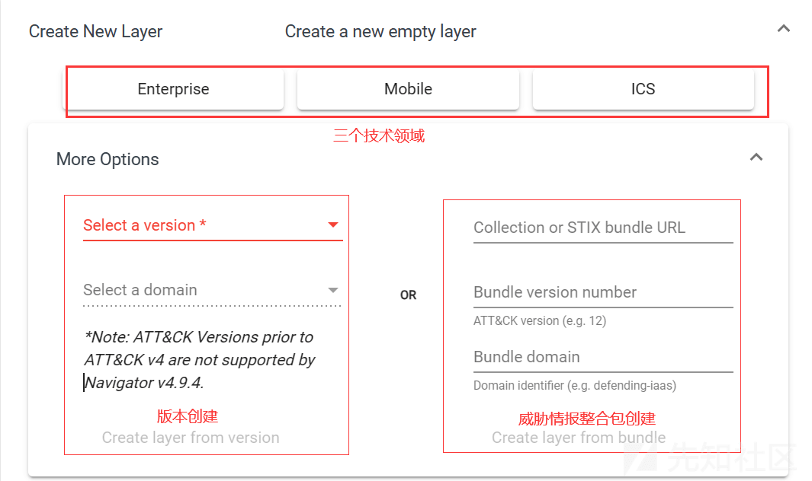
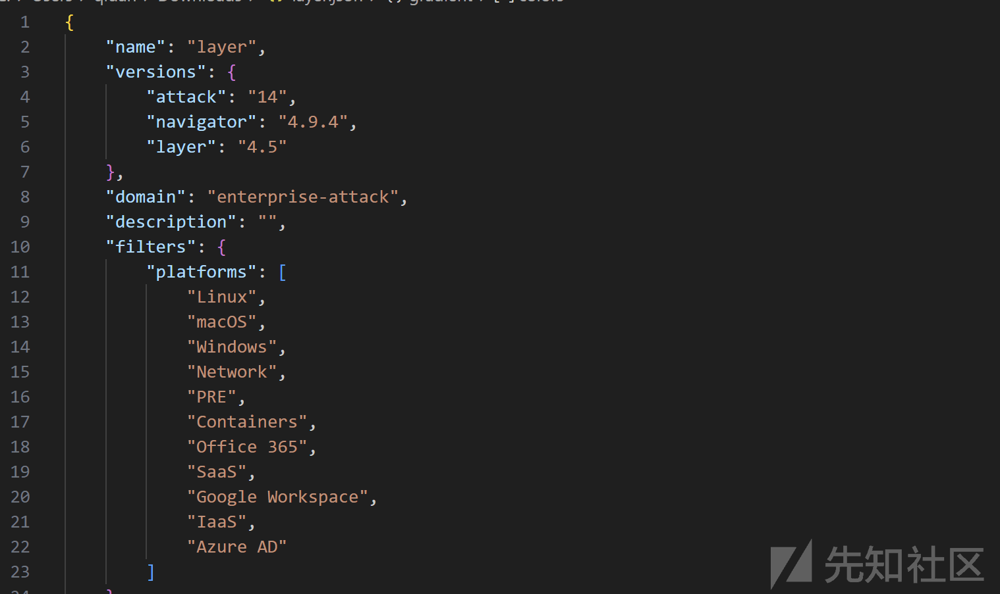
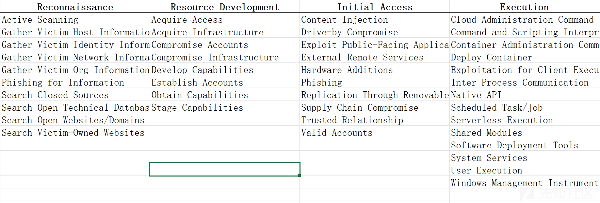
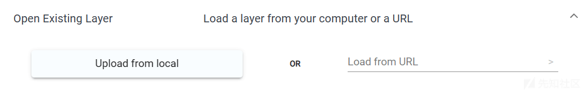
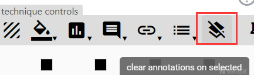
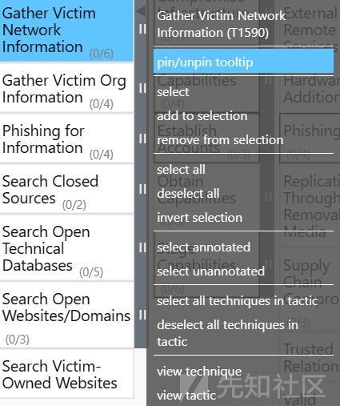

# [ATT&CK 系列 - 工具使用类]使用 Navigator 的所有姿势~（ATT&CK 框架可视化与 DIY） - 先知社区

> **写在最前面：**本篇文章是**ATT&CK 系列后续三个类别**中，关于**工具使用类**的文章。在这个类别中，笔者会介绍与 ATT&CK 框架相关的工具使用。
> 
> 这篇文章中，笔者会系统介绍**Navigator 项目的配置与使用**，该项目的作用是**对 ATT&CK 矩阵进行可视化和 DIY**。利用该项目，可以在本地**更加灵活、深入**的使用 ATT&CK 矩阵。
> 
> **本文的行文结构如下**：
> 
> 1.  **基本介绍与配置使用**。介绍该项目的基本信息以及如何完成项目的配置、运行。
> 2.  **图层介绍**。图层是该项目的基础，可以理解为一个矩阵就是一个图层，该节主要介绍图层的创建和导出。
> 3.  **三大控件介绍**。通过控件对矩阵进行 DIY 操作，包括`图层控件`、`技术控件`和`选择控件`。

# 基本介绍

ATT&CK Navigator 旨在**提供 ATT&CK 矩阵的基本导航和注释**，这些工作可以在 Excel 等工具中做。为了此工作更加简单而通用，官方引入了 Navigator 工具，此工具可以 **可视化防守覆盖范围**、**红/蓝队计划**、**检测到的技术的频率或其他任何事情** 。Navigator 允许操作 ATT&CK 矩阵中的单元格（`颜色编码， 添加注释、分配数值`等）。

`Navigator`的主要功能是**用户能够定义图层** , 例如，仅显示特定平台的技术或突出显示特定对手拥有的技术。图层可以在 Navigator 中以交互方式创建，也可以以编程方式生成，然后通过 Navigator 可视化。

- - -

# 安装与使用

## 本地搭建

> [https://github.com/mitre-attack/attack-navigator?tab=readme-ov-file#Install-and-Run](https://github.com/mitre-attack/attack-navigator?tab=readme-ov-file#Install-and-Run)

1.  先安装 CLI。Angular 是一个应用程序设计框架和开发平台，用于**创建高效且复杂的单页应用程序**。Angular CLI 是一个**命令行界面工具**，用于直接从命令 shell 初始化、开发、搭建基架和维护 Angular 应用程序。
    
2.  导航到 **nav-app** 目录，执行 `npm install`。注：**记得管理员权限。**
    
3.  执行`ng serve` 即可启动开发服务器并实时编译 Angular 应用，默认地址：`localhost:4200`
    
    注：我在执行该指令后报错`Cannot find module 'D:\ATT&CK\attack-navigator-master\nav-app\node_modules\express\node_modules\iconv-lite\lib\index.js'.`，可能是安装时出了问题，可以先删除源目录重新安装，即
    
    ```plain
    rimraf node_modules
    npm install
    ```
    
4.  启动后界面如下，后续学习如何使用。
    

[](https://xzfile.aliyuncs.com/media/upload/picture/20240325012804-dee263c0-ea03-1.png)

## 官网执行

在官网大部分**攻击组织、软件的描述界面**，都会附带该组织的**Navigator 视图**，如下图，可以点击 view 直接进入，也可以通过 download 下载 JSON 文件。

[](https://xzfile.aliyuncs.com/media/upload/picture/20240325012823-ea4382d0-ea03-1.png)

- - -

下面就具体介绍下该工具\\项目的**各个组件及其使用方法**，大家可以跟着介绍自行实践，加深理解。

# 图层

首先介绍的是图层，图层构成了**特定技术领域的战术和技术矩阵视图**。在最近的版本，Navigator 可以操作 `Enterprise`、`Mobile` 或 `ICS` ATT&CK 技术领域知识库。在技术领域中，Navigator 允许筛选以展示对你重要的战术和技术。

可以查看可见**矩阵中任何技术的定义**，方法是`右键单击该技术并选择 弹出菜单中的“查看技术”`。将打开一个新的浏览器选项卡，显示该技术的定义。Navigator 允许浏览给定的 ATT&CK 矩阵并访问技术的定义。

除了过滤操作之外，图层还提供了一种**自定义矩阵视图**的方法。可以为技术着色、隐藏、注释和分配数字分数、链接和元数据等，以帮助**分析威胁和防御这些威胁**。

创建的每个图层都**独立于其他图层**。但是，图层可以以支持分析的方式**进行组合**，也可以**保存在本地**。图层文件保存在易于解析和生成的 **JSON 文件**中，以便 ATT&CK 数据可用于其他应用程序，分析超出 ATT&CK Navigator 能力的数据。

> 注：图层是 Navigator 的核心，后续一切操作都是围绕该部分进行的。后续章节安排如下：
> 
> 1.  先介绍图层未创建前的主界面，这部分主要包括图层创建和保存的相关操作。
> 2.  之后通过三个一级目录分别介绍新图层中的三个控件，即图层控件、技术控件和选择控件。

## 创建新图层

要创建新图层，需要打开一个新选项卡，然后单击“`创建新图层`”下拉列表。快速访问按钮将创建一个图层**替换为 ATT&CK 的当前版本**。与 Navigator 兼容的 ATT&CK 的过去版本可在“更多选项”下拉列表。此界面允许从以下选项之一创建新图层：

-   为新层指定所需的 ATT&CK 版本和域
    
-   为新图层指定自定义集合或 STIX 包的 URL。例如，GitHub 上托管的捆绑包的 URL：。注意：集合或 STIX 捆绑包必须具有 Matrix 对象才能在 Navigator 中显示技术。`https://raw.githubusercontent.com/mitre/cti/master/enterprise-attack/enterprise-attack.json`
    

如下格式：  
[](https://xzfile.aliyuncs.com/media/upload/picture/20240325012905-03663690-ea04-1.png)

### 实际界面

> 主要通过实际的界面进行演示。

[](https://xzfile.aliyuncs.com/media/upload/picture/20240325012942-194a5388-ea04-1.png)

如上图，**新建图层的可配置选项包括**：

首先是第一排的三个按钮，表示新建图层使用的**三个技术领域**，即`企业`、`移动`、`工控`，也是 ATT&CK 适配的三个生态环境。

下面是一些**可配置的其他选项**：`通过版本创建`和`通过整合包创建`两种。

-   通过版本创建：这很好理解，ATT&CK 框架至今有 14 个版本，Navigator 可以选择 v4-v14 版本创建。
-   通过整合包创建：原文是`Collection or STIX bundle URL`，是指指向包含`结构化威胁信息表达（STIX）`数据的一个或一组数据资源的位置，这些资源以 STIX 标准格式编码，便于不同系统间进行自动化的威胁情报共享和处理。
    -   **STIX Collection** ：指一个包含多个 STIX 对象（如威胁行为者、恶意软件样本、漏洞信息等）的集合，这些对象共同构成了一套完整或相关的**威胁情报数据**。一个 STIX Collection 可能会**以 JSON 或 XML 格式**存储，并可以通过一个统一资源定位符（URL）进行访问。
    -   **STIX Bundle** ：STIX 格式中定义的一个实体，它是一个自包含的 **JSON 或 XML 文档**，其中包含了至少一个 STIX 对象（如 Indicator、TTP、Observed Data 等），以及这些对象间的关系。STIX Bundle 是一个逻辑上相关的 STIX 数据单元，它可以作为一个独立的、完整的交换单元在网络上传输或存储。一个 STIX Bundle 的 URL 就是指向该 Bundle 存储位置的链接，通过这个链接可以获取和解析该 Bundle 中包含的所有威胁情报信息。

选择其中一个如 Enterprise 进行创建，得到如下的图层，**主要包括三个部分**：

-   **工具菜单栏**：后续后陆续介绍，主要是控制下述矩阵的工具和一些配置选项
-   **具体矩阵**：对应版本的 ATT&CK 矩阵
-   **右键信息**：对单个技术或者子技术进行操作

这三个部分会在后续一一介绍。

[](https://xzfile.aliyuncs.com/media/upload/picture/20240325013002-2598eba4-ea04-1.png)

## 保存和加载图层

> save and load

可以通过单击`“保存图层”`按钮来保存图层。这将打开一个下拉菜单，可以在其中选择如何保存图层。图层可以导出为 **json**。可以导出**单个图层**，也可以导出**所有打开的图层**。

-   要导出单层，请单击“`将单层下载为 json`”按钮
-   要导出所有打开的图层，请单击“`将所有图层下载为 json`”按钮

选择保存选项后，将打开一个对话框，用于将**图层配置文件**保存到本地计算机。这包含`已自定义的技术的配置` （注释、着色、禁用或分配分数、链接或元数据）以`及评分梯度设置、过滤器选择、 图层名称、图层描述、视图配置`。

可以在 ATT&CK 导航器中**打开保存的图层配置文件**，以恢复之前处理过的一个或多个图层。打开一个新选项卡并打开“**打开现有图层**”面板。然后点击“**从本地上传**”，然后选择保存的配置文件。从自定义集合生成的图层 或 STIX 捆绑包将从创建图层时使用的 URL 恢复。此接口还具有“加载来自 URL“输入，允许从**远程源打开**图层 json。

### 我的补充

> 通过实际操作演示如何保存。

如下图所示，**保存图层的按钮**如下，有三个可选配置：

-   1 是导出为`JSON格式`

[](https://xzfile.aliyuncs.com/media/upload/picture/20240325013030-35f4b820-ea04-1.png)

-   2 是导出为`excel格式`

[](https://xzfile.aliyuncs.com/media/upload/picture/20240325013043-3df0c6f4-ea04-1.png)

-   3 是导出为`SVG格式`

[](https://xzfile.aliyuncs.com/media/upload/picture/20240325013101-48c4c882-ea04-1.png)

-   4 是 only download annorations on visible techniques，即下载**可见技术**。

[](https://xzfile.aliyuncs.com/media/upload/picture/20240325013123-5584e0de-ea04-1.png)

- - -

如何**解读 JSON 格式的图层信息**呢？

如下**信息解读**：

-   `"name"`: 表示该**图层的名称**，这里是 "layer"，但在实际应用中通常会**更具描述性**，比如某个具体的威胁组织、攻击场景或防御措施的名称。
    
    注：可以在**图层控制选项**中的图层信息里添加相应的 name、description、Metadata、Links。
    
    [](https://xzfile.aliyuncs.com/media/upload/picture/20240325013142-61134de6-ea04-1.png)
    

-   `"versions"`: 包含了 ATT&CK 框架版本、Navigator 版本和 Layer 版本，用于说明所依据的框架标准和工具版本。
    
-   `"domain"`: 指定 **ATT&CK 框架的领域**，这里为 "enterprise-attack"，即**企业攻击矩阵**，除此之外还有 "mobile-attack"（移动设备攻击）、ICS 集成电路攻击等。
    
-   `"description"`: 图层的**描述信息**，此处为空字符串，一般可以用来简述该图层的**目的或内容概述**。
    
-   `"filters"`:
    
    -   `"platforms"`: 一个数组，列出了**该图层关注的平台**，涵盖了多种操作系统、云服务和办公应用等。
-   `"sorting"`: 表示**排序方式**，这里的值为 0，可能表示**默认排序或未指定**特殊排序方式。
    
-   `"layout"`: 定义了**布局样式**，如展示方式（"side" 表示侧边栏布局）、是否显示 ID 和名称、聚合分数计算方式等。具体解析：
    
    **注意**：与 layer controls 里最后一个选项对应。
    
    -   `"layout"`:此处的 `"side"` 表示战术和子战术将**在左侧展示**，右侧显示相应战术下的技术列表。还可以设置为 `"matrix"`，在这种布局下，所有战术和技术会以网格状排列展示，每个战术占据一行。
    -   `"aggregateFunction"`:指定了如何计算和显示技术得分的聚合方式。 `"average"` 表示将**同一战术下所有技术的得分平均值**作为该战术的得分。其他可能的选项还包括 `"sum"`（求和）或其他自定义函数。
    -   `"showID"`:如果设为 `true`，将会**显示每个技术或战术的 ID**，此处为 `false`，表示在可视化界面中不显示技术或战术的 ID。
    -   `"showName"`:设置为 `true`，意味着在图层中**显示战术和技术的名称**，反之则不显示。在这个配置中，名称是可见的。
    -   `"showAggregateScores"`:如果设为 `true`，会在战术级别**显示聚合得分**。此处设为 `false`，即不显示战术级别的总得分。
    -   `"countUnscored"`:若设置为 `true`，即使某个技术没有得分也会被计入战术的总体统计数。此处为 `false`，意味着只有已得分的技术才会被纳入统计。
    -   `"expandedSubtechniques"`:控制子技术（subtechniques）的展开状态。`"none"` 表示初始时不展开任何子技术。其他可能的选项包括 `"all"`（全部展开）或子技术的具体 ID 列表（表示只展开这些 ID 对应的子技术）。
-   `"hideDisabled"`: 是否**隐藏禁用的（disabled）技术**，默认为 false，表示不隐藏。
    
-   `"techniques"`: 一个空数组，这里并未列出具体的技术，实际上这部分应当包含**一系列战术和技术对象及其相关信息**。
    
-   `"gradient"`: 定义了**颜色渐变**，用于表示评分等级，包含了一系列颜色值和最小/最大评分阈值。
    
-   `"legendItems"`、`"metadata"`、`"links"`: 这些均为空数组，若填充内容则分别表示**图例项**、**元数据信息**和**链接信息**。
    
-   下面的一些属性如 `"showTacticRowBackground"`、`"tacticRowBackground"` 等，是对**战术行背景显示**的设置，以及**选择技术的策略相关选项**。
    

```plain
{
    "name": "layer",
    "versions": {
        "attack": "14",
        "navigator": "4.9.4",
        "layer": "4.5"
    },
    "domain": "enterprise-attack",
    "description": "",
    "filters": {
        "platforms": [
            "Linux",
            "macOS",
            "Windows",
            "Network",
            "PRE",
            "Containers",
            "Office 365",
            "SaaS",
            "Google Workspace",
            "IaaS",
            "Azure AD"
        ]
    },
    "sorting": 0,
    "layout": {
        "layout": "side",
        "aggregateFunction": "average",
        "showID": false,
        "showName": true,
        "showAggregateScores": false,
        "countUnscored": false,
        "expandedSubtechniques": "none"
    },
    "hideDisabled": false,
    "techniques": [],
    "gradient": {
        "colors": [
            "#ff6666ff",
            "#ffe766ff",
            "#8ec843ff"
        ],
        "minValue": 0,
        "maxValue": 100
    },
    "legendItems": [],
    "metadata": [],
    "links": [],
    "showTacticRowBackground": false,
    "tacticRowBackground": "#dddddd",
    "selectTechniquesAcrossTactics": true,
    "selectSubtechniquesWithParent": false,
    "selectVisibleTechniques": false
}
```

**通俗理解**：该 JSON 文件保持了原始矩阵的**数据和格式信息**，主要是矩阵上方**菜单栏的操作和配置**，所以通过该 JSON 文件可以准确保存和还原特定的图层。

- - -

在起始窗口，可以通过`Open Existing Layer`**加载已有的图层**，如下图，可以选择`上文导出的JSON`，也可以给出相关的`远程资源链接`。

[](https://xzfile.aliyuncs.com/media/upload/picture/20240325013216-75344032-ea04-1.png)

## 图层升级

图层升级界面允许用户将在**先前版本**的 ATT&CK 上创建的 ATT&CK Navigator 图层升级到数据集的**当前版本**。通过此界面，用户可以逐步完成技术数据集中的每个更改：

-   用户可以查看自创建图层以来已添加到数据集中的技术，并根据需要对其进行注记。
-   用户可以查看他们之前注释的技术是否已更改，并相应地调整注释。
-   用户可以确定是否有任何带注释的技术已被删除或被新技术取代，在后一种情况下，可以复制 替换技术的注释。
-   用户还可以验证自创建图层以来未更改的技术。

**映射注释：**

对于自创建图层以来已更改的注记技术，可能需要将注记集更新为帐户 用于更改范围或内容。界面中的每种技术都列出了其以前和当前的状态，并提供了指向该技术两个版本的 [ATT&CK 网站](https://attack.mitre.org/)的链接，以便于查看。在技术的步骤中，你 之前已添加注释，可以启用“仅显示注释技术”过滤器，以仅查看具有注释的技术。

可以将注释从该技术的先前版本复制到当前版本，并在必要时进行调整。有 从先前版本复制批注的两种方法：

-   对于在两个版本之间一对一映射的策略的技术，可以通过单击“>”来复制注释 战术旁边的按钮。这会将策略上的任何现有注释复制到相同策略下的技术中 当前版本。
-   对于在两个版本之间更改的策略的技术，可以通过拖放 从先前版本到当前版本中的策略的注释策略。

技术可以在其各自的面板下标记为已审核，以直观地表明它们已审核。“审查 技术列表下方显示的“X/Y 技术”可用于确定是否遗漏了任何技术。分子反映 标记为“已审核”的技术数量，分母表示根据 添加到的配置（例如，如果启用了“仅显示带注释的技术”筛选器，则仅显示技术的数量 带注释的计入此总数）。

可以在工作流结束时查看和验证图层升级的状态，以确保已创建或调整所有注记 如愿以偿。每个部分名称旁边都会显示一个状态，以指示在该部分中查看的技术数量，如果跳过了该部分，或者该部分中没有要查看的技术。完成图层升级后，可以 可以单击“完成”按钮关闭侧边栏。

**注意：**侧边栏关闭后，将无法返回图层升级界面。

## 从其他图层创建

可以创建**从其他图层继承属性的图层**。存在多个字段，可用于选择要从中继承属性的图层：

-   **属性域 Domain：**选择新图层的**属性域和版本**。图层只能继承**具有相同的域和版本**的其他图层。
    
-   **Score Expression：**创建的层中的**技术分数**初始化为。此字段应**采用方程或常量的形式**。打开“从其他图层创建图层”面板时，图层变量在选项卡上以黄色显示：
    
    [](https://xzfile.aliyuncs.com/media/upload/picture/20240325013419-beb61352-ea04-1.png)
    

每种技术的分数都是**使用分数表达式独立创建**的。例如，使用分数表达式 `a+b` ，输出层中的一些技术 *t* 将是 *ta* 和 *t b* 的总和。

-   **渐变 Gradient：**选择要从哪个图层继承该选项。
    
-   **着色 Coloring：**选择要继承**颜色配置选项**。
    
-   **注释 Comments：**选择要从哪个层继承技术**注释选项**。
    
-   **链接 Link：**选择要从哪个图层继承**已分配的链接。**
    
-   **元数据 Matedata：**选择要从中继承**技术元数据**的图层。
    
-   **状态 States：**选择要从哪个层继承技术**启用/禁用状态**。
    
-   **过滤器 Filters：**选择要从哪个图层继承**图层过滤器配置**。
    
-   **图例 Legend：**选择要从哪个图层继承图例项目。
    

### 实际界面

> 从实际操作演示

其实该操作与直接加载 JSON 图层是类似的，都是**根据已有的图层配置信息**如颜色、排序、图层信息、样式等来**还原矩阵**，只是前者是通过**已有的图层**后者是通过**JSON 文字信息**。

如下图，是实际创建窗口，**左上角已经创建的图层会被标识以便引用**，之后再下面选择相应的配置信息：

[](https://xzfile.aliyuncs.com/media/upload/picture/20240325013538-edc4d692-ea04-1.png)

## 自定义创建 Nagivator

新标签页上存在一个面板，如下图，用于构建格式正确的 ATT&CK 导航器。在打开时，它将创建**具有所需自定义项**的 ATT&CK Navigator 实例。此功能可能可用于**共享或嵌入 ATT&CK 导航器**。

[](https://xzfile.aliyuncs.com/media/upload/picture/20240325013519-e2b4a8ea-ea04-1.png)

### 默认图层

单击“`add a layer link`”按钮，然后输入指向 Web 上托管图层的**默认图层 URL**。这将使自定义的 ATT&CK Nagivation 初始化，并默认打开此图层。在**嵌入或共享特定图层**时特别有用。

可以单击“`add another layer link`”按钮来指定**其他默认图层**，或单击旁边的`“x”按钮`**移除**该图层的图层链接。

### 控件设置

前面介绍了每一个图层可使用的控件，包括选择、图层和技术控件，在该设置里可以选择**是否禁用某些控件**。

# 图层控件

下面介绍**图层控件的使用**，即`layer controls`，也就是下图**框中的 10 个按钮**：

[](https://xzfile.aliyuncs.com/media/upload/picture/20240325013716-2841d6ee-ea05-1.png)

通过这些控件可以**对视图的格式、颜色、信息等**做一系列操作。

## 图层信息

第一个要介绍的是**图层信息按钮**，即`layer information`，如下图：

[](https://xzfile.aliyuncs.com/media/upload/picture/20240325013731-314f336c-ea05-1.png)

-   `图层名称`显示在**选项卡标题**中。
    
-   `元数据`可用于支持使用图层格式的其他应用程序，或附加其他应用程序图层的**描述性字段**。
    
-   `链接`可用于提供来自**其他相关网站**的其他上下文到图层。

## 排序模式

下面介绍的是**排序按钮**，即`sorting`，也就是下图：

[](https://xzfile.aliyuncs.com/media/upload/picture/20240325013749-3b9f1472-ea05-1.png)

有**四种排序模式**。**单击排序按钮**将在模式之间切换：

-   `A-Z`：该表将按**名称的字母顺序升序**对技术进行排序。
-   `Z-A`：该表将按**名称的字母顺序降序**对技术进行排序。
-   `1-2`：**分数按升序**排列。没有分数的技术被视为其分数为 0。
-   `2-1`：**分数按降序**排列。没有分数的技术被视为其分数为 0。

## 过滤选项

下面要介绍的是**过滤器按钮**，即`Filtering`，下图所示：

[](https://xzfile.aliyuncs.com/media/upload/picture/20240325013805-45639ff0-ea05-1.png)

在创建图层时选择了技术领域如企业、移动等，这些领域有很多不同的平台，如`系统、服务、应用`等**都可以作为攻击目标**，所以在过滤器这里进行选择。

不同的领域**关联的平台不同**，如：

-   **Enterprise**：`PRE, Windows, Linux, macOS, Network, AWS, GCP, Azure, Azure AD, Office 365, and SaaS`
    -   **PRE**:这通常指 PRE-ATT&CK 框架，它关注的是在**进入网络环境之前的攻击阶段**，主要包括攻击者针对人员和社会工程学的活动，以及针对供应链和物理环境的攻击。
    -   **Windows**:Microsoft Windows 操作系统，广泛应用于个人电脑、工作站和服务器，是攻击者常见目标之一。
    -   **Linux**:类 Unix 操作系统，广泛应用在服务器、嵌入式系统和超级计算机等领域。
    -   **macOS**:Apple Inc. 开发的操作系统，主要用于 Macintosh 系列个人电脑。
    -   **Network**:**网络层面**，包括但不限于路由器、交换机、防火墙等网络设备，以及互联网协议和网络服务。
    -   **AWS (Amazon Web Services)**:亚马逊提供的**云端运算服务**，包括基础设施即服务（IaaS）、平台即服务（PaaS）和软件即服务（SaaS）产品，用于托管和管理应用程序和数据。
    -   **GCP (Google Cloud Platform)**:谷歌的**云计算服务平台**，提供类似 AWS 的云服务，包括计算、存储、数据库、网络和数据分析等服务。
    -   **Azure**:微软的**云计算平台**，同样包括了 IaaS、PaaS 和 SaaS 解决方案，为企业和个人开发者提供广泛的云服务。
    -   **Azure AD (Azure Active Directory)**:微软的**云身份管理服务**，提供身份验证、授权、目录服务等功能，常用于企业级的单点登录、用户管理和权限控制。
    -   **Office 365**:微软的**办公软件订阅服务**，包括 Outlook、Word、Excel、PowerPoint 等应用程序，以及电子邮件、协作和通讯服务，攻击者可能针对其中的服务或用户账户发起攻击。
    -   **SaaS (Software as a Service)**:**软件即服务**，一种云服务模式，应用程序在云端运行并由提供商管理，用户通过网络访问。例如 Salesforce、Zoom、Slack 等，攻击者可能试图渗透这类服务或利用其漏洞实施攻击。
-   **mobile**： `Android and iOS`
-   **ICS**：`Windows, Control Server, Data Historian`
    -   Data Historian：是 ICS 中的核心组件之一，用于收集、存储和管理来自控制系统（如 PLC、RTU）的大量实时过程数据
    -   Control Server：在 ICS 中扮演着中心控制节点的角色，负责接收现场设备发送的实时数据、处理控制逻辑、发出控制指令并协调整个系统的运行

## 颜色配置

下一个要介绍的是**颜色配置按钮**，即`Color Setup`，如下图：

[](https://xzfile.aliyuncs.com/media/upload/picture/20240325013824-50e0cc90-ea05-1.png)

### 战术背景颜色配置

战术行的背景颜色可以在颜色设置菜单的**战术行背景部分**进行设置。这 仅当选中“Show”复选框时，才会显示颜色。在**迷你视图**中不会显示战术行背景。

如下图，选择不同的颜色，改变战术也就是**第一行的背景颜色**：

[](https://xzfile.aliyuncs.com/media/upload/picture/20240325013841-5af7d12e-ea05-1.png)

### 评分梯度颜色设置

即`Scoring Gradient`，根据**分数的不同给各个技术设置不同的颜色**。预设下拉列表中存在多个预设渐变，如果想要的渐变匹配，通过使用界面添加和删除颜色来创建自己的颜色，如下图：

[](https://xzfile.aliyuncs.com/media/upload/picture/20240325013857-6466e146-ea05-1.png)

**注意**：如果分数是**二进制**（0 或 1），请将 0 的低值设置为透明，将 1 的高值设置为其他颜色，即可**仅对值为 1 的技术进行着色**。

## 隐藏禁用的技术

下一个要介绍的是**隐藏已禁用技术**按钮，即`Hiding Disabled Techniques`，如下图：

[](https://xzfile.aliyuncs.com/media/upload/picture/20240325013915-6ee9ccc8-ea05-1.png)

可以通过切换“隐藏已禁用”来**隐藏已禁用的技术** 技术“按钮。隐藏技术在保存时仍存在于数据中，并且仍然可以进行注释，但**不会在视图中可见**。

**提示：**此按钮与[多选界面](http://localhost:4200/#search-amp-multiselect-interface)具有强大的协同作用。使用多选界面选择符合条件的技术，禁用它们，然后打开隐藏禁用的技术以删除整个组。

## 显示 | 隐藏 子技术

下面介绍的是**显示\\隐藏子技术**按钮，即`Showing or Hiding Sub-techniques`，如下图：

[](https://xzfile.aliyuncs.com/media/upload/picture/20240325013935-7ac93d44-ea05-1.png)

很好理解，通过该选项控制矩阵中每个技术的**子技术是否显示**，默认情况下处于隐藏状态。

**有三个可选按钮**：

-   第一个：展示子技术
-   第二个：全部带注释
-   第三个：隐藏子技术

## 布局配置

下面介绍的是**布局配置**，即`layout`，如下图：

!\[布局配置 ([https://xzfile.aliyuncs.com/media/upload/picture/20240325013950-8428a69a-ea05-1.png](https://xzfile.aliyuncs.com/media/upload/picture/20240325013950-8428a69a-ea05-1.png))

### Side 样式

**侧面布局**有一个**位于右侧的侧边栏**，可以单击该侧边栏以**在右边显示子技术**。子技术是在战术栏中按位置与技术区分开来。如下图：

[](https://xzfile.aliyuncs.com/media/upload/picture/20240325014001-8acc53d4-ea05-1.png)

### Flat 样式

**平面布局**存在左侧定位的侧边栏，可以单击该侧边栏以**在下方显示子技术**。如下图：

[](https://xzfile.aliyuncs.com/media/upload/picture/20240325014018-94ef6220-ea05-1.png)

### Mini 样式

迷你布局旨在通过减小尺寸**在屏幕上容纳更多技术**。这个模式下**文本被删除**，**技术**在策略下被**可视化为正方形**。选择此布局将禁用`“show IDs”和“show Names”控件`。

**战术标头显示为黑色**，技术及其子技术被分组在一个轮廓框内。

**技术是暗框框组的第一个单元格**，组的其余单元格是子技术。没有子技术的技术显示时不带分组框，并且可能与其他子技术（无子技术）内联显示 技术。**禁用的技术**用“x”符号表示。**带有注释的技术**用“i”符号表示。

[](https://xzfile.aliyuncs.com/media/upload/picture/20240325014041-a24b93b2-ea05-1.png)

### 标签 Labels

在**侧面和平面布局**中，可以更改技术单元格**内部显示的内容**。启用`“Show Name”`(默认启用) 将在矩阵的每个单元格上**显示技术和战术名称**。启用`“show IDs”`（默认禁用）将在矩阵的每个单元格上**显示 ATT&CK ID（例如“T1000”表示技术，或“TA1000”表示战术）**。

### 分数聚合设置

> 即`格式配置`下的`aggregats scores`选项

总分将结合**一项技术及其所有子技术的分数**，并可以使用以下公式计算 `平均值`、`最大值`、`最小值`或`总和函数`。它们仅根据具有子技术的技术进行计算。有如下两个选项：

-   显示或隐藏总分：`show aggregats`
    
    将鼠标悬停在技术上时，视图中的**总分数会显示在工具提示中**，默认情况下处于**隐藏状态**。
    
-   计算未计分技术：`count unsocred techniques as 0`
    
    默认情况下，未评分的技术不包括在总分计算中。 `“count unsocred techniques as 0”`将使未计分的技术计算总分。
    

**选择聚合函数**

有 4 个可用函数可用于计算总分：平均值、最小值、最大值和总和。

-   average：技术分数的平均值
-   min：将采用一项技术及其所有子技术的**最低分数**。
-   max：将取一项技术及其所有子技术的**最大分数**。
-   sum：将**加和**一项技术及其所有子技术的分数。

## 图例设置

下面要介绍的是**图例控件**，即`Legend Bar`，如下图：

[](https://xzfile.aliyuncs.com/media/upload/picture/20240325014103-af6dee46-ea05-1.png)

图例有助于 ATT&CK Nagivation 中**自定义技术的颜色和含义**相关联。要打开图例，单击屏幕右下角标有`“Legend”`的栏。要向图例添加项目，请单击`“add”`按钮。要清除图例中的所有项目，请单击`“clear”`。

-   可以通过**单击颜色字段**并键入十六进制颜色值来**更改项目的颜色**。
-   单击并在文本字段中键入以**更改项目的标签**。

图例项目将保存到图层文件中，并在加载图层时也会被加载。

- - -

图例帮助用户理解可视化界面中不同部分的含义，比如**不同的战术类别**（例如侦察、初始访问、执行等）可能通过**不同的颜色或图案来标识**，而具体的技术或子技术则可能有特定的形状或填充样式。通过查看图例，分析师能够**迅速解读**出组织针对某一战术领域防御能力的覆盖情况，或者识别出威胁行为者可能使用的特定攻击路径。

因此，在使用 MITRE ATT&CK Navigator 来分析对手行为模式、评估安全态势或规划防御策略时，图例（Legend）是非常关键的一个组成部分，它有助于使用者**准确理解和解析展示的信息**。

# 技术控件

下面介绍的是**技术控制部分**，即`technique controls`，如下图的部分：

[](https://xzfile.aliyuncs.com/media/upload/picture/20240325014123-bb6ee36c-ea05-1.png)

这部分按钮可以**对图层中的技术进行注解**。如果选择了多种技术，它们都将**同时被注释**。

**注**：该部分控件只有**选中一个或多个技术时**才可以使用，否则是灰色不可用状态。

## 技术的禁用

第一个介绍的功能是**禁用技术**，即 `Disabling Techniques`，如下图：

[](https://xzfile.aliyuncs.com/media/upload/picture/20240325014141-c5e94724-ea05-1.png)

单击“”按钮可在**启用和禁用状态**之间切换所选技术。在禁用 状态时，技术文本**将灰显**，并且不会显示任何颜色（[手动分配](http://localhost:4200/#assigning-manual-colors)或通过[分数](http://localhost:4200/#scoring-techniques)分配）。

`“隐藏禁用的技术”`(**图层控件**) 按钮可从视图**隐藏已禁用的技术**。如下图，禁用后会变成灰色。

[](https://xzfile.aliyuncs.com/media/upload/picture/20240325014158-d0199df2-ea05-1.png)

## 颜色设置

可以**手动为技术分配颜色**。手动分配的颜色**取代了按分数创建的颜色**。要删除手动分配颜色，选择界面顶部的“`no color`”框。

[](https://xzfile.aliyuncs.com/media/upload/picture/20240325014221-de311ac8-ea05-1.png)

## 分数设置

下面介绍的功能是**分数设置**，即`Scoring`，位置如下图：

[](https://xzfile.aliyuncs.com/media/upload/picture/20240325014237-e7a81e94-ea05-1.png)

分数是分配给技术的数值。分数的含义或解释**完全取决于用户**，导航器只是根据分配的任何分数来**可视化矩阵**。分数的一些可能用途包括：

-   根据是否**观察到**给定的对手组使用该技术为技术分配分数。
-   根据组织**检测、预防或缓解的**技术。
-   为红队在演习中**成功采用的那些技术**分配分数。

默认情况下，技术是“`未评分`”的，这意味着没有为该技术分配任何分数。注意，`“unscored”`和 `零分`是不一样的，特别是在自动分配的颜色方面。要将具有数字分数的技术更改为未计分，请选择 技术，然后删除分数控件中的分数值。该技术将恢复为未评分。

技术会根据其分数**自动分配颜色**。这种颜色是根据前`图层控件中的颜色配置按钮`配置的。而`技术控件中的颜色分配`将**取代分数生成的颜色**。

如下图，我们为**某些技术设置分数**：会根据配置信息为**不同分数的技术定色**，同时鼠标放在相关技术上也会**显示分数**。

[](https://xzfile.aliyuncs.com/media/upload/picture/20240325014252-f0847f26-ea05-1.png)

## 注释配置

下面要介绍的是**注释配置**，即`comment`，位置如下图：

[](https://xzfile.aliyuncs.com/media/upload/picture/20240325014308-fa0148cc-ea05-1.png)

通过上图的按钮可以将**文本注释添加到技术**中。带有注释的技术将**带有黄色下划线**。

**注：**如果技术添加了 Metadata 或者导入数据源带有信息，也会有黄色下划线。

如下图，为**某个技术添加注释**，可以在矩阵中看到：

[](https://xzfile.aliyuncs.com/media/upload/picture/20240325014325-03d678f4-ea06-1.png)

## 链接设置

下面要介绍的是**链接设置**，即`Link`，位置如下图：

[](https://xzfile.aliyuncs.com/media/upload/picture/20240325014342-0e269564-ea06-1.png)

通过为每个链接指定`标签`和 `URL`，可以将**链接分配给技术**。URL 必须**以协议标识符为前缀** （例如“[https://”）。](https://xn--)-qhn./)

点击“`add link`”可以添加多个链接，它们**显示在上下文菜单中**（通过右键单击技术访问），并将打开一个新的浏览器选项卡。具有指定链接的技术将带有**蓝色下划线**。

如下图，为**某技术添加链接**，可以看到该技术标注**蓝色下划线**并且在**右键菜单**可以访问链接：

[](https://xzfile.aliyuncs.com/media/upload/picture/20240325014409-1e7b5332-ea06-1.png)

## 元数据设置

下面要介绍的是**元数据设置**，即`Metadata`，位置如下图：

[](https://xzfile.aliyuncs.com/media/upload/picture/20240325014425-279f8d16-ea06-1.png)

可以通过指定元数据`名称`和`值`来**添加技术元数据**，并显示在技术提示中。元数据用于**向技术添加补充描述性字段和信息**。带有元数据的技术将带有**黄色下划线**。

如下图，为某技术**设置元数据**，可以在**显示栏**看到该数据，并且与注释一样标识为**黄色下划线**：

[](https://xzfile.aliyuncs.com/media/upload/picture/20240325014438-2fc79128-ea06-1.png)

## 清除配置内容

下面要介绍的是**清除设置**，即`clear`，位置如下图：

[](https://xzfile.aliyuncs.com/media/upload/picture/20240325014455-39e36790-ea06-1.png)

单击该按钮可从**所有选定的技术**中`删除注释、链接、元数据、颜色、分数和启用/禁用状态` 。这个很好理解，即前面所有的技术配置全部取消。

# 选择控件

下面介绍的是**选择控件部分**，即`selection controls`，如下图的部分：

[](https://xzfile.aliyuncs.com/media/upload/picture/20240325014509-42342966-ea06-1.png)

为了进行技术控件的相关操作，必须首先**选择技术**，有多种方法可以选择技术，在该控件部分配置。

## 通过鼠标选择

首先介绍的是**通过鼠标选择**，有如下操作方式：

-   `左键单击`技术以将其**选中**。
    
-   按 `control （windows）` 命令（mac）或 `Shift（两者兼而有之）`可以**多选**。
    
-   `右键单击`技术将弹出一个包含更多选项的**上下文菜单**。  
    [](https://xzfile.aliyuncs.com/media/upload/picture/20240325014524-4af05188-ea06-1.png)
    

上述操作很简单，下面主要介绍下**右键菜单的具体内容**：

-   `select`：**只选择**该技术
-   `add to selection`：将此技术**添加到选择组**中
-   `remove from selection`：将此技术从**选择组中移除**
-   `select all`：选择**所有的技术**
-   `deselect all`：**取消**选择**所有技术**。此操作也可以通过`” 取消选择“` 按钮实现。
-   `invert selection`：选择**当前未选中**的所有技术，并取消选择所有已选择的技术
-   `select annotated`：选择所有**具有注释**的技术和子技术
-   `select unannotated`：选择所有**没有注释**的技术和子技术
-   `select all techniques in tactic`：选择此**策略中**的所有技术
-   `deselect all techniques in tactic`：**取消**选择此**策略中**的所有技术
-   `view technique`：有关该技术的更多信息/详细信息**（官网）**
-   `view tactic`：有关该策略的更多信息/详细信息。**（官网）**
-   `user assigned links`:用户分配给该技术的**链接列表**

**如何创建一个只有注释的技术列表：**

使用“`select unannotated`”，然后**禁用 (Disabling Techniques) 这些技术**，然后**隐藏禁用技术 (Hiding Disabled Techniques)**，以创建一个只有注释技术可见的图层。

## 通过行为选择

下面介绍的配置选项是**行为选择**，即`selection behavior`，如下图位置：

[](https://xzfile.aliyuncs.com/media/upload/picture/20240325014548-59706086-ea06-1.png)

行为控制会影响**如何选择与战术和子技术相关的子技术**，有**三个选项**可以选择：

-   `Select techniques across tactics`：是否**跨战术选择技术**。（某些技术可能会在多个战术中使用）
-   `Select sub-techniques with parent`：子技术是否**与其父项一起选择**，默认禁用即子技术的选择独立于父技术和兄弟技术。
-   `select only visible techniques`：是否仅**选择可见技术**（比如如果过滤给平台，很多技术被隐藏了）

## 搜索与多选

下面介绍**搜索与多选设置**，利用好这个选项很重要，可以快速定位，页面如下：

[](https://xzfile.aliyuncs.com/media/upload/picture/20240325014612-67ed5a60-ea06-1.png)

`搜索和多选界面`提供了**在矩阵中选择或取消选择与文本匹配的技术的方法** ，文本输入可用于筛选`技术`、`威胁组`、`软件`和根据其数据的`缓解措施`。

可以选择对象的字段 在“**搜索设置**”下搜索：`名称`*、*`ATT&CK ID`、`描述`和`数据源`。

搜索下方的**对象列表**可用于选择矩阵中的数据，有如下几个选择（`企业领域`）：

-   **技术 Techniques：**此列表可用于查找`按字母顺序`排列的**所有 625 个技术**或与**搜索查询匹配**的技术。
-   **威胁组织 Threat Groups：**选择相关的 141 个**威胁组织采用的所有技术**
-   **软件：**包括`恶意软件`（用于恶意目的的自定义闭源或开源软件）或`工具`，一共 648 个。会选中**该软件使用的所有技术**。
-   **缓解措施 Mitigations：**缓解措施表示可用于**防止技术或子技术被成功执行**的方法。会选中某**缓解措施对应的所有技术**。
-   **活动 Campaigns** ：在特定时期内以共同的目标和目标进行的任何入侵活动集合，只有 23 个。[参考链接](https://attack.mitre.org/campaigns/)
-   **数据源 Data Sources** ：选择某数据源涉及的所有技术，大概 109 个。[参考链接](https://attack.mitre.org/datasources)：数据源表示传感器/日志可以收集的各种信息。数据源还包括数据组件，这些组件标识与检测给定 ATT&CK 技术或子技术相关的数据源的特定属性/值。
-   **资产 Assets**：某**资产对应的技术**，一般只有 ICS 包含。[参考链接](https://attack.mitre.org/assets/)：资产表示**工业控制系统**环境中常见的**设备和系统**。每个资产对象都包含技术关系的映射，这些关系表示可能基于设备的功能和以设备为目标的对手操作。资产表示设备，其中包括硬件、软件、体系结构和预期功能的考虑因素。

通过这些按钮修改当前选定的技术，而**不是取代**。提供了标有`“全选”`和`“取消全选”`的按钮，用于快速选择/取消选择结果中的所有技术。可以**与搜索输入结合使用**，以选择与给定查询匹配的所有结果。

# 总结

本文系统介绍了 Navigator 项目的配置与使用，笔者认为这篇文章是足够详细的，每一个按钮、组件都通过图片和文字详细解析，通过这篇文章，有需要的朋友应该可以完成入门，后续根据自己的需求应用即可。

> **写在最后**：关于 ATT&CK Nagivator 的学习先到这里，但是关于 ATT&CK 的学习才刚刚开始。后续会继续使用该工具完成相关工作，同时分享更多好用的工具。共勉！