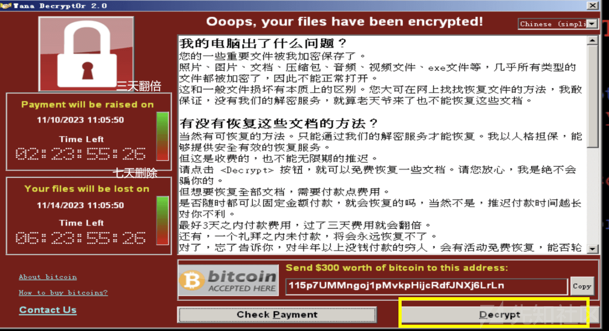

# [ATT&CK 系列 - 应用实践类]通过 ATT&CK 框架完成恶意样本行为映射与 WannaCry 勒索病毒实践 - 先知社区

\[ATT&CK 系列 - 应用实践类\]通过 ATT&CK 框架完成恶意样本行为映射与 WannaCry 勒索病毒实践

- - -

> **写在最前面：**本篇文章是**ATT&CK 系列后续三个类别**中，关于**应用实践类**的文章。在这个类别中，笔者会利用 ATT&CK 威胁框架进行一些应用实践。
> 
> 在这篇文章中，笔者会介绍如何使用 ATT&CK 框架对**恶意样本**进行**行为映射**，简单来说就是**将**自己分析得到或者其他报告中涉及的**恶意行为**映射到 ATT&CK 的**具体战术和技术**上，进而使得分析报告更加规范，通用性更强。
> 
> **本文行文结构如下：**
> 
> 1.  首先是**方法论介绍**，主要介绍笔者在使用 ATT&CK 进行行为映射的**经验**与在分析报告中的**布局**。
> 2.  之后是**实例演示**，使用 ATT&CK 对**WannaCry**这个经典的勒索病毒进行行为映射
> 
> **还有一句话：**
> 
> ATT&CK 这个框架在国内的使用很普遍，很多甲方公司使用该框架做安全运营和维护，乙方安全公司使用这个框架做攻防模拟、沙箱产品赋能等。所以笔者认为**学习该框架的基本知识、同时有针对性的扩展应用到工作领域**，对于个人的提高是有帮助的。（恶意代码分析人员、APT 追踪人员、安服与甲方对接、甲方安全运维等等）

# 简述 MITRE ATT&CK 框架映射

在本系列的第一篇文章中（`一文说清楚MITRE ATT&CK威胁框架`），笔者对该框架的基础内容进行了介绍，并在其中提到了该框架**可能的应用场景**，如`威胁情报、攻击模拟`等。

本文就来介绍下 ATT&CK 的其中一个应用场景：**恶意行为与 ATT&CK 技术的映射**。因为笔者的兴趣方向之一是**恶意代码分析**，在分析完样本后就要总结分析结果、形成分析报告。而 ATT&CK 框架映射便可以将笔者分析的**样本恶意行为关联到已知的技术矩阵**中，从而使得最终的分析结果更加规范和全面。

下面就介绍下如何完成上述工作。

## 前提条件

要实现样本恶意行为与 ATT&CK 框架的准确映射，进而借助 ATT&CK 框架**规范分析结果、完备处置措施**，需要有两个前提条件：`足够详细的样本分析结果`和`足够深入的ATT&CK各战术技术学习`。

先来说说前者，使用 ATT&CK 框架进行行为映射对于整个样本分析来说**只是锦上添花**，所以在具体实施前要保证对该恶意样本**有较为详细的分析结果**，`先要有锦才能谈花`。关于样本分析的规范步骤与方法这里不再赘述，后续有可能的话会开这个坑。

再来说说后者，想要将分析得到的样本恶意行为**准确映射**到 ATT&CK 框架的战术、技术上，需要分析人员对 ATT&CK 框架本身**有较为深入的理解**，例如各个战术的目标，每个战术下各个技术的原理、实现方法、与其他技术的区别等。关于这部分内容，笔者会在`[ATT&CK系列]学习理解类`中详细介绍，感兴趣的师傅可以参考下。

## 具体实施

当有了上文的两个前提后，下面便介绍下如何丝滑完成行为到技术的映射。先来说一些**方法论的东西**，在下一节会通过实例说明具体怎么做。

首先，**学会使用矩阵可视化工具**如 Navigator 进行**行为标注与 DIY**。该项目可以通过一系列控件对 ATT&CK 矩阵进行自定义修改，最终得到契合分析样本的矩阵界面。关于该项目的详细使用可以参考笔者文章`[ATT&CK系列-工具使用类]使用Navigator工具的各种姿势~（ATT&CK威胁矩阵可视化与DIY）`（如果过审的话）

其次，**明确组织架构**，即按照什么样的行文次序将映射结果放到报告里。这里给出笔者的布局，从上到下依次是`Navigator得到的自定义矩阵`、`对所涉及战术、技术的表格汇总`、`对上述内容的具体文字表述`。

最后，**给出一些注意事项**：

-   在给出 Navigator 矩阵时，可以**隐藏未使用的技术**。（通过反选 - 禁用 - 隐藏实现）
-   在进行表格汇总时，可以**附加上链接**，同时尽可能带上**缓解措施、检测方法**。
-   在进行行为文字表述时，要**给出详细的上下文信息**，即通过样本的哪些行为判断样本使用了该技术，这其中要尽可能添加操作细节。
-   可能分析得到的恶意行为很多，要有意识的**在分析过程中**对这些行为进行分类，按照 ATT&CK 的战术对其进行初步的归属判断，这样在最后总结处置时就能**更加准确、省时省力。**
-   在分析时，除了要理清干了什么、还要理清是**如何实现的**，这些实现方法就可以映射到相关的技术上。

# WannaCry 分析与映射结果

下文主要结合笔者之前对 WannaCry 的万字分析与 ATT&CK Enterprise 框架，对该勒索软件的恶意行为进行映射。采用前文简述的三布局方法。

## Navigator 矩阵

> 官方已经给出了 WannaCary 勒索软件的相关矩阵，其[JSON](https://attack.mitre.org/software/S0366/S0366-enterprise-layer.json "JSON")可以直接导入到 Navigator 项目中，也可以通过[如下网址](https://mitre-attack.github.io/attack-navigator//#layerURL=https%3A%2F%2Fattack.mitre.org%2Fsoftware%2FS0366%2FS0366-enterprise-layer.json)在线查看。

先给出**官方的矩阵**，如下图：

[](https://xzfile.aliyuncs.com/media/upload/picture/20240325010132-2a3822be-ea00-1.png)

不过官方的矩阵只是对样本行为进行**简单标注**，并没有很具体的**中文注释**，也没有对各技术打分。所以下面给出笔者分析后修改的矩阵，**JSON 文件放在附件了**。

[](https://xzfile.aliyuncs.com/media/upload/picture/20240325010150-34d5bb5a-ea00-1.png)

## 战术与技术汇总表格

| 战术名称 | 技术名称 | 技术 ID | 具体行为 | 缓解措施 | 检测方法 |
| --- | --- | --- | --- | --- | --- |
| 攻击执行（Execution） | 利用 Windows 管理规范 WMI | T1047 | 下节 T1 | 下节 M1 | 下节 DS1 |
| 持久化（Persistence） | 利用 Windows 服务 | T1543.003 | T2  | M2  | DS2 |
| 防御规避（Defense Evasion） | 修改 Windows 文件和目录权限 | T1222.001 | T3  | M3  | DS3 |
| 防御规避（Defense Evasion） | 隐藏文件目录 | T1564.001 | T3  | M3  | DS3 |
| 环境发现（Discovery） | 文件和目录发现 | T1083 | T4  | 难得预防 | DS4 |
| 环境发现（Discovery） | 外围设备发现 | T1120 | T5  | 难得预防 | DS5 |
| 环境发现（Discovery） | 远程系统发现 | T1018 | T6  | 难得预防 | DS6 |
| 环境发现（Discovery） | 系统网络配置发现 | T1016 | T5  | 难得预防 | DS5 |
| 横向移动（Lateral Movement） | 利用远程服务 | T1210 | T7  | M7  | DS7 |
| 横向移动（Lateral Movement） | 横向传输文件或工具 | T1570 | T7  | M7  | DS7 |
| 命令与控制（Command and Control） | 使用加密信道 | T1573 | T8  | M8  | DS8 |
| 命令与控制（Command and Control） | 使用多跳代理 | T1090.003 | T8  | M8  | DS8 |
| 危害影响（Impact） | 恶劣影响的数据加密 | T1486 | T9  | M9  | DS9 |
| 危害影响（Impact） | 禁止系统恢复 | T1490 | T10 | M10 | DS10 |
| 危害影响（Impact） | 禁用服务 | T1489 | T10 | M10 | DS10 |

## 具体文字表述

主要是对上汇总表格中，最后三列即行为关联、缓解措施和检测方法进行介绍，为了便于定位查看，使用三级标题。

### T1 技术与行为关联

WannaCry 使用 wmic 指令删除卷影副本，具体指令如下：

```plain
cmd.exe /c vssadmin delete shadows /all /quiet & 
wmic shadowcopy delete &
```

**解析上述指令**：第一条指令是一个 VSS 管理工具（Volume Shadow Copy Service）的命令，会静默删除（/quiet）指定卷上的所有卷影副本（/all 表示所有卷影副本）；第二条指令是 WMIC 中针对卷影复制服务的子命令，同样用来**删除所有卷影副本**。

### **M1 缓解措施**

针对 T1047 技术，WannaCry 使用 wmic 指令删除卷影副本，可以采取的缓解措施有如下 3 种：

**方法一：端点行为防护（[M1040](https://attack.mitre.org/mitigations/M1040))**

在 Windows 10 上，可以启用**攻击面减少（ASR）规则**来阻止 WMI 命令创建的进程运行。不过需要注意的是，很多合法工具和程序也会使用 WMI 指令。

**方法二：攻击执行预防**（[M1038](https://attack.mitre.org/mitigations/M1038)）

通过配置阻止目标系统或网络不需要的应用程序控制被执行，以防止对手的潜在滥用。例如，在 Windows 10 和 Windows Server 2016 及更高版本中，可以应用 **Windows Defender 应用程序控制（WDAC）策略规则**来阻止 wmic.exe 应用程序滥用。若要阻止 wmci.exe，可以在策略中明确指定不允许 wmci.exe 运行，通常做法是根据哈希值、证书、路径或发布者来识别可信的应用程序，并排除那些未授权的应用程序。

**方法三：用户账户管理（[M1018](https://attack.mitre.org/mitigations/M1018)）**

默认情况下，仅允许管理员使用 WMI 进行远程连接。限制允许连接的其他用户，或禁止所有用户远程连接到 WMI。

### **DS1 检测方法**

针对 T1047 技术，WannaCry 使用 wmic 指令删除卷影副本，可以采取的如下检测方法：

**方法一：[DS0017](https://attack.mitre.org/datasources/DS0017)\-命令执行检测**

监视用于执行远程行为操作的已执行命令和参数，从而判断对应功能与处置方法。

**方法二：[DS0029](https://attack.mitre.org/datasources/DS0029)\-网络流量监控**

监视 **WMI 连接的网络流量**。当远程 WMI 请求通过 RPC 时，它会连接到 RPC 组内的 DCOM 接口。若要检测此活动，需要在网络级别或主机上安装一个传感器，该传感器可以对 RPC 流量进行解码，以检测本机通信，

具体参考：[https://attack.mitre.org/datasources/DS0029/#Network%20Connection%20Creation](https://attack.mitre.org/datasources/DS0029/#Network%20Connection%20Creation)

**方法三：[DS0005](https://attack.mitre.org/datasources/DS0005)\-WMI 接口检测**

监视将执行恶意命令和有效负载的新构造 WMI 对象。

### **T2 技术与行为关联**

WannaCry 创建显示名称为“Microsoft Security Center (2.0) Service”的服务“mssecsvc2.0”以**实现持久化**，利用技术`T1543.003`。具体行为如下：

如下伪代码实现，具体见注释，主要作用就是**创建一个服务**，该服务的名称为 mssecsvc2.0，显示给用户为 Microsoft Security Center (2.0) Service，一个简单的混淆，服务的映像地址为当前可执行文件。

[](https://xzfile.aliyuncs.com/media/upload/picture/20240325005645-7f7b56e8-e9ff-1.png)

[](https://xzfile.aliyuncs.com/media/upload/picture/20240325005721-9494be48-e9ff-1.png)

### M2 缓解措施

针对 WannaCry 利用 Windows 服务实现**持久化**的行为，给出如下对应的**缓解（预防）措施**：

**方法 1：M1047-审计**

使用能够检测企业内系统上的**特权和服务的审计工具**，以对系统、权限、不安全的软件、不安全的配置等进行审计或扫描，识别潜在的弱点。比如**Microsoft Power Automate** 和 **Azure Logic Apps**，可用于构建工作流，自动化审计过程，定期检查服务帐户权限和活动，并在发现异常时触发警报或纠正措施。

**方法 2：M1045-签名**

通过**数字签名**验证强制执行二进制和应用程序完整性，以**防止执行不受信任的代码**。在可能的情况下，仅强制注册和执行**合法签名**的服务驱动程序。

### DS2 检测方法

针对 WannaCry 利用 Windows 服务实现**持久化**的行为，给出如下对应的**检测方法**：

**方法 1：[DS0017](https://attack.mitre.org/datasources/DS0017)\-命令执行监控**

**监视进程和命令行参数**，以查找可能创建或修改服务的操作。攻击者还可以通过 Windows 系统管理工具（如 [Windows Management Instrumentation](https://attack.mitre.org/techniques/T1047) 和 [PowerShell](https://attack.mitre.org/techniques/T1059/001)）修改服务，因此可能需要**配置其他日志记录**以收集适当的数据。此外，需要收集用于分析的服务实用程序和服务二进制**路径参数**。

**方法 2：[DS0009](https://attack.mitre.org/datasources/DS0009)\-操作系统 API 监控**

监视可能创建或修改 Windows 服务（例如：`CreateServiceW()`）的 API 调用，以防止持久性过程中重复执行恶意负载。

**方法 3：[DS0024](https://attack.mitre.org/datasources/DS0024)\-注册表监控**

监视新构造的 Windows **注册表项**，这些注册表项可能会创建或修改 Windows 服务，以在持久性过程中重复执行恶意负载。比如`HKLM\System\CurrentControlSet\Services 注册表项`

### T3 技术与行为关联

WannaCry 使用`attrib +h`进和`icacls . /grant Everyone:F /T /C /Q`以**隐藏某些文件**，并授予所有用户完全访问权限，进而**实现防御规避**的目的，对应技术`T1222.001`。

**具体行为如下**，WannaCry 在修改完 c.wnry 后会通过`sub_401064`函数执行一些指令。

**第一个指令**是：`attrib +h`，作用是将当前**目录设置为隐藏属性**；

-   `+h`: 这是一个属性标志，代表“隐藏”(Hidden)。当应用于一个文件或目录时，它会使该文件或目录在 Windows 资源管理器中默认情况下变得不可见。用户需要在资源管理器的“查看”选项中勾选“显示隐藏的文件、文件夹和驱动器”，才能看到这些隐藏的项目。
-   `.`: 表示当前目录。这条命令将作用于当前所在的目录。

**第二个指令**是：`icacls . /grant Everyone:F /T /C /Q`，作用是**用户组提供完全控制权限**

-   `icacls`: 这是 Windows 操作系统的命令行工具，用于查看或修改文件和目录的访问控制列表（ACL）。
-   `.`: 表示当前目录。这条命令将对当前工作目录执行操作。
-   `/grant Everyone:F`: 这个参数指定向“Everyone”用户组**授予完全控制权限**（"F"代表 Full Control）。这意味着任何用户都可以读取、写入、修改、执行和删除此目录及其子目录下的文件。
-   `/T`: 递归处理子目录。该选项告诉`icacls`命令要将更改应用到当前目录下的所有子目录及文件。
-   `/C`: 继续处理错误。即使遇到错误，`icacls`也会尽可能地继续处理其他文件和目录。
-   `/Q`: 安静模式。运行时不会显示成功消息，只有错误信息才会输出。

### M3 缓解措施

针对勒索软件通过`修改文件权限`、`隐藏相关文件`进行防御规避的行为，给出几个**预防措施**：

**方法 1：M1026-特权账户管理**

确保关键系统文件以及已知被攻击者滥用的文件具有**限制性权限**，并由具有适当特权的帐户拥有，尤其是在用户不需要访问权限的情况下。

**方法 2：M1022-限制文件和目录权限**

对文件和目录应用**更严格的权限**可以防止攻击者修改其访问控制列表。此外，确保正确设置有关**本地和远程符号链接**的用户设置，或在不需要的地方禁用。[Create symbolic links - Windows 10 | Microsoft Learn](https://learn.microsoft.com/en-us/previous-versions/windows/it-pro/windows-10/security/threat-protection/security-policy-settings/create-symbolic-links)

### DS3 检测方法

**方法 1：DS0017-命令执行监控**

许多用于修改 ACL 和文件/目录所有权的命令都是内置的系统实用程序，可能会生成**较高的误报警报率**，因此请与系统通常使用方式的**基线知识进行比较**，并在可能的情况下将修改事件与其他恶意活动迹象相关联。

**方法 2：DS0009-流程创建监控**

监视**新执行的进程**，这些进程可能会修改文件或目录权限/属性以逃避访问控制列表（ACL）并访问受保护的文件。

### T4 技术与行为关联

WannaCry 在使用 RSA 和 AES 加密之前，会按文件扩展名**搜索各种用户文件**，以此执行**环境发现战术**。在获取到制定文件后即可执行加密、删除操作。具体涉及的文件类型如下，选择要加密的文件时，恶意软件会跳过扩展名为 .exe、.dll 和 .wncry 的文件。

```plain
.docx   .ppam   .sti    .vcd    .3gp    .sch    .myd    .wb2
.docb   .potx   .sldx   .jpeg   .mp4    .dch    .frm    .slk
.docm   .potm   .sldm   .jpg    .mov    .dip    .odb    .dif
.dot    .pst    .sldm   .bmp    .avi    .pl .dbf    .stc
.dotm   .ost    .vdi    .png    .asf    .vb .db .sxc
.dotx   .msg    .vmdk   .gif    .mpeg   .vbs    .mdb    .ots
.xls    .eml    .vmx    .raw    .vob    .ps1    .accdb  .ods
.xlsm   .vsd    .aes    .tif    .wmv    .cmd    .sqlitedb   .max
.xlsb   .vsdx   .ARC    .tiff   .fla    .js .sqlite3    .3ds
.xlw    .txt    .PAQ    .nef    .swf    .asm    .asc    .uot
.xlt    .csv    .bz2    .psd    .wav    .h  .lay6   .stw
.xlm    .rtf    .tbk    .ai .mp3    .pas    .lay    .sxw
.xlc    .123    .bak    .svg    .sh .cpp    .mml    .ott
.xltx   .wks    .tar    .djvu   .class  .c  .sxm    .odt
.xltm   .wk1    .tgz    .m4u    .jar    .cs .otg    .pem
.ppt    .pdf    .gz .m3u    .java   .suo    .odg    .p12
.pptx   .dwg    .7z .mid    .rb .sln    .uop    .csr
.pptm   .onetoc2    .rar    .wma    .asp    .ldf    .std    .crt
.pot    .snt    .zip    .flv    .php    .mdf    .sxd    .key
.pps    .hwp    .backup .3g2    .jsp    .ibd    .otp    .pfx
.ppsm   .602    .iso    .mkv    .brd    .myi    .odp    .der
.ppsx   .sxi
```

样本在加密文件时会根据不同的目录和文件大小采取不同操作，**桌面、文档、用户文件夹内**的文件会被加密，且原始文件会在**覆盖写入后删除**，其他文件只会加密后将原始文件删除或**移动到%TEMP%目录**或回收站，然后定时清空%TEMP%或回收站。

### DS4 检测方法

针对 WannaCry 搜索相关文件以执行环境发现的行为，有如下检测方法：

**方法 1：[DS0017](https://attack.mitre.org/datasources/DS0017)\-命令执行监控**

监视**已执行的命令和参数**，这些命令和参数可能会枚举文件和目录，或者在主机或网络共享的特定位置搜索文件系统中的某些信息。对于网络设备，请监控日志中执行的命令，尤其是由**未经授权的用户**运行的命令。

**方法 2：[DS0009](https://attack.mitre.org/datasources/DS0009)\-进程监控**

监视可能枚举文件 API 调用和新执行的进程。

### T5 技术与行为关联

WannaCry 包含一个线程，该线程将尝试**每隔几秒钟扫描一次新连接的驱动器**。如果识别出一个，它将加密设备上的文件，这就涉及到环境发现中的外围设备发现战术，编号 T1120。具体实现的伪代码如下：

[](https://xzfile.aliyuncs.com/media/upload/picture/20240325005759-ab35ead2-e9ff-1.png)

### DS5 检测方法

针对 WannaCry**扫描磁盘**以执行环境发现的行为，有如下检测方法：

**方法 1：[DS0017](https://attack.mitre.org/datasources/DS0017)\-命令执行监控**

监视执行的命令和参数，这些命令和参数可能试图收集有关连接到计算机系统的连接外围设备和组件的信息。如该病毒调用的`GetLogicalDrives函数`，[GetLogicalDrives 函数（fileapi.h） - Win32 应用 |Microsoft 学习](https://learn.microsoft.com/en-us/windows/win32/api/fileapi/nf-fileapi-getlogicaldrives)

**方法 2：[DS0009](https://attack.mitre.org/datasources/DS0009)\-进程监控**

监视新执行的进程，这些进程可能试图收集有关连接到计算机系统的附加外围设备和组件的信息。

### T6 技术与行为关联

WannaCry**扫描其本地网段以查找远程系统**，以便后续通过永恒之蓝漏洞进行传播，对应环境发现战术中的**远程系统发现战术**，编号`T1018`。具体实现该功能的伪代码如下：

首先，通过一些 API**获取主机适配器信息**，并将其中的 ip 地址整合。

[](https://xzfile.aliyuncs.com/media/upload/picture/20240325005822-b8ec35f0-e9ff-1.png)

之后，在确定本地网段后会依次遍历子网的所有 ip，先进行**端口开放验证**后进行病毒的传播。

[](https://xzfile.aliyuncs.com/media/upload/picture/20240325005841-c47a4c40-e9ff-1.png)

### DS6 检测方法

**方法 1：DS0017-命令执行监控**

监视**已执行的命令和参数**，这些命令和参数可能试图按 IP 地址、主机名或其他逻辑标识符获取网络上其他系统的列表，这些逻辑标识符可用于从当前系统进行**横向移动**。

例如 WannaCry 便是通过调用`GetAdaptersInfo 函数`检索本地计算机的适配器信息的。[GetAdaptersInfo 函数（iphlpapi.h） - Win32 应用 |Microsoft 学习](https://learn.microsoft.com/en-us/windows/win32/api/iphlpapi/nf-iphlpapi-getadaptersinfo)

**方法 2：DS0029-网络流量监控**

监视与**TCP 协议关联、连接端口为 445**的新建网络连接，这些连接可能尝试按 IP 地址和端口获取网络上其他系统的列表。

例如 WannaCry 便是通过 Windows Socket API 函数远程连接其他 IP 的 445 端口，以验证开放情况。如下伪代码：

[](https://xzfile.aliyuncs.com/media/upload/picture/20240325005915-d8cf6446-e9ff-1.png)

### T7 技术与行为关联

WannaCry 使用**SMBv1 中的漏洞**（即永恒之蓝、MS17-010，具体参考[https://learn.microsoft.com/en-us/security-updates/SecurityBulletins/2017/ms17-010）感染其他机器，同时WannaCry在通过SMB漏洞获得访问权限后，试图\*\*将shellcode传输到目标机器\*\*，这两个行为对应横向移动战术中的\*\*利用远程服务漏洞技术\*\*和\*\*横向工具传输技术\*\*，编号依次是\`T1210\`和\`T1570\`。](https://learn.microsoft.com/en-us/security-updates/SecurityBulletins/2017/ms17-010%EF%BC%89%E6%84%9F%E6%9F%93%E5%85%B6%E4%BB%96%E6%9C%BA%E5%99%A8%EF%BC%8C%E5%90%8C%E6%97%B6WannaCry%E5%9C%A8%E9%80%9A%E8%BF%87SMB%E6%BC%8F%E6%B4%9E%E8%8E%B7%E5%BE%97%E8%AE%BF%E9%97%AE%E6%9D%83%E9%99%90%E5%90%8E%EF%BC%8C%E8%AF%95%E5%9B%BE**%E5%B0%86shellcode%E4%BC%A0%E8%BE%93%E5%88%B0%E7%9B%AE%E6%A0%87%E6%9C%BA%E5%99%A8**%EF%BC%8C%E8%BF%99%E4%B8%A4%E4%B8%AA%E8%A1%8C%E4%B8%BA%E5%AF%B9%E5%BA%94%E6%A8%AA%E5%90%91%E7%A7%BB%E5%8A%A8%E6%88%98%E6%9C%AF%E4%B8%AD%E7%9A%84**%E5%88%A9%E7%94%A8%E8%BF%9C%E7%A8%8B%E6%9C%8D%E5%8A%A1%E6%BC%8F%E6%B4%9E%E6%8A%80%E6%9C%AF**%E5%92%8C**%E6%A8%AA%E5%90%91%E5%B7%A5%E5%85%B7%E4%BC%A0%E8%BE%93%E6%8A%80%E6%9C%AF**%EF%BC%8C%E7%BC%96%E5%8F%B7%E4%BE%9D%E6%AC%A1%E6%98%AF%60T1210%60%E5%92%8C%60T1570%60%E3%80%82)

因为 SMB 协议使用 445 端口，所以在前文环境发现中 WannaCry 会在传播之前进行 445 端口验证。

### M7 缓解措施

针对该勒索病毒的上述横向移动行为，可以采取如下预防措施（缓解措施）：

**方法 1：[DS1051](https://attack.mitre.org/mitigations/M1051)\-更新软件**

要对内部企业端点和服务器采用**补丁管理**来定期更新软件。比如 WannaCry 利用的永恒之蓝漏洞，可以通过更新打补丁的方式修复，其通过更正 SMBv1 处理特制请求的方式来解决漏洞。**官方公告**：[https://learn.microsoft.com/en-us/security-updates/SecurityBulletins/2017/ms17-010?redirectedfrom=MSDN](https://learn.microsoft.com/en-us/security-updates/SecurityBulletins/2017/ms17-010?redirectedfrom=MSDN)

**方法 2：DS1016-漏洞扫描**

定期扫描内部网络以查找可用服务，识别新的和可能易受攻击的服务。可以通过**OpenVAS**、**Nessus**等工具定期对内部网络进行漏洞扫描，并通报运维人员和安服人员修复。

**方法 3：DS1030-网络分段**

适当地对**网络和系统进行分段**，以减少对关键系统和服务的访问，减少攻击面。比如 WannaCry 便是先定位本地网络、再在子网传播的。如果配置合理的网络分段，可以减小其内部攻击的感染范围。

**方法 4：M1042-禁用或删除某些功能**

将可用服务最小化，仅提供必要的服务。例如如果没有需求，可以关闭 SMB 服务。

### DS7 检测方法

针对上述横向移动行为，给出几个**检测方法**：

**方法：[DS0029](https://attack.mitre.org/datasources/DS0029)\-网络流量检测**

使用**深度数据包检测**来查找常见漏洞利用项目，例如已知的有效负载（漏洞利用脚本等）；着重检测 SMB 协议相关数据包。

### T8 技术与行为关联

WannaCry **使用 Tor** 进行**命令和控制流量**，并通过 Tor 电路路由自定义加密协议，对应**命令与控制战术**中的加密信道技术和多条代理技术，编号依次为`T1573`和`T1090.003`。

**注**：[Tor](https://zh.wikipedia.org/wiki/Tor)是实现**匿名通信**的自由软件，由美国非盈利组织 The Tor Project, Inc 开发与维护。其名源于“The Onion Router”（洋葱路由）的英语缩写。

**具体行为关联如下**：在 WannaCry 释放的压缩包中，含有很多相关的资源文件，其中就有和 Tor 相关的配置文件，c.wnry 包含 Tor 命令和控制（C2）地址、比特币地址和其他数据的配置；s.wnry 包含要安装在受害者系统上的 Tor 软件的 ZIP 存档等。

WannaCry 会在受感染的系统上**安装 Tor 网络匿名软件**，位于恶意软件工作目录中的 TaskData 文件夹中。本地 Tor 服务器被重命名并按 taskhsvc.exe 执行。Tor 在环回接口（127.0.0.1）上建立一个 **SOCKS5 代理服务器**，该服务器侦听 TCP 端口 9050。WananCry 连接到此代理并尝试联系配置的 C2 隐藏服务。

连接到 C2 服务器后，恶意软件通过 Tor 电路、80 端口使用自定义加密协议来**传输加密密钥**，允许受害者与运营商通信并检查付款状态。

如下**C2 服务器地址**：

-   gx7ekbenv2riucmf . onion
-   57g7spgrzlojinas . onion
-   xxlvbrloxvriy2c5 . onion
-   76jdd2ir2embyv47 . onion
-   cwwnhwhlz52maqm7 . onion

### M8 缓解措施

**方法：M1037-过滤网络流量**

通过使用网络允许和阻止列表，可以阻止流向**已知匿名网络和 C2 基础设施**的流量。不过这种措施可能会被**其他技术规避**（如 Domain Fronting 技术，会在 TLS 标头的 SNI 字段和 HTTP 标头的 Host 字段中使用不同的域名，如果两个域都从同一个 CDN 提供，则 CDN 可能会在解压缩 TLS 标头后路由到 HTTP 标头中指定的地址。），而且这种措施只能**预防已知的威胁**。

### DS8 检测方法

**方法：DS0029-网络流量检测**

监视不受信任的主机发送或接收的新建网络连接和网络数据中**不常见的数据流**，如通常没有网络通信或以前从未见过使用网络通信的进程，这是一个可疑点。

### T9 技术与行为关联

WannaCry**对用户文件进行加密**，并要求以比特币支付赎金以解密这些文件，对应影响危害战术中的恶劣数据加密技术，编号为 T1486。具体技术实现如下：

WannaCry 加密文件利用了两种密码算法：`AES`和`RSA`。

**使用的密钥**：

-   `主公钥`：样本所有，用来加密（子私钥）
-   `主私钥`：攻击者所有，用来解密（子私钥）
-   `子公钥`：样本所有，用来加密 AES 密钥
-   `子私钥`：样本所有，用来解密 AES 密钥
-   `AES密钥`：样本所有，用来解密文件
-   `辅公钥`：样本所有，用来演示解密
-   `辅私钥`：样本所有，用来演示解密

**加密逻辑**：

1.  AES 密钥加密文件
2.  子公钥加密 AES 密钥
3.  主公钥加密子私钥，得到 000000.eky

**解密逻辑**：

1.  主私钥解密子私钥
2.  子私钥解密 AES 密钥
3.  AES 密钥解密文件

用户可以在**勒索界面查看解密演示**：

[](https://xzfile.aliyuncs.com/media/upload/picture/20240325005957-f16e2b22-e9ff-1.png)

### M9 缓解措施

**方法 1：M1040-端点行为防护**

在 Windows 10 上，启用云提供的保护和攻击面减少（ASR）规则，以阻止执行类似于勒索软件的文件。

**方法 2：M1053-数据备份**

请考虑实施 **IT 灾难恢复计划**，其中包含定期执行和测试可用于还原组织数据的数据备份的过程。确保备份存储在系统之外，并免受攻击者可能攻击的影响。考虑在云环境中启用版本控制，维护存储对象的备份副本。

对于中了勒索的情况，很难通过分析样本实现解密，因为其利用的是密钥的隐蔽性，所以数据备份很重要。

### DS9 检测方法

**方法 1：DS0010-云存储监控**

监视云环境中发生的更改，以查找指示存储对象已被异常修改的事件，保证数据的完整性、机密性。这对于云存储数据、存储备份来说很有效。

**方法 2：DS0022-文件操作检测**

监视用户目录中新构建的文件以及对用户目录中的文件所做的更改操作，特别是一些常用的加密服务 API、文件操作 API 等，如 WannaCry 使用的 advapi32.dll 中的一系列加解密 API。

### T10 技术与行为关联

WannaCry 使用 `vssadmin`, `wbadmin`, `bcdedit`删除和禁用操作系统恢复功能，同时 WannaCry 试图关闭与`Exchange，Microsoft SQL Server和MySQL`关联的进程，以便加密其数据存储。对应到危害影响战术中的禁止系统恢复技术和禁止服务技术，编号依次是 T1490 和 T1489。

攻击者可以使用许多本机 Windows 程序来禁用或删除系统恢复功能：

-   `vssadmin.exe`可用于删除系统上的所有卷影副本 -`vssadmin.exe delete shadows /all /quiet`
-   [Windows Management Instrumentation](https://attack.mitre.org/techniques/T1047) 可用于删除卷影副本 -`wmic shadowcopy delete`
-   `wbadmin.exe`可用于删除 Windows 备份目录 -`wbadmin.exe delete catalog -quiet`
-   `bcdedit.exe`可用于通过修改启动配置数据来禁用自动 Windows 恢复功能 -`bcdedit.exe /set {default} bootstatuspolicy ignoreallfailures & bcdedit /set {default} recoveryenabled no`
-   `REAgentC.exe`可用于禁用受感染系统的 Windows 恢复环境（WinRE）修复/恢复选项

涉及的**恶意行为伪代码**如下，都是利用的`taskkill指令`。

[](https://xzfile.aliyuncs.com/media/upload/picture/20240325010044-0de46e06-ea00-1.png)

### T10 缓解措施

**方法 1：[M1024](https://attack.mitre.org/mitigations/M1024)\-注册表限制**

确保具有适当的注册表权限，以防止攻击者禁用或干扰关键服务。

**方法 2：[M1018](https://attack.mitre.org/mitigations/M1018)\-用户账户管理**

限制用户帐户和组的权限，以便只有经过授权的管理员才能与服务更改和服务配置进行交互。

**方法 3：[M1022](https://attack.mitre.org/mitigations/M1022)\-文件权限限制**

确保具有适当的进程和文件权限，以防止攻击者禁用或干扰关键服务。

### T10 检测方法

**方法 1：[DS0022](https://attack.mitre.org/datasources/DS0022)\-文件操作监控**

审计 Windows 事件日志查看有关文件操作的相关记录，同时监控一些敏感的文件操作 API。

**方法 2：[DS0009](https://attack.mitre.org/datasources/DS0009)\-进程监控**

具有内置功能的远程访问工具可以直接与 Windows API 交互，以在系统实用工具之外执行这些功能。例如，`ChangeServiceConfigW`可能被攻击者用来阻止服务启动。

**方法 3：[DS0019](https://attack.mitre.org/datasources/DS0019)\-服务操作监控**

对服务二进制路径的更改或将服务启动类型更改为禁用可能是可疑的，这些敏感操作要重点关注。

# 总结与预告

本篇文章介绍了笔者**利用 ATT&CK 框架对 WannaCry 进行恶意行为映射**的流程，如上所述，该勒索病毒的大部分恶意行为都对应到了 ATT&CK 框架的具体技术上，进而可以引用框架给出的缓解措施和检测方法进行进一步处置，同时通过该方法也可以使报告更加规范。

> **后续安排**：
> 
> 在 ATT&CK 系列的第一篇文章-\[[一文说清楚 MITRE ATT&CK 威胁框架](https://xz.aliyun.com/t/14149?time__1311=mqmx9DBQqiqWqYKDsD7mi0%3DiYEa0DuBQYD&alichlgref=https%3A%2F%2Fxz.aliyun.com%2Ftab%2F1)\] 中，笔者对后续 ATT&CK 系列文章进行了分类，包括`学习理解、应用实践、工具使用`三类，这篇文章属于其中的**应用实践类**。后续该类别的文章会继续更新，会通过 ATT&CK 框架对更多的恶意样本进行分析映射，也会利用 ATT&CK 实现**其他的工作**。

最后，希望这篇文章对你有所帮助，共勉。

WannaCry-Navigator.zip (0.007 MB) [下载附件](https://xzfile.aliyuncs.com/upload/affix/20240325010354-7ef5c8ba-ea00-1.zip)