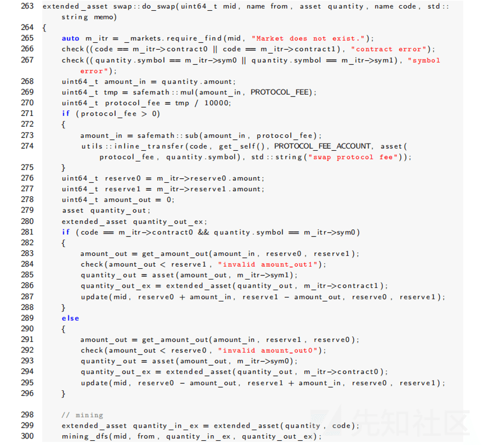
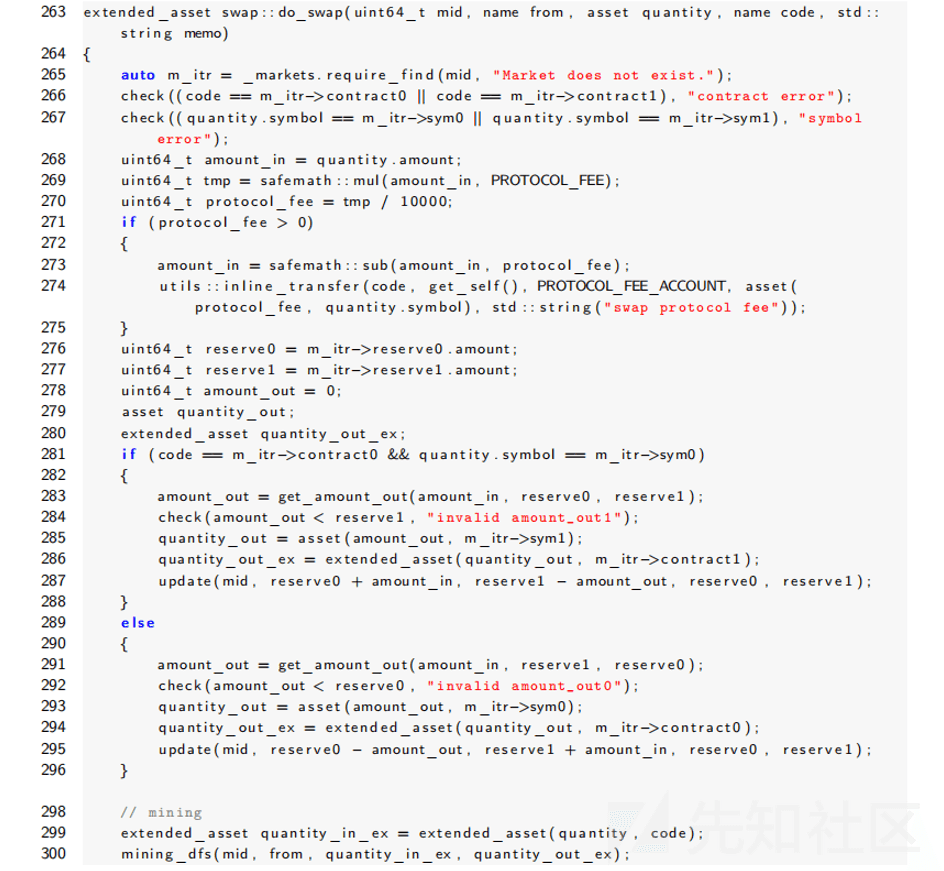
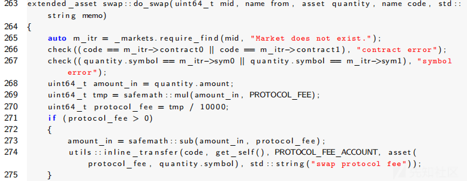
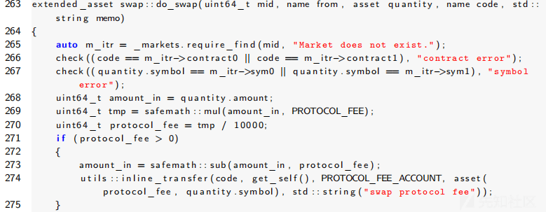
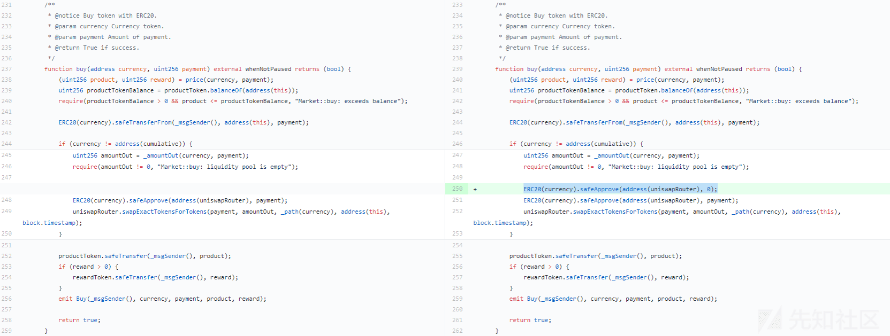
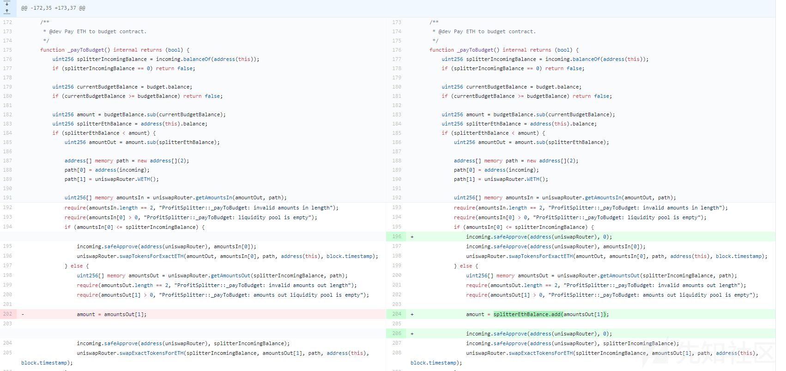

<<<<<<< HEAD
---
title: DeFi 技术及其安全风险浅析 - 先知社区
url: https://xz.aliyun.com/t/14070
clipped_at: 2024-03-20 09:55:15
category: default
tags: 
 - xz.aliyun.com
---
=======
>>>>>>> 4992f5f682bf7aa8873ceb2495ac1d2a8296850f


# DeFi 技术及其安全风险浅析 - 先知社区

<<<<<<< HEAD
=======
DeFi 技术及其安全风险浅析

- - -

>>>>>>> 4992f5f682bf7aa8873ceb2495ac1d2a8296850f
## 基本介绍

DeFi 是 Decentralized Finance (去中心化金融) 的缩写，它是一种基于区块链技术的金融服务模式，它的目标是通过区块链技术和智能合约等技术手段，构建一个去中心化、透明、安全、开放和无门槛的金融系统，为用户提供更加自由、便捷、低成本、高效率的金融服务  
DeFi 的背景可以追溯到 2017 年以太坊网络上的 ICO (Initial Coin Offering) 热潮，ICO 是一种基于区块链技术的募资方式，它为众多初创企业提供了融资渠道，同时也为投资者提供了投资机会，然而 ICO 市场也存在着诸多问题，例如：缺乏监管、信息不对称、投机泡沫等，为了解决这些问题人们开始探索基于区块链技术的金融服务模式，进而诞生了 DeFi

## 主要特点

DeFi (去中心化金融) 作为一种新兴的金融服务模式，具有以下几个特点：

-   去中心化：DeFi 服务通过区块链技术和智能合约实现去中心化，避免了传统金融机构的中心化控制和单点故障，任何人都可以参与 DeFi 服务的构建和使用，不需要经过中介机构的审批和授权
-   透明性：DeFi 服务的交易和操作记录都被记录在区块链上，任何人都可以查看和验证，这种透明性可以提高金融服务的公正性和信任度，避免信息不对称和欺诈行为
-   安全性：DeFi 服务使用密码学和多重签名等技术手段保证交易和资产的安全性，智能合约的执行过程是公开透明的，不容易被篡改和攻击，此外 DeFi 服务不需要用户将资产存放在中心化的机构中，降低了资产被盗和损失的风险
-   开放性：DeFi 服务开放、自由，任何人都可以创建和使用，这种开放性可以促进创新和竞争，使得金融服务更加多样化和个性化
-   无门槛：DeFi 服务不需要用户提供身份信息和信用评级等，降低了金融服务的准入门槛，任何人都可以利用 DeFi 服务进行借贷、交易等操作，尤其是在一些金融服务相对落后的地区和人群中具有重要意义

## 关键技术

DeFi (去中心化金融) 的技术基础主要包括以下几个方面：

-   区块链技术：DeFi 服务的底层基础设施主要依赖于区块链技术，尤其是以太坊网络，以太坊网络可以支持智能合约的编写和执行，使得 DeFi 服务的交易和操作可以在链上进行，从而实现去中心化
-   智能合约：智能合约是 DeFi 服务的核心技术之一，它是一种以编程方式描述的合约，可以自动执行其中的条款和条件。DeFi 服务的各种操作和交易都是通过智能合约实现的，例如借贷、交易、流动性挖掘等
-   密码学技术：密码学技术是 DeFi 服务的安全基础，包括公钥加密、哈希算法、数字签名等，这些技术可以保证 DeFi 服务的交易和资产的安全性，避免资产被盗和篡改
-   多重签名技术：多重签名技术是 DeFi 服务的一种安全机制，可以通过多个签名方对交易进行授权和验证，提高交易的安全性和可信度，多重签名技术也可以用于管理多方共同持有的资产，例如：代币发行和管理
-   流动性池技术：流动性池技术是 DeFi 服务的一种基础设施，它是一种自动化的交易市场，可以为用户提供去中心化的交易流动性。流动性池技术将多种资产汇聚到一个池子中，通过智能合约自动调节资产价格和交易流动性，从而实现去中心化的交易

## 交易方式

DeFi (去中心化金融) 的交易方式可以概括为以下几种：

-   钱包交易：钱包是 DeFi 服务的重要组成部分，用户可以通过钱包进行代币交易，钱包交易可以通过与 DEX 或其他交易平台的集成实现，用户可以在钱包中进行代币交易、转账、存款等操作
-   流动性挖掘：流动性挖掘是 DeFi 服务的一种特殊交易方式，它是通过提供代币流动性来赚取利润，用户可以将代币提供到流动性池中，从而获得代币交易费用的奖励，流动性挖掘既可以通过 DEX 来实现，也可以通过其他 DeFi 服务的流动性池来实现
-   去中心化借贷：去中心化借贷是 DeFi 服务的一种重要应用场景，用户可以通过去中心化借贷协议借贷代币，借贷协议是通过智能合约实现的，借贷双方之间的信任和交易都是通过智能合约来实现的，从而实现了去中心化
-   去中心化交易 (DEX)：去中心化交易是 DeFi 服务最常见的交易方式，它是一种去中心化的自动化交易市场，用户可以通过 DEX 进行代币交易，交易的过程不需要经过中介机构的审批和授权，交易双方直接进行交易，从而实现了去中心化

## 应用场景

DeFi (去中心化金融) 作为一种新兴的金融服务模式，具有去中心化、透明、安全、开放和无门槛等特点，可以应用于以下几个场景：

-   借贷：DeFi 服务可以通过智能合约实现去中心化借贷服务，用户可以在不需要中介机构的情况下进行借贷，从而降低了借贷成本和准入门槛
-   保险：DeFi 服务可以通过智能合约实现自动化的保险服务，用户可以在不需要保险公司的情况下购买保险，同时也可以通过参与保险池获得保险费用的收益
-   支付：DeFi 服务可以通过智能合约实现去中心化支付服务，用户可以在不需要银行或支付机构的情况下进行跨境支付和结算，从而降低了支付成本和时间
-   资产管理：DeFi 服务可以通过智能合约实现去中心化资产管理服务，用户可以将资产存入去中心化流动性池中，从而实现资产的增值和流动性
-   去中心化交易：DeFi 服务可以通过去中心化交易所实现代币交易，用户可以在不需要中介机构的情况下进行代币交易，同时也可以参与流动性挖掘等活动获得收益
-   去中心化投资：DeFi 服务可以通过智能合约实现去中心化投资服务，用户可以参与代币发行、ICO、STO 等投资活动，从而获得投资收益

## 安全风险

如果说 ERC 系列的代币合约更加侧重于发币、交易，那么 DeFi 的合约则更加注重于金融业务场景，不管是抵押、借贷、支付等方面，业务逻辑变得更加复杂，下面我们介绍几例 DeFi 中的业务逻辑安全漏洞供大家一起研究探讨，但是不同的 DeFi 类合约有不同的业务应用场景，我们在审计或者安排评估时多和项目方进行沟通交流，了解业务功能的设计、客户锁关心的核心要点等方面

### 无交易费挖矿

#### 漏洞分析

下面是 DeFis Network Swap 智能合约代码的代码，其中函数 do\_swap () 主要用于实现币币交易的业务逻辑，其中的交易费用由 PROTOCOL\_FEE 和在 get\_amount\_out () 中参与计算的 TRADE\_FEE 构成，但两者都是依赖于输入的代币数量 amount\_in 来计算，例如：代码第 269-275 行所示，另外在判断该交易是否能参与挖矿的 mining\_dfs () 函数中仅限定了交易对中有 EOS 代币且交易额大于 1EOS，因此用户可通过创建无价值代币与 EOS 的交易对并通过使用无价值代币不停兑换 EOS 即可实现无交易费挖矿  
<<<<<<< HEAD
[](https://xzfile.aliyuncs.com/media/upload/picture/20240311101424-148982ae-df4d-1.png)
=======
[](https://xzfile.aliyuncs.com/media/upload/picture/20240311101424-148982ae-df4d-1.png)
>>>>>>> 4992f5f682bf7aa8873ceb2495ac1d2a8296850f

#### 漏洞修复

关于上述问题的修复我们一方面可以建立白名单机制给有价值的代币交易挖矿赋予较高的权重，另一方面也可以在计算挖矿手续费时，收取以 EOS 为计算交易手续费的单位

### 币币交换假充值

#### 漏洞分析

DeFis Network Swap 智能合约在币币交换过程中没有严格的比对合约和代币名称相同，导致存在假充值的可能，在 DeFis Network Swap 智能合约中函数 do\_swap () 实现了币币交易的逻辑，其中判断输入的代币是否与交易对中的合约及代币 symbol 匹配的逻辑，例如：代码第 266-267 行所示，EOS 公链上的代币判断是要求合约和 symbol 同时相同，但代码中是分别判断输入的代币是否符合条件，即先判断合约是否匹配再判断 symbol，此时如果输入的代币是 contract0 的 sym1 也符合条件，那么交易对便有了被假充值的可能，但由于充入的假币被当作 sym1 的代币，因此兑换回的是 sym0 代币，即假币和 sym0 都是同一个合约发行

<<<<<<< HEAD
[](https://xzfile.aliyuncs.com/media/upload/picture/20240311102232-37a840c6-df4e-1.png)
=======
[](https://xzfile.aliyuncs.com/media/upload/picture/20240311102232-37a840c6-df4e-1.png)
>>>>>>> 4992f5f682bf7aa8873ceb2495ac1d2a8296850f

#### 漏洞修复

在币币兑换交易中，判断代币时需要同时检查代币合约和 symbol

### 授权额度阻塞

#### 漏洞分析

在 DeFi 中也存在的诸多的授权操作，例如：授权转账额度，我们在设计授权类函数的时候如果边界条件过于宽松则会导致条件竞争类问题或者授权额度覆盖的问题，如果过于死板未考虑到各类业务的场景需求则会导致功能的无法使用，在下面的 Bondappetit 协议中有多个地方在 Uniswap 的方法调用之前使用了 SafeApprove 函数进行额度授权，但如果之前的授权额度不为 0，则会因为 safeApprove 的 require 条件阻止下一次 safeApprove 的授权，safeApprove 具体代码如下

<<<<<<< HEAD
```plain
=======
```bash
>>>>>>> 4992f5f682bf7aa8873ceb2495ac1d2a8296850f
/**
     * @dev Deprecated. This function has issues similar to the ones found in
     * {IERC20-approve}, and its usage is discouraged.
     *
     * Whenever possible, use {safeIncreaseAllowance} and
     * {safeDecreaseAllowance} instead.
     */
    function safeApprove(IERC20 token, address spender, uint256 value) internal {
        // safeApprove should only be called when setting an initial allowance,
        // or when resetting it to zero. To increase and decrease it, use
        // 'safeIncreaseAllowance' and 'safeDecreaseAllowance'
        // solhint-disable-next-line max-line-length
        require((value == 0) || (token.allowance(address(this), spender) == 0),
            "SafeERC20: approve from non-zero to non-zero allowance"
        );
        _callOptionalReturn(token, abi.encodeWithSelector(token.approve.selector, spender, value));
    }
```

存在风险的代码位置 1 如下所示：

<<<<<<< HEAD
```plain
=======
```bash
>>>>>>> 4992f5f682bf7aa8873ceb2495ac1d2a8296850f
/**
     * @notice Invest tokens to protocol
     * @param token Invested token
     * @param amount Invested amount
     */
    function invest(address token, uint256 amount) external whenNotPaused returns (bool) {
        require(investmentTokens[token], "Investment::invest: invalid investable token");
        uint256 reward = _governanceTokenPrice(amount);

        ERC20(token).safeTransferFrom(_msgSender(), address(this), amount);

        if (token != address(cumulative)) {
            uint256 amountOut = _amountOut(token, amount);
            require(amountOut != 0, "Investment::invest: liquidity pool is empty");
            reward = _governanceTokenPrice(amountOut);

            ERC20(token).safeApprove(address(uniswapRouter), amount);
            uniswapRouter.swapExactTokensForTokens(amount, amountOut, _path(token), address(this), block.timestamp);
        }

        governanceToken.transferLock(_msgSender(), reward, governanceTokenLockDate);

        emit Invested(_msgSender(), token, amount, reward);
        return true;
    }
```

存在风险的代码位置 2 如下所示：

<<<<<<< HEAD
```plain
=======
```bash
>>>>>>> 4992f5f682bf7aa8873ceb2495ac1d2a8296850f
/**
     * @notice Buy support token and add liquidity.
     * @param amount Amount of incoming token.
     */
    function buyLiquidity(uint256 amount) external whenNotPaused {
        if (amount > 0) {
            incoming.safeTransferFrom(_msgSender(), address(this), amount);
        }

        address[] memory path = new address[](2);
        path[0] = address(incoming);
        path[1] = address(support);

        uint256 amountIn = incoming.balanceOf(address(this)).div(2);
        require(amountIn > 0, "UniswapMarketMaker::buyLiquidity: not enough funds to buy back");
        uint256[] memory amountsOut = uniswapRouter.getAmountsOut(amountIn, path);
        require(amountsOut.length != 0, "UniswapMarketMaker::buyLiquidity: invalid amounts out length");
        uint256 amountOut = amountsOut[amountsOut.length - 1];
        require(amountOut > 0, "UniswapMarketMaker::buyLiquidity: liquidity pool is empty");

        incoming.safeApprove(address(uniswapRouter), amountIn);
        uniswapRouter.swapExactTokensForTokens(amountIn, amountOut, path, address(this), block.timestamp);

        uint256 incomingBalance = incoming.balanceOf(address(this));
        require(incomingBalance > 0, "UniswapMarketMaker::buyLiquidity: incoming token balance is empty");
        uint256 supportBalance = support.balanceOf(address(this));
        require(supportBalance > 0, "UniswapMarketMaker::buyLiquidity: support token balance is empty");

        incoming.safeApprove(address(uniswapRouter), incomingBalance);
        support.safeApprove(address(uniswapRouter), supportBalance);
        (uint256 amountA, uint256 amountB, ) = uniswapRouter.addLiquidity(address(incoming), address(support), incomingBalance, supportBalance, 0, 0, address(this), block.timestamp);
        emit LiquidityIncreased(amountA, amountB);

        incoming.safeApprove(address(uniswapRouter), 0);
        support.safeApprove(address(uniswapRouter), 0);
    }
```

存在风险的代码位置 3 如下所示

<<<<<<< HEAD
```plain
=======
```bash
>>>>>>> 4992f5f682bf7aa8873ceb2495ac1d2a8296850f
/**
     * @notice Add liquidity.
     * @param incomingAmount Amount of incoming token.
     * @param supportAmount Amount of support token.
     */
    function addLiquidity(uint256 incomingAmount, uint256 supportAmount) external whenNotPaused {
        if (incomingAmount > 0) {
            incoming.safeTransferFrom(_msgSender(), address(this), incomingAmount);
        }
        if (supportAmount > 0) {
            support.safeTransferFrom(_msgSender(), address(this), supportAmount);
        }

        uint256 incomingBalance = incoming.balanceOf(address(this));
        require(incomingBalance > 0, "UniswapMarketMaker::addLiquidity: incoming token balance is empty");
        uint256 supportBalance = support.balanceOf(address(this));
        require(supportBalance > 0, "UniswapMarketMaker::addLiquidity: support token balance is empty");

        incoming.safeApprove(address(uniswapRouter), incomingBalance);
        support.safeApprove(address(uniswapRouter), supportBalance);
        (uint256 amountA, uint256 amountB, ) = uniswapRouter.addLiquidity(address(incoming), address(support), incomingBalance, supportBalance, 0, 0, address(this), block.timestamp);
        emit LiquidityIncreased(amountA, amountB);

        incoming.safeApprove(address(uniswapRouter), 0);
        support.safeApprove(address(uniswapRouter), 0);
    }
```

存在风险的代码位置 4 如下所示：

<<<<<<< HEAD
```plain
=======
```bash
>>>>>>> 4992f5f682bf7aa8873ceb2495ac1d2a8296850f
/**
     * @notice Remove liquidity.
     * @param amount Amount of liquidity pool token.
     */
    function removeLiquidity(uint256 amount) external onlyOwner {
        address pair = liquidityPair();
        require(pair != address(0), "UniswapMarketMaker::removeLiquidity: liquidity pair not found");

        uint256 lpBalance = ERC20(pair).balanceOf(address(this));
        amount = lpBalance < amount ? lpBalance : amount;
        require(amount > 0, "UniswapMarketMaker::removeLiquidity: zero amount");

        ERC20(pair).safeApprove(address(uniswapRouter), amount);
        (uint256 incomingAmount, uint256 supportAmount) = uniswapRouter.removeLiquidity(address(incoming), address(support), amount, 0, 0, address(this), block.timestamp);
        emit LiquidityReduced(amount, incomingAmount, supportAmount);
    }
```

#### 处置建议

在每次调用 safeApprove 进行授权之前将 allowance 重置为 0，例如：  
<<<<<<< HEAD
[](https://xzfile.aliyuncs.com/media/upload/picture/20240311103620-250770a2-df50-1.png)
=======
[](https://xzfile.aliyuncs.com/media/upload/picture/20240311103620-250770a2-df50-1.png)
>>>>>>> 4992f5f682bf7aa8873ceb2495ac1d2a8296850f

### 利润分配错误

#### 漏洞介绍

在 DeFi 类合约中少不了与金融相关的业务逻辑，例如：分红机制、利润分配等，这里以某 DeFi 合约的利润分配为例进行说明，在以下连接的代码处可以看到如果 splitterIncomingBalance 不足以弥补 splitterIncomingBalance 和 amount 之间的差额，那么合约将把 splitterIncomingBalance 全部兑换成 ETH，换句话说合约会尽量接近 ETH 数量，然而正如我们在这个代码块中看到的，合约将 amountsOut \[1\] 赋值给 amount，然而这是错误的，因为我们需要分配的是 splitterEthBalance.add (amountsOut \[1\])

<<<<<<< HEAD
```plain
=======
```bash
>>>>>>> 4992f5f682bf7aa8873ceb2495ac1d2a8296850f
/**
     * @dev Pay ETH to budget contract.
     */
    function _payToBudget() internal returns (bool) {
        uint256 splitterIncomingBalance = incoming.balanceOf(address(this));
        if (splitterIncomingBalance == 0) return false;

        uint256 currentBudgetBalance = budget.balance;
        if (currentBudgetBalance >= budgetBalance) return false;

        uint256 amount = budgetBalance.sub(currentBudgetBalance);
        uint256 splitterEthBalance = address(this).balance;
        if (splitterEthBalance < amount) {
            uint256 amountOut = amount.sub(splitterEthBalance);

            address[] memory path = new address[](2);
            path[0] = address(incoming);
            path[1] = uniswapRouter.WETH();

            uint256[] memory amountsIn = uniswapRouter.getAmountsIn(amountOut, path);
            require(amountsIn.length == 2, "ProfitSplitter::_payToBudget: invalid amounts in length");
            require(amountsIn[0] > 0, "ProfitSplitter::_payToBudget: liquidity pool is empty");
            if (amountsIn[0] <= splitterIncomingBalance) {
                incoming.safeApprove(address(uniswapRouter), amountsIn[0]);
                uniswapRouter.swapTokensForExactETH(amountOut, amountsIn[0], path, address(this), block.timestamp);
            } else {
                uint256[] memory amountsOut = uniswapRouter.getAmountsOut(splitterIncomingBalance, path);
                require(amountsOut.length == 2, "ProfitSplitter::_payToBudget: invalid amounts out length");
                require(amountsOut[1] > 0, "ProfitSplitter::_payToBudget: amounts out liquidity pool is empty");

                amount = amountsOut[1];

                incoming.safeApprove(address(uniswapRouter), splitterIncomingBalance);
                uniswapRouter.swapExactTokensForETH(splitterIncomingBalance, amountsOut[1], path, address(this), block.timestamp);
            }
        }

        budget.transfer(amount);
        emit PayToBudget(budget, amount);

        return true;
    }
```

#### 修复建议

将 splitterEthBalance.add (amountsOut \[1\]) 赋值给 amout 而不是 amoutsOut \[1\]:  
<<<<<<< HEAD
[](https://xzfile.aliyuncs.com/media/upload/picture/20240311104104-ce7f569a-df50-1.png)
=======
[](https://xzfile.aliyuncs.com/media/upload/picture/20240311104104-ce7f569a-df50-1.png)
>>>>>>> 4992f5f682bf7aa8873ceb2495ac1d2a8296850f

## 文末小结

本篇文章我们主要介绍了 DeFi 的基本概念以及相关的技术的实现和应用领域，随后通过对 DeFi 类智能合约的安全审计示例对 DeFi 合约的安全问题进行了简易的刨析，当然，正如我们之前所说的那样，Defi 更加贴近与金融类业务场景，不同的场景下业务也不同，功能极其复杂，很多研发人员在研发的时候可能对业务考虑的并不周全，导致各类的业务逻辑问题出现，而安全测试有时候也是存在边边角角考虑不到，所以安全审计建议项目方和审计方多多沟通交流并对业务功能进行梳理，在代码层面进行功能验证和业务逻辑的安全性分析评估
