# Patchwork(白象) APT 组织攻击样本详细分析 - 先知社区

# 前言概述

Patchwork APT 组织是一支疑似南亚某政府背景的黑客组织，最早于 2009 年左右被发现，主要攻击中国、巴基斯坦、孟加拉国等国家军工、外交、教育，科研机构等，窃密重要数据，该组织主要使用鱼叉式钓鱼攻击手法，附带伪造为 PDF 文件的 LNK 恶意文件，通过 PS 脚本从黑客远程 C2 服务器下载恶意软件，攻击中使用了多种不同的恶意软件家族，包含：BADNEWS 木马、Spyder 后门、Remcos RAT、Havoc C2、NorthStarC2、GRAT 等。

近日，国外安全研究人员曝光了一个 Patchwork APT 组织攻击样本，该样本进行了详细分析。  
[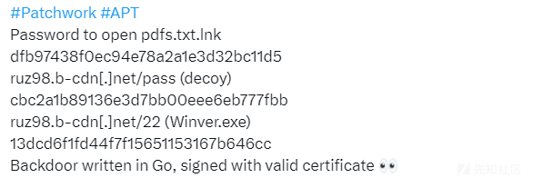](https://xzfile.aliyuncs.com/media/upload/picture/20240315183911-427d541a-e2b8-1.png)

# 详细分析

1.样本运行之后，如下所示：  
[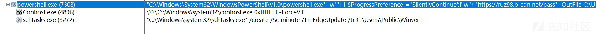](https://xzfile.aliyuncs.com/media/upload/picture/20240315183940-53cae1ba-e2b8-1.png)  
2.提取样本中的命令行，如下所示：  
[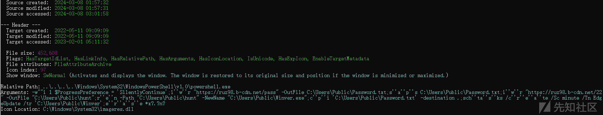](https://xzfile.aliyuncs.com/media/upload/picture/20240315183953-5bd4f99a-e2b8-1.png)  
3.从网上下载恶意程序到指定的目录，并注册成计划任务自启动项，如下所示：  
[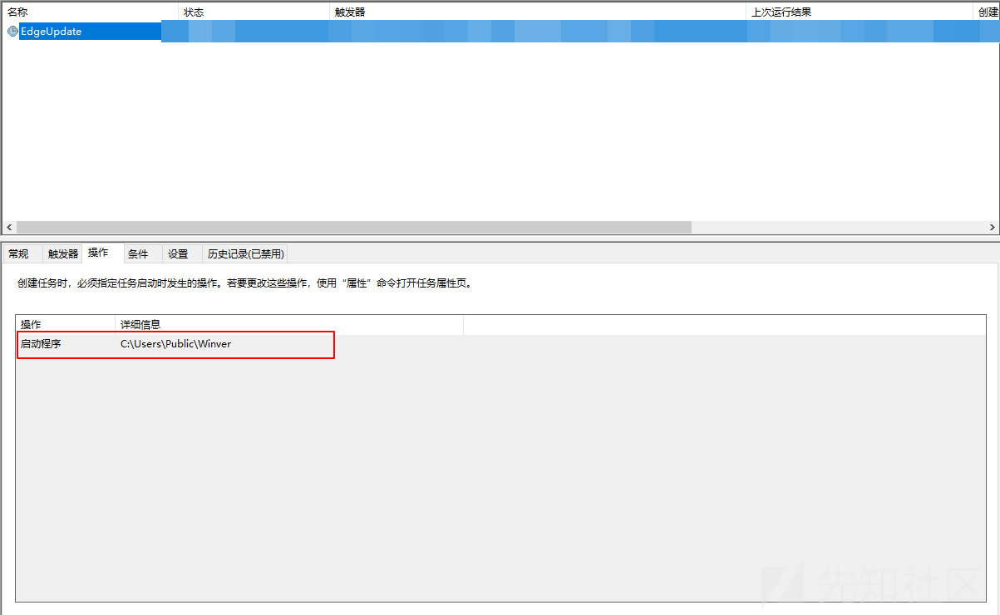](https://xzfile.aliyuncs.com/media/upload/picture/20240315184009-6566e8e2-e2b8-1.png)  
4.下载的恶意程序，使用 GO 语言开发，如下所示：  
[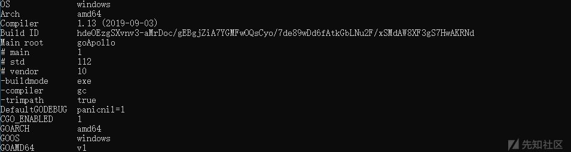](https://xzfile.aliyuncs.com/media/upload/picture/20240315184024-6e0c028e-e2b8-1.png)  
5.恶意程序使用正常的数字签名，如下所示：  
[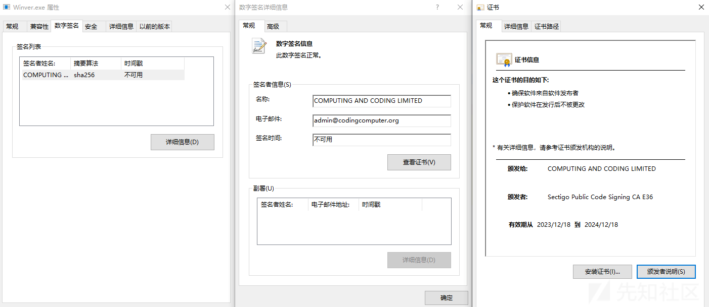](https://xzfile.aliyuncs.com/media/upload/picture/20240315184039-772703d2-e2b8-1.png)  
6.恶意程序中使用的 GO 模块，如下所示：  
[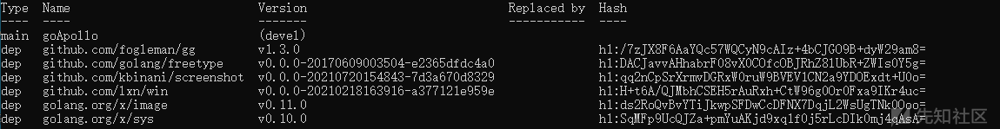](https://xzfile.aliyuncs.com/media/upload/picture/20240315184054-8043f9de-e2b8-1.png)  
7.恶意程序中使用的源代码信息，如下所示：  
[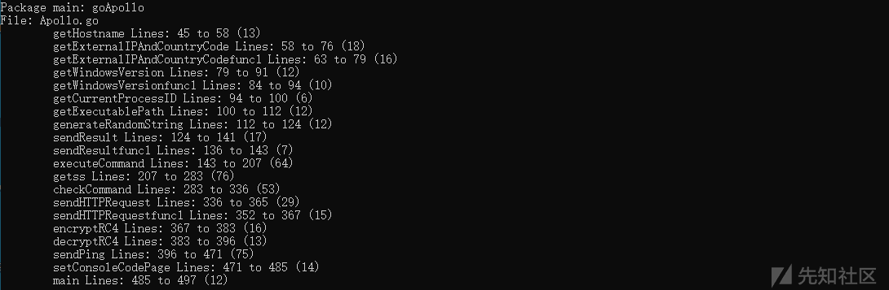](https://xzfile.aliyuncs.com/media/upload/picture/20240315184108-88a7c056-e2b8-1.png)  
8.获取主机用户名信息，如下所示：  
  
9.加密获取的主机用户名信息，如下所示：  
[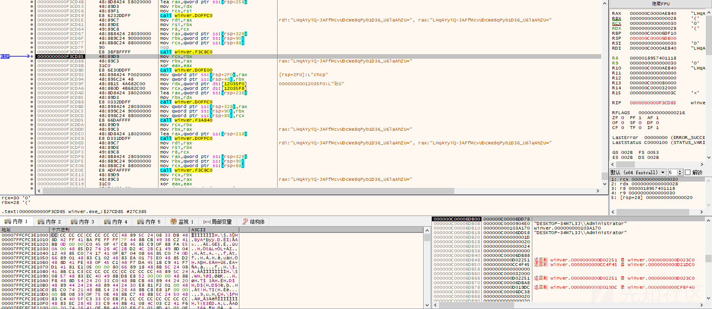](https://xzfile.aliyuncs.com/media/upload/picture/20240315184139-9aecc248-e2b8-1.png)  
10.获取主机名，如下所示：  
[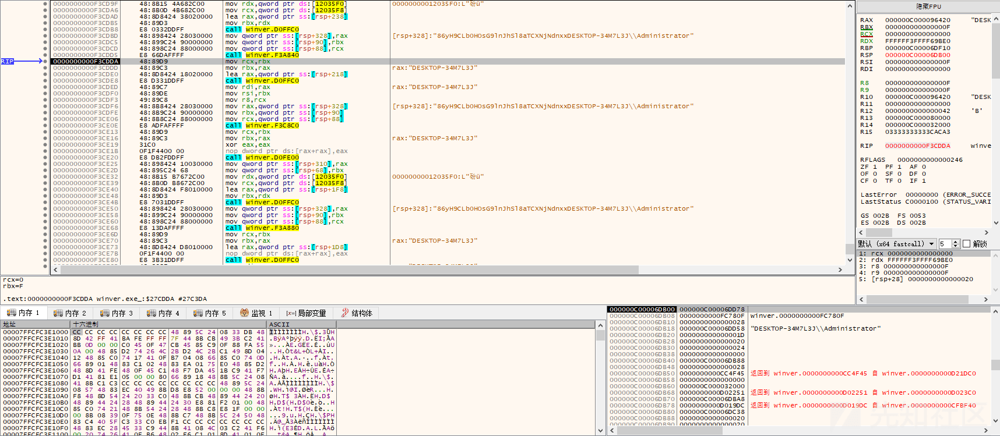](https://xzfile.aliyuncs.com/media/upload/picture/20240315184153-a370cd10-e2b8-1.png)  
11.加密获取的主机名信息，如下所示：  
  
12.获取主机 IP 以及 IP 所在国家的信息并加密，如下所示：  
[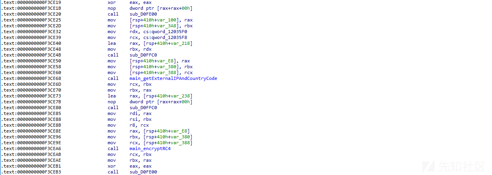](https://xzfile.aliyuncs.com/media/upload/picture/20240315184221-b3d87e5a-e2b8-1.png)  
13.获取主机 Windows 版本信息并加密，如下所示：  
[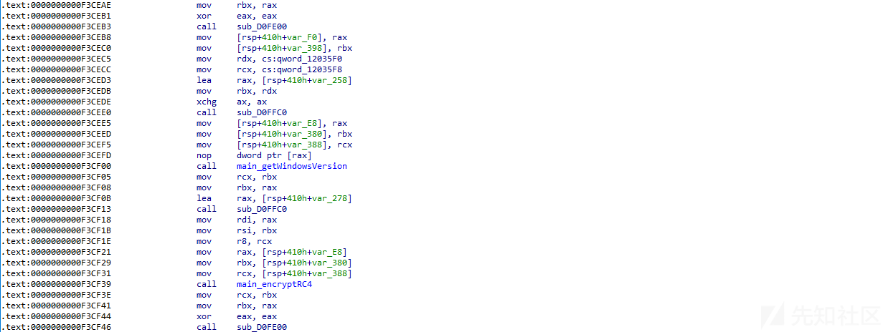](https://xzfile.aliyuncs.com/media/upload/picture/20240315184236-bc9a6148-e2b8-1.png)  
14.获取恶意程序执行路径并加密，如下所示：  
[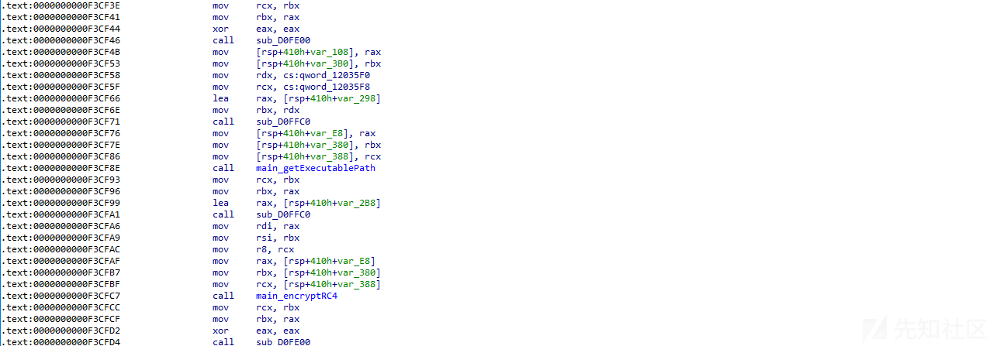](https://xzfile.aliyuncs.com/media/upload/picture/20240315184250-c567c522-e2b8-1.png)  
15.获取恶意程序当前进程 ID 信息并加密，如下所示：  
[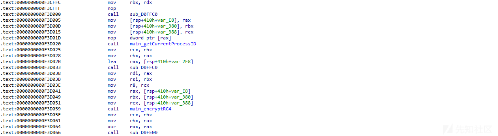](https://xzfile.aliyuncs.com/media/upload/picture/20240315184305-ce387750-e2b8-1.png)  
16.获取主机 CPU 架构信息并加密，如下所示：  
[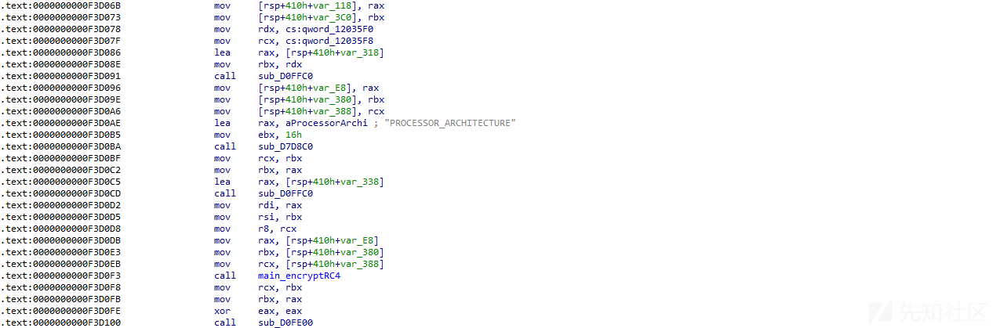](https://xzfile.aliyuncs.com/media/upload/picture/20240315184321-d7cd1028-e2b8-1.png)  
17.按固定格式拼接上面获取的各种信息，如下所示：  
[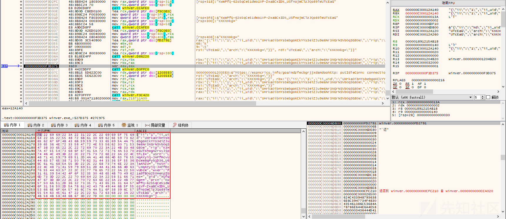](https://xzfile.aliyuncs.com/media/upload/picture/20240315184335-e00e2d4e-e2b8-1.png)  
18.将上面的数据，通过 HTTP 请求发送到黑客远程服务器，如下所示：  
[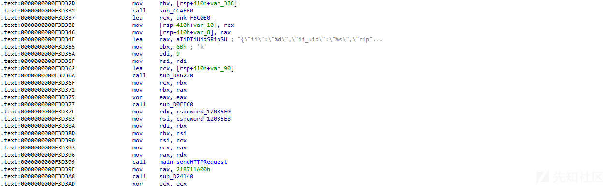](https://xzfile.aliyuncs.com/media/upload/picture/20240315184351-e9c04390-e2b8-1.png)  
19.通过 POST 请求发送数据，如下所示：  
[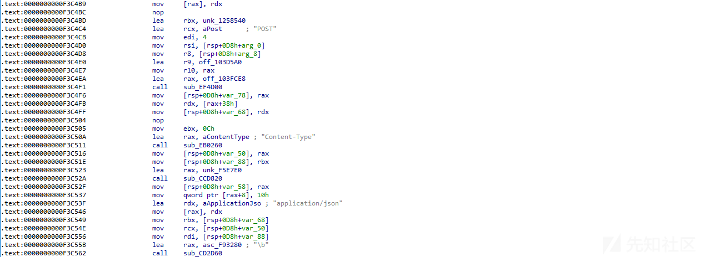](https://xzfile.aliyuncs.com/media/upload/picture/20240315184406-f2924478-e2b8-1.png)  
20.返回执行相应的 Command 指令，如下所示：  
[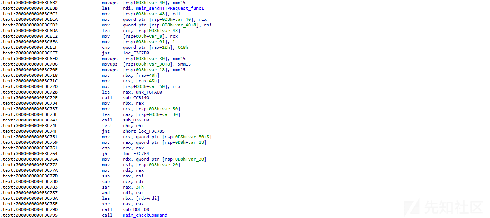](https://xzfile.aliyuncs.com/media/upload/picture/20240315184421-fb220c90-e2b8-1.png)  
21.解密从服务器上返回的指令数据，如下所示：  
[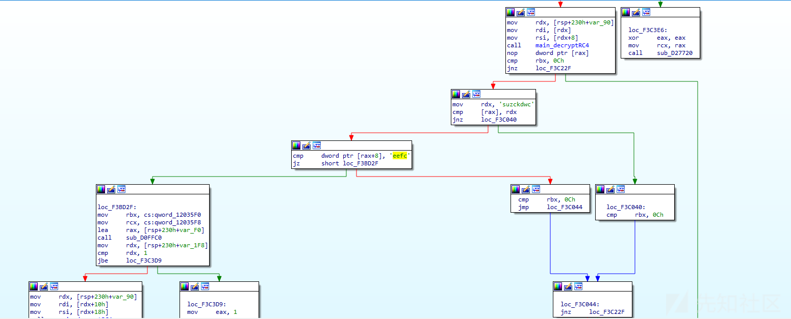](https://xzfile.aliyuncs.com/media/upload/picture/20240315184437-050b58d8-e2b9-1.png)  
22.不同的指令执行不同的命令，如下所示：  
  
23.执行指令获取主机截屏信息，如下所示：  
[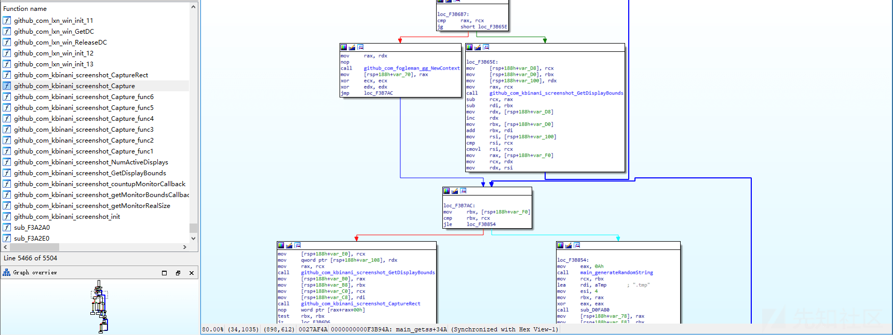](https://xzfile.aliyuncs.com/media/upload/picture/20240315184508-173fa7f2-e2b9-1.png)

# 威胁情报

[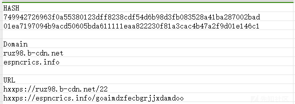](https://xzfile.aliyuncs.com/media/upload/picture/20240315184525-2194f2ac-e2b9-1.png)
