# PbootCMS-3.2.4 代码审计 - 先知社区

# PbootCMS3.2.4 代码审计

# 存储型 XSS

后台页面，修改站点信息处，能够通过 `POST` 请求修改一些首页面等各页面的一些描述和展示，包括图片等。

<<<<<<< HEAD
[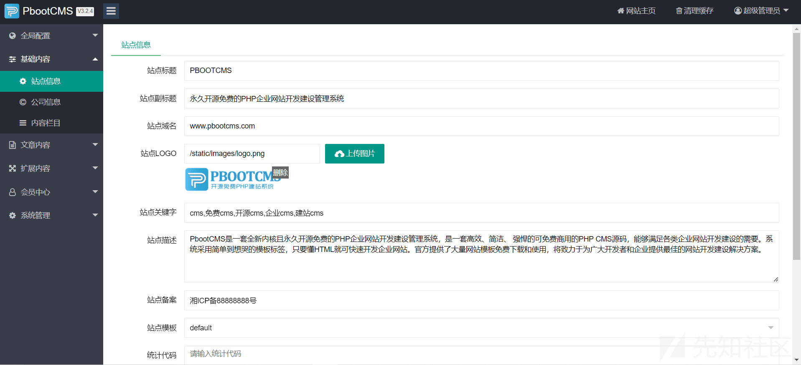](https://xzfile.aliyuncs.com/media/upload/picture/20240313175228-6721dbd2-e11f-1.png)

抓个包看看路由，这里的路由跟大部分 `PHP` 网站的路由控制是一致的，通过一个参数去控制对应的路由执行方法，`p=/Site/mod` 表示会来到 `SiteController` 控制器的 `mod` 方法中。

[](https://xzfile.aliyuncs.com/media/upload/picture/20240313175233-6a3f0394-e11f-1.png)

看下代码，在 `post` 中主要是通过 `$_POST` 提交的数据接收参数，这里面会对数据进行一些处理，这里的处理方法是通过设置一个数组中的键值来确定对每个数据的不同处理，包括请求的方法、需要的类型，是否必须等。最终来到 `filter` 中会通过 `array_key_exists` 的形式的取得数据中的键，从而执行不同的 `case` 方法，

```plain
=======
[](https://xzfile.aliyuncs.com/media/upload/picture/20240313175228-6721dbd2-e11f-1.png)

抓个包看看路由，这里的路由跟大部分 `PHP` 网站的路由控制是一致的，通过一个参数去控制对应的路由执行方法，`p=/Site/mod` 表示会来到 `SiteController` 控制器的 `mod` 方法中。

[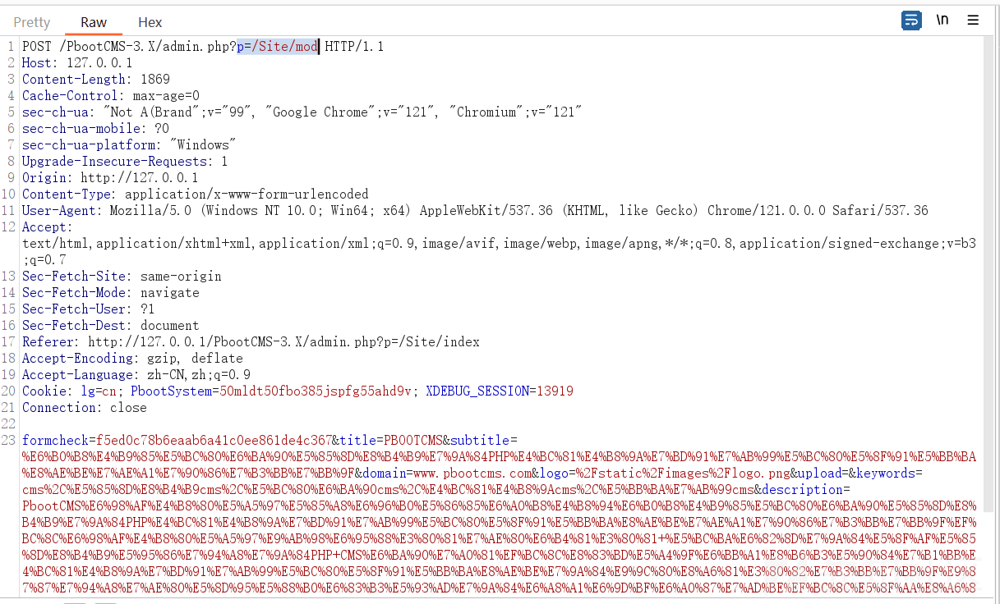](https://xzfile.aliyuncs.com/media/upload/picture/20240313175233-6a3f0394-e11f-1.png)

看下代码，在 `post` 中主要是通过 `$_POST` 提交的数据接收参数，这里面会对数据进行一些处理，这里的处理方法是通过设置一个数组中的键值来确定对每个数据的不同处理，包括请求的方法、需要的类型，是否必须等。最终来到 `filter` 中会通过 `array_key_exists` 的形式的取得数据中的键，从而执行不同的 `case` 方法，

```bash
>>>>>>> 4992f5f682bf7aa8873ceb2495ac1d2a8296850f
public function mod()
    {
        if (! $_POST) {
            return;
        }

        $data = array(
            'title' => post('title'),
            'subtitle' => post('subtitle'),
            'domain' => post('domain'),
            'logo' => post('logo'),
            'keywords' => post('keywords'),
            'description' => post('description'),
            'icp' => post('icp'),
            'theme' => basename(post('theme')) ?: 'default',
            'statistical' => post('statistical'),
            'copyright' => post('copyright')
        );

        path_delete(RUN_PATH . '/config'); // 清理缓存的配置文件
        if ($this->model->checkSite()) {
            if ($this->model->modSite($data)) {
                $this->log('修改站点信息成功！');
                success('修改成功！', - 1);
            } else {
                location(- 1);
            }
        } else {
            $data['acode'] = session('acode');
            if ($this->model->addSite($data)) {
                $this->log('修改站点信息成功！');
                success('修改成功！', - 1);
            } else {


                location(- 1);
            }
        }
    }
```

<<<<<<< HEAD
[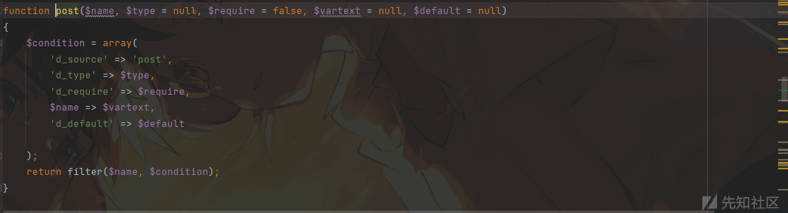](https://xzfile.aliyuncs.com/media/upload/picture/20240313175241-6eb7f9f8-e11f-1.png)
=======
[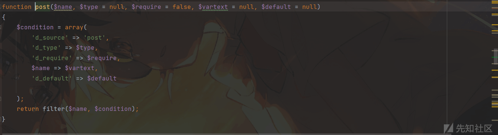](https://xzfile.aliyuncs.com/media/upload/picture/20240313175241-6eb7f9f8-e11f-1.png)
>>>>>>> 4992f5f682bf7aa8873ceb2495ac1d2a8296850f

比如里面的一段代码，通过取得 `d_type` 的键的值，进入到 `case` 中，从而确定必须是那一些类型。

在 `POST` 跑到 `filter` 后，它最终处理完全部数据后会来到 `escape_string` 中，而这个方法会通过 `addslashed和htmlspecialchars` 对敏感字符进行了转义，为了杜绝 `XSS` 和 `sql` 注入的发生，

<<<<<<< HEAD
[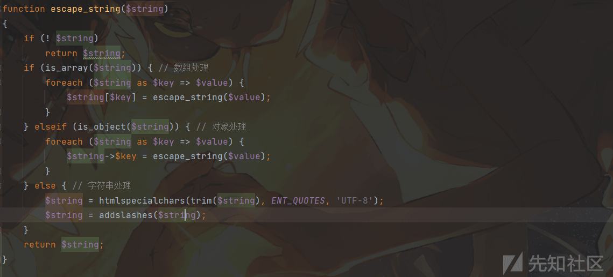](https://xzfile.aliyuncs.com/media/upload/picture/20240313175300-79e62c8c-e11f-1.png)

在全部处理完成之后，它会进入 `modSite` 进而将数据插入到数据库中，真正到获取 `sql` 语句准备执行语句进入数据库是这一段，`checkkey` 方法主要是检测 `Key` 的，也就是原先提交的 `Title` 等地方只允许`只包含字母、数字、下划线、点和连字符（破折号）`，随后通过切割 `Value` 前面两个字符和后面两个字符来判断是不是整型进行自增自减处理，如果都不是会直接拼接到了字符串中，最终出现一个完整的`字符串`赋给了 `$sql->['table']`。

[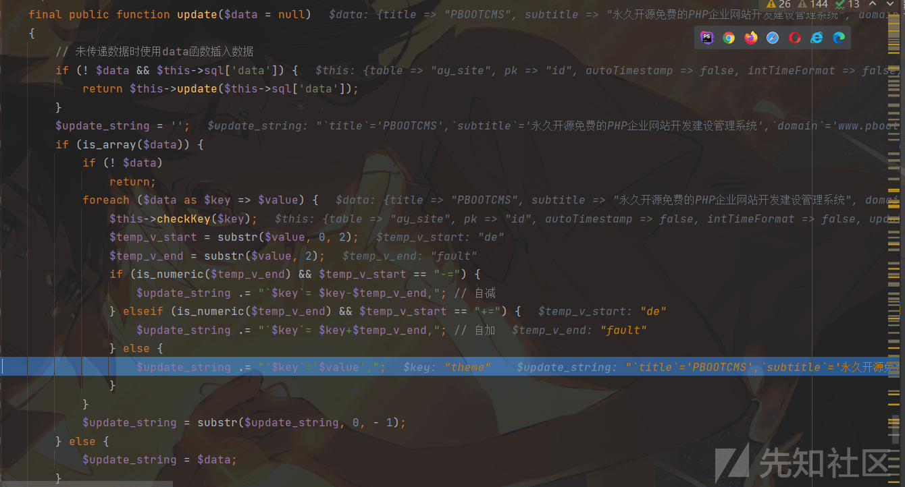](https://xzfile.aliyuncs.com/media/upload/picture/20240313175321-86a90b9c-e11f-1.png)

最终来到了 `buildSql` 方法，在这个方法中它是通过 `str_replace` 的方式来生成真正的 `sql` 处理语句的，通过将 `$sql->['table']` 替换 `%table% %value%` 等已经规定死的 `sql` 语句的值生成真正的 `sql` 语句，而这些规定的替换语句，在 `Model` 中已经被写好了，不同的方法会寻找不同的语句进行替换。

[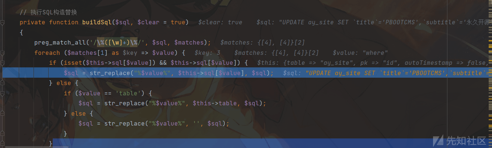](https://xzfile.aliyuncs.com/media/upload/picture/20240313175340-92480d68-e11f-1.png)

[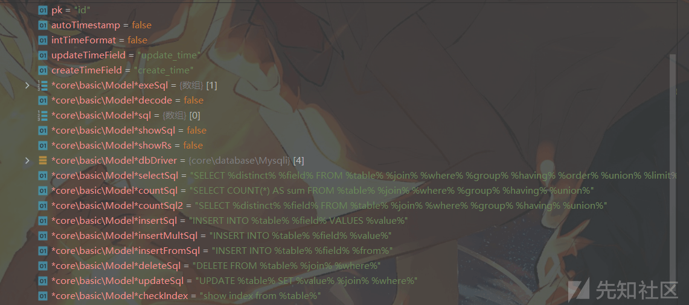](https://xzfile.aliyuncs.com/media/upload/picture/20240313175350-9828f954-e11f-1.png)

最终在插入到数据库中时，确实是做了实体编码的转换，包括对单引号转换成实体字符串等，所以这里也基本上不能够考虑存在 `sql` 注入的情况，但是它会首页的页面输出的时候，并没有维持这种方式。

[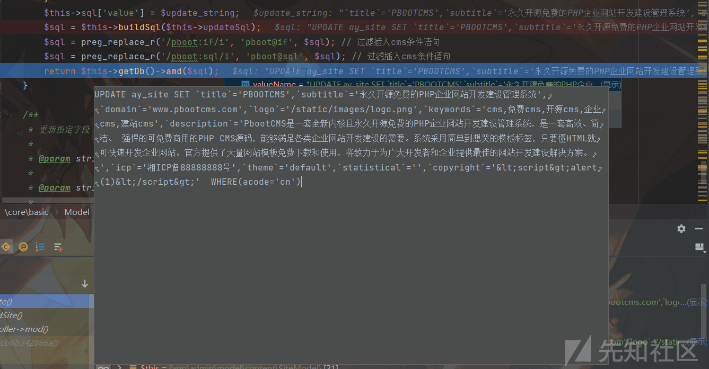](https://xzfile.aliyuncs.com/media/upload/picture/20240313175410-a426af08-e11f-1.png)

在访问首页，首先会通过 `SELECT *FROM AY_SITE` 将之前设置的各个标签数据取出，进入到 `parserSiteLabel` 方法中，里面会存在一个 `Match`，通过遍历 `Match` 中的值，进入不同的 `case` 进行不同的解析，在来到 `copyright` 的时候，它会先进行了 `decode` 再进入到 `adjustLabelData` 处理数据，所以这里前面 `sql` 更新时候的转义就没有什么用了。

[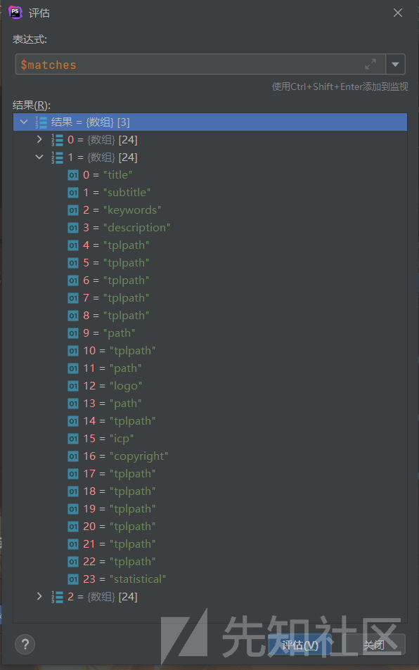](https://xzfile.aliyuncs.com/media/upload/picture/20240313175417-a82bc444-e11f-1.png)

[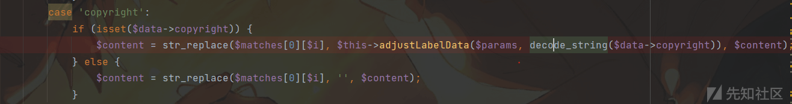](https://xzfile.aliyuncs.com/media/upload/picture/20240313175422-aad3c1ba-e11f-1.png)

[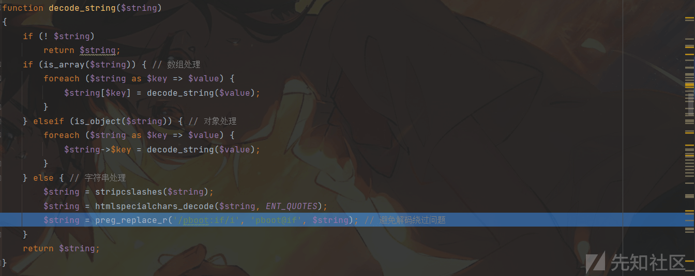](https://xzfile.aliyuncs.com/media/upload/picture/20240313175438-b4a4925a-e11f-1.png)

[](https://xzfile.aliyuncs.com/media/upload/picture/20240313175453-bd7c1010-e11f-1.png)
=======
[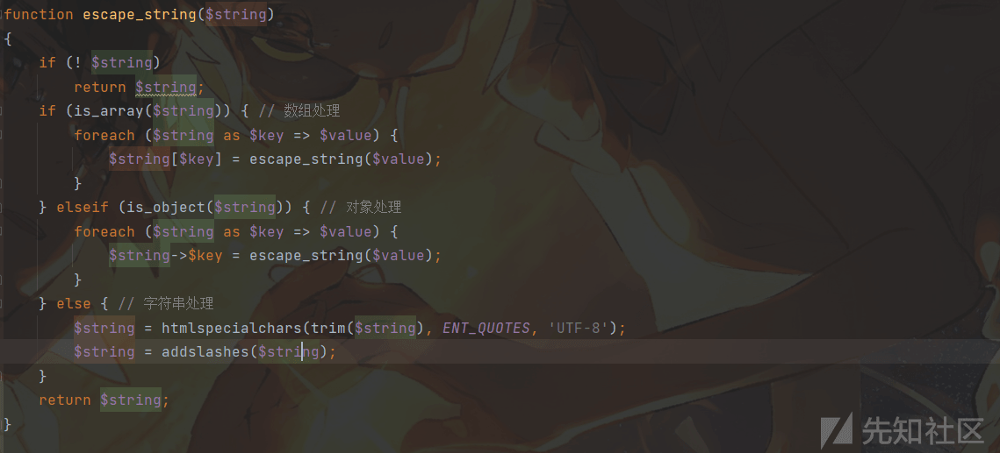](https://xzfile.aliyuncs.com/media/upload/picture/20240313175300-79e62c8c-e11f-1.png)

在全部处理完成之后，它会进入 `modSite` 进而将数据插入到数据库中，真正到获取 `sql` 语句准备执行语句进入数据库是这一段，`checkkey` 方法主要是检测 `Key` 的，也就是原先提交的 `Title` 等地方只允许`只包含字母、数字、下划线、点和连字符（破折号）`，随后通过切割 `Value` 前面两个字符和后面两个字符来判断是不是整型进行自增自减处理，如果都不是会直接拼接到了字符串中，最终出现一个完整的`字符串`赋给了 `$sql->['table']`。

[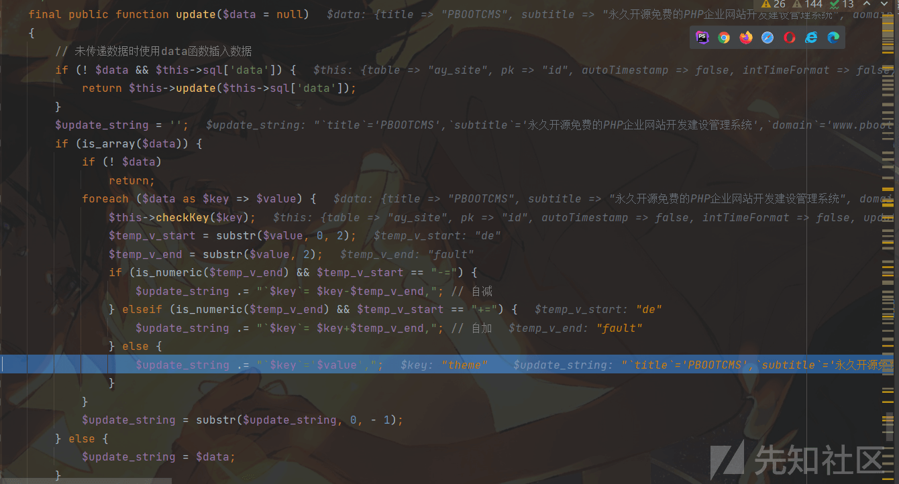](https://xzfile.aliyuncs.com/media/upload/picture/20240313175321-86a90b9c-e11f-1.png)

最终来到了 `buildSql` 方法，在这个方法中它是通过 `str_replace` 的方式来生成真正的 `sql` 处理语句的，通过将 `$sql->['table']` 替换 `%table% %value%` 等已经规定死的 `sql` 语句的值生成真正的 `sql` 语句，而这些规定的替换语句，在 `Model` 中已经被写好了，不同的方法会寻找不同的语句进行替换。

[](https://xzfile.aliyuncs.com/media/upload/picture/20240313175340-92480d68-e11f-1.png)

[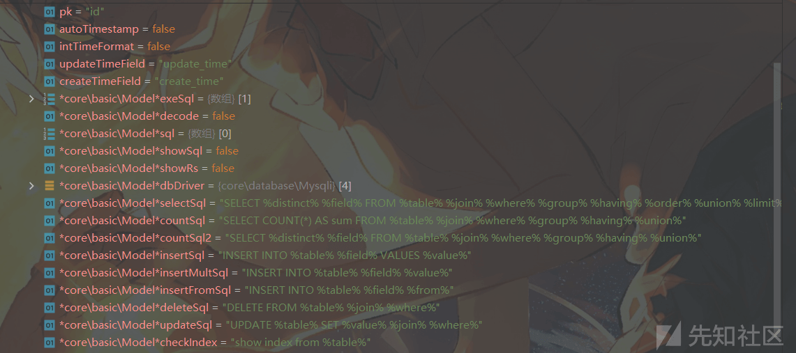](https://xzfile.aliyuncs.com/media/upload/picture/20240313175350-9828f954-e11f-1.png)

最终在插入到数据库中时，确实是做了实体编码的转换，包括对单引号转换成实体字符串等，所以这里也基本上不能够考虑存在 `sql` 注入的情况，但是它会首页的页面输出的时候，并没有维持这种方式。

[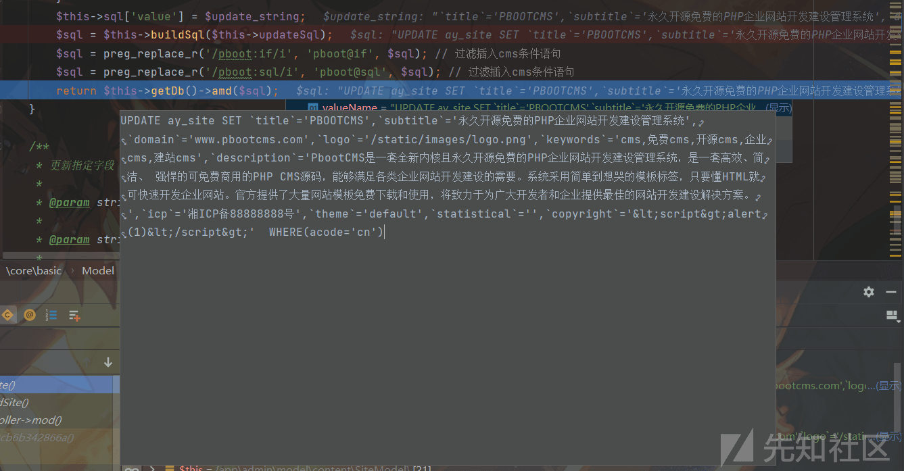](https://xzfile.aliyuncs.com/media/upload/picture/20240313175410-a426af08-e11f-1.png)

在访问首页，首先会通过 `SELECT *FROM AY_SITE` 将之前设置的各个标签数据取出，进入到 `parserSiteLabel` 方法中，里面会存在一个 `Match`，通过遍历 `Match` 中的值，进入不同的 `case` 进行不同的解析，在来到 `copyright` 的时候，它会先进行了 `decode` 再进入到 `adjustLabelData` 处理数据，所以这里前面 `sql` 更新时候的转义就没有什么用了。

[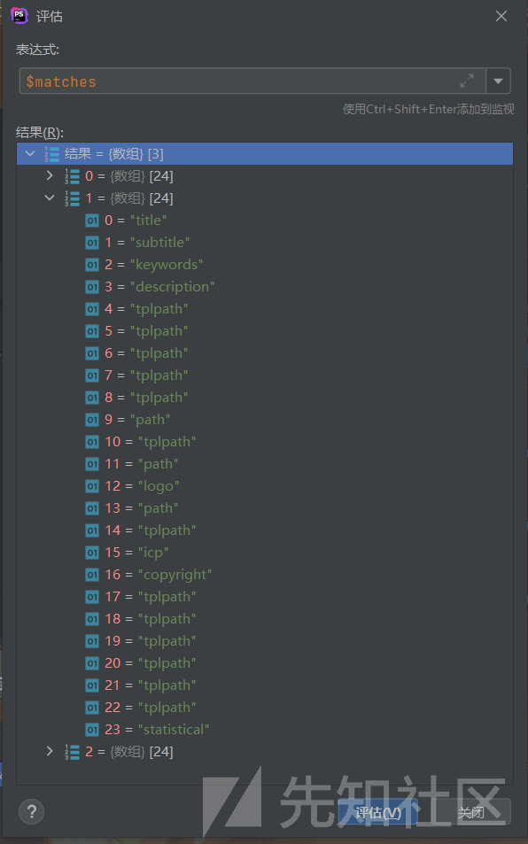](https://xzfile.aliyuncs.com/media/upload/picture/20240313175417-a82bc444-e11f-1.png)

[](https://xzfile.aliyuncs.com/media/upload/picture/20240313175422-aad3c1ba-e11f-1.png)

[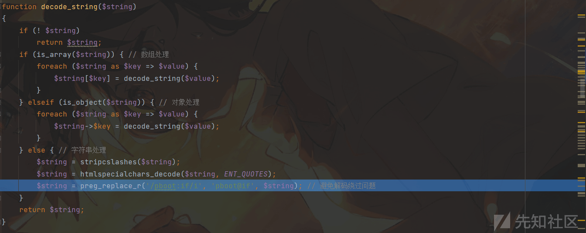](https://xzfile.aliyuncs.com/media/upload/picture/20240313175438-b4a4925a-e11f-1.png)

[](https://xzfile.aliyuncs.com/media/upload/picture/20240313175453-bd7c1010-e11f-1.png)
>>>>>>> 4992f5f682bf7aa8873ceb2495ac1d2a8296850f

> 这里其实有考虑过二次注入的情况，很可惜的是，它 `SELECT` 获取出数据后，只是进行了解码渲染了页面，并没有再找到有其它继续进行数据库的操作。

# RCE

`Pbootcms` 支持动态缓存的操作，当这个配置开启之后，会对一些页面在 `Runtime/cache` 对 `HTML` 进行缓存，在 `Runtime/config` 会对部分配置文件进行重新的写入缓存，它主要是根据 `Array` 中的字段值来进行不同的缓存方法，分别是 `modDbconfig` 和 `modConfig`，`modConfig` 的处理主要是通过 `file_get_contents` 取出原 `config.php` 文件的值，随后通过 `preg_replace` 替换后，重新生成随机数写入到 `Runtime/config` 中。

<<<<<<< HEAD
[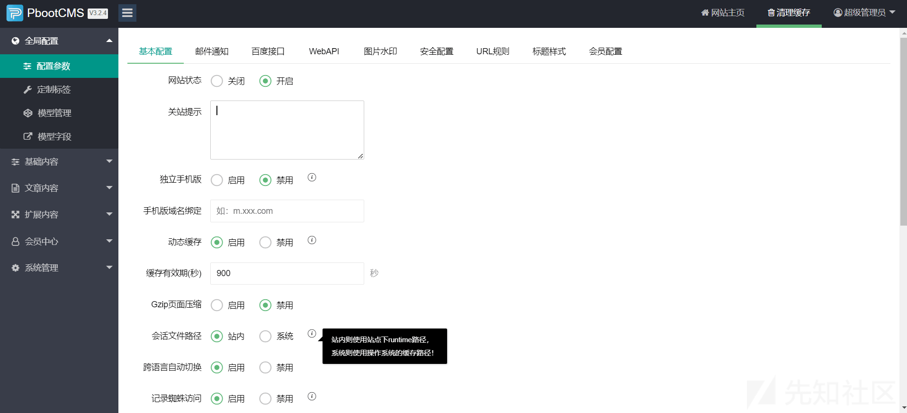](https://xzfile.aliyuncs.com/media/upload/picture/20240313175507-c5f940c8-e11f-1.png)

[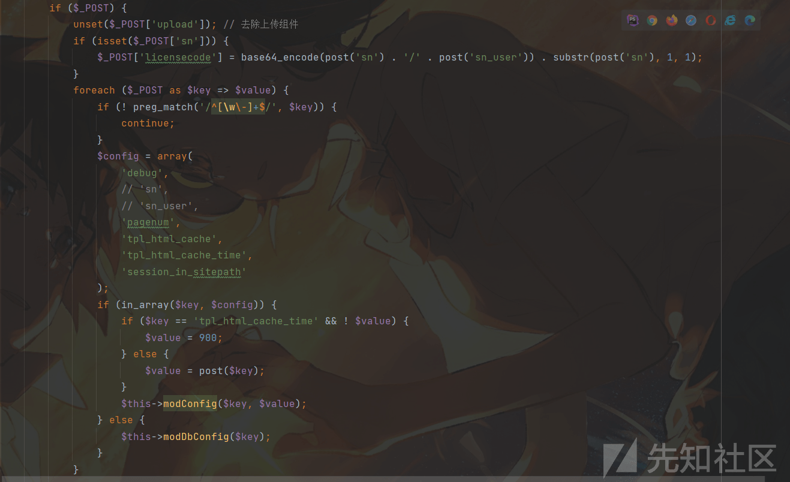](https://xzfile.aliyuncs.com/media/upload/picture/20240313175521-ce77afaa-e11f-1.png)

当在站点关键字处写入绕过了 `php` 的各种限制方法后，访问页面进行缓存的时候，会对页面进行解析，解析会执行 `copyright` 里面的 `php` 代码。

[](https://xzfile.aliyuncs.com/media/upload/picture/20240313175528-d22d4d12-e11f-1.png)

当开启缓存后，每次访问一个页面的时候都会来到 `View` 中，先通过主题是否存在的判断的，进而去判断 `/Runtime/complile` 中的文件是否存在，如果不存在，会重新通过 `compile` 函数进行解析编译后写入进去，在缓存解析中导致的 `php` 代码被执行。

[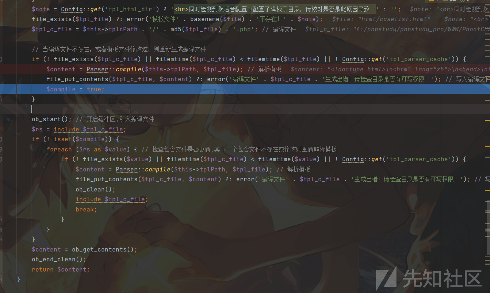](https://xzfile.aliyuncs.com/media/upload/picture/20240313175541-d9e8ebb0-e11f-1.png)

[](https://xzfile.aliyuncs.com/media/upload/picture/20240313175545-dc6632bc-e11f-1.png)
=======
[](https://xzfile.aliyuncs.com/media/upload/picture/20240313175507-c5f940c8-e11f-1.png)

[](https://xzfile.aliyuncs.com/media/upload/picture/20240313175521-ce77afaa-e11f-1.png)

当在站点关键字处写入绕过了 `php` 的各种限制方法后，访问页面进行缓存的时候，会对页面进行解析，解析会执行 `copyright` 里面的 `php` 代码。

[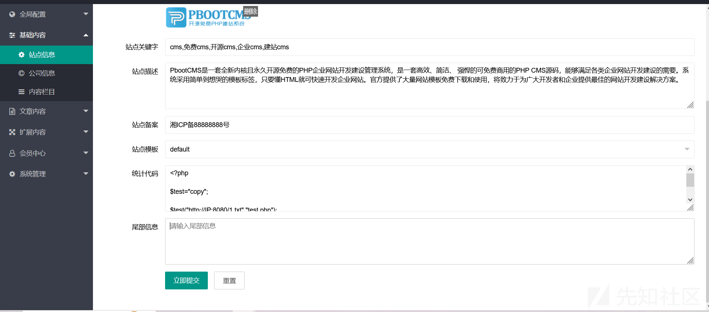](https://xzfile.aliyuncs.com/media/upload/picture/20240313175528-d22d4d12-e11f-1.png)

当开启缓存后，每次访问一个页面的时候都会来到 `View` 中，先通过主题是否存在的判断的，进而去判断 `/Runtime/complile` 中的文件是否存在，如果不存在，会重新通过 `compile` 函数进行解析编译后写入进去，在缓存解析中导致的 `php` 代码被执行。

[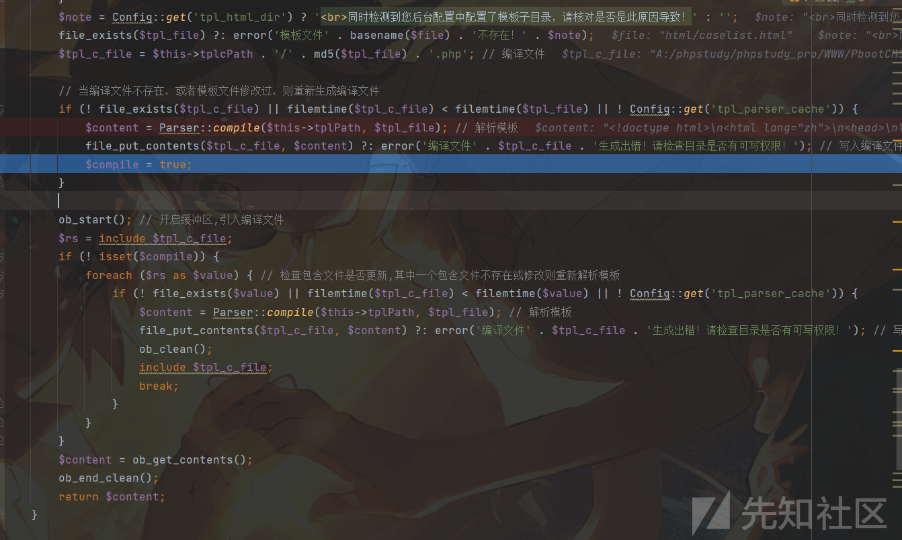](https://xzfile.aliyuncs.com/media/upload/picture/20240313175541-d9e8ebb0-e11f-1.png)

[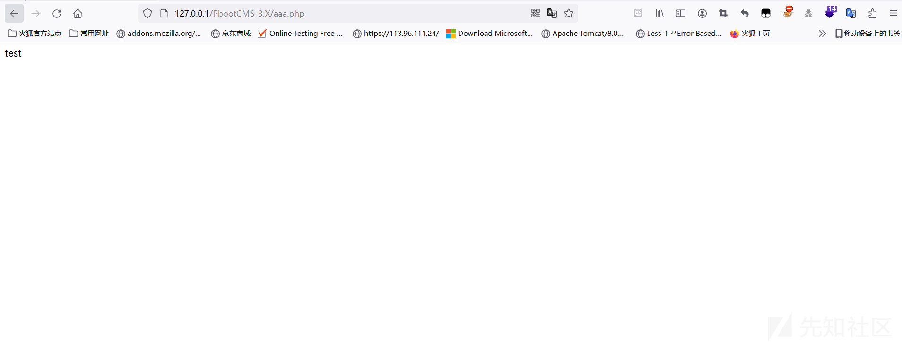](https://xzfile.aliyuncs.com/media/upload/picture/20240313175545-dc6632bc-e11f-1.png)
>>>>>>> 4992f5f682bf7aa8873ceb2495ac1d2a8296850f

# 文件上传 (暂未找到)

`PbootCMS` 在对文件上传的把控十分严密，这里暂时没有发现，但是说下方法，采取了`黑名单` + `白名单`的形式，它在 `config.php` 中定义了白名单 `format`，通过数组的形式分成了多文件和单文件处理，但是其实都是进入到 `handle_upload` 中。

<<<<<<< HEAD
[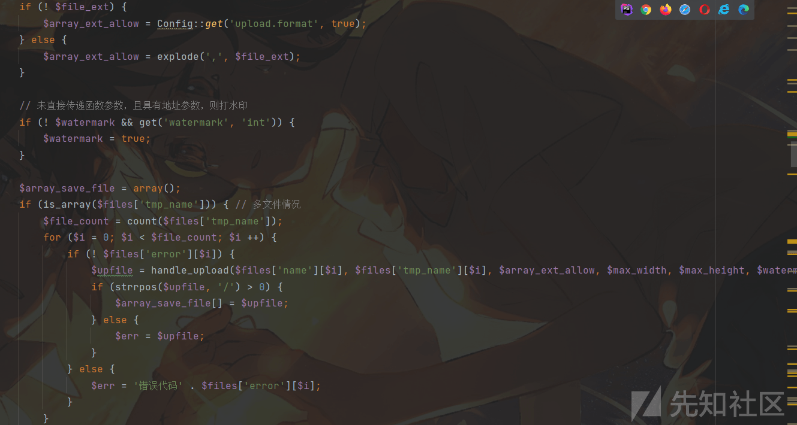](https://xzfile.aliyuncs.com/media/upload/picture/20240313175551-e012b3e0-e11f-1.png)

[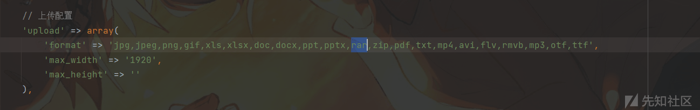](https://xzfile.aliyuncs.com/media/upload/picture/20240313175556-e328d974-e11f-1.png)

通过 `end` 取出最后一个`.` 后的内容，进行白名单的匹配后，再进行了一轮黑名单的匹配，最后再将文件名重命名了，以静态主路径 + 日期随机的形式命名了文件存储，所以这里跨越目录的文件上传和直接上传后缀名文件的形式就不可取了。

```plain
=======
[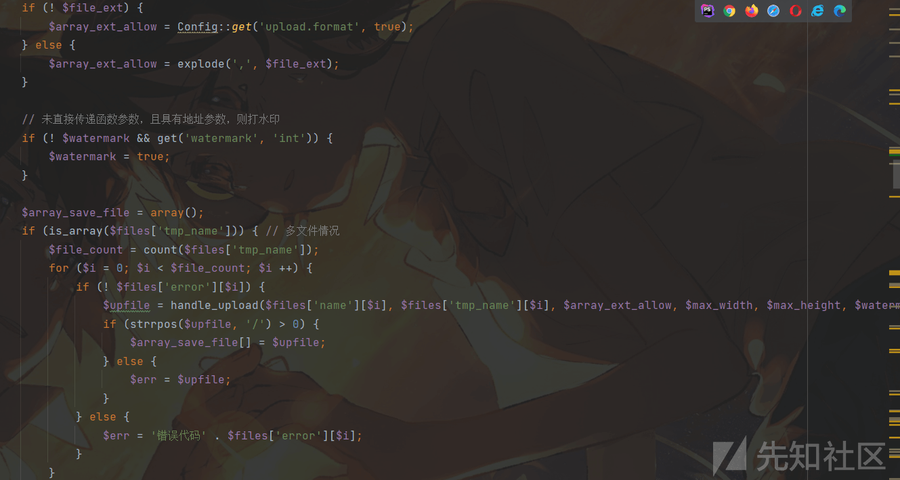](https://xzfile.aliyuncs.com/media/upload/picture/20240313175551-e012b3e0-e11f-1.png)

[](https://xzfile.aliyuncs.com/media/upload/picture/20240313175556-e328d974-e11f-1.png)

通过 `end` 取出最后一个`.` 后的内容，进行白名单的匹配后，再进行了一轮黑名单的匹配，最后再将文件名重命名了，以静态主路径 + 日期随机的形式命名了文件存储，所以这里跨越目录的文件上传和直接上传后缀名文件的形式就不可取了。

```bash
>>>>>>> 4992f5f682bf7aa8873ceb2495ac1d2a8296850f
function handle_upload($file, $temp, $array_ext_allow, $max_width, $max_height, $watermark)
{
    $save_path = DOC_PATH . STATIC_DIR . '/upload';
    $file = explode('.', $file); // 分离文件名及扩展
    $file_ext = strtolower(end($file)); // 获取扩展
    if (! in_array($file_ext, $array_ext_allow)) {
        return $file_ext . '格式的文件不允许上传！';
    }
    $black = array(
        'php',
        'jsp',
        'asp',
        'vb',
        'exe',
        'sh',
        'cmd',
        'bat',
        'vbs',
        'phtml',
        'class',
        'php2',
        'php3',
        'php4',
        'php5'
    );
    if (in_array($file_ext, $black)) {
        return $file_ext . '格式的文件不允许上传！';
    }
    $image = array(
        'png',
        'jpg',
        'gif',
        'bmp'
    );
    $file = array(
        'ppt',
        'pptx',
        'xls',
        'xlsx',
        'doc',
        'docx',
        'pdf',
        'txt'
    );
    if (in_array($file_ext, $image)) {
        $file_type = 'image';
    } elseif (in_array($file_ext, $file)) {
        $file_type = 'file';
    } else {
        $file_type = 'other';
    }
    if (! check_dir($save_path . '/' . $file_type . '/' . date('Ymd'), true)) {
        return '存储目录创建失败！';
    }
    $file_path = $save_path . '/' . $file_type . '/' . date('Ymd') . '/' . time() . mt_rand(100000, 999999) . '.' . $file_ext;
    if (! move_uploaded_file($temp, $file_path)) { // 从缓存中转存
        return '从缓存中转存失败！';
    }
    $save_file = str_replace(ROOT_PATH, '', $file_path); // 获取文件站点路径
    if (is_image($file_path)) {
        if (($reset = resize_img($file_path, $file_path, $max_width, $max_height)) !== true) {
            return $reset;
        }
        if ($watermark) {
            watermark_img($file_path);
        }
    }
    return $save_file;
}
```

> 这里是支持压缩文件的上传，所以如果存在能够触发 `phar` 的一些函数，再加上反序列化的链子，或者存在文件包含的这种情况能够包含图片，可能都能够进行 `RCE`，先记着。

同样，在它的附属插件 `UEditor` 中也做的比较严密，直接从 `config.json` 静态设置中获取 `$config` 的配置，最终进入到实例化 `Uploader` 方法中，`Uploader` 取的数据之后，会对传入的文件获取各种信息。

<<<<<<< HEAD
[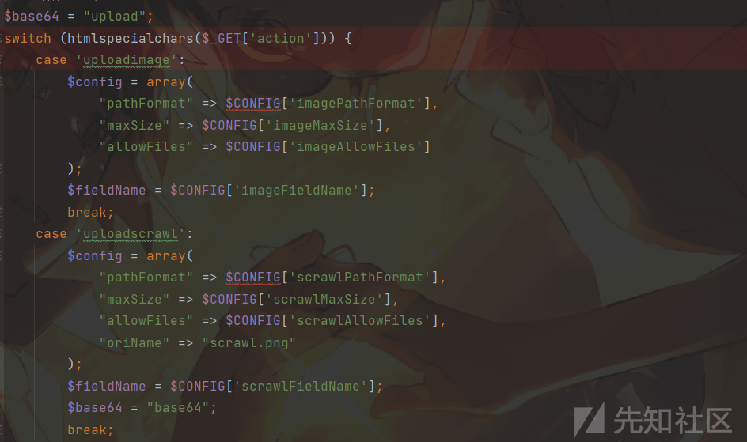](https://xzfile.aliyuncs.com/media/upload/picture/20240313175609-ea936e04-e11f-1.png)

一般直接本地上传图片主要处理方法是 `upFile`，这里会对文件进行 `getFileExt` 操作，`getFileExt` 中的内容是 `strtolower(strrchr($this->oriName, '.'))`，获取最后一个`.` 的后缀，进而返回了后缀名，最后通过了 `in_array` 判断后缀名是否在白名单之中。

[](https://xzfile.aliyuncs.com/media/upload/picture/20240313175617-efd62226-e11f-1.png)

# 关于标签

`PbootCMS` 定义了很多渲染模板的标签，其中有一部分存在危险的属性，如 `{pboot:if}`，`{pboot:sql}`，除此之外，还有很多其它带危险的标签，如下：
=======
[](https://xzfile.aliyuncs.com/media/upload/picture/20240313175609-ea936e04-e11f-1.png)

一般直接本地上传图片主要处理方法是 `upFile`，这里会对文件进行 `getFileExt` 操作，`getFileExt` 中的内容是 `strtolower(strrchr($this->oriName, '.'))`，获取最后一个`.` 的后缀，进而返回了后缀名，最后通过了 `in_array` 判断后缀名是否在白名单之中。

[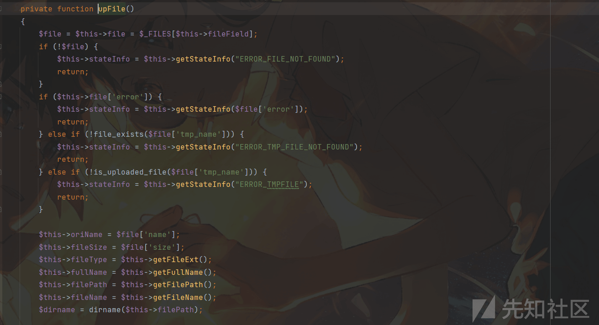](https://xzfile.aliyuncs.com/media/upload/picture/20240313175617-efd62226-e11f-1.png)

# 关于标签

`PbootCMS` 定义了很多渲染模板的标签，其中有一部分存在危险的属性，如 `{pboot:if}`，`{pboot:sql}`，除此之外，还有很多其它带危险的标签，如下：
>>>>>>> 4992f5f682bf7aa8873ceb2495ac1d2a8296850f

-   `{pboot:sql}` 标签用于在模板中执行 SQL 查询，并将查询结果作为变量存储在模板中，以便在页面中使用。
-   `{pboot:eval}`：用于执行任意的 PHP 代码，如果不加以限制和过滤，可能导致代码注入漏洞。
-   `{pboot:include}`：用于包含其他模板文件或外部文件，如果包含的文件不受信任或未经验证，可能导致包含任意文件漏洞。
-   `{pboot:php}`：类似于 `{pboot:eval}`，用于执行 PHP 代码，同样可能导致代码注入漏洞。
-   `{pboot:exec}`：用于执行系统命令，如果允许执行任意命令，可能导致命令注入漏洞。
-   `{pboot:foreach}`：循环标签，如果循环次数不受限制，可能导致服务器资源耗尽或拒绝服务攻击。
-   `{pboot:assign}`：用于给变量赋值，如果允许动态赋值或者赋值内容不受限制，可能导致变量覆盖或数据篡改。

在上面的 `post` 方法中，所有请求的参数都会经过这个参数的处理，在这个方法的下面，会对 `poboot:if` 和 `pboot:sql` 标签进行了转换，使得标签在代码处理过程中失效，最后在输出到页面的时候又转了回来。

<<<<<<< HEAD
[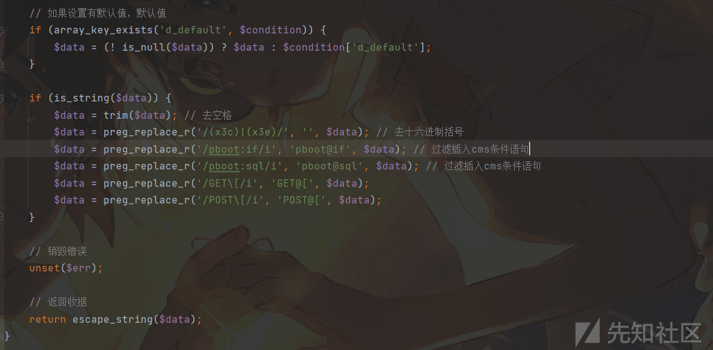](https://xzfile.aliyuncs.com/media/upload/picture/20240313175631-f7a4eb5e-e11f-1.png)

同时在进行数据库的查询，插入等操作的时候，也会出现进一步的替换过滤，这就导致了即使尝试使用`数组`传参绕过了第一层的过滤，第二层遍历取出的时候，还是会被过滤掉，在使用`二层数组`的时候，最终取出的值变成了 `Array`，导致了似乎没法绕过，所以只能把目标放在其它的模板方法中。

[](https://xzfile.aliyuncs.com/media/upload/picture/20240313175637-fb6959f0-e11f-1.png)

在 `ParserController.php` 中，可以看到每次请求页面时，渲染解析的标签，并没有找到能够达到命令执行效果的标签，当然除了先前的 `if` 等标签，而且之前所有解析标签进入的 `eval` 等能够进行代码执行的函数都已经被去除了。

[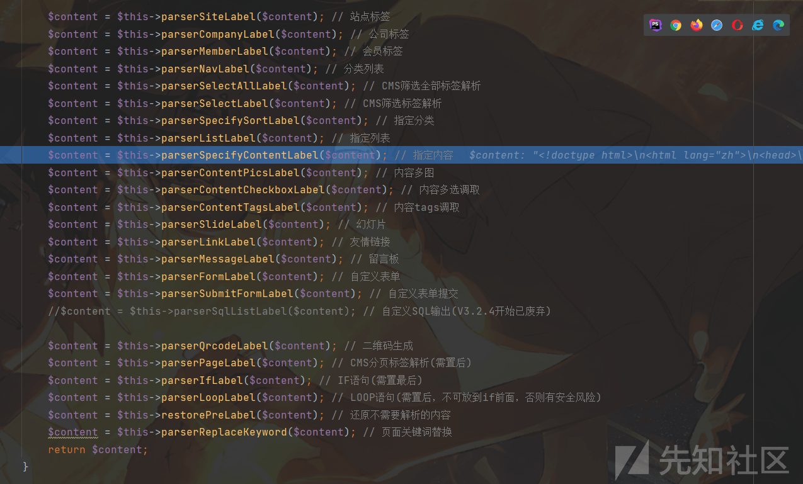](https://xzfile.aliyuncs.com/media/upload/picture/20240313175643-ff232c92-e11f-1.png)

像 `if` 标签等等的各种解析，也都是通过正则替换从而写入了 `php` 代码的内容达到了渲染的效果。

[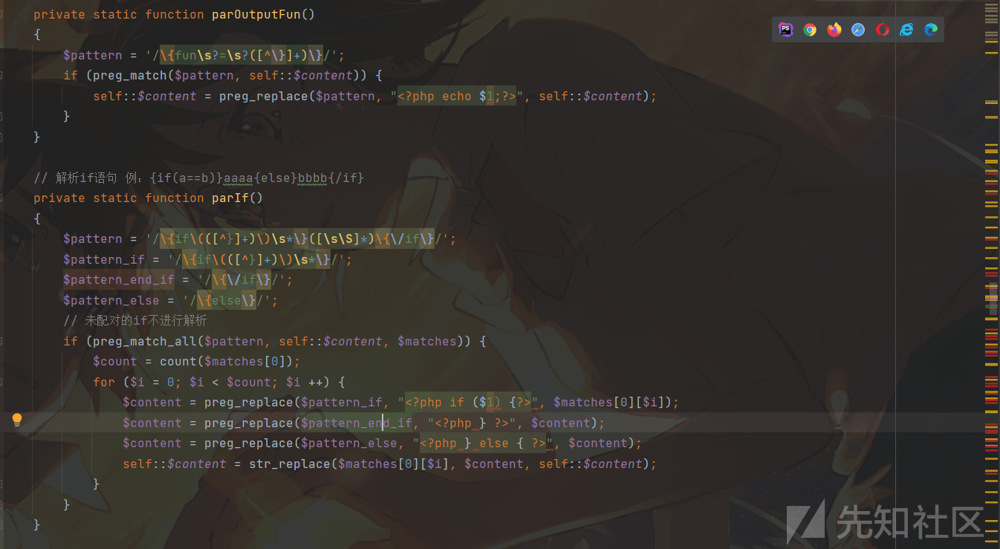](https://xzfile.aliyuncs.com/media/upload/picture/20240313175652-042f900e-e120-1.png)
=======
[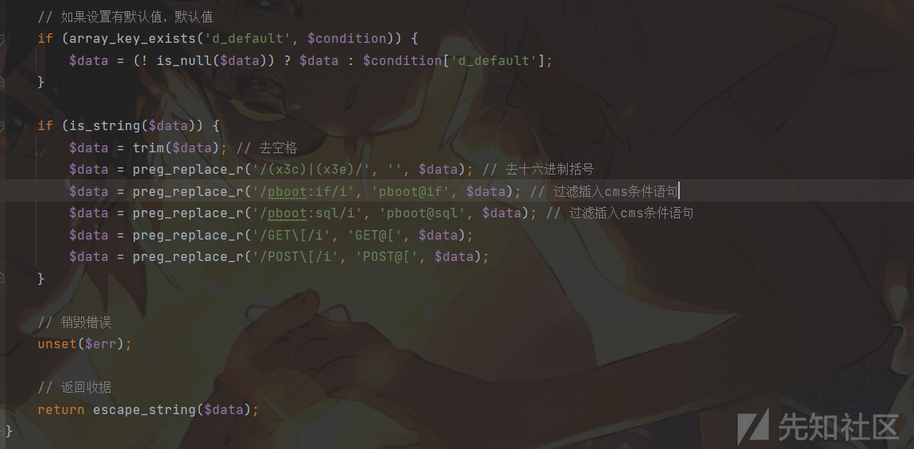](https://xzfile.aliyuncs.com/media/upload/picture/20240313175631-f7a4eb5e-e11f-1.png)

同时在进行数据库的查询，插入等操作的时候，也会出现进一步的替换过滤，这就导致了即使尝试使用`数组`传参绕过了第一层的过滤，第二层遍历取出的时候，还是会被过滤掉，在使用`二层数组`的时候，最终取出的值变成了 `Array`，导致了似乎没法绕过，所以只能把目标放在其它的模板方法中。

[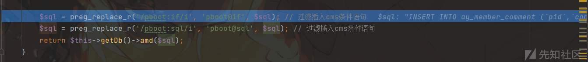](https://xzfile.aliyuncs.com/media/upload/picture/20240313175637-fb6959f0-e11f-1.png)

在 `ParserController.php` 中，可以看到每次请求页面时，渲染解析的标签，并没有找到能够达到命令执行效果的标签，当然除了先前的 `if` 等标签，而且之前所有解析标签进入的 `eval` 等能够进行代码执行的函数都已经被去除了。

[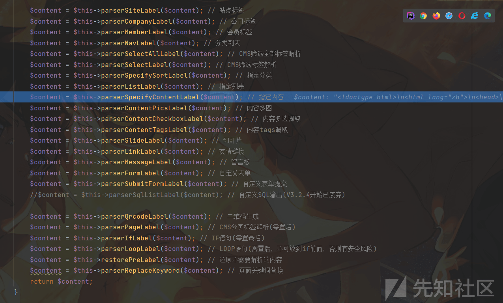](https://xzfile.aliyuncs.com/media/upload/picture/20240313175643-ff232c92-e11f-1.png)

像 `if` 标签等等的各种解析，也都是通过正则替换从而写入了 `php` 代码的内容达到了渲染的效果。

[](https://xzfile.aliyuncs.com/media/upload/picture/20240313175652-042f900e-e120-1.png)
>>>>>>> 4992f5f682bf7aa8873ceb2495ac1d2a8296850f

# 总结

因为整个 CMS 已经经过了很多版的迭代和各类漏洞的修复，所以各方面的参数接收过滤都做的比较全面，代码看了差不多一天，模仿了很多前面的一些标签模板注入问题进行了黑盒尝试，也没有什么巨大收获，但是我觉得类似于标签的地方还是有可为之处，累了，等待其它师傅的新发现吧。
