<<<<<<< HEAD
---
title: Quasar RAT 客户端木马执行流程逆向分析 - 先知社区
url: https://xz.aliyun.com/t/14073
clipped_at: 2024-03-20 09:42:46
category: default
tags: 
 - xz.aliyun.com
---
=======
>>>>>>> 4992f5f682bf7aa8873ceb2495ac1d2a8296850f


# Quasar RAT 客户端木马执行流程逆向分析 - 先知社区

<<<<<<< HEAD
=======
Quasar RAT 客户端木马执行流程逆向分析

- - -

>>>>>>> 4992f5f682bf7aa8873ceb2495ac1d2a8296850f
# 前言

近期准备编写系列文章多维度的记录几个应用广泛且功能成熟的开源远控框架，系列文章内容包括基本执行流程、加解密技术剖析、入侵检测（流量、主机两方面）。将 QuasarRAT 作为第一个分析对象，一是有源代码且更新频繁，逆向分析困难时可以有源码参考，二是其常被各类 APT 组织广泛应用，修改、编译后作为最终远控载荷用于网络攻击活动。

# 背景

QuasarRAT 是一款基于 C# 的开源远控工具，目前最新的版本为 1.4.1。从 GitHub 数据显示该工具受众人数很大，且维护人员多、更新较为频繁。

<<<<<<< HEAD
[](https://xzfile.aliyuncs.com/media/upload/picture/20240311123930-59acc0ee-df61-1.png)

在 2023 各厂商的年度 APT 报告中，QuasarRAT 多次出现，被诸多 APT 组织用于网络攻击活动。

[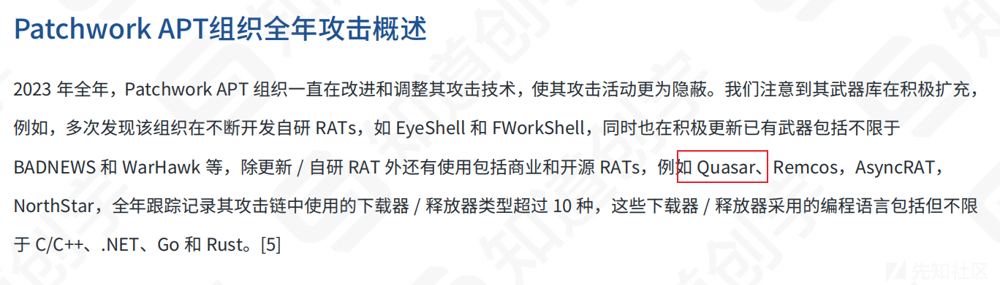](https://xzfile.aliyuncs.com/media/upload/picture/20240311123939-5ec9ff4c-df61-1.png)

[](https://xzfile.aliyuncs.com/media/upload/picture/20240311123943-613c6026-df61-1.png)
=======
[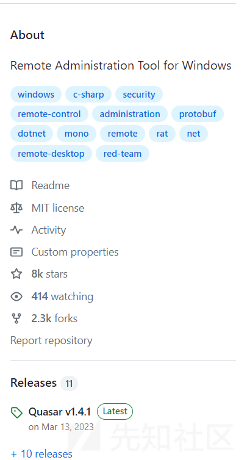](https://xzfile.aliyuncs.com/media/upload/picture/20240311123930-59acc0ee-df61-1.png)

在 2023 各厂商的年度 APT 报告中，QuasarRAT 多次出现，被诸多 APT 组织用于网络攻击活动。

[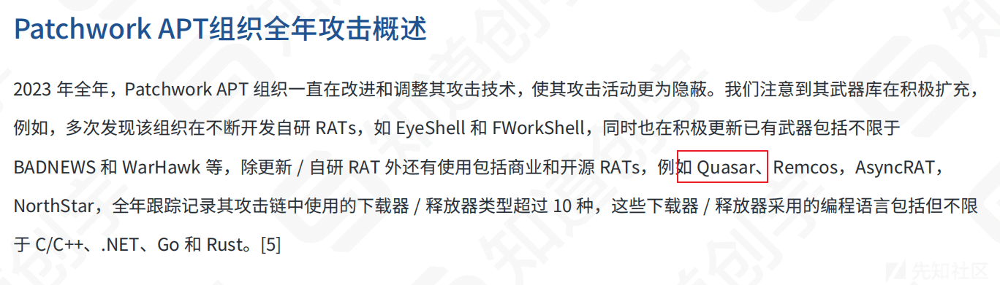](https://xzfile.aliyuncs.com/media/upload/picture/20240311123939-5ec9ff4c-df61-1.png)

[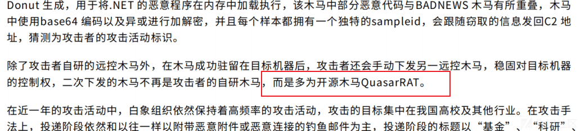](https://xzfile.aliyuncs.com/media/upload/picture/20240311123943-613c6026-df61-1.png)
>>>>>>> 4992f5f682bf7aa8873ceb2495ac1d2a8296850f

接下来就进入正题。

# 简单应用示例

下载解压后首次运行，将出现一个证书创建窗口，用于创建保护服务器和客户端之间通信所需的服务器证书，可以创建或导入证书。

<<<<<<< HEAD
[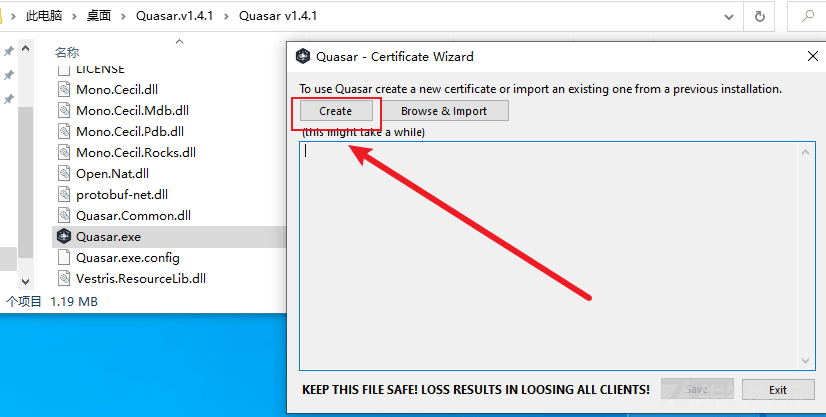](https://xzfile.aliyuncs.com/media/upload/picture/20240311123955-687a2404-df61-1.png)

点击 Create 再保存，备份创建的 quasar.p12 证书文件，如果没有有效的证书备份，现有客户端将无法连接到服务器。

```plain
=======
[](https://xzfile.aliyuncs.com/media/upload/picture/20240311123955-687a2404-df61-1.png)

点击 Create 再保存，备份创建的 quasar.p12 证书文件，如果没有有效的证书备份，现有客户端将无法连接到服务器。

```bash
>>>>>>> 4992f5f682bf7aa8873ceb2495ac1d2a8296850f
[Subject]
  CN=Quasar Server CA
[Issuer]
  CN=Quasar Server CA
[Serial Number]
  008E92AF0296D813D6804DB771DA8881
[Not Before]
  2024/2/28 10:58:17
[Not After]
  9999/12/31 23:59:59
[Thumbprint]
  2DFA8B63C594E51820CA27FFD133454ED8ED4558
```

<<<<<<< HEAD
[](https://xzfile.aliyuncs.com/media/upload/picture/20240311124007-6f9b3ef8-df61-1.png)

“setting” 栏配置服务端监听端口。

[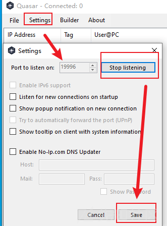](https://xzfile.aliyuncs.com/media/upload/picture/20240311124012-728a38ee-df61-1.png)

“builder” 栏配置远控客户端。
=======
[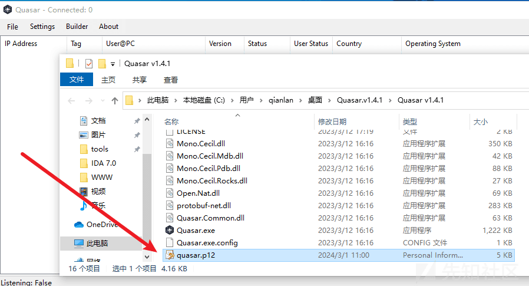](https://xzfile.aliyuncs.com/media/upload/picture/20240311124007-6f9b3ef8-df61-1.png)

“setting”栏配置服务端监听端口。

[](https://xzfile.aliyuncs.com/media/upload/picture/20240311124012-728a38ee-df61-1.png)

“builder”栏配置远控客户端。
>>>>>>> 4992f5f682bf7aa8873ceb2495ac1d2a8296850f

-   basic settings，客户端标签、进程互斥体、无人值守模式。
-   connection setting，客户端回连目标 IP:PORT、重连延迟。
-   installation setting，客户端安装位置、自启动。
-   Assembly icon，修改客户端文件图标。
-   Monitoring settings，键盘记录设置。  
    详细配置可见[官方文档](https://github.com/quasar/Quasar/wiki/Client-deployment-settings)

<<<<<<< HEAD
[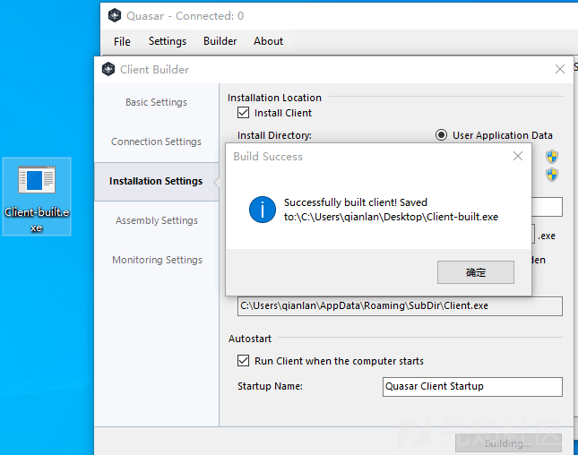](https://xzfile.aliyuncs.com/media/upload/picture/20240311124020-77788892-df61-1.png)

放入可互通的测试机器即可上线。

[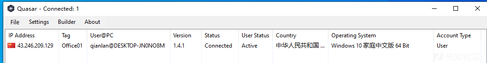](https://xzfile.aliyuncs.com/media/upload/picture/20240311124027-7bedfe2a-df61-1.png)
=======
[](https://xzfile.aliyuncs.com/media/upload/picture/20240311124020-77788892-df61-1.png)

放入可互通的测试机器即可上线。

[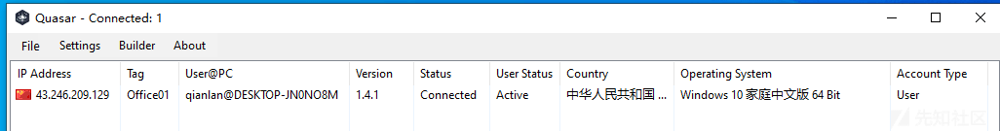](https://xzfile.aliyuncs.com/media/upload/picture/20240311124027-7bedfe2a-df61-1.png)
>>>>>>> 4992f5f682bf7aa8873ceb2495ac1d2a8296850f

# 逆向分析

### 一、混淆去除

用 dnspy 打开生成的客户端，发现是带混淆的，需要做去混淆操作，可以使用 [NETReactorSlayer](https://github.com/SychicBoy/NETReactorSlayer?tab=readme-ov-file)。

<<<<<<< HEAD
[](https://xzfile.aliyuncs.com/media/upload/picture/20240311124039-8299ca88-df61-1.png)

解混淆后就利索了。

[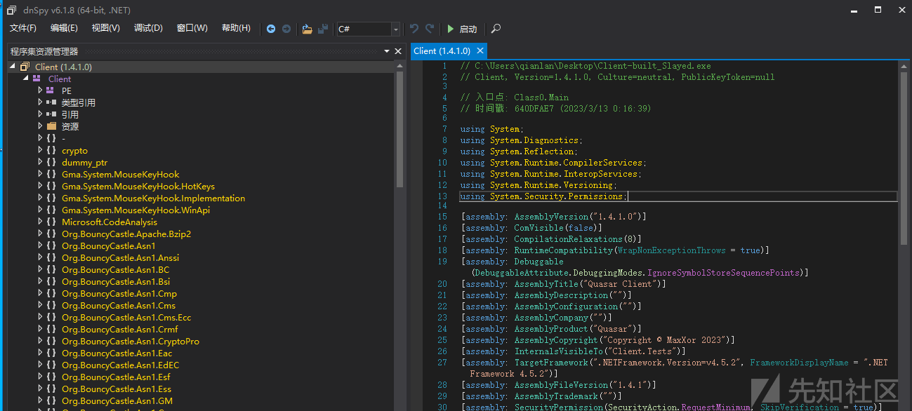](https://xzfile.aliyuncs.com/media/upload/picture/20240311124044-85cbf014-df61-1.png)
=======
[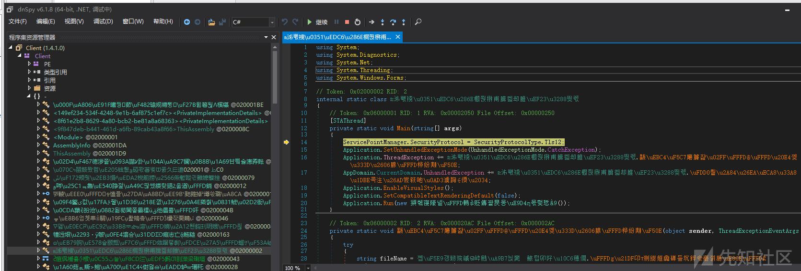](https://xzfile.aliyuncs.com/media/upload/picture/20240311124039-8299ca88-df61-1.png)

解混淆后就利索了。

[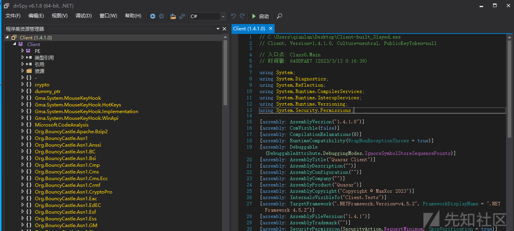](https://xzfile.aliyuncs.com/media/upload/picture/20240311124044-85cbf014-df61-1.png)
>>>>>>> 4992f5f682bf7aa8873ceb2495ac1d2a8296850f

### 二、执行流程分析

#### 1\. 函数入口

定位到函数入口点如下图。函数定义了安全协议（TLS1.2）、异常处理方式和窗体样式，然后启动了窗体应用程序的主运行循环。

<<<<<<< HEAD
[](https://xzfile.aliyuncs.com/media/upload/picture/20240311124057-8d6c0976-df61-1.png)
=======
[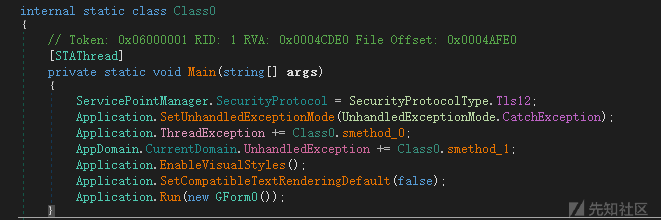](https://xzfile.aliyuncs.com/media/upload/picture/20240311124057-8d6c0976-df61-1.png)
>>>>>>> 4992f5f682bf7aa8873ceb2495ac1d2a8296850f

main 函数在末尾调用了 Application.Run (new GForm0 ())，可见程序是一个窗体应用程序（WinForms 框架），运行一个名为 GForm0 的窗体，这是应用程序的主窗体类。

#### 2\. 部署初始化

程序做密钥派生、字符串解码等、文件管理、互斥体等执行初始化。

<<<<<<< HEAD
[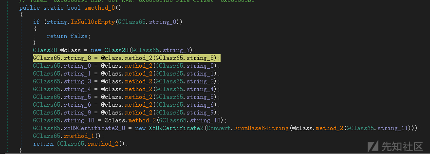](https://xzfile.aliyuncs.com/media/upload/picture/20240311124309-dc89ed8e-df61-1.png)
=======
[](https://xzfile.aliyuncs.com/media/upload/picture/20240311124309-dc89ed8e-df61-1.png)
>>>>>>> 4992f5f682bf7aa8873ceb2495ac1d2a8296850f

##### 2.1 密钥派生

基于服务端创建时的初始指纹，通过密钥派生函数（PBKDF2）以及固定盐值（byte\_2）生成两个密钥，一个长度为 32 字节，另一个长度为 64 字节。

<<<<<<< HEAD
[](https://xzfile.aliyuncs.com/media/upload/picture/20240311124321-e33c7020-df61-1.png)

固定盐值硬编码在样本中。

[](https://xzfile.aliyuncs.com/media/upload/picture/20240311124325-e5e7c072-df61-1.png)

生成密钥。

[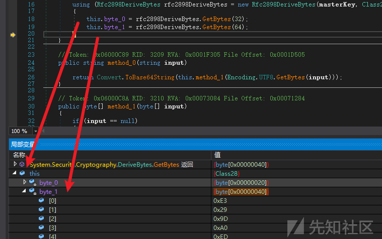](https://xzfile.aliyuncs.com/media/upload/picture/20240311124331-e95db52c-df61-1.png)

```plain
=======
[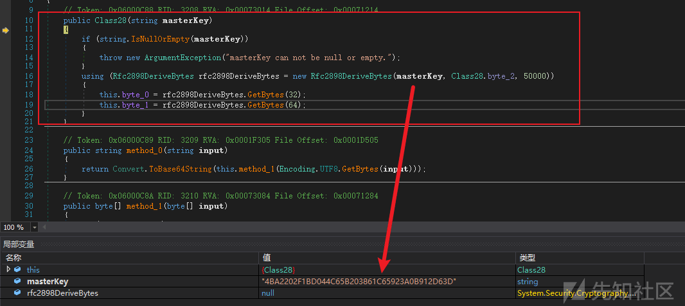](https://xzfile.aliyuncs.com/media/upload/picture/20240311124321-e33c7020-df61-1.png)

固定盐值硬编码在样本中。

[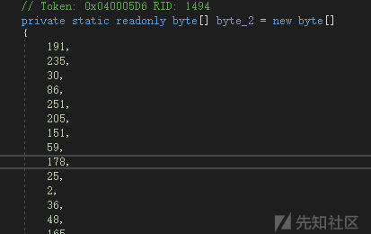](https://xzfile.aliyuncs.com/media/upload/picture/20240311124325-e5e7c072-df61-1.png)

生成密钥。

[](https://xzfile.aliyuncs.com/media/upload/picture/20240311124331-e95db52c-df61-1.png)

```bash
>>>>>>> 4992f5f682bf7aa8873ceb2495ac1d2a8296850f
初始指纹
4BA2202F1BD044C65B203861C65923A0B912D63D
固定盐值
BFEB1E56FBCD973BB219022430A57843003D5644D21E62B9D4F180E7E6C33941
```

##### 2.2 字符解码

通过 AES 解密算法解密经过 Base64 编码的字符串。

<<<<<<< HEAD
[](https://xzfile.aliyuncs.com/media/upload/picture/20240311124355-f7a24012-df61-1.png)

解密外连 IP 和端口号。

[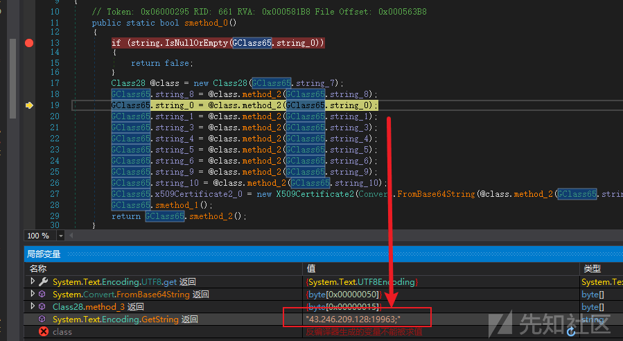](https://xzfile.aliyuncs.com/media/upload/picture/20240311124414-02e0a5a4-df62-1.png)

解密公钥证书文件，证书有效期到 1 万年。

[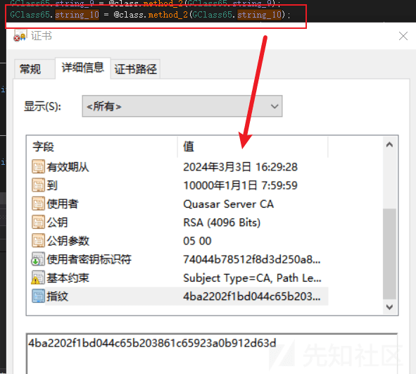](https://xzfile.aliyuncs.com/media/upload/picture/20240311124442-137ba4f4-df62-1.png)

依次解密字符、文件等入下

```plain
客户端标识，Office01
RAT版本信息，1.4.1
外连IP:port
=======
[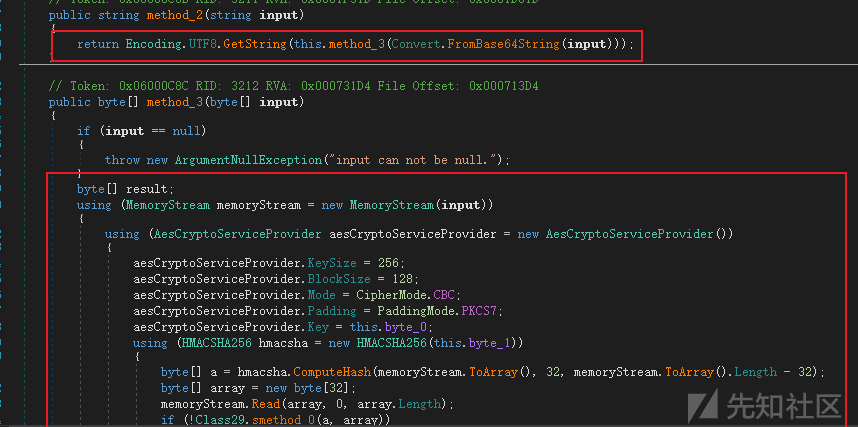](https://xzfile.aliyuncs.com/media/upload/picture/20240311124355-f7a24012-df61-1.png)

解密外连 IP 和端口号。

[](https://xzfile.aliyuncs.com/media/upload/picture/20240311124414-02e0a5a4-df62-1.png)

解密公钥证书文件，证书有效期到 1 万年。

[](https://xzfile.aliyuncs.com/media/upload/picture/20240311124442-137ba4f4-df62-1.png)

依次解密字符、文件等入下

```bash
客户端标识，Office01
RAT 版本信息，1.4.1
外连 IP:port
>>>>>>> 4992f5f682bf7aa8873ceb2495ac1d2a8296850f
文件路径名，SubDir
文件名，Client.exe
客户端唯一标识，a1b41ba4-4cfe-48a7-9f59-c3575aa6b70d
启动项名称，Quasar Client Startup
日志文件路径名，Logs
公钥证书文件。
```

##### 2.3 初始化相关路径

设置下载文件存储路径及日志路径，路径是在生成模块配置修改的。  
C:\\Users\\qianlan\\AppData\\Roaming\\Logs  
C:\\Users\\qianlan\\AppData\\Roaming\\SubDir\\Client.exe

<<<<<<< HEAD
[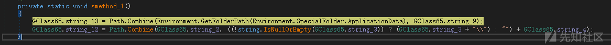](https://xzfile.aliyuncs.com/media/upload/picture/20240311124453-1a50615c-df62-1.png)
=======
[](https://xzfile.aliyuncs.com/media/upload/picture/20240311124453-1a50615c-df62-1.png)
>>>>>>> 4992f5f682bf7aa8873ceb2495ac1d2a8296850f

##### 2.4 公钥 HASH 校验

对证书指纹 byte 流做 SHA256 运算，对比已知 HASH 校验公钥。如果比对失败则退出程序  
第二个参数为 2.16.840.1.101.3.4.2.1，应该是哈希算法的名称或 OID。

<<<<<<< HEAD
[](https://xzfile.aliyuncs.com/media/upload/picture/20240311124504-209c2b54-df62-1.png)
=======
[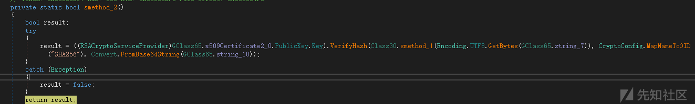](https://xzfile.aliyuncs.com/media/upload/picture/20240311124504-209c2b54-df62-1.png)
>>>>>>> 4992f5f682bf7aa8873ceb2495ac1d2a8296850f

##### 2.5 互斥体创建

检查是否已经有相同互斥体的进程在运行，确保只有一个实例在运行。如果已经有相同互斥体的进程在运行，当前实例退出。

这里验证的是唯一标识。（在客户端生成时定义的）。

<<<<<<< HEAD
[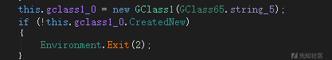](https://xzfile.aliyuncs.com/media/upload/picture/20240311124510-24675e98-df62-1.png)
=======
[](https://xzfile.aliyuncs.com/media/upload/picture/20240311124510-24675e98-df62-1.png)
>>>>>>> 4992f5f682bf7aa8873ceb2495ac1d2a8296850f

##### 2.6 删除文件区域标识

清除当前文件的 "Zone.Identifier" 数据流，这样可以避免一些安全策略导致的问题，尤其是当文件被从不受信任的区域运行时。

<<<<<<< HEAD
[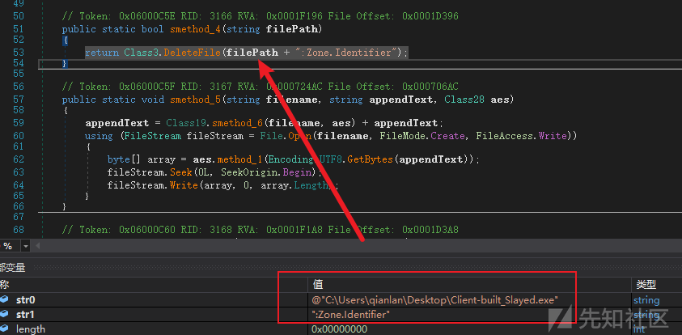](https://xzfile.aliyuncs.com/media/upload/picture/20240311124518-291505da-df62-1.png)
=======
[](https://xzfile.aliyuncs.com/media/upload/picture/20240311124518-291505da-df62-1.png)
>>>>>>> 4992f5f682bf7aa8873ceb2495ac1d2a8296850f

##### 2.7 启动项、文件属性等设置

创建了一个类的实例化对象，这个类包括开机启动项、文件管理以及隐藏等属性设置。这会根据在生成 PE 载荷时的配置是否执行。

<<<<<<< HEAD
[](https://xzfile.aliyuncs.com/media/upload/picture/20240311124523-2bed131a-df62-1.png)
=======
[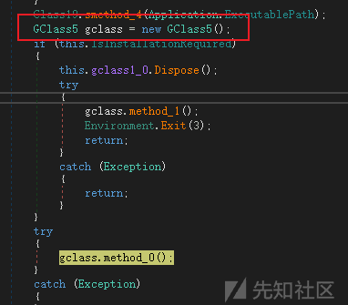](https://xzfile.aliyuncs.com/media/upload/picture/20240311124523-2bed131a-df62-1.png)
>>>>>>> 4992f5f682bf7aa8873ceb2495ac1d2a8296850f

##### 2.8 任务栏图标

出始化和配置系统托盘图标。

<<<<<<< HEAD
[](https://xzfile.aliyuncs.com/media/upload/picture/20240311124535-32fe5196-df62-1.png)
=======
[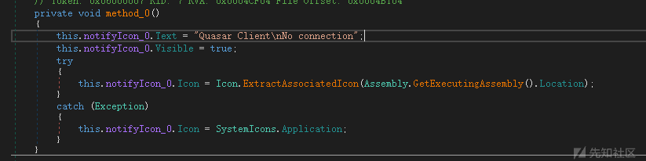](https://xzfile.aliyuncs.com/media/upload/picture/20240311124535-32fe5196-df62-1.png)
>>>>>>> 4992f5f682bf7aa8873ceb2495ac1d2a8296850f

#### 3\. 通讯初始化

创建了 QuasarClient 类实例化对象，参数包括外连 IP:PORT，服务端公钥（证书）。

<<<<<<< HEAD
[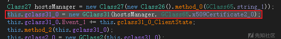](https://xzfile.aliyuncs.com/media/upload/picture/20240311124542-3780e918-df62-1.png)

创建化消息处理器对象，以处理服务器下发的各种功能指令。

[](https://xzfile.aliyuncs.com/media/upload/picture/20240311124605-45558e5e-df62-1.png)
=======
[](https://xzfile.aliyuncs.com/media/upload/picture/20240311124542-3780e918-df62-1.png)

创建化消息处理器对象，以处理服务器下发的各种功能指令。

[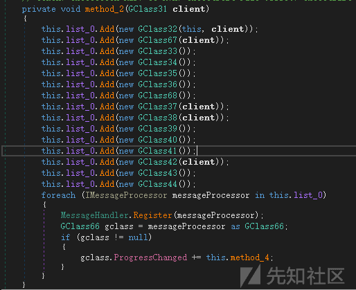](https://xzfile.aliyuncs.com/media/upload/picture/20240311124605-45558e5e-df62-1.png)
>>>>>>> 4992f5f682bf7aa8873ceb2495ac1d2a8296850f

##### 3.1 判断客户端连接状态

设定一个变量用于标识客户端是否已经完成身份验证，并在连接或者断开的状态切换变量对应值。

<<<<<<< HEAD
[](https://xzfile.aliyuncs.com/media/upload/picture/20240311124620-4dd14ffa-df62-1.png)
=======
[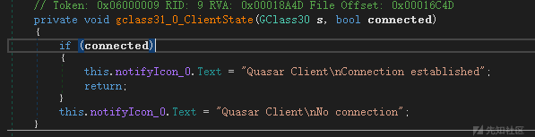](https://xzfile.aliyuncs.com/media/upload/picture/20240311124620-4dd14ffa-df62-1.png)
>>>>>>> 4992f5f682bf7aa8873ceb2495ac1d2a8296850f

##### 3.2 心跳线程初始化

创建了心跳包实例。

<<<<<<< HEAD
[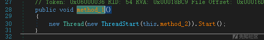](https://xzfile.aliyuncs.com/media/upload/picture/20240311124636-576ec13c-df62-1.png)

同时定义了部分 HTTP 参数。

[](https://xzfile.aliyuncs.com/media/upload/picture/20240311124643-5b9cdf14-df62-1.png)

```plain
=======
[](https://xzfile.aliyuncs.com/media/upload/picture/20240311124636-576ec13c-df62-1.png)

同时定义了部分 HTTP 参数。

[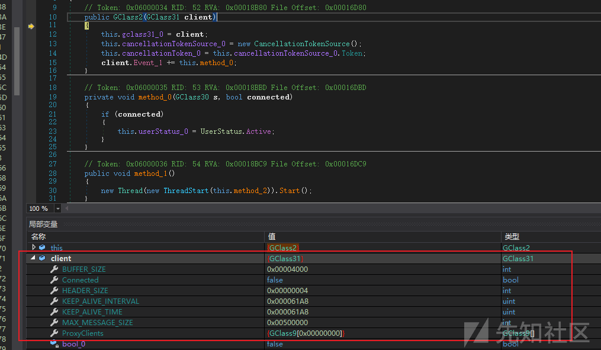](https://xzfile.aliyuncs.com/media/upload/picture/20240311124643-5b9cdf14-df62-1.png)

```bash
>>>>>>> 4992f5f682bf7aa8873ceb2495ac1d2a8296850f
BUFFER_SIZE 0x00004000
Connected   false
HEADER_SIZE 0x00000004
KEEP_ALIVE_INTERVAL 0x000061A8
KEEP_ALIVE_TIME 0x000061A8
MAX_MESSAGE_SIZE    0x00500000
ProxyClients    {GClass9[0x00000000]}
```

##### 3.3 创建新线程连接服务端

创建一个新线程循环连接客户端。

<<<<<<< HEAD
[](https://xzfile.aliyuncs.com/media/upload/picture/20240311124716-6f87b954-df62-1.png)
=======
[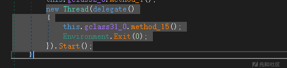](https://xzfile.aliyuncs.com/media/upload/picture/20240311124716-6f87b954-df62-1.png)
>>>>>>> 4992f5f682bf7aa8873ceb2495ac1d2a8296850f

###### 3.3.1 首次 TCP 连接建立

判断当前连接状态，若没有连接则解析之前解密的外连地址。

<<<<<<< HEAD
[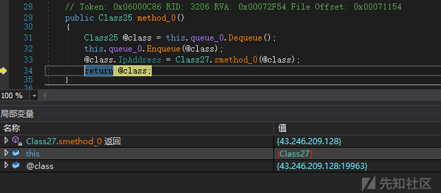](https://xzfile.aliyuncs.com/media/upload/picture/20240311124738-7c969f2a-df62-1.png)

执行连接请求模块。

[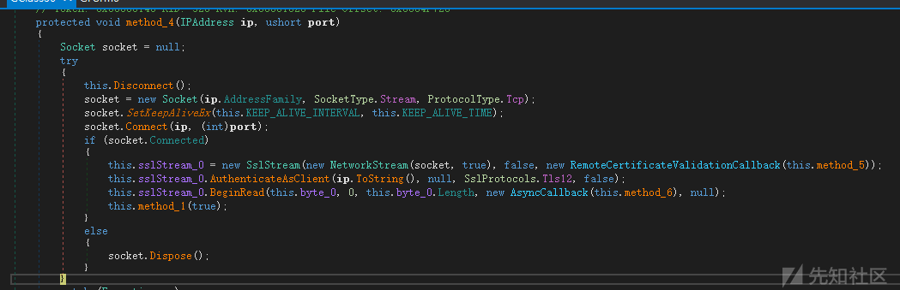](https://xzfile.aliyuncs.com/media/upload/picture/20240311124805-8cdd8e3e-df62-1.png)

在建立新连接之前，断开当前连接。随后创建一个新的 Socket 实例，连接到指定的 IP 地址和端口，完成 TCP 三次握手，建立 TCP 链接。

[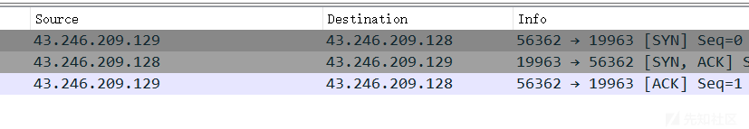](https://xzfile.aliyuncs.com/media/upload/picture/20240311124811-9024e02e-df62-1.png)  
=======
[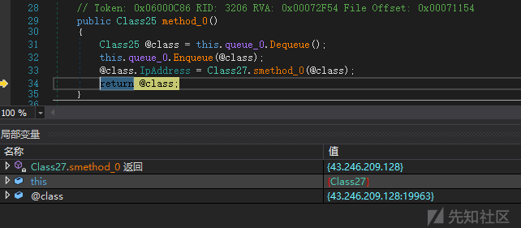](https://xzfile.aliyuncs.com/media/upload/picture/20240311124738-7c969f2a-df62-1.png)

执行连接请求模块。

[](https://xzfile.aliyuncs.com/media/upload/picture/20240311124805-8cdd8e3e-df62-1.png)

在建立新连接之前，断开当前连接。随后创建一个新的 Socket 实例，连接到指定的 IP 地址和端口，完成 TCP 三次握手，建立 TCP 链接。

[](https://xzfile.aliyuncs.com/media/upload/picture/20240311124811-9024e02e-df62-1.png)  
>>>>>>> 4992f5f682bf7aa8873ceb2495ac1d2a8296850f
如果连接成功 (socket.Connected)，则进行以下操作：

-   创建一个新的 SslStream 实例，用于在安全通道上进行通信。
-   在客户端模式下进行身份验证，使用 TLS 1.2 协议，不验证服务器证书。
-   异步开始读取数据，调用 method\_1 处理连接建立成功的逻辑。
-   修改连接状态。

TLS 交互通讯数据包如下。

<<<<<<< HEAD
[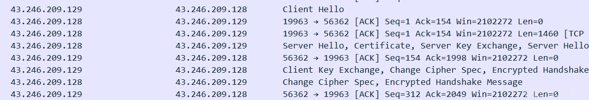](https://xzfile.aliyuncs.com/media/upload/picture/20240311124824-97b82c74-df62-1.png)
=======
[](https://xzfile.aliyuncs.com/media/upload/picture/20240311124824-97b82c74-df62-1.png)
>>>>>>> 4992f5f682bf7aa8873ceb2495ac1d2a8296850f

如果连接不成功，则释放 Socket 实例。  
随后断开 TCP 链接。

<<<<<<< HEAD
[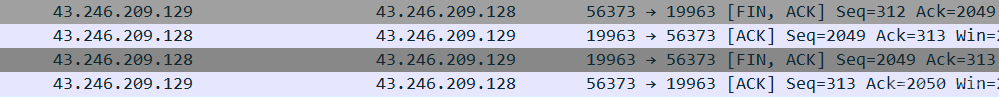](https://xzfile.aliyuncs.com/media/upload/picture/20240311124829-9b200828-df62-1.png)

###### 3.3.2 二次 TCP 连接建立，发送上线信息

初次链接断开后，程序会重新执行三次握手、TLS1.2 加密流程，和首次通讯不同的是，客户端异步执行 “GClass31\_ClientState” 搜集系统基本信息，包括包括操作系统版本、用户名，地理位置等等。作为上线信息。

[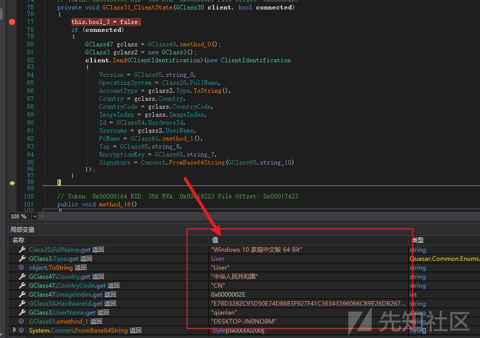](https://xzfile.aliyuncs.com/media/upload/picture/20240311124842-a2796588-df62-1.png)

TLS1.2 加密流量数据如下。

[](https://xzfile.aliyuncs.com/media/upload/picture/20240311124857-abb48704-df62-1.png)

可以看看服务端，经过解析后像用户展示上线信息。

[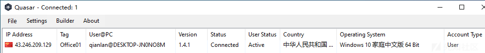](https://xzfile.aliyuncs.com/media/upload/picture/20240311124909-b2c98530-df62-1.png)
=======
[](https://xzfile.aliyuncs.com/media/upload/picture/20240311124829-9b200828-df62-1.png)

###### 3.3.2 二次 TCP 连接建立，发送上线信息

初次链接断开后，程序会重新执行三次握手、TLS1.2 加密流程，和首次通讯不同的是，客户端异步执行“GClass31\_ClientState”搜集系统基本信息，包括包括操作系统版本、用户名，地理位置等等。作为上线信息。

[](https://xzfile.aliyuncs.com/media/upload/picture/20240311124842-a2796588-df62-1.png)

TLS1.2 加密流量数据如下。

[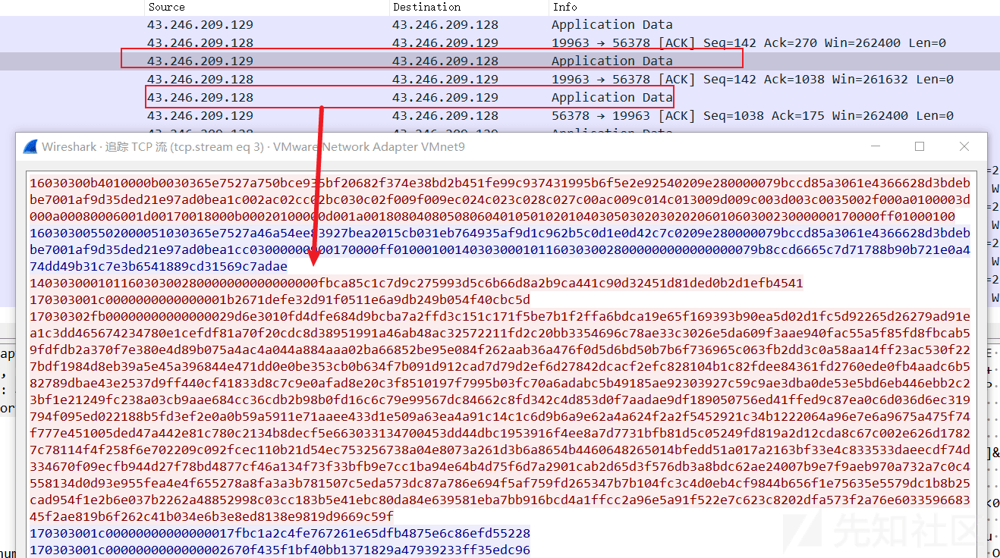](https://xzfile.aliyuncs.com/media/upload/picture/20240311124857-abb48704-df62-1.png)

可以看看服务端，经过解析后像用户展示上线信息。

[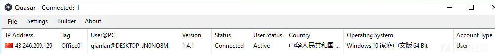](https://xzfile.aliyuncs.com/media/upload/picture/20240311124909-b2c98530-df62-1.png)
>>>>>>> 4992f5f682bf7aa8873ceb2495ac1d2a8296850f

###### 3.3.3 循环接收服务端下发指令并执行

在服务端下发一个 dir 指令获取当前路径的文件信息。

<<<<<<< HEAD
[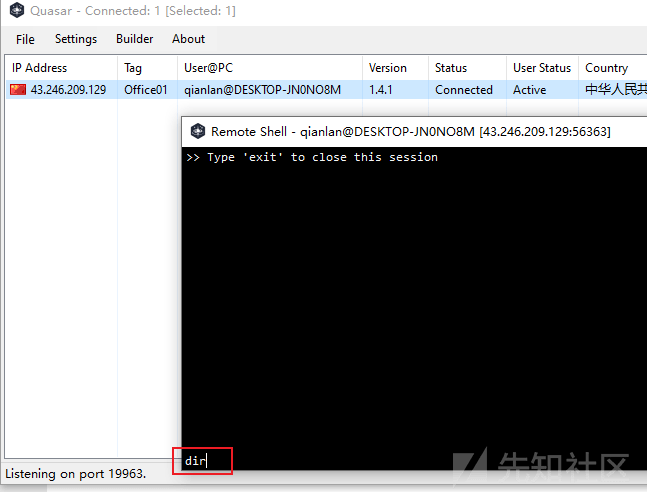](https://xzfile.aliyuncs.com/media/upload/picture/20240311124927-bdc6feea-df62-1.png)

在异步接收函数中断点，接收数据后，将返回收的字节数赋值给 num，再定义数组 array 接收指令。

[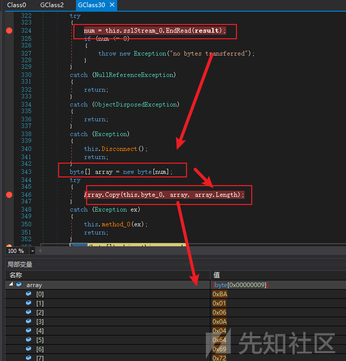](https://xzfile.aliyuncs.com/media/upload/picture/20240311124940-c522a284-df62-1.png)

查看对应内存空间可见是 dir 指令。

[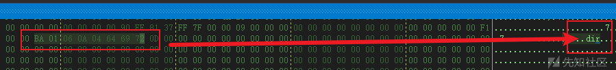](https://xzfile.aliyuncs.com/media/upload/picture/20240311124954-cd6e0a46-df62-1.png)

调用初始化的消息处理器（Message Processor）集合，在 Execute 方法中，它首先检查收到的消息是否为 DoShellExecute 类型。如果是，就调用 Execute 方法进行处理。在 Execute 方法内部，通过判断输入的命令内容，决定是创建一个新的 Shell 实例还是使用现有的实例，并调用 ExecuteCommand 方法执行相应的 Shell 命令。

[](https://files.mdnice.com/user/50139/ea9648c5-e5fb-48f1-a642-afd664162b9f.png)

客户端调用功能函数执行获取文件信息。

[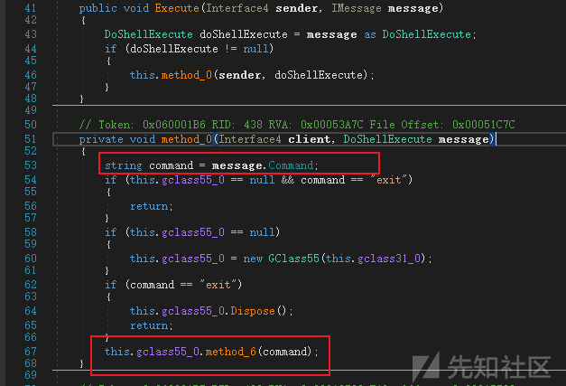](https://xzfile.aliyuncs.com/media/upload/picture/20240311125011-d7c38c78-df62-1.png)

逐行发送。

[](https://xzfile.aliyuncs.com/media/upload/picture/20240311125021-dd8e6eca-df62-1.png)

通讯流量如下。

[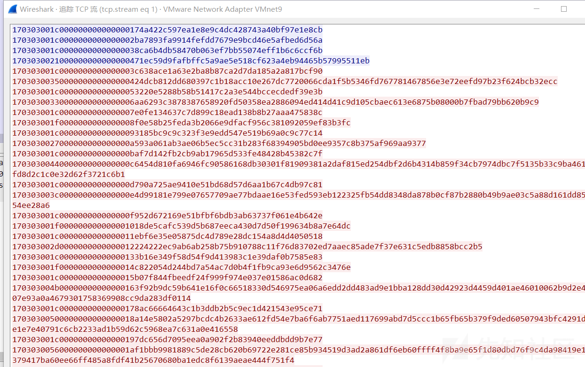](https://xzfile.aliyuncs.com/media/upload/picture/20240311125027-e1747e8a-df62-1.png)

执行结束后恢复等待 “ClientRead” 事件再次触发，循环接收指令并调用功能函数处理。
=======
[](https://xzfile.aliyuncs.com/media/upload/picture/20240311124927-bdc6feea-df62-1.png)

在异步接收函数中断点，接收数据后，将返回收的字节数赋值给 num，再定义数组 array 接收指令。

[](https://xzfile.aliyuncs.com/media/upload/picture/20240311124940-c522a284-df62-1.png)

查看对应内存空间可见是 dir 指令。

[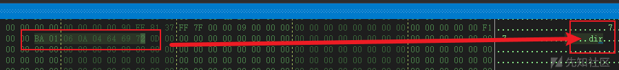](https://xzfile.aliyuncs.com/media/upload/picture/20240311124954-cd6e0a46-df62-1.png)

调用初始化的消息处理器（Message Processor）集合，在 Execute 方法中，它首先检查收到的消息是否为 DoShellExecute 类型。如果是，就调用 Execute 方法进行处理。在 Execute 方法内部，通过判断输入的命令内容，决定是创建一个新的 Shell 实例还是使用现有的实例，并调用 ExecuteCommand 方法执行相应的 Shell 命令。

[](https://files.mdnice.com/user/50139/ea9648c5-e5fb-48f1-a642-afd664162b9f.png)

客户端调用功能函数执行获取文件信息。

[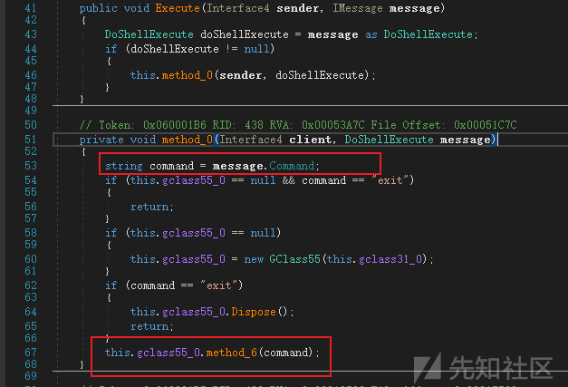](https://xzfile.aliyuncs.com/media/upload/picture/20240311125011-d7c38c78-df62-1.png)

逐行发送。

[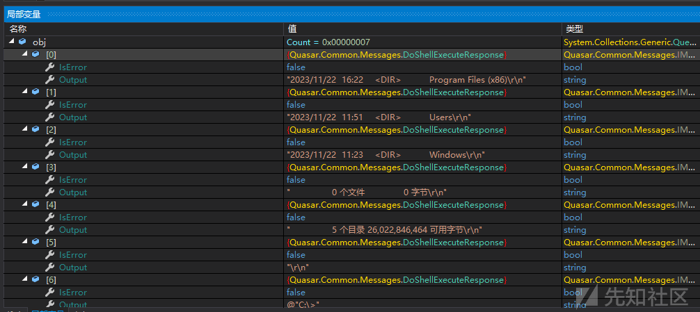](https://xzfile.aliyuncs.com/media/upload/picture/20240311125021-dd8e6eca-df62-1.png)

通讯流量如下。

[](https://xzfile.aliyuncs.com/media/upload/picture/20240311125027-e1747e8a-df62-1.png)

执行结束后恢复等待“ClientRead”事件再次触发，循环接收指令并调用功能函数处理。
>>>>>>> 4992f5f682bf7aa8873ceb2495ac1d2a8296850f

这就是客户端执行的基本流程了，部分指令执行结果的发送还比较折腾，但是挺有研究价值。

下一篇将对该木马样本的加解密技术做剖析，包括内存中的加解密行文，以及通讯流量的解密。
